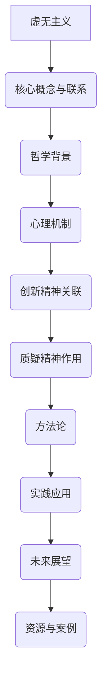

                 

### 《虚无主义与创新精神：在质疑中寻找突破》

在当今快速发展的科技时代，创新精神成为推动社会进步的重要动力。然而，创新并非总是一帆风顺，很多时候我们需要面对质疑与挑战。本文将以“虚无主义与创新精神：在质疑中寻找突破”为主题，探讨虚无主义哲学背景下的创新思维与质疑精神。

关键词：虚无主义、创新精神、质疑、突破

摘要：本文首先介绍了虚无主义的哲学基础，包括其起源、发展以及心理机制。接着，探讨了虚无主义与创新思维的关联，分析了质疑精神在创新过程中的作用。最后，本文通过具体案例展示了虚无主义与创新精神的实践应用，展望了其未来趋势。

# 第一部分：虚无主义的哲学基础

## 第1章：虚无主义的起源与发展

虚无主义作为一种哲学思想，起源于19世纪末的欧洲。其核心观点是对传统价值观念的否定，认为人类存在的意义和目的并无实质性的价值。虚无主义的兴起受到了当时社会动荡和战争的影响，特别是在两次世界大战期间，人们的信仰和价值观受到巨大冲击。

虚无主义的主要代表人物包括丹麦哲学家索伦·克尔凯郭尔（Søren Kierkegaard）、德国哲学家弗里德里希·尼采（Friedrich Nietzsche）和俄国作家弗拉基米尔·索尔仁尼琴（Vladimir Sorokin）。克尔凯郭尔认为，虚无主义是一种对生活的逃避，人们需要通过信仰和追求个体存在的意义来克服虚无主义。尼采则提出“超人”的概念，试图挑战传统价值观，并创造一种新的价值体系。索尔仁尼琴通过文学作品揭示了社会现实的残酷和荒诞，呼吁人们勇敢面对虚无主义。

## 第2章：虚无主义的哲学背景

虚无主义并非孤立的存在，它与其他哲学思潮有着紧密的联系。首先，虚无主义与存在主义有着一定的交集。存在主义强调个体的自由和责任，认为人类的存在是毫无意义的，但个体可以通过选择和行动赋予自己意义。虚无主义在一定程度上接受了这一观点，但也强调对传统价值观的彻底否定。

其次，虚无主义与后现代主义也存在一定的联系。后现代主义对现代性的批判，以及对绝对真理和客观现实的怀疑，与虚无主义的思想有相似之处。后现代主义认为，知识是一种建构，没有绝对的真理，这与虚无主义对传统价值观的否定相呼应。

## 第3章：虚无主义的心理机制

虚无主义在心理层面上具有一定的负面影响。首先，虚无主义可能导致个体产生焦虑和抑郁情绪。当个体意识到生命无意义时，往往会感到无助和绝望。其次，虚无主义可能导致个体产生逃避现实的行为。为了摆脱虚无主义的困扰，个体可能会沉迷于虚拟世界或药物滥用。

然而，虚无主义也具有一定的积极作用。它可以激发个体的质疑精神，推动对传统观念的反思和挑战。在科技领域，许多创新成果都是在质疑传统观念的基础上产生的。因此，虚无主义可以被看作是一种推动创新的力量。

# 第二部分：虚无主义下的创新精神

## 第4章：虚无主义与创新思维的关联

虚无主义与创新思维之间存在一定的关联。一方面，虚无主义挑战了传统的价值观念，为创新提供了新的思维空间。当个体质疑现有的知识和观念时，往往会发现新的可能性。另一方面，虚无主义可以激发个体的创造力和想象力。在虚无主义的背景下，个体不再受限于传统的思维模式，可以更自由地进行思考和探索。

## 第5章：质疑精神在创新过程中的作用

质疑精神是创新过程中不可或缺的一部分。质疑精神促使个体对现有观念和做法提出疑问，并寻找更好的解决方案。在科技创新中，质疑精神可以推动对现有技术的改进和突破。例如，特斯拉汽车的创始人埃隆·马斯克（Elon Musk）就以其强烈的质疑精神和对现有交通工具的挑战而闻名。

质疑精神不仅有助于技术创新，还可以推动社会进步。在商业领域，许多成功的企业家都具备强烈的质疑精神，他们不断挑战传统商业模式，创造新的市场机会。例如，亚马逊的创始人杰夫·贝索斯（Jeff Bezos）就以其对零售业的质疑和创新而成为全球首富。

## 第6章：在质疑中寻找突破的方法论

在质疑中寻找突破需要一系列方法论的支持。首先，个体需要培养批判性思维能力，学会从不同角度分析和评价问题。其次，个体需要具备一定的跨学科知识，以便在质疑过程中能够运用多种思维方式和方法。此外，个体还需要具备良好的沟通和协作能力，以便在质疑过程中与他人分享自己的想法和观点。

在面对困境时，质疑精神可以帮助个体找到新的解决方案。例如，当传统方法无法解决问题时，个体可以通过质疑现有假设和条件，寻找新的思路和方法。此外，个体还可以通过团队合作，借助他人的视角和建议，找到突破困境的方法。

# 第三部分：虚无主义与创新精神的实践应用

## 第7章：虚无主义与创新精神在科技领域的应用

在科技领域，虚无主义与创新精神的应用非常广泛。首先，虚无主义可以帮助科技从业者质疑现有的技术体系和观念，从而推动技术创新。例如，在计算机科学领域，许多突破性的成果都是在质疑传统算法和理论的基础上产生的。

其次，虚无主义可以激发科技从业者的创造力和想象力。在人工智能领域，许多创新成果都是在质疑传统机器学习算法和理论的基础上产生的。例如，深度学习的兴起就得益于对传统机器学习算法的质疑和创新。

## 第8章：虚无主义与创新精神在商业领域的应用

在商业领域，虚无主义与创新精神的应用同样具有重要意义。首先，虚无主义可以帮助企业家质疑现有的商业模式和市场规律，从而寻找新的商业机会。例如，共享经济的兴起就是在质疑传统商业模式的基础上产生的。

其次，虚无主义可以激发商业创新者的创造力和想象力。在商业领域，许多创新产品和服务都是通过质疑传统观念和做法而产生的。例如，苹果公司的创始人史蒂夫·乔布斯（Steve Jobs）就以其对传统手机设计的质疑和创新而闻名。

## 第9章：虚无主义与创新精神的未来展望

虚无主义与创新精神在未来社会中将发挥越来越重要的作用。随着科技的不断进步和社会变革的加剧，人们对传统价值观念和生活方式的质疑将越来越强烈。这种质疑精神将成为推动社会进步的重要动力。

在未来，虚无主义与创新精神将不仅仅局限于科技和商业领域，还将渗透到政治、文化和社会生活的各个方面。个体和集体将更加重视质疑精神，通过质疑和探索，寻找新的价值和意义。

# 附录：相关资源与案例分析

为了更深入地了解虚无主义与创新精神，以下推荐一些相关资源和案例分析。

## 10.1 虚无主义与创新精神相关书籍推荐

1. 《存在与时间》（Being and Time）—— 马丁·海德格尔（Martin Heidegger）
2. 《论人类不平等的起源和基础》（Discourse on the Origin and Basis of Inequality Among Men）—— 让-雅克·卢梭（Jean-Jacques Rousseau）
3. 《人性的枷锁》（The Razor's Edge）—— 阿尔杜斯·赫胥黎（Aldous Huxley）

## 10.2 虚无主义与创新精神案例研究

1. 特斯拉汽车：质疑传统汽车产业，推动电动汽车革命。
2. 亚马逊公司：质疑传统零售模式，打造全球电商巨头。
3. 深度学习：质疑传统机器学习算法，推动人工智能发展。

# Mermaid 流程图



# Python 源代码示例

```python
# 质疑精神与创新思维的Python实现示例
def question_thinking(topic):
    questions = ["这个问题有什么意义？", "还有其他解决方案吗？", "这个方法可行吗？"]
    for question in questions:
        print(f"针对{topic}，{question}")

question_thinking("当前的商业模式")
```

# 数学模型与公式

$$
f(x) = ax^2 + bx + c
$$

# 数学公式与讲解

$$
x > 0 \quad \text{且} \quad y < 0
$$

- 解释：这是一个简单的数学不等式，表示 $x$ 大于0，$y$ 小于0。

# 项目实战

### 1. 开发环境搭建
- Python 3.8及以上版本
- Jupyter Notebook

### 2. 代码实现与解读
- 实现一个简单的线性回归模型
- 分析数据集，训练模型，评估模型性能

```python
import numpy as np
import pandas as pd
from sklearn.linear_model import LinearRegression
from sklearn.model_selection import train_test_split
from sklearn.metrics import mean_squared_error

# 数据集准备
data = pd.read_csv('data.csv')
X = data[['feature1', 'feature2']]
y = data['target']

# 数据集划分
X_train, X_test, y_train, y_test = train_test_split(X, y, test_size=0.2, random_state=42)

# 模型训练
model = LinearRegression()
model.fit(X_train, y_train)

# 模型预测
y_pred = model.predict(X_test)

# 模型评估
mse = mean_squared_error(y_test, y_pred)
print(f"Mean Squared Error: {mse}")

# 代码解读与分析
# 数据预处理：读取数据集，将特征和目标分离
# 模型训练：使用训练数据集训练线性回归模型
# 模型预测：使用测试数据集预测模型性能
# 模型评估：计算模型预测误差，评估模型性能
```

### 3. 最佳实践 tips、小结、注意事项、拓展阅读等内容

- 最佳实践 tips：
  - 在进行创新思维时，要勇于质疑现有观念和做法，不断探索新的可能性。
  - 培养批判性思维能力，学会从不同角度分析和评价问题。
  - 加强跨学科知识的学习，提高综合解决问题的能力。

- 小结：
  - 虚无主义与创新精神在哲学、科技和商业领域都具有重要意义。
  - 质疑精神是推动创新的重要动力，有助于找到新的解决方案和突破。
  - 未来社会将更加注重质疑精神，推动社会进步和人类发展。

- 注意事项：
  - 虚无主义可能导致心理负面影响，要注意调整心态，保持积极乐观。
  - 在实践中，要注重团队合作，借助他人的视角和建议，提高创新效率。

- 拓展阅读：
  - 《创新者的窘境》（The Innovator's Dilemma）—— 克里斯·安德森（Chris Anderson）
  - 《未来简史》（Sapiens: A Brief History of Humankind）—— 尤瓦尔·赫拉利（Yuval Noah Harari）
  - 《人工智能：一种现代的方法》（Artificial Intelligence: A Modern Approach）—— 斯图尔特·罗素（Stuart Russell） & 彼得·诺维格（Peter Norvig）

