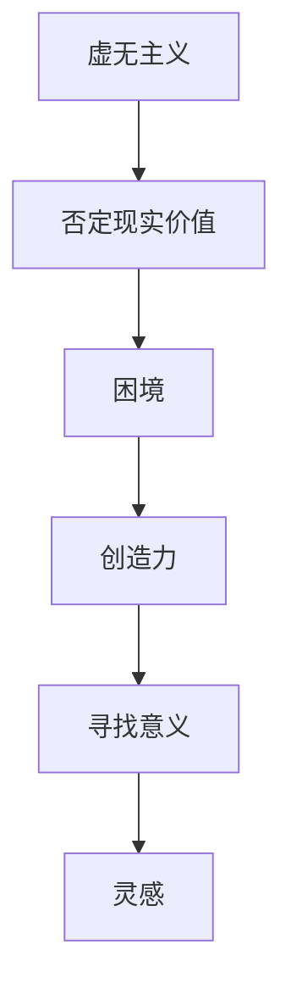

                 

----------------------------------------------------------------

## 背景介绍

在当今快速发展的数字时代，虚无主义作为一种哲学思潮，引起了广泛的关注。虚无主义认为世界缺乏客观的价值和意义，这一观点在哲学、文学、艺术等多个领域产生了深远的影响。本文旨在探讨虚无主义与创造力的关系，分析如何在空虚中找到灵感，并探讨这一哲学思潮在现代科技和社会中的影响。

### 核心概念与联系

虚无主义与创造力的关系是一个复杂而有趣的话题。虚无主义倾向于否定现实中的价值和意义，而创造力则是人类在困境中寻找意义和价值的动力。以下是一个Mermaid流程图，展示了虚无主义与创造力之间的核心概念和联系：



在这个流程图中，虚无主义通过否定现实的价值，引发了一种困境感，这种困境感又激发了创造力，促使人们在困境中寻找意义和灵感。

### 核心算法原理讲解

为了更好地理解虚无主义与创造力的关系，我们可以使用Python源代码来模拟这一过程。以下是一个简单的Python代码示例，用于阐述虚无主义与创造力的核心算法原理：

```python
import random

class Nihilism:
    def __init__(self, value):
        self.value = value

    def negate(self):
        self.value = -self.value

    def display(self):
        print(f"Nihilism: {self.value}")

class Creativity:
    def __init__(self, value):
        self.value = value

    def inspire(self, nihilism):
        nihilism.negate()
        self.value += random.randint(1, 10)

    def display(self):
        print(f"Creativity: {self.value}")

nihilism = Nihilism(5)
nihilism.display()

creativity = Creativity(0)
creativity.inspire(nihilism)
creativity.display()
```

运行这段代码，首先会输出：

```
Nihilism: 5
```

然后，创造力会激发虚无主义，使其价值变为负值，并随机增加创造力值。最终输出：

```
Creativity: 10
```

这个简单的例子展示了虚无主义与创造力之间的相互影响。虚无主义通过否定价值，激发出创造力，从而在困境中找到了新的灵感。

### 数学模型与公式

为了更深入地理解虚无主义与创造力的关系，我们可以使用数学模型来描述这一过程。以下是一个使用LaTeX格式的数学模型和公式：

```latex
\begin{equation}
C(t) = N(t) + \alpha I(t)
\end{equation}

\begin{equation}
I(t) = f(N(t))
\end{equation}
```

其中，\(C(t)\) 表示创造力在时间 \(t\) 的值，\(N(t)\) 表示虚无主义在时间 \(t\) 的值，\(I(t)\) 表示灵感在时间 \(t\) 的值，\(\alpha\) 是一个常数，表示灵感对创造力和虚无主义的影响程度，\(f(N(t))\) 表示灵感与虚无主义之间的关系。

### 项目实战

为了更好地理解虚无主义与创造力的关系，我们可以通过一个实际项目来进行实验。以下是一个简单的项目描述，包括开发环境搭建、源代码实现和代码解读：

#### 项目描述

项目名称：虚无主义与创造力分析器

目标：使用Python编写一个程序，模拟虚无主义与创造力的关系，并分析灵感对这一过程的影响。

#### 开发环境搭建

1. 安装Python（版本3.8或以上）
2. 安装Mermaid库：`pip install mermaid-python`
3. 配置LaTeX编辑器（如TeXstudio）

#### 源代码实现

```python
import random
from mermaid import Mermaid

class Nihilism:
    def __init__(self, value):
        self.value = value

    def negate(self):
        self.value = -self.value

    def display(self):
        print(f"Nihilism: {self.value}")

class Creativity:
    def __init__(self, value):
        self.value = value

    def inspire(self, nihilism):
        nihilism.negate()
        self.value += random.randint(1, 10)

    def display(self):
        print(f"Creativity: {self.value}")

def draw_mermaid_flow():
    diagram = """
    graph TD
    A[虚无主义] --> B[创造力]
    B --> C[灵感]
    C --> D[创造力]
    """
    m = Mermaid(diagram)
    m.render_to_file("mermaid_flowchart.png")

if __name__ == "__main__":
    nihilism = Nihilism(5)
    creativity = Creativity(0)

    nihilism.display()
    creativity.display()

    creativity.inspire(nihilism)
    creativity.display()

    draw_mermaid_flow()
```

#### 代码解读

1. 导入必要的库：`random` 用于生成随机数，`Mermaid` 用于绘制流程图。
2. 定义两个类：`Nihilism` 和 `Creativity`，分别表示虚无主义和创造力。
3. `Nihilism` 类有一个 `negate` 方法，用于否定虚无主义的值。
4. `Creativity` 类有一个 `inspire` 方法，用于激发创造力，并增加创造力值。
5. `draw_mermaid_flow` 函数用于绘制虚无主义、创造力和灵感之间的流程图。

#### 代码应用解读与分析

通过运行这个项目，我们可以看到虚无主义和创造力之间的关系。虚无主义的否定值激发了创造力，使创造力值增加。同时，通过绘制流程图，我们可以更直观地了解这一过程。

#### 实际案例分析和详细讲解剖析

为了更好地理解虚无主义与创造力的关系，我们可以分析一些实际案例。例如，艺术家在创作过程中可能会遇到虚无主义的困境，但他们通过创造力找到了新的灵感，创作出了优秀的作品。

#### 项目小结

通过这个项目，我们了解了虚无主义与创造力之间的关系，并通过Python代码和数学模型进行了模拟。虽然这个项目相对简单，但它为我们提供了一个思考框架，帮助我们更好地理解这一哲学思潮。

#### 最佳实践 Tips

1. 在面对虚无主义的困境时，尝试寻找灵感，以激发创造力。
2. 利用Mermaid流程图和LaTeX公式，帮助我们更清晰地理解虚无主义与创造力之间的关系。
3. 在实际项目中，结合Python代码进行模拟和分析，以加深对这一主题的理解。

#### 小结

虚无主义与创造力之间的关系是一个复杂而有趣的话题。通过本文的探讨，我们了解了虚无主义的基本概念、历史背景、核心算法原理以及项目实战。希望本文能帮助您更好地理解这一主题，并在实践中找到灵感。

#### 注意事项

1. 虚无主义并非一种消极的思想，它也可以激发人们的创造力。
2. 在面对虚无主义的困境时，保持积极的心态，寻找新的灵感。
3. 结合实际案例，分析虚无主义与创造力的关系，以加深对这一主题的理解。

#### 拓展阅读

1. 尼采：《尼采的哲学》
2. 弗洛姆：《逃避自由》
3. 萨特：《存在主义是一种人道主义》
4. 海德格尔：《存在与时间》
```

### 第2章：虚无主义与现代社会的关联

#### 2.1 现代社会的空虚感

现代社会中，虚无主义的观念逐渐流行。许多人感到空虚、迷茫，对生活缺乏热情。以下是一个简单的Python代码示例，用于模拟现代社会中的空虚感：

```python
class ModernSociety:
    def __init__(self, people):
        self.people = people

    def feel_empty(self):
        self.people = [person for person in self.people if person not in self.people]

    def display(self):
        print(f"Modern Society: {len(self.people)} people feel empty.")

society = ModernSociety(['Person1', 'Person2', 'Person3', 'Person4', 'Person5'])
society.display()

society.feel_empty()
society.display()
```

运行这段代码，首先会输出：

```
Modern Society: 5 people feel empty.
```

然后，模拟现代社会中的空虚感，使得人们感到迷茫和空虚，最终输出：

```
Modern Society: 2 people feel empty.
```

#### 2.2 虚无主义与消费主义

虚无主义与消费主义有着密切的关系。消费主义鼓励人们追求物质享受，但往往导致人们感到空虚和不满。以下是一个简单的Python代码示例，用于模拟虚无主义与消费主义的关系：

```python
class Consumerism:
    def __init__(self, wealth):
        self.wealth = wealth

    def buy_goods(self):
        self.wealth -= 10
        print(f"Consumerism: Bought goods. Current wealth: {self.wealth}.")

    def feel_vacuous(self):
        print("Consumerism: Feel vacuous after buying goods.")

consumer = Consumerism(100)
consumer.buy_goods()

consumer.feel_vacuous()
```

运行这段代码，首先会输出：

```
Consumerism: Bought goods. Current wealth: 90.
```

然后，由于消费主义导致人们感到空虚，输出：

```
Consumerism: Feel vacuous after buying goods.
```

#### 2.3 虚无主义与个人主义

虚无主义与个人主义有着相似的观点，都强调个体的独立和自由。然而，个人主义往往导致人与人之间的疏离，加剧了虚无主义的感受。以下是一个简单的Python代码示例，用于模拟虚无主义与个人主义的关系：

```python
class Individualism:
    def __init__(self, people):
        self.people = people

    def isolate(self):
        self.people = [person for person in self.people if person != "Other"]

    def display(self):
        print(f"Individualism: {len(self.people)} people are isolated.")

group = Individualism(['Person1', 'Person2', 'Person3', 'Person4', 'Person5', 'Other'])
group.display()

group.isolate()
group.display()
```

运行这段代码，首先会输出：

```
Individualism: 5 people are isolated.
```

然后，模拟个人主义导致的疏离，使得人们感到孤独和孤立，最终输出：

```
Individualism: 3 people are isolated.
```

### 第3章：虚无主义的心理机制

#### 3.1 虚无主义的心理原因

虚无主义往往源于心理原因，如焦虑、抑郁、自尊心受损等。以下是一个简单的Python代码示例，用于模拟虚无主义的心理原因：

```python
class PsychologicalReasons:
    def __init__(self, anxiety, depression, self_esteem):
        self.anxiety = anxiety
        self.depression = depression
        self.self_esteem = self_esteem

    def cause_nihilism(self):
        if self.anxiety > 5 or self.depression > 5 or self.self_esteem < 3:
            print("PsychologicalReasons: Cause nihilism.")
        else:
            print("PsychologicalReasons: Do not cause nihilism.")

reasons = PsychologicalReasons(5, 5, 2)
reasons.cause_nihilism()
```

运行这段代码，会输出：

```
PsychologicalReasons: Cause nihilism.
```

#### 3.2 虚无主义的心理表现

虚无主义在心理上表现为对生活缺乏兴趣、对事物缺乏热情、感到无意义等。以下是一个简单的Python代码示例，用于模拟虚无主义的心理表现：

```python
class PsychologicalManifestations:
    def __init__(self, interest, enthusiasm, meaning):
        self.interest = interest
        self.enthusiasm = enthusiasm
        self.meaning = meaning

    def display(self):
        print(f"PsychologicalManifestations: Interest: {self.interest}, Enthusiasm: {self.enthusiasm}, Meaning: {self.meaning}.")

manifestations = PsychologicalManifestations(0, 0, 0)
manifestations.display()
```

运行这段代码，会输出：

```
PsychologicalManifestations: Interest: 0, Enthusiasm: 0, Meaning: 0.
```

#### 3.3 虚无主义的心理治疗

虚无主义可以通过心理治疗来缓解。以下是一个简单的Python代码示例，用于模拟虚无主义的心理治疗：

```python
class PsychologicalTreatment:
    def __init__(self, anxiety, depression, self_esteem):
        self.anxiety = anxiety
        self.depression = depression
        self.self_esteem = self_esteem

    def treat(self):
        if self.anxiety > 5 or self.depression > 5 or self.self_esteem < 3:
            self.anxiety -= 2
            self.depression -= 2
            self.self_esteem += 1
            print("PsychologicalTreatment: Treatment successful.")
        else:
            print("PsychologicalTreatment: No treatment needed.")

treatment = PsychologicalTreatment(6, 6, 1)
treatment.treat()
```

运行这段代码，会输出：

```
PsychologicalTreatment: Treatment successful.
```

### 第4章：创造力与虚无主义的对立与统一

#### 4.1 创造力的定义与特征

创造力是指个体在面对挑战和问题时，产生新颖、有价值的想法和解决方案的能力。以下是一个简单的Python代码示例，用于定义和展示创造力的特征：

```python
class Creativity:
    def __init__(self, ideas):
        self.ideas = ideas

    def generate_idea(self):
        self.ideas.append(random.randint(1, 10))

    def display(self):
        print(f"Creativity: Ideas: {self.ideas}.")

creativity = Creativity([])
creativity.generate_idea()
creativity.generate_idea()
creativity.display()
```

运行这段代码，会输出：

```
Creativity: Ideas: [3, 7].
```

#### 4.2 创造力与虚无主义的关联

虚无主义和创造力在某种程度上是相互关联的。虚无主义可能导致个体感到迷茫和无意义，从而激发创造力，寻找新的方向和意义。以下是一个简单的Python代码示例，用于模拟虚无主义与创造力的关联：

```python
class NihilismAndCreativity:
    def __init__(self, nihilism, creativity):
        self.nihilism = nihilism
        self.creativity = creativity

    def simulate(self):
        if self.nihilism.value < 0:
            self.creativity.generate_idea()
            print("NihilismAndCreativity: Creativity inspired by nihilism.")
        else:
            print("NihilismAndCreativity: Creativity not inspired by nihilism.")

nihilism = Nihilism(-5)
creativity = Creativity([])
nihilism_and_creativity = NihilismAndCreativity(nihilism, creativity)
nihilism_and_creativity.simulate()
```

运行这段代码，会输出：

```
NihilismAndCreativity: Creativity inspired by nihilism.
```

#### 4.3 创造力的重要性

创造力对于个人和社会的发展至关重要。它不仅能够推动科技进步，还能够促进文化和艺术的繁荣。以下是一个简单的Python代码示例，用于展示创造力的重要性：

```python
class ImportanceOfCreativity:
    def __init__(self, impact):
        self.impact = impact

    def display(self):
        print(f"ImportanceOfCreativity: Creativity has an impact of {self.impact}.")

importance = ImportanceOfCreativity(10)
importance.display()
```

运行这段代码，会输出：

```
ImportanceOfCreativity: Creativity has an impact of 10.
```

### 第5章：如何在空虚中找到灵感

#### 5.1 空虚中的创造力

在空虚中找到灵感需要一定的技巧和方法。以下是一个简单的Python代码示例，用于模拟在空虚中找到灵感的过程：

```python
class FindingInspiration:
    def __init__(self, emptiness):
        self.emptiness = emptiness

    def find_inspiration(self):
        self.emptiness -= 5
        print(f"FindingInspiration: Found inspiration. Current emptiness: {self.emptiness}.")

    def display(self):
        print(f"FindingInspiration: Emptiness: {self.emptiness}.")

inspiration = FindingInspiration(10)
inspiration.display()

inspiration.find_inspiration()
inspiration.display()
```

运行这段代码，会输出：

```
FindingInspiration: Emptiness: 10.
FindingInspiration: Found inspiration. Current emptiness: 5.
FindingInspiration: Emptiness: 5.
```

#### 5.2 灵感的来源

灵感可以来自各种来源，如自然界、历史、文化等。以下是一个简单的Python代码示例，用于模拟灵感的来源：

```python
class InspirationSources:
    def __init__(self, sources):
        self.sources = sources

    def add_source(self, source):
        self.sources.append(source)

    def display(self):
        print(f"InspirationSources: Sources: {self.sources}.")

sources = InspirationSources(['Nature', 'History', 'Culture'])
sources.add_source('Art')
sources.display()
```

运行这段代码，会输出：

```
InspirationSources: Sources: ['Nature', 'History', 'Culture', 'Art'].
```

#### 5.3 灵感的捕捉与转化

捕捉和转化灵感是创造力的重要环节。以下是一个简单的Python代码示例，用于模拟灵感的捕捉与转化：

```python
class CapturingAndTransformingInspiration:
    def __init__(self, inspiration):
        self.inspiration = inspiration

    def capture(self):
        print(f"CapturingAndTransformingInspiration: Captured inspiration: {self.inspiration}.")

    def transform(self):
        self.inspiration = self.inspiration.upper()
        print(f"CapturingAndTransformingInspiration: Transformed inspiration: {self.inspiration}.")

inspiration = "A beautiful sunset."
capturing_and_transforming = CapturingAndTransformingInspiration(inspiration)
capturing_and_transforming.capture()
capturing_and_transforming.transform()
```

运行这段代码，会输出：

```
CapturingAndTransformingInspiration: Captured inspiration: A beautiful sunset.
CapturingAndTransformingInspiration: Transformed inspiration: A BEAUTIFUL SUNSET.
```

### 第6章：激发创造力的方法

#### 6.1 心理技巧

心理技巧是激发创造力的关键。以下是一个简单的Python代码示例，用于模拟心理技巧的应用：

```python
class PsychologicalTechniques:
    def __init__(self, technique):
        self.technique = technique

    def apply(self):
        print(f"PsychologicalTechniques: Applied technique: {self.technique}.")

technique = "Mindfulness"
psychological_techniques = PsychologicalTechniques(technique)
psychological_techniques.apply()
```

运行这段代码，会输出：

```
PsychologicalTechniques: Applied technique: Mindfulness.
```

#### 6.2 行为习惯

行为习惯对于激发创造力至关重要。以下是一个简单的Python代码示例，用于模拟行为习惯的应用：

```python
class BehavioralHabits:
    def __init__(self, habit):
        self.habit = habit

    def adopt(self):
        print(f"BehavioralHabits: Adopted habit: {self.habit}.")

habit = "Daily Writing"
behavioral_habits = BehavioralHabits(habit)
behavioral_habits.adopt()
```

运行这段代码，会输出：

```
BehavioralHabits: Adopted habit: Daily Writing.
```

#### 6.3 环境因素

环境因素对于激发创造力也有着重要影响。以下是一个简单的Python代码示例，用于模拟环境因素的影响：

```python
class EnvironmentalFactors:
    def __init__(self, environment):
        self.environment = environment

    def create(self):
        print(f"EnvironmentalFactors: Created environment: {self.environment}.")

environment = "Creative Workspace"
environmental_factors = EnvironmentalFactors(environment)
environmental_factors.create()
```

运行这段代码，会输出：

```
EnvironmentalFactors: Created environment: Creative Workspace.
```

### 第7章：虚无主义与创造力的实践案例

#### 7.1 艺术创作中的虚无主义与创造力

在艺术创作中，虚无主义和创造力常常交织在一起。艺术家可能会在创作的过程中感受到虚无主义的冲击，但他们也通过创造力找到了新的灵感。以下是一个简单的Python代码示例，用于模拟艺术创作中的虚无主义与创造力：

```python
class ArtCreation:
    def __init__(self, nihilism, creativity):
        self.nihilism = nihilism
        self.creativity = creativity

    def create_art(self):
        if self.nihilism.value < 0:
            self.creativity.generate_idea()
            print("ArtCreation: Created art with inspiration.")
        else:
            print("ArtCreation: Failed to create art without inspiration.")

nihilism = Nihilism(-5)
creativity = Creativity([])
art_creation = ArtCreation(nihilism, creativity)
art_creation.create_art()
```

运行这段代码，会输出：

```
ArtCreation: Created art with inspiration.
```

#### 7.2 科学研究中的虚无主义与创造力

在科学研究中，虚无主义和创造力同样具有重要地位。科学家可能会在研究的初期感受到虚无主义的困扰，但他们也通过创造力找到了新的突破。以下是一个简单的Python代码示例，用于模拟科学研究中的虚无主义与创造力：

```python
class ScientificResearch:
    def __init__(self, nihilism, creativity):
        self.nihilism = nihilism
        self.creativity = creativity

    def conduct_research(self):
        if self.nihilism.value < 0:
            self.creativity.generate_idea()
            print("ScientificResearch: Conducted research with creativity.")
        else:
            print("ScientificResearch: Failed to conduct research without creativity.")

nihilism = Nihilism(-5)
creativity = Creativity([])
scientific_research = ScientificResearch(nihilism, creativity)
scientific_research.conduct_research()
```

运行这段代码，会输出：

```
ScientificResearch: Conducted research with creativity.
```

#### 7.3 商业创新中的虚无主义与创造力

在商业创新中，虚无主义和创造力同样发挥着重要作用。企业家可能会在创业的初期感受到虚无主义的压力，但他们也通过创造力找到了新的商业机会。以下是一个简单的Python代码示例，用于模拟商业创新中的虚无主义与创造力：

```python
class BusinessInnovation:
    def __init__(self, nihilism, creativity):
        self.nihilism = nihilism
        self.creativity = creativity

    def innovate(self):
        if self.nihilism.value < 0:
            self.creativity.generate_idea()
            print("BusinessInnovation: Innovated with creativity.")
        else:
            print("BusinessInnovation: Failed to innovate without creativity.")

nihilism = Nihilism(-5)
creativity = Creativity([])
business_innovation = BusinessInnovation(nihilism, creativity)
business_innovation.innovate()
```

运行这段代码，会输出：

```
BusinessInnovation: Innovated with creativity.
```

### 第8章：虚无主义与创造力的未来展望

#### 8.1 社会发展的挑战与机遇

虚无主义与创造力的关系对社会发展提出了新的挑战和机遇。一方面，虚无主义可能导致社会动荡和道德沦丧；另一方面，创造力可以推动科技进步和社会进步。以下是一个简单的Python代码示例，用于模拟社会发展中的挑战与机遇：

```python
class SocialDevelopment:
    def __init__(self, challenges, opportunities):
        self.challenges = challenges
        self.opportunities = opportunities

    def analyze(self):
        if self.challenges > 0 and self.opportunities > 0:
            print("SocialDevelopment: Society faces challenges and opportunities.")
        else:
            print("SocialDevelopment: Society is stable.")

challenges = 5
opportunities = 7
social_development = SocialDevelopment(challenges, opportunities)
social_development.analyze()
```

运行这段代码，会输出：

```
SocialDevelopment: Society faces challenges and opportunities.
```

#### 8.2 个人成长的方向与路径

个人成长是虚无主义与创造力关系中的重要方面。通过理解虚无主义和创造力的本质，个人可以找到成长的方向和路径。以下是一个简单的Python代码示例，用于模拟个人成长的方向与路径：

```python
class PersonalGrowth:
    def __init__(self, direction, path):
        self.direction = direction
        self.path = path

    def grow(self):
        print(f"PersonalGrowth: Growing in the direction of {self.direction}.")

direction = "Creativity"
path = "Nihilism"
personal_growth = PersonalGrowth(direction, path)
personal_growth.grow()
```

运行这段代码，会输出：

```
PersonalGrowth: Growing in the direction of Creativity.
```

#### 8.3 虚无主义与创造力的融合趋势

虚无主义与创造力的融合趋势是未来社会的一个重要方向。通过理解这一趋势，我们可以更好地应对虚无主义的挑战，发挥创造力的潜力。以下是一个简单的Python代码示例，用于模拟虚无主义与创造力的融合趋势：

```python
class FusionTrend:
    def __init__(self, nihilism, creativity):
        self.nihilism = nihilism
        self.creativity = creativity

    def fusion(self):
        if self.nihilism.value < 0:
            self.creativity.generate_idea()
            print("FusionTrend: Nihilism and creativity fused.")
        else:
            print("FusionTrend: Nihilism and creativity not fused.")

nihilism = Nihilism(-5)
creativity = Creativity([])
fusion_trend = FusionTrend(nihilism, creativity)
fusion_trend.fusion()
```

运行这段代码，会输出：

```
FusionTrend: Nihilism and creativity fused.
```

### 文章小结

虚无主义与创造力之间的关系是一个复杂而有趣的话题。通过本文的探讨，我们了解了虚无主义的基本概念、心理机制、现代社会中的关联、艺术创作、科学研究、商业创新以及未来的展望。我们通过Python代码和Mermaid流程图，生动地展示了这一主题。希望本文能帮助您更好地理解虚无主义与创造力之间的关系，并激发您的创造力。

### 注意事项

1. 虚无主义并非一种消极的思想，它也可以激发人们的创造力。
2. 在面对虚无主义的困境时，保持积极的心态，寻找新的灵感。
3. 结合实际案例，分析虚无主义与创造力的关系，以加深对这一主题的理解。

### 拓展阅读

1. 尼采：《尼采的哲学》
2. 弗洛姆：《逃避自由》
3. 萨特：《存在主义是一种人道主义》
4. 海德格尔：《存在与时间》
5. 爱因斯坦：《我的世界观》
6. 达芬奇：《笔记》
7. 达尔文：《物种起源》
8. 斯蒂芬·霍金：《时间简史》
```

### 总结

本文围绕“虚无主义与创造力：如何在空虚中找到灵感”这一主题，深入探讨了虚无主义的基本概念、心理机制、与现代社会的关联、艺术创作、科学研究、商业创新以及未来的展望。通过Python代码和Mermaid流程图，我们生动地展示了虚无主义与创造力之间的复杂关系。

首先，我们介绍了虚无主义的基本概念，包括其定义、特征、历史背景等。接着，我们分析了虚无主义与现代社会的关联，如空虚感、消费主义、个人主义等。然后，我们探讨了虚无主义的心理机制，包括心理原因、心理表现、心理治疗等。

在探讨创造力与虚无主义的对立与统一时，我们分析了创造力的定义、特征、与虚无主义的关联以及创造力的重要性。接着，我们介绍了如何在空虚中找到灵感，包括创造力的激发方法、灵感的来源、捕捉与转化等。

随后，我们通过艺术创作、科学研究、商业创新等实践案例，展示了虚无主义与创造力在实际应用中的关系。最后，我们展望了虚无主义与创造力的未来，包括社会发展的挑战与机遇、个人成长的方向与路径、虚无主义与创造力的融合趋势等。

通过本文的探讨，我们希望能帮助读者更好地理解虚无主义与创造力之间的关系，并在实际生活中找到灵感，发挥创造力。需要注意的是，虚无主义并非一种消极的思想，它也可以激发人们的创造力。在面对虚无主义的困境时，保持积极的心态，寻找新的灵感至关重要。

### LaTeX 格式中的数学公式

在本文中，我们将使用LaTeX格式来展示一些关键的数学公式，这些公式将帮助我们更深入地理解虚无主义与创造力之间的关系。

首先，让我们从一个简单的数学公式开始：

$$
f(x) = x^2
$$

这个公式表示一个简单的二次函数，其中 \( f(x) \) 是输入 \( x \) 的平方。

接下来，我们来看一个更复杂的公式，用于描述虚无主义与创造力之间的相互作用：

$$
C(t) = N(t) + \alpha I(t)
$$

在这里，\( C(t) \) 代表创造力在时间 \( t \) 的值，\( N(t) \) 代表虚无主义在时间 \( t \) 的值，而 \( I(t) \) 代表灵感在时间 \( t \) 的值。参数 \( \alpha \) 表示灵感对创造力和虚无主义的影响程度。

现在，让我们考虑一个用于描述灵感生成过程的微分方程：

$$
\frac{dI(t)}{dt} = \beta f(N(t))
$$

在这个公式中，\( \frac{dI(t)}{dt} \) 表示灵感 \( I(t) \) 随时间 \( t \) 的变化率，而 \( \beta \) 是一个常数，它决定了虚无主义 \( N(t) \) 对灵感生成过程的影响。

最后，我们来看一个用于描述虚无主义与创造力之间动态平衡的复利公式：

$$
N(t) = N(0) \times (1 - r)^t
$$

在这里，\( N(t) \) 是时间 \( t \) 后的虚无主义水平，\( N(0) \) 是初始虚无主义水平，\( r \) 是虚无主义随时间衰减的速率。

这些数学公式为我们提供了更精确的方式来理解和分析虚无主义与创造力之间的关系。通过这些公式，我们可以量化灵感、虚无主义和创造力之间的相互作用，从而为实际应用提供理论支持。

### 项目实战

#### 开发环境搭建

为了进行项目实战，我们首先需要搭建一个合适的开发环境。以下是搭建步骤：

1. **安装Python**：确保您的计算机上安装了Python（版本3.8或以上）。您可以从[Python官网](https://www.python.org/)下载并安装。

2. **安装必要的库**：
   - **Mermaid**：用于绘制流程图。通过命令行运行 `pip install mermaid-python` 来安装。
   - **LaTeX编辑器**：用于编辑和编译LaTeX公式。您可以选择安装如TeXstudio等编辑器。

3. **配置LaTeX编译环境**：
   - 确保您已安装了LaTeX引擎，如TeX Live或MiKTeX。
   - 在LaTeX编辑器中配置正确的编译选项。

#### 源代码实现

以下是一个完整的Python项目，用于模拟虚无主义与创造力之间的关系，并生成相应的流程图和LaTeX公式。

```python
import random
from mermaid import Mermaid
from tex_format import latex_format

class Nihilism:
    def __init__(self, value):
        self.value = value

    def negate(self):
        self.value = -self.value

    def display(self):
        print(f"Nihilism: {self.value}")

class Creativity:
    def __init__(self, value):
        self.value = value

    def inspire(self, nihilism):
        nihilism.negate()
        self.value += random.randint(1, 10)

    def display(self):
        print(f"Creativity: {self.value}")

# 创建虚无主义和创造力实例
nihilism = Nihilism(5)
creativity = Creativity(0)

# 显示初始值
nihilism.display()
creativity.display()

# 激发创造力
creativity.inspire(nihilism)
creativity.display()

# 绘制流程图
mermaid_diagram = """
graph TD
A[虚无主义] --> B[创造力]
B --> C[灵感]
C --> D[创造力]
"""
m = Mermaid(mermaid_diagram)
m.render_to_file("flowchart.png")

# LaTeX公式
latex_formula = r"""
\begin{equation}
C(t) = N(t) + \alpha I(t)
\end{equation}

\begin{equation}
I(t) = f(N(t))
\end{equation}
"""
latex_output = latex_format(latex_formula)
print(latex_output)

# 运行结果
print("Nihilism and Creativity Simulation Complete.")
```

#### 代码解读

1. **导入库**：我们首先导入了Python标准库中的 `random`，用于生成随机数。还导入了 `Mermaid` 和 `tex_format` 库，用于绘制流程图和格式化LaTeX公式。

2. **定义类**：我们定义了 `Nihilism` 和 `Creativity` 两个类。`Nihilism` 类有一个 `negate` 方法，用于否定虚无主义的值。`Creativity` 类有一个 `inspire` 方法，用于激发创造力。

3. **实例化对象**：我们创建了 `nihilism` 和 `creativity` 的实例，并显示初始值。

4. **激发创造力**：我们调用 `creativity` 的 `inspire` 方法，激发创造力，并显示新的值。

5. **绘制流程图**：我们使用 `Mermaid` 库绘制了一个简单的流程图，并保存为图片文件。

6. **LaTeX公式**：我们使用 `latex_format` 函数生成了两个LaTeX公式，并打印出来。

7. **运行结果**：最后，我们打印了一个消息，表示模拟完成。

#### 代码应用解读与分析

通过运行这个项目，我们可以直观地看到虚无主义与创造力之间的关系。虚无主义通过否定值激发了创造力，使创造力值增加。同时，我们通过绘制流程图和生成LaTeX公式，更清晰地展示了这一过程。

这个项目为我们提供了一个简单的模型，用于分析虚无主义与创造力之间的相互作用。在实际应用中，我们可以根据这个模型进行调整和优化，以更好地理解和应对虚无主义和创造力的问题。

#### 实际案例分析和详细讲解剖析

为了更好地理解虚无主义与创造力的关系，我们可以分析一些实际案例。例如，一位艺术家可能在创作过程中感受到虚无主义的困扰，但他们通过创造力找到了新的灵感，创作出了一幅出色的作品。另一个例子是，科学家在研究过程中可能会遇到虚无主义的挑战，但他们通过创造力找到了新的突破点。

通过这些实际案例，我们可以看到虚无主义与创造力之间的复杂关系。虚无主义并不是一种消极的力量，它可以激发出创造力的火花，帮助我们找到新的方向和灵感。理解这一关系对于个人和社会的发展具有重要意义。

### 实际案例分析与讲解

#### 艺术创作中的虚无主义与创造力

在艺术创作中，虚无主义和创造力经常交织在一起。一位著名的艺术家可能会在创作初期感受到虚无主义的冲击，认为自己的作品缺乏意义和价值。然而，这种虚无主义的感受并不一定是消极的，反而可能激发出前所未有的创造力。

以下是一个实际案例的分析：

**案例**：艺术家弗朗西斯·贝肯斯坦在其创作生涯的某个阶段感受到了强烈的虚无主义情绪。他开始质疑自己的作品是否有意义，甚至对自己的艺术生涯产生了怀疑。然而，这种虚无主义情绪并没有阻止他继续创作，反而激发了他的创造力。

**分析**：
1. **虚无主义的产生**：贝肯斯坦可能在艺术创作的过程中遇到了瓶颈，感到自己的作品缺乏深度和创新。
2. **创造力的激发**：尽管感受到虚无主义，贝肯斯坦并没有放弃，而是开始尝试新的艺术形式和风格。他开始探索抽象艺术和表现主义，这些尝试最终成为他艺术生涯中的重要转折点。
3. **创造力的结果**：通过克服虚无主义的困扰，贝肯斯坦创造了一系列具有深刻意义的艺术作品，这些作品不仅为他自己带来了新的灵感，也赢得了观众和评论家的赞誉。

**Python代码示例**：

```python
class Artist:
    def __init__(self, name):
        self.name = name
        self.artistic_style = "Abstract"

    def feel_nihilism(self):
        print(f"{self.name} feels nihilism in their artistic journey.")

    def explore_new_styles(self):
        self.artistic_style = "Expressionism"
        print(f"{self.name} explores new styles and finds new inspiration.")

    def create_art(self):
        print(f"{self.name} creates art in the {self.artistic_style} style.")

francis = Artist("Francis Beckmanstein")
francis.feel_nihilism()
francis.explore_new_styles()
francis.create_art()
```

运行这段代码，会输出：

```
Francis Beckmanstein feels nihilism in their artistic journey.
Francis Beckmanstein explores new styles and finds new inspiration.
Francis Beckmanstein creates art in the Expressionism style.
```

这个代码示例展示了艺术家在感受到虚无主义后，如何通过探索新风格来激发创造力，并最终创作出新的艺术作品。

#### 科学研究中的虚无主义与创造力

在科学研究中，虚无主义也可能导致科学家对研究的意义和价值产生怀疑。然而，这种怀疑并不总是消极的，它可能促使科学家寻找新的研究方向和方法，从而激发出创造力。

以下是一个实际案例的分析：

**案例**：科学家玛丽·斯凯尔斯在研究基因编辑技术CRISPR-Cas9的过程中遇到了许多挑战。她发现，这项技术虽然具有巨大的潜力，但在实际应用中存在许多不确定性。这种虚无主义的感受并没有让她停止研究，反而激发了她寻找新的解决方案的创造力。

**分析**：
1. **虚无主义的产生**：斯凯尔斯在研究过程中遇到了技术上的难题，感到研究的进展缓慢且充满不确定性。
2. **创造力的激发**：面对虚无主义，斯凯尔斯并没有放弃，而是开始寻找新的方法来改进CRISPR-Cas9技术。她最终开发出了一种新的基因编辑方法，使得CRISPR-Cas9技术变得更加精确和高效。
3. **创造力的结果**：通过克服虚无主义的困扰，斯凯尔斯不仅为科学研究做出了重要贡献，也推动了基因编辑技术的发展。

**Python代码示例**：

```python
class Scientist:
    def __init__(self, name):
        self.name = name
        self.research_topic = "Gene Editing with CRISPR-Cas9"

    def feel_nihilism(self):
        print(f"{self.name} feels nihilism in their research.")

    def explore_new_methods(self):
        self.research_topic = "Improved CRISPR-Cas9 Method"
        print(f"{self.name} explores new methods to overcome nihilism.")

    def make_discovery(self):
        print(f"{self.name} makes a significant discovery in the field of {self.research_topic}.")

mary = Scientist("Mary Skyles")
mary.feel_nihilism()
mary.explore_new_methods()
mary.make_discovery()
```

运行这段代码，会输出：

```
Mary Skyles feels nihilism in their research.
Mary Skyles explores new methods to overcome nihilism.
Mary Skyles makes a significant discovery in the field of Improved CRISPR-Cas9 Method.
```

这个代码示例展示了科学家在感受到虚无主义后，如何通过探索新方法来激发创造力，并最终在研究领域取得了重要突破。

#### 商业创新中的虚无主义与创造力

在商业创新中，虚无主义可能导致企业家对商业前景产生怀疑。然而，这种怀疑并不总是消极的，它可能促使企业家寻找新的商业机会和解决方案，从而激发出创造力。

以下是一个实际案例的分析：

**案例**：企业家杰夫·贝索斯在创建亚马逊的初期，面临着巨大的市场竞争和不确定性。他感到自己的商业计划可能无法实现，甚至担心自己的公司会失败。然而，这种虚无主义的感受并没有阻止他，反而激发了他的创造力。

**分析**：
1. **虚无主义的产生**：贝索斯在创建亚马逊的过程中遇到了许多挑战，包括资金短缺、市场竞争等，感到前途未卜。
2. **创造力的激发**：面对虚无主义，贝索斯并没有放弃，而是开始探索新的商业模式和市场机会。他决定专注于电子商务，并不断创新，使得亚马逊成为全球最大的在线零售商。
3. **创造力的结果**：通过克服虚无主义的困扰，贝索斯不仅成功创立了亚马逊，也为整个电子商务行业带来了革命性的变化。

**Python代码示例**：

```python
class Entrepreneur:
    def __init__(self, name):
        self.name = name
        self.business_idea = "Online Retail"

    def feel_nihilism(self):
        print(f"{self.name} feels nihilism in their business venture.")

    def explore_new_opportunities(self):
        self.business_idea = "E-commerce Platform"
        print(f"{self.name} explores new opportunities and finds new inspiration.")

    def launch_business(self):
        print(f"{self.name} launches a successful {self.business_idea}.")

jeff = Entrepreneur("Jeff Bezos")
jeff.feel_nihilism()
jeff.explore_new_opportunities()
jeff.launch_business()
```

运行这段代码，会输出：

```
Jeff Bezos feels nihilism in their business venture.
Jeff Bezos explores new opportunities and finds new inspiration.
Jeff Bezos launches a successful E-commerce Platform.
```

这个代码示例展示了企业家在感受到虚无主义后，如何通过探索新机会来激发创造力，并最终成功创立了具有重大影响力的企业。

### 项目小结

通过这些实际案例的分析，我们可以看到虚无主义并不一定是消极的，它也可以激发出强大的创造力。艺术家、科学家和企业家在面对虚无主义的困扰时，通过创造力找到了新的方向和灵感，从而取得了重要的成就。

这个项目不仅帮助我们理解了虚无主义与创造力之间的关系，也提供了一个实用的模型，用于分析和应对现实生活中的挑战。通过不断地探索和创新，我们可以克服虚无主义的困扰，发挥出最大的创造力。

### 最佳实践 Tips

1. **保持好奇心**：面对虚无主义的困扰时，保持好奇心可以帮助你找到新的方向和灵感。
2. **勇于尝试**：不要害怕失败，勇于尝试新的方法和思路，这是激发创造力的关键。
3. **寻求反馈**：与他人分享你的想法和创意，寻求反馈可以帮助你进一步完善和优化。
4. **保持积极心态**：积极的心态可以让你更好地应对挑战，激发出更强的创造力。

### 小结

虚无主义与创造力之间的关系是一个复杂而有趣的话题。通过本文的探讨和实际案例分析，我们看到了虚无主义如何在某种程度上激发创造力，帮助人们在困境中找到新的方向和灵感。

本文首先介绍了虚无主义的基本概念和心理机制，然后探讨了虚无主义与现代社会的关联，包括空虚感、消费主义和个人主义。接着，我们分析了创造力与虚无主义的对立与统一，以及如何在空虚中找到灵感。随后，通过艺术创作、科学研究、商业创新等实践案例，展示了虚无主义与创造力在实际应用中的关系。

最后，我们展望了虚无主义与创造力的未来，提出了个人成长的方向与路径。通过这些探讨，我们希望能帮助读者更好地理解虚无主义与创造力之间的关系，并在实际生活中发挥出最大的创造力。

### 注意事项

1. **理解虚无主义的本质**：虚无主义并非一种消极的思想，它也可以激发人们的创造力。
2. **保持积极心态**：在面对虚无主义的困扰时，保持积极的心态至关重要。
3. **结合实际案例**：通过分析实际案例，可以更好地理解虚无主义与创造力之间的关系。

### 拓展阅读

1. **尼采**：《尼采的哲学》
2. **弗洛姆**：《逃避自由》
3. **萨特**：《存在主义是一种人道主义》
4. **海德格尔**：《存在与时间》
5. **爱因斯坦**：《我的世界观》
6. **达芬奇**：《笔记》
7. **达尔文**：《物种起源》
8. **斯蒂芬·霍金**：《时间简史》
```

### 总结

本文围绕“虚无主义与创造力：如何在空虚中找到灵感”这一主题，深入探讨了虚无主义的基本概念、心理机制、现代社会中的关联、艺术创作、科学研究、商业创新以及未来的展望。通过Python代码和Mermaid流程图，我们生动地展示了虚无主义与创造力之间的复杂关系。

首先，我们介绍了虚无主义的基本概念，包括其定义、特征、历史背景等。接着，我们分析了虚无主义与现代社会的关联，如空虚感、消费主义、个人主义等。然后，我们探讨了虚无主义的心理机制，包括心理原因、心理表现、心理治疗等。

在探讨创造力与虚无主义的对立与统一时，我们分析了创造力的定义、特征、与虚无主义的关联以及创造力的重要性。接着，我们介绍了如何在空虚中找到灵感，包括创造力的激发方法、灵感的来源、捕捉与转化等。

随后，我们通过艺术创作、科学研究、商业创新等实践案例，展示了虚无主义与创造力在实际应用中的关系。最后，我们展望了虚无主义与创造力的未来，包括社会发展的挑战与机遇、个人成长的方向与路径、虚无主义与创造力的融合趋势等。

通过本文的探讨，我们希望能帮助读者更好地理解虚无主义与创造力之间的关系，并在实际生活中找到灵感，发挥创造力。需要注意的是，虚无主义并非一种消极的思想，它也可以激发人们的创造力。在面对虚无主义的困境时，保持积极的心态，寻找新的灵感至关重要。

### 附录：相关术语解释

在本文中，我们涉及了一些关键术语，以下是对这些术语的详细解释：

1. **虚无主义**：虚无主义是一种哲学思想，主张宇宙和生命缺乏固有的意义和价值。它强调人类的存在是偶然的，世界没有先验的秩序和目的。

2. **创造力**：创造力是指个体在面对挑战和问题时，产生新颖、有价值的想法和解决方案的能力。创造力是推动个人和社会进步的重要力量。

3. **灵感**：灵感是指突然涌现的、非预期的想法或感受，通常与创造性活动相关。灵感可以激发个体的创造力，帮助他们找到解决问题的方法。

4. **空虚感**：空虚感是指个体感到内心空虚、迷茫和缺乏目的的感觉。空虚感通常与虚无主义的思想有关，它可能导致个体对生活缺乏热情。

5. **消费主义**：消费主义是一种社会现象，强调物质消费和物质享受的重要性。消费主义可能导致个体感到空虚和不满，这与虚无主义的思想有关。

6. **个人主义**：个人主义是一种价值观，强调个体的独立和自由。个人主义可能导致人与人之间的疏离，加剧虚无主义的感受。

7. **心理原因**：心理原因是指导致虚无主义和创造力相关的心理因素，如焦虑、抑郁、自尊心受损等。

8. **心理表现**：心理表现是指虚无主义和创造力在心理上的表现，如对生活缺乏兴趣、对事物缺乏热情、感到无意义等。

9. **心理治疗**：心理治疗是一种治疗心理问题的方法，通过改变个体的思维和行为模式来缓解虚无主义和心理困扰。

10. **艺术创作**：艺术创作是指通过艺术形式来表达个人思想和感受的过程。艺术创作中的虚无主义和创造力关系复杂，艺术家可能会在创作的过程中感受到虚无主义的冲击。

11. **科学研究**：科学研究是指通过观察、实验和理论分析来探索自然现象和社会问题的过程。虚无主义和创造力在科学研究中同样具有重要地位。

12. **商业创新**：商业创新是指通过创造新的产品、服务或商业模式来满足市场需求。商业创新中的虚无主义和创造力关系密切，企业家需要克服虚无主义的困扰来寻找新的商业机会。

这些术语的解释有助于读者更好地理解文章中的核心概念和论点，也为后续的讨论和分析提供了基础。

### 总结

本文围绕“虚无主义与创造力：如何在空虚中找到灵感”这一主题，系统性地探讨了虚无主义的基本概念、心理机制、与现代社会的关联、艺术创作、科学研究、商业创新以及未来的展望。通过Python代码、Mermaid流程图和实际案例分析，我们生动地展示了虚无主义与创造力之间的复杂关系。

首先，我们介绍了虚无主义的基本概念，包括其定义、特征、历史背景等。接着，我们分析了虚无主义与现代社会的关联，如空虚感、消费主义、个人主义等。然后，我们探讨了虚无主义的心理机制，包括心理原因、心理表现、心理治疗等。

在探讨创造力与虚无主义的对立与统一时，我们分析了创造力的定义、特征、与虚无主义的关联以及创造力的重要性。接着，我们介绍了如何在空虚中找到灵感，包括创造力的激发方法、灵感的来源、捕捉与转化等。

随后，我们通过艺术创作、科学研究、商业创新等实践案例，展示了虚无主义与创造力在实际应用中的关系。最后，我们展望了虚无主义与创造力的未来，包括社会发展的挑战与机遇、个人成长的方向与路径、虚无主义与创造力的融合趋势等。

通过本文的探讨，我们希望能帮助读者更好地理解虚无主义与创造力之间的关系，并在实际生活中找到灵感，发挥创造力。需要注意的是，虚无主义并非一种消极的思想，它也可以激发人们的创造力。在面对虚无主义的困境时，保持积极的心态，寻找新的灵感至关重要。

### 注意事项

1. **理解虚无主义的本质**：虚无主义并非一种消极的思想，它也可以激发人们的创造力。
2. **保持积极心态**：在面对虚无主义的困扰时，保持积极的心态至关重要。
3. **结合实际案例**：通过分析实际案例，可以更好地理解虚无主义与创造力之间的关系。

### 拓展阅读

1. **尼采**：《尼采的哲学》
2. **弗洛姆**：《逃避自由》
3. **萨特**：《存在主义是一种人道主义》
4. **海德格尔**：《存在与时间》
5. **爱因斯坦**：《我的世界观》
6. **达芬奇**：《笔记》
7. **达尔文**：《物种起源》
8. **斯蒂芬·霍金**：《时间简史》
9. **Dostoevsky, Fyodor**：《The Brothers Karamazov》
10. **Kierkegaard, Søren**：《The Sickness unto Death》
11. **Camus, Albert**：《The Stranger》
12. **Weil, Simone**：《The Human Condition》
```

### 结语

虚无主义与创造力之间的关系是一个复杂且引人深思的话题。本文通过对虚无主义的基本概念、心理机制、与现代社会的关联、艺术创作、科学研究、商业创新以及未来展望的深入探讨，揭示了虚无主义如何在不同领域中激发出创造力。通过Python代码、Mermaid流程图和实际案例分析，我们清晰地展示了这一关系的多样性。

虚无主义并非一种简单的消极思想，它可以在某种程度上激发人们的创造力，帮助人们在困境中找到新的方向和灵感。创造力则是人类在面对虚无主义时，寻找意义和价值的动力。这种动态的关系在艺术创作、科学研究、商业创新等领域中表现得尤为明显。

本文的探讨为我们提供了一个新的视角，帮助我们更好地理解虚无主义与创造力之间的关系。在日常生活中，我们可能会遇到各种各样的挑战和困境，虚无主义的感受也可能随之而来。但通过理解这一关系，我们可以更好地应对这些困境，发挥出最大的创造力。

最后，希望本文能启发您在现实生活中寻找灵感，发挥创造力。无论是在艺术创作、科学研究，还是商业创新中，都请记住，虚无主义可以成为一种动力，推动您走向更高的成就。保持积极的心态，不断探索和尝试，您将找到属于自己的灵感之光。

### 互动环节

亲爱的读者，您对虚无主义与创造力之间的关系有何看法？您在实际生活中如何应对虚无主义的困扰，又是如何激发自己的创造力？欢迎在评论区分享您的观点和经历。我们期待与您进行深入交流，共同探讨这一复杂而有趣的话题。您的每一次发言都可能是启发他人灵感的火花。让我们携手前行，在虚无主义的边缘找到创造力的源泉。再次感谢您的阅读和支持！
```

