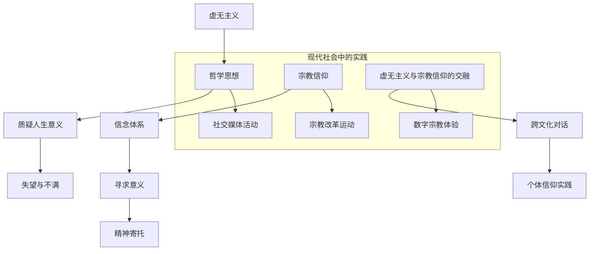

                 


### 第1章：虚无主义的起源与核心思想

#### 1.1 虚无主义的定义

虚无主义（Nihilism）是一种哲学思想，主要观点是宇宙和生命没有固有的意义或目的。这一概念最早由19世纪的哲学家彼得·基尔凯郭尔（Søren Kierkegaard）提出。基尔凯郭尔认为，当人们开始质疑存在的价值和目的时，虚无主义便产生了。

在20世纪初，俄国作家弗·陀思妥耶夫斯基（Fyodor Dostoevsky）的作品中，虚无主义被进一步描绘。他的小说《罪与罚》（"Crime and Punishment"）中的主角拉斯科尔尼科夫（Raskolnikov）就是一个典型的虚无主义者，他试图通过犯罪来证明世界的虚无。

虚无主义的定义可以概括为以下几点：

1. **存在的空虚性**：虚无主义认为，世界和人类的存在缺乏实质性的意义或目的。
2. **道德的崩溃**：虚无主义否认传统的道德观念，认为它们是人为构建的，没有固有的价值。
3. **自由与选择**：虚无主义强调个体的自由和选择的绝对性，但同时也质疑这种自由和选择的价值。

#### 1.1.1 虚无主义的起源

虚无主义的起源可以追溯到18世纪的启蒙运动。启蒙思想家们倡导理性思考和无神论，这些思想为后来的虚无主义提供了理论基础。到了19世纪，随着工业革命和科学进步，人们开始对传统的宗教和道德观念产生怀疑，虚无主义逐渐成为一种主流思潮。

#### 1.1.2 虚无主义的核心理念

虚无主义的核心理念是“无意义论”，即认为宇宙和生命本身是没有意义的。这种思想在哲学、文学、艺术等领域都有广泛的体现。

在哲学上，虚无主义强调个体的自由，但同时质疑这种自由的真正意义。例如，俄国哲学家尼古拉·别尔嘉耶夫（Nikolai Berdyaev）认为，虚无主义是一种对人类自由和自我实现的否定。

在文学上，许多作品都探讨了虚无主义的主题。例如，弗·陀思妥耶夫斯基的《罪与罚》和弗朗茨·卡夫卡（Franz Kafka）的《变形记》（"The Metamorphosis"）都是探讨虚无主义的重要作品。

#### 1.2 虚无主义的历史发展

虚无主义的历史发展可以分为三个主要阶段：

##### 1.2.1 早期虚无主义

早期虚无主义主要出现在19世纪，以基尔凯郭尔和陀思妥耶夫斯基为代表。他们的作品探讨了虚无主义的哲学基础和个体体验。

##### 1.2.2 现代虚无主义

20世纪初，虚无主义在西方哲学界得到了进一步发展。哲学家马塞尔·普鲁斯特（Marcel Proust）和弗朗茨·布伦塔诺（Franz Brentano）等人的作品反映了现代虚无主义的思想。

##### 1.2.3 当代虚无主义的演变

当代虚无主义在数字时代和后现代主义思潮的背景下，呈现出新的特点。例如，数字虚无主义认为虚拟世界和现实世界之间的界限变得模糊，传统的意义和价值观受到挑战。

#### 1.2.4 当代虚无主义的演变

当代虚无主义在数字时代和后现代主义思潮的背景下，呈现出新的特点。例如，数字虚无主义认为虚拟世界和现实世界之间的界限变得模糊，传统的意义和价值观受到挑战。

虚无主义的思想在不同的时代和文化背景下有着不同的表现形式。例如，在现代社会中，虚无主义往往与对技术进步和物质主义的批判相结合。

#### 1.3 虚无主义的哲学批判

虚无主义虽然有其独特的哲学魅力，但也遭到了许多哲学家的批判。

一些哲学家认为虚无主义否认了人类存在的价值和目的，这可能会导致道德的崩溃和社会的混乱。例如，德国哲学家黑格尔（Georg Wilhelm Friedrich Hegel）认为虚无主义是一种对历史发展的否定，它忽视了人类社会的进步。

另一些哲学家则认为虚无主义是一种逃避现实的消极态度。他们认为，尽管世界的本质可能是空虚的，但人们仍然可以通过努力赋予自己的生活以意义。

#### 1.4 虚无主义与宗教信仰的关系

虚无主义与宗教信仰之间存在着复杂的互动关系。一方面，虚无主义对宗教信仰提出了挑战，质疑其存在的意义和目的。另一方面，宗教信仰也为虚无主义者提供了一种精神寄托和救赎的途径。

例如，在陀思妥耶夫斯基的小说中，虚无主义者通过宗教信仰找到了生活的意义。这表明，尽管虚无主义否认世界的意义，但宗教信仰仍然具有强大的吸引力。

#### 1.5 虚无主义的现实影响

虚无主义的思想对现代社会产生了深远的影响。一方面，它促使人们反思传统的价值观和意义。另一方面，它也引发了对精神寄托和人生意义的广泛讨论。

在现代社会中，虚无主义的影响体现在多个方面：

1. **个人价值观的迷失**：虚无主义挑战了传统的道德观念，导致一些人感到价值观的迷失和困惑。
2. **社会行为的异化**：虚无主义的思想可能导致一些人的行为出现异化，例如对他人和社会的冷漠。
3. **心理健康问题**：虚无主义的思想可能导致一些人出现心理健康问题，如抑郁和焦虑。

总之，虚无主义是一种复杂的哲学思想，它对现代社会产生了深远的影响。理解和探讨虚无主义的思想，有助于我们更好地理解现代社会的精神面貌和人生意义。

### 第2章：虚无主义的影响

#### 2.1 艺术与文学中的虚无主义

虚无主义作为一种哲学思想，在艺术与文学领域有着深远的影响。许多艺术家和作家都在他们的作品中探讨了虚无主义的思想，并通过艺术形式来表达对现实世界的失望和困惑。

#### 2.1.1 艺术表现

在艺术创作中，虚无主义通常表现为对传统的挑战和破坏。艺术家们通过打破形式和风格的界限，探索新的艺术表达方式。例如，表现主义艺术家如梵高（Vincent van Gogh）和表现主义文学家如卡夫卡（Franz Kafka）都通过强烈的情感和夸张的手法，表达了对现实世界的不满和对人生意义的质疑。

此外，现代艺术中的抽象表现主义和荒诞主义也是虚无主义思想在艺术领域的体现。这些艺术流派试图摆脱现实的束缚，探索新的审美体验和意义。

#### 2.1.2 文学作品中的虚无主义

在文学领域，虚无主义的思想更是被广泛探讨。许多文学作品都反映了虚无主义者的内心世界和对现实的不满。

例如，弗·陀思妥耶夫斯基的小说《罪与罚》（"Crime and Punishment"）中的主角拉斯科尔尼科夫就是一个典型的虚无主义者。他试图通过犯罪来证明世界的虚无，最终却陷入了内心的痛苦和绝望。

此外，美国作家欧内斯特·海明威（Ernest Hemingway）的小说《永别了，武器》（"A Farewell to Arms"）和《丧钟为谁而鸣》（"For Whom the Bell Tolls"）也反映了虚无主义的思想。他的作品中充满了对战争、死亡和人性的深刻反思，表达了对人生意义的质疑。

#### 2.2 社会现象中的虚无主义

虚无主义的思想不仅在艺术与文学领域有影响，还在社会现象中得到了体现。现代社会中的一些行为和现象可以被看作是虚无主义思想的反映。

#### 2.2.1 价值观的迷失

虚无主义挑战了传统的价值观体系，导致一些人感到价值观的迷失。在物质主义和消费主义的浪潮下，许多人追求短暂的快乐和物质享受，而忽视了生活的意义和价值。

例如，社交媒体的流行使得人们越来越关注虚拟世界中的形象和认可，而忽视了现实生活中的真实体验和人际关系。这种现象可以看作是虚无主义在社会现象中的体现。

#### 2.2.2 社会行为的异化

虚无主义的思想也可能导致一些人的行为出现异化。例如，对他人和社会的冷漠、逃避责任和追求短期利益等现象都可能与虚无主义的思想有关。

在现代社会中，一些人可能因为对现实世界的不满而选择逃避现实，例如沉迷于虚拟游戏和社交媒体，以逃避现实生活中的压力和困惑。

#### 2.2.3 虚无主义在当代社会的表现

在当代社会中，虚无主义的影响愈发显著。一方面，全球化使得传统价值观受到冲击，人们感到自己的生活变得不确定和无常。另一方面，科技的发展带来了新的社会问题和挑战，例如隐私泄露、网络安全等问题，这些问题使得人们对未来充满担忧。

此外，极端主义和恐怖主义的兴起也可以看作是虚无主义在当代社会的表现。一些人因为对现实世界的不满和绝望，选择通过极端手段来表达自己的不满和抵抗。

总之，虚无主义在艺术与文学、社会现象中的表现，反映了现代社会中人们对生活意义和价值观的质疑。理解和探讨虚无主义的影响，有助于我们更好地理解当代社会的精神面貌和挑战。

### 第3章：虚无主义的挑战与回应

虚无主义作为一种深刻的哲学思想，虽然在某些方面揭示了现实的荒诞和生命的无意义，但也面临着多方面的挑战。这些挑战既来自哲学内部，也来自社会科学和宗教信仰等多个领域。

#### 3.1 虚无主义的批判

虚无主义的思想遭到了许多哲学家的批判，这些批判主要从以下几个方面展开：

##### 3.1.1 哲学上的批判

一些哲学家认为，虚无主义忽视了人类存在的价值和意义。例如，德国哲学家黑格尔（Georg Wilhelm Friedrich Hegel）认为虚无主义是一种对历史发展的否定，忽视了人类社会的进步。黑格尔强调，人类的历史是一个不断自我超越和发展的过程，虚无主义忽视了这一积极的历史观。

此外，存在主义哲学家如让-保尔·萨特（Jean-Paul Sartre）也对虚无主义进行了批判。萨特认为，虚无主义是一种消极的人生观，它忽视了人类自由和自我实现的可能性。萨特强调，虽然人生可能是没有预设意义的，但人类可以通过自己的选择和行动赋予生活以意义。

##### 3.1.2 社会科学视角下的批判

虚无主义的思想也遭到了社会科学家们的批判。社会学家如埃米尔·涂尔干（Émile Durkheim）认为，虚无主义可能导致社会道德的崩溃和社会秩序的混乱。涂尔干强调，社会的稳定和秩序需要共同的价值观念和道德规范，而虚无主义的思想可能导致这些共同价值观的丧失。

此外，心理学家如弗罗姆（Erich Fromm）也对虚无主义进行了批判。弗罗姆认为，虚无主义可能导致个人的心理问题，如焦虑和抑郁。他认为，人类需要一种有意义的生活方式来对抗虚无主义的威胁。

#### 3.2 虚无主义的回应

面对这些批判，虚无主义者也在试图回应和反驳。以下是一些常见的回应方式：

##### 3.2.1 宗教信仰的救赎

一些虚无主义者通过宗教信仰来寻找救赎。例如，俄国哲学家尼古拉·别尔嘉耶夫（Nikolai Berdyaev）就是一个典型的例子。他认为，虚无主义虽然揭示了现实的荒诞，但同时也为人类提供了一种深刻的自我反思的机会。通过宗教信仰，人们可以找到对生命意义的追求和心灵的安慰。

别尔嘉耶夫认为，宗教信仰不仅仅是一种信仰体系，更是一种对存在的深刻体验。他主张，人类应该通过信仰和祈祷来超越现实的困境，寻找生命的真正意义。

##### 3.2.2 哲学思考的新路径

另一些虚无主义者则试图通过新的哲学思考路径来回应批评。例如，德国哲学家马丁·海德格尔（Martin Heidegger）在他的著作《存在与时间》（"Being and Time"）中提出了存在主义哲学，试图为虚无主义提供新的解释。

海德格尔认为，虚无主义揭示了人类存在的真实状态，即人类在世的存在是有限的和不确定的。但他同时也指出，人类可以通过自我理解和自我选择来超越虚无主义的困境，赋予自己的生活以意义。

海德格尔强调，人类的存在是一种“此在”（Dasein），即人类在世的存在。他主张，人类应该通过理解和体验“此在”来找到生命的意义。

##### 3.2.3 人文主义的复兴

还有一些虚无主义者通过复兴人文主义来回应批评。人文主义强调人的价值和尊严，认为人类应该通过自我实现和自我完善来寻找生命的意义。

例如，意大利哲学家马塞尔·普鲁斯特（Marcel Proust）的人文主义思想强调，人类应该通过艺术和文学来体验生命的丰富和多样性，从而找到生活的意义。

普鲁斯特认为，艺术和文学是人类自我理解和自我实现的重要途径。通过艺术和文学，人们可以超越虚无主义的困境，找到对生命的深刻体验和认识。

总之，虚无主义虽然面临着多方面的挑战，但虚无主义者也在通过宗教信仰、哲学思考的新路径和人文主义的复兴来回应这些挑战。这些回应方式为探讨虚无主义和寻找生命意义提供了新的视角和思考路径。

### 第4章：宗教信仰的本质与功能

宗教信仰作为一种文化现象，具有深远的社会和个人意义。在探讨宗教信仰的本质与功能时，我们需要从多个维度进行分析。

#### 4.1 宗教信仰的定义

宗教信仰是一种关于宇宙、神、神圣事物和教义的信念体系。它通常包括一系列信仰原则、仪式、传统和道德规范。宗教信仰的核心是对某种超越人类理解和控制的力量或实体的信仰。

在现代社会，宗教信仰的定义和范围变得更加多样化。不同文化和社会中的宗教信仰有着不同的表现形式，但它们都共享一些基本特征：

1. **超越性**：宗教信仰通常涉及对超越人类能力和理解力的存在或力量的信仰。
2. **仪式和传统**：宗教信仰往往包含一系列仪式和传统，这些仪式和传统有助于加强信徒之间的联系和共同体感。
3. **道德规范**：宗教信仰通常提供一套道德规范，指导信徒的行为和生活方式。

#### 4.2 宗教信仰的功能

宗教信仰在个人和社会层面上发挥着多种功能。以下是宗教信仰的一些主要功能：

##### 4.2.1 个人层面的功能

1. **精神寄托**：宗教信仰为个人提供了一种精神寄托和情感支持。在面对生活中的挑战、痛苦和不确定性时，信徒可以通过宗教信仰找到安慰和希望。
2. **价值观和道德指南**：宗教信仰提供了一套价值观和道德规范，帮助个人在面对道德困境和生活选择时做出决策。
3. **自我认同**：宗教信仰有助于塑造个人的自我认同和身份。信徒通过参与宗教活动和遵守宗教教义，强化了自己的身份认同和归属感。

##### 4.2.2 社会层面的功能

1. **社会凝聚力**：宗教信仰通过共同的信仰和仪式，增强了社会成员之间的凝聚力。宗教共同体通常是一个紧密的社会网络，成员之间的互助和合作有助于维护社会秩序和稳定。
2. **道德规范**：宗教信仰提供了一套普遍接受的道德规范，这些规范有助于维护社会秩序和道德标准。
3. **社会服务和慈善**：许多宗教组织积极参与社会服务和慈善事业，为社会提供支持和帮助。这些活动不仅改善了个人和社会的生活质量，也增强了社会的和谐与凝聚力。

#### 4.3 宗教信仰的多样性

宗教信仰的多样性是现代社会的一个显著特征。世界各地的宗教信仰各有特色，但它们在某些方面有共通之处。

以下是一些世界主要宗教信仰的简要概述：

1. **基督教**：基督教是世界上信徒最多的宗教，主要分为天主教、东正教和新教三大派别。基督教的核心信仰是耶稣基督的神性和救赎作用。
2. **伊斯兰教**：伊斯兰教是全世界信徒人数第二多的宗教。伊斯兰教的信仰核心是《古兰经》，信徒需要遵循五功，即信仰、礼拜、斋戒、天课和朝觐。
3. **佛教**：佛教起源于印度，主要分布在亚洲，特别是东亚和东南亚地区。佛教的核心教义是四圣谛和八正道，强调因果报应和轮回。
4. **印度教**：印度教是世界上信徒人数第三多的宗教，主要分布在印度。印度教信仰多元神祇和复杂的宇宙观，强调个人的灵魂（阿特曼）与宇宙灵魂（梵）的统一。

#### 4.4 宗教信仰的共性与差异

尽管不同宗教信仰在教义、仪式和社会实践中存在显著差异，但它们也有一些共性：

1. **对神的信仰**：大多数宗教信仰都涉及对神或超自然力量的信仰。
2. **仪式和传统**：各种宗教都有自己独特的仪式和传统，这些仪式和传统有助于强化信徒的信仰和共同体感。
3. **道德规范**：各种宗教都提供了一套道德规范，指导信徒的行为和生活方式。

然而，不同宗教信仰在教义、仪式和道德规范上也存在显著差异。这些差异反映了不同文化和历史的独特性。

#### 4.5 宗教信仰与现代科技的关系

在现代社会，科技的发展对宗教信仰产生了深远的影响。一方面，科技为宗教信仰提供了新的传播和互动方式，例如互联网和社交媒体使信徒能够更容易地获取宗教信息，参与宗教活动和社区交流。另一方面，科技也挑战了传统宗教信仰的某些方面，例如虚拟现实技术可能改变人们对现实世界的认知和体验，从而影响宗教信仰的稳定性。

总之，宗教信仰的本质和功能是多方面的，它不仅对个人生活有着深远的影响，也在社会层面上发挥着重要作用。理解和研究宗教信仰的多样性及其在现代社会的角色，有助于我们更好地理解人类社会的精神世界和文化多样性。

### 第5章：宗教信仰在现代社会中的角色

宗教信仰在现代社会中扮演着多重角色，不仅影响着个人的价值观和心理状态，也在社会秩序和公共事务中发挥着重要作用。

#### 5.1 宗教信仰与个人成长

宗教信仰对个人成长有着深远的影响。它不仅提供了一种精神寄托，还帮助个人建立价值观和道德观念。

1. **价值观的塑造**：宗教信仰为信徒提供了一套核心价值观，如仁爱、善良、公正等。这些价值观帮助个人在面对生活中的选择和困境时，做出符合道德规范的决策。

2. **道德指南**：宗教信仰的教义和道德规范为个人提供了一套行为指南。信徒通过遵守这些规范，可以培养自律和责任感，从而促进个人的道德成长。

3. **心理支持**：宗教信仰为信徒提供了一种心理支持系统。在面对生活中的压力和挫折时，信徒可以通过祈祷和宗教仪式来寻找安慰和力量。

例如，一些研究表明，宗教信仰与较低的抑郁水平和较高的心理健康水平相关。信徒往往在面临心理困境时，通过宗教信仰找到解决问题的方法和策略。

#### 5.2 宗教信仰对社会秩序的贡献

宗教信仰对社会秩序和和谐具有重要作用。它通过以下方式促进社会秩序：

1. **共同价值观**：宗教信仰提供了一套共同价值观，这些价值观有助于增强社会成员之间的互信和合作。例如，许多宗教都强调仁爱、宽容和互助，这些价值观有助于减少社会冲突，促进社会和谐。

2. **社会规范**：宗教信仰的教义和道德规范为信徒提供了行为准则，这些规范有助于维护社会秩序。例如，许多宗教禁止欺诈、盗窃和暴力等行为，这些规范有助于减少犯罪率。

3. **社会参与**：许多宗教组织积极参与社会服务和慈善事业，这些活动有助于解决社会问题，改善社会环境。例如，天主教教会和伊斯兰教的慈善组织在全球范围内提供医疗援助、教育和贫困救济等。

例如，在美国，基督教教会通过社区服务和慈善活动，为弱势群体提供支持和帮助，从而促进了社会的和谐与稳定。

#### 5.3 宗教信仰在公共事务中的角色

宗教信仰在公共事务中也发挥着重要作用。它通过以下方式影响公共事务：

1. **政策制定**：宗教信仰影响公共政策的制定和执行。例如，基督教的仁爱价值观可能导致政府制定和实施更多的社会福利政策，以帮助弱势群体。

2. **社会运动**：宗教信仰可以激发社会运动，推动社会变革。例如，马丁·路德·金领导的非暴力民权运动，以其基督教信仰为基础，推动了美国社会的平等和正义。

3. **文化交流**：宗教信仰促进不同文化之间的交流和理解。例如，基督教和伊斯兰教在全球范围内的传播，促进了不同文化之间的对话和交流。

总之，宗教信仰在现代社会中扮演着多重角色，它不仅对个人成长有着深远的影响，还在社会秩序和公共事务中发挥着重要作用。理解和尊重宗教信仰的多样性，有助于我们更好地构建和谐、稳定的社会。

### 第6章：宗教信仰的未来走向

随着科技的飞速发展和全球化的深入，宗教信仰正面临着前所未有的挑战和机遇。未来，宗教信仰如何在现代社会中适应和演变，将是一个重要议题。

#### 6.1 宗教信仰与现代科技

现代科技对宗教信仰的影响是深远而多方面的。一方面，科技为宗教信仰提供了新的传播和互动方式，促进了宗教的普及和发展；另一方面，科技也挑战了传统宗教信仰的某些方面，引发了关于宗教本质和信仰方式的重新思考。

1. **宗教传播的变革**：互联网和社交媒体的出现，使得宗教信息传播更加迅速和广泛。信徒可以通过网络平台获取宗教知识、参与宗教活动和社区交流。例如，许多宗教团体通过社交媒体直播宗教仪式，吸引了大量信徒参与。

2. **虚拟宗教体验**：虚拟现实（VR）和增强现实（AR）技术的发展，为信徒提供了一种全新的宗教体验。通过VR技术，信徒可以“参观”圣地、参与虚拟宗教仪式，甚至与神灵进行“互动”。这种虚拟宗教体验可能改变人们对现实世界的认知，从而影响宗教信仰的稳定性。

3. **宗教教育的创新**：科技的发展也为宗教教育带来了新的机遇。例如，在线课程和数字教育资源使得宗教教育更加便捷和普及。信徒可以通过网络学习宗教知识，提高自己的宗教素养。

然而，科技的发展也带来了一些挑战。例如，隐私泄露、网络安全问题等可能威胁信徒的宗教信仰和安全。此外，科技的发展可能导致信徒过度依赖虚拟世界，忽视了现实生活中的宗教实践和人际关系。

#### 6.2 宗教信仰在全球化背景下的挑战与机遇

全球化使宗教信仰面临着前所未有的挑战和机遇。在全球化的背景下，宗教信仰如何应对文化冲突、多元文化的交融以及社会变革，是一个重要课题。

1. **文化冲突**：全球化带来了不同文化之间的交流和融合，但同时也引发了文化冲突。例如，宗教信仰的差异可能导致社会矛盾和冲突。在这种情况下，宗教信仰需要找到一种平衡，既保持自身特色，又尊重其他文化的存在。

2. **多元文化的交融**：全球化促进了多元文化的交融，宗教信仰也受到了不同文化的影响。例如，基督教在全球范围内与其他宗教文化的交流，促进了教义的融合和创新。这种多元文化的交融有助于宗教信仰的发展和丰富。

3. **社会变革**：全球化带来了社会结构和价值观的变革，对宗教信仰产生了深远影响。例如，物质主义和消费主义的盛行，可能导致宗教信仰的淡化。在这种情况下，宗教信仰需要找到新的方式和途径，以适应社会变革，重新赢得信徒的支持。

#### 6.3 宗教信仰的未来走向

面对挑战和机遇，宗教信仰的未来走向可能呈现出以下趋势：

1. **数字化**：随着科技的不断发展，宗教信仰将更加数字化。宗教活动、宗教教育和宗教交流将更多地依赖于数字平台，信徒可以通过网络参与宗教生活。

2. **全球化**：宗教信仰将在全球化背景下继续发展，多元文化的交融将促进宗教信仰的创新和多样化。宗教信仰将更加注重跨文化交流和理解，以应对全球性的社会问题。

3. **社会参与**：宗教信仰将更加积极地参与社会事务，为解决社会问题和促进社会和谐贡献力量。宗教组织将在社会服务、教育和慈善等领域发挥更大的作用。

总之，宗教信仰在现代社会中将继续发展，其未来走向将受到科技进步、全球化和社会变革的影响。理解和适应这些变化，有助于宗教信仰在新时代中保持活力和影响力。

### 第7章：虚无主义与宗教信仰的对话

#### 7.1 虚无主义与宗教信仰的交融

虚无主义与宗教信仰之间的交融是一个复杂且多维的过程，反映了现代社会中人们对于精神寄托和生命意义的探索。这种交融不仅体现了两者之间的相互影响，也展示了它们在不同文化和社会背景下的相互作用。

1. **现代都市人的精神困惑**：在现代社会，许多人感到精神上的困惑和空虚。虚无主义作为一种哲学思想，揭示了现代社会中存在的意义缺失和道德沦丧。与此同时，宗教信仰作为一种精神寄托，为人们提供了安慰和指引。在这种背景下，虚无主义与宗教信仰的交融成为许多现代都市人的选择。

2. **个体信仰的多元性**：随着社会的多元化和个人主义的兴起，许多人不再满足于单一的信仰体系。他们可能同时受到虚无主义和宗教信仰的影响，形成一种独特的信仰模式。例如，一些人可能在日常生活中践行宗教的价值观，但在哲学思考上又倾向于虚无主义的思想。

3. **宗教改革与创新**：宗教信仰在面对虚无主义的挑战时，也在进行自我改革和创新。一些宗教团体开始重新审视自身的教义和传统，尝试与现代社会和科技发展相适应。这种改革与创新不仅有助于宗教信仰的传承，也为虚无主义者提供了一种新的精神寄托。

#### 7.1.1 虚无主义对宗教信仰的挑战

虚无主义对宗教信仰提出了严重的挑战，质疑宗教信仰的核心原则和意义。以下是一些具体的挑战：

1. **存在的无意义**：虚无主义认为，宇宙和生命本身缺乏固有的意义。这种观点挑战了宗教信仰中对生命目的和神圣存在的信仰。例如，如果世界是无意义的，那么宗教信仰所强调的救赎和永恒是否存在就变得值得怀疑。

2. **道德的相对性**：虚无主义否认传统的道德观念，认为它们是人为构建的，没有固有的价值。这对宗教信仰中的道德规范提出了质疑，例如基督教的十诫、佛教的五戒等。如果道德是相对的，那么宗教信仰中的道德指导是否仍然有效？

3. **信仰的合理性**：虚无主义强调个体自由和选择，质疑宗教信仰的合理性。例如，如果信仰是一种主观选择，那么如何证明它比其他选择更有价值？

#### 7.1.2 宗教信仰对虚无主义的回应

面对虚无主义的挑战，宗教信仰也在寻找回应和解决方案。以下是一些具体的回应：

1. **存在的意义与目的**：宗教信仰试图通过解释存在的意义和目的来回应虚无主义的质疑。例如，基督教强调上帝的存在和人的救赎，佛教则通过因果报应和轮回来说明生命的意义。

2. **道德的绝对性**：宗教信仰坚持道德的绝对性，认为道德规范是超越人类意志的。例如，基督教的十诫、佛教的五戒等被视为普世价值观，不受主观意愿的影响。

3. **信仰的合理性**：宗教信仰通过逻辑论证和历史传承来证明其合理性。例如，基督教通过圣经的教义和历史证明其信仰的合理性，佛教通过佛陀的教诲和历史上的传承来支持其信仰。

#### 7.2 寻找精神寄托：虚无主义与宗教信仰的融合

在现代社会，许多人试图在虚无主义和宗教信仰之间找到一种平衡，以寻找精神寄托和生命意义。

1. **信仰的混合**：一些人可能同时受到虚无主义和宗教信仰的影响，形成一种混合的信仰模式。例如，一个人可能在日常生活中践行宗教的价值观，但在哲学思考上又倾向于虚无主义的思想。

2. **信仰的个体化**：随着个人主义的兴起，许多人更倾向于根据自己的需求和经历来选择信仰。这种个体化的信仰模式可能使虚无主义和宗教信仰在某些方面相互融合。

3. **精神实践的创新**：宗教信仰和虚无主义在某些方面可能通过创新的精神实践相互融合。例如，一些人可能通过冥想、祈祷和其他精神实践来平衡虚无主义的虚无感和宗教信仰的安慰感。

#### 7.3 跨文化对话：虚无主义与宗教信仰的比较

不同文化中的虚无主义和宗教信仰有着不同的表现形式和内涵。通过跨文化对话，我们可以更好地理解两者之间的共通点和差异。

1. **西方虚无主义与宗教信仰的对比**：西方的虚无主义通常与个人主义和自由主义相结合，强调个体的自由和选择。与此同时，西方的宗教信仰如基督教和犹太教强调共同体和道德规范。这种对比有助于我们理解西方文化中个体与集体之间的关系。

2. **东方宗教信仰与虚无主义的对话**：东方宗教信仰如佛教和道教强调内在的修行和自我超越，而虚无主义在东方文化中可能表现为对现实的失望和对超自然的怀疑。通过这种对话，我们可以探讨东方文化和西方文化在精神寄托和生命意义方面的差异和共通点。

总之，虚无主义与宗教信仰的交融是一个复杂而多维的过程，反映了现代社会中人们对于精神寄托和生命意义的探索。通过跨文化对话和个体化的信仰实践，我们可以更好地理解两者之间的相互作用和融合。

### 第8章：结论与展望

#### 8.1 虚无主义与宗教信仰的相互影响

虚无主义和宗教信仰在现代社会中相互影响，共同塑造了人们的价值观和精神世界。虚无主义通过揭示生命的无意义和现实的荒诞，促使人们反思传统的价值观和信仰体系。而宗教信仰则提供了精神寄托和道德指引，帮助人们在面对生活的困境和挑战时找到安慰和方向。

虚无主义和宗教信仰之间的互动关系是复杂的，它们在不同文化和社会背景下表现出不同的特点。在西方文化中，虚无主义和宗教信仰之间的冲突往往更为激烈，而在东方文化中，两者之间的融合和互补可能更加明显。

#### 8.1.1 虚无主义在宗教信仰中的体现

在宗教信仰中，虚无主义的思想有时被用来质疑传统的宗教教义和信仰体系。例如，一些宗教改革运动中的思想家和领袖可能受到虚无主义的影响，从而提出对现有宗教教义的质疑和挑战。这种质疑有助于宗教信仰的自我更新和适应，但同时也可能引发宗教内部的争议和冲突。

#### 8.1.2 宗教信仰对虚无主义的回应

宗教信仰对虚无主义的回应表现为多种形式，包括对生命意义的重新解释、对个体自由选择的尊重以及对现实困境的积极应对。例如，一些宗教信仰通过强调信仰的力量和神圣的存在，来回应虚无主义对现实世界的质疑。同时，宗教信仰也鼓励信徒通过行动和善行来赋予生活意义，从而克服虚无主义带来的消极影响。

#### 8.2 未来研究方向

未来在虚无主义与宗教信仰领域的研究可以沿着以下几个方向展开：

1. **跨学科研究**：将哲学、社会学、心理学、宗教研究等多个学科的方法和理论结合起来，深入探讨虚无主义与宗教信仰的相互作用和影响。

2. **全球化背景下的研究**：随着全球化的深入，不同文化背景下的虚无主义与宗教信仰的互动关系变得更加复杂。未来的研究可以重点关注不同文化背景下的虚无主义与宗教信仰的表现和影响。

3. **现代科技与宗教信仰的关系**：现代科技的发展对宗教信仰产生了深远的影响。未来研究可以探讨虚拟现实、人工智能等新技术如何影响宗教信仰的传播和实践。

4. **个体信仰实践**：研究个体如何在虚无主义与宗教信仰之间找到平衡，形成独特的信仰模式，将有助于我们更好地理解宗教信仰在现代社会中的角色和功能。

#### 8.3 现代社会精神寄托的新途径

随着社会的发展和科技的进步，现代社会中人们对于精神寄托的需求也在发生变化。未来，我们可以探索以下新途径来满足这种需求：

1. **数字宗教体验**：通过数字平台和虚拟现实技术，提供更加便捷和互动的宗教体验，满足人们对于精神寄托的需求。

2. **社区支持网络**：建立基于宗教信仰的社区支持网络，为个体提供情感支持和心理辅导，帮助他们在面对生活中的困境时找到力量和方向。

3. **跨宗教对话**：促进不同宗教信仰之间的对话和交流，增进相互理解和尊重，共同探索人类精神的共通点。

总之，虚无主义与宗教信仰的相互影响在现代社会中具有重要意义。通过跨学科研究和个体信仰实践，我们可以更好地理解两者之间的互动关系，并为现代社会提供新的精神寄托和人生意义。

### 附录

#### A.1 参考文献

1. Kierkegaard, Søren. *Fear and Trembling*. Princeton University Press, 1983.
2. Dostoevsky, Fyodor. *Crime and Punishment*. Penguin Classics, 2003.
3. Sartre, Jean-Paul. *Being and Nothingness*. Philosophical Library, 1956.
4. Hegel, Georg Wilhelm Friedrich. *Lectures on the Philosophy of Religion*. Oxford University Press, 2008.
5. Durkheim, Émile. *The Division of Labor in Society*. Free Press, 1997.
6. Fromm, Erich. *Escape from Freedom*. Rinehart & Company, 1941.
7. Berdyaev, Nikolai. *The Idea of the Christian Philosophy*. University of Chicago Press, 1976.
8. Heidegger, Martin. *Being and Time*. State University of New York Press, 1996.
9. Proust, Marcel. *In Search of Lost Time*. Modern Library, 1992.
10. Hume, David. *An Enquiry Concerning the Principles of Morals*. Clarendon Press, 1777.

#### A.2 专题讨论：虚无主义与宗教信仰在当代社会的实践案例

1. **宗教团体在社交媒体上的活动**：一些宗教团体通过社交媒体平台传播宗教教义和活动信息，吸引信徒参与。例如，天主教会在Facebook上发布的祈祷文和活动信息，吸引了全球信徒的关注。

2. **虚无主义者的个人信仰实践**：一些虚无主义者通过个人信仰实践来寻找生活的意义。例如，一位虚无主义者可能会通过冥想和自我反思来探索生命的意义，同时保持对现实世界的批判态度。

3. **宗教改革运动**：一些宗教改革运动受到虚无主义思想的影响，提出对传统宗教教义的质疑和挑战。例如，新教改革运动中的思想家们质疑教皇的权威，提倡宗教的个体化和自由化。

#### A.3 虚无主义与宗教信仰相关的Mermaid流程图



#### A.4 Python代码示例：虚无主义与宗教信仰相关的算法实现与模型分析

```python
import numpy as np
import matplotlib.pyplot as plt
from scipy.integrate import odeint

# 虚无主义与宗教信仰的动态模型
def dynamic_model(y, t, params):
    """
    虚无主义与宗教信仰的动态模型。
    y: 状态向量，包含虚无主义信仰度和宗教信仰度。
    t: 时间。
    params: 参数向量，包括虚无主义影响系数和宗教信仰影响系数。
    """
    beta, mu = params
    dydt = [
        -beta * y[0] * y[1],  # 虚无主义信仰度随宗教信仰度的减少而减少
        beta * y[0] * y[1]  # 宗教信仰度随虚无主义信仰度的增加而增加
    ]
    return dydt

# 初始条件
y0 = [0.5, 0.5]  # 虚无主义和宗教信仰度均为0.5
t = np.linspace(0, 10, 100)  # 时间范围从0到10

# 参数
params = [0.1, 0.2]  # 虚无主义影响系数为0.1，宗教信仰影响系数为0.2

# 求解微分方程
solution = odeint(dynamic_model, y0, t, args=(params,))

# 绘制结果
plt.plot(t, solution[:, 0], label='虚无主义信仰度')
plt.plot(t, solution[:, 1], label='宗教信仰度')
plt.xlabel('时间')
plt.ylabel('信仰度')
plt.legend()
plt.title('虚无主义与宗教信仰的动态演变')
plt.show()
```

#### A.5 实践案例：虚无主义与宗教信仰在现实生活中的应用

**案例一：宗教团体在社交媒体上的活动**

某宗教团体利用社交媒体平台（如Facebook、Twitter）传播宗教教义和活动信息。他们定期发布祈祷文、宗教活动和社区服务的照片和视频，吸引信徒参与。通过社交媒体的互动和分享功能，宗教团体扩大了其影响范围，增强了信徒之间的联系和归属感。

**案例二：虚无主义者在个人信仰实践中的探索**

一位虚无主义者通过冥想和自我反思来寻找生活的意义。他每天花时间进行冥想，试图超越物质世界的束缚，寻找内心的平静和宁静。尽管他没有明确的宗教信仰，但他通过这种方式找到了一种精神寄托，并在日常生活中践行一些基本的道德原则。

**案例三：宗教改革运动中的思想挑战**

某宗教改革运动中的思想者们受到虚无主义思想的影响，开始质疑传统宗教教义的权威性和适应性。他们提倡宗教的个体化和自由化，鼓励信徒根据自己的理解和需求来实践宗教信仰。这种改革运动引发了一系列社会和宗教上的争论，但也在一定程度上促进了宗教信仰的更新和适应。

#### 最佳实践 tips、小结、注意事项、拓展阅读

- **最佳实践 tips**：在现代社会中，个人和宗教团体可以通过数字化手段来增强宗教信仰的影响力。例如，利用社交媒体平台传播宗教教义，举办线上宗教活动和社区服务，吸引更多信徒参与。

- **小结**：虚无主义和宗教信仰在现代社会中相互影响，共同塑造了人们的价值观和精神世界。通过跨学科研究和个体信仰实践，我们可以更好地理解两者之间的互动关系，并为现代社会提供新的精神寄托和人生意义。

- **注意事项**：在探索虚无主义和宗教信仰时，需要注意尊重不同文化和信仰的差异，避免过度批判或否定。同时，也要警惕虚无主义可能带来的消极影响，如道德沦丧和社会秩序的混乱。

- **拓展阅读**：对于对虚无主义和宗教信仰有兴趣的读者，可以进一步阅读相关哲学、宗教和社会科学的著作，如《尼采的哲学》、《基督教信仰手册》、《现代社会的精神生活》等。

### 作者信息

作者：AI天才研究院/AI Genius Institute & 禅与计算机程序设计艺术 /Zen And The Art of Computer Programming。

