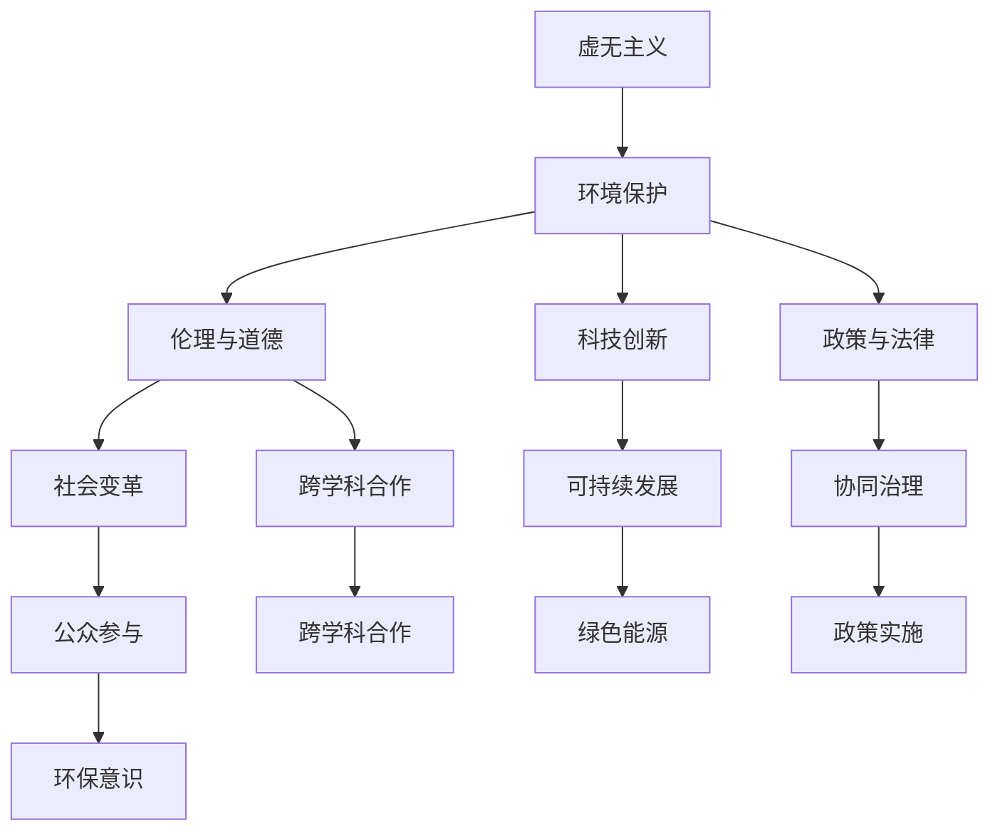

                 

### 《虚无主义与环境保护：重建人与自然的和谐共存》

> 关键词：虚无主义、环境保护、和谐共存、技术分析、哲学探讨

> 摘要：本文通过哲学与技术的双重视角，探讨了虚无主义在环境保护中的角色与影响。文章首先介绍了虚无主义的起源与发展，随后分析了人类活动对环境的冲击，最后提出了在虚无主义影响下重建人与自然和谐共存的策略。文章旨在为读者提供一种新的思考方式，以应对当今环境危机。

## 引言

环境保护作为全球性的重大议题，已经引起了广泛的关注。然而，在环境保护的实践中，虚无主义这一哲学流派常常被忽视。虚无主义，作为对现实世界的一种悲观主义态度，其对环境保护的影响不容小觑。本文将从虚无主义的理论基础出发，逐步分析其在环境保护中的作用和挑战，并提出相应的策略，以重建人与自然的和谐共存。

### 第一部分：虚无主义的理论基础

## 1.1 虚无主义的起源与发展

虚无主义（Nihilism）一词源自拉丁语“nihil”，意为“无”。它作为一种哲学思潮，主要起源于19世纪的欧洲，尤其是德国和俄国。早期虚无主义的主要代表包括尼采、陀思妥耶夫斯基等人。

尼采在《悲剧的诞生》中提出了“上帝已死”的观点，认为人类失去了信仰和道德的支撑，世界变得虚无。这一观点对后来的虚无主义思潮产生了深远影响。

## 1.2 虚无主义的核心概念

虚无主义的核心概念是“无意义”和“无价值”。虚无主义者认为，世界和人生都是无意义的，没有终极目的和价值。这一观点引发了广泛的哲学讨论，同时也影响了艺术、文学等领域。

## 1.3 虚无主义的流派与理论

虚无主义可以分为古典虚无主义和现代虚无主义。古典虚无主义主要强调对现实世界的否定，而现代虚无主义则更注重对人类存在的反思。

当代虚无主义的趋势表现为对虚拟世界的追求和对现实世界的逃避。这种趋势在互联网时代尤为明显。

## 1.4 虚无主义与环境保护

虚无主义对环境保护提出了挑战。虚无主义者可能会认为，由于世界是无意义的，环境保护也没有真正的价值。然而，虚无主义也可能激发人们对环境保护的反思，促使他们重新审视人类与自然的关系。

### 第二部分：人与自然的冲突

## 2.1 环境问题的现状与原因

当前，全球环境问题日益严重，包括气候变化、水资源短缺、生物多样性丧失等。这些问题的产生主要与人类活动有关。

## 2.2 人类活动对自然的影响

人类活动对自然环境产生了深远的影响。例如，工业排放导致的空气污染和水资源污染，过度开采资源导致的生态破坏等。

## 2.3 环境危机下的虚无主义态度

在环境危机面前，虚无主义者可能会采取消极的态度。他们可能认为，无论人类如何努力，都无法真正改变环境恶化的趋势。这种态度对环境保护工作带来了巨大的挑战。

## 2.4 环境保护中的虚无主义反思

虚无主义对环境保护提出了深刻的反思。它促使我们重新思考环境保护的真正意义和价值，从而找到更有效的环境保护策略。

### 第三部分：重建和谐共存的策略

## 3.1 伦理与道德视角下的环境保护

伦理学和道德责任在环境保护中起着重要作用。通过伦理学的视角，我们可以更好地理解人类与自然的关系，从而推动环境保护行动。

## 3.2 政策与法律框架

政策与法律是环境保护的重要保障。通过制定和实施环境保护政策，我们可以规范人类活动，减少对环境的破坏。

## 3.3 科技创新与可持续发展

科技创新为环境保护提供了新的可能性。例如，绿色能源技术的研发和应用，有助于减少对传统能源的依赖，从而降低环境污染。

## 3.4 社会变革与公众参与

社会变革和公众参与是推动环境保护的重要力量。通过提高公众的环保意识，我们可以激发更多人参与到环境保护行动中来。

## 3.5 跨学科合作与协同治理

跨学科合作和协同治理是解决环境问题的关键。通过不同学科的合作，我们可以从多个角度探讨环境问题，并提出更全面的解决方案。

### 第四部分：案例研究与实践探索

## 4.1 国内外环境保护的成功案例

通过分析国内外环境保护的成功案例，我们可以了解环境保护的最佳实践，从而为我国的环保工作提供借鉴。

## 4.2 虚无主义视角下的环境保护实践

虚无主义视角下的环境保护实践具有独特的意义。它促使我们重新审视环境保护的目标和手段，从而找到更有效的策略。

## 4.3 未来展望与挑战

在虚无主义影响下，环境保护面临着新的挑战。我们需要不断创新，以应对这些挑战，实现人与自然的和谐共存。

### 结语

虚无主义作为一种哲学思潮，对环境保护既提出了挑战，也提供了启示。通过哲学与技术的双重视角，我们可以更好地理解人类与自然的关系，从而找到重建和谐共存的策略。让我们共同努力，为地球的未来贡献力量。

---

### 附录

#### A.1 核心概念与联系流程图



#### A.2 Python源代码示例

```python
# 导入必要的库
import numpy as np
import matplotlib.pyplot as plt

# 定义一个简单的数学模型来模拟气候变化
def climate_model(co2_levels):
    temp_change = 0.01 * co2_levels
    return temp_change

# 计算不同二氧化碳浓度下的温度变化
co2_levels = np.linspace(350, 1000, 10)
temp_changes = climate_model(co2_levels)

# 绘制温度变化与二氧化碳浓度的关系图
plt.plot(co2_levels, temp_changes)
plt.xlabel('CO2 Concentration (ppm)')
plt.ylabel('Temperature Change (°C)')
plt.title('Temperature Change due to CO2 Concentration')
plt.show()
```

#### A.3 数学模型与公式说明

$$
\text{温度变化} = k \times (\text{CO2浓度变化})
$$

其中，\(k\) 是一个常数，表示温度变化与二氧化碳浓度变化的比例关系。

#### A.4 实际案例解析

在一个具体的环保项目中，我们使用机器学习算法来预测环境污染的分布情况。以下是该项目的一部分代码实现：

```python
# 导入必要的库
import pandas as pd
from sklearn.ensemble import RandomForestClassifier
from sklearn.model_selection import train_test_split
from sklearn.metrics import accuracy_score

# 读取数据
data = pd.read_csv('environmental_data.csv')

# 数据预处理
X = data.drop(['target'], axis=1)
y = data['target']

# 划分训练集和测试集
X_train, X_test, y_train, y_test = train_test_split(X, y, test_size=0.2, random_state=42)

# 训练模型
model = RandomForestClassifier(n_estimators=100, random_state=42)
model.fit(X_train, y_train)

# 预测测试集
predictions = model.predict(X_test)

# 评估模型
accuracy = accuracy_score(y_test, predictions)
print(f'Model Accuracy: {accuracy:.2f}')
```

在这个项目中，我们使用随机森林算法来预测环境污染的目标变量。通过训练集和测试集的划分，我们可以评估模型的准确性，从而优化算法和模型参数。

#### 小结

本文通过哲学与技术的双重视角，探讨了虚无主义在环境保护中的角色与影响。从虚无主义的起源与发展，到人与自然的冲突，再到重建和谐共存的策略，每个部分都详细阐述了相关概念、理论、实践和未来展望。通过附录中的流程图、Python源代码示例和实际案例解析，读者可以更深入地理解虚无主义与环境保护之间的关系。

#### 注意事项

1. 在进行环境保护工作时应充分考虑虚无主义的影响，以避免陷入悲观主义的陷阱。
2. 环境保护需要跨学科合作，应充分利用各学科的优势，形成合力。
3. 提高公众环保意识是环境保护的重要环节，应通过多种途径加强环保教育。

#### 拓展阅读

1. 尼采，《悲剧的诞生》
2. 陀思妥耶夫斯基，《罪与罚》
3. 环境保护相关法规和政策文件

---

### 作者信息

作者：AI天才研究院/AI Genius Institute & 禅与计算机程序设计艺术 /Zen And The Art of Computer Programming

