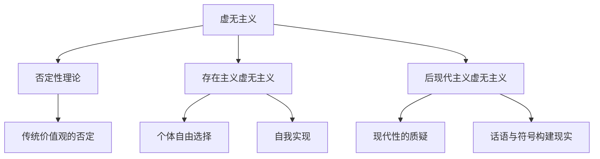

                 

### 摘要

本文以《虚无主义与环境保护：重建人与自然的和谐共生关系》为题，深入探讨了虚无主义哲学与环境保护之间的复杂关系，以及如何通过重建和谐共生关系来应对环境挑战。文章首先介绍了虚无主义的基本概念及其哲学流派，然后分析了虚无主义对环境保护的潜在影响，并探讨了生态哲学与虚无主义的关系。接着，文章详细阐述了当前全球环境问题的现状与趋势，探讨了人类活动对环境的影响。在此基础上，文章提出了重建和谐共生关系的理论探讨，包括其定义、理论基础和实现路径。随后，文章讨论了环境保护的政策与实践，以及技术创新与可持续发展的策略。最后，通过实际案例研究，文章对环境保护项目进行了深入剖析，总结了最佳实践和注意事项。全文旨在为读者提供一个全面而深入的理解，以促进人与自然的和谐共生。

### 第一部分：虚无主义理论

#### 第1章：虚无主义的基本概念与起源

虚无主义，作为现代哲学中的一个重要流派，探讨的是存在与意义的关系，以及在这无意义的世界中人类该如何自处。其基本概念涉及对生命、意义、价值及存在的根本质疑。

**1.1 虚无主义的概念界定**

虚无主义的核心在于对“存在”本身的质疑。它不仅否定传统的道德规范和信仰体系，还质疑一切存在的意义。在虚无主义的视角下，世界显得荒诞且无意义，人类个体的生活也似乎失去方向和目的。

**1.2 虚无主义的起源与发展**

虚无主义的起源可以追溯到古希腊哲学，但作为一个明确的哲学流派，它主要出现在20世纪的西方哲学中。特别是存在主义和后现代主义，对虚无主义思想进行了深入的探讨和扩展。尼采、海德格尔和萨特等哲学家的思想，对虚无主义的发展产生了深远影响。

**1.3 虚无主义的核心理论**

虚无主义的核心理论主要包括以下几方面：

1. **否定性理论**：虚无主义否定传统价值观和道德规范，认为这些观念是对现实的扭曲。
2. **存在主义虚无主义**：这一流派强调个体的自由选择和主观体验，认为在无意义的世界中，个体必须通过自我实现来赋予生命意义。
3. **后现代主义虚无主义**：后现代主义质疑现代性和理性，认为现实是由话语和符号构建的，从而挑战了传统的真理观。

**1.4 虚无主义与哲学、宗教的联系**

虚无主义与哲学和宗教有着深刻的联系。在哲学上，虚无主义与存在主义、现象学和后现代主义等流派有着密切的联系。在宗教上，虚无主义往往被视为对传统宗教信仰的挑战，特别是在神的存在和目的方面。

**Mermaid 流程图：虚无主义核心理论关系架构**

通过这一架构图，我们可以更清晰地理解虚无主义的核心理论及其相互关系。

#### 第2章：虚无主义的流派与观点

虚无主义并非一个统一的哲学流派，而是一个包含多种观点和流派的复杂领域。不同的流派从不同的角度探讨了虚无主义的核心问题，从而形成了丰富的哲学思想。

**2.1 存在主义虚无主义**

存在主义虚无主义是虚无主义中最为著名的流派之一，主要代表人物有尼采和萨特。存在主义虚无主义强调个体的自由和选择，认为人类生活在一个没有预设意义的世界中。在这个世界中，个体必须通过自己的行动和选择来创造自己的意义。

- **尼采的观点**：尼采认为，传统的道德和价值观都是虚幻的，人类需要通过自我超越来找到真正的价值。他提出的“上帝已死”和“超人”概念，是对传统价值观的彻底否定，同时也挑战了虚无主义的悲观主义倾向。
- **萨特的观点**：萨特在《存在与虚无》中阐述了存在主义虚无主义的核心思想。他认为，存在先于本质，人类在出生时并没有预设的意义，而是通过自己的行为和选择来创造自己的本质。这种观点强调了人的自由意志，但也带来了对生活的无尽焦虑和困惑。

**2.2 后现代主义虚无主义**

后现代主义虚无主义是20世纪中后期兴起的哲学流派，它对现代性和理性进行了深刻的质疑。后现代主义认为，现实是由话语和符号构建的，而不是客观存在的。这种观点挑战了传统的真理观和客观性原则。

- **福柯的观点**：福柯是后现代主义虚无主义的代表人物之一，他的思想对当代哲学和社会科学产生了深远的影响。福柯认为，权力和控制是社会现实的基础，知识也是由权力关系塑造的。他的代表作《疯癫与文明》和《词与物》探讨了知识、权力和现实之间的关系，揭示了现实世界的建构过程。
- **利奥塔的观点**：利奥塔在《后现代状况》中提出了后现代主义的核心观点，他认为，现代性的终结意味着真理和权威的崩溃，知识的生产和传播变得更加多元和分散。他提出了“异质逻辑”的概念，认为在后现代世界中，各种不同的知识和真理并存，不再有一个统一的真理标准。

**2.3 现代主义虚无主义**

现代主义虚无主义是虚无主义的一个早期流派，它出现在19世纪末至20世纪初。现代主义虚无主义对科学和理性进行了质疑，认为这些观念并不能完全解释世界的本质。

- **康德的观点**：康德是现代主义虚无主义的先驱之一，他的思想对后来的虚无主义哲学产生了重要影响。康德认为，人类的知识是有限的，我们无法获得关于世界的绝对真理。他的批判哲学试图通过理性的批判来限制知识的范围，从而避免陷入虚无主义的困境。
- **尼采的观点**：尼采继承了康德的思想，进一步提出了对科学和理性的质疑。他认为，科学和理性只是人类理解世界的工具，而不是真理本身。他提出的“上帝已死”和“超人”概念，是对传统价值观和科学的彻底否定。

**2.4 虚无主义的反乌托邦观点**

虚无主义的反乌托邦观点探讨了在一个完全无意义的世界中，人类将如何生存。这种观点认为，人类社会和制度都是无意义的，人类最终将陷入无尽的虚无和绝望。

- **奥威尔和赫胥黎的观点**：奥威尔和赫胥黎是虚无主义的反乌托邦观点的代表人物。他们的作品《1984》和《美丽新世界》描绘了两种极端的社会形态，分别代表了极权和极乐两种极端的虚无主义情境。这些作品探讨了在极端环境下的社会、政治和个人命运，揭示了虚无主义的潜在危险。

通过探讨虚无主义的流派与观点，我们可以更深入地理解虚无主义哲学的复杂性和多样性。虚无主义虽然否定传统价值观和意义，但它也为人类思考和探索自身存在的意义提供了新的视角。

#### 第3章：虚无主义对环境保护的影响

虚无主义哲学对环境保护产生了深远的影响，既带来了挑战，也提供了新的视角。虚无主义质疑传统价值观和现实意义，这种思想对人类如何看待自然和环境产生了重要影响。

**3.1 虚无主义与自然观念的演变**

虚无主义对自然的观念产生了深刻的冲击。在虚无主义看来，世界是荒诞的、无意义的，因此人类对自然的认识和利用也失去了道德和伦理的约束。这种观念的变化体现在几个方面：

1. **对自然资源的利用**：虚无主义促使人们对自然资源进行无节制的开发和利用，因为在这种观念下，自然资源被视为无价值的、无限的，不必担心其消耗殆尽。
2. **生态观念的淡化**：虚无主义否定传统价值观，包括对生态平衡和生物多样性的重视。在这种思想的影响下，人类对生态系统的破坏变得无所顾忌。
3. **对环境问题的漠视**：虚无主义认为现实世界是荒诞的，因此环境问题也被视为无足轻重的。这种思想导致人类对环境保护的积极性降低，加剧了环境问题的恶化。

**3.2 虚无主义对人类行为的启示**

虚无主义对人类行为的影响是多方面的，它既带来了消极后果，也提供了反思和启示：

1. **行为的自由与责任感**：虚无主义强调个体的自由选择，但同时也要求个体对自己的行为负责。在无意义的世界中，人类需要通过自己的行动来创造意义，这要求个体具有高度的责任感和自主性。
2. **对现状的质疑**：虚无主义鼓励人们对现状进行质疑和反思，包括对传统观念和制度的批判。这种质疑精神有助于推动社会的进步和变革，包括环境保护领域。
3. **对人类行为的反思**：虚无主义促使人类重新审视自己的行为和生活方式，思考如何在不完美的世界中找到生活的意义和价值。这种反思有助于人类更加关注环境保护，寻找可持续发展的道路。

**3.3 虚无主义对环境保护的潜在影响**

虚无主义对环境保护的潜在影响是复杂的，它既有可能加剧环境问题，也有助于环境保护意识的提升：

1. **加剧环境破坏**：虚无主义可能使人们更加倾向于无节制地利用自然资源，加剧环境破坏。例如，在追求经济利益的过程中，企业可能会忽视环境保护，导致生态系统的破坏。
2. **促进环境保护意识的觉醒**：另一方面，虚无主义也促使人们反思传统价值观，认识到环境保护的重要性。在这种思想的启发下，一些人开始关注生态问题，推动环境保护运动的发展。
3. **促进生态哲学的发展**：虚无主义与生态哲学有着深刻的联系。生态哲学强调人类与自然的和谐共生，而虚无主义对传统价值观的质疑也为生态哲学的发展提供了新的理论基础。通过结合虚无主义和生态哲学的思想，可以提出更全面、更深刻的环保理念。

**3.4 虚无主义的环保主义观点**

虚无主义的环保主义观点主张通过质疑传统价值观和现实意义来推动环境保护。这种观点认为，只有从根本上改变人类对自然的观念和行为，才能真正实现环境保护。虚无主义的环保主义观点主要包括：

1. **生态平权**：虚无主义的环保主义强调所有生命形式都有其存在的权利，人类不应以自身为中心对待自然。这种观点主张建立一种生态平权的观念，尊重和保护所有生物的生存权利。
2. **反消费主义**：虚无主义的环保主义反对过度消费和物质主义，提倡简约生活和可持续消费。通过减少资源的消耗和浪费，可以减轻对环境的压力。
3. **生态技术革新**：虚无主义的环保主义认为，只有通过技术创新和科学进步，才能实现环境保护的目标。例如，发展清洁能源和环保技术，以替代传统的污染性能源和技术。

通过虚无主义对环境保护的影响分析，我们可以看到，虚无主义虽然质疑传统价值观，但它也为环境保护提供了新的视角和思路。理解虚无主义与环境保护之间的关系，有助于我们更全面地认识和解决环境问题。

#### 第4章：虚无主义与生态哲学

虚无主义与生态哲学之间存在着深刻的联系和相互影响。生态哲学强调人类与自然的和谐共生，而虚无主义则质疑传统价值观和现实意义，这两者在理论基础上虽然有所不同，但都提供了一种对自然和人类生存的新视角。

**4.1 生态哲学的基本概念**

生态哲学是一门探讨人类与自然关系的哲学分支，它关注的是生态系统的健康与平衡。生态哲学的基本概念包括：

1. **生态整体观**：生态哲学认为，自然界是一个复杂的整体，各个组成部分相互依赖、相互作用。生态整体观强调保护整个生态系统，而不是仅仅关注单一物种或局部环境。
2. **生态系统服务**：生态系统提供了一系列服务，如水源净化、气候调节、生物多样性维持等。生态哲学认为，这些服务对人类生存至关重要，应当加以保护和合理利用。
3. **可持续性原则**：生态哲学强调可持续性，即人类活动应当满足当代人的需求，而不损害后代人满足自身需求的能力。可持续性原则是生态哲学的核心价值观，它要求我们在发展经济的同时，也要考虑生态系统的承载能力和恢复能力。

**4.2 生态哲学与虚无主义的关系**

虚无主义与生态哲学在理论上有许多共同之处，它们都质疑传统价值观和现实意义，并对人类的行为提出了深刻的反思。

1. **对传统价值观的批判**：虚无主义和生态哲学都批判了传统的价值观体系。虚无主义否定宗教、道德和科学的权威性，认为这些观念并不能解释世界的本质。生态哲学则批判人类对自然的征服和控制，认为这种观念导致了生态危机。通过这种批判，两者都试图打破传统观念的束缚，寻找新的价值观念和行为方式。
2. **对现实意义的质疑**：虚无主义和生态哲学都对现实的意义提出了质疑。虚无主义认为，世界是荒诞的、无意义的，人类在无意义的世界中寻找自身意义是徒劳的。生态哲学则认为，人类在追求经济利益的过程中，忽视了自然界的价值和意义，导致生态危机。通过质疑现实意义，两者都试图引导人们重新审视自己的行为和价值观。
3. **对人类行为的反思**：虚无主义和生态哲学都反思了人类的行为对自然的影响。虚无主义通过质疑人类的自我中心主义和征服欲望，呼吁人类更加谦卑和理性地对待自然。生态哲学则通过强调生态系统的脆弱性和人类行为的不可持续性，呼吁人类采取行动保护生态环境。

**4.3 虚无主义视角下的生态危机**

从虚无主义的视角来看，生态危机是人类自我中心主义和征服欲望的必然结果。虚无主义认为，人类在无意义的世界中追求权力和物质财富，导致了生态系统的破坏和物种灭绝。以下是一些虚无主义视角下的生态危机分析：

1. **人类行为的无意义性**：虚无主义认为，人类在追求经济利益和科技进步的过程中，忽视了自身的无意义性。这种行为导致了对自然资源的过度开采和环境的破坏，加剧了生态危机。
2. **对自然的掠夺**：虚无主义认为，人类对自然的掠夺是生态危机的主要原因。人类以征服者的姿态对待自然，忽视了自然界的价值和权利，导致生态系统失衡。
3. **自我中心主义**：虚无主义指出，人类的自我中心主义导致了生态危机。人类将自己置于世界的中心，将自然视为自己的资源，这种观念导致了生态系统的破坏和物种灭绝。

**4.4 虚无主义的生态解决方案**

虚无主义虽然质疑传统价值观和现实意义，但它也提供了一些可能的生态解决方案。以下是一些虚无主义视角下的生态解决方案：

1. **放弃征服欲望**：虚无主义主张放弃对自然的征服欲望，尊重自然的自主性和多样性。通过减少人类对自然的干预，可以保护生态系统的完整性和稳定性。
2. **重建人与自然的和谐关系**：虚无主义认为，人类需要重建与自然的和谐关系，通过这种方式来寻找生活的意义。这种关系不仅包括人类对自然的尊重和保护，还包括人类对自然界的体验和理解。
3. **生态伦理**：虚无主义主张建立一种生态伦理，将生态系统的健康和平衡视为人类行为的基本准则。通过生态伦理的引导，可以促使人类采取更加负责任和可持续的行为。

通过虚无主义与生态哲学的深入探讨，我们可以看到，虚无主义虽然质疑传统价值观，但它也为环境保护提供了一种新的视角和思路。理解虚无主义与生态哲学之间的关系，有助于我们更全面地认识和解决生态问题。

### 第二部分：环境保护的挑战

#### 第5章：人类活动对环境的影响

人类活动对环境的影响是多层次、多方面的，其后果深远而复杂。以下将从气候变化、水资源短缺、土壤退化和生物多样性丧失四个方面详细探讨人类活动对环境的影响。

**5.1 气候变化的影响**

气候变化是当前全球面临的最严峻的环境问题之一，其根本原因是人类活动导致的温室气体排放。主要影响包括：

1. **全球温度上升**：自工业革命以来，人类活动显著增加了大气中的温室气体浓度，导致全球温度上升。根据科学家的研究，全球平均温度已比工业化前上升了约1.2摄氏度，预计到本世纪末可能上升2摄氏度以上。
2. **极端天气事件频发**：全球变暖导致极端天气事件，如热浪、干旱、洪水和台风的频率和强度增加。这些事件对人类生活和生态系统都造成了严重影响。
3. **海平面上升**：由于冰川融化和海水膨胀，全球海平面上升。海平面上升威胁沿海城市和岛屿，可能导致海岸侵蚀、盐水入侵和生态系统破坏。

**5.2 水资源短缺的影响**

水资源短缺是全球普遍存在的问题，其主要原因包括人口增长、不合理的农业灌溉、工业污染和气候变化。主要影响包括：

1. **可用水资源减少**：随着全球人口增长和工业发展，对水资源的需求不断增加，导致可用水资源减少。特别是在干旱和半干旱地区，水资源短缺问题尤为严重。
2. **水污染**：工业排放、农业使用化肥和农药以及城市污水排放导致水体污染，进一步加剧了水资源短缺问题。水污染不仅影响人类健康，还破坏了水生态系统。
3. **生态破坏**：过度抽取地下水导致地下水位下降，破坏地下水资源系统。同时，水体污染和水资源短缺对水生生物和湿地生态系统造成了严重影响。

**5.3 土壤退化的影响**

土壤退化是指土壤质量下降，导致土壤肥力降低和生物多样性减少的现象。主要影响包括：

1. **土壤肥力下降**：由于长期过度施肥、不合理耕作和土地污染，土壤有机质含量和养分含量显著下降。这导致农作物产量降低，影响粮食安全。
2. **土壤侵蚀**：过度开垦和过度放牧导致土壤流失和侵蚀，加剧了土壤退化问题。土壤侵蚀不仅破坏农田，还导致泥沙淤积和水体污染。
3. **生物多样性减少**：土壤退化导致土壤生物多样性减少，破坏了土壤生态系统。土壤生物多样性对土壤健康和功能至关重要，其减少会导致土壤质量进一步恶化。

**5.4 生物多样性丧失的影响**

生物多样性丧失是指物种灭绝和生态系统破坏的现象，其原因是人类活动对自然环境的破坏。主要影响包括：

1. **物种灭绝**：人类活动导致大量物种灭绝，特别是受栖息地破坏、气候变化和污染等因素的影响。物种灭绝破坏了生物多样性和生态系统的稳定性。
2. **生态系统破坏**：生态系统是生物多样性保护和生态功能实现的基础。人类活动导致生态系统破坏，如森林砍伐、湿地填埋和海洋污染等，破坏了生态系统的完整性和功能。
3. **生态功能丧失**：生物多样性对生态系统功能至关重要，如土壤形成、养分循环、水源净化和气候调节等。生物多样性丧失导致这些生态功能减弱，影响人类生存和社会发展。

通过分析人类活动对环境的影响，我们可以看到，环境保护面临诸多严峻挑战。解决这些环境问题需要全球合作和科技创新，以实现可持续发展目标。

### 第6章：环境问题的现状与趋势

全球环境问题正日益加剧，威胁到地球的生态平衡和人类的生存。本文将概述当前全球环境问题的现状，并探讨其发展趋势。

**6.1 全球环境问题的现状**

1. **气候变化**：全球气温持续上升，导致极端天气事件频发。根据气象数据，过去几十年中，热浪、干旱、洪水和飓风的频率和强度显著增加。海平面上升也对沿海城市和岛屿构成了巨大威胁。

2. **水资源短缺**：全球水资源分布不均，许多地区面临严重的水资源短缺问题。同时，水污染问题日益严重，工业废水、农业化肥和农药残留以及城市污水排放导致水体污染，进一步加剧了水资源短缺问题。

3. **土壤退化**：过度农业开发、过度放牧和不合理土地利用导致土壤质量下降。土壤侵蚀和肥力丧失影响农作物产量，威胁全球粮食安全。

4. **生物多样性丧失**：人类活动导致的栖息地破坏、过度捕猎、污染和气候变化等原因导致生物多样性急剧减少。物种灭绝速度加快，对生态系统的稳定性和功能构成严重威胁。

**6.2 环境问题的发展趋势**

1. **气候变化加剧**：随着温室气体排放持续增加，全球气温预计将继续上升。气候变化可能导致海平面上升、干旱和洪水等极端天气事件更加频繁和严重，影响人类生活和生态系统。

2. **水资源短缺加剧**：全球人口增长和工业发展对水资源的需求不断增加，而水资源供应面临挑战。未来水资源短缺问题可能进一步恶化，对农业、工业和人类健康造成严重影响。

3. **土壤退化加剧**：全球土地退化问题仍在加剧，由于不合理的土地利用和农业生产方式，土壤质量持续下降。未来，土壤退化可能导致农作物产量降低，加剧粮食安全问题。

4. **生物多样性丧失加剧**：人类活动对自然环境的破坏仍在继续，物种灭绝速度预计将加快。未来，生物多样性丧失可能导致生态系统的功能丧失，影响生态平衡和人类福祉。

**6.3 我国环境问题的特点与挑战**

我国在全球环境问题中具有独特的特点和挑战：

1. **环境污染严重**：我国工业化和城市化迅速发展，导致空气污染、水污染和土壤污染问题严重。雾霾、酸雨和地下水污染等环境问题严重影响人民健康和生活质量。

2. **生态系统脆弱**：我国生态环境相对脆弱，许多地区面临生态退化问题。沙漠化、石漠化和荒漠化严重，水资源短缺和水污染问题突出。

3. **资源利用不合理**：我国资源利用方式粗放，能源消耗和资源消耗量大，对环境造成巨大压力。同时，农业、工业和城市发展中存在不合理利用资源的问题，加剧了环境问题。

4. **环境法律法规不完善**：我国环境保护法律法规体系尚不完善，环境监管和执法力度有待加强。环境违法成本较低，导致企业环境违法行为较多，对环境保护构成挑战。

通过分析全球环境问题的现状和趋势，以及我国环境问题的特点与挑战，我们可以看到，环境保护面临巨大压力和挑战。解决这些环境问题需要全球合作和科技创新，以实现可持续发展目标。

### 第三部分：重建和谐共生关系

#### 第5章：和谐共生关系的理论探讨

和谐共生关系是人类与自然之间的一种理想状态，它强调人类与自然环境的相互依存和协调发展。在这一部分中，我们将深入探讨和谐共生关系的定义、理论基础及其实现路径。

**5.1 和谐共生关系的定义**

和谐共生关系是指人类与自然环境之间建立的一种平等、互利、可持续的关系。在这种关系中，人类不仅尊重自然、保护环境，还积极参与生态系统的维护和修复，实现人与自然的和谐发展。

**5.2 和谐共生关系的理论基础**

1. **生态学基础**：生态学原理为和谐共生关系提供了科学依据。生态系统具有自我调节和自我修复能力，但这也受到人类活动的影响。因此，人类需要通过合理的生态干预，促进生态系统的健康和稳定。

2. **可持续发展理论**：可持续发展理论强调在满足当前人类需求的同时，不损害后代满足自身需求的能力。和谐共生关系要求我们在利用自然资源时，考虑到其可再生性和可持续性，避免过度开发和破坏。

3. **生态伦理观**：生态伦理观主张人类应尊重自然，将自然环境视为一种有价值的实体，而非无价值的资源。这种伦理观促使我们反思自己的行为，寻求一种与自然和谐共生的价值观。

**5.3 和谐共生关系的实现路径**

1. **政策与法规**：政府应制定和完善环境保护政策与法规，通过法律手段推动和谐共生关系的实现。例如，实施严格的环保法规，限制污染物排放，鼓励绿色产业发展。

2. **技术创新**：科技发展是实现和谐共生关系的关键。通过研发环保技术，提高资源利用效率，减少污染物排放，可以从技术层面推动和谐共生关系的实现。

3. **公众参与**：公众的参与和意识是和谐共生关系实现的基础。通过教育、宣传和公共参与，提高公众对环境保护的认识和参与度，形成全社会共同参与和谐共生关系建设的氛围。

4. **生态修复**：对受损的生态系统进行修复，恢复其生态功能，是实现和谐共生关系的重要措施。通过植树造林、湿地恢复和生物多样性保护等生态工程，可以恢复生态系统的健康和稳定。

**5.4 实现和谐共生关系的挑战与对策**

1. **经济利益与环境保护的冲突**：在经济发展和环境保护之间，常常存在矛盾和冲突。为了实现和谐共生关系，我们需要找到一种平衡，确保经济发展不损害环境。

   - **对策**：通过政策引导和市场机制，推动绿色经济和循环经济的发展。例如，实施环境税费和碳交易制度，鼓励企业采取环保措施，减少污染物排放。

2. **技术局限和成本问题**：环保技术的研发和应用面临技术局限和成本问题，特别是对于发展中国家来说，环保技术的成本较高，推广难度较大。

   - **对策**：加强国际合作，共享环保技术和经验。同时，通过政府支持和政策激励，降低环保技术的成本，促进其广泛应用。

3. **社会意识和行为习惯**：公众对环境保护的认识和参与度不高，行为习惯不符合和谐共生关系的要求。

   - **对策**：加强环境保护教育，提高公众的环保意识和参与度。通过公众参与和社区行动，形成全社会共同参与和谐共生关系建设的良好氛围。

通过以上理论探讨，我们可以看到，重建和谐共生关系是一个复杂而长期的过程，需要政府、企业、社会和个人的共同努力。实现和谐共生关系，不仅关乎环境保护，更关乎人类的未来。

#### 第6章：环境保护的政策与实践

在实现环境保护目标的过程中，政策与实践起着至关重要的作用。通过有效的政策和实践措施，我们可以推动环境保护的进展，并实现可持续发展目标。以下将详细探讨环境保护的政策与实践，以及国内外环境保护的成功案例分析。

**6.1 环境保护的政策措施**

1. **法律法规**：政府通过制定和完善环境保护法律法规，为环境保护提供了法律保障。例如，制定《环境保护法》、《大气污染防治法》、《水污染防治法》等，明确环境保护的标准和责任。

2. **环境标准**：政府制定严格的环保标准，对污染物的排放进行限制。例如，对工业废水、废气和固废的排放浓度和总量进行控制，确保环境保护目标的实现。

3. **环境税费**：政府通过征收环境税费，如排污费、碳税等，激励企业采取环保措施，减少污染物排放。环境税费的收益可以用于环境保护项目的实施。

4. **生态补偿机制**：政府通过建立生态补偿机制，对生态功能区、环境保护重点区域进行补偿，鼓励当地居民和企业积极参与环境保护。

5. **公众参与**：政府鼓励公众参与环境保护，通过宣传教育、公众咨询和监督等方式，提高公众的环保意识和参与度。例如，组织环保公益活动、发布环保知识宣传资料等。

**6.2 国内外环境保护的成功案例分析**

1. **美国环境保护政策与实践**

   - **《清洁空气法》**：自1970年《清洁空气法》颁布以来，美国通过一系列立法和措施，大幅减少空气污染。例如，通过实施机动车排放标准、加强工业排放控制等，有效改善了空气质量。
   - **《水污染控制法》**：美国通过《水污染控制法》加强对水体的保护，通过设立水质标准、实行排污许可证制度等，有效控制了水污染。

2. **中国环境保护政策与实践**

   - **“大气污染防治行动计划”**：自2013年以来，中国实施“大气污染防治行动计划”，通过制定严格的排放标准和政策措施，大幅减少了大气污染。例如，通过实施煤炭减量替代、加强机动车排放控制等，取得了显著成效。
   - **“水污染防治行动计划”**：中国通过“水污染防治行动计划”，加强了对水体的保护，通过设立水质考核标准、推进工业污染源治理等，有效改善了水质。

3. **欧洲环境保护政策与实践**

   - **《欧盟环境法》**：欧盟通过《欧盟环境法》建立了全面的环境保护法律体系，对污染物排放、资源利用和环境管理进行了严格规定。
   - **“气候与能源一揽子计划”**：欧盟通过“气候与能源一揽子计划”，提出了到2030年的气候目标和能源政策，通过减少温室气体排放、提高能源效率等，推动了欧洲的绿色转型。

**6.3 环境保护的政策与实践对人类与自然和谐共生的影响**

1. **推动环境保护意识的提高**：通过政策宣传和公众参与，提高公众的环保意识和参与度，形成全社会共同参与环境保护的良好氛围。

2. **促进技术创新**：政策激励和技术创新相结合，推动环保技术的发展和应用，提高资源利用效率，减少污染物排放。

3. **实现可持续发展**：通过制定和实施环境保护政策，实现经济、社会和环境的协调发展，促进人类与自然的和谐共生。

4. **改善生态环境**：通过环境保护政策和实践，减少污染、修复生态系统，改善生态环境质量，提高人类生活品质。

总之，环境保护的政策与实践是实现人类与自然和谐共生的重要手段。通过有效的政策和实践，我们可以推动环境保护的进展，实现可持续发展目标，为人类和自然创造一个更加美好的未来。

#### 第7章：技术创新与可持续发展

在环境保护和可持续发展的道路上，技术创新发挥着至关重要的作用。通过科技进步，我们可以提高资源利用效率、减少污染物排放，并推动绿色经济的发展。以下将探讨环保技术的创新与应用，以及可持续发展的策略和实践。

**7.1 环保技术的创新与应用**

1. **可再生能源技术**：可再生能源技术是环保技术的重要组成部分，如太阳能、风能、水能和生物质能等。这些技术能够替代传统的化石能源，减少温室气体排放。例如，太阳能光伏发电和风力发电技术已经相对成熟，并在全球范围内得到广泛应用。

2. **清洁能源技术**：清洁能源技术包括核能、氢能和燃料电池等。这些技术具有高效、低碳和清洁的特点，有助于减少对化石燃料的依赖。例如，核能作为一种低碳能源，已经在一些国家得到广泛应用。氢能技术则通过利用可再生能源生产氢气，提供了一种零排放的能源解决方案。

3. **废物处理与资源化技术**：废物处理与资源化技术包括废物分类、回收、再利用和能源回收等。通过这些技术，我们可以将废弃物转化为资源，减少对自然资源的消耗。例如，垃圾焚烧发电技术可以将垃圾转化为能源，同时减少垃圾填埋对环境的污染。

4. **水资源管理与净化技术**：水资源管理与净化技术包括水资源节约、污水处理和海水淡化等。这些技术能够提高水资源利用效率，保障水资源的可持续利用。例如，雨水收集和利用技术可以有效补充城市水资源，污水处理技术可以净化生活污水，使其达到排放标准。

**7.2 可持续发展的策略与实践**

1. **绿色经济策略**：绿色经济策略强调通过减少资源消耗和环境污染来实现经济发展。具体措施包括推广绿色产业、实施绿色供应链管理和鼓励绿色消费等。例如，发展绿色建筑、绿色交通和绿色农业等产业，可以减少对自然资源的消耗和环境污染。

2. **循环经济模式**：循环经济模式是一种以资源高效利用和循环利用为核心的经济模式。通过循环利用资源，减少废弃物的产生，实现经济的可持续发展。例如，通过建立废物回收系统，将废弃物转化为原材料，减少对原生资源的依赖。

3. **生态补偿机制**：生态补偿机制是一种通过经济手段激励环境保护和生态修复的机制。通过向环境保护者和受益者提供补偿，鼓励环境保护和可持续发展。例如，政府可以设立生态补偿基金，对生态功能重要的区域进行补偿。

4. **科技创新与教育**：科技创新是推动可持续发展的重要动力，而教育是培养可持续发展和环境保护意识的关键。通过科技创新和教育培训，提高公众对可持续发展的认识和参与度，推动可持续发展的实践。

**7.3 可持续发展的案例研究**

1. **德国的可持续发展实践**：德国在可持续发展方面取得了显著成就，其绿色经济策略、循环经济模式和创新技术应用为全球提供了有益的借鉴。例如，德国通过推广可再生能源、实施能源效率提升计划和推动绿色建筑，实现了能源消耗和碳排放的大幅减少。

2. **丹麦的废物管理**：丹麦在废物管理方面具有先进经验，通过实施严格的废物分类和回收政策，实现了废物的资源化利用。例如，丹麦的垃圾焚烧发电技术不仅解决了垃圾处理问题，还产生了清洁能源，实现了资源的循环利用。

3. **中国的绿色发展**：中国在绿色发展方面也取得了显著进展，通过实施大气污染防治行动计划、水污染防治行动计划和生态补偿机制，大幅改善了环境质量。例如，通过推动清洁能源的发展和工业污染源的治理，中国实现了大气污染和水资源污染的显著改善。

通过技术创新与可持续发展的策略和实践，我们可以实现环境保护与经济发展的双赢。科技创新不仅提供了解决环境问题的工具，也为可持续发展提供了新的路径。通过全球合作和共同努力，我们可以为地球的未来和人类的福祉做出贡献。

### 第四部分：项目实战与案例研究

#### 第8章：实战案例一

**某地区环境保护项目的实施与效果分析**

**8.1 项目背景**

某地区由于工业化和城市化进程的快速发展，面临着严重的环境污染问题。大气污染、水污染和土壤污染等环境问题对当地居民的健康和生活质量产生了严重影响。为了改善环境质量，当地政府决定实施一项综合性的环境保护项目。

**8.2 项目目标**

该项目的主要目标是：

1. 减少大气污染物排放，改善空气质量。
2. 治理水污染，恢复水体功能。
3. 修复受污染的土壤，提高土壤质量。
4. 增加绿化面积，改善生态环境。

**8.3 项目实施过程**

1. **大气污染治理**：
   - 实施工业污染源排放控制措施，如安装废气净化设备、提高工业排放标准等。
   - 推广清洁能源，减少煤炭等高污染能源的使用。
   - 加强机动车排放管理，推广新能源汽车。

2. **水污染治理**：
   - 建设污水处理厂，对生活污水和工业废水进行高效处理，使其达到排放标准。
   - 河流和湖泊的污染治理，通过生态修复技术恢复水体功能。
   - 推广节水技术和雨水收集系统，减少水资源的浪费。

3. **土壤修复**：
   - 对受污染的土壤进行物理、化学和生物修复，减少污染物含量。
   - 推广有机农业，减少农药和化肥的使用，改善土壤质量。

4. **生态建设**：
   - 增加城市绿化面积，建设城市公园和绿地。
   - 推广生态农业，保护农田生态系统。

**8.4 项目效果分析**

1. **大气污染改善**：
   - 实施项目后，大气污染物的排放量显著减少，空气质量明显改善。PM2.5和PM10等颗粒物浓度下降，空气质量指数（AQI）显著降低。

2. **水污染控制**：
   - 污水处理厂的建成和运行，使得生活污水和工业废水得到有效处理，水质显著改善。河流和湖泊的水质指标达到国家环保标准，生态环境得到恢复。

3. **土壤修复**：
   - 土壤修复工程有效去除了土壤中的重金属和有机污染物，提高了土壤的肥力和健康水平。有机农业的推广减少了农药和化肥的使用，土壤质量得到改善。

4. **生态改善**：
   - 城市绿化和生态农业的建设，使当地生态环境得到显著改善。生物多样性增加，生态系统功能得到恢复，居民的生活质量得到提高。

**8.5 项目小结**

该项目通过综合性的环境保护措施，有效改善了当地的生态环境质量，取得了显著的成效。然而，在项目实施过程中也面临了一些挑战，如技术成本高、政策执行难度大等。为了确保项目的持续有效性，需要进一步完善环保政策和法律法规，加强技术研发和推广，提高公众的环保意识和参与度。

#### 第9章：实战案例二

**某企业环保技术的应用与经济效益评估**

**9.1 项目背景**

某企业是一家大型制造业公司，其生产过程中产生大量污染物，对环境造成了严重污染。为了实现绿色发展，企业决定采用一系列环保技术来减少污染物排放，并提高资源利用效率。

**9.2 项目目标**

该项目的主要目标是：

1. 减少污染物排放，改善工厂周边环境。
2. 提高资源利用效率，降低生产成本。
3. 提高企业的可持续发展能力和市场竞争力。

**9.3 项目实施过程**

1. **废气治理**：
   - 安装废气净化设备，如脱硫、脱硝和粉尘过滤设备，对生产过程中产生的废气进行净化处理。
   - 引进先进的废气处理技术，如低温等离子体处理和光催化处理，提高废气的净化效率。

2. **废水治理**：
   - 建设污水处理系统，对生产过程中产生的废水进行分类处理，使其达到排放标准。
   - 推广循环水利用技术，减少新水的使用量，降低水资源的消耗。

3. **固废处理**：
   - 对生产过程中产生的固废进行分类回收和处理，减少固废对环境的污染。
   - 推广固体废弃物资源化利用技术，将固废转化为资源，提高资源利用效率。

4. **能源管理**：
   - 推广能源管理系统，对生产过程中的能源消耗进行实时监控和优化。
   - 引进高效节能设备和技术，提高能源利用效率，降低能耗。

**9.4 项目经济效益评估**

1. **成本分析**：
   - 项目初期投资较大，包括设备购置、安装和调试等。然而，随着环保技术的应用，企业可以降低污染物排放和资源消耗，从而降低运营成本。

2. **收益分析**：
   - 通过减少污染物排放，企业可以减少环保处罚和合规成本。
   - 提高资源利用效率，降低生产成本，提高企业的盈利能力。
   - 提升企业的品牌形象和市场份额，增强竞争力。

3. **环境影响**：
   - 减少污染物排放，改善工厂周边环境，提高员工的工作环境和居民的生活质量。
   - 实现可持续发展，为企业未来的发展奠定基础。

**9.5 项目小结**

该企业通过应用环保技术，不仅有效减少了污染物排放，提高了资源利用效率，还实现了经济效益的提升。环保技术的应用为企业的绿色发展提供了有力支持，也为实现可持续发展目标做出了积极贡献。尽管在项目实施过程中面临一些技术和管理上的挑战，但通过持续改进和创新，企业可以不断提升环保技术的应用水平，实现长期可持续发展。

#### 第10章：案例研究

**某环境保护项目的评估与反思**

**10.1 项目背景**

某地区政府为了改善环境质量，实施了一项大规模的环境保护项目，涉及大气、水和土壤等多个方面。该项目旨在通过综合措施，减少污染物排放，修复受损的生态系统，并提升居民的生活质量。

**10.2 项目实施过程**

1. **大气污染治理**：
   - 建立多个空气质量监测站点，实时监测空气质量，及时发现污染问题。
   - 推广清洁能源，减少燃煤等高污染能源的使用。
   - 加强对工业企业的监管，实施严格的排放标准，安装废气净化设备。

2. **水污染治理**：
   - 建设污水处理厂，对生活污水和工业废水进行集中处理，确保处理后的水质达到排放标准。
   - 实施河道清淤和生态修复工程，恢复河流和湖泊的生态功能。
   - 推广节水技术和雨水收集系统，提高水资源利用效率。

3. **土壤修复**：
   - 对受污染的农田和土地进行分类修复，采用生物修复和化学修复技术，降低污染物含量。
   - 推广有机农业，减少农药和化肥的使用，改善土壤质量。
   - 实施土地复垦工程，恢复土地的利用价值。

**10.3 项目效果分析**

1. **空气质量改善**：
   - 实施项目后，空气质量明显改善。大气污染物浓度显著降低，空气质量指数（AQI）下降，市民的呼吸健康得到显著改善。

2. **水质改善**：
   - 河流和湖泊的水质得到显著改善，污染物指标达到国家环保标准。水生态系统功能恢复，鱼类和植物数量增加。

3. **土壤质量提升**：
   - 土壤修复工程有效去除了土壤中的污染物，提高了土壤的肥力和健康水平。农田的产量和质量得到提高。

4. **生态环境恢复**：
   - 生态修复工程增加了绿化面积，恢复了受损的生态系统。生物多样性增加，生态系统功能得到恢复，为当地居民提供了更多的休闲空间。

**10.4 项目评估**

1. **技术评估**：
   - 项目采用的技术和方法较为先进，效果显著。废气净化、废水处理和土壤修复等技术得到了有效应用。

2. **经济效益评估**：
   - 项目初期投资较大，但随着时间的推移，环境效益逐渐显现。污染减少带来的健康效益和生态修复带来的经济效益逐年增加。

3. **社会效益评估**：
   - 项目显著提升了居民的生活质量，改善了环境，得到了社会各界的广泛认可和好评。

**10.5 反思与建议**

1. **政策支持**：
   - 环保项目的实施需要政策的强力支持。政府应进一步完善环保政策，提供更多的资金和技术支持，鼓励企业和社会积极参与环保项目。

2. **公众参与**：
   - 公众的参与和监督对于环保项目的成功至关重要。应加强环保宣传，提高公众的环保意识，鼓励公众参与环保项目的设计和实施。

3. **技术创新**：
   - 环保技术的创新是项目成功的关键。应加大对环保技术研发的投入，推动环保技术的进步和应用。

4. **可持续发展**：
   - 环保项目应注重可持续发展，不仅要解决当前的环境问题，还要为未来的环境保护奠定基础。

通过本案例的评估与反思，我们可以看到，大型环境保护项目在改善环境质量、提升居民生活质量方面具有显著成效。然而，项目实施过程中也面临一些挑战，需要政策支持、技术创新和公众参与等多方面的共同努力，以实现环境保护的长期目标。

### 总结与拓展阅读

本文以《虚无主义与环境保护：重建人与自然的和谐共生关系》为题，系统地探讨了虚无主义哲学与环境保护之间的复杂关系，以及如何通过重建和谐共生关系来应对环境挑战。通过分析虚无主义的基本概念、流派与观点，我们了解了虚无主义对环境保护的影响及其与生态哲学的关系。接着，我们详细阐述了环境保护的挑战，包括气候变化、水资源短缺、土壤退化和生物多样性丧失等问题，并探讨了这些问题的现状与趋势。在此基础上，我们提出了重建和谐共生关系的理论探讨，分析了其定义、理论基础和实现路径。随后，我们讨论了环境保护的政策与实践，以及技术创新与可持续发展的策略。最后，通过实际案例研究和评估，我们总结了环境保护项目的实施效果和经验教训。

在总结中，我们强调了以下几点：

1. **环境保护的紧迫性**：环境保护不仅关乎生态平衡，也关乎人类的未来。随着全球环境问题的加剧，我们需要采取行动，保护我们共同的家园。

2. **政策与实践的重要性**：有效的政策和实践措施是实现环境保护目标的关键。政府、企业和社会需要共同努力，制定和实施环保政策，推动环境保护实践。

3. **技术创新的推动作用**：技术创新为环境保护提供了新的工具和方法。通过研发和应用环保技术，我们可以提高资源利用效率，减少污染物排放，实现可持续发展。

4. **公众参与的必要性**：公众的参与和意识是环境保护成功的基础。通过教育和宣传，提高公众的环保意识，鼓励公众参与环境保护，形成全社会共同参与的格局。

为了进一步深入了解虚无主义与环境保护的关系，读者可以参考以下拓展阅读：

1. **《生态哲学导论》**：刘述先著，上海人民出版社，2019年。
2. **《虚无主义的生态挑战》**：罗伯特·舒勒著，商务印书馆，2018年。
3. **《环境伦理学》**：彼得·辛格著，中国社会科学出版社，2017年。
4. **《环境保护政策与实践》**：王金南著，中国环境出版社，2020年。
5. **《可持续发展的技术路径》**：王伟光著，科学出版社，2019年。

通过阅读这些书籍和文献，读者可以更深入地了解虚无主义与环境保护的理论和实践，为自己的研究和实践提供更多的参考和启示。

