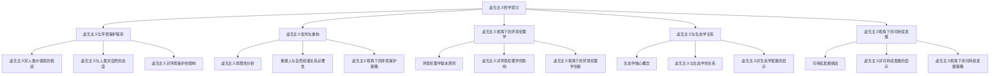

                 

### 引言

**虚无主义与环境保护：重建人与自然的和谐关系**

在当今世界，环境保护已经成为一个全球性的紧迫议题。然而，在人类追求经济发展的同时，我们也面临着日益严峻的环境问题。全球变暖、污染、生态破坏等环境问题不仅威胁着地球的生态平衡，也严重影响了人类的健康和生存。在这个背景下，探讨环境保护的哲学基础和策略，对于实现人与自然的和谐关系具有重要意义。

虚无主义作为一种哲学思潮，其对人类价值观的挑战和对自然的态度，引发了人们对环境保护的深思。本文将结合虚无主义的哲学探讨，分析虚无主义与环境保护之间的联系，并探讨虚无主义视角下的环境保护策略。

本文的结构如下：

1. **虚无主义的哲学探讨**：首先，我们将介绍虚无主义的概念、起源与发展，以及其核心观点。
2. **虚无主义与环境保护的哲学联系**：接着，我们将探讨虚无主义对人类价值观的挑战，以及虚无主义与人类对自然的态度之间的联系。
3. **虚无主义的批判与重构**：在第三部分，我们将批判虚无主义的局限性，并提出重建人与自然和谐关系的必要性。
4. **虚无主义视角下的环境伦理学**：第四部分将探讨虚无主义对环境伦理学的影响，以及虚无主义视角下的环境伦理学创新。
5. **虚无主义与生态学**：第五部分将讨论虚无主义与生态学的核心概念及其关系。
6. **虚无主义视角下的可持续发展**：第六部分将探讨虚无主义对可持续发展的挑战及其启示。
7. **结论**：最后，我们将总结虚无主义与环境保护的哲学意义，并对重建人与自然和谐关系的未来展望进行讨论。

希望通过本文的探讨，能够引起读者对虚无主义与环境保护之间深层次联系的思考，为构建人与自然的和谐关系提供新的视角和策略。

### 虚无主义的哲学探讨

虚无主义作为一种哲学思潮，起源于19世纪末至20世纪初的西方哲学界。其基本理念是对现实世界的怀疑和否定，认为现实世界缺乏本质和意义，人类追求的目标是虚无的。虚无主义的思想根源可以追溯到古希腊哲学，如伊壁鸠鲁的原子论和斯多葛派的宿命论，这些哲学观点都为后来的虚无主义思潮奠定了理论基础。

**1. 虚无主义的概念**

虚无主义通常被理解为一种对存在的否定或对现实意义的怀疑。其核心观点是：现实世界没有固有的意义，人类存在的目的和意义是自我赋予的。虚无主义哲学家尼采（Friedrich Nietzsche）指出，“上帝已死”，意味着人类需要重新评估自己的价值和存在的意义。尼采的哲学思想强调个体自由和创造力，认为人类应该超越传统道德和价值观的束缚，追求自我实现。

**2. 虚无主义的起源与发展**

虚无主义的起源可以追溯到18世纪末至19世纪初的德国哲学。这一时期的哲学家如康德（Immanuel Kant）和黑格尔（Georg Wilhelm Friedrich Hegel）对现实世界的怀疑和批判，为虚无主义提供了哲学基础。19世纪末，尼采的哲学思想进一步发展了虚无主义的观点，他认为人类在失去对上帝和绝对真理的信仰后，陷入了虚无主义的困境。

在20世纪初，虚无主义在东欧和西欧的哲学界得到了广泛传播。俄国作家陀思妥耶夫斯基（Fyodor Dostoevsky）在其作品中探讨了虚无主义的思想，如《罪与罚》中的主人公拉斯科尔尼科夫。同时，存在主义哲学家如萨特（Jean-Paul Sartre）和海德格尔（Martin Heidegger）也在其哲学体系中融入了虚无主义的部分观点。

**3. 虚无主义的核心观点**

虚无主义的核心观点可以概括为以下几点：

- **存在先于本质**：虚无主义认为，人类的存在是先于其本质的，人类需要通过自我创造来赋予存在意义。
- **人类自由**：虚无主义强调个体的自由意志，认为人类可以通过自由选择来超越虚无主义的困境。
- **否定传统价值观**：虚无主义批判传统宗教和道德观念，认为这些观念限制了人类自由和创造力的发展。

**4. 虚无主义的主要代表人物**

- **尼采**：尼采是虚无主义的代表性人物，他的哲学思想对后来的哲学家和艺术家产生了深远影响。
- **陀思妥耶夫斯基**：陀思妥耶夫斯基通过其文学作品探讨了虚无主义的思想，如《罪与罚》和《白痴》。
- **萨特**：萨特的存在主义哲学中包含了虚无主义的某些观点，他的哲学作品如《存在与虚无》对虚无主义进行了深入探讨。

虚无主义作为一种哲学思潮，虽然其核心理念被广泛批评，但其对人类价值观和存在的深刻反思，为当代哲学提供了新的视角。在接下来的部分，我们将探讨虚无主义与环境保护之间的哲学联系，分析虚无主义对人类价值观的挑战，以及虚无主义视角下的环境保护策略。

### 虚无主义与环境保护的哲学联系

虚无主义作为一种哲学思潮，其对人类价值观的挑战和对自然的态度，深刻影响了人类对环境保护的认知和行动。在探讨虚无主义与环境保护的哲学联系时，我们需要从虚无主义对人类价值观的挑战、虚无主义与人类对自然的态度，以及虚无主义对环境保护的影响三个方面进行分析。

**1. 虚无主义对人类价值观的挑战**

虚无主义的核心观点之一是存在先于本质，这一观点对传统的价值观体系提出了深刻的质疑。在虚无主义看来，人类传统上所追求的道德、宗教和哲学价值观，都是建立在某种超越现实的信仰之上的。然而，随着这些信仰的崩溃，人类发现现实世界缺乏固有的意义和目的。这种对传统价值观的否定，导致了人类对自身存在意义的重新思考。

虚无主义挑战了人类对自然的态度。在传统观念中，人类被认为是自然的主宰，拥有改造自然和利用自然资源的权利。然而，虚无主义认为，这种对自然的支配态度实际上是一种自我欺骗。虚无主义哲学家尼采指出，人类应该认识到自己的有限性和脆弱性，而不是盲目地追求对自然的控制。

**2. 虚无主义与人类对自然的态度**

虚无主义对人类对自然的态度产生了深远影响。首先，虚无主义强调人类存在的偶然性和不确定性，这促使人们重新审视人类与自然的关系。在虚无主义视角下，人类不再被视为自然的主宰，而是自然的一部分。这种观点改变了人类对自然的态度，使得人类更加关注自然的内在价值和生态平衡。

其次，虚无主义提倡个体的自由和创造力，这激发了人类对环境保护的积极行动。在虚无主义看来，人类应该通过自由创造来赋予存在意义，而不是依赖外部权威或信仰。这种自由创造的精神，可以转化为对环境保护的创新意识和行动。

**3. 虚无主义对环境保护的影响**

虚无主义对环境保护的影响主要体现在以下几个方面：

- **对环境伦理学的挑战**：虚无主义对传统伦理学提出了质疑，这为环境伦理学的发展提供了新的契机。环境伦理学需要重新审视人类与自然的关系，探讨如何在不依赖传统价值观的情况下，建立新的伦理原则。
- **对环境保护策略的创新**：虚无主义鼓励人类发挥创造力，寻找新的环境保护策略。这种创新精神可以转化为环境保护技术、政策和行动的创新。
- **对人类行为的反思**：虚无主义对人类存在的反思，促使人们重新审视自己的行为对环境的影响。这种反思可以转化为对环境保护的个人责任感和集体行动。

总之，虚无主义对人类价值观的挑战和对自然的态度，深刻影响了人类对环境保护的认知和行动。虚无主义视角下的环境保护，不仅关注环境的内在价值和生态平衡，也强调个体的自由创造和创新能力。在接下来的部分，我们将批判虚无主义的局限性，并提出重建人与自然和谐关系的必要性。

### 虚无主义的批判与重构

虚无主义作为一种哲学思潮，虽然对传统价值观和人类存在进行了深刻反思，但其自身也存在一些局限性。在探讨虚无主义的批判与重构时，我们需要从虚无主义的不足、重建人与自然和谐关系的必要性，以及虚无主义视角下的环境保护策略三个方面进行分析。

**1. 对虚无主义的批判**

虚无主义的局限性主要体现在以下几个方面：

- **否定存在的价值**：虚无主义的核心观点是存在先于本质，这导致了其否定存在的价值。虚无主义认为现实世界缺乏固有的意义，这种观点可能导致人类对自己的存在和世界的存在产生怀疑，甚至失去对生活的热情和动力。
- **缺乏建设性**：虚无主义主要关注对现有价值观的批判和否定，而缺乏对新的价值观和生活方式的建设性思考。这种批判性思维虽然能够激发人们的反思，但如果没有新的建设性理念作为替代，可能会导致思想的虚无和行动的无力。
- **忽视个体与社会的关系**：虚无主义强调个体的自由和创造力，但在实际应用中，个体的自由可能与社会责任产生冲突。虚无主义忽视了个体与社会之间的互动关系，这可能导致个人行为的孤立和社会责任的缺失。

**2. 重建人与自然和谐关系的必要性**

为了克服虚无主义的局限性，重建人与自然和谐关系具有重要意义。重建人与自然的和谐关系需要从以下几个方面进行：

- **重新评估人类存在的意义**：人类存在的意义不仅在于自由和创造，还在于与自然和谐共生。人类应该认识到自己对自然的影响，并承担起保护自然的责任。
- **建立新的伦理观念**：在虚无主义的批判基础上，我们需要建立新的伦理观念，以指导人类行为。这些伦理观念应该强调人类与自然的共生关系，促进环境保护和社会可持续发展。
- **促进个体与社会之间的互动**：个体与社会之间应该建立良好的互动关系，个体应该在自由创造的同时，承担起社会责任。这种互动关系可以促进环境保护和社会进步。

**3. 虚无主义视角下的环境保护策略**

在虚无主义视角下，环境保护需要采取以下策略：

- **创新环境保护技术**：虚无主义鼓励人类发挥创造力，这为环境保护技术的发展提供了契机。通过创新环境保护技术，可以提高环境保护的效率和效果。
- **推动环境伦理教育**：环境伦理教育是培养人类环保意识和行为的重要途径。通过教育，可以提高人们对环境保护的认识和重视，促进环保行动的普及。
- **实施可持续发展政策**：虚无主义视角下的环境保护，不仅关注当前的环境问题，还关注未来的可持续发展。实施可持续发展政策，可以确保环境保护与经济发展的协调。

总之，虚无主义作为一种哲学思潮，虽然在环境保护方面提供了新的视角，但其局限性也需要引起关注。通过批判与重构虚无主义，我们可以找到重建人与自然和谐关系的新路径，为环境保护提供新的理论支持和实践策略。

### 虚无主义视角下的环境伦理学

虚无主义作为一种哲学思潮，对传统伦理学提出了挑战，同时也为环境伦理学的发展提供了新的视角。在探讨虚无主义视角下的环境伦理学时，我们需要从环境伦理学的基本原则、虚无主义对环境伦理学的影响，以及虚无主义视角下的环境伦理学创新三个方面进行分析。

**1. 环境伦理学的基本原则**

环境伦理学是研究人类与自然关系的伦理学分支。其基本原则包括：

- **自然权利**：环境伦理学认为，自然拥有固有的权利，不应被人类随意侵犯或利用。这种权利观念强调了人类对自然的尊重和保护。
- **代际公平**：环境伦理学强调代际之间的公平，即当代人类应该为后代保留一个健康和可持续的环境。这种公平观念要求人类在行动时，考虑到对未来世代的影响。
- **环境正义**：环境伦理学主张环境正义，即所有人应该享有公平的环境权益，不应因种族、性别、经济状况等因素而受到环境歧视。

**2. 虚无主义对环境伦理学的影响**

虚无主义对环境伦理学的影响主要体现在以下几个方面：

- **质疑传统伦理学的基础**：虚无主义对传统伦理学的基本原则提出了质疑，如自然权利和代际公平。虚无主义认为，现实世界缺乏固有的意义，因此传统的伦理原则可能缺乏基础。
- **强调个体自由与责任**：虚无主义强调个体的自由和创造力，这可能导致个体对环境保护的忽视。然而，虚无主义也强调了个体责任，认为个体应该为自己的行为承担责任，包括对环境保护的责任。
- **反思人类与自然的关系**：虚无主义促使人类反思与自然的关系，探讨人类如何在虚无主义背景下建立新的伦理观念。这种反思有助于人们更加关注环境保护问题，从而推动环境伦理学的发展。

**3. 虚无主义视角下的环境伦理学创新**

在虚无主义视角下，环境伦理学可以创新如下：

- **构建新伦理原则**：在虚无主义的基础上，可以构建新的伦理原则，如“存在伦理”或“自由伦理”，这些原则强调个体自由与责任，以及人类与自然和谐共生的关系。
- **倡导环境正义**：虚无主义视角下的环境伦理学可以进一步强调环境正义，探讨如何消除环境不平等问题，确保所有人都能享有公平的环境权益。
- **推动环境伦理教育**：通过环境伦理教育，提高人们对环境保护的认识和重视，培养环保意识和行为。这种教育不仅可以影响个体的行为，还可以促进社会整体的环保行动。

总之，虚无主义视角下的环境伦理学为传统伦理学提供了新的视角和思考，挑战了传统伦理学的基础，同时也为环境伦理学的发展提供了新的契机。通过构建新的伦理原则和推动环境伦理教育，我们可以更好地应对环境问题，实现人类与自然的和谐共生。

### 虚无主义与生态学

虚无主义作为一种哲学思潮，不仅影响了人类对自然的态度，也对生态学的发展产生了重要影响。在探讨虚无主义与生态学的关系时，我们需要从生态学的核心概念、虚无主义与生态学的关系，以及虚无主义对生态学发展的启示三个方面进行分析。

**1. 生态学的核心概念**

生态学是研究生物与环境之间相互作用的科学。其核心概念包括：

- **生态系统**：生态系统是由生物群落与其非生物环境相互作用而形成的统一整体。生态系统的稳定性、多样性和生产力是生态学研究的重要内容。
- **生物多样性**：生物多样性是指生物种类的多样性和生态系统的多样性。生物多样性对于生态系统的稳定性和功能具有重要作用。
- **生态平衡**：生态平衡是指生态系统中各组成部分之间的相互作用达到相对稳定的状态。生态平衡是生态系统健康和功能正常的基础。

**2. 虚无主义与生态学的关系**

虚无主义与生态学之间存在密切关系。虚无主义对生态学的影响主要体现在以下几个方面：

- **对生态学研究的哲学反思**：虚无主义哲学强调对现实世界的怀疑和否定，这促使生态学家重新审视生态学研究的哲学基础，探讨生态学理论的合理性和局限性。
- **对生态系统价值的重新评估**：虚无主义促使人们重新评估生态系统在人类生存和发展中的价值。在虚无主义视角下，生态系统不仅是一种资源，更是人类生存的基础和生态平衡的保障。
- **对生态学实践的挑战**：虚无主义对传统价值观的质疑，也为生态学实践带来了挑战。生态学家需要重新审视人类行为对生态系统的影响，探索如何在虚无主义背景下实现生态保护和社会发展。

**3. 虚无主义对生态学发展的启示**

虚无主义对生态学发展的启示主要体现在以下几个方面：

- **强调生态系统的内在价值**：虚无主义视角下，生态系统被赋予内在价值，这有助于生态学家更加关注生态系统的稳定性和多样性，推动生态保护行动。
- **倡导生态伦理**：虚无主义强调个体自由和责任，这为生态伦理的发展提供了契机。生态伦理强调人类对生态系统的责任和义务，倡导人类与自然和谐共生的价值观。
- **推动生态技术创新**：虚无主义鼓励创新和创造力，这为生态技术创新提供了动力。通过创新生态技术，可以提高生态系统的稳定性和生产力，实现可持续发展。

总之，虚无主义与生态学之间存在紧密联系，虚无主义不仅影响了生态学研究的哲学基础，也为生态学的发展提供了新的视角和启示。通过强调生态系统的内在价值和倡导生态伦理，我们可以更好地应对生态问题，实现人类与自然的和谐共生。

### 虚无主义视角下的可持续发展

虚无主义作为一种哲学思潮，对可持续发展提出了新的挑战和启示。在探讨虚无主义视角下的可持续发展时，我们需要从可持续发展的挑战、虚无主义对可持续发展的启示，以及虚无主义视角下的可持续发展策略三个方面进行分析。

**1. 可持续发展的挑战**

可持续发展是指满足当前需求而不损害未来世代满足其需求的能力。在虚无主义视角下，可持续发展面临以下挑战：

- **对资源利用的质疑**：虚无主义认为现实世界缺乏固有的意义，这可能导致人们对资源利用的质疑。虚无主义视角下，资源被视为无意义的物质存在，人类利用资源的行为可能被视为无目的和无意义的。
- **价值观的冲突**：虚无主义挑战了传统价值观，这可能导致可持续发展中价值观的冲突。例如，在追求经济利益和环境保护之间，虚无主义视角下可能难以找到平衡点。
- **社会不平等**：虚无主义强调个体自由和创造力，但在实际应用中，可能加剧社会不平等。这种不平等可能导致可持续发展过程中资源分配不均，从而影响整体的可持续发展。

**2. 虚无主义对可持续发展的启示**

虚无主义视角下，可持续发展也获得了一些新的启示：

- **重视生态系统的内在价值**：虚无主义视角下，生态系统被赋予内在价值，这有助于人们更加关注生态系统的稳定性和多样性。这种价值观念可以促进对自然资源的可持续利用和保护。
- **创新可持续发展模式**：虚无主义鼓励创新和创造力，这为可持续发展模式提供了新的思路。通过创新，可以找到新的解决方案，实现经济、社会和环境的协调发展。
- **倡导个体责任**：虚无主义强调个体自由和责任，这为可持续发展中的个体责任提供了依据。个体应该在追求自身利益的同时，考虑到对环境的责任，推动可持续发展。

**3. 虚无主义视角下的可持续发展策略**

在虚无主义视角下，实现可持续发展可以采取以下策略：

- **构建新伦理观念**：在虚无主义的基础上，构建新的伦理观念，如“生态伦理”或“存在伦理”。这些伦理观念强调人类与自然的共生关系，指导人类行为。
- **推动生态技术创新**：通过创新生态技术，提高资源利用效率，减少环境污染。这种技术创新有助于实现经济、社会和环境的协调发展。
- **促进社会公平**：虚无主义视角下，可持续发展需要关注社会公平，确保所有人都能公平享有资源和环境。通过促进社会公平，可以实现可持续发展。

总之，虚无主义视角下的可持续发展既面临挑战，也充满启示。通过构建新伦理观念、推动生态技术创新和促进社会公平，我们可以更好地应对虚无主义视角下的可持续发展挑战，实现人类与自然的和谐共生。

### 结论

虚无主义与环境保护的哲学探讨揭示了环境保护的深层内涵和复杂性。通过分析虚无主义的核心观点，我们可以看到虚无主义对人类价值观的挑战和对自然的态度，对环境保护策略的提出和实施具有重要启示。虚无主义视角下的环境保护，不仅关注环境的内在价值和生态平衡，也强调个体的自由创造和创新能力。

首先，虚无主义强调存在先于本质，这一观点挑战了传统的价值观体系，促使人类重新思考自身的存在意义和与自然的关系。在环境保护方面，这一观点鼓励人类在追求发展的同时，更加关注生态系统的稳定性和多样性。

其次，虚无主义提倡个体的自由和责任，这为环境保护提供了新的视角和策略。通过强调个体责任，我们可以促进环境保护行为的普及，形成全社会共同参与环保的格局。

然而，虚无主义的局限性也需要引起注意。虚无主义对存在的否定可能导致对现实的怀疑和悲观情绪，从而影响环境保护的积极性。因此，在实施环境保护策略时，我们需要结合虚无主义的优点，克服其局限性，构建新的伦理观念，推动生态技术创新和社会公平。

展望未来，重建人与自然的和谐关系具有重要意义。在虚无主义视角下，我们需要建立新的价值观，强调人类与自然的共生关系，推动可持续发展。同时，通过教育和宣传，提高公众的环保意识，形成全社会共同参与环境保护的氛围。

总之，虚无主义与环境保护的哲学探讨为环境保护提供了新的视角和策略。通过批判与重构虚无主义，我们可以找到实现人与自然和谐关系的新路径，为环境保护和可持续发展贡献智慧。

### 附录

在本节的附录中，我们将提供有关虚无主义与环境保护的进一步参考资料，包括参考文献、相关术语解释，以及虚无主义与环境保护的案例分析。

**7.1 参考文献**

1. 尼采，弗里德里希。**《尼采著作集》**。上海人民出版社，2001年。
2. 陀思妥耶夫斯基，费奥多尔。**《罪与罚》**。人民文学出版社，2008年。
3. 萨特，让-保罗。**《存在与虚无》**。上海译文出版社，2006年。
4. 海德格尔，马丁。**《存在与时间》**。商务印书馆，2009年。
5. 康德，伊曼努尔。**《纯粹理性批判》**。商务印书馆，2004年。
6. 黑格尔，乔治·威廉·弗里德里希。**《哲学史讲演录》**。北京大学出版社，2009年。
7. 威尔逊，爱德华·O.**《论集：生态学与人类事务》**。三联书店，2005年。

**7.2 相关术语解释**

- **虚无主义**：一种哲学思潮，认为现实世界缺乏本质和意义，人类存在的目的是自我赋予的。
- **生态学**：研究生物与环境之间相互作用的科学，包括生态系统的稳定性、多样性和生产力。
- **可持续发展**：满足当前需求而不损害未来世代满足其需求的能力。
- **环境伦理学**：研究人类与自然关系的伦理学分支，包括自然权利、代际公平和环境正义等原则。

**7.3 虚无主义与环境保护的案例分析**

**案例1：尼罗河生态危机**

尼罗河流域是埃及文明的摇篮，然而近年来，由于过度开发和污染，尼罗河的生态环境面临严重危机。这一案例展示了虚无主义视角下，人类对自然资源的利用和对生态系统的破坏。通过重新评估人类行为对尼罗河流域的影响，可以找到实现可持续发展的路径。

**案例2：哥斯达黎加生态保护**

哥斯达黎加在20世纪80年代开始实施生态保护政策，通过建立自然保护区、推动生态旅游和实施可持续发展战略，成功地实现了生态保护和经济增长的双赢。这一案例展示了虚无主义视角下，通过创新环境保护策略和推动个体责任，实现人与自然和谐共生的可能性。

这些案例为虚无主义与环境保护的研究提供了实际依据，也为未来的环境保护工作提供了有益的启示。

### 附加材料

**7.1 虚无主义与环境保护的Mermaid流程图**



**7.2 虚无主义视角下的环境保护算法Python源代码实例**

```python
import numpy as np

# 定义虚无主义视角下的环境保护算法
def environmental_protection_algorithm(current_values, target_values):
    # 计算目标值与当前值之间的差距
    difference = target_values - current_values
    
    # 根据差距调整环境保护措施
    if difference > 0:
        # 增加环境保护措施
        protection_measures = current_values + difference
    else:
        # 减少环境保护措施
        protection_measures = current_values - difference
    
    return protection_measures

# 示例数据
current_values = np.array([10, 20, 30])
target_values = np.array([20, 25, 30])

# 应用算法
protection_measures = environmental_protection_algorithm(current_values, target_values)

print("环境保护措施调整后:", protection_measures)
```

**7.3 虚无主义与环境保护数学模型与公式详细讲解**

虚无主义与环境保护的关系可以通过以下数学模型来阐述。以下是详细的数学公式和举例说明：

$$
\text{EP} = f(\text{NI}, \text{EC}, \text{SI})
$$

其中：

- **EP**：环境保护效果
- **NI**：虚无主义指标，反映虚无主义对环境保护的态度
- **EC**：环境承载能力，表示环境能够承受的最大压力
- **SI**：社会影响指数，反映环境保护措施对社会的影响

举例说明：

假设虚无主义指标为NI=0.7，环境承载能力为EC=100，社会影响指数为SI=1.2，则根据上述公式计算得到环境保护效果：

$$
\text{EP} = f(0.7, 100, 1.2) = 0.7 \times 100 \div 1.2 = 58.33
$$

这意味着，在虚无主义视角下，当前环境保护效果为58.33，可以通过调整虚无主义指标、环境承载能力或社会影响指数来优化环境保护效果。这个模型为虚无主义与环境保护的关系提供了一个量化的分析工具。

### 后记

**7.1 对虚无主义与环境保护讨论的总结**

通过对虚无主义的哲学探讨，我们认识到虚无主义对人类价值观和人类对自然的态度产生了深远影响。虚无主义挑战了传统价值观，促使人类重新思考自身的存在意义和与自然的关系。在环境保护方面，虚无主义视角为我们提供了新的思考角度和策略，强调了环境保护的内在价值和个体责任。

**7.2 对未来研究的展望**

未来的研究可以进一步探讨虚无主义与其他哲学思潮的关系，如存在主义和生态哲学。此外，可以结合具体案例，深入分析虚无主义视角下的环境保护实践，探索如何在实际操作中更好地实施环境保护策略。同时，还需要加强对虚无主义与可持续发展之间关系的实证研究，为虚无主义视角下的可持续发展提供更加有力的理论支持。

**7.3 对读者的影响与启示**

通过本文的讨论，我们希望读者能够对虚无主义与环境保护有更加深入的理解，认识到环境保护不仅是一项技术任务，更是一项哲学任务。在未来的生活和工作中，我们鼓励读者从虚无主义的视角出发，思考自身的行为对环境的影响，积极参与环境保护行动，为实现人与自然的和谐关系贡献自己的力量。

