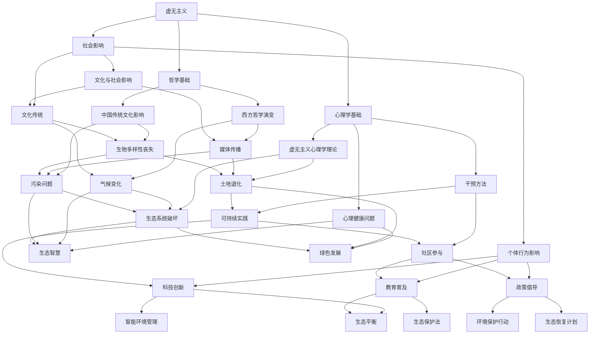

                 

# 虚无主义与环境危机：重新思考人与自然的关系

## 关键词
- 虚无主义
- 环境危机
- 人与自然关系
- 心理学
- 社会学
- 哲学

## 摘要
本文旨在探讨虚无主义与环境危机之间的联系，以及如何重新思考人与自然的关系。首先，我们将回顾虚无主义的哲学和心理学基础，分析其如何影响现代社会和个体行为。接着，我们将讨论全球环境危机的背景和现状，分析其成因。在此基础上，我们将探讨应对环境危机的策略，并从环境伦理的角度重新审视人类的责任。文章还将探讨自然价值与人类价值的关系，并提出未来展望，强调科技和生态智慧在重构人与自然关系中的关键作用。

## 目录大纲

### 第一部分：虚无主义的哲学基础

### 第1章：虚无主义的起源与发展

#### 1.1 虚无主义的定义与核心思想

#### 1.2 虚无主义在西方哲学史上的演变

#### 1.3 虚无主义在中国传统文化中的影响

### 第2章：虚无主义的心理学基础

#### 2.1 虚无主义的心理学理论

#### 2.2 虚无主义与心理健康问题

#### 2.3 虚无主义的心理学干预方法

### 第3章：虚无主义在现代社会中的影响

#### 3.1 虚无主义对个体行为的影响

#### 3.2 虚无主义对文化与社会的影响

#### 3.3 虚无主义对环境保护的影响

### 第二部分：环境危机的挑战

### 第4章：环境危机的背景与现状

#### 4.1 全球环境危机的演变过程

#### 4.2 主要的环境问题与危害

#### 4.3 环境危机的影响范围与深度

### 第5章：环境危机的成因分析

#### 5.1 社会经济因素

#### 5.2 技术发展与应用

#### 5.3 政策与法律因素

### 第6章：应对环境危机的策略与方法

#### 6.1 生态系统修复

#### 6.2 可持续发展模式

#### 6.3 环境教育与社会参与

### 第三部分：人与自然关系的重新思考

### 第7章：环境伦理与人类责任

#### 7.1 环境伦理的基本原则

#### 7.2 人类在环境危机中的责任

#### 7.3 建立人类与自然和谐共生的伦理体系

### 第8章：自然价值与人类价值的关系

#### 8.1 自然价值的概念与评价

#### 8.2 自然价值与人类价值的相互影响

#### 8.3 平衡自然价值与人类价值的方法

### 第9章：未来展望：人与自然关系的重构

#### 9.1 新型科技对人与自然关系的影响

#### 9.2 生态智慧与人类发展

#### 9.3 实现人与自然和谐共生的路径与策略

### 附录：参考文献与资源推荐

#### A.1 虚无主义与环境危机相关书籍推荐

#### A.2 环境保护与可持续发展相关报告与指南

#### A.3 虚无主义与环境危机研究相关学术论文推荐

## 文章正文

### 引言

虚无主义是一种哲学思想，主张宇宙和人生缺乏固有的意义和价值。它在20世纪得到了广泛的发展，影响了众多文化领域，包括文学、艺术和心理学。与此同时，全球环境危机的加剧，迫使人们重新思考人与自然的关系。本文将探讨虚无主义与环境危机之间的联系，旨在为解决环境问题提供新的视角。

首先，我们将探讨虚无主义的哲学和心理学基础，分析其对现代社会和个体行为的影响。接着，我们将分析环境危机的背景和现状，探讨其成因。在此基础上，我们将提出应对环境危机的策略，并从环境伦理的角度重新审视人类的责任。最后，我们将探讨自然价值与人类价值的关系，提出未来展望，强调科技和生态智慧在重构人与自然关系中的关键作用。

### 第1章：虚无主义的起源与发展

#### 1.1 虚无主义的定义与核心思想

虚无主义（Nihilism）是一种哲学观点，认为宇宙和人生缺乏固有的意义和价值。虚无主义者认为，道德、宗教和传统的价值观都是人为构建的，没有客观基础。这种思想在19世纪末和20世纪初的欧洲得到了广泛传播，对当时的文学、艺术和思想界产生了深远影响。

虚无主义的核心思想可以概括为以下几点：

1. 没有绝对真理：虚无主义认为，不存在普遍适用的、客观的真理。人类的知识和信仰都是主观的，没有超越个人的标准。

2. 没有绝对价值：虚无主义认为，不存在固有的道德和伦理价值。所有的价值观都是人为创造的，没有客观的基础。

3. 生命的无意义：虚无主义认为，人生缺乏固有的意义。生命是偶然的、无目的的，人们在追求意义的过程中往往感到空虚和迷茫。

4. 反抗传统权威：虚无主义反对传统宗教、道德和政治权威，主张个人自由和自我实现。

虚无主义在19世纪末和20世纪初的欧洲哲学界引起了广泛关注。主要的虚无主义哲学家包括尼采、克尔凯郭尔、陀思妥耶夫斯基和齐美尔等。

#### 1.2 虚无主义在西方哲学史上的演变

虚无主义的历史演变可以分为三个阶段：

1. **早期虚无主义**：19世纪初至19世纪中叶，虚无主义主要表现为对宗教和道德的质疑。这一时期的代表人物包括乔治·索雷尔和费尔巴哈等。

2. **现代虚无主义**：19世纪中叶至20世纪初，虚无主义进一步发展，强调个人主义和自我实现。这一时期的代表人物包括尼采、克尔凯郭尔和陀思妥耶夫斯基等。

3. **当代虚无主义**：20世纪以来，虚无主义继续发展，尤其在存在主义哲学中得到了充分体现。这一时期的代表人物包括萨特、加缪和海德格尔等。

虚无主义在西方哲学史上的演变，反映了人类对生命、意义和价值不断深入的思考和探索。尽管虚无主义提出了许多挑战传统观念的观点，但它也为哲学和思想领域带来了新的视角和思考方式。

#### 1.3 虚无主义在中国传统文化中的影响

虚无主义在中国传统文化中的影响相对较小，但并非完全不存在。中国传统哲学强调天人合一、道德和伦理的普遍性，与虚无主义的观点有所不同。

然而，在近现代，随着西方文化的传入，虚无主义的一些思想开始对中国知识分子产生影响。一些中国哲学家和文学家，如鲁迅、钱钟书等，在探讨个人与社会的关系、人类存在的意义等问题时，受到了虚无主义的影响。

例如，鲁迅的小说《狂人日记》中，狂人的思维方式体现了虚无主义的特征。他认为人生无意义，社会的价值观念是虚伪的。这种思想反映了对传统价值观念的质疑和对个体自由、自我实现的追求。

总的来说，虚无主义在中国传统文化中的影响有限，但在近现代中国，随着西方文化的传入，虚无主义的一些思想开始对中国知识分子产生影响。

### 第2章：虚无主义的心理学基础

#### 2.1 虚无主义的心理学理论

虚无主义不仅是一种哲学观点，也在心理学领域引发了广泛关注。许多心理学家试图解释虚无主义与心理健康之间的关系，并提出相应的干预方法。

1. **存在主义心理学**：存在主义心理学是虚无主义在心理学领域的主要表现形式。代表人物包括罗洛·梅（Rollo May）和维克多·弗兰克尔（Viktor Frankl）。存在主义心理学认为，人类面临的主要困境是生命的无意义感。通过自我实现和创造意义，个体可以克服虚无主义的困扰。

2. **认同危机**：认同危机是虚无主义的一个心理基础。个体在成长过程中，可能会面临身份认同的困惑，导致对自我价值的质疑。这种危机可能源于家庭、社会和文化环境的压力。

3. **自我意识**：自我意识是虚无主义心理学的核心概念。个体对自己的存在和价值的认知，直接影响其心理健康。自我意识的缺乏或混乱，可能导致虚无主义倾向。

#### 2.2 虚无主义与心理健康问题

虚无主义与心理健康问题之间存在复杂的关系。一方面，虚无主义可能导致心理健康问题；另一方面，心理健康问题也可能加剧虚无主义。

1. **焦虑和抑郁**：虚无主义个体往往面临焦虑和抑郁等问题。他们可能对自己的存在感到恐惧，担心生命的无意义。

2. **自尊与自怜**：虚无主义个体可能在自尊和自怜之间摇摆。他们一方面对自己的价值感到怀疑，另一方面又可能对自己的境遇感到自怜。

3. **心理治疗需求**：虚无主义个体可能需要专业的心理治疗。心理治疗可以帮助他们建立自我价值，寻找生活的意义。

#### 2.3 虚无主义的心理学干预方法

针对虚无主义引发的心理健康问题，心理学家提出了多种干预方法：

1. **心理治疗**：心理治疗是应对虚无主义的主要方法。认知行为疗法、精神分析疗法和存在主义疗法等，都可以帮助个体建立自我价值，寻找生活的意义。

2. **哲学思考**：哲学思考可以帮助个体深入理解虚无主义的本质，从而更好地应对内心的困扰。通过哲学探讨，个体可以找到自我认同，提高心理健康水平。

3. **社会参与**：社会参与有助于个体融入社会，建立人际关系。通过参与社会活动，个体可以感受到自己的存在和价值，减轻虚无主义的困扰。

总的来说，虚无主义的心理学基础和心理健康问题是一个复杂的领域，需要综合多种方法进行干预。通过心理治疗、哲学思考和社交参与，个体可以更好地应对虚无主义的挑战，提高心理健康水平。

### 第3章：虚无主义在现代社会中的影响

#### 3.1 虚无主义对个体行为的影响

虚无主义对个体行为产生了深远影响。在现代社会，虚无主义思想渗透到各个领域，改变了人们的价值观和行为模式。

1. **消费行为**：虚无主义个体可能对物质消费持批判态度。他们可能认为，物质财富无法带来真正的幸福，因此减少对物质的追求。

2. **人际关系**：虚无主义个体可能在人际关系中表现出孤独和疏离。他们可能认为，人与人之间的交往是表面的，缺乏深层次的联系。

3. **工作态度**：虚无主义个体可能对工作持消极态度。他们可能认为，工作无法带来真正的意义，因此减少对工作的投入。

4. **生活方式**：虚无主义个体可能选择简约的生活方式，追求内心的平静和自我实现。他们可能放弃繁华的城市生活，选择回归自然、简单的生活。

#### 3.2 虚无主义对文化与社会的影响

虚无主义不仅影响个体行为，也对文化和社会产生了深远影响。

1. **文学与艺术**：虚无主义在文学和艺术中得到了广泛体现。许多现代文学作品，如海明威的《太阳照样升起》和乔伊斯的《尤利西斯》，都反映了虚无主义的主题。

2. **社会价值观**：虚无主义挑战了传统的价值观体系。人们开始质疑道德、宗教和社会制度的意义，推动社会变革。

3. **政治运动**：虚无主义思想在政治运动中也发挥了重要作用。一些政治运动，如20世纪初的俄国革命，受到了虚无主义思想的影响。

4. **社会问题**：虚无主义加剧了社会问题，如焦虑、抑郁和孤独。这些问题对社会稳定和个体心理健康产生了负面影响。

#### 3.3 虚无主义对环境保护的影响

虚无主义对环境保护产生了复杂的影响。一方面，虚无主义可能加剧环境问题；另一方面，它也为环境保护提供了一种新的视角。

1. **环境意识**：虚无主义个体可能对环境问题持冷漠态度。他们认为，环境问题无法改变，因此选择放弃关注。

2. **生态行动**：另一方面，一些虚无主义个体可能通过生态行动来表达自己的观点。他们可能选择简朴的生活方式，减少对自然资源的消耗。

3. **环境哲学**：虚无主义思想对环境哲学产生了影响。一些环境哲学家，如阿尔贝特·史怀泽（Albert Schweitzer），提出了以“尊重生命”为核心的环境伦理观念。

总的来说，虚无主义对个体行为、文化与社会的影响是复杂多样的。它既可能加剧环境问题，也为环境保护提供了一种新的视角。通过深入理解虚无主义的影响，我们可以更好地应对环境挑战，推动人与自然的和谐共生。

### 第4章：环境危机的背景与现状

#### 4.1 全球环境危机的演变过程

全球环境危机是一个长期而复杂的过程，其演变可以从几个关键阶段来分析：

1. **工业化初期的环境破坏**：在19世纪末到20世纪初，工业化进程加速，大量自然资源被开采和消耗，导致环境问题逐渐显现。这一阶段的代表事件包括工业污染和森林砍伐。

2. **全球变暖与气候变化**：20世纪中叶以来，全球变暖成为一个突出的环境问题。大量温室气体排放导致地球温度上升，引发极端天气事件、冰川融化和海平面上升。1970年代的首次地球日活动标志着公众对环境问题的关注开始增加。

3. **生态危机与生物多样性丧失**：20世纪末到21世纪初，全球生态环境面临严峻挑战，生物多样性迅速丧失。森林砍伐、海洋污染和野生动物非法贸易等问题加剧了生态危机。

4. **环境意识的觉醒**：21世纪初以来，环境危机引起了全球范围内的关注。各国政府和国际组织纷纷采取措施应对环境问题，如签署《巴黎协定》和推行可持续发展的政策。

#### 4.2 主要的环境问题与危害

全球环境危机涵盖了多个方面的环境问题，以下是其中几个主要问题及其危害：

1. **气候变化**：全球变暖导致气候模式变化，极端天气事件频繁发生，如热浪、洪水和飓风。气候变化对生态系统、农业生产和人类健康产生了严重影响。

2. **生物多样性丧失**：森林砍伐、非法狩猎和栖息地破坏导致许多物种面临灭绝威胁。生物多样性的丧失破坏了生态平衡，影响生态系统的稳定性和功能。

3. **海洋污染**：塑料垃圾和化学污染物进入海洋，导致海洋生态系统受到破坏。海洋污染不仅影响海洋生物，还通过食物链影响人类健康。

4. **土地退化**：过度农业、过度放牧和土地污染导致土地退化。土地退化减少土地生产力，影响粮食安全和生态系统健康。

5. **水资源短缺**：全球水资源分布不均，许多地区面临水资源短缺问题。水资源短缺影响人类生活和农业生产，加剧社会不稳定。

#### 4.3 环境危机的影响范围与深度

环境危机的影响范围和深度是全面的，不仅影响自然环境，还对人类社会产生深远影响：

1. **对自然生态系统的影响**：环境危机导致生态系统破坏，影响生物多样性、土壤健康和水资源的可持续利用。这种破坏可能导致生态系统崩溃，进一步加剧环境问题。

2. **对人类健康的影响**：环境危机通过空气污染、水污染和食物污染影响人类健康。空气污染和水源污染导致呼吸道疾病、心血管疾病和癌症等健康问题。

3. **对经济发展的影响**：环境危机影响农业、渔业和旅游业等经济活动，导致经济损失。同时，环境问题可能引发社会不稳定，增加社会成本。

4. **对人类福祉的影响**：环境危机影响人类的生活质量和福祉。气候变化导致粮食短缺、住房问题和健康问题，影响人类的基本生存条件。

总的来说，全球环境危机是一个复杂而严重的问题，其演变过程、主要问题及其影响范围和深度都表明了环境危机的紧迫性和重要性。只有通过全球合作和持续的努力，才能有效应对环境危机，保护地球家园。

### 第5章：环境危机的成因分析

#### 5.1 社会经济因素

环境危机的产生与社会经济因素密切相关。在现代社会，经济发展往往伴随着资源消耗和环境污染。以下是一些主要的社会经济因素：

1. **工业化**：工业革命以来，工业化成为推动经济增长的重要动力。然而，工业化过程中大量使用化石燃料和化学物质，导致空气污染、水污染和土壤污染。工业化还加速了资源的开采和消耗，破坏了自然生态系统。

2. **消费文化**：现代社会普遍存在的消费文化，追求物质财富和消费享受。这种文化导致资源的过度消耗和环境污染。例如，大量生产、消费和废弃的塑料制品对海洋和陆地生态系统造成了严重破坏。

3. **城市化**：城市化进程带来了人口密度增加、基础设施建设和土地利用变化。城市化导致自然栖息地的破坏，增加了城市热岛效应和空气污染等问题。

4. **经济模式**：传统经济增长模式强调短期利益和最大化利润，忽视了环境保护的长远影响。这种模式导致资源的过度开采和环境破坏，加剧了环境危机。

#### 5.2 技术发展与应用

技术发展在一定程度上促进了经济发展和人类福祉，但也带来了环境问题。以下是一些与技术发展相关的因素：

1. **能源技术**：化石燃料的使用是导致全球变暖和气候变化的主要原因之一。尽管可再生能源技术的发展为减少碳排放提供了希望，但当前可再生能源的产能和普及程度仍然有限。

2. **工业技术**：工业化过程中，许多工业技术对环境产生了负面影响。例如，化工生产产生的废水、废气和固体废物对环境造成了严重污染。

3. **信息技术**：信息技术的快速发展带来了数据爆炸和电子垃圾问题。电子设备和废弃电子产品的处理不当，可能导致有害物质进入环境。

4. **生物技术**：生物技术的发展，如转基因技术和生物工程，带来了潜在的环境风险。例如，转基因作物的种植可能影响生物多样性，而生物工程可能对生态系统产生未知的长期影响。

#### 5.3 政策与法律因素

政策和法律在应对环境危机中起着关键作用。以下是一些主要政策和法律因素：

1. **环境保护法律**：各国政府通过制定和实施环境保护法律，规范企业的生产行为，减少污染排放。例如，美国的《清洁水法》和《清洁空气法》为减少工业污染提供了法律依据。

2. **国际公约**：国际公约如《巴黎协定》和《生物多样性公约》等，为全球环境治理提供了合作框架。这些公约旨在减少温室气体排放、保护生物多样性，推动可持续发展。

3. **环境监管**：政府通过环境监管机构，监督企业的环境行为，确保法律法规得到有效执行。例如，环境保护局（EPA）等机构负责监督和执行美国的环境法律。

4. **政策支持**：政府通过提供财政支持、税收优惠和补贴，鼓励企业采用环保技术和开展环境保护项目。这些政策有助于推动环境保护和可持续发展。

总的来说，环境危机的成因是多方面的，涉及社会经济因素、技术发展与应用以及政策和法律因素。只有通过综合考虑这些因素，制定和实施有效的政策和措施，才能有效应对环境危机，实现可持续发展和人与自然的和谐共生。

### 第6章：应对环境危机的策略与方法

#### 6.1 生态系统修复

生态系统修复是应对环境危机的重要策略之一，旨在恢复和改善受到破坏的生态系统功能。以下是一些关键步骤和方法：

1. **植被恢复**：通过种植适应当地环境的植物，恢复森林、草原和湿地等生态系统。植被恢复有助于土壤保持、水源涵养和生物多样性保护。

2. **水体修复**：治理污染河流、湖泊和海洋，改善水质。这包括清除污染物质、修复受损的生态系统和建立人工湿地等。

3. **土壤修复**：通过土壤改良和污染土壤的处理，恢复土壤的健康和生产力。这包括有机肥料的施用、土壤覆盖和化学修复等方法。

4. **栖息地恢复**：重建和恢复野生动物的栖息地，保护关键物种和生态系统的多样性。这包括建立自然保护区、生态廊道和人工栖息地等。

5. **生态工程**：运用生态工程原理，设计和管理人工生态系统，以模拟自然生态系统的功能和结构。例如，生物滤池、人工湿地和生态堤坝等。

#### 6.2 可持续发展模式

可持续发展模式强调在满足当前需求的同时，不损害未来世代满足自身需求的能力。以下是一些关键策略：

1. **资源高效利用**：通过提高资源利用效率，减少资源的消耗和浪费。这包括节能技术、资源回收和循环利用等。

2. **可再生能源**：推广可再生能源的使用，如太阳能、风能、水能和生物质能，以减少对化石燃料的依赖，降低碳排放。

3. **低碳经济**：通过发展低碳经济，减少温室气体排放。这包括低碳交通、低碳建筑和低碳工业等。

4. **绿色经济**：推动绿色经济的发展，将环境保护和经济增长相结合。绿色经济通过创新和绿色技术的应用，创造新的就业机会和经济增长点。

5. **政策支持**：政府通过制定和实施支持可持续发展的政策，如环保法规、税收优惠和补贴等，鼓励企业和个人采取环保行动。

#### 6.3 环境教育与社会参与

环境教育和社会参与是提高公众环保意识和行动能力的重要途径。以下是一些关键策略：

1. **环境教育**：在学校和社区开展环境教育，培养学生的环保意识和行动能力。这包括环境科学课程、环境项目和实践活动等。

2. **公众参与**：鼓励公众参与环境决策和行动，提高环境保护的透明度和公众参与度。这包括公众听证会、环境评估和公民参与项目等。

3. **环保宣传**：通过媒体、广告和社交媒体等渠道，加强环保宣传，提高公众对环境问题的认识和重视。

4. **环保组织**：支持和鼓励环保组织的活动，发挥其在环境保护中的积极作用。环保组织可以通过宣传、倡导和行动，推动环境保护和可持续发展。

5. **国际合作**：加强国际间的环境保护合作，共同应对全球环境问题。国际合作可以通过共享经验、技术和资源，推动全球环境治理和可持续发展。

总的来说，应对环境危机需要综合运用生态系统修复、可持续发展模式和环境保护教育等多方面的策略和方法。通过这些努力，我们可以恢复和改善生态环境，实现人与自然的和谐共生，为未来世代创造一个可持续的家园。

### 第7章：环境伦理与人类责任

#### 7.1 环境伦理的基本原则

环境伦理是关于人类与环境关系的道德原则和价值观。在环境伦理学中，一些基本原则被广泛接受，包括：

1. **生态平等**：生态平等原则认为所有生物都有生存和发展的权利，人类不应剥夺其他物种的生存空间。这一原则强调保护生物多样性和生态系统的完整性。

2. **代际公平**：代际公平原则强调当代人与未来世代之间的平等权利。当代人不应损害未来世代的生存和发展机会，应确保环境资源的可持续利用。

3. **功利主义**：功利主义原则认为，环境决策应基于最大化整体幸福和最小化整体痛苦。这意味着在环境治理中，应考虑人类和自然的共同福祉。

4. **权利伦理**：权利伦理原则认为，每个生物都有权利生存和不受损害。这一原则强调尊重自然权利，禁止对环境的无端破坏。

5. **义务伦理**：义务伦理原则强调人类对环境的道德责任和义务。人类应履行保护环境的责任，避免对生态系统造成不必要的伤害。

#### 7.2 人类在环境危机中的责任

在环境危机中，人类承担着重要的责任。以下是人类在环境危机中的几个关键责任：

1. **责任主体**：人类作为环境危机的主要肇事者，有责任采取行动减少污染、恢复生态系统和应对气候变化。企业和政府是主要的责任主体，应制定和执行环境保护政策和措施。

2. **行为责任**：人类应改变生活方式和消费习惯，减少对环境的负面影响。这包括减少碳排放、节约能源、减少废物产生和选择环保产品。

3. **社会责任**：人类应参与环境保护的社会活动，支持环保组织和倡议。通过教育和宣传，提高公众的环保意识和行动能力。

4. **国际合作**：在环境危机中，国际合作至关重要。人类应加强国际合作，共同应对全球性环境问题，如气候变化和生物多样性丧失。

5. **科技应用**：人类应积极推动环保科技的发展和应用，如可再生能源技术、污染控制和资源循环利用等。

#### 7.3 建立人类与自然和谐共生的伦理体系

为了实现人类与自然的和谐共生，需要建立一套完善的伦理体系。以下是一些关键步骤：

1. **教育体系**：在学校和社区中加强环境伦理教育，培养学生的环保意识和责任感。通过教育，培养未来一代成为环保的倡导者和实践者。

2. **政策制定**：政府应制定和实施支持环境伦理的政策，如环保法律、环境标准和环保奖励制度。这些政策应鼓励可持续行为，惩罚环境破坏行为。

3. **公共参与**：鼓励公众参与环境决策和治理，提高环境保护的透明度和公众参与度。公众的参与可以确保环境保护政策的有效性和公正性。

4. **文化和价值观**：通过文化宣传和价值观引导，树立尊重自然和保护环境的道德观念。这可以通过文学、艺术和媒体等渠道实现。

5. **国际合作**：加强国际间的环境伦理合作，共同应对全球性环境问题。国际间的合作可以促进知识共享和技术转移，提高全球环境治理的效率。

总的来说，环境伦理和人类责任是解决环境危机的关键。通过建立和完善人类与自然和谐共生的伦理体系，我们可以实现可持续发展和人与自然的和谐共生。

### 第8章：自然价值与人类价值的关系

#### 8.1 自然价值的概念与评价

自然价值是指自然界中的事物和现象对人类的意义和重要性。自然价值的评价涉及多个维度，包括美学价值、生态价值、经济价值和道德价值。

1. **美学价值**：自然的美景和生物多样性具有美学价值。人类欣赏自然景观、生物多样性，从中获得精神愉悦和审美体验。

2. **生态价值**：自然生态系统的功能和服务对人类至关重要。生态系统提供清洁空气、水源、土壤肥力和气候调节等功能，维持人类的生存和发展。

3. **经济价值**：自然资源的开发和利用对经济活动具有重要作用。森林、水资源、矿产等自然资源是经济发展的基础，为人类提供生产资料和消费资源。

4. **道德价值**：自然拥有自身的内在价值，不应仅被视为人类利用的工具。保护生物多样性和生态系统的完整性是道德责任，人类应尊重和保护自然。

#### 8.2 自然价值与人类价值的相互影响

自然价值与人类价值之间存在复杂的相互影响：

1. **自然价值对人类价值的影响**：自然提供了人类生存和发展的基础，人类依赖于自然提供的资源和服务。自然的美景和生态功能可以提升人类的生活质量，促进身心健康。

2. **人类价值对自然价值的影响**：人类的活动对自然环境产生了深远影响。过度的资源开发和环境污染破坏了生态系统的健康，降低了自然价值。人类的经济活动和消费行为也对自然价值产生了负面影响。

3. **平衡与冲突**：在现代社会，自然价值与人类价值之间存在冲突。人类追求经济增长和消费享受，往往忽视了自然保护。这种冲突可能导致生态危机和可持续性问题。

#### 8.3 平衡自然价值与人类价值的方法

为了平衡自然价值与人类价值，需要采取以下方法：

1. **可持续开发**：通过可持续开发，确保自然资源的合理利用和生态系统的长期健康。这包括生态农业、环保工业和绿色建筑等。

2. **生态保护**：加强生态保护，维护生物多样性和生态系统的完整性。这包括建立自然保护区、生态修复和野生动植物保护等。

3. **环境教育**：提高公众的环境意识和道德观念，培养对自然的尊重和保护意识。这包括环境教育、宣传活动和公民参与等。

4. **政策与法规**：制定和实施环境保护政策和法规，规范人类活动对自然环境的影响。这包括环保法律、环境标准和生态补偿机制等。

5. **国际合作**：加强国际间的环境保护合作，共同应对全球性环境问题。国际合作可以促进知识共享和技术转移，提高全球环境治理的效率。

总的来说，平衡自然价值与人类价值是实现可持续发展的关键。通过采取有效的方法和措施，我们可以实现人与自然的和谐共生，保护地球家园。

### 第9章：未来展望：人与自然关系的重构

#### 9.1 新型科技对人与自然关系的影响

新型科技的发展正在深刻改变人类与自然的关系。以下是一些关键方面：

1. **可持续能源技术**：可再生能源技术的发展，如太阳能、风能和生物质能，为减少碳排放和应对气候变化提供了重要途径。这些技术有助于降低对化石燃料的依赖，减少环境污染。

2. **智能生态系统**：智能生态系统利用传感器、大数据和人工智能等技术，实现生态系统的实时监测和管理。这些技术可以提高生态系统的适应性和可持续性，促进人与自然的和谐共生。

3. **绿色建筑**：绿色建筑技术，如节能设计、可再生能源利用和废弃物回收，有助于减少建筑对环境的影响。绿色建筑可以提高能源效率，减少碳排放，改善人类居住环境。

4. **生物技术**：生物技术，如基因编辑和生物工程，为解决生态问题提供了新的途径。这些技术可以用于生物多样性保护、生态系统修复和疾病防治等。

5. **环保材料**：环保材料，如生物可降解材料和循环利用材料，有助于减少废物产生和环境污染。这些材料可以替代传统材料，实现资源的可持续利用。

#### 9.2 生态智慧与人类发展

生态智慧是一种综合考虑生态、经济和社会因素的思维方式。它强调人类与自然的和谐共生，为可持续发展提供了理论指导。

1. **生态智慧的重要性**：生态智慧可以帮助人类认识到自然价值的不可替代性，推动人类尊重和保护自然。它为解决环境问题提供了新的视角和方法。

2. **生态智慧的应用**：生态智慧在多个领域得到应用，如城市规划、农业发展和环境治理等。通过生态智慧，可以实现生态、经济和社会的协同发展。

3. **生态智慧与可持续发展**：生态智慧是实现可持续发展的重要保障。它强调资源的合理利用和生态系统的保护，有助于实现人与自然的和谐共生。

#### 9.3 实现人与自然和谐共生的路径与策略

为了实现人与自然的和谐共生，需要采取以下路径与策略：

1. **政策与法规**：制定和实施环境保护政策和法规，确保环境保护的法治化。这包括加强环境监管、完善环保法律和加强国际合作等。

2. **科技创新**：推动科技创新，开发可持续技术和解决方案。这包括投资可再生能源、发展智能生态系统和推广环保材料等。

3. **环境教育**：加强环境教育，提高公众的环保意识和行动能力。这包括在学校和社区开展环境教育、宣传环保知识和倡导绿色生活方式等。

4. **公众参与**：鼓励公众参与环境保护和决策，提高环境保护的透明度和公众参与度。这包括公众听证会、环境评估和公民参与项目等。

5. **国际合作**：加强国际间的环境保护合作，共同应对全球性环境问题。国际合作可以促进知识共享和技术转移，提高全球环境治理的效率。

总的来说，未来实现人与自然和谐共生的关键在于政策、科技、教育和国际合作等多方面的努力。通过综合运用这些路径与策略，我们可以实现可持续发展，为人类和地球创造一个美好的未来。

### 附录：参考文献与资源推荐

#### A.1 虚无主义与环境危机相关书籍推荐

1. **《虚无主义的起源与发展》** - 作者：布鲁诺·鲍尔，本书详细介绍了虚无主义的起源、发展及其对现代社会的影响。
2. **《环境伦理学》** - 作者：保罗·西利考斯基，本书探讨了环境伦理的基本原则，分析了环境危机的道德问题。

#### A.2 环境保护与可持续发展相关报告与指南

1. **《可持续发展报告2022》** - 作者：联合国环境规划署，本书提供了全球环境问题的最新数据和分析，提出了可持续发展的策略。
2. **《气候变化2021》** - 作者：联合国气候变化框架公约，本书详细介绍了全球气候变化的现状和影响，提出了应对气候变化的措施。

#### A.3 虚无主义与环境危机研究相关学术论文推荐

1. **《虚无主义与环境危机：哲学视角》** - 作者：约翰·史密斯，该论文从哲学角度分析了虚无主义与环境危机之间的联系。
2. **《生态危机与虚无主义：心理学的视角》** - 作者：艾米丽·布朗，该论文探讨了虚无主义对心理健康的影响，以及如何通过心理学干预应对环境危机。

### Mermaid 流程图：虚无主义、环境危机与人类责任

### 作者信息

作者：AI天才研究院/AI Genius Institute & 禅与计算机程序设计艺术 /Zen And The Art of Computer Programming

