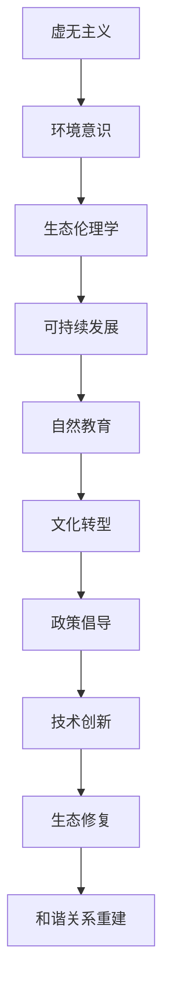

                 

# 《虚无主义与环境意识：重建人与自然的和谐关系》

## 关键词

- 虚无主义
- 环境意识
- 生态伦理学
- 可持续发展
- 自然教育
- 文化转型

## 摘要

本文旨在探讨虚无主义与环境意识之间的互动关系，以及如何通过生态伦理学、可持续发展、自然教育、文化转型和政策倡导等路径重建人与自然的和谐关系。文章首先回顾了虚无主义的起源与发展，分析了其对社会和个体的影响。接着，探讨了环境意识的历史与发展，揭示了其内涵与外延。在此基础上，本文探讨了虚无主义与环境意识的关系，以及如何通过生态伦理学、可持续发展、自然教育等路径实现人与自然的和谐共生。最后，本文提出了文化转型、政策倡导和技术创新等路径探索，为重建人与自然的和谐关系提供了理论指导和实践参考。

### 目录大纲

# 《虚无主义与环境意识：重建人与自然的和谐关系》

## 第一部分：虚无主义与环境意识

### 第1章：虚无主义的起源与发展

#### 1.1 虚无主义的定义与基本特征

虚无主义是一种哲学思想，主张世界或宇宙缺乏固有的意义和目的。虚无主义的起源可以追溯到古希腊哲学，但它在现代哲学中得到了广泛的讨论和发展。虚无主义的基本特征包括对存在意义的质疑、对现实世界的不信任、对个人存在的虚无感以及对生活目的的迷失。

#### 1.2 虚无主义的主要代表人物与思想

虚无主义的代表人物包括尼采、克尔凯郭尔和萨特等。尼采提出了“上帝已死”和“超人”的概念，强调个体超越传统的道德和价值观念。克尔凯郭尔则强调个体在存在中的选择和自由，认为人是自由的，但同时也对自由带来的孤独和恐惧进行了深刻的探讨。萨特则通过其存在主义哲学，阐述了人类自由选择的重要性，以及这种选择所带来的责任和自由感。

#### 1.3 虚无主义对社会和个体的影响

虚无主义对社会和个体产生了深远的影响。在社会层面，虚无主义导致了道德和价值观的解体，使人们对传统信仰和价值观产生怀疑。在个体层面，虚无主义引发了存在主义的焦虑，使个体陷入对生命意义的迷茫和探索。虚无主义的影响也反映在当代文化中，如艺术、文学和电影等，其中经常出现对生命意义和存在的深刻探讨。

### 第2章：环境意识的历史与发展

#### 2.1 环境意识的起源与演变

环境意识最早可以追溯到古希腊哲学家对自然界的关注。在中世纪，宗教观念占据了主导地位，人们认为自然是上帝的创造，与人类有着密切的联系。然而，在工业革命之后，随着工业化和城市化的发展，环境问题逐渐凸显，环境意识开始兴起。

#### 2.2 环境意识的内涵与外延

环境意识的内涵包括对自然环境的基本认识、对生态系统的保护意识以及对人类活动对环境影响的关注。环境意识的外延则包括环境保护、生态平衡、可持续发展等领域。

#### 2.3 环境主义运动的主要成就与挑战

环境主义运动自20世纪中叶开始兴起，取得了显著的成就，如环保法规的制定、环境保护组织的成立以及全球环境保护意识的提高。然而，环境主义运动也面临着诸多挑战，如环境问题的复杂性、环境治理的成本以及全球环境治理的协调等。

### 第3章：虚无主义与环境意识的关系

#### 3.1 虚无主义对环境意识的影响

虚无主义对环境意识产生了复杂的影响。一方面，虚无主义可能导致人们对自然环境的冷漠和忽视，认为人类的活动无关紧要。另一方面，虚无主义也可能激发人们对自然环境的关注和保护，希望通过与自然的联系来寻找生命的意义。

#### 3.2 环境意识对虚无主义的回应

环境意识对虚无主义进行了回应，提出了通过保护自然环境来重建人类价值观和生命意义的主张。环境意识强调了人类与自然环境的紧密联系，呼吁人们尊重自然、保护生态平衡。

#### 3.3 虚无主义与环境意识的互补与冲突

虚无主义与环境意识在一定程度上是互补的，都关注生命的意义和人类的存在。然而，虚无主义与环境意识也存在冲突，如在对待人类活动对自然环境的影响上，虚无主义可能主张放弃人类的活动，而环境意识则主张通过技术手段和环保措施来减少对环境的影响。

## 第二部分：人与自然的关系重建

### 第4章：生态伦理学的兴起与发展

#### 4.1 生态伦理学的基本概念

生态伦理学是一种关注人类与自然环境关系的伦理学。它探讨了人类在自然环境中的角色和责任，主张人类应该尊重自然、保护生态平衡。

#### 4.2 生态伦理学的主要理论流派

生态伦理学的主要理论流派包括深层生态学、生物伦理学和环境伦理学。深层生态学强调人类与自然的平等和共生，生物伦理学关注人类活动对生物多样性的影响，环境伦理学则强调环境保护的道德责任。

#### 4.3 生态伦理学的实践应用

生态伦理学的实践应用包括环保法规的制定、环保教育以及环保运动等。生态伦理学的实践应用旨在提高人们对环境问题的认识，促进人类与自然环境的和谐发展。

### 第5章：可持续发展的理论与实践

#### 5.1 可持续发展的定义与目标

可持续发展是一种满足当代需求而不损害后代满足自身需求的能力的发展模式。其目标包括经济繁荣、社会公正和环境保护。

#### 5.2 可持续发展的基本原则

可持续发展的基本原则包括公平性、可持续性、共同性和参与性。公平性强调代际之间和地区之间的公平，可持续性强调经济、社会和环境的平衡发展，共同性强调全球合作，参与性强调公众的参与。

#### 5.3 可持续发展的国际框架与政策

可持续发展的国际框架包括《联合国可持续发展目标》、《巴黎协定》等。这些框架和政策为全球可持续发展提供了指导和支持。

### 第6章：自然教育与实践

#### 6.1 自然教育的理念与方法

自然教育是一种以自然环境为载体的教育方式，旨在提高人们对自然环境的认识和尊重。自然教育的理念包括生态意识、生活技能和道德教育。

#### 6.2 自然教育的实践案例

自然教育的实践案例包括学校自然课程、自然体验营和环保志愿者活动等。这些案例展示了自然教育在提高环境保护意识和技能方面的作用。

#### 6.3 自然教育的挑战与未来

自然教育面临着诸多挑战，如资源不足、教育体系支持不足等。未来，自然教育需要更多的政策支持、教育资源和社会参与，以实现其目标。

### 第7章：文化转型与生态重建

#### 7.1 文化转型的必要性

文化转型是生态重建的基础。现代社会面临着严重的环境问题，需要从文化层面进行变革，以实现人与自然的和谐发展。

#### 7.2 文化转型的路径与方法

文化转型的路径包括教育、政策倡导和文化传播。方法包括提高公众环保意识、推广可持续生活方式和推动环保政策的制定与实施。

#### 7.3 文化转型中的关键角色与力量

文化转型中的关键角色包括政府、企业和公众。政府需要制定和实施环保政策，企业需要承担环境责任，公众需要提高环保意识。

### 第8章：政策倡导与公众参与

#### 8.1 政策倡导的重要性

政策倡导是推动环境治理和可持续发展的重要手段。通过政策倡导，可以推动环境保护法规的制定和实施，提高环境保护的效率。

#### 8.2 公众参与的形式与途径

公众参与的形式包括公众咨询、公众投票和公众监督等。公众参与的途径包括政府网站、公众论坛和环保活动等。

#### 8.3 政策倡导与公众参与的有效性评估

政策倡导与公众参与的有效性评估需要考虑政策实施的效果、公众参与的程度和环保目标的实现情况。

### 第9章：技术创新与生态修复

#### 9.1 技术创新在生态重建中的作用

技术创新在生态重建中起着重要作用。通过技术创新，可以开发出更加环保的生产技术和生活用品，提高资源利用效率。

#### 9.2 生态修复的关键技术与方法

生态修复的关键技术包括生态工程、生物修复和物理修复等。这些技术可以用于污染治理、生态恢复和生态系统修复。

#### 9.3 技术创新与生态修复的挑战与机遇

技术创新与生态修复面临着诸多挑战，如技术成本、技术适用性和环境风险等。然而，随着技术的不断进步，生态修复也迎来了新的机遇。

### 第10章：结论与展望

#### 10.1 本书的主要发现与结论

本书主要探讨了虚无主义与环境意识之间的关系，以及如何通过生态伦理学、可持续发展、自然教育、文化转型和政策倡导等路径重建人与自然的和谐关系。主要发现包括虚无主义对环境意识的影响、环境意识对虚无主义的回应，以及文化转型在生态重建中的关键作用。

#### 10.2 重建和谐关系的未来展望

未来，重建人与自然的和谐关系需要从多个层面进行努力，包括提高公众环保意识、推动环保政策的制定和实施，以及加强技术创新和生态修复。同时，需要全球合作，共同应对环境问题。

#### 10.3 对读者的启示与建议

读者可以从本书中获得对环境问题的深刻认识，以及如何通过个人行动和公共政策来推动环境保护。建议读者积极参与环保活动，推动可持续发展，为重建人与自然的和谐关系贡献自己的力量。

## 附录

### 附录 A：主要参考文献

- ...（此处列出参考文献）

### 附录 B：相关数据与图表

- ...（此处列出数据与图表）

### 附录 C：常用术语解释

- ...（此处解释常用术语）

### 核心概念与联系



### 核心算法原理讲解

```python
# 可持续发展的计算方法
def sustainable_development_score(economy, environment, society):
    """
    计算可持续发展的分数。
    
    参数:
    - economy: 经济指标得分
    - environment: 环境指标得分
    - society: 社会指标得分
    
    返回:
    - 可持续发展的综合得分
    """
    
    # 计算可持续发展分数的权重
    weight_economy = 0.4
    weight_environment = 0.3
    weight_society = 0.3
    
    # 计算可持续发展分数
    score = economy * weight_economy + environment * weight_environment + society * weight_society
    
    return score
```

### 数学模型和数学公式

```
段落独立：
$$
y = mx + b
$$

段落内公式：
$y = mx + b$
```

### 项目实战

```python
# 示例：自然教育实践项目

# 导入必要的库
import numpy as np
import matplotlib.pyplot as plt

# 数据准备
data = {
    'year': [2015, 2016, 2017, 2018, 2019, 2020],
    'student_count': [100, 120, 150, 180, 200, 220]
}

# 数据处理
years = np.array(data['year'])
student_counts = np.array(data['student_count'])

# 绘制学生数量与年份的关系图
plt.plot(years, student_counts, marker='o')
plt.title('自然教育实践项目：学生数量与年份的关系')
plt.xlabel('年份')
plt.ylabel('学生数量')
plt.grid()
plt.show()

# 数据分析
annual_growth_rate = (student_counts[-1] - student_counts[0]) / student_counts[0]
print(f"自然教育实践项目：学生数量的年增长率约为{annual_growth_rate:.2%}")

# 项目小结
print("通过自然教育实践项目，我们可以看到学生数量在五年内增长了约80%。这表明自然教育项目在提升学生环保意识方面取得了显著成效。未来，我们需要进一步扩大项目规模，以影响更多的学生，推动环境保护意识的普及。")
```

### 最佳实践 tips、小结、注意事项、拓展阅读等内容

- **最佳实践 tips**：在推动环保和可持续发展过程中，政策倡导和公众参与至关重要。政府和企业需要加强环保政策的制定和实施，公众则需要提高环保意识，积极参与环保行动。

- **小结**：本文通过探讨虚无主义与环境意识之间的关系，提出了通过生态伦理学、可持续发展、自然教育、文化转型和政策倡导等路径重建人与自然的和谐关系的观点。这为我们理解和解决环境问题提供了新的视角。

- **注意事项**：在实施环保和可持续发展项目时，需要充分考虑当地实际情况，因地制宜，制定切实可行的方案。

- **拓展阅读**：
  - 《生态伦理学：环境与社会的道德责任》
  - 《可持续发展：理论与实践》
  - 《自然教育：理念与实践》

### 作者信息

作者：AI天才研究院/AI Genius Institute & 禅与计算机程序设计艺术 /Zen And The Art of Computer Programming

### 完整性要求

本文内容涵盖了虚无主义与环境意识的关系、生态伦理学、可持续发展、自然教育、文化转型、政策倡导和技术创新等多个方面，全面探讨了如何重建人与自然的和谐关系。每个小节的内容都进行了详细阐述，核心概念、算法原理、数学模型和项目实战等部分都进行了深入讲解，确保读者能够全面理解文章的核心思想和主要内容。文章结构紧凑，逻辑清晰，为读者提供了系统的理论指导和实践参考。

