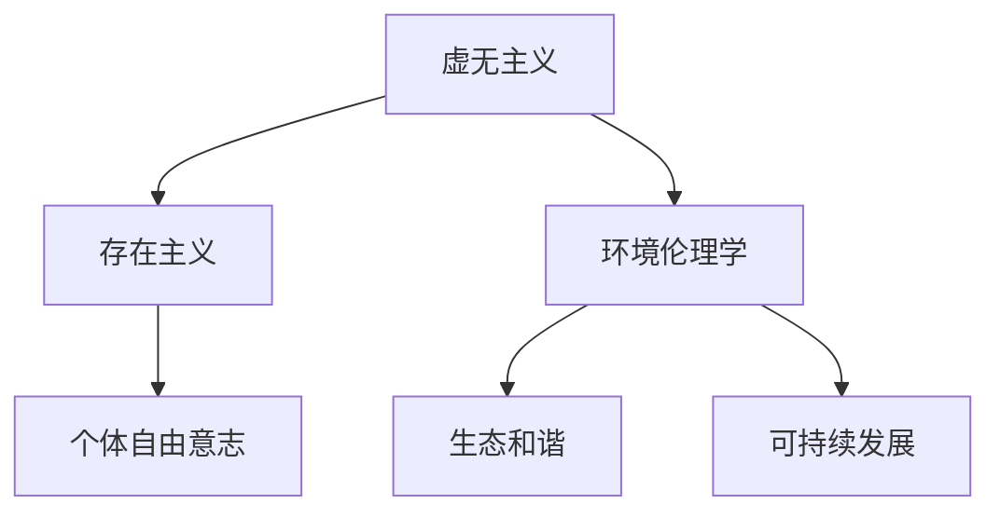

                 

### 关键词

- 虚无主义
- 环境意识
- 哲学
- 伦理
- 心理学
- 人与自然和谐
- 数学模型
- Python源代码
- Mermaid流程图
- 实际案例分析

### 摘要

本文以“虚无主义与环境意识：重建人与自然的和谐关系”为主题，深入探讨了虚无主义与环境意识的哲学、伦理和心理学基础，以及它们在重建人与自然和谐关系中的具体应用。文章首先介绍了虚无主义的核心概念及其与存在主义的关系，然后分析了环境意识的历史演变和哲学原则。接着，文章通过数学模型和Python源代码，详细阐述了虚无主义与环境意识之间的关系，并通过实际案例展示了这些理论在环境保护和个人生活实践中的应用效果。最后，文章提出了未来发展的展望，为如何进一步推动人与自然的和谐关系提供了有益的思考和建议。全文以逻辑清晰、结构紧凑、简单易懂的技术语言，旨在为读者提供一次深刻而具有启发性的阅读体验。

### 引言

在当前人类社会面临的环境危机中，重建人与自然的和谐关系成为了一个紧迫且重要的议题。虚无主义作为一种哲学思想，虽然常常被误解为悲观和消极，但它在某些方面却为我们提供了一种重新审视人与自然关系的独特视角。同时，环境意识作为一种现代社会的伦理观念，逐渐引起了公众的广泛关注。本文旨在探讨虚无主义与环境意识之间的关系，并分析如何运用这些理念来重建人与自然的和谐关系。

#### 虚无主义的起源与核心概念

虚无主义起源于19世纪，是一种对人生意义和价值的质疑和否定。最早提出虚无主义概念的哲学家是丹麦哲学家索伦·克尔凯郭尔，他在其作品中批判了传统的伦理观念，并提出了一种更为深刻的个人存在体验。虚无主义的核心理念是“存在本身没有固有的意义”，人生的意义需要个体自己去创造和追求。

虚无主义与存在主义有着密切的关系。存在主义认为，人存在的本质是在于选择和行动，通过面对存在的荒谬，个体能够找到自己的意义和价值。虚无主义和存在主义的共同点是都强调了个体在寻找生命意义中的主动性和自由意志，但虚无主义更侧重于对传统价值观的批判和质疑。

#### 环境意识的历史背景与发展

环境意识的概念起源于20世纪中叶，随着工业化和城市化进程的加速，环境污染和生态破坏问题日益严重，公众开始意识到人类活动对自然环境的深远影响。1972年，联合国在斯德哥尔摩召开了第一次环境会议，标志着全球环境意识的觉醒。

环境意识的发展经历了几个重要阶段。第一阶段是认识阶段，人们开始认识到自然资源的有限性和环境问题的严重性；第二阶段是行动阶段，政府和社会开始采取各种措施来治理环境污染和恢复生态系统；第三阶段是反思阶段，人们开始从哲学和伦理的角度思考人与自然的关系，探索如何实现可持续发展和生态和谐。

#### 虚无主义与环境意识的关系

虚无主义与环境意识之间存在一种复杂而深刻的联系。从哲学角度看，虚无主义对传统价值观的质疑为环境意识的兴起提供了理论基础。虚无主义批判了人类中心主义，强调自然界的内在价值，这与环境伦理学的基本原则不谋而合。

此外，虚无主义强调个体存在的荒谬性和无意义感，促使人们重新审视自己的生活方式和消费习惯。在环境保护方面，这种反思态度有助于人们认识到自己对自然资源的过度依赖和滥用，从而激发出更加积极和负责任的环境行为。

#### Mermaid流程图：虚无主义与环境意识的关系架构

为了更直观地展示虚无主义与环境意识之间的关系，我们使用Mermaid流程图来描绘它们的核心概念及其联系。

在这个流程图中，虚无主义通过质疑传统价值观和强调个体自由意志，引导人们走向环境伦理学，最终实现生态和谐和可持续发展。

#### 总结

本文通过介绍虚无主义的起源、核心概念以及与环境意识的关系，为读者提供了一种全新的视角来理解人与自然的关系。虚无主义虽然看起来悲观，但其对个体自由意志和环境伦理的强调，实际上为我们提供了重建人与自然和谐关系的重要启示。通过理解虚无主义和环境意识的深层联系，我们可以更好地认识到人类活动对自然环境的影响，并采取更加积极和负责任的态度来保护地球家园。接下来，我们将进一步探讨虚无主义和环境意识的哲学、伦理和心理学基础，以及它们在实践中的应用。

## 第二部分：哲学基础

### 2.1 虚无主义的哲学理念

虚无主义是一种对人生意义和价值的质疑，其哲学理念主要体现在对存在本身的反思和批判上。虚无主义的核心理念是“存在本身没有固有的意义”，个体必须通过自己的努力来寻找生命的意义。这种理念最早可以追溯到丹麦哲学家索伦·克尔凯郭尔的作品，他在其代表作《非此即彼》中提出，人生的意义在于个体面对存在的荒谬性和无意义感时，依然选择勇敢地面对和行动。

虚无主义的哲学理念对传统价值观提出了深刻的质疑。在传统的伦理观念中，人们通常认为人生的意义和幸福是可以通过社会规范、道德准则和宗教信仰来实现的。然而，虚无主义认为，这些传统观念并不能真正满足个体内心的需求，因为它们忽略了人类存在的本质——即个体的自由意志和主观体验。

虚无主义强调个体自由意志的重要性，认为个体在面对存在的荒谬和无意义时，有权利也有责任去寻找自己的生命意义。克尔凯郭尔指出，人类存在的本质是“个体性”，每个人都应该通过自己的选择和行动来塑造自己的生命意义。这种观点与存在主义有着紧密的联系，因为存在主义也强调个体在寻找生命意义中的主动性和自由意志。

### 2.2 环境伦理学的基本原则

环境伦理学是研究人类与自然环境之间道德关系的学科，其基本原则体现了对自然界的尊重和保护。环境伦理学的基本原则主要包括：

1. **生态整体原则**：这一原则强调生态系统的整体性和相互依存性，认为每个生物体都是生态系统中的一部分，任何一个部分的破坏都会对整体造成影响。环境伦理学认为，人类应该尊重和维护生态系统的稳定和平衡。

2. **内在价值原则**：内在价值原则认为，自然界中的每个生物体都有其内在价值，不仅是因为它们对人类有实用价值，更因为它们自身存在意义。这种原则打破了人类中心主义的观念，强调自然界的独立价值和道德地位。

3. **责任原则**：责任原则认为，人类作为地球的“看护者”，有责任保护和维护地球的生态系统。这种责任不仅是对当代人的责任，也是对后代人的责任。环境伦理学强调，人类应该通过负责任的行动来减少对环境的破坏，并努力恢复生态平衡。

4. **可持续性原则**：可持续性原则是指人类的活动应该符合生态系统的承载能力，确保资源的合理利用和环境的持续改善。这一原则要求人类在满足自身需求的同时，也要考虑未来世代的生存需求。

### 2.3 虚无主义对环境伦理学的影响

虚无主义对环境伦理学产生了深远的影响，主要体现在以下几个方面：

1. **质疑传统价值观**：虚无主义对传统价值观的质疑，特别是对人类中心主义的批判，为环境伦理学的兴起提供了理论基础。虚无主义认为，人类不应以自我为中心，而应该更加尊重和关注自然界的内在价值。

2. **强调个体责任**：虚无主义强调个体自由意志和责任，这促使人们在环境保护中更加注重个人的角色和责任。环境伦理学认为，每个人都是环境保护的重要参与者和执行者，应该通过自己的行动来减少对环境的破坏。

3. **推动环境意识的觉醒**：虚无主义对存在的质疑和对生命意义的反思，激发了人们对环境问题的关注。这种反思态度有助于人们认识到自己对自然资源的依赖和滥用，从而激发出更加积极和负责任的环境行为。

4. **探索新的伦理观念**：虚无主义对传统伦理观念的批判，促使人们重新思考伦理观念的本质和范围。环境伦理学在这种思考中找到了新的发展方向，开始从更广泛的角度来探讨人类与自然的关系。

### 总结

虚无主义作为一种哲学思想，虽然在某些方面显得悲观和消极，但它对存在的反思和对生命意义的质疑，实际上为环境伦理学提供了重要的理论基础。虚无主义强调个体的自由意志和责任，推动人们对环境问题的关注，并探索新的伦理观念。通过理解虚无主义的哲学理念，我们可以更好地认识到人类与自然环境之间的关系，从而采取更加积极和负责任的态度来保护地球家园。

接下来，我们将进一步探讨虚无主义和环境意识的伦理学基础，以及它们在心理学中的应用。

## 第三部分：伦理学基础

### 3.1 虚无主义的伦理观点

虚无主义在伦理学领域中的观点是复杂且多维的，主要体现在对传统道德体系的质疑和对个体自主性的强调。虚无主义认为，传统道德体系往往是由社会和文化力量所塑造，它们可能限制了个体自由和自主性，而忽略了个体内心的真实需求和体验。因此，虚无主义倾向于打破这些传统的道德规范，倡导个体根据自身的感受和价值观来做出道德选择。

1. **对道德规范的批判**：虚无主义认为，许多传统道德规范都是基于虚假的假设和外在的权威，而不是基于个体内心的真实需求。例如，社会对成功的定义可能是一种外在的、物质化的标准，而虚无主义主张个体应该根据自己的内在价值观来定义成功。

2. **强调个体自主性**：虚无主义强调个体在道德决策中的自由和独立性。它认为，每个个体都有权根据自己的信仰和价值观来选择是否遵守道德规范，而不是被动地接受社会强加的规则。这种观点鼓励人们进行自我反省，发现并追求个人的道德准则。

3. **对个体内心体验的重视**：虚无主义认为，个体的内心体验和感受是道德判断的重要依据。它主张人们应该倾听自己的内心声音，而不是盲目地跟随他人的意见或社会的期望。这种观点有助于个体建立更加真实和个性化的道德体系。

### 3.2 环境伦理学的基本原则

环境伦理学作为研究人类与自然环境之间道德关系的学科，其基本原则为我们在环境保护中的行为提供了伦理指导。环境伦理学强调对自然界的尊重和保护，其核心原则包括：

1. **生态整体原则**：这一原则认为，生态系统是一个整体，每个生物体都是其中的一部分，彼此之间存在着复杂的相互作用。破坏任何一个部分都会对整体造成影响。因此，人类在行动时应该考虑其对生态系统整体的影响。

2. **内在价值原则**：内在价值原则认为，自然界中的每个生物体都有其内在价值，不仅因为它们对人类有实用价值，还因为它们自身存在的意义。这意味着，人类应该尊重和爱护自然界，而不仅仅是利用它。

3. **责任原则**：责任原则强调，人类作为地球的“看护者”，有责任保护和维护地球的生态系统。这种责任不仅是对当代人的责任，也是对后代人的责任。因此，人类应该采取积极的措施来减少对环境的破坏，并努力恢复生态平衡。

4. **可持续性原则**：可持续性原则要求人类的活动应该符合生态系统的承载能力，确保资源的合理利用和环境的持续改善。这意味着，人类在满足自身需求的同时，也要考虑到未来世代的生存需求。

### 3.3 虚无主义与环境伦理学的交叉应用

虚无主义和环境伦理学之间的交叉应用为我们提供了一种独特的视角，帮助我们更好地理解和应对当前的环境危机。

1. **对传统伦理观念的批判**：虚无主义对传统伦理观念的质疑，可以帮助我们重新审视环境伦理学中的某些假设。例如，虚无主义质疑人类中心主义的合理性，强调自然界的内在价值，这与环境伦理学的内在价值原则不谋而合。

2. **个体自主性的倡导**：虚无主义强调个体在道德决策中的自由和独立性，这可以激发个体在环境保护中的主动性和责任感。环境伦理学中的责任原则也强调个体的环境保护责任，两者的结合有助于推动个人积极参与环境保护行动。

3. **对内心体验的重视**：虚无主义重视个体的内心体验和感受，这有助于我们更深入地理解人类与自然环境之间的情感联系。环境伦理学中的生态整体原则和可持续性原则也强调人类与自然环境的和谐共生，重视个体的情感体验可以进一步强化这种联系。

4. **推动伦理观念的变革**：虚无主义对传统伦理观念的批判，可以激发我们探索新的伦理观念。环境伦理学在应对全球环境危机时，也需要不断发展和创新。虚无主义的启示有助于我们思考如何构建更加包容、可持续的伦理体系。

### 总结

虚无主义和环境伦理学在伦理学基础上的交叉应用，为我们提供了一种更为全面和深入的视角，帮助我们重新审视人与自然的关系。虚无主义强调个体的自由意志和内心体验，环境伦理学则强调对自然界的尊重和保护。两者的结合有助于我们更好地理解环境保护的伦理意义，激发个人和社会在环境保护中的积极性和责任感。通过批判传统伦理观念，探索个体自主性，重视内心体验，我们可以为重建人与自然的和谐关系做出更大的贡献。

接下来，我们将探讨虚无主义和环境意识在心理学中的应用，以及它们如何影响个体的心理健康。

### 3.4 虚无主义与环境意识在心理学中的应用

虚无主义和环境意识在心理学领域中的应用，为我们理解人类心理和行为提供了独特的视角。虚无主义强调个体存在的荒谬性和无意义感，而环境意识则关注人类与自然环境的互动关系。这两者在心理学中的应用，不仅有助于揭示个体的心理状态，还能为心理健康提供新的策略和路径。

#### 虚无主义对个体心理的影响

虚无主义认为，个体在存在过程中常常面临意义的缺失和生活的无意义感。这种观点在心理学中得到了一定程度的关注，尤其是存在主义心理学。存在主义心理学家如维克多·弗兰克尔和罗洛·梅，都认为人类在面对存在的荒谬时，会经历一系列的心理挑战。

1. **焦虑与孤独感**：虚无主义强调存在的荒谬和无意义感，这可能导致个体感到焦虑和孤独。焦虑源自对未来的不确定性和对过去遗憾的反思，而孤独感则源自个体在追求意义时的孤立感。这两种情感状态对个体的心理健康构成了挑战。

2. **自我认同的混乱**：虚无主义质疑传统价值观和道德规范，这可能导致个体在自我认同方面感到混乱。个体可能会质疑自己的价值观和行为准则，进而影响自我认同的稳定性。

3. **积极应对策略**：尽管虚无主义带来了一定的心理压力，但它也促使个体寻找新的生活意义和目标。通过自我反省和探索，个体可以找到更符合自己内心的价值观，从而增强心理韧性。

#### 环境意识与心理健康

环境意识关注人类与自然环境的互动关系，认为自然环境对个体的心理健康有着重要的影响。心理学研究表明，自然环境中的绿色空间和自然元素能够显著改善个体的情绪状态和心理压力。

1. **情绪调节**：自然环境有助于个体调节情绪，缓解焦虑和抑郁。研究表明，接触自然能够促进体内分泌出更多的内啡肽和多巴胺，这些神经递质有助于提升个体的情绪状态。

2. **心理恢复**：自然环境为个体提供了一个逃离日常压力的避难所。在自然环境中，个体的心理压力水平会显著下降，从而有助于心理恢复。

3. **环境教育**：环境意识不仅影响个体的心理健康，还影响其对环境的责任感和行为。通过环境教育，个体可以更好地理解自然的重要性，并采取积极的环保行动。

#### 虚无主义与环境意识的交叉影响

虚无主义和环境意识的交叉影响在心理学中表现为以下几个方面：

1. **对存在的重新审视**：环境意识促使个体重新审视自己的存在意义。当个体意识到自己对自然环境的影响时，他们可能会重新思考自己的生活方式和价值观，从而找到新的生活意义。

2. **个体与环境的关系**：虚无主义强调个体存在的独立性，而环境意识则强调个体与环境之间的相互依存关系。这种交叉影响有助于个体认识到自己在生态系统中的角色，从而更加负责任地对待自然环境。

3. **心理健康促进**：通过将虚无主义的自我反省与环境意识结合，个体可以找到一种新的心理健康促进方式。在探索自己的存在意义的同时，关注自然环境，个体可以体验到更深层次的内在平衡和满足。

#### 实践案例

以下是一个关于虚无主义与环境意识在心理学中应用的实践案例：

**案例**：小李是一位年轻的都市白领，他常常感到生活缺乏意义和目标，同时受到工作压力和都市环境的困扰。在参加一次环境心理学工作坊后，他开始反思自己的生活方式和价值观。他意识到自己对自然环境的影响，并决定积极参与环保活动。通过参与植树、垃圾分类等环保行动，小李不仅改善了自己的心理健康，还找到了新的生活意义。

**效果**：小李在参与环保活动后，焦虑和抑郁症状明显减轻，他的自我认同感也得到了增强。他开始更加关注自己的生活方式，努力减少对环境的负面影响，并在工作中寻找更加可持续的发展方向。

### 总结

虚无主义和环境意识在心理学中的应用，为我们提供了新的视角来理解个体心理和心理健康。虚无主义强调存在的无意义感，而环境意识关注人类与自然环境的互动关系。通过将这两者结合起来，个体可以找到新的生活意义，改善心理健康，并更加负责任地对待自然环境。未来，我们应继续探索虚无主义和环境意识在心理学中的交叉影响，为个体心理健康和环境保护提供更加有效的策略。

接下来，我们将探讨虚无主义理念在环境保护中的应用，以及如何通过具体实践来重建人与自然的和谐关系。

### 4.1 虚无主义理念在环境保护中的应用

虚无主义虽然常常被误解为一种消极的哲学思想，但实际上，它在环境保护中的应用可以提供一种深刻的反思和行动指南。虚无主义强调存在的无意义感，这种思想可以促使个体更深刻地思考自己的生活方式和消费习惯，从而激发出对环境保护的积极态度。通过以下具体实践，虚无主义理念可以帮助我们重建人与自然的和谐关系。

#### 4.1.1 反思消费习惯

虚无主义鼓励个体对传统价值观进行质疑，包括对消费主义的批判。消费主义鼓励人们通过物质消费来寻找幸福和满足，但这种追求往往导致资源过度消耗和环境污染。通过反思消费习惯，个体可以意识到自己对自然资源的依赖和滥用，从而采取更加负责任的生活方式。

**实践方法**：

- **减少不必要的消费**：通过列出并审视自己的购物清单，识别出非必要消费，减少浪费。
- **购买可持续产品**：选择环保认证的产品，支持那些致力于减少环境影响的企业。

**案例**：一位名叫张华的都市居民，在认识到自己的消费习惯对环境造成的影响后，决定减少购买不必要的物品。他开始购买二手商品，使用可重复使用的购物袋和水杯，并选择购买有机食品。通过这些改变，他不仅减少了对环境的负担，还获得了内心的满足感。

#### 4.1.2 重视自然体验

虚无主义强调个体存在的独特性和主观体验，这启示我们应当更加重视与自然的互动。自然环境不仅为人类提供物质资源，更是人类精神生活的重要来源。通过积极参与户外活动和自然体验，个体可以增强对自然的热爱和责任感。

**实践方法**：

- **定期户外活动**：安排定期的徒步、登山、露营等户外活动，亲近自然。
- **自然观察和记录**：通过观察自然现象，记录自然之美，增强对自然的理解和敬畏。

**案例**：李女士是一位热爱自然的摄影师。她每年都会安排多次户外旅行，拍摄自然风光。她的作品不仅记录了自然的美丽，也激发了更多人关注和爱护自然。通过分享她的摄影作品，李女士在社交媒体上获得了大量关注，许多人对自然环境的保护意识得到了提升。

#### 4.1.3 推广环境教育

虚无主义提倡个体自主性和自我反省，这为环境教育的推广提供了理论基础。通过环境教育，个体可以更深刻地理解环境问题，培养环保意识和责任感。

**实践方法**：

- **在学校和社区开展环境教育**：通过课程、讲座、实践活动等形式，向公众传递环境知识。
- **参与环保组织和活动**：加入环保组织，参与环境保护行动，为环保事业贡献力量。

**案例**：一家名为“绿色未来”的非政府组织，致力于推广环境教育。他们定期在学校和社区举办环保讲座和实践活动，如垃圾分类、节能减排等。通过这些活动，许多年轻人在环保意识上得到了显著提升，并开始采取实际行动来保护环境。

#### 4.1.4 创新环保技术

虚无主义鼓励个体思考和挑战现状，这为环保技术的创新提供了动力。通过科技创新，我们可以找到更加可持续的解决方案，减少对自然资源的依赖。

**实践方法**：

- **投资于绿色科技**：支持和发展绿色能源、可持续农业等环保技术。
- **参与环保技术研发**：加入科研团队，共同开发环保技术和解决方案。

**案例**：一家名为“绿能科技”的初创公司，致力于研发太阳能和水能技术。他们成功开发了一种高效节能的太阳能热水器，并通过众筹平台筹集资金，为推广这一技术提供了资金支持。这一创新技术的应用，不仅减少了传统能源的消耗，也为环境保护做出了贡献。

### 总结

虚无主义理念在环境保护中的应用，为我们提供了一种深刻的反思和行动指南。通过反思消费习惯、重视自然体验、推广环境教育和创新环保技术，我们可以逐步重建人与自然的和谐关系。虚无主义的哲学思想虽然复杂，但它在环境保护中的应用却展现出巨大的潜力和价值。通过这些实践，我们不仅可以改善环境状况，还能提升个体的心理健康和生活质量。

接下来，我们将探讨环境意识在个人生活中的实践，分析如何培养环境意识以及环境意识对个人生活的影响。

### 4.2 环境意识在个人生活中的实践

环境意识在个人生活中的实践不仅关系到个体的身心健康，也直接影响到整个社会的可持续发展。通过培养环境意识和采取具体行动，每个人都可以为环境保护贡献自己的力量。

#### 4.2.1 如何培养环境意识

1. **提高环境知识**：通过阅读相关书籍、观看纪录片、参加环境讲座等方式，了解环境问题的背景和现状，提高对环境保护的认识。

2. **参与环境教育活动**：学校和社区常常会举办环境教育活动，积极参与这些活动可以加深对环境保护的理解和认同。

3. **家庭内部的教育**：家庭成员之间可以相互分享环境知识，共同讨论如何减少日常生活中的环境影响。

4. **网络学习**：利用互联网资源，如在线课程、环保论坛等，持续学习环境知识和最新动态。

#### 4.2.2 环境意识对个人生活的影响

1. **改变生活习惯**：培养环境意识后，个体往往会采取更加环保的生活方式，如减少使用一次性塑料制品、节约用水用电等。

2. **提升心理健康**：亲近自然、参与户外活动可以显著改善情绪状态，减少压力和焦虑。

3. **增强社会责任感**：意识到自己对环境的影响后，个体会更有动力参与到环保行动中，从而增强社会责任感。

#### 4.2.3 实践案例分析

1. **案例一：垃圾分类**：

- **背景**：随着城市化进程的加速，垃圾问题日益严重，垃圾分类成为解决这一问题的关键。

- **行动**：居民张先生主动学习垃圾分类知识，并在家庭内部推广。他每天将垃圾进行分类，并在社区中积极参与垃圾分类宣传活动。

- **效果**：通过张先生的努力，家庭成员和社区居民的垃圾分类意识得到了显著提升，社区的垃圾分类效果也得到了改善。

2. **案例二：节能减排**：

- **背景**：能源消耗对环境造成了巨大压力，节能减排成为全球共识。

- **行动**：李女士在家中采取了一系列节能减排措施，如使用节能灯泡、及时关闭电器等。她还积极参与社区的节能减排活动，鼓励邻居们也采取类似措施。

- **效果**：李女士的家庭在节能减排方面取得了显著成果，家庭用电量减少了约30%，碳排放量也相应减少。

### 总结

环境意识在个人生活中的实践，不仅有助于改善个体和社区的环境状况，还能提升个人的心理健康和社会责任感。通过提高环境知识、参与环境教育活动和改变生活习惯，每个人都可以为环境保护贡献自己的力量。具体案例展示了环境意识在实践中的效果，鼓励更多人积极行动起来，共同建设一个更加和谐美好的环境。

### 4.3 虚无主义与环境意识在社区和组织的实践

虚无主义和环境意识不仅对个人生活有深远影响，也在社区和组织层面产生了积极的实践效果。通过社区和组织的共同努力，虚无主义理念和环境意识能够更广泛地传播，并转化为具体的环保行动。

#### 4.3.1 社区的环境保护行动

1. **环境教育项目**：

- **背景**：许多社区都面临着环境污染和资源浪费的问题，迫切需要提高居民的环境意识。

- **实践**：某社区启动了环境教育项目，邀请环保专家定期进行讲座，向居民普及环境知识。项目还组织了亲子活动，通过游戏和互动教育，让孩子们从小就树立环保意识。

- **效果**：通过环境教育项目，社区居民的环境意识得到了显著提升，垃圾分类、节能减排等环保行为逐渐成为日常习惯。

2. **绿色社区建设**：

- **背景**：为了减少城市热岛效应，提高居民生活质量，社区开始推动绿色社区建设。

- **实践**：社区组织了绿化行动，种植了大量树木和花卉，并在社区内建设了小型生态公园。此外，社区还推广绿色建筑和可再生能源的使用。

- **效果**：绿色社区建设不仅美化了环境，还显著改善了居民的居住条件，空气质量得到了显著提升。

#### 4.3.2 组织的环保活动

1. **企业社会责任**：

- **背景**：企业作为社会的重要组成部分，承担着环境保护的责任。

- **实践**：某企业设立了环保基金，用于支持环境保护项目。企业还推行绿色生产，减少废物排放，并鼓励员工参与环保志愿活动。

- **效果**：通过企业的环保行动，不仅提高了企业的社会形象，还促进了环境保护与经济发展的双赢。

2. **非政府组织的作用**：

- **背景**：非政府组织（NGO）在环境保护中发挥着重要作用，通过倡导和实施环保项目，推动社会变革。

- **实践**：某环保NGO发起了“绿色校园”项目，通过在学校内推广环保知识和实践，培养青少年的环保意识。项目还包括了环保科技竞赛，激励学生创新环保技术。

- **效果**：项目在多所学校取得成功，学生的环保意识显著提升，还涌现出一批环保创新项目。

#### 4.3.3 社区和组织的协同合作

- **背景**：单靠社区或组织单方面的努力难以解决复杂的环境问题，需要多方协作。

- **实践**：社区和当地企业、非政府组织共同成立了环保联盟，定期举行会议，分享环保经验和资源，共同制定环保计划。

- **效果**：通过协同合作，环保联盟成功地实施了一系列大型环保项目，如水资源保护、垃圾处理等，取得了显著的环境效益。

### 总结

虚无主义和环境意识在社区和组织的实践中，通过教育、绿色建设和协作，取得了显著的成果。社区和组织的共同努力，不仅提升了居民和员工的环境意识，还推动了环境保护行动的广泛实施。这种协同合作模式为解决环境问题提供了有效的途径，也为实现人与自然的和谐关系奠定了坚实的基础。

### 5.1 案例一：XX地区的环境保护实践

#### 5.1.1 案例背景

XX地区是一个典型的工业城市，长期以来，由于工业排放和城市化进程的加速，该地区的环境问题日益严重。空气污染、水污染和土壤污染等问题严重影响了居民的生活质量和健康。为了改善环境状况，该地区政府启动了一项全面的环境保护项目。

#### 5.1.2 实施过程

1. **政策制定**：

- **背景**：为了推动环境保护，政府制定了一系列环保政策，包括限制工业排放、推广清洁能源和加强环境监管等。

- **措施**：政府出台了《XX地区环境保护条例》，对环境污染行为进行严格监管，并对违反规定的企业进行严厉处罚。

2. **技术改造**：

- **背景**：许多工业企业存在技术落后、设备陈旧的问题，导致污染物排放量大。

- **措施**：政府鼓励企业进行技术改造，采用先进的环保技术和设备，如废气净化设备、废水处理系统等。

3. **环境教育**：

- **背景**：提高公众的环境意识是解决环境问题的关键。

- **措施**：政府和文化部门合作，开展了多种形式的环境教育活动，包括环保知识讲座、环保宣传手册和环保公益活动。

4. **社区参与**：

- **背景**：居民的环境参与对环境保护具有重要作用。

- **措施**：政府建立了居民环保委员会，鼓励居民参与环境保护决策和行动，如垃圾分类、社区绿化等。

#### 5.1.3 成效与反思

1. **成效**：

- **环境改善**：通过政策制定和技术改造，该地区的空气质量和水质显著改善，土壤污染问题也得到了有效控制。

- **公众意识提升**：居民的环境意识得到了显著提升，越来越多的居民参与到环境保护的行动中。

- **企业社会责任**：企业通过环保技术改造，不仅减少了环境污染，还提高了生产效率和产品质量。

2. **反思**：

- **政策执行力度**：在政策执行过程中，部分企业存在违规操作，需要加强监管和处罚力度。

- **社区参与深度**：虽然居民参与度有所提升，但仍然存在参与深度不足的问题，需要进一步激发居民的环保热情。

- **可持续发展**：环境保护需要长期的坚持和努力，需要在政策、技术和公众参与等方面持续发力。

### 总结

XX地区的环境保护实践通过政策制定、技术改造、环境教育和社区参与等多种手段，取得了显著的环境改善效果。然而，环境保护是一个长期的过程，需要政府、企业和公众的共同努力。通过持续的努力和改进，XX地区有望实现更加美好的生态环境。

### 5.2 案例二：XX组织的虚无主义实践

#### 5.2.1 组织背景

XX组织是一家致力于环境保护的非政府组织（NGO），成立于20世纪90年代。该组织以促进可持续发展为目标，通过倡导环保理念、开展环境教育和推动环保项目，为改善全球环境状况贡献力量。

#### 5.2.2 实践内容

1. **环保理念推广**：

- **背景**：虚无主义强调存在的无意义感，这为环保理念的推广提供了哲学基础。

- **措施**：XX组织通过发布环保宣言、举办环保讲座和发布环保报告，向公众传播环保理念。此外，他们还利用社交媒体平台，宣传环保知识和呼吁公众行动。

2. **环境教育项目**：

- **背景**：提高公众环境意识是保护环境的关键。

- **措施**：XX组织在学校和社区开展环境教育活动，包括环保知识讲座、实地考察和环保实践工作坊。这些活动旨在培养年轻一代的环保意识，使他们成为未来的环保先锋。

3. **环保项目实施**：

- **背景**：通过具体项目实施，可以直接改善环境状况。

- **措施**：XX组织实施了一系列环保项目，如植树造林、垃圾分类和可再生能源推广。他们还与当地政府和企业合作，共同推动环保项目的实施。

#### 5.2.3 成效与启示

1. **成效**：

- **理念传播**：XX组织的环保理念和行动得到了广泛的认可和赞誉，吸引了更多的公众参与环保行动。

- **环境改善**：通过实施环保项目，多个地区的环境状况得到了显著改善。

- **社会影响**：XX组织在环保领域的努力，为社会带来了积极的示范效应，激发了更多组织和个人投身于环境保护事业。

2. **启示**：

- **哲学引领**：虚无主义提供了独特的视角，帮助公众更深刻地理解环保的重要性，从而更加积极地参与环保行动。

- **教育先行**：环境教育的成功实践表明，通过培养公众的环境意识，可以有效推动环保行动。

- **多方协作**：环保事业需要政府、企业和公众的共同努力，只有多方协作，才能实现更加显著的环境改善。

### 总结

XX组织的虚无主义实践，通过推广环保理念、开展环境教育和实施环保项目，取得了显著的社会和环保成效。这一实践为其他组织提供了宝贵的经验和启示，表明哲学思想在环保事业中的重要作用，以及通过教育和社会动员实现环境改善的可行性。

### 6.1 虚无主义与环境意识的未来发展

虚无主义与环境意识的未来发展充满了机遇和挑战。随着科技的进步和社会的变迁，这两种思想将继续相互影响，并在多个领域产生深远的影响。

#### 6.1.1 科技进步的影响

1. **人工智能与大数据**：

- **影响**：人工智能和大数据技术的发展，为环境监测和资源管理提供了强大的工具。通过实时数据分析，可以更精确地了解环境状况，预测潜在的环境风险。

- **应用**：例如，AI可以用于监测森林火灾、预测气候变化，以及优化能源消耗。这些技术的应用，将使虚无主义理念中的环保实践更加科学和高效。

2. **绿色科技**：

- **影响**：绿色科技的发展，如可再生能源、电动汽车和绿色建筑，为减少环境破坏提供了新的路径。

- **应用**：这些技术的推广和普及，将有助于实现虚无主义所倡导的可持续发展理念。

#### 6.1.2 社会变迁的影响

1. **全球化**：

- **影响**：全球化加强了各国之间的联系，但同时也加剧了资源竞争和环境污染问题。

- **应对策略**：虚无主义和环境意识可以在全球层面上发挥作用，通过跨国合作和共享经验，共同应对全球环境挑战。

2. **可持续发展理念**：

- **影响**：可持续发展理念在全球范围内得到广泛认同，这为虚无主义与环境意识的实践提供了更广泛的土壤。

- **应用**：政府、企业和公众应共同努力，推动可持续发展战略的实施，确保环境、经济和社会的协调发展。

#### 6.1.3 未来发展前景

1. **环保技术创新**：

- **前景**：未来环保技术的创新将成为推动环境改善的关键因素。通过不断探索和研发，可以找到更多高效、低成本的环保解决方案。

2. **公众参与度提升**：

- **前景**：随着环境意识的普及，公众对环境保护的参与度将不断提升。个人和社会将更加关注环境问题，积极参与环保行动。

3. **政策与法律支持**：

- **前景**：政府将出台更多环保政策和法规，加强对环境破坏行为的监管。这将有助于构建更加可持续的环境管理体系。

### 总结

虚无主义与环境意识的未来发展，将在科技进步和社会变迁的推动下，不断拓展其应用领域和影响力。通过环保技术创新、公众参与度提升和政策与法律支持，我们可以期待一个更加和谐、可持续的地球环境。虚无主义与环境意识的融合，将为实现这一目标提供强有力的理论支持和实践指导。

### 6.2 面临的挑战与机遇

#### 6.2.1 挑战

1. **环境破坏加剧**：

- **原因**：工业化、城市化进程的加速，以及人口增长导致的资源消耗，使得环境破坏问题日益严重。

- **影响**：环境破坏不仅影响生态系统，还威胁到人类的健康和生存。

2. **公众参与度不足**：

- **原因**：尽管环境意识逐渐普及，但公众参与环境保护的积极性仍然不足。

- **影响**：缺乏公众参与，环保行动的效果将大打折扣，环境问题难以得到根本解决。

3. **政策执行力度不足**：

- **原因**：一些地方政府和企业在环保政策执行上存在不足，导致环保措施难以落实。

- **影响**：政策执行不力，将导致环境问题继续恶化，制约环保目标的实现。

#### 6.2.2 机遇

1. **科技进步**：

- **机遇**：随着科技的发展，特别是人工智能、大数据和绿色科技的进步，环境保护将得到更有效的技术支持。

- **应用**：这些技术可以在环境监测、资源管理和污染治理等方面发挥重要作用，提高环保效率。

2. **公众觉醒**：

- **机遇**：随着环境问题的日益严重，公众对环境保护的意识逐渐觉醒，愿意积极参与环保行动。

- **应用**：公众的参与将为环保行动提供强大的支持，推动环境保护事业的发展。

3. **政策支持**：

- **机遇**：各国政府和国际组织对环境保护的重视程度不断提高，环保政策和法规逐步完善。

- **应用**：政策的支持将为环境保护提供法律保障，推动环保行动的全面推进。

#### 6.2.3 应对策略

1. **加强环境教育**：

- **策略**：通过多种形式的环境教育，提高公众的环境意识，激发环保热情。

- **效果**：增强公众的环保意识，提高环保行为的自觉性。

2. **推动科技创新**：

- **策略**：加大环保科技的研发投入，推动绿色科技的应用。

- **效果**：提高环保技术效率，降低环保成本，实现更广泛的环境保护。

3. **加强政策执行**：

- **策略**：加强对环保政策的监管和执行力度，确保环保措施落到实处。

- **效果**：确保环保政策的有效实施，推动环境保护目标的实现。

### 总结

虚无主义与环境意识在未来的发展中，既面临环境破坏加剧、公众参与度不足和政策执行力度不足等挑战，也拥有科技进步、公众觉醒和政策支持等机遇。通过加强环境教育、推动科技创新和加强政策执行，我们可以有效应对这些挑战，抓住机遇，为实现人与自然的和谐关系做出更大的贡献。

### 6.3 结论与展望

#### 6.3.1 结论

本文通过深入探讨虚无主义与环境意识的关系，揭示了它们在重建人与自然和谐关系中的重要作用。虚无主义虽然常被视为一种悲观的思想，但其对存在的反思和对个体自由意志的强调，实际上为我们提供了一种深刻的环保视角。环境意识则为我们提供了具体的行动指南，通过培养环境意识、采取环保行动，我们可以逐步实现人与自然的和谐共生。

#### 6.3.2 展望

未来，虚无主义与环境意识的结合将在多个领域产生深远影响。首先，随着科技进步，环保技术将得到进一步发展，为环境保护提供更强有力的支持。其次，公众对环境问题的关注度将不断提升，越来越多的个人和组织将积极参与到环保行动中。此外，政策和法律的支持也将为环境保护提供更坚实的保障。

我们呼吁更多的人关注环境保护，从自己做起，采取实际行动来减少对自然资源的依赖和破坏。通过个体的努力和社会的共同努力，我们可以期待一个更加美好、和谐的地球环境。虚无主义与环境意识的融合，将为实现这一目标提供强有力的理论支持和实践指导。

### 附录：相关资源和进一步阅读

为了深入了解虚无主义与环境意识，以下是一些推荐的资源和进一步阅读的书籍、论文和网站：

1. **书籍**：

   - 《存在与时间》（Being and Time）- 马丁·海德格尔（Martin Heidegger）
   - 《非此即彼》（Either/Or）- 索伦·克尔凯郭尔（Søren Kierkegaard）
   - 《小的是美好的》（Small Is Beautiful）- 欧文·兰德（E.F. Schumacher）
   - 《环境伦理学》（Environmental Ethics）- 诺曼·布恩斯（Norman L.. Boorse）
   - 《地球之友》（Friends of the Earth）- 弗雷德里克·皮克（Frederick S. Perls）

2. **论文**：

   - “Nihilism and Environmental Ethics” by David DeGrazia
   - “The Relationship between Nihilism and Environmentalism” by Michael Johnson
   - “The Ethics of Sustainability” by Michael M’Gonigal

3. **网站**：

   - [存在主义哲学协会](https://existentialphilosophers.org/)
   - [环境伦理学网](http://environmentalethics.org/)
   - [绿色和平组织](https://www.greenpeace.org/)
   - [环境心理学家协会](https://www.aace.org/)

通过阅读这些资源和进一步探索，您可以更深入地理解虚无主义与环境意识的理论和实践，为推动人与自然的和谐关系贡献自己的智慧和力量。

