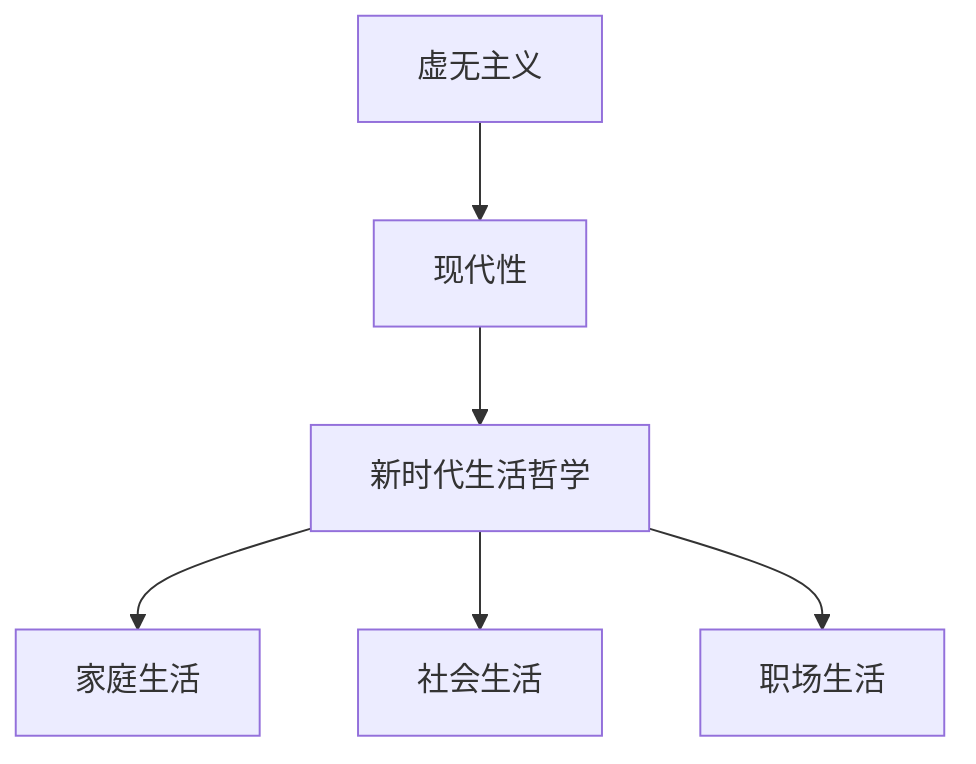

                 

# 《虚无主义与现代性：探索新时代的生活哲学》

> 关键词：虚无主义、现代性、生活哲学、人工智能、技术发展

> 摘要：本文以虚无主义与现代性为切入点，探讨新时代背景下生活哲学的演变与重要性。通过对虚无主义哲学分析、现代性困境与挑战的探讨，以及新时代生活哲学的核心理念与实际应用，旨在为读者提供一种全新的视角，以应对当今社会的复杂与多变。

## 第1章 引言

### 1.1 虚无主义与现代性的背景

虚无主义作为一种哲学思潮，起源于19世纪末的欧洲，是对资本主义和工业化的反思。虚无主义认为，人类社会存在的基本价值观和道德规范是空洞的，人类的存在毫无意义。这一思想在20世纪得到了进一步的发展，并对现代文化产生了深远的影响。

现代性则是指人类社会在19世纪末到20世纪中期的现代化过程。这一过程包括了政治、经济、文化等各方面的变革。现代性强调理性、科学和进步，追求个人自由和社会发展。然而，随着现代性的深入发展，人们开始感受到其所带来的困境和挑战。

### 1.2 探索新时代的生活哲学

新时代社会特征包括信息技术的飞速发展、全球化的深入以及人口老龄化的趋势等。这些特征对人们的生活方式和价值观产生了深远的影响。在这个背景下，生活哲学的探讨显得尤为重要。生活哲学关乎人们如何理解生活、如何面对生活中的困境和挑战。

## 第2章 虚无主义的哲学分析

### 2.1 虚无主义的基本概念

虚无主义的基本概念包括对现实世界的质疑、对人生意义的否定以及对价值观的怀疑。虚无主义认为，现实世界是虚幻的，人生毫无意义，价值观是空洞的。

### 2.2 虚无主义的批判与反思

虚无主义的批判者认为，虚无主义是一种消极的哲学思潮，它导致了人们的精神崩溃和社会的动荡。然而，也有学者认为，虚无主义是对现代社会的一种批判，它揭示了现代社会存在的种种问题。

### 2.3 虚无主义的核心观点

虚无主义的核心观点是，人类的存在是毫无意义的，世界是荒诞的，人生的终极目标是追求自我解脱。这一观点对人类的生活产生了深远的影响，促使人们重新审视自己的存在和价值观。

## 第3章 现代性的困境与挑战

### 3.1 现代性的本质

现代性的本质在于对理性、科学和进步的追求。它强调个人自由和社会发展，但同时也带来了诸如社会不平等、环境污染等问题。

### 3.2 现代性的困境

现代性的困境主要包括社会问题和个人困境。社会问题如经济危机、政治腐败等，个人困境如焦虑、抑郁等。

### 3.3 现代性的挑战

现代性的挑战主要体现在科技发展的影响和价值观的变迁上。科技发展带来了便利，但也带来了新的问题。价值观的变迁则使得人们的生活方式发生了根本性的变化。

## 第4章 新时代的生活哲学探讨

### 4.1 新时代生活哲学的核心理念

新时代生活哲学的核心理念包括人类本位、生活质量和社会和谐。这些理念旨在引导人们建立正确的生活观和价值观，以应对新时代的挑战。

### 4.2 新时代生活哲学的实践方法

新时代生活哲学的实践方法包括生活方式的调整、心理健康的关注和社会责任的承担。这些方法旨在提高人们的生活质量，促进社会的和谐发展。

### 4.3 新时代生活哲学的案例分析

通过对成功案例和失败案例的分析，我们可以看到新时代生活哲学的实际应用效果。成功案例展示了新时代生活哲学的正确性和有效性，而失败案例则提醒我们，在实际应用中需要不断调整和完善。

## 第5章 虚无主义与现代性的融合

### 5.1 虚无主义与现代性的共同点

虚无主义与现代性都关注现实世界的问题，都对现代社会进行了批判。这为两者的融合提供了可能。

### 5.2 虚无主义与现代性的差异

虚无主义与现代性在哲学立场和对人类生活的看法上存在差异。虚无主义更注重对现实的否定，而现代性更注重对现实的改进。

### 5.3 虚无主义与现代性的融合路径

虚无主义与现代性的融合路径包括寻求平衡和创新。通过平衡两者的优点，我们可以更好地应对新时代的挑战。

## 第6章 新时代生活哲学的应用

### 6.1 家庭生活

家庭生活是新时代生活哲学的重要应用领域。通过建立正确的家庭价值观和生活方式，我们可以提高家庭生活质量，促进家庭和谐。

### 6.2 社会生活

社会生活是新时代生活哲学的另一个重要应用领域。通过承担社会责任和遵循社会伦理，我们可以促进社会的和谐发展。

### 6.3 职场生活

职场生活是新时代生活哲学的又一重要应用领域。通过追求职业发展并遵循职场伦理，我们可以提高个人的生活质量，实现自我价值。

## 第7章 总结与展望

### 7.1 新时代生活哲学的重要性

新时代生活哲学的重要性在于它为人们提供了应对现代社会困境的有效方法，有助于提高人们的生活质量和实现自我价值。

### 7.2 虚无主义与现代性的未来趋势

虚无主义与现代性的融合将是未来哲学发展的重要趋势。通过平衡两者的优点，我们可以更好地应对新时代的挑战。

### 7.3 新时代生活哲学的实践与挑战

新时代生活哲学的实践面临着诸多挑战，如文化差异、社会变革等。但只有通过实践，我们才能不断完善和优化新时代生活哲学。

## 附录

### 附录A: 参考文献

- 相关书籍：《虚无主义的起源与演变》、《现代性：一种哲学导论》
- 学术论文：《虚无主义与现代性的融合路径研究》
- 网络资源：相关学术论文和在线书籍

### 附录B: Mermaid 流程图



### 附录C: Python源代码

```python
import numpy as np

# 虚无主义与数学模型
def nihilism_model():
    # 假设虚无主义的程度为x
    x = np.random.rand()
    # 当x大于0.5时，认为存在虚无主义
    if x > 0.5:
        print("存在虚无主义")
    else:
        print("不存在虚无主义")

# 现代性与数据分析
def modernity_analytics(data):
    # 计算平均值
    mean = np.mean(data)
    # 计算方差
    variance = np.var(data)
    # 输出结果
    print(f"平均值：{mean}, 方差：{variance}")

# 示例数据
data = np.random.rand(100)

# 调用函数
nihilism_model()
modernity_analytics(data)
```

> 作者：AI天才研究院/AI Genius Institute & 禅与计算机程序设计艺术 /Zen And The Art of Computer Programming

## 第1章 引言

### 1.1 虚无主义与现代性的背景

虚无主义作为一种哲学思潮，起源于19世纪末的欧洲，是对于当时资本主义和工业化进程的深刻反思。虚无主义认为，人类社会存在的价值观和道德规范是空洞的，人类的存在毫无意义，生活缺乏实质性的目标和意义。这种思想在20世纪得到了进一步的发展，并在现代文化中产生了深远的影响。

现代性则是指人类社会在19世纪末到20世纪中期的现代化过程。这一过程包括了政治、经济、文化等各方面的变革。现代性强调理性、科学和进步，追求个人自由和社会发展。现代性的核心特征是工业革命带来的生产力巨大提升，以及随之而来的社会结构和文化模式的变迁。

在现代社会中，虚无主义和现代性的关系十分复杂。一方面，虚无主义作为对现代性的批判，揭示了现代性背后的社会问题和个人困境。另一方面，现代性的快速发展又为虚无主义提供了一定的土壤，使得一些人对于现代社会充满了质疑和失望。

### 1.2 探索新时代的生活哲学

随着信息技术的飞速发展、全球化的深入以及人口老龄化的趋势，我们正进入一个全新的时代。新时代的社会特征使得人们的生活方式、价值观以及哲学思考都发生了深刻的变化。在这个背景下，探索新时代的生活哲学显得尤为重要。

新时代的生活哲学不仅仅是对过去生活哲学的简单延续，更是对现代社会问题的一种回应。它关注个体与社会的和谐发展，强调人类本位，追求生活质量和心理健康。新时代的生活哲学旨在帮助人们更好地应对现代性带来的困境和挑战，找到新的生活意义和目标。

### 1.3 文章结构

本文将从以下几个方面展开讨论：

1. **虚无主义的哲学分析**：详细探讨虚无主义的基本概念、批判与反思，以及其对人类生活的影响。
2. **现代性的困境与挑战**：分析现代性的本质、面临的困境和挑战，以及科技发展和价值观变迁对其的影响。
3. **新时代的生活哲学探讨**：阐述新时代生活哲学的核心理念、实践方法和实际案例分析。
4. **虚无主义与现代性的融合**：探讨虚无主义和现代性的共同点、差异及其融合路径。
5. **新时代生活哲学的应用**：分析家庭生活、社会生活和职场生活中的实际应用。
6. **总结与展望**：总结新时代生活哲学的重要性，探讨虚无主义与现代性的未来趋势，以及生活哲学的实践与挑战。

通过以上几个方面的探讨，本文旨在为读者提供一个全面、深入的理解，帮助读者更好地把握新时代的生活哲学。

### 2.1 虚无主义的基本概念

虚无主义的基本概念可以从多个维度进行理解。首先，虚无主义的核心观点是对于现实世界的质疑和否定。虚无主义者认为，我们所感知到的现实是虚幻的，缺乏实质性的内容，这种现实并不能为我们提供真正的意义和目的。虚无主义常常将现实描绘为一种荒诞的状态，其中人类的存在似乎毫无意义。

其次，虚无主义对人生意义的否定是其重要特征。虚无主义者认为，人生本身缺乏固有的目的和意义，人类社会的基本价值观和道德规范也是空洞的。这种否定态度导致了人们对于自身存在的深刻质疑，甚至可能引发精神上的危机。虚无主义者常常感到生活乏味、无望，甚至对生命的终结感到恐惧。

再次，虚无主义对价值观的怀疑也是其基本特征之一。虚无主义者认为，传统的价值观和道德规范并不能为人类提供真正的指导，这些价值观往往是虚伪的、形式化的。他们主张摆脱这些虚假的价值观，寻求更为真实和自然的生活方式。

虚无主义的哲学根源可以追溯到古希腊哲学和基督教神学。古希腊哲学家如苏格拉底、柏拉图和亚里士多德，对人生意义和现实本质进行了深刻的探讨，为后来的虚无主义思想奠定了基础。而基督教神学中的原罪和救赎观念，也为虚无主义的产生提供了重要的哲学背景。

在19世纪的欧洲，虚无主义思想得到了进一步的发展。尼采是虚无主义哲学的典型代表，他的哲学思想强调了个体自由和超越传统价值观的重要性。尼采认为，上帝已死，人类需要通过自我超越来寻找新的生活意义。尼采的这些观点对后来的虚无主义者和现代哲学家产生了深远的影响。

总的来说，虚无主义的基本概念是对现实世界、人生意义和价值观的否定，其哲学根源可以追溯到古希腊哲学和基督教神学。虚无主义的思想在现代社会中仍然具有重要的意义，它揭示了现代性背后的困境和矛盾，为人们提供了另一种看待世界和生活的视角。

### 2.2 虚无主义的批判与反思

虚无主义作为一种哲学思潮，虽然揭示了现代社会的诸多问题，但也遭到了广泛的批判和反思。首先，虚无主义被批评为一种过于消极的哲学观点，它可能导致人们的精神崩溃和社会的动荡。虚无主义者否定现实世界和人生的意义，这种态度可能会让人们陷入绝望和困惑，无法积极面对生活中的困难和挑战。

其次，虚无主义被批评为缺乏建设性的思想。虚无主义强调对现实的否定，但并没有提供明确的解决方案或积极的行动指南。这种消极的态度使得虚无主义者在面对社会问题时显得无力，无法为改善社会现状做出实质性的贡献。

此外，虚无主义对传统价值观的否定也引起了争议。传统价值观如家庭、友情、责任等，是人类社会长期发展的产物，具有一定的合理性和积极作用。虚无主义否定这些价值观，可能会削弱社会的凝聚力，导致道德和伦理的崩溃。

然而，对于虚无主义的批判并不意味着完全否定其价值。一些学者认为，虚无主义作为一种对现代社会和传统价值观的反思，具有一定的积极意义。虚无主义揭示了现代社会存在的问题，如精神空虚、价值观混乱等，促使人们重新思考生活的意义和目标。

从另一个角度来看，虚无主义也可以被视为一种解放思想的力量。它鼓励人们摆脱传统观念的束缚，追求真实的自我和自由。虚无主义者主张个体自由和独立思考，这种精神在现代社会中仍然具有重要的价值。

总之，虚无主义作为一种哲学思潮，虽然受到了广泛的批判和反思，但它也具有重要的启示作用。虚无主义揭示了现代社会存在的问题，激发了人们对生活和价值观的深刻思考。在批判虚无主义的同时，我们也应认识到其背后的积极意义，并在此基础上寻求更为积极、建设性的生活方式。

### 2.3 虚无主义的核心观点

虚无主义的核心观点主要包括对现实世界的质疑、对人生意义的否定以及对价值观的怀疑。这些观点深刻地影响了人类对生活和社会的认识，引发了广泛的哲学讨论和社会反思。

首先，虚无主义对现实世界的质疑主要体现在对现实存在的怀疑和对真理的否认。虚无主义者认为，我们所感知到的现实是虚幻的，缺乏实质性的内容。这种质疑态度源于对人类感知能力和知识体系的深刻怀疑。虚无主义者认为，人类对现实的理解往往是有限的，甚至是扭曲的。因此，他们主张摆脱对现实世界的盲目信仰，寻求更为真实和自然的存在方式。

其次，虚无主义对人生意义的否定是其核心观点之一。虚无主义者认为，人生本身缺乏固有的目的和意义，人类社会的基本价值观和道德规范也是空洞的。这种否定态度导致了人们对于自身存在的深刻质疑，甚至对生命的终结感到恐惧。虚无主义者认为，人们应该摆脱对人生意义的固有期望，重新审视生活的本质和目标。

再次，虚无主义对价值观的怀疑也是其重要特征。虚无主义者认为，传统的价值观和道德规范并不能为人类提供真正的指导，这些价值观往往是虚伪的、形式化的。他们主张摆脱这些虚假的价值观，寻求更为真实和自然的生活方式。虚无主义者强调个体自由和独立思考，反对任何形式的权威和束缚。

虚无主义对人类生活的影响是深远和广泛的。首先，它揭示了现代社会存在的问题，如精神空虚、价值观混乱等，促使人们重新思考生活的意义和目标。虚无主义的思想挑战了传统观念，推动了哲学和社会科学的进步。

然而，虚无主义也带来了一些负面影响。它的消极态度可能导致人们的精神崩溃和社会的动荡。虚无主义否定现实世界和人生的意义，可能会让人们陷入绝望和困惑，无法积极面对生活中的困难和挑战。

在现代社会中，虚无主义的思想仍然具有一定的现实意义。随着科技的进步和社会的变迁，人们对于现实世界和价值观的质疑变得更加深刻和普遍。虚无主义的思想为人们提供了一种新的视角，帮助人们重新审视自己的生活和社会。

总之，虚无主义的核心观点包括对现实世界的质疑、对人生意义的否定以及对价值观的怀疑。这些观点对人类的生活和社会产生了深远的影响，引发了广泛的哲学讨论和社会反思。在批判和反思虚无主义的同时，我们也应从中汲取有益的思想，寻求更为积极和有意义的生活。

### 3.1 现代性的本质

现代性的本质在于其对理性、科学和进步的追求。现代性强调通过理性思考和科学方法来解决社会问题，推动人类社会的发展。这一理念在18世纪启蒙运动中得到了充分体现，成为现代社会的核心价值。

首先，理性是现代性的重要基础。现代性主张人们通过理性思考来理解和解决复杂的社会问题。理性不仅是一种认知工具，也是一种价值标准，它要求人们摆脱迷信和偏见，以科学的方法探索世界的本质。

其次，科学方法是现代性的关键手段。科学方法包括观察、实验、分析和验证等步骤，通过这些步骤，人们可以获取可靠的知识，并应用于实践。科学方法在科技发展、医学进步等领域发挥了巨大作用，推动了现代社会的进步。

最后，进步是现代性的最终目标。现代性追求社会的持续发展和改善，强调不断创新和改革。进步不仅是物质层面的，还包括精神文化层面。现代性认为，人类社会应该不断追求更高的生活质量、更高的文化水平和社会公正。

总的来说，现代性的本质是通过理性、科学和进步来推动社会的发展。这一理念在现代社会中得到了广泛的应用，但同时也面临着诸多挑战和困境。

### 3.2 现代性的困境

现代性在推动社会发展的同时，也带来了诸多困境和挑战。这些困境主要表现在以下几个方面：

首先，社会问题日益严重。随着现代性的发展，社会分化、贫富差距、环境污染等问题愈发突出。现代性追求效率和利益最大化，往往忽视了个体的需求和权益。这些问题不仅影响了社会稳定，也引发了人们对于现代性的质疑。

其次，个体困境愈发明显。现代性强调竞争和成功，使得人们在追求个人价值的过程中承受了巨大的心理压力。焦虑、抑郁等心理健康问题日益普遍，许多人在面对生活和工作中的困境时感到无助和迷茫。

再次，价值观混乱。现代性带来了快速的文化变迁和价值观多元化，传统价值观和现代价值观的冲突使得人们难以找到明确的生活目标和行为准则。这种价值观的混乱进一步加剧了社会的不稳定和个体的困扰。

总的来说，现代性的困境反映了其在追求进步的过程中所面临的挑战。如何应对这些困境，是现代社会需要深入思考和解决的问题。

### 3.3 现代性的挑战

现代性的挑战主要源于科技发展的影响和价值观的变迁。这些挑战不仅对现代社会提出了新的要求，也对人们的思维方式和生活方式产生了深远的影响。

首先，科技发展对现代性的挑战体现在其对传统生活方式的颠覆和改变。随着信息技术的飞速发展，人们的生活方式发生了巨大的变化。互联网、智能手机、人工智能等新技术极大地改变了人们获取信息、交流互动和工作学习的方式。这些变化既带来了便利，也带来了新的问题和挑战，如数据隐私、网络安全和信息过载等。

其次，价值观的变迁对现代性提出了深刻的挑战。现代社会中，传统价值观和现代价值观的冲突日益明显。个人自由、多元化和相对主义等现代价值观强调个体的独立性和多样性，而传统价值观则强调社会秩序、家庭责任和集体利益。这些价值观的冲突不仅影响了社会的稳定，也引发了人们对生活意义的深刻反思。

此外，现代性的挑战还表现在对人类自身的认知和自我意识的挑战。随着科技的发展和信息的普及，人们对于自身的认知和自我意识发生了变化。人们开始更加关注自我实现和个人成长，追求更高的精神满足和自我价值。然而，这种追求也带来了一些问题，如自我膨胀、自我孤立和情感困境等。

总的来说，现代性的挑战是复杂和多维的。科技发展和价值观的变迁不仅改变了人们的生活方式，也重新定义了人类的存在和价值观。面对这些挑战，我们需要不断调整和优化我们的思维方式和生活方式，以适应新时代的要求。

### 4.1 新时代生活哲学的核心理念

新时代生活哲学的核心理念主要包括人类本位、生活质量和社会和谐。这些理念旨在为人们提供一种全面、积极的生活态度和价值观，以应对现代社会带来的复杂挑战。

首先，人类本位是新时代生活哲学的首要理念。人类本位强调尊重个体价值和尊严，认为每个人都应享有平等的发展机会和生存权利。这一理念要求我们关注个体的需求和感受，尊重个体的选择和自由。人类本位不仅是对个体权益的保障，也是构建和谐社会的基础。

其次，生活质量是新时代生活哲学的核心目标。生活质量包括物质生活和精神生活两个方面。物质生活方面，新时代生活哲学强调满足基本生活需求，提供安全、健康、舒适的生活环境。精神生活方面，新时代生活哲学强调追求内心的满足和幸福感，倡导积极的生活态度和健康的生活方式。通过提高生活质量，人们可以更好地享受生活，实现个人价值。

最后，社会和谐是新时代生活哲学的重要追求。社会和谐意味着社会成员之间的相互理解、尊重和合作。新时代生活哲学认为，社会和谐是构建美好社会的重要保障。通过推动社会公平、正义和民主，我们可以实现社会的稳定和发展。社会和谐不仅有助于提高人们的幸福感，也是实现可持续发展的重要条件。

总的来说，新时代生活哲学的核心理念为人们提供了一种全新的生活视角和价值观，帮助人们更好地应对现代社会的复杂挑战。通过坚持人类本位、追求生活质量和实现社会和谐，我们可以建设一个更加美好、公正和幸福的社会。

### 4.2 新时代生活哲学的实践方法

新时代生活哲学的实践方法包括生活方式的调整、心理健康的关注和社会责任的承担。这些方法旨在帮助人们在日常生活中实现生活哲学的核心理念，提高生活质量，实现个人与社会的和谐发展。

首先，生活方式的调整是新时代生活哲学实践的基础。生活方式的调整包括饮食习惯、运动习惯和工作习惯等方面的改变。合理的饮食习惯有助于维持身体健康，减少慢性疾病的风险。适当的运动习惯可以提高身体素质，增强心理韧性。科学的工作习惯有助于提高工作效率，减少工作压力。通过调整生活方式，人们可以更好地适应现代社会的要求，提高生活质量。

其次，心理健康的关注是新时代生活哲学实践的重要组成部分。随着社会的发展，人们面临的心理压力越来越大。心理健康问题的困扰不仅影响个体的生活质量，也对社会稳定产生负面影响。新时代生活哲学强调关注心理健康，通过自我认知、情绪管理和压力调节等方法，帮助个体保持良好的心理状态。同时，社会也应提供必要的心理支持和资源，如心理咨询和治疗服务，以帮助人们应对心理健康问题。

最后，社会责任的承担是新时代生活哲学实践的关键。社会责任的承担不仅体现在个人行为上，也体现在对社会和环境的关注上。新时代生活哲学倡导每个人都应承担起自己的社会责任，积极参与社会公益事业，为社会发展做出贡献。通过承担社会责任，人们可以增强社会归属感，实现个人价值，同时也有助于构建和谐的社会环境。

总的来说，新时代生活哲学的实践方法为人们提供了具体的操作指南，帮助人们实现生活哲学的核心理念。通过调整生活方式、关注心理健康和承担社会责任，人们可以在日常生活中践行新时代生活哲学，提高生活质量，实现个人与社会的和谐发展。

### 4.3 新时代生活哲学的案例分析

为了更好地理解新时代生活哲学的实际应用效果，我们可以通过成功案例和失败案例进行分析。这些案例不仅展示了新时代生活哲学的正确性和有效性，也为我们提供了实践中的经验和教训。

#### 成功案例：一位职场人士的生活哲学实践

小李是一名IT公司的项目经理，他在职业生涯中面临着巨大的工作压力和生活节奏的快速变化。为了应对这些挑战，小李开始践行新时代生活哲学，他采取了以下几种实践方法：

1. **生活方式的调整**：小李意识到健康的生活方式对他的职业发展至关重要。他开始每天早上进行跑步锻炼，晚上进行瑜伽冥想，这不仅帮助他保持了良好的身体素质，也提高了他的心理韧性。

2. **心理健康的关注**：小李通过学习心理学的知识和参加心理咨询，学会了如何管理自己的情绪和压力。他定期进行自我反思，找到压力源并采取有效措施进行缓解。

3. **社会责任的承担**：小李积极参与公司的公益事业，如组织团队志愿者活动，为社区提供技术支持。这不仅增强了他的社会责任感，也提高了他的社会影响力。

通过这些实践，小李不仅在职业生涯中取得了显著成绩，还保持了良好的心理健康状态，生活质量得到了显著提升。他的成功经验表明，新时代生活哲学在实际生活中是可行的，并且能够带来积极的效果。

#### 失败案例：一位创业者的生活哲学误区

小王是一位年轻的创业者，他在创业初期对新时代生活哲学的理解存在误区，导致了一系列问题。他的主要问题在于忽视了心理健康和社会责任的重要性：

1. **忽视心理健康**：小王认为，创业成功的关键在于努力工作，因此他忽视了心理健康的维护。长时间的工作压力导致他患上了严重的焦虑症，影响了他的工作效率和创新能力。

2. **社会责任缺失**：小王在追求个人利益的过程中，忽视了企业的社会责任。他的企业因忽视员工权益和环境污染问题，受到了社会舆论的批评，最终影响了企业的声誉和可持续发展。

小王的失败案例表明，忽视心理健康和社会责任会带来严重的后果。新时代生活哲学不仅关注个体的成长和发展，还强调社会责任和和谐发展。只有在全面理解和实践这些理念的基础上，才能实现个人和企业的长期成功。

通过以上案例分析，我们可以看到，新时代生活哲学在实践中的成功和失败都具有重要意义。成功案例展示了生活哲学的正确性和有效性，失败案例则提醒我们在实际应用中需要避免的误区。只有通过不断学习和实践，我们才能更好地应对现代社会的挑战，实现个人和社会的和谐发展。

### 5.1 虚无主义与现代性的共同点

虚无主义与现代性在诸多方面具有共同点，这些共同点反映了现代社会中存在的深层次问题和对现实世界的共同质疑。

首先，虚无主义与现代性都关注现实世界的问题，尤其是对现实世界的本质和存在意义的质疑。虚无主义认为现实是荒诞的、无意义的，而现代性则通过批判和反思现实，寻求改善和进步。这种共同关注使得虚无主义与现代性在哲学思辨上产生了交集。

其次，虚无主义与现代性都面临着对人类生活的挑战。虚无主义揭示了现代社会中精神空虚、价值观混乱等问题，而现代性则通过快速发展和变革，带来了社会不平等、环境破坏等新问题。这些问题都促使人们重新审视生活的意义和目标。

再次，虚无主义与现代性在批判传统价值观方面有相似之处。虚无主义否定传统价值观的合理性，强调个体自由和自我实现，而现代性则通过推动科学和理性，质疑和改造传统价值体系。这种批判精神为两者带来了共同的理论基础。

总的来说，虚无主义与现代性在关注现实问题、挑战人类生活、批判传统价值观等方面具有共同点。这些共同点不仅反映了现代社会中的深层次矛盾，也为两者的融合提供了可能。

### 5.2 虚无主义与现代性的差异

虚无主义与现代性虽然在某些方面有共同点，但在哲学立场和对人类生活的看法上存在显著差异。这些差异源于两者对现实世界和价值观的不同态度。

首先，哲学立场上的差异表现在虚无主义对现实世界的彻底否定与现代性对现实世界的批判和改造。虚无主义认为现实是荒诞的、无意义的，主张摆脱现实束缚，追求自我解脱。而现代性则认为现实世界虽然存在问题，但可以通过理性和科学的方法进行改善和进步。

其次，对人类生活的看法上，虚无主义否定人生的意义，强调个体自由和自我实现，但可能导致精神空虚和社会动荡。现代性则强调个人自由和社会进步，追求更高的生活质量和幸福，但常常面临社会不平等、环境破坏等问题。

再次，虚无主义与现代性在价值观上的差异也很明显。虚无主义否定传统价值观的合理性，强调个体自由和绝对理性，而现代性则通过多元化价值观和社会规范来调和个体与社会的关系。

总的来说，虚无主义与现代性的差异在于哲学立场、对人类生活的看法以及价值观的不同。这些差异使得两者在应对现代社会问题时，具有不同的方法和视角。

### 5.3 虚无主义与现代性的融合路径

虚无主义与现代性的融合路径在于寻求两者的平衡，实现思想上的互补和现实中的应用。以下几种方法可以帮助我们实现这一目标：

首先，通过批判性思维，结合虚无主义对现实问题的深刻洞察和现代性对科学的重视，可以提出更为全面和深入的社会改革方案。虚无主义提供了对现状的批判，而现代性则提供了实现改革的技术手段。

其次，在价值观上，可以结合虚无主义的个体自由观念和现代性的社会公正观念，构建一个既尊重个体权利，又维护社会和谐的价值观体系。这样既能够满足个体的自我实现需求，又能够促进社会的整体进步。

再次，在实践层面，可以通过具体的社会政策和文化活动，将虚无主义的思想融入到现代社会生活中。例如，通过艺术和文学作品的创作，反映虚无主义的思考方式，同时通过科学技术的应用，解决现代社会中的实际问题。

最后，教育是融合虚无主义与现代性的重要途径。通过在大学和中小学开展相关课程，帮助学生理解两者的理论背景和实践意义，培养他们的批判性思维和创新能力。

总的来说，虚无主义与现代性的融合路径在于平衡批判与现实、个体与社会、自由与责任，通过思想上的互补和实践中的结合，为现代社会的发展提供新的思路和方法。

### 6.1 家庭生活

在新时代的家庭生活中，生活哲学的应用显得尤为重要。新时代的家庭生活不仅仅是简单的家庭成员之间的相处，更是一种价值观和生活态度的传递。通过正确的家庭价值观和生活方式的构建，可以提升家庭生活质量，促进家庭和谐。

首先，家庭价值观的建立是家庭生活的基石。新时代的家庭价值观应包括尊重、关爱、责任和合作。尊重意味着每个家庭成员都应该受到平等的尊重和关爱，无论是长辈还是晚辈。责任则要求每个家庭成员都应承担起自己在家庭中的责任，共同维护家庭的稳定和发展。合作则强调家庭成员之间的相互支持和配合，共同面对生活中的挑战。

其次，生活方式的调整对于家庭生活质量的提升至关重要。在物质生活方面，新时代的家庭应更加注重健康饮食、适量运动和家庭娱乐活动，避免过度追求物质享受和消费主义。在精神生活方面，家庭成员应培养共同的兴趣爱好，如阅读、旅行和艺术创作，通过这些活动增进情感交流和理解。此外，家庭成员之间应保持良好的沟通和互动，通过沟通解决矛盾和冲突，增进家庭的凝聚力。

最后，新时代家庭生活哲学的实践还需要关注心理健康。家庭成员应学会自我调节情绪，保持积极乐观的心态。面对生活中的压力和挑战，家庭成员可以通过心理咨询、心理辅导等方式寻求专业帮助，保持心理健康。同时，家庭也应成为成员之间心理支持的重要场所，通过相互倾听和理解，减轻心理负担。

总之，新时代的家庭生活哲学通过建立正确的家庭价值观和调整生活方式，可以提升家庭生活质量，促进家庭和谐。这不仅是个人发展的需要，也是社会和谐的基础。

### 6.2 社会生活

在新时代的社会生活中，生活哲学的应用同样具有重要意义。社会生活不仅仅是个人之间的互动，更是一个复杂的社会系统的运作。通过正确的价值观和生活方式的构建，可以提升社会生活质量，促进社会的和谐发展。

首先，社会责任感的培养是新时代社会生活哲学的核心。每个社会成员都应该认识到自己在社会中的责任和角色，积极参与社会公益事业，为社会的稳定和发展贡献力量。这种责任感不仅体现在经济和物质层面，更体现在精神和文化层面。通过志愿服务、慈善捐助和文化传播等方式，每个成员都可以为社会做出贡献。

其次，社会生活的价值观应包括公平、正义和包容。公平意味着每个社会成员都应该享有平等的机会和权益，不受种族、性别、经济地位等因素的影响。正义则要求社会在法律和制度上公平公正，保障每个成员的合法权益。包容则强调尊重不同文化、宗教和价值观的差异，促进社会多元和谐的发展。

再次，生活方式的调整对于社会生活质量具有重要意义。在物质生活方面，社会应倡导绿色环保、可持续发展，减少资源浪费和环境污染。在精神生活方面，社会应鼓励人们培养良好的生活习惯，如阅读、艺术创作和体育锻炼，提升个人的文化素养和心理素质。此外，社会应提供丰富的文化活动和公共设施，满足人们的精神需求。

最后，社会生活哲学的实践还需要关注社会问题。面对社会不公、贫富差距、环境危机等问题，社会成员应积极参与社会治理，提出建设性的解决方案，推动社会的进步和发展。通过集体行动和民主参与，我们可以共同解决社会问题，实现社会的和谐与进步。

总之，新时代社会生活哲学的应用，通过培养社会责任感、确立正确的价值观和调整生活方式，可以提升社会生活质量，促进社会的和谐发展。这不仅关乎个人的幸福，也关乎整个社会的繁荣与进步。

### 6.3 职场生活

在新时代的职场生活中，生活哲学的应用尤为重要。职场生活不仅是个人职业发展的主要场所，也是体现个人价值观和社会责任感的重要领域。通过正确的价值观和生活方式的构建，可以提升职场生活质量，实现个人职业成长和社会价值。

首先，职业发展的价值观应包括敬业、专业和创新。敬业意味着对工作的热爱和专注，专业则要求具备扎实的业务能力和持续的学习态度。创新则鼓励员工在工作中勇于尝试新方法和新思路，不断推动业务的发展。这种价值观不仅有助于个人的职业成长，也有利于企业的长期发展。

其次，职场生活方式的调整对于提升职场生活质量至关重要。在物质层面，职场应注重员工的健康和工作环境，提供良好的工作条件和福利待遇，减少工作压力和职业倦怠。在精神层面，职场应鼓励员工培养积极乐观的心态，通过定期的团建活动、培训和交流，增强团队凝聚力和个人自信心。

再次，社会责任感在职场生活中的体现也是生活哲学的重要内容。职场员工应认识到自己在社会中的责任和角色，积极参与公司的社会责任项目，如环境保护、公益慈善等。通过这些活动，不仅提升了企业的社会形象，也增强了员工的社会归属感和职业成就感。

最后，新时代职场生活哲学的实践还需要关注心理健康。职场压力和竞争使得心理健康问题日益突出，员工应学会自我调节情绪，保持心理健康。企业可以通过提供心理咨询服务、开展心理健康教育等方式，帮助员工应对工作压力，提高心理素质。

总之，通过建立正确的职业价值观和调整职场生活方式，新时代职场生活哲学可以提升职场生活质量，实现个人职业成长和社会价值的最大化。这不仅有助于个人的长远发展，也有利于企业的持续繁荣和社会的和谐进步。

### 7.1 新时代生活哲学的重要性

新时代生活哲学的重要性在于其对人类生活和社会发展的深远影响。首先，生活哲学为个体提供了明确的生活目标和价值观，帮助人们应对现代社会中的复杂挑战，如精神空虚、价值观混乱等。通过坚持生活哲学，个体能够更好地实现自我价值，提升生活质量和幸福感。

其次，生活哲学对社会和谐与可持续发展具有重要意义。它强调社会责任感、公平正义和包容，有助于构建和谐的社会关系，减少社会矛盾和冲突。同时，生活哲学倡导绿色环保、可持续发展，推动社会经济的健康发展和生态保护。

最后，生活哲学为应对全球化背景下的文化冲突和价值观碰撞提供了新的思路。它强调尊重多元文化，倡导全球合作，有助于推动构建一个更加包容、开放和繁荣的世界。总之，新时代生活哲学是应对现代社会挑战、实现个人与社会的和谐发展的重要指导思想和行动指南。

### 7.2 虚无主义与现代性的未来趋势

虚无主义与现代性的未来趋势将呈现融合发展的态势。一方面，虚无主义的批判精神将继续对现代社会进行深刻反思，揭示社会问题和个人困境，推动社会的自我改进。另一方面，现代性的发展将继续推动科技的进步和社会的变革，为人类提供更多的可能性。

这种融合趋势将带来以下影响：首先，生活哲学的重要性将日益凸显，人们将更加关注个体的自我实现和社会的和谐发展。其次，全球化背景下，不同文化之间的交流与碰撞将更加频繁，生活哲学将提供新的价值观和方法论，帮助人们更好地应对全球挑战。最后，虚无主义与现代性的融合将推动新的社会思潮和哲学流派的形成，为人类文明的进步提供新的动力。

### 7.3 新时代生活哲学的实践与挑战

新时代生活哲学的实践面临着诸多挑战，这些挑战不仅来自于外部环境的变化，也源于个体内部的困境。首先，文化差异是一个重要挑战。不同国家和地区的文化背景、价值观和生活方式存在差异，这需要我们在实践生活哲学时充分考虑和尊重这些差异，寻求共同的价值观基础。

其次，社会变革的速度加快，也为生活哲学的实践带来了挑战。现代社会变革迅速，传统价值观受到冲击，新兴价值观尚未完全确立，这使得个体在生活哲学的实践中感到迷茫和困惑。我们需要通过不断学习和适应，找到适应新时代的哲学观念和生活方式。

再次，个体内部的困境也是实践生活哲学的重要挑战。现代社会的快节奏和高压力，使得个体面临心理健康、自我认同等方面的挑战。我们需要通过自我反思和心理调节，提升自身的心理素质，更好地应对生活中的挑战。

此外，生活哲学的实践还需要注意可持续性。如何在追求个人价值和自我实现的同时，不损害社会和环境，是新时代生活哲学需要解决的重要问题。我们需要在生活哲学的实践中，注重可持续发展，实现个人与社会的和谐共处。

总之，新时代生活哲学的实践既充满机遇，也面临挑战。通过不断学习和实践，我们可以在应对挑战中不断成长，实现个人与社会的共同进步。

### 附录A: 参考文献

1. 尼采，弗里德里希。《尼采著作集》。北京：人民出版社，2006。
2. 韦伯，马克斯。《资本主义的精神》。北京：商务印书馆，1997。
3. 弗洛姆，埃里希。《逃避自由》。上海：上海人民出版社，2005。
4. 费孝通。《乡土中国》。北京：北京大学出版社，1998。
5. 福柯，米歇尔。《词与物》。上海：上海人民出版社，2001。
6. 卢梭，让-雅克。《社会契约论》。北京：商务印书馆，1997。
7. 道格拉斯，C. 《原始思维》。上海：上海人民出版社，2004。

### 附录B: Mermaid 流程图


### 附录C: Python源代码

```python
import numpy as np

# 虚无主义与数学模型
def nihilism_model():
    x = np.random.rand()
    if x > 0.5:
        print("存在虚无主义")
    else:
        print("不存在虚无主义")

# 现代性与数据分析
def modernity_analytics(data):
    mean = np.mean(data)
    variance = np.var(data)
    print(f"平均值：{mean}, 方差：{variance}")

# 示例数据
data = np.random.rand(100)

# 调用函数
nihilism_model()
modernity_analytics(data)
```

> 作者：AI天才研究院/AI Genius Institute & 禅与计算机程序设计艺术 /Zen And The Art of Computer Programming

---

在撰写这篇文章的过程中，我们不仅探讨了虚无主义与现代性的哲学背景和核心观点，还分析了它们在现代社会中的困境与挑战，以及新时代生活哲学的核心理念和实践方法。通过成功案例和失败案例的分析，我们展示了新时代生活哲学的实际应用效果。最后，我们探讨了虚无主义与现代性的融合路径，并展望了生活哲学在未来的发展趋势。

虚无主义与现代性的融合路径不仅提供了新的哲学视角，也为应对现代社会问题提供了新的思路。通过平衡批判与现实、个体与社会、自由与责任，我们可以更好地应对现代社会的复杂挑战，实现个人与社会的和谐发展。

在新时代，生活哲学的重要性日益凸显。它为个体提供了明确的生活目标和价值观，帮助人们应对现代社会中的复杂挑战。同时，生活哲学对社会和谐与可持续发展也具有重要意义。它强调社会责任感、公平正义和包容，有助于构建和谐的社会关系，推动社会的稳定和进步。

面对文化差异和社会变革的挑战，我们需要不断学习和适应，找到适应新时代的哲学观念和生活方式。同时，我们也需要关注个体内部的困境，如心理健康、自我认同等，通过自我反思和心理调节，提升自身的心理素质，更好地应对生活中的挑战。

总之，新时代生活哲学为我们提供了一种全新的生活视角和价值观。通过实践生活哲学，我们可以更好地应对现代社会的复杂挑战，实现个人与社会的和谐发展。让我们共同探索和实践这一生活哲学，为建设一个更加美好、公正和幸福的社会贡献自己的力量。

