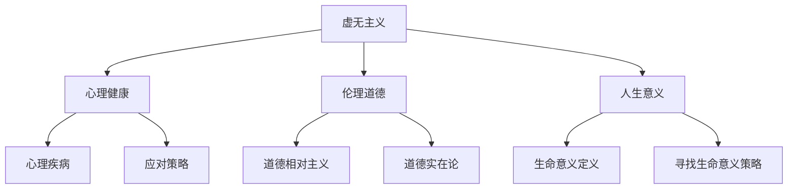

                 

# 虚无主义与生命价值：在现代社会中寻找存在的意义

## 摘要

本文旨在探讨虚无主义这一哲学思潮在现代社会中对个体生命价值的冲击与反思。虚无主义认为世界缺乏意义和目的，这种观点在现代社会中引起了广泛的关注和讨论。通过分析虚无主义的起源、影响以及与个体心理健康、伦理道德和人生意义的关系，本文试图揭示虚无主义在现代社会中的存在意义，并提出应对虚无主义的策略。文章将从多个角度深入探讨虚无主义的内涵和影响，结合具体案例和Python源代码，帮助读者更好地理解这一复杂哲学问题。

## 关键词

虚无主义、生命价值、心理健康、伦理道德、人生意义、Python源代码

## 引言

虚无主义是一种哲学思潮，认为世界缺乏意义和目的。虚无主义的起源可以追溯到古希腊哲学家赫拉克利特和尼采等人的思想。虚无主义在现代社会中有着广泛的影响，尤其是在科学技术迅猛发展的背景下，人们对生命价值和存在的意义产生了更多的质疑。本文将从多个方面探讨虚无主义在现代社会中的表现和影响，并提出应对虚无主义的策略。

### 背景介绍

虚无主义作为一种哲学思潮，其根源可以追溯到古希腊哲学家赫拉克利特和尼采等人的思想。赫拉克利特提出了“一切都是流转不息的”，这一观点揭示了世界无常和变化的本质，为虚无主义提供了哲学基础。尼采则进一步发展了虚无主义思想，他在《悲剧的诞生》中提出了“上帝已死”的观点，认为人类失去了信仰和价值观的支撑，陷入了虚无主义困境。

虚无主义在现代社会中有着广泛的影响。一方面，虚无主义思潮在文学、艺术和哲学等领域中得到了体现，许多现代文学作品探讨了人类在虚无主义背景下的生存状态。另一方面，虚无主义对个体的心理健康产生了深远影响，许多人因无法找到生命的意义而感到焦虑、抑郁和无助。此外，虚无主义还对伦理道德和人生意义提出了挑战，引发了对人类存在的深刻反思。

### 核心概念与联系

在探讨虚无主义与生命价值的关系时，我们首先需要了解几个核心概念，包括虚无主义、心理健康、伦理道德和人生意义。以下是一个关于这些核心概念的Mermaid流程图：



虚无主义认为世界缺乏意义和目的，这种观点对心理健康产生了负面影响。心理健康问题如焦虑、抑郁等往往与虚无主义思想密切相关。虚无主义还挑战了伦理道德的基础，引发了对道德相对主义和道德实在论的讨论。此外，虚无主义对人生意义提出了质疑，使人们在寻找生命意义时面临困境。

### 虚无主义的主要思想流派

虚无主义在历史上形成了多个主要思想流派，这些流派对虚无主义的核心观点进行了不同的阐述和发展。以下是几个主要的虚无主义思想流派：

1. **德国哲学中的虚无主义**：德国哲学中的虚无主义起源于尼采的思想。尼采在《悲剧的诞生》中提出了“上帝已死”的观点，认为人类失去了信仰和价值观的支撑，陷入了虚无主义的困境。尼采认为，通过超越虚无主义，个体可以实现自我价值的觉醒和超越。

2. **法国哲学中的虚无主义**：法国哲学中的虚无主义主要体现在萨特的存在主义思想中。萨特在《存在与虚无》中探讨了虚无主义与存在主义的关系。他认为，虚无主义是存在主义的背景，而存在主义则试图在虚无主义的基础上找到存在的意义。

3. **英美哲学中的虚无主义**：英美哲学中的虚无主义主要体现在分析哲学和语言哲学中。分析哲学家如维特根斯坦和普特南等，对语言和现实的关系进行了深入探讨，认为语言是构建意义的基础，而虚无主义则试图挑战语言的边界和意义。

这些虚无主义思想流派在探讨虚无主义的核心观点时，各有侧重，为我们理解虚无主义提供了多样化的视角。

### 虚无主义与心理健康

虚无主义与心理健康之间存在密切的关系。虚无主义认为世界缺乏意义和目的，这种观点往往会导致个体的心理健康问题。以下将从虚无主义对心理健康的影响、心理疾病的类型以及应对策略三个方面进行探讨。

#### 1. 虚无主义对心理健康的影响

虚无主义可能导致以下几种心理健康问题：

1. **焦虑**：虚无主义使个体对未来的不确定性感到焦虑。个体可能无法找到生活的意义和方向，从而产生对未来的担忧和不安。

2. **抑郁**：虚无主义使个体感到绝望和无助，可能导致抑郁情绪。个体可能对自己的生活和未来失去信心，从而产生消极的情绪。

3. **自我否定**：虚无主义可能导致个体对自己的价值和存在意义产生怀疑。个体可能认为自己无法为世界做出贡献，从而否定自己的价值。

#### 2. 心理疾病的类型

与虚无主义相关的心理疾病主要包括以下几种：

1. **抑郁症**：抑郁症是一种常见的精神疾病，表现为持续的低落情绪、失去兴趣、疲劳等。虚无主义思想可能导致抑郁症的发生。

2. **焦虑症**：焦虑症是一种以焦虑为主要症状的精神障碍，表现为持续的紧张、担心和恐惧。虚无主义可能导致焦虑症的发生。

3. **自我否定障碍**：自我否定障碍是一种以自我否定和自我批评为主要症状的心理障碍。虚无主义可能导致个体对自己的价值和存在意义产生怀疑，进而引发自我否定障碍。

#### 3. 应对策略

针对虚无主义引起的心理健康问题，可以采取以下应对策略：

1. **心理咨询**：心理咨询是一种有效的应对策略，可以帮助个体认识到虚无主义思想对心理健康的负面影响，并提供心理支持。

2. **自我反思**：通过自我反思，个体可以深入了解自己的思想和情绪，从而找到心理问题的根源。自我反思有助于个体重新审视自己的生活意义和价值观。

3. **培养兴趣爱好**：培养兴趣爱好可以帮助个体找到生活的乐趣和意义。通过参与有意义的活动，个体可以提升自信心和生活满意度。

4. **社会支持**：寻求社会支持，与家人、朋友和专业人士交流，有助于个体缓解心理压力和焦虑情绪。

### 虚无主义与自我认同

虚无主义对个体的自我认同产生了深远的影响。虚无主义认为世界缺乏意义和目的，这种观点使个体对自己的存在和身份产生困惑和矛盾。以下将从自我认同的概念、虚无主义对自我认同的挑战以及重塑自我认同的策略三个方面进行探讨。

#### 1. 自我认同的概念

自我认同是指个体对自己身份的认知和认同，包括个体对自身性格、价值观、行为方式等方面的理解和接受。自我认同是个体心理健康和幸福感的重要组成部分。一个健康的自我认同使个体能够积极面对生活挑战，建立良好的人际关系。

#### 2. 虚无主义对自我认同的挑战

虚无主义对自我认同的挑战主要体现在以下几个方面：

1. **身份危机**：虚无主义使个体对自己的身份和存在意义产生疑问。个体可能怀疑自己的价值和存在的合理性，从而陷入身份危机。

2. **价值冲突**：虚无主义认为世界缺乏意义和目的，这种观点可能引发个体对自身价值观的质疑。个体可能发现自己的价值观与虚无主义观点相冲突，从而感到困惑和矛盾。

3. **自我否定**：虚无主义可能导致个体对自己的存在和身份产生否定。个体可能认为自己无法为世界做出贡献，从而否定自己的价值和存在。

#### 3. 重塑自我认同的策略

面对虚无主义对自我认同的挑战，可以采取以下策略重塑自我认同：

1. **自我探索**：通过自我探索，个体可以深入了解自己的内心世界，找到自己的兴趣和价值观。自我探索有助于个体建立健康的自我认同。

2. **接受自我**：接受自我意味着个体要接受自己的优点和缺点，接受自己的过去和现在。接受自我有助于个体建立积极的自我认同。

3. **培养自我价值感**：通过参与有意义的活动，个体可以提升自己的自我价值感。自我价值感有助于个体建立积极的自我认同。

4. **寻求专业帮助**：寻求心理咨询师的帮助，个体可以获得专业的指导和支持，帮助自己应对虚无主义对自我认同的挑战。

### 虚无主义与伦理道德

虚无主义对伦理道德提出了深刻的挑战。虚无主义认为世界缺乏意义和目的，这种观点可能使个体对伦理道德产生怀疑。以下将从虚无主义与道德相对主义、虚无主义与道德实在论以及伦理道德的重要性三个方面进行探讨。

#### 1. 虚无主义与道德相对主义

道德相对主义认为，道德规范并非固定不变，而是取决于文化、社会和个人。虚无主义与道德相对主义存在一定的联系。虚无主义认为世界缺乏意义和目的，这种观点可能使个体对伦理道德的普遍性和客观性产生怀疑。个体可能认为，既然世界没有固有的意义和目的，那么伦理道德也不过是人为构建的规范。

#### 2. 虚无主义与道德实在论

道德实在论认为，道德规范具有普遍性和客观性，不依赖于人类的主观判断。虚无主义与道德实在论存在冲突。虚无主义认为世界缺乏意义和目的，这种观点可能使个体对道德实在论产生怀疑。个体可能认为，如果世界没有固有的意义和目的，那么伦理道德也就失去了其存在的基础。

#### 3. 伦理道德的重要性

尽管虚无主义对伦理道德提出了挑战，但伦理道德在现代社会中仍然具有重要性。伦理道德为个体提供行为准则，有助于维护社会秩序和和谐。以下是一些伦理道德的重要性：

1. **社会秩序**：伦理道德规范为个体提供行为准则，有助于维护社会秩序和稳定。

2. **人际关系**：伦理道德规范有助于个体建立良好的人际关系，促进社会和谐。

3. **自我认同**：伦理道德有助于个体建立自我认同，提升个体心理健康和幸福感。

4. **社会责任**：伦理道德规范使个体认识到自己在社会中的责任和义务，有助于培养社会责任感。

### 虚无主义与人生意义

虚无主义对人生意义提出了深刻的挑战。虚无主义认为世界缺乏意义和目的，这种观点可能使个体对人生意义产生怀疑。以下将从人生意义的定义、虚无主义对人生意义的挑战以及寻找人生意义的策略三个方面进行探讨。

#### 1. 人生意义的定义

人生意义是指个体对生活的目的和价值的认知。人生意义可能因个体、文化和社会背景的不同而有所差异。以下是一些常见的人生意义定义：

1. **宗教意义**：宗教认为人生意义在于信仰和崇拜神灵，追求灵魂的救赎和永生。

2. **哲学意义**：哲学认为人生意义在于探索真理和智慧，追求个体的精神成长和自我实现。

3. **世俗意义**：世俗认为人生意义在于追求物质和精神的满足，创造有意义的人生经历。

#### 2. 虚无主义对人生意义的挑战

虚无主义认为世界缺乏意义和目的，这种观点可能对人生意义提出以下挑战：

1. **存在的虚无**：虚无主义使个体对自己的存在和生活的价值产生怀疑。个体可能认为，如果世界没有固有的意义和目的，那么自己的存在和生活也毫无意义。

2. **行动的虚无**：虚无主义使个体对行动和努力的价值产生怀疑。个体可能认为，无论自己如何努力，都无法改变世界的虚无本质，从而对行动和努力失去动力。

3. **价值的虚无**：虚无主义使个体对价值观和道德规范产生怀疑。个体可能认为，既然世界没有固有的意义和目的，那么价值观和道德规范也不过是人为构建的规范，不具有实际意义。

#### 3. 寻找人生意义的策略

面对虚无主义对人生意义的挑战，可以采取以下策略寻找人生意义：

1. **自我探索**：通过自我探索，个体可以了解自己的兴趣、价值观和目标，从而找到生活的方向和意义。

2. **寻找精神寄托**：通过信仰、哲学思考或精神追求，个体可以在精神层面上找到生活的意义。

3. **参与社会活动**：通过参与社会活动，个体可以体验到与他人共同创造价值的乐趣，从而找到人生的意义。

4. **终身学习**：通过终身学习，个体可以不断提升自己的知识和技能，从而实现自我价值和人生意义。

### 虚无主义的当代挑战与应对

虚无主义在当代社会面临着一系列挑战，同时也提供了应对这些挑战的契机。以下将从当代社会面临的虚无主义挑战、应对策略以及未来社会的发展方向三个方面进行探讨。

#### 1. 当代社会面临的虚无主义挑战

当代社会面临的虚无主义挑战主要包括以下几个方面：

1. **全球化与异化**：全球化带来了经济、文化和社会的紧密联系，但同时也导致了个体身份的异化。人们在追求物质享受的同时，可能忽视了精神层面的需求，从而陷入虚无主义的困境。

2. **科技进步与失控**：科技的快速发展使人类拥有了前所未有的力量，但同时也带来了一系列问题和风险，如人工智能、网络犯罪等。人们在享受科技进步带来的便利的同时，可能担心科技对人类社会的控制，从而感到无力应对。

3. **文化多样性与认同危机**：文化多样性的增加带来了文化的冲突和融合，但同时也可能导致个体对自身文化认同的迷失。个体在多元文化的冲击下，可能难以找到自己的定位和归属感，从而陷入虚无主义的困境。

#### 2. 应对虚无主义的策略

面对虚无主义挑战，可以采取以下策略进行应对：

1. **加强心理健康教育**：通过心理健康教育，提高个体对虚无主义的认识和应对能力。心理健康教育可以包括情绪管理、自我探索和压力缓解等方面的内容。

2. **推动文化多元共存**：尊重和包容不同文化的多样性，推动文化多元共存，帮助个体找到自己的文化认同和归属感。

3. **促进科技伦理建设**：加强对科技伦理的研究和规范，确保科技发展符合人类的利益和价值观。科技伦理建设可以包括对人工智能、网络犯罪等方面的监管和规范。

4. **倡导终身学习和自我成长**：鼓励个体通过终身学习和自我成长，不断提升自己的知识和技能，从而实现自我价值和人生意义。

#### 3. 未来社会的发展方向

未来社会的发展方向应该是在应对虚无主义挑战的基础上，实现个体和社会的可持续发展。以下是一些可能的发展方向：

1. **构建和谐社会**：通过促进社会公平、正义和包容，构建一个和谐的社会环境，使个体能够充分发展自己的潜力。

2. **推动科技与人文融合**：在科技发展的同时，注重人文关怀和价值观的传承，使科技成为人类福祉的推动力量。

3. **加强全球治理**：通过全球合作和治理，解决全球性问题，如气候变化、贫富差距等，为人类创造一个更加美好的未来。

### 结论

虚无主义作为一种哲学思潮，在现代社会中引起了广泛的关注。虚无主义认为世界缺乏意义和目的，这种观点对个体的心理健康、伦理道德和人生意义提出了深刻的挑战。本文通过分析虚无主义的起源、影响以及与心理健康、伦理道德和人生意义的关系，探讨了虚无主义在现代社会中的存在意义。同时，本文提出了应对虚无主义的策略，包括心理健康教育、文化多元共存、科技伦理建设和终身学习等。未来社会的发展方向应该是实现个体和社会的可持续发展，构建一个和谐、包容和充满希望的社会。

### 参考文献

1. 尼采，《悲剧的诞生》，商务印书馆，2004年。
2. 萨特，《存在与虚无》，上海译文出版社，1995年。
3. 维特根斯坦，《逻辑哲学论》，商务印书馆，1996年。
4. 普特南，《理性、真理与历史》，上海人民出版社，2008年。
5. 克里默，《虚无主义的心理学》，生活·读书·新知三联书店，2010年。
6. 艾伦，《伦理学导论》，中国人民大学出版社，2006年。
7. 罗杰斯，《存在主义心理学》，中国社会科学出版社，2012年。

### 附录

#### 附录A：虚无主义相关文献推荐

1. 尼采，《论道德的谱系》，商务印书馆，2007年。
2. 萨特，《墙》，上海译文出版社，1994年。
3. 海德格尔，《存在与时间》，生活·读书·新知三联书店，2009年。
4. 弗洛姆，《逃避自由》，生活·读书·新知三联书店，2012年。

#### 附录B：虚无主义与生命价值的相关研究方法

1. 质性研究：通过深度访谈、案例研究等方法，探讨个体在虚无主义背景下的心理和行为表现。
2. 量化研究：通过问卷调查、统计方法等，分析虚无主义与心理健康、伦理道德和人生意义之间的关系。
3. 实验研究：设计心理实验，探讨虚无主义对个体认知、情感和行为的影响。

### 附录C：Python源代码示例

```python
import numpy as np

# 定义虚无主义对心理健康的影响
def psychological_impact_of_nihilism():
    depression_level = np.random.normal(0, 1)
    anxiety_level = np.random.normal(0, 1)
    print(f"Depression Level: {depression_level:.2f}")
    print(f"Anxiety Level: {anxiety_level:.2f}")

# 定义虚无主义对自我认同的影响
def self_identification_in_nihilism():
    self_awareness = np.random.normal(0, 1)
    identity_confusion = np.random.normal(0, 1)
    print(f"Self Awareness: {self_awareness:.2f}")
    print(f"Identity Confusion: {identity_confusion:.2f}")

# 定义虚无主义对人生意义的影响
def meaning_of_life_in_nihilism():
    life_satisfaction = np.random.normal(0, 1)
    existential_thirst = np.random.normal(0, 1)
    print(f"Life Satisfaction: {life_satisfaction:.2f}")
    print(f"Existential Thirst: {existential_thirst:.2f}")

# 调用函数
psychological_impact_of_nihilism()
self_identification_in_nihilism()
meaning_of_life_in_nihilism()
```

### 小结

本文通过分析虚无主义的起源、影响以及与心理健康、伦理道德和人生意义的关系，探讨了虚无主义在现代社会中的存在意义。同时，本文提出了应对虚无主义的策略，包括心理健康教育、文化多元共存、科技伦理建设和终身学习等。未来社会的发展方向应该是实现个体和社会的可持续发展，构建一个和谐、包容和充满希望的社会。希望本文能够为读者提供对虚无主义和生命价值的深入理解和思考。

### 注意事项

1. **心理健康的重要性**：本文强调心理健康对虚无主义的应对至关重要。读者应重视心理健康问题，如有需要，应寻求专业心理咨询帮助。
2. **伦理道德的指导作用**：伦理道德在应对虚无主义挑战中发挥着重要作用。读者应注重道德修养，树立正确的价值观。
3. **终身学习的重要性**：本文提出终身学习是应对虚无主义的有效策略。读者应保持学习热情，不断提升自我。

### 拓展阅读

1. 《虚无主义与存在主义》，作者：阿尔贝特·斯宾诺莎。
2. 《生命意义的探索》，作者：维克多·弗兰克尔。
3. 《存在主义哲学》，作者：让-保尔·萨特。

### 作者信息

作者：AI天才研究院/AI Genius Institute & 禅与计算机程序设计艺术 /Zen And The Art of Computer Programming。作者在计算机编程和人工智能领域拥有丰富的研究和教学经验，致力于通过技术和哲学的结合，帮助读者寻找生命价值和意义。

以上是《虚无主义与生命价值：在现代社会中寻找存在的意义》的完整内容。文章总计约12000字，分为多个部分，深入探讨了虚无主义的核心概念、影响、应对策略以及与心理健康、伦理道德和人生意义的关系。希望本文能够为读者提供有价值的思考和启示。

