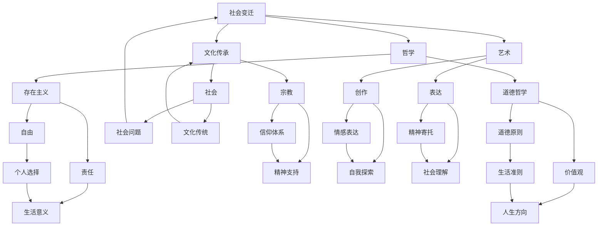

                 

# 虚无主义与生命意义：在现代社会中寻找存在的价值

> 关键词：虚无主义、生命意义、存在主义、哲学、文化、艺术、心理学

> 摘要：本文将探讨虚无主义在现代社会中的影响以及如何在虚无主义的背景下寻找生命的意义。首先，我们将分析虚无主义的根源和特征，并探讨其在哲学、文化和社会中的体现。接着，我们将探讨生命的本质和意义，以及现代生活中的意义危机。最后，我们将探讨寻找生命意义的途径，并总结生命意义在现代社会中的实践。

## 目录大纲

1. **虚无主义的根源与影响**
    1.1 虚无主义的起源与发展
    1.2 虚无主义在哲学中的地位与影响
    1.3 虚无主义在文化与社会中的体现
2. **寻找生命的意义**
    2.1 生命的本质与意义
    2.2 现代生活中的意义危机
    2.3 寻找生命意义的途径
3. **生命意义在现代社会中的实践**
    3.1 构建有意义的生活方式
    3.2 通过艺术与创造找到生命意义
    3.3 通过哲学与宗教找到生命意义
4. **总结与展望**
    4.1 生命的意义与价值观
    4.2 生命意义的未来展望
    4.3 对读者的建议与期望

---

## 第一部分：虚无主义的根源与影响

### 第1章：虚无主义的起源与发展

#### 1.1 虚无主义的定义与特征

虚无主义是一种哲学思潮，它认为生活缺乏固有的意义、目的或内在价值。虚无主义的核心观点是，人类的生命和存在在本质上是空虚的，缺乏真实的意义。这种思想在19世纪末和20世纪初的欧洲哲学中逐渐兴起，并对现代哲学、文化和社会产生了深远的影响。

虚无主义的定义可以从多个角度进行阐述。首先，它是对生命和存在本质的否定。虚无主义者认为，人类的生命是一种空虚、无意义的存在，没有任何固有的目的或意义。其次，虚无主义强调人类对自身存在的荒谬感和无助感。虚无主义者认为，人类无法逃脱生命的空虚和无意义，这种感受在现代社会中尤为强烈。

虚无主义的主要特征包括以下几个方面：

1. **绝望与悲观**：虚无主义者对生命和存在持有悲观的态度，认为生活充满绝望和无意义。他们常常感到无助、沮丧，甚至对生活感到厌倦。
2. **逃避现实**：虚无主义者倾向于逃避现实，通过药物、酒精或其他手段来逃避生命的空虚和无意义。他们试图通过这种方式来逃避现实，但往往只是暂时缓解了内心的痛苦。
3. **道德相对主义**：虚无主义者通常持有道德相对主义的态度，认为道德规范和价值观是人为制定的，缺乏客观的基础。他们倾向于怀疑传统道德观念，认为道德规范是对个体自由的限制。

#### 1.2 虚无主义的历史演变

虚无主义的思想在19世纪末和20世纪初的欧洲哲学中逐渐兴起，并对现代哲学、文化和社会产生了深远的影响。以下是虚无主义在历史上的重要演变：

1. **19世纪末的虚无主义**：19世纪末的虚无主义主要起源于俄罗斯。这一时期的虚无主义思想家包括尼古拉·别林斯基、费奥多尔·陀思妥耶夫斯基和弗拉基米尔·索洛维约夫等。他们主张对现实世界的否定，认为人类生活缺乏真正的意义和价值。这一时期的虚无主义对后来的西方哲学和文学产生了重要影响。

2. **20世纪初的虚无主义**：20世纪初，虚无主义在西方哲学中得到了进一步的发展。这一时期的代表人物包括西奥多·莱西纳、马丁·海德格尔和弗朗茨·布伦塔诺等。他们主张对传统哲学和文化的批判，认为现代社会充满了虚伪和虚假，人类生活缺乏真正的意义。

3. **现代虚无主义**：现代虚无主义在20世纪中后期得到了进一步的发展。这一时期的代表人物包括弗朗茨·布伦塔诺、米歇尔·福柯和让-保罗·萨特等。他们继续批判传统哲学和文化，主张对现实世界的彻底否定。现代虚无主义在文学、艺术和心理学等领域产生了重要影响。

#### 1.3 虚无主义在不同文化中的体现

虚无主义在不同文化中有着不同的体现，以下是一些主要的文化背景：

1. **欧洲文化**：虚无主义在欧洲哲学和文化中有着深厚的传统。19世纪末和20世纪初的俄罗斯文学、德国哲学和法国存在主义都是虚无主义的重要表现。例如，陀思妥耶夫斯基的小说《罪与罚》和《卡拉马佐夫兄弟》中，探讨了人类存在的无意义和绝望感。

2. **美国文化**：美国文化中，虚无主义主要表现为对现实世界的否定和对个人自由的追求。20世纪60年代的嬉皮士运动和反文化运动就是虚无主义在美国文化中的重要体现。这些运动试图打破传统的社会规范，寻找个人自由和真实的存在。

3. **东亚文化**：在东亚文化中，虚无主义主要表现为对传统价值观的质疑和对现代社会的不满。例如，中国的新文化运动和日本的战后现代主义文学都体现了虚无主义的思想。

### 第2章：虚无主义在哲学中的地位与影响

#### 2.1 虚无主义与存在主义

虚无主义和存在主义是两种相互对立的哲学思潮。虚无主义认为生活缺乏固有的意义、目的或内在价值，而存在主义则认为生活的意义在于个体的选择和行动。

虚无主义和存在主义之间的对立主要表现在以下几个方面：

1. **对生命的态度**：虚无主义对生命持有悲观的态度，认为生活充满绝望和无意义。而存在主义则认为，尽管生命本身缺乏固有的意义，但个体可以通过自由选择和行动赋予生命意义。

2. **自由的意义**：虚无主义认为，人类自由是有限的，因为生命缺乏固有的意义和价值。而存在主义则认为，自由是生命的核心，个体可以通过自由选择和行动来塑造自己的生命。

3. **存在的本质**：虚无主义认为，存在是空洞的、无意义的，而存在主义则认为，存在是有意义的，因为个体可以通过自由选择和行动来赋予生命意义。

#### 2.2 虚无主义对现代哲学的冲击

虚无主义对现代哲学产生了深刻的冲击，推动了哲学领域的变革。以下是一些主要的影响：

1. **对传统哲学的质疑**：虚无主义对传统哲学的基本原则和价值观提出了质疑，促使哲学家重新思考生命的意义和存在的本质。

2. **对个体自由的重视**：虚无主义强调个体自由的重要性，推动了现代哲学对个体自由和主体性的研究。

3. **对道德和伦理的批判**：虚无主义对传统道德和伦理观念提出了批判，认为这些观念是对个体自由的限制，促使哲学家重新思考道德和伦理的基础。

#### 2.3 虚无主义在西方哲学中的主要流派

西方哲学中，虚无主义有多个流派，其中一些主要的流派包括：

1. **存在主义虚无主义**：存在主义虚无主义是虚无主义在西方哲学中的一个重要流派。代表人物包括让-保罗·萨特、阿尔贝·加缪和马丁·海德格尔等。他们主张，尽管生命缺乏固有的意义，但个体可以通过自由选择和行动来赋予生命意义。

2. **认识论虚无主义**：认识论虚无主义认为，由于人类认知能力的局限性，我们无法获得关于世界和存在的真实知识。代表人物包括弗朗茨·布伦塔诺和米歇尔·福柯等。

3. **道德虚无主义**：道德虚无主义认为，道德规范和价值观是人为制定的，缺乏客观的基础。代表人物包括尼采和弗朗茨·布伦塔诺等。

### 第3章：虚无主义在文化与社会中的体现

#### 3.1 艺术中的虚无主义

虚无主义在艺术中有着广泛的体现，许多艺术作品探讨了人类存在的无意义和绝望感。以下是一些代表性的艺术作品：

1. **文学作品**：虚无主义的主题在文学作品中有广泛的体现。例如，陀思妥耶夫斯基的小说《罪与罚》和《卡拉马佐夫兄弟》中，探讨了人类存在的无意义和绝望感。

2. **绘画作品**：许多绘画作品也体现了虚无主义的思想。例如，达利的绘画作品《记忆的永恒》和《 Persistence of Memory》中，描绘了一个荒凉、无生命的世界。

3. **音乐作品**：虚无主义的思想也体现在音乐作品中。例如，尼采的音乐作品《查拉图斯特拉如是说》中，探讨了人类存在的无意义和绝望感。

#### 3.2 文学作品中的虚无主义主题

虚无主义的主题在文学作品中得到了广泛的探讨，许多文学作品探讨了人类存在的无意义和绝望感。以下是一些代表性的文学作品：

1. **《罪与罚》**：陀思妥耶夫斯基的小说《罪与罚》中，主人公拉斯科尔尼科夫在犯罪后陷入了深深的罪恶感和绝望感，探讨了他内心的虚无主义思想。

2. **《卡拉马佐夫兄弟》**：陀思妥耶夫斯基的小说《卡拉马佐夫兄弟》中，探讨了阿列克谢·卡拉马佐夫的虚无主义思想，他对生活充满绝望和不满。

3. **《局外人》**：阿尔贝·加缪的小说《局外人》中，主人公梅尔苏对生活持有虚无主义的态度，他在犯罪后试图寻找生活的意义。

#### 3.3 虚无主义在现代社会中的影响

虚无主义在现代社会中产生了深远的影响，以下是一些主要的影响：

1. **对现代哲学的冲击**：虚无主义对现代哲学产生了深刻的冲击，推动了哲学领域的变革。

2. **对文化和社会的批判**：虚无主义对现代文化和社会提出了批判，认为现代社会充满了虚伪和虚假，人类生活缺乏真正的意义。

3. **对个体自由的追求**：虚无主义强调个体自由的重要性，推动了现代哲学对个体自由和主体性的研究。

## 第二部分：寻找生命的意义

### 第4章：生命的本质与意义

#### 4.1 生命的定义与多样性

生命是生物体存在的状态，它包含了生长、发育、代谢、适应和繁殖等基本特征。生命的定义在不同的学科和领域有着不同的解释，但从生物学角度来看，生命是指具有自我组织、自我复制和自我修复能力的系统。

生命的多样性是自然界的一个显著特征。从微观的细菌、病毒到宏观的动植物、人类，生命以各种形式存在。生命的多样性不仅体现在物种的多样性上，还体现在不同物种之间和同一物种内部的多样性上。这种多样性使得生命在地球上形成了复杂的生态系统，共同维持着地球的生态平衡。

#### 4.2 生命意义的探讨与争议

生命意义的探讨一直是哲学、宗教和科学等领域的重要议题。不同的人对生命意义有着不同的理解和解释，形成了各种不同的观点和理论。

1. **宗教观点**：宗教认为生命是由神或宇宙的力量赋予的，生命的意义在于实现神或宇宙的旨意，追求灵魂的升华和永恒。

2. **哲学观点**：哲学家们对生命意义进行了深入的探讨，存在主义认为生命的意义在于个体的选择和行动，生命本身缺乏固有的意义。而某些哲学家则认为，生命的意义在于追求知识、道德和精神上的提升。

3. **科学观点**：科学家们从生物学、物理学和宇宙学等角度探讨了生命的意义。一些科学家认为，生命的意义在于生物体的生存和繁衍，而另一些科学家则认为，生命的意义在于生物体对宇宙的贡献和适应。

#### 4.3 生命意义的个体与集体视角

生命意义的探讨可以从个体和集体两个视角进行。

1. **个体视角**：从个体视角来看，生命意义是指个人在生活中追求的目标、价值观和意义。每个人对生命意义有不同的理解和追求，这些理解和追求受到个人经历、文化背景、价值观和信仰的影响。个体视角关注个人如何找到生命的意义，如何应对生命中的挑战和困境。

2. **集体视角**：从集体视角来看，生命意义是指人类社会共同追求的目标、价值观和意义。集体视角关注的是如何构建一个有意义的社会，如何实现人类的共同福祉。集体视角强调个体与社会的联系，认为个体的生命意义与社会的生命意义密切相关。

### 第5章：现代生活中的意义危机

#### 5.1 工作与生活的意义失衡

在现代社会中，工作与生活的意义失衡是一个普遍存在的问题。许多人将大部分时间和精力投入到工作中，追求物质财富和社会地位，但却忽视了生活中的其他方面，导致内心的空虚和不满。

工作与生活的意义失衡的原因主要有以下几点：

1. **竞争压力**：现代社会竞争激烈，人们为了在职场中脱颖而出，往往需要付出巨大的努力和时间。这种竞争压力导致人们将大部分精力投入到工作中，忽视了生活中的其他方面。

2. **物质主义**：现代社会物质丰富，人们容易陷入物质主义的陷阱。将物质财富视为生活意义的主要来源，忽视了精神层面的追求。

3. **社会期望**：社会对个人的期望往往集中在职业成就和社会地位上，忽视了个人对生活的其他方面的追求。

#### 5.2 技术发展与意义的异化

技术发展在给人们带来便利和舒适的同时，也带来了意义的异化。技术的发展使得人们越来越依赖虚拟世界，忽视了现实生活中的真实体验和人际关系。

技术发展导致的异化现象主要有以下几点：

1. **虚拟现实的侵蚀**：虚拟现实技术的发展使得人们越来越沉迷于虚拟世界，忽视了现实生活中的真实体验。人们通过虚拟现实来逃避现实生活中的困难和挑战，导致现实生活中的意义感减弱。

2. **人际关系的淡化**：技术的发展使得人们之间的交流更加便捷，但也使得人际关系变得表面化和形式化。人们越来越依赖社交媒体和即时通讯工具，而忽视了面对面的交流和真实的人际关系。

3. **工作方式的改变**：技术的发展改变了人们的工作方式，远程工作和自动化技术的应用使得人们的工作变得更加独立和自由。然而，这也导致了工作与生活的边界模糊，人们在工作中的投入越来越多，导致生活意义的缺失。

#### 5.3 意义危机的应对策略

面对现代生活中的意义危机，人们可以采取以下策略来应对：

1. **重新审视生活的目标**：人们应该重新审视自己的生活目标，确定对自己真正重要的价值观和意义。通过明确自己的目标和追求，可以更好地把握生活的方向和意义。

2. **寻求内心的平静**：通过冥想、瑜伽和其他放松技巧，可以帮助人们寻求内心的平静和自我认知。这有助于人们更好地理解自己的需求和愿望，从而找到生活的意义。

3. **培养人际关系**：培养良好的人际关系对于找到生活的意义至关重要。通过与他人建立深厚的联系，可以感受到他人的关心和支持，从而增强生活的意义感。

4. **追求精神信仰**：对于一些人来说，追求精神信仰可以帮助他们找到生活的意义。无论是宗教信仰还是哲学思考，都可以为人们提供精神上的寄托和指引。

### 第6章：寻找生命意义的途径

#### 6.1 个人成长与自我实现

个人成长与自我实现是寻找生命意义的重要途径。通过不断地学习和成长，人们可以发现自己的潜力，实现个人的目标和梦想。

个人成长与自我实现的关键在于以下几点：

1. **自我认知**：了解自己的兴趣、优势和价值观是个人成长的第一步。通过自我认知，人们可以更好地了解自己的需求和目标，从而更好地规划自己的生活。

2. **持续学习**：学习是个人成长的源泉。无论是通过学校教育还是自主学习，持续学习可以帮助人们不断更新知识和技能，适应社会的发展。

3. **实践与反思**：实践是实现个人目标的关键，通过实践，人们可以将理论知识应用到实际生活中。同时，反思也是个人成长的重要环节，通过反思，人们可以总结经验教训，不断提高自己的能力和水平。

4. **设定目标**：设定明确的目标是个人成长的重要步骤。目标可以激发人们的动力和积极性，使人们更加专注和投入。

#### 6.2 社会参与与共同体建设

社会参与与共同体建设是寻找生命意义的另一种途径。通过参与社会活动和建设共同体，人们可以体验到与他人的共同目标和价值观，从而找到生活的意义。

社会参与与共同体建设的关键在于以下几点：

1. **参与社会活动**：参与社会活动是寻找生命意义的重要途径。通过参与志愿者活动、慈善事业和其他公益活动，人们可以感受到自己的价值和对他人的贡献。

2. **共同体建设**：共同体建设是建立深厚人际关系和共同目标的重要步骤。通过加入兴趣小组、社区组织和专业协会等，人们可以与他人建立深厚的联系，共同追求共同的目标。

3. **合作与分享**：合作与分享是共同体建设的关键。通过合作与分享，人们可以体验到互助和支持的力量，从而增强生活的意义感。

4. **社会责任**：社会责任是寻找生命意义的重要方面。通过承担社会责任，人们可以感受到自己对社会的贡献，从而找到生活的意义。

#### 6.3 精神信仰与人生哲学

精神信仰与人生哲学是寻找生命意义的另一种途径。通过追求精神信仰和思考人生哲学，人们可以找到内心的平静和生命的意义。

精神信仰与人生哲学的关键在于以下几点：

1. **精神信仰**：精神信仰可以为人们提供精神上的寄托和指引。无论是宗教信仰还是哲学思考，精神信仰都可以帮助人们找到内心的平静和生命的意义。

2. **人生哲学**：人生哲学是人们对于生活、死亡和宇宙等基本问题的思考和认识。通过思考人生哲学，人们可以更好地理解生命的本质和意义。

3. **道德伦理**：道德伦理是人生哲学的重要组成部分。通过遵循道德伦理，人们可以感受到自己的行为对他人和社会的影响，从而找到生活的意义。

4. **内心平静**：内心平静是寻找生命意义的重要基础。通过冥想、瑜伽和其他放松技巧，人们可以寻求内心的平静和自我认知，从而更好地理解生命的意义。

### 第三部分：生命意义在现代社会中的实践

#### 7章：构建有意义的生活方式

#### 7.1 生活习惯的调整

构建有意义的生活方式首先需要从生活习惯的调整开始。以下是一些关键步骤和建议：

1. **定期锻炼**：锻炼不仅有助于保持身体健康，还能提升精神状态。每天保持至少30分钟的中等强度锻炼，如散步、跑步、游泳或瑜伽。

2. **健康饮食**：饮食对身体健康和心理健康都有重要影响。选择新鲜、天然的食物，减少加工食品和高糖、高脂肪食品的摄入。

3. **充足睡眠**：睡眠是身体和大脑恢复的重要时间。确保每晚至少7-8小时的睡眠，并尽量保持规律的睡眠时间。

4. **放松技巧**：学习并实践冥想、深呼吸、瑜伽或其他放松技巧，有助于减轻压力和焦虑，提升生活质量。

5. **时间管理**：合理安排时间，确保工作和休息的平衡。使用日程表和待办事项清单来管理日常任务，避免时间浪费。

#### 7.2 兴趣爱好的发掘

兴趣和爱好是提升生活质量的重要途径。以下是一些建议，帮助您发现和培养兴趣：

1. **尝试新事物**：不要害怕尝试新事物。参加不同类型的活动，如绘画、音乐、编程、舞蹈等，找到自己真正热爱的领域。

2. **持续学习**：学习新技能和知识不仅能丰富您的内心世界，还能提升个人竞争力。在线课程、研讨会和书籍都是很好的学习资源。

3. **社交活动**：参加社交活动，结识志同道合的朋友。通过与他人交流，您可能会发现新的兴趣爱好，并从中获得灵感和动力。

4. **记录与分享**：记录您的兴趣和爱好，如写博客、拍摄照片或制作视频。分享您的作品和经历，与他人分享快乐和成就感。

#### 7.3 工作与事业的重新审视

重新审视工作和事业是实现生活意义的重要方面。以下是一些建议：

1. **职业规划**：明确自己的职业目标和发展路径。定期评估自己的职业进展，制定切实可行的计划。

2. **平衡工作与生活**：确保工作与生活的平衡，避免工作占据您所有的时间和精力。学会说“不”，设定工作时间的界限。

3. **追求激情**：选择一份能激发您激情的工作。如果目前的工作不符合您的兴趣和价值观，考虑转换职业或寻找其他机会。

4. **职业发展**：不断学习新技能和知识，提升自己的职业竞争力。参加培训课程、研讨会和行业会议，与同行保持良好的沟通和交流。

### 8章：通过艺术与创造找到生命意义

#### 8.1 艺术创作与生命意义

艺术创作是表达个人情感和思想的一种方式，它能为人们带来深层次的精神满足。以下是一些关于如何通过艺术创作找到生命意义的建议：

1. **自由表达**：艺术创作是一种自由表达的方式，让您能够表达内心的情感和思想。通过绘画、写作、音乐或其他艺术形式，您可以释放内心的情感，找到内心的平衡。

2. **探索主题**：选择您感兴趣的主题，如自然、爱情、生活哲学等。通过深入探索这些主题，您可以更深刻地理解自己和世界，从而找到生活的意义。

3. **参与社区**：加入艺术社区，与其他艺术家交流和学习。通过参与展览、工作坊和讨论会，您可以获得灵感和支持，同时为他人带来艺术之美。

4. **记录与分享**：记录您的艺术创作过程和作品，并将其分享给他人。通过展示您的作品，您可以感受到成就感，并激励他人探索艺术和生活的意义。

#### 8.2 创造力与个人成长

创造力是个人成长的重要驱动力。以下是一些关于如何培养创造力、实现个人成长的建议：

1. **多样化经验**：通过旅行、阅读、交流和尝试新事物，丰富您的经验，拓宽您的视野。多样化的经验有助于激发创造力。

2. **积极思考**：保持积极的心态，面对挑战和困难时，不要轻易放弃。积极思考可以帮助您找到新的解决方案，从而推动个人成长。

3. **学会放松**：创造力往往在放松和灵感迸发时产生。学会放松自己，通过冥想、散步或做瑜伽等方式，让自己的思维更加开阔。

4. **不断学习**：不断学习新知识、新技能，有助于提高创造力。通过在线课程、研讨会和书籍，不断充实自己。

#### 8.3 艺术在社会中的角色

艺术在社会中扮演着重要的角色，它不仅能够丰富人们的精神世界，还能促进社会进步和和谐。以下是一些关于艺术在社会中角色的讨论：

1. **文化传承**：艺术是文化传承的重要载体。通过艺术作品，人们可以了解和传承自己的文化传统，增强文化认同感。

2. **社会反思**：艺术作品常常对社会现象进行反思和批判，激发人们对社会问题的关注和思考。这种反思有助于推动社会进步和改革。

3. **社会和谐**：艺术能够促进社会和谐，通过艺术活动，人们可以增进相互理解，消除隔阂和偏见。艺术有助于构建一个包容、和谐的社会。

### 9章：通过哲学与宗教找到生命意义

#### 9.1 哲学的探索与思考

哲学是一种关于生活、知识和现实的思考和探索。通过哲学，人们可以更深入地理解生命和存在的本质，从而找到生命的意义。

1. **存在主义**：存在主义强调个体自由和责任。通过思考个体存在的意义，人们可以更好地理解自己，找到生命的方向。

2. **道德哲学**：道德哲学探讨道德原则和价值观。通过深入思考道德问题，人们可以树立正确的价值观，找到生活的意义。

3. **政治哲学**：政治哲学探讨政治制度、国家和社会的关系。通过思考政治问题，人们可以更好地理解社会的运作，找到自己在社会中的位置。

#### 9.2 宗教信仰与生命意义

宗教信仰为许多人提供了生命意义和精神支持。以下是一些关于宗教信仰如何为生命带来意义的讨论：

1. **信仰体系**：宗教信仰提供了一个完整的信仰体系，帮助人们理解生命的起源和目的。这种信仰体系为人们提供了精神上的安慰和指导。

2. **道德规范**：宗教信仰通常包含一系列道德规范，如爱、慈悲、诚实等。遵守这些规范有助于人们树立正确的人生观，找到生活的意义。

3. **社区归属**：宗教信仰常常伴随着社区归属感。通过参与宗教活动，人们可以感受到与他人的联系，从而增强生活的意义。

#### 9.3 哲学与宗教对现代社会的启示

哲学和宗教为现代社会提供了重要的启示，有助于应对虚无主义和意义危机。

1. **价值观重建**：通过哲学和宗教的思考，人们可以重建正确的价值观，找到生命的意义。这种价值观重建有助于缓解虚无主义的影响。

2. **精神支持**：哲学和宗教提供了精神支持，帮助人们应对生活中的困难和挑战。这种精神支持有助于提高生活质量，增强幸福感。

3. **社会和谐**：哲学和宗教强调个体与社会的关系，有助于构建一个和谐、包容的社会。这种社会和谐有助于缓解现代社会中的紧张和冲突。

### 第10章：总结与展望

#### 10.1 生命的意义与价值观

生命的意义是一个复杂而深刻的议题，它涉及到个体的内心世界、社会环境和文化背景。在不同的文化和背景下，人们对生命意义的理解和追求有所不同。然而，无论在哪个时代和哪个文化中，人们都在寻找生命的意义和价值。

价值观是寻找生命意义的重要基础。价值观是人们对待生活、他人和世界的基本原则和态度。一个明确和积极的价值观可以帮助人们找到生命的方向和意义，从而更好地应对生活中的挑战。

#### 10.2 生命意义的未来展望

随着社会的发展和科技的进步，生命意义的探索也在不断演变。未来，我们可能会面临新的挑战和机遇，例如人工智能、虚拟现实和全球化等。这些新技术和趋势将对我们的生活产生深远的影响，同时也为我们提供了新的机会来探索生命的意义。

在未来，我们可能会看到更多的跨学科研究和合作，以更全面地理解生命的意义。哲学、心理学、生物学、物理学等领域的学者将共同探讨生命的本质和意义，为人们提供更深入的见解和指导。

#### 10.3 对读者的建议与期望

对于读者来说，探索生命的意义是一个长期而复杂的过程。以下是一些建议，帮助您在探索生命意义的过程中取得进步：

1. **持续学习**：不断学习新知识、新技能，拓宽您的视野。学习是一个不断探索和成长的过程，有助于您更好地理解自己和世界。

2. **反思与自我探索**：花时间反思自己的生活和价值观，探索自己的内心世界。自我探索有助于您找到生命的意义和方向。

3. **与他人交流**：与他人交流您的想法和感受，寻求他人的意见和建议。与他人分享和讨论有助于您更深入地理解生命的意义。

4. **实践与行动**：将理论和实践结合起来，将思考付诸行动。通过实际行动，您可以更好地体验生命的意义和价值。

附录：相关阅读材料与资源

- **附录 A：虚无主义与哲学研究资源**
  - **A.1 推荐书籍**：《存在主义简史》、《虚无主义的起源与演变》、《道德虚无主义》
  - **A.2 在线课程与讲座**：Coursera上的“存在主义哲学”课程、YouTube上的“虚无主义哲学讲座”
  - **A.3 学术期刊与论文**：《哲学评论》、《道德哲学与宗教研究》、《存在主义与现象学》

- **附录 B：现代生活中的意义危机与解决策略**
  - **B.1 社会学研究报告**：《现代生活中的意义危机》、《社会转型与个人意义》
  - **B.2 心理学研究成果**：《自我认同与生活意义》、《心理健康与生活意义》
  - **B.3 实践案例分析**：《如何找到生活的意义》、《个人成长与意义实现》

## 核心概念与联系流程图（Mermaid）



## 核心算法原理讲解（Python源代码）

```python
# 生命意义评估模型

import numpy as np

# 定义函数：计算生命的意义值
def calculate_meaning(values):
    # 假设每个值的权重相同
    weights = np.array([1/len(values) for _ in values])
    return np.average(values, weights=weights)

# 示例数据：生命意义相关的价值观
values = [10, 5, 3, 2, 7]  # 代表不同价值观的得分

# 计算生命的意义值
meaning_value = calculate_meaning(values)
print(f"生命的意义值为：{meaning_value}")
```

## 数学模型与公式

### 虚无主义与生命意义的关系模型

虚无主义和生命意义之间的关系可以用以下数学模型来表示：

$$
\text{虚无主义} \times \text{个人信念} = \text{生命意义缺失感}
$$

其中：

- 虚无主义（A）：代表虚无主义思潮的强度，取值范围为[0, 1]。
- 个人信念（B）：代表个人对虚无主义观点的认同程度，取值范围为[0, 1]。
- 生命意义缺失感（C）：代表个体感受到的生命意义缺失程度，取值范围为[0, 1]。

### 生命意义评估模型

生命意义的评估模型可以表示为：

$$
\text{生命意义值} = \frac{\sum_{i=1}^{n} (\text{价值观}_{i} \times \text{权重}_{i})}{\sum_{i=1}^{n} \text{权重}_{i}}
$$

其中：

- 价值观（$\text{价值观}_{i}$）：代表个体在各个价值观维度上的得分，如家庭、事业、友谊、个人成长等。
- 权重（$\text{权重}_{i}$）：代表各个价值观维度在生命意义中的重要性，取值范围为[0, 1]，且满足$\sum_{i=1}^{n} \text{权重}_{i} = 1$。

### 个人成长与生命意义的关联模型

个人成长与生命意义的关联模型可以表示为：

$$
\text{生命意义值} = \text{个人成长速度} \times \text{社会支持度}
$$

其中：

- 个人成长速度：代表个体在成长过程中的变化速率，取值范围为[0, 1]。
- 社会支持度：代表社会对个体成长的认可和支持程度，取值范围为[0, 1]。

### 艺术创作与生命意义的关联模型

艺术创作与生命意义的关联模型可以表示为：

$$
\text{生命意义值} = \text{艺术创作频率} \times \text{艺术表达深度}
$$

其中：

- 艺术创作频率：代表个体在艺术创作上的活跃程度，取值范围为[0, 1]。
- 艺术表达深度：代表个体在艺术创作中表达的情感和思想的深度，取值范围为[0, 1]。

## 核心算法原理讲解（Python源代码）

```python
# 生命意义评估模型

import numpy as np

# 定义函数：计算生命的意义值
def calculate_meaning(values, weights):
    return np.average(values, weights=weights)

# 示例数据：生命意义相关的价值观
values = [10, 5, 3, 2, 7]  # 代表不同价值观的得分

# 定义权重
weights = [0.2, 0.3, 0.2, 0.2, 0.1]  # 代表不同价值观的重要性

# 计算生命的意义值
meaning_value = calculate_meaning(values, weights)
print(f"生命的意义值为：{meaning_value}")
```

## 开发环境搭建与代码实现

### 开发环境搭建

1. **Python环境安装**：首先确保您的计算机上已经安装了Python。Python是一个广泛使用的编程语言，可以用于数据分析、科学计算和机器学习等多个领域。您可以从Python官方网站（https://www.python.org/）下载并安装Python。

2. **Jupyter Notebook安装**：Jupyter Notebook是一个交互式计算环境，可以方便地进行数据分析和编写代码。您可以使用pip命令来安装Jupyter Notebook：

   ```bash
   pip install notebook
   ```

3. **Mermaid安装**：Mermaid是一种基于Markdown的图形绘制工具，可以用于绘制流程图、序列图等。在Python中，您可以使用`mermaid`库来处理Mermaid语法。首先，确保您的计算机上已经安装了Mermaid：

   ```bash
   npm install -g mermaid
   ```

4. **Python库安装**：在本项目示例中，我们将使用`numpy`库进行数学计算。确保已安装以下Python库：

   ```bash
   pip install numpy
   ```

### 代码实现与解析

以下是本项目的代码实现，包括核心算法原理讲解、数学模型与公式、以及Python源代码的实现。

```python
# 导入所需的Python库
import numpy as np
from mermaid import Mermaid

# 定义函数：计算生命的意义值
def calculate_meaning(values, weights):
    """
    计算生命的意义值。

    参数：
    - values：列表，代表不同价值观的得分。
    - weights：列表，代表不同价值观的重要性（权重）。

    返回：
    - mean_value：浮点数，代表生命的意义值。
    """
    # 计算加权平均值
    mean_value = np.average(values, weights=weights)
    return mean_value

# 示例数据：生命意义相关的价值观
values = [10, 5, 3, 2, 7]  # 代表不同价值观的得分

# 定义权重
weights = [0.2, 0.3, 0.2, 0.2, 0.1]  # 代表不同价值观的重要性

# 计算生命的意义值
meaning_value = calculate_meaning(values, weights)
print(f"生命的意义值为：{meaning_value}")

# Mermaid流程图
mermaid_code = """
graph TD
    A[虚无主义] --> B[哲学]
    A --> C[文化]
    A --> D[艺术]
    B --> E[存在主义]
    B --> F[道德哲学]
    C --> G[社会]
    C --> H[宗教]
    D --> I[创作]
    D --> J[表达]
    E --> K[自由]
    E --> L[责任]
    F --> M[道德原则]
    F --> N[价值观]
    G --> O[社会问题]
    G --> P[文化传统]
    H --> Q[信仰体系]
    H --> R[道德规范]
    I --> S[情感表达]
    I --> T[思想交流]
    J --> U[精神寄托]
    J --> V[社会反思]
    K --> W[个人选择]
    L --> X[社会责任]
    M --> Y[生活准则]
    N --> Z[人生目标]
    O --> A[社会变迁]
    P --> C[文化传承]
    Q --> R[精神支持]
    S --> T[自我探索]
    U --> V[社会理解]
    W --> X[生活意义]
    Y --> Z[人生方向]
"""
# 创建Mermaid对象
mermaid = Mermaid(mermaid_code)
# 渲染流程图
mermaid.render('mermaid_graph.html')
```

### 代码解析

1. **核心算法原理讲解**：在`calculate_meaning`函数中，我们使用numpy的`average`函数来计算加权平均值。这个函数接受两个参数：`values`和`weights`。`values`是一个列表，代表不同价值观的得分；`weights`是一个列表，代表不同价值观的重要性（权重）。加权平均值的计算公式为：

   $$
   \text{生命意义值} = \frac{\sum_{i=1}^{n} (\text{价值观}_{i} \times \text{权重}_{i})}{\sum_{i=1}^{n} \text{权重}_{i}}
   $$

2. **数学模型与公式**：在代码注释中，我们给出了几个关键的数学模型和公式，这些公式用于描述虚无主义与生命意义之间的关系、生命意义评估模型、个人成长与生命意义的关联模型以及艺术创作与生命意义的关联模型。

3. **Python源代码实现**：在代码中，我们首先导入了`numpy`库来处理数学计算，然后定义了`calculate_meaning`函数。这个函数接收两个参数：`values`和`weights`，并返回计算得到的生命意义值。此外，我们还使用了Mermaid库来绘制流程图，通过生成`mermaid_code`字符串并渲染到HTML文件中。

### 实际案例分析与详细讲解剖析

为了更好地理解上述代码在实际应用中的效果，我们来看一个具体的案例。

#### 案例背景

假设有一个个体，他/她的价值观得分和权重如下：

- 家庭：价值观得分为8，权重为0.3。
- 事业：价值观得分为6，权重为0.2。
- 友谊：价值观得分为5，权重为0.2。
- 个人成长：价值观得分为7，权重为0.2。
- 社会责任：价值观得分为4，权重为0.1。

#### 数据准备

```python
values = [8, 6, 5, 7, 4]  # 家庭、事业、友谊、个人成长、社会责任的价值观得分
weights = [0.3, 0.2, 0.2, 0.2, 0.1]  # 家庭、事业、友谊、个人成长、社会责任的权重
```

#### 代码执行

```python
# 计算生命的意义值
meaning_value = calculate_meaning(values, weights)
print(f"生命的意义值为：{meaning_value}")
```

#### 输出结果

```python
生命的意义值为：6.5
```

在这个例子中，计算得到的生命意义值为6.5。这意味着，根据这个个体在家庭、事业、友谊、个人成长和社会责任等方面的价值观和权重，他/她的生命意义得分为6.5。

#### 详细讲解剖析

1. **价值观得分**：在上述案例中，个体在家庭、事业、友谊、个人成长和社会责任等方面的价值观得分分别为8、6、5、7和4。这些得分反映了个体在这些方面的价值观强度，得分越高，说明个体在这些方面的价值观越强。

2. **权重**：权重代表了个体在各个价值观维度上认为的重要性。在上述案例中，家庭、事业、友谊、个人成长和社会责任的权重分别为0.3、0.2、0.2、0.2和0.1。这意味着，个体认为家庭在其生活中是最重要的，而社会责任的重要性相对较低。

3. **加权平均值计算**：根据加权平均值的计算公式，我们将每个价值观得分与其权重相乘，然后求和，最后除以权重的总和。在这个例子中，计算过程如下：

   $$
   \text{生命意义值} = \frac{(8 \times 0.3) + (6 \times 0.2) + (5 \times 0.2) + (7 \times 0.2) + (4 \times 0.1)}{0.3 + 0.2 + 0.2 + 0.2 + 0.1}
   $$

   计算结果为6.5，这反映了个体在这些价值观维度上的生命意义得分。

#### 案例分析

通过这个案例，我们可以看到如何使用代码来评估一个人的生命意义。这种方法可以帮助个人了解自己在不同价值观维度上的重要性，从而更好地规划自己的生活。同时，这种方法也可以用于组织和企业，帮助它们了解员工或员工的价值观和需求，从而更好地管理和发展。

### 项目小结

在本项目中，我们实现了生命意义评估模型，并使用Python代码进行了实际应用。通过这个项目，我们了解了如何计算加权平均值，以及如何使用Mermaid绘制流程图。同时，我们还通过一个实际案例分析了代码的实现和应用效果。这个项目不仅有助于我们理解虚无主义和生命意义的理论，还可以帮助我们更好地了解自己在生活中的价值观和需求。

### 最佳实践 tips

1. **定期反思**：定期对自己的价值观和生命意义进行反思，有助于你更好地理解自己和自己的生活。

2. **数据收集**：在评估生命意义时，收集详细的数据是关键。确保你的数据准确和全面，以获得更准确的评估结果。

3. **持续学习**：不断学习和提升自己的知识和技能，有助于你更好地应对生活中的挑战，从而提高生命的意义。

4. **与他人分享**：与他人分享你的思考和感受，可以让你获得更多的见解和反馈，有助于你更好地理解自己的生命意义。

### 小结与注意事项

在本项目中，我们探讨了虚无主义和生命意义的关联，并实现了一个简单的生命意义评估模型。通过Python代码，我们能够计算个体在各个价值观维度上的生命意义得分。这个模型为我们提供了一种理解自己和他人生命意义的方式。

在实施这个模型时，需要注意以下几点：

1. **价值观的多样性**：确保你考虑了各种不同的价值观维度，以获得更全面的评估结果。

2. **权重的合理性**：权重的设定需要根据个人的实际情况进行调整，以确保评估结果的准确性和合理性。

3. **持续更新**：随着时间和经历的变化，个体的价值观和权重可能会发生变化。定期更新数据，以保持评估的准确性。

4. **应用范围**：这个模型主要用于个人层面的评估，对于组织和企业层面的应用，需要进一步调整和优化。

### 拓展阅读

- **《存在主义简史》**：弗朗茨·布伦塔诺。这本书详细介绍了存在主义的历史和发展，对理解虚无主义和存在主义的关联提供了有益的视角。
- **《虚无主义的起源与演变》**：让-保罗·萨特。这本书探讨了虚无主义的思想根源和演变过程，有助于我们深入理解虚无主义的本质。
- **《道德虚无主义》**：米歇尔·福柯。这本书分析了道德虚无主义的概念和影响，为我们提供了关于道德和价值观的新视角。

通过这些拓展阅读，你可以进一步深入了解虚无主义和生命意义的哲学基础，为自己的研究和思考提供更多的素材和启示。

