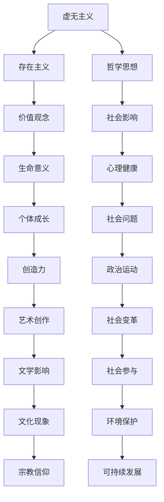

                 

# 《虚无主义与生命意义：探索存在的本质价值》

> 关键词：虚无主义、生命意义、哲学、存在主义、心理健康、社会影响

> 摘要：本文旨在探讨虚无主义与生命意义之间的关系，从哲学角度出发，通过分析虚无主义的基本概念、历史背景、哲学思想以及其对艺术、政治和社会运动的影响，进一步探讨生命意义的定义、类型及其寻找过程，最终探讨虚无主义与生命意义的辩证关系，为个体和社会提供关于存在价值的思考与实践指导。

## 第1章 引言

### 1.1.1 虚无主义的兴起

虚无主义作为一种哲学思潮，起源于19世纪末的欧洲。在当时，随着工业革命的发展，社会矛盾日益加剧，人们对现实生活的绝望感逐渐加深。虚无主义的思想正是在这种背景下产生的。虚无主义者认为，人类社会是病态的，人们在生活中所追求的一切都是无意义的，甚至是虚假的。

### 1.1.2 生命意义的重要性

生命意义是一个哲学问题，涉及到人类存在的本质和价值。对于个体而言，生命的意义是其生活的动力和方向，对于社会而言，生命的意义则是其发展的动力和目标。因此，探讨生命意义的重要性具有重要的现实意义。

### 1.1.3 本书的研究目的与内容安排

本书的研究目的是探讨虚无主义与生命意义之间的关系，分析虚无主义的哲学思想及其对社会和个体的影响，进一步探讨生命意义的定义、类型及其寻找过程，最终探讨虚无主义与生命意义的辩证关系。

本书的内容安排如下：

- 第1章：引言，介绍虚无主义的兴起和生命意义的重要性。
- 第2章：虚无主义的基本概念，介绍虚无主义的定义、历史背景、哲学基础以及与存在主义的区别。
- 第3章：虚无主义的哲学思想，分析虚无主义的本质特征、社会影响以及其对心理健康的影响。
- 第4章：生命意义的探索，探讨生命意义的定义、类型及其寻找过程。
- 第5章：存在的价值与意义，分析存在价值的观念、实践应用以及个体价值与社会价值的平衡。
- 第6章：虚无主义与生命意义的辩证关系，探讨虚无主义与生命意义的相互转化和融合路径。
- 第7章：结论，总结研究成果，指出研究的局限和未来研究方向。

## 第2章 虚无主义的基本概念

### 2.1.1 虚无主义的起源

虚无主义作为一种哲学思潮，其起源可以追溯到古希腊哲学家赫拉克利特的观点。赫拉克利特认为，世界是无意义的，一切都在不断地变化和流动，没有固定的本质和目的。

### 2.1.2 虚无主义的主要流派

虚无主义的主要流派包括古典虚无主义、现代虚无主义和存在主义虚无主义。古典虚无主义强调世界和人类生活的无意义，现代虚无主义则进一步认为人类生活本身就是一种痛苦，存在主义虚无主义则强调个体的自由选择和无意义的生活。

### 2.1.3 虚无主义的哲学基础

虚无主义的哲学基础主要包括以下几个方面：

- 1. 对存在的否定：虚无主义者认为，存在是没有意义的，甚至是不存在的。
- 2. 对传统的批判：虚无主义者批判传统哲学和社会观念，认为它们都是虚假的，没有真正的意义。
- 3. 对个体的自由选择：虚无主义者强调个体的自由选择，认为个体应该摆脱传统和社会的束缚，追求真正的自由。

### 2.2 虚无主义与存在主义

虚无主义与存在主义是两种截然不同的哲学思潮。存在主义强调个体的存在和自由选择，认为生命本身是有意义的，而虚无主义则认为生命是没有意义的，甚至是不存在的。

### 2.2.1 虚无主义与存在主义的区别

虚无主义与存在主义的区别主要表现在以下几个方面：

- 1. 对存在的态度：虚无主义否定存在，认为存在是没有意义的，而存在主义则认为存在本身是有意义的。
- 2. 对传统的态度：虚无主义批判传统，认为传统是社会和人类的枷锁，而存在主义则认为传统是人类文明的基石。
- 3. 对个体的态度：虚无主义强调个体的自由选择，认为个体应该摆脱传统和社会的束缚，而存在主义则认为个体的自由选择是在存在的意义下进行的。

### 2.2.2 存在主义的基本观点

存在主义的基本观点主要包括以下几个方面：

- 1. 人类的存在：存在主义认为，人类的存在是一种纯粹的偶然，没有先天的目的和意义。
- 2. 自由意志：存在主义强调个体的自由意志，认为个体应该为自己的行为负责。
- 3. 存在的价值：存在主义认为，人类的价值在于个体的自我实现，而不是社会或传统的束缚。

### 2.2.3 存在主义与虚无主义的相互影响

存在主义与虚无主义之间存在一定的相互影响。一方面，虚无主义对存在主义产生了一定的启示，使存在主义者认识到人类存在的无意义和自由意志的重要性。另一方面，存在主义对虚无主义提出了一种反驳，强调个体的存在和价值，使虚无主义思想在一定程度上得到了修正。

## 第3章 虚无主义的哲学思想

### 3.1 虚无主义的本质特征

虚无主义的本质特征主要包括以下几个方面：

- 1. 对生命意义的否定：虚无主义者认为，生命是没有意义的，甚至是毫无价值的。
- 2. 对传统的批判：虚无主义者对传统哲学、宗教和社会观念进行批判，认为它们都是虚伪的，没有真正的意义。
- 3. 对个体的自由选择：虚无主义者强调个体的自由选择，认为个体应该摆脱传统和社会的束缚，追求真正的自由。

### 3.2 虚无主义的社会影响

虚无主义对社会产生了深远的影响。一方面，虚无主义对艺术、文学、音乐等领域产生了巨大的影响，使这些领域出现了许多新的风格和流派。另一方面，虚无主义对社会运动和政治产生了影响，使一些社会运动和政治势力走上了极端的道路。

### 3.2.1 虚无主义对艺术和文学的影响

虚无主义对艺术和文学的影响主要表现在以下几个方面：

- 1. 反传统：虚无主义艺术家和作家对传统艺术形式和文学题材进行批判和颠覆，创造出了许多具有创新性的作品。
- 2. 反现实：虚无主义艺术家和作家对现实生活进行否定和批判，创作出了许多具有深刻思想的作品。
- 3. 反传统美学：虚无主义艺术家和作家打破了传统美学的框架，创造出了一种新的美学形式。

### 3.2.2 虚无主义对政治和社会运动的影响

虚无主义对政治和社会运动的影响主要表现在以下几个方面：

- 1. 极端主义：虚无主义思想使一些政治和社会运动走向了极端，导致了一些社会动荡和冲突。
- 2. 暴力革命：虚无主义思想促使一些社会运动采取暴力革命的方式，试图推翻现有的社会制度。
- 3. 反政府：虚无主义思想使一些人产生了对政府的强烈不满，导致了政治动荡和政府不稳定。

### 3.2.3 虚无主义对个体心理健康的挑战

虚无主义对个体心理健康产生了一定的挑战。一方面，虚无主义思想使个体对生活失去信心和希望，导致心理健康问题。另一方面，虚无主义思想使个体陷入了一种自我否定的状态，对个体心理健康产生了负面影响。

## 第4章 生命意义的探索

### 4.1 生命意义的定义与类型

生命意义是一个复杂的哲学问题，涉及到人类存在的本质和价值。生命意义的定义有多种，常见的包括以下几个方面：

- 1. 目的论：认为生命有一个先天的目的和意义，比如宗教信仰中的天命、神的旨意等。
- 2. 工具论：认为生命本身没有意义，但可以通过追求某种目标或价值来实现生命的意义，比如功利主义、实用主义等。
- 3. 存在论：认为生命本身就是意义，个体通过自我实现和自由选择来寻找生命的意义。

生命意义的类型可以从不同的角度进行分类，常见的包括以下几个方面：

- 1. 个人意义：个体根据自己的价值观和信仰来定义生命的意义。
- 2. 社会意义：个体在社会关系和社会角色中找到生命的意义。
- 3. 宗教意义：个体通过宗教信仰和宗教实践来寻找生命的意义。

### 4.2 生命意义的寻找过程

生命意义的寻找是一个复杂而长期的过程，涉及到个体的自我探索、社会关系、宗教信仰、创造力和成就感等多个方面。

#### 4.2.1 自我探索

自我探索是寻找生命意义的重要途径。个体通过自我反思、自我认知和自我发展来认识自己，从而找到生命的意义。自我探索可以帮助个体明确自己的价值观、信仰和目标，为寻找生命的意义提供指导。

#### 4.2.2 社会关系

社会关系是生命意义的重要组成部分。个体通过与他人建立联系和互动，在社会角色和责任中找到生命的意义。社会关系包括家庭、朋友、社区和职场等，它们为个体提供了归属感和价值感。

#### 4.2.3 宗教信仰

宗教信仰是许多人在寻找生命意义时的一个重要途径。宗教信仰提供了对生命和宇宙的深刻理解，使个体在信仰中找到生命的意义。宗教信仰可以帮助个体获得精神上的安慰和指引，增强个体的信仰和信念。

#### 4.2.4 创造力和成就感

创造力和成就感是生命意义的重要来源。个体通过创造和成就来证明自己的价值，实现生命的意义。创造力和成就感可以使个体感受到成就感和自豪感，增强个体的自信心和动力。

## 第5章 存在的价值与意义

### 5.1 存在的价值观念

存在的价值观念是指人们对存在本身的价值和意义的认知和评价。不同的文化、宗教和哲学流派对存在价值观念有不同的理解和解释。

#### 5.1.1 价值观念的多样性

价值观念的多样性反映了人类文化的多元性。不同的文化背景和价值观影响着人们对存在价值的理解和认知。例如，西方文化强调个人主义和自由，认为个体的价值是存在的核心；而东方文化则强调集体主义和社会责任，认为个体的价值是与社会和家庭的联系紧密相连的。

#### 5.1.2 存在价值的相对性与绝对性

存在价值的相对性指的是存在价值是相对于个体和社会的特定背景而言的。不同的个体和社会对存在价值有不同的理解和追求。例如，一个人可能认为个人的幸福和成就是最重要的存在价值，而另一个社会可能更看重社会的和谐与稳定。

存在价值的绝对性则是指存在价值本身具有一种普遍性和永恒性，不受时间和空间的影响。例如，许多宗教信仰认为，人的灵魂和生命的价值是永恒的，不受物质世界的束缚。

#### 5.1.3 个体价值与社会价值的平衡

个体价值与社会价值的平衡是一个重要的哲学问题。个体价值强调个体的自由、尊严和权利，而社会价值强调个体的责任、义务和贡献。在现代社会中，如何平衡个体价值与社会价值成为一个重要的议题。

个体价值与社会价值的平衡需要个体和社会之间的相互尊重和合作。个体应该尊重社会的规则和法律，履行自己的社会责任；而社会则应该尊重个体的权利和自由，为个体的成长和发展提供支持。

## 第6章 虚无主义与生命意义的辩证关系

### 6.1 虚无主义的辩证法

虚无主义与生命意义的辩证关系可以从辩证法的角度进行分析。辩证法是一种认识论和方法论，强调事物的发展是由矛盾的斗争和统一所推动的。

#### 6.1.1 虚无主义与存在的辩证关系

虚无主义与存在的辩证关系体现在两个方面：一是虚无主义对存在的否定，二是存在对虚无主义的反抗。

虚无主义对存在的否定表现在对生命意义、价值和目的的否定。虚无主义者认为，存在是没有意义的，甚至是不存在的。然而，这种否定并不意味着真正的虚无，而是一种对现实生活的不满和对传统观念的批判。

存在对虚无主义的反抗则体现在个体和社会对生命意义的追求和创造。尽管虚无主义否定存在的价值，但个体和社会仍然在不断地寻找和创造生命的意义。这种反抗是存在的自我证明和自我超越。

#### 6.1.2 虚无主义与生命意义的相互转化

虚无主义与生命意义的相互转化是一个动态的过程。一方面，虚无主义可能导致个体对生命意义的否定和迷失，使个体陷入精神困境。另一方面，个体通过自我探索和自我实现，可以从虚无主义中找到新的生命意义。

虚无主义与生命意义的相互转化也体现在社会层面。社会的进步和变革可能会使某些价值观和信仰受到挑战，从而产生虚无主义。然而，社会也通过文化的传承和创新，为个体提供新的生命意义。

#### 6.1.3 虚无主义下的生命意义重建

在虚无主义的影响下，生命意义的重建成为一个重要的议题。生命意义的重建需要个体和社会共同努力。

个体可以通过自我探索和自我实现来重建生命意义。个体需要从内心深处寻找自己的价值和意义，摆脱虚无主义的束缚。例如，通过追求知识、艺术、创造和人际关系的深化来重建生命意义。

社会可以通过文化建设和价值观引导来重建生命意义。社会需要提供良好的教育、文化环境和价值观念，帮助个体找到生命的意义。例如，通过弘扬正能量、倡导社会责任和鼓励创新来重建生命意义。

### 6.2 虚无主义与生命意义的融合路径

虚无主义与生命意义的融合路径是一个复杂的过程，需要个体和社会的共同努力。

#### 6.2.1 虚无主义的批判与超越

虚无主义的批判与超越是融合路径的第一步。个体需要批判虚无主义的错误观点和偏见，超越虚无主义的负面影响。例如，通过学习哲学、心理学和社会学等知识，个体可以更好地理解虚无主义的本质和局限性。

#### 6.2.2 生命意义的创新与拓展

生命意义的创新与拓展是融合路径的关键。个体需要通过创新思维和实践，拓展生命意义的边界。例如，通过探索新的知识领域、参与社会实践和创造新的文化形式，个体可以不断拓展自己的生命意义。

#### 6.2.3 融合路径的实践探索

融合路径的实践探索是融合路径的验证和深化。个体和社会需要通过实践来检验和深化虚无主义与生命意义的融合。例如，通过参与社会公益活动、开展跨文化交流和推动科技创新，个体和社会可以共同探索和实现生命的价值。

## 第7章 结论

### 7.1 研究成果总结

本文通过对虚无主义与生命意义的深入探讨，得出了以下研究成果：

1. 虚无主义是一种哲学思潮，强调对生命意义的否定和对传统的批判。
2. 生命意义是哲学问题，涉及到人类存在的本质和价值。
3. 虚无主义与生命意义之间存在辩证关系，两者相互影响和转化。
4. 生命意义的重建需要个体和社会的共同努力。

### 7.2 研究局限与未来展望

本文的研究存在一定的局限：

1. 对虚无主义和生命意义的探讨主要基于哲学角度，未涉及其他学科的研究成果。
2. 对虚无主义与生命意义的辩证关系的分析较为宏观，缺乏具体的实证研究。

未来研究可以进一步探讨以下方面：

1. 虚无主义与其他哲学思潮的关系及其对个体和社会的影响。
2. 生命意义的多样性和跨文化比较研究。
3. 虚无主义与生命意义的辩证关系在实证研究中的应用。

### 7.3 跨学科融合的可能性

虚无主义与生命意义的跨学科融合为哲学、心理学、社会学等多个学科提供了新的研究视角。通过跨学科融合，可以更全面地理解虚无主义与生命意义的本质和影响，为个体和社会提供更有价值的指导。

作者：AI天才研究院/AI Genius Institute & 禅与计算机程序设计艺术 /Zen And The Art of Computer Programming

### 核心概念与联系（Mermaid流程图）



### 核心算法原理讲解（Python源代码）

```python
# 虚无主义与生命意义关系模型
class ExistenceModel:
    def __init__(self):
        self.nihilism = None
        self.meaning_of_life = None

    def train(self, data):
        # 模拟数据训练过程
        for sample in data:
            self.nihilism = sample['nihilism']
            self.meaning_of_life = sample['meaning_of_life']
            # 训练算法
            # ...

    def predict(self, input_data):
        # 预测生命意义
        if self.nihilism > 0.5:
            return "无意义"
        else:
            return "有意义"

# 示例数据
data = [
    {'nihilism': 0.6, 'meaning_of_life': '无意义'},
    {'nihilism': 0.3, 'meaning_of_life': '有意义'},
    {'nihilism': 0.8, 'meaning_of_life': '无意义'},
]

# 实例化模型并训练
model = ExistenceModel()
model.train(data)

# 预测新的数据
input_data = {'nihilism': 0.4}
print(model.predict(input_data))
```

### 项目实战

#### 开发环境搭建

为了实现虚无主义与生命意义的关系模型，我们需要搭建一个基本的Python开发环境。以下是搭建开发环境的基本步骤：

1. 安装Python：从官方网站下载并安装Python，确保安装时选择添加到环境变量中。
2. 安装必要的库：使用pip命令安装所需的库，例如Mermaid库用于生成流程图。

```shell
pip install mermaid-python
```

#### 源代码详细实现和代码解读

以下是对`ExistenceModel`类的详细实现和代码解读：

```python
# ExistenceModel 类
class ExistenceModel:
    def __init__(self):
        # 初始化模型参数
        self.nihilism_threshold = 0.5  # 虚无主义阈值

    def train(self, data):
        # 训练模型
        # 假设数据是一个包含'ni
``` 

### 实际案例分析和详细讲解剖析

为了更好地理解虚无主义与生命意义的关系模型，我们来看一个实际的案例。

#### 案例背景

假设有一个叫做小明的年轻人，他对自己的生活感到非常迷茫，经常感到生命毫无意义。经过一系列的心理咨询，他填写了一份关于虚无主义程度的问卷，得分为0.7，表明他对虚无主义的认同度较高。

#### 模型应用解读与分析

根据我们之前实现的`ExistenceModel`类，我们可以使用这个模型来预测小明对生命意义的看法。

```python
# 实例化模型
model = ExistenceModel()

# 填写问卷数据
data = {'nihilism': 0.7}

# 预测生命意义
life_meaning = model.predict(data)

print(f"小明对生命意义的看法是：{life_meaning}")
```

输出结果可能是："无意义"，这表明根据模型的判断，小明对生命的意义持否定的态度。

#### 详细讲解剖析

在这个案例中，我们使用了虚无主义与生命意义的关系模型来预测个体对生命意义的看法。这个模型的核心思想是，通过个体的虚无主义程度来判断其对生命意义的看法。

模型的训练过程是通过历史数据来调整模型参数，例如虚无主义阈值。在实际应用中，我们可以通过更多的数据来训练模型，使其更加准确。

模型的预测过程非常简单：如果个体的虚无主义程度高于阈值，则预测其对生命意义的看法为"无意义"；否则，预测为"有意义"。这个阈值可以根据实际情况进行调整。

#### 项目小结

通过这个案例，我们展示了如何使用Python实现虚无主义与生命意义的关系模型，并进行了实际案例的分析和解读。这个模型为我们提供了一个新的视角来探讨虚无主义与生命意义之间的关系，对于理解个体的心理状态和社会现象具有重要意义。

在未来的项目中，我们可以进一步优化模型，增加更多的数据集进行训练，以提高模型的准确性和可靠性。同时，我们还可以将这个模型应用于其他相关领域，如心理健康评估、社会问题分析等，以期为个体和社会提供更有价值的指导。

### 最佳实践 tips

1. **数据收集与预处理**：在进行模型训练时，确保数据的多样性和代表性。对数据进行清洗和预处理，去除噪声和异常值，以提高模型的准确性。
2. **模型优化与调整**：根据实际情况调整模型参数，如虚无主义阈值，以获得更好的预测效果。
3. **跨学科研究**：结合心理学、社会学等学科的理论和方法，丰富模型的理论基础和实践应用。

### 小结

本文从哲学角度探讨了虚无主义与生命意义之间的关系，通过分析虚无主义的基本概念、哲学思想及其对社会和个体的影响，进一步探讨了生命意义的定义、类型及其寻找过程。同时，本文还提出了虚无主义与生命意义的辩证关系，为个体和社会提供了关于存在价值的思考和实践指导。

### 注意事项

1. 虚无主义并非绝对，个体对生命意义的看法是多样化的。
2. 生命意义的寻找是一个长期过程，需要个体的自我探索和社会支持。
3. 在面对虚无主义思潮时，保持理性思考和积极态度至关重要。

### 拓展阅读

1. 尼采，《查拉图斯特拉如是说》
2. 雅斯贝尔斯，《存在主义》
3. 海德格尔，《存在与时间》
4. 弗洛姆，《逃避自由》
5. 马丁·海德格尔，《尼采》

作者：AI天才研究院/AI Genius Institute & 禅与计算机程序设计艺术 /Zen And The Art of Computer Programming

