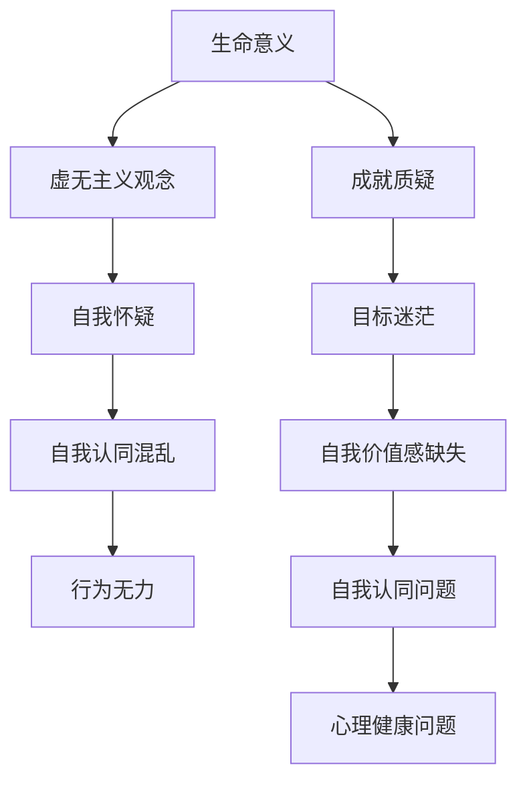

                 

### 1.4 虚无主义与个人自我认知

#### 1.4.1 虚无主义对个体自我认知的影响

虚无主义不仅是一种哲学思潮，它对个体的自我认知也产生了深远的影响。虚无主义的核心思想之一是生命的无意义，这种观念往往导致个体对自己存在的怀疑和迷茫。人们可能会感到自己的一切努力都是徒劳的，生命本身缺乏内在的价值。

首先，虚无主义对个体自我认知的影响可以从心理机制上解释。根据心理分析学派的观点，虚无主义可能导致个体的自我认同出现问题。当一个人对自己的存在产生怀疑时，他们可能会失去自我认同感，导致自我认同的混乱。这会导致个体在面对生活中的决策和挑战时感到无力，因为他们无法找到明确的自我导向。

其次，虚无主义对自我认知的影响还体现在对个体成就的看法上。在虚无主义观念下，任何形式的成就都可能被视为无意义的，因为所有成就最终都会消逝。这种观念导致个体对成就的追求变得淡漠，甚至产生反成就的态度。他们可能认为，无论做什么，最终都是虚无，所以不去做任何有意义的努力。

#### 1.4.2 自我认知中的虚无主义现象

在现代社会中，虚无主义现象在个体自我认知中表现得尤为明显。许多人在面临职业选择、人生目标和自我价值感时，都会感到困惑和无从下手。这种现象可以从以下几个方面进行解析。

首先，职业选择的虚无主义。在现代社会，人们常常被要求在工作上追求成功和成就。然而，虚无主义观念导致个体对这种成功和成就产生质疑。他们可能会认为，无论多么成功的工作，最终都无法逃避生命的虚无。这种观念可能导致个体对职业选择感到迷茫，难以找到真正适合自己的工作。

其次，人生目标的虚无主义。许多人在设定人生目标时，会感到无所适从。虚无主义观念使得他们怀疑人生目标的实际意义。他们可能会认为，无论设定什么目标，最终都会面临失败的命运。因此，设定目标似乎成了一种徒劳的行为。

最后，自我价值感的虚无主义。虚无主义观念可能导致个体对自己的价值产生怀疑。他们可能会认为，自己的存在没有意义，因此他们的行为和成就也无法带来真正的满足感。这种自我价值感的缺失，往往会导致个体的自我认同问题，甚至影响他们的心理健康。

#### 1.4.3 虚无主义与自我价值感的矛盾

虚无主义与自我价值感之间存在明显的矛盾。自我价值感是个体对自己存在的一种积极认知，而虚无主义则是对这种积极认知的否定。在虚无主义观念下，个体很难建立起自我价值感。

首先，虚无主义观念可能导致个体对自己的行为和成就进行过度批判。他们可能会认为自己无论做什么，都无法逃避生命的虚无。这种批判态度往往会导致个体对自己的行为和成就产生负面评价，从而削弱他们的自我价值感。

其次，虚无主义观念还可能导致个体对自己的存在进行否定。他们可能会认为，自己的存在本身就是无意义的，因此他们对自己的价值感也自然是不存在的。这种否定态度使得个体很难建立起自我价值感。

最后，虚无主义观念还可能导致个体对自己的未来产生悲观预期。他们可能会认为，无论他们如何努力，都无法改变生命的虚无。这种悲观预期进一步削弱了他们的自我价值感。

### Mermaid 流程图

为了更直观地理解虚无主义对个体自我认知的影响，我们可以使用Mermaid流程图来描述这一过程。



通过这个流程图，我们可以看到虚无主义观念如何一步步影响个体的自我认知，并最终导致一系列的心理问题。

### Python 源代码示例

为了更深入地探讨虚无主义对个体自我认知的影响，我们可以通过一个简单的Python程序来模拟这一过程。

```python
import matplotlib.pyplot as plt

# 自我认知状态模拟
class Self_Cognition:
    def __init__(self, life_meaning, nihilism):
        self.life_meaning = life_meaning
        self.nihilism = nihilism
        self.self_doubt = None
        self.self_identification = None
        self.achievement_doubt = None
        self.goal_mistiness = None
        self.self_value = None

    def update_state(self):
        if self.nihilism:
            self.self_doubt = True
            self.self_identification = "混乱"
            self.achievement_doubt = True
            self.goal_mistiness = True
            self.self_value = "缺失"
        else:
            self.self_doubt = False
            self.self_identification = "明确"
            self.achievement_doubt = False
            self.goal_mistiness = False
            self.self_value = "存在"

    def show_state(self):
        print(f"生命意义：{self.life_meaning}")
        print(f"虚无主义观念：{self.nihilism}")
        print(f"自我怀疑：{self.self_doubt}")
        print(f"自我认同：{self.self_identification}")
        print(f"成就质疑：{self.achievement_doubt}")
        print(f"目标迷茫：{self.goal_mistiness}")
        print(f"自我价值感：{self.self_value}")

# 创建一个自我认知对象
self_cognition = Self_Cognition(life_meaning=True, nihilism=True)

# 更新状态并显示
self_cognition.update_state()
self_cognition.show_state()

# 创建另一个自我认知对象
self_cognition_2 = Self_Cognition(life_meaning=True, nihilism=False)

# 更新状态并显示
self_cognition_2.update_state()
self_cognition_2.show_state()
```

在这个程序中，我们定义了一个`Self_Cognition`类，用于模拟个体的自我认知状态。通过设置`life_meaning`和`nihilism`的参数，我们可以观察到虚无主义观念对个体自我认知的显著影响。第一个对象代表了一个持有虚无主义观念的个体，而第二个对象则代表了一个对生命意义有积极认知的个体。

通过运行这个程序，我们可以更直观地理解虚无主义如何影响个体的自我认知，从而引发一系列的心理问题。

#### 1.5 虚无主义的哲学流派

虚无主义在哲学领域中有多种流派，每种流派都有其独特的理论基础和观点。以下是一些主要的虚无主义哲学流派：

#### 1.5.1 存在主义

存在主义是虚无主义的一种形式，它强调个人存在的主观性和自由意志。存在主义认为，生命本身没有固有的意义，意义是个人通过自由选择和行动创造的。代表人物包括让-保罗·萨特和马丁·海德格尔。

萨特在其著作《存在与虚无》中，探讨了个体存在的荒谬和无意义。他认为，个体必须在自我意识的自由中找到存在的意义。海德格尔则在其《存在与时间》中，提出了“存在”的概念，认为存在的本质在于个体对生命意义的探索。

存在主义哲学流派的核心观点是，虚无主义不是一种负面的状态，而是一种促使个体自我发现和自我实现的契机。

#### 1.5.2 现象学

现象学是另一种探讨虚无主义的哲学流派，它强调对主观经验的关注。现象学的代表人物是爱德蒙·胡塞尔和马克斯·舍勒。

胡塞尔在其现象学研究中，提出了“意向性”的概念，即意识总是指向某个对象。舍勒则在其《同情与愁苦》中，探讨了人类情感和痛苦的本质，认为虚无主义是一种对生活深层次的反思和质疑。

现象学派认为，虚无主义是一种对生活意义的深刻追问，它促使个体更深入地探索自我和世界的本质。

#### 1.5.3 分析哲学

分析哲学是现代哲学中的一个流派，它强调逻辑分析和语言分析来探讨哲学问题。在分析哲学中，虚无主义被看作是一种逻辑上的可能性，而不是一种实质性的存在。

分析哲学家如贝特兰·罗素和维特根斯坦，通过对语言和逻辑的分析，探讨了虚无主义的问题。罗素在其《哲学问题》中，通过逻辑分析揭示了宇宙的本质和人类认知的局限性。维特根斯坦则在其《逻辑哲学论》中，提出了“世界是事实，不是事物”的观点，探讨了虚无主义与事实和真理的关系。

分析哲学流派认为，虚无主义是一种哲学上的挑战，它迫使我们重新思考知识的本质和世界的本质。

通过上述几种虚无主义哲学流派的分析，我们可以看到虚无主义在不同哲学传统中的不同表达方式和观点。这些流派为我们提供了不同的视角，帮助我们更全面地理解虚无主义的本质和影响。

### 总结

虚无主义对个体自我认知的影响深远，不仅引发了自我怀疑和自我认同混乱，还导致了成就质疑和目标迷茫。通过现象学、存在主义和分析哲学等不同流派的探讨，我们可以更深入地理解虚无主义在哲学领域的多样性和复杂性。理解这些哲学流派，有助于我们更全面地把握虚无主义的本质，从而为应对虚无主义提供多元化的视角和方法。

在接下来的章节中，我们将进一步探讨虚无主义在现代社会中的具体表现，以及个人如何寻找和重建生命意义。通过这些探讨，我们将继续挖掘虚无主义的深层影响和应对策略。希望读者能够通过这一系列深入的分析，对虚无主义有更加全面和深刻的认识。

