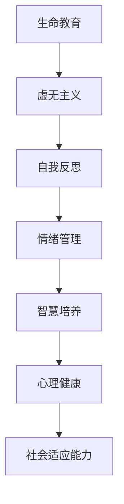

                 

### 引言

#### 背景与目的

在当代社会中，虚无主义作为一种哲学思潮，引起了广泛关注。虚无主义不仅影响了文学、艺术等领域，还深刻地渗透到了人们的日常生活和生命教育中。面对快速变化的社会环境和复杂的生存挑战，越来越多的人感到困惑和迷茫。这种现象促使我们思考，如何在教育体系中培养个体面对存在问题的智慧，以应对虚无主义的冲击。

本文旨在探讨虚无主义与生命教育之间的关系，并通过系统的分析和深刻的讨论，提出培养面对存在问题的智慧的方法和策略。文章将首先介绍虚无主义的定义、起源及其在当代文化中的表现，接着阐述生命教育的理念与实践，最终结合具体的案例研究，提出面对存在问题的智慧培养策略。

通过这篇文章，我们希望能够引起读者对于虚无主义和生命教育的深刻思考，并激发大家对于培养个体面对存在问题的智慧的兴趣。文章不仅为专业学者提供理论参考，也为教育工作者、家长和广大读者提供实用的指导和建议。

#### 虚无主义的定义与起源

虚无主义（Nihilism）是一种哲学思想，主张不存在固有道德、意义或目的。它源于19世纪初的西方哲学，作为一种对传统价值观的挑战而兴起。虚无主义的核心观点是，人类生命缺乏内在的、固有的意义，一切都是虚无。这种思想在当时的欧洲社会中具有强烈的冲击力，反映了人们对社会动荡和道德危机的不满。

虚无主义的起源可以追溯到德国哲学家弗里德里希·尼采（Friedrich Nietzsche）。尼采在《善与恶的彼岸》（Thus Spoke Zarathustra）中提出了“上帝已死”的观点，意味着传统的宗教和道德体系已经失去了权威。他主张，人类应该建立自己的价值观，而非依赖于外部权威。尼采的这些思想对后来的虚无主义者和哲学家产生了深远影响。

除此之外，俄国哲学家尼古拉·别尔嘉耶夫（Nicolas Berdyaev）也是虚无主义的重要代表。他在《虚无主义的悲剧》一书中详细探讨了虚无主义的思想根源和社会影响。别尔嘉耶夫认为，虚无主义是一种对人类存在本质的深刻反思，它揭示了人类生命的无意义和困境。

虚无主义在19世纪末和20世纪初的欧洲文学和艺术中得到了广泛体现。例如，俄国作家陀思妥耶夫斯基（Fyodor Dostoevsky）在《罪与罚》和《卡拉马佐夫兄弟》中，通过深刻的人物塑造和情节安排，探讨了虚无主义者的内心世界和道德困境。法国作家阿尔贝·加缪（Albert Camus）则是当代虚无主义文学的代表人物之一，他在《局外人》和《西西弗斯的神话》中，通过描绘主人公的荒诞经历，探讨了生命的无意义和人类面对虚无的态度。

总体而言，虚无主义作为一种哲学思潮，不仅影响了文学和艺术领域，也对当代社会产生了深远的影响。它揭示了人类存在的困境和挑战，促使人们思考生命的意义和目的。

#### 生命教育的定义与价值

生命教育（Life Education）是一种旨在帮助学生理解生命意义、培养生命意识、提升生命质量的教育理念。其定义涵盖了多个层面，不仅包括对生命的认知和理解，还涉及情感、心理、社会和道德等多个维度。生命教育的核心理念是“以人为本”，关注个体的全面发展和生命的内在价值。

生命教育在当代教育体系中的价值不可忽视。首先，它有助于培养学生的生命意识，使他们认识到生命的独特性和珍贵性，从而更加珍惜和尊重自己和他人的生命。其次，生命教育能够提高学生的心理素质，帮助他们面对生活中的挑战和困境，增强抗压能力和适应能力。此外，生命教育还强调情感和社会的联结，培养学生的社会责任感和公民意识，使他们成为有爱心、有责任、有担当的社会成员。

具体来说，生命教育在以下几个方面具有显著的教育价值：

1. **提升生命质量**：通过引导学生对生命的探索和理解，生命教育有助于提高他们的生活质量和幸福感。学生能够更加积极地面对生活中的困难和挑战，找到生命的意义和目的。

2. **培养心理健康**：生命教育关注学生的心理健康，通过提供情感支持和心理辅导，帮助学生建立健康的心理状态，降低心理问题的发生概率。

3. **增强社会适应能力**：生命教育使学生具备良好的社会适应能力，能够更好地融入社会，与他人和谐相处，提高人际交往能力和团队合作精神。

4. **培养公民意识**：生命教育强调社会责任感和公民意识，使学生成为有爱心、有责任、有担当的社会成员，为社会的和谐发展贡献力量。

总之，生命教育不仅在理论层面上具有重要意义，更在实践中展现出巨大的价值。通过系统的生命教育，学生能够更好地理解生命、珍惜生命，从而在面对虚无主义等哲学思潮时，拥有更加坚定的信念和积极的应对策略。

### 第一部分：虚无主义的哲学基础

#### 第1章：虚无主义的起源与发展

虚无主义作为一种哲学思想，其起源可以追溯到19世纪初的欧洲，这一时期正值工业革命和启蒙运动的余波。当时的社会经历了剧烈的变化，传统宗教和道德观念受到了严重冲击，许多人开始质疑生活的意义和价值。这种社会背景为虚无主义的兴起提供了土壤。

弗里德里希·尼采是虚无主义哲学的重要奠基人之一。他在《善与恶的彼岸》中提出了“上帝已死”的论断，这一观点动摇了西方宗教和道德体系的根基。尼采认为，人类无法再依赖外部权威来寻找生命的意义，而必须依靠自我创造和自我肯定。这一思想对后来的虚无主义者和哲学家产生了深远影响。

尼古拉·别尔嘉耶夫也是虚无主义哲学的重要代表。他在《虚无主义的悲剧》中详细探讨了虚无主义的思想根源和社会影响。别尔嘉耶夫认为，虚无主义不仅是对人类存在本质的深刻反思，也是一种对传统价值观的挑战。他强调了人类自由意志的重要性，主张人们应该通过自我探索来寻找生命的意义。

虚无主义在20世纪得到了进一步发展。法国哲学家阿尔贝·加缪在《局外人》和《西西弗斯的神话》中，通过描绘主人公的荒诞经历，探讨了虚无主义者的内心世界和道德困境。加缪认为，尽管生命缺乏固有的意义，但人类仍可以通过反抗和斗争来赋予生命以意义。

总体而言，虚无主义的起源和发展反映了人类对生命意义的深刻思考和对传统价值观的质疑。这一哲学思潮不仅影响了文学、艺术等领域，也对当代社会产生了深远的影响。

#### 第2章：虚无主义的核心概念与观点

虚无主义的核心概念和观点主要包括对存在意义、价值、道德和宗教的否定，以及对人类自由意志的强调。首先，虚无主义否定生命的固有意义，认为人类生活缺乏内在的目的和价值。这种观点源于对传统宗教和道德体系的质疑，特别是尼采提出的“上帝已死”的论断，动摇了人们对生命意义的依赖。

在价值方面，虚无主义主张传统价值观的崩溃，反对一切形式的权威和规范。尼采认为，人类应该摆脱外部权威的束缚，通过自我肯定和自我创造来建立自己的价值观。这一观点强调了个体自由意志的重要性，使得虚无主义成为现代个体主义哲学的一个重要分支。

在道德方面，虚无主义质疑传统的道德规范，认为这些规范往往是人为的、相对的，而非绝对的。别尔嘉耶夫在《虚无主义的悲剧》中提出了道德相对主义的思想，主张人们应该通过自我探索来寻找适合自己的道德标准。

宗教方面，虚无主义对传统的宗教信仰提出了挑战。尼采的“上帝已死”观点不仅否定了宗教的权威，也揭示了人类对超自然力量的依赖。加缪在《西西弗斯的神话》中，通过描绘主人公对宗教信仰的质疑，进一步探讨了虚无主义对宗教的冲击。

总体而言，虚无主义的核心概念和观点反映了人类对生命意义的深刻反思和对传统价值观的质疑。通过否定存在意义、价值、道德和宗教，虚无主义提出了一种新的哲学视角，促使人们重新审视自己的生活和价值观。

#### 第3章：虚无主义在西方哲学中的地位与影响

虚无主义在西方哲学中占据着重要地位，对许多哲学流派和思想家产生了深远影响。首先，虚无主义挑战了传统的宗教和道德观念，推动了现代哲学的发展。尼采提出的“上帝已死”观点，不仅打破了宗教的权威，也揭示了人类对超自然力量的依赖，为后来的存在主义和后现代主义哲学提供了理论基础。

虚无主义对存在主义的影响尤为显著。存在主义者如让-保尔·萨特（Jean-Paul Sartre）和马丁·海德格尔（Martin Heidegger）深受尼采思想的影响，他们强调个体的自由意志和存在的荒诞性，认为人类必须在没有先验意义的前提下，通过自我创造和自我选择来赋予生命以意义。这种思想在20世纪哲学中产生了深远的影响。

此外，虚无主义也对后现代主义哲学产生了重要影响。后现代主义者如让-弗朗索瓦·利奥塔（Jean-François Lyotard）和让-保罗·萨特（Jean-Paul Sartre），他们批判了现代主义的总体性和本质主义倾向，主张多样性和相对主义。虚无主义的思想为后现代主义提供了一种对现代性批判的理论基础，促使人们重新思考知识、权力和社会的运作方式。

在文学和艺术领域，虚无主义也产生了广泛的影响。俄国作家陀思妥耶夫斯基的作品，如《罪与罚》和《卡拉马佐夫兄弟》，通过描绘主人公的内心世界和道德困境，探讨了虚无主义者的生存状态。法国作家阿尔贝·加缪的《局外人》和《西西弗斯的神话》，则通过荒诞主义的叙事手法，揭示了人类面对虚无主义的挑战。

总体而言，虚无主义在西方哲学中的地位和影响不可忽视。它不仅挑战了传统的宗教和道德观念，也推动了现代哲学的发展，对文学、艺术和当代文化产生了深远的影响。

#### 第4章：虚无主义在当代文化中的表现

虚无主义在当代文化中有着广泛的表现，特别是在文学、艺术和流行文化领域。在文学方面，虚无主义通过深刻的叙事和人物塑造，反映了人类面对生命意义的困境和挑战。俄国作家陀思妥耶夫斯基的《罪与罚》和《卡拉马佐夫兄弟》，通过描绘主人公的内心挣扎和道德冲突，探讨了虚无主义者的生存状态。法国作家阿尔贝·加缪的《局外人》和《西西弗斯的神话》，则通过荒诞主义的叙事手法，揭示了人类面对虚无主义的挑战和选择。

在艺术领域，虚无主义思想影响了众多艺术家的创作理念和风格。荷兰画家文森特·梵高的《星夜》和《向日葵》，以其独特的色彩和构图，表达了艺术家对生命和存在的深刻思考。美国画家杰克逊·波洛克的行动绘画，通过抽象的表现形式，探讨了艺术与生活、存在与虚无的关系。

流行文化中，虚无主义也找到了自己的表达方式。电影《黑客帝国》（The Matrix）通过描绘人类生活在虚拟现实中的情景，探讨了现实与幻象、存在与虚无的边界。摇滚音乐中的黑暗主题和反叛精神，也反映了虚无主义对传统价值观的质疑和对现实的反叛。

总体而言，虚无主义在当代文化中通过文学、艺术和流行文化的多种形式，揭示了人类对生命意义的反思和对存在的探索，为当代文化提供了丰富的思想资源和艺术表达。

### 第二部分：生命教育的理念与实践

#### 第5章：生命教育的定义与价值

生命教育是一种全面的教育理念，旨在帮助学生理解生命的本质、意义和价值，培养他们珍惜生命、关爱他人和积极面对生活挑战的能力。其定义涵盖了多个维度，包括对生命的认知、情感、心理、社会和道德等方面。生命教育的核心理念是“以人为本”，强调个体的发展与生命质量。

在生命教育中，生命的定义不仅仅是生物学意义上的存在，还包括心理、情感、社会和道德等层面。通过生命教育，学生能够深入理解生命的多样性和独特性，认识到每个人都拥有生命的权利和价值。这种认知有助于培养学生的生命意识，使他们更加珍惜生命，关爱他人。

生命教育的价值在于其对学生全面发展的促进作用。首先，它有助于提升学生的心理健康，通过情感和心理层面的教育，帮助学生建立健康的心理状态，增强心理素质。其次，生命教育能够提高学生的社会适应能力，培养他们的社会责任感和公民意识，使他们成为有爱心、有责任、有担当的社会成员。此外，生命教育还强调道德教育，通过引导学生形成正确的道德观念和行为准则，促进他们道德品质的提升。

总之，生命教育的定义与价值体现了对生命本质的深刻理解和对个体全面发展的重视。通过系统的生命教育，学生能够更好地理解生命、珍惜生命，从而在面对生活的挑战时，拥有更加坚定的信念和积极的态度。

#### 第6章：生命教育的基本原则

生命教育的基本原则主要包括尊重生命、珍爱生命、自我探索和人际交往。这些原则旨在帮助学生在理解生命意义的同时，培养积极的生活态度和健康的生活习惯。

首先，尊重生命是生命教育的基础。学生需要认识到生命的独特性和价值，尊重自己和他人的生命。这不仅仅是生物学上的尊重，还包括心理、情感、社会和道德层面的尊重。通过教育，学生能够学会尊重生命、关爱生命，从而形成正确的生命观念。

其次，珍爱生命是生命教育的核心。学生需要通过自我探索，认识到生命的脆弱和宝贵，学会珍惜生命中的每一个瞬间。这种珍爱不仅体现在个人的生活态度上，也体现在对他人生命的尊重和关爱中。通过生命教育，学生能够更加积极地面对生活中的挑战和困境，提升生活质量和幸福感。

自我探索是生命教育的重要组成部分。学生需要通过自我反思和自我认知，找到生命的意义和价值。自我探索的过程不仅有助于学生了解自己，还能够帮助他们明确个人目标和人生方向。这种自我认知和自我探索的能力，是学生在面对虚无主义等哲学思潮时，保持内心坚定的重要基础。

最后，人际交往是生命教育的重要实践。学生需要学会与他人和谐相处，培养良好的沟通能力和团队合作精神。通过人际交往，学生能够感受到生命的多样性和丰富性，认识到每个人的生命都有其独特的价值和意义。这种人际交往的能力，有助于学生建立健康的人际关系，提升社会适应能力。

总之，生命教育的基本原则体现了对生命的深刻理解和对个体全面发展的重视。通过这些原则的实践，学生能够更好地理解生命、珍惜生命，从而在面对生活中的各种挑战时，拥有更加坚定的信念和积极的态度。

#### 第7章：生命教育在家庭中的实践

生命教育在家庭中的实践具有重要意义，家长作为孩子的第一任教师，其言传身教对孩子的影响深远。首先，家长应以身作则，通过自己的行为示范，向孩子传达尊重生命、珍爱生命的理念。例如，在日常生活中，家长可以通过照顾植物、小动物等方式，让孩子体验到生命的价值和责任。

其次，家长应与孩子进行开放而真诚的对话，引导他们思考生命的意义。这种对话可以是日常生活中的小话题，如关于生与死、善良与邪恶等问题的探讨。通过这种对话，家长可以帮助孩子建立正确的生命观念，培养他们珍爱生命、关爱他人的情感。

此外，家长可以组织一些家庭活动，如一起阅读关于生命的书籍、观看关于生命主题的电影等，以此丰富孩子的生命体验。这些活动不仅能够增进家庭成员之间的情感交流，还能够激发孩子对生命的兴趣和思考。

最后，家长应关注孩子的心理健康，提供情感支持和心理辅导。在孩子遇到困境或挫折时，家长应耐心倾听他们的心声，给予关爱和鼓励。通过这样的实践，家长能够帮助孩子建立健康的心理状态，增强他们的心理素质，从而更好地应对生活中的挑战。

总之，生命教育在家庭中的实践需要家长的关注和参与。通过以身作则、真诚对话、组织活动和关注心理健康等具体措施，家长能够为孩子提供良好的生命教育环境，帮助他们形成正确的生命观念，珍惜生命，关爱他人。

#### 第8章：生命教育在学校中的实践

生命教育在学校中的实践是培养学生全面发展的关键环节，通过课程设计、教育活动和教师指导等多方面，学校可以有效地将生命教育的理念融入到教学过程中。

首先，课程设计是生命教育的基础。学校可以在课程体系中设置专门的生命教育课程，如心理健康教育、道德与法治教育等。这些课程旨在帮助学生理解生命的意义、培养健康的生活态度和正确的价值观。例如，心理健康教育课程可以教授学生如何应对压力、如何处理情感问题，道德与法治教育课程则可以引导学生遵守法律法规、树立正确的道德观念。

其次，教育活动是生命教育的重要手段。学校可以通过组织各类教育活动，如主题班会、心理辅导活动、社会实践活动等，来丰富学生的生命体验。例如，主题班会可以围绕“生命的意义”进行讨论，让学生分享自己对生命的理解和感悟；心理辅导活动可以帮助学生学会如何处理情感问题，增强他们的心理素质；社会实践活动则可以让学生走出校园，接触社会，了解生命的多样性和丰富性。

此外，教师指导在生命教育中发挥着重要作用。教师应具备生命教育的知识和技能，通过自身的言行示范，引导学生正确理解生命、珍爱生命。例如，在课堂上，教师可以通过讲解生命科学知识，帮助学生了解生命的本质和特点；在课外活动中，教师可以以身作则，带领学生参与各种与生命相关的社会实践活动，从而增强他们的生命意识。

总之，生命教育在学校中的实践需要通过课程设计、教育活动和教师指导等多方面的共同努力，以培养学生的全面发展和生命质量。通过这些具体的实践措施，学生能够更好地理解生命、珍惜生命，从而在面对生活中的各种挑战时，拥有更加坚定的信念和积极的态度。

#### 第9章：生命教育在社会中的实践

生命教育在社会中的实践不仅涉及学校和家庭，更需要社会的广泛参与和合作。社会力量，如非政府组织、社区、媒体等，都发挥着重要作用，共同构建一个关注生命、尊重生命的社会环境。

首先，非政府组织（NGO）在生命教育中扮演着关键角色。这些组织通过开展各种公益活动，如环保活动、社区服务、心理援助等，提高公众对生命的关注和认知。例如，一些NGO会组织志愿者到养老院、孤儿院等场所进行服务，让孩子们感受到关爱他人、尊重生命的重要性。

其次，社区在生命教育中的实践也具有重要意义。社区可以通过组织社区活动，如健康讲座、亲子活动、生命教育宣传等，营造一个关注生命、关爱他人的社区氛围。例如，一些社区会定期举办心理健康讲座，邀请专业人士为居民提供心理健康咨询，帮助居民更好地理解和应对生活中的压力和挑战。

此外，媒体在生命教育中的实践也不可忽视。通过新闻、纪录片、网络媒体等渠道，媒体可以传播生命教育的内容和理念，提高公众对生命价值的认识。例如，一些新闻媒体会报道关于环境保护、公益事业、心理健康等方面的新闻，引导公众关注生命、关爱社会。

最后，政府政策在生命教育中的实践具有指导作用。政府可以通过制定相关政策和法规，推动生命教育的普及和实施。例如，政府可以鼓励学校和社会机构开展生命教育活动，提供必要的资金和资源支持；政府还可以制定心理健康政策，为公众提供心理援助和支持。

总之，生命教育在社会中的实践需要各方力量的共同努力。通过非政府组织、社区、媒体和政府的合作，构建一个关注生命、尊重生命的社会环境，能够有效地提升公众的生命意识和生命质量，为个体的全面发展提供坚实基础。

### 第三部分：培养面对存在问题的智慧

#### 第10章：存在问题的本质与类型

存在问题是人类在面对生活、自我认知和世界意义时所遇到的一系列深刻而普遍的问题。其本质在于对生命意义的追寻、对存在的质疑以及对人类自身存在的深刻反思。这些问题不仅影响个体的心理健康和生活质量，也对社会文化和价值体系产生深远的影响。

存在问题的类型多样，主要包括以下几个方面：

1. **生命的意义问题**：这是存在问题中最基本的问题，涉及到对生命目的、价值和意义的追问。人们常常质疑，生命是否有固有的目的，或者生命的意义是由个体自己赋予的。

2. **自我认同问题**：个体在面对自我认知时，可能会遇到自我认同问题，即如何定义自我、认识自我以及如何处理自我与他人、社会的冲突。

3. **自由与责任问题**：自由是现代社会追求的重要价值之一，但同时自由也带来了责任。个体在享受自由的同时，也必须承担相应的责任，这往往导致内心的矛盾和焦虑。

4. **生死问题**：生死问题是人类不可避免的议题。面对生与死，个体需要理解生命的有限性和脆弱性，同时也需要探讨如何面对生命的终结。

5. **信仰与怀疑问题**：在传统宗教和现代科学的冲击下，个体常常面临信仰与怀疑的困境。如何在科学和信仰之间找到平衡，成为许多人的困扰。

6. **社会与个体问题**：个体在社会中生存，不可避免地会遇到社会问题，如贫富差距、社会不公等。个体如何在这些问题的困扰下保持自我，寻找生命的意义，是一个复杂而重要的问题。

了解存在问题的本质和类型，有助于我们更深入地认识人类的心理状态和社会文化，从而为培养面对存在问题的智慧提供理论基础。

#### 第11章：培养面对存在问题的智慧的方法

在面对存在问题时，培养智慧的方法尤为重要。以下是一些具体的方法，可以帮助个体更好地理解和应对这些深层次的问题：

1. **自我反思**：自我反思是培养智慧的第一步。通过深入思考自己的价值观、信念和行为，个体可以更好地了解自己的内心世界。自我反思可以帮助个体认识到自己的优点和不足，从而在解决问题时更加客观和理性。

2. **接受不确定性**：存在问题的本质之一是生命中的不确定性和不可预测性。接受不确定性是培养智慧的关键。个体需要学会接受事物的不完美，理解生活中的许多问题可能没有明确的答案。通过接受不确定性，个体可以减少内心的焦虑和困扰。

3. **心理教育**：通过接受心理教育，个体可以学习如何处理情感和压力。心理教育包括认知行为疗法、情绪调节技巧等，这些方法可以帮助个体更好地管理情绪，增强心理韧性。

4. **人际交流**：与他人的交流和分享是培养智慧的重要途径。通过与他人交流，个体可以获得不同的观点和见解，从而拓宽自己的思维和视野。人际交流还可以帮助个体建立支持和理解的关系网，增强面对问题的信心和勇气。

5. **文化认同**：文化认同是理解存在问题的另一个重要方面。通过了解和认同自己的文化背景和价值体系，个体可以找到更多的生命意义和目的。文化认同不仅有助于个体的自我认同，还可以增强个体的文化自信。

6. **寻求专业帮助**：在面对复杂的存在问题时，寻求专业的心理咨询或治疗是明智的选择。专业心理咨询师或治疗师可以提供科学的指导和支持，帮助个体找到解决问题的方法和策略。

通过这些方法，个体可以逐步培养面对存在问题的智慧，从而更好地应对生命中的各种挑战和困境。

#### 第12章：智慧面对虚无主义的挑战

面对虚无主义的挑战，培养智慧成为个体在现代社会中保持心理健康的必要途径。虚无主义的核心观点是生命的无意义，这种观念对个体的心理健康可能产生严重的负面影响。然而，通过智慧的引导，个体可以更好地应对虚无主义的冲击，实现心理上的平衡和成长。

首先，智慧帮助个体认识到虚无主义并非绝对的真理，而是人类对生命意义的一种质疑和反思。通过理解虚无主义的起源和发展，个体可以认识到这种思潮在历史上和现代社会中的复杂性和多样性。这种认知有助于个体从恐惧和焦虑中解脱出来，以更加理性和平和的态度面对虚无主义。

其次，智慧培养个体的自我反思能力，帮助个体深入思考生命的意义和价值。通过自我反思，个体可以探索自己的价值观和信念，从而找到生命的意义。例如，个体可以通过思考自己热爱的事物、关心的人和追求的目标，找到内在的价值和动力。

第三，智慧强调接受生活中的不确定性和不可预测性。虚无主义往往源于对确定性和可控性的渴望，而智慧则教会个体接受事物的无常和变化。通过接受不确定性，个体可以减少对完美和控制的追求，从而减少内心的焦虑和困扰。

第四，智慧培养个体的心理韧性和适应能力。通过心理教育和情绪调节技巧，个体可以更好地管理情绪和压力，增强心理韧性。这种韧性不仅有助于个体在面对虚无主义的挑战时保持冷静和理性，还可以帮助个体更好地应对生活中的其他压力和困境。

此外，智慧还强调人际交流和分享。通过与他人交流和分享，个体可以获得不同的观点和见解，从而拓宽自己的思维和视野。人际交流还可以帮助个体建立支持和理解的关系网，增强面对问题的信心和勇气。

最后，智慧培养个体的文化认同感。通过了解和认同自己的文化背景和价值体系，个体可以找到更多的生命意义和目的。文化认同不仅有助于个体的自我认同，还可以增强个体的文化自信，从而更好地抵御虚无主义的侵蚀。

总之，通过培养智慧，个体可以更好地面对虚无主义的挑战，实现心理上的平衡和成长。智慧不仅帮助个体理解和应对虚无主义，还促进了个体在生命意义和心理健康方面的全面发展。

#### 第13章：智慧在生命教育中的应用

智慧在生命教育中的应用具有重要意义，它不仅帮助个体理解生命的意义，还提升他们在面对生命挑战时的适应能力和应对策略。以下从课程设计、教学方法、教师角色和评估体系四个方面，探讨智慧在生命教育中的应用。

首先，课程设计应注重智慧的培养。生命教育课程可以设置多个模块，包括自我认知、情感管理、人际交往、社会参与等，每个模块都应融入智慧培养的元素。例如，在自我认知模块中，可以通过反思日记、自我评估等方式，引导学生深入思考自己的价值观和信念；在情感管理模块中，可以教授情绪调节技巧，帮助学生更好地应对生活中的压力和挑战。

其次，教学方法应灵活多样，注重培养学生的智慧。教师可以采用案例教学、小组讨论、角色扮演等多种教学方法，激发学生的思考和参与。例如，在讨论“生命的意义”这一主题时，教师可以通过引入现实生活中的案例，引导学生进行深入讨论和反思，从而培养学生的智慧。此外，教师还可以利用多媒体资源，如纪录片、文学作品等，帮助学生更好地理解生命教育的理念。

第三，教师在生命教育中扮演着关键角色，他们需要具备智慧培养的能力。教师应具备丰富的生命教育知识和经验，能够引导学生进行深入的思考和探索。同时，教师应以身作则，通过自己的言行示范，传递智慧和生命的理念。例如，在处理学生冲突时，教师可以采用冷静、理智的方式，帮助学生理解人际交往的复杂性，从而培养他们的智慧。

第四，评估体系应注重智慧的培养。评估不仅限于知识测试，还应包括情感、态度、行为等方面的评估。例如，通过反思日记、项目报告、课堂讨论等方式，评估学生在自我认知、情感管理、人际交往等方面的进步。此外，教师可以采用学生自评和互评的方式，鼓励学生反思自己的学习和成长，从而促进智慧的培养。

总之，智慧在生命教育中的应用是一个系统性的工程，需要从课程设计、教学方法、教师角色和评估体系等多方面进行综合考虑。通过智慧的培养，学生能够更好地理解生命的意义，提升他们的心理素质和社会适应能力，从而更好地应对生活中的各种挑战。

#### 第14章：智慧与人生意义

智慧在探讨人生意义的过程中起着至关重要的作用。智慧不仅帮助个体理解和面对生命中的存在问题和挑战，还为个体提供了寻找和实现人生意义的工具和方法。

首先，智慧帮助个体深入思考人生意义。通过自我反思和理性分析，个体可以逐步理解自己的价值观和信念，从而找到个人生命意义。例如，个体可以通过反思自己的兴趣、爱好和人生目标，确定自己在社会中的角色和使命。这种深入的思考过程，不仅有助于个体明确自己的人生方向，还能提升他们的自我认知和自我价值感。

其次，智慧培养个体的适应能力和应变能力，使其能够在面对生活中的困境和挑战时，保持冷静和理智。例如，当个体遇到失业、健康问题或其他重大生活变故时，智慧可以帮助他们理性分析问题，制定应对策略，从而更好地处理困境。这种能力不仅有助于个体在短期内缓解压力，还能在长期内提升他们的生活质量和幸福感。

此外，智慧还促进个体的人际关系和社会适应。智慧个体更擅长理解和沟通，能够更好地处理人际关系中的矛盾和冲突。例如，在团队合作中，智慧个体能够有效地协调团队成员之间的关系，提高团队的效率和凝聚力。这种人际关系处理能力，有助于个体在社会中建立良好的社会网络，为个人发展提供更多机会。

最后，智慧帮助个体实现自我超越和成长。通过不断学习和实践，个体可以不断提升自己的智慧和认知水平，从而实现人生意义。例如，个体可以通过学习新的知识和技能，不断提升自己的职业能力和竞争力；通过参与公益活动和社会服务，个体可以实现自我价值，为社会做出贡献。这种自我超越和成长的过程，不仅有助于个体实现个人目标，还能提升他们的幸福感和社会认同感。

总之，智慧在探讨人生意义中发挥着重要作用。它不仅帮助个体理解和面对生命中的存在问题和挑战，还为个体提供了寻找和实现人生意义的工具和方法。通过培养智慧，个体可以更好地理解生命的意义，提升生活质量，实现个人成长和社会价值。

### 第四部分：案例研究与反思

#### 第15章：虚无主义与生命教育的案例研究

在本章中，我们将通过具体的案例研究，探讨虚无主义对个体生命教育的影响，以及通过生命教育如何应对虚无主义的挑战。以下是几个典型案例的分析：

**案例一：学生小明的故事**

小明是一名高中生，他从小在充满挫折和困境的环境中长大。父母离异，家庭破碎，让他对生活充满了怀疑和悲观。在高中阶段，小明开始接触到虚无主义的观点，逐渐陷入消极情绪中。他常常怀疑生命的意义，觉得生活毫无价值。

**分析与反思**

1. **虚无主义对个体的影响**：小明因为家庭环境的不稳定和成长过程中的困境，对生命产生了消极的看法。虚无主义思想使他更加难以找到生活的意义和价值。

2. **生命教育的介入**：学校和小明的家长联合起来，对他进行生命教育。首先，通过心理健康讲座和团体辅导，帮助小明认识到自己的情绪问题，学会情绪调节技巧。其次，通过自我反思和价值观探索，帮助小明找到自己的兴趣和爱好，重新点燃对生活的热情。

3. **效果评估**：经过一段时间的生命教育，小明逐渐摆脱了虚无主义的消极影响，找到了生活的方向和意义。他的情绪稳定，学业和生活质量显著提高。

**案例二：中学生小芳的探索**

小芳是一名中学生，她对宗教和哲学有浓厚的兴趣。在阅读一些哲学著作后，她开始对生命和存在的意义产生质疑。她对传统价值观和宗教信仰产生了怀疑，逐渐接受了虚无主义的观点。

**分析与反思**

1. **虚无主义引发的困惑**：小芳对生命意义的质疑，使她陷入了思想的困惑和内心的痛苦。她开始怀疑自己的信仰和生活选择。

2. **生命教育的干预**：学校和小芳的家长意识到她的思想困境，决定对她进行生命教育。通过哲学思辨课程和心理健康辅导，帮助小芳理解虚无主义的核心观点，并引导她探索生命的意义。

3. **效果评估**：经过生命教育的干预，小芳逐渐从虚无主义的消极情绪中走出来，重新找到对生活的热爱和信仰。她的思维更加开放，对生命和存在的理解更加深刻。

**案例三：大学生小李的挑战**

小李是一名大学生，他在学习过程中遇到了严重的学业压力和人际关系问题。他感到自己被束缚在无尽的学习和社交中，逐渐对生活失去了兴趣。在心理辅导过程中，他表现出严重的虚无主义倾向。

**分析与反思**

1. **学业与生活的压力**：小李的学业压力和人际关系问题，使他感到生活无意义，对未来充满担忧。

2. **生命教育的支持**：学校和小李的家长联合起来，为他提供心理辅导和生命教育。通过制定合理的学习计划、培养兴趣爱好和提供社交支持，帮助小李缓解压力，重拾对生活的热情。

3. **效果评估**：经过生命教育的支持，小李逐渐摆脱了虚无主义的困扰，找到了生活的动力和目标。他的心理状态显著改善，学业成绩和生活质量得到提升。

**总结**

通过以上案例，我们可以看到虚无主义对个体生命教育的影响，以及生命教育在应对虚无主义挑战中的作用。生命教育不仅帮助个体理解生命的意义，还提升了他们的心理素质和应对困境的能力。通过具体的案例研究，我们进一步认识到生命教育的重要性和实践价值。

### 第16章：面对存在问题的智慧案例分析

在本章中，我们将通过具体的案例分析，探讨个体在面对存在问题时如何运用智慧来应对和解决这些难题。以下是三个典型的案例：

**案例一：职场压力下的智慧应对**

小明是一名年轻的职场新人，在工作中遇到了巨大的压力。他的工作要求高、任务繁重，常常感到身心疲惫。在长时间的压迫下，他开始对生活失去了热情，甚至产生了辞职的念头。

**分析与智慧应用**

1. **情绪调节**：小明首先认识到自己需要调节情绪，避免情绪失控。他开始练习冥想和深呼吸，通过这些方法来缓解压力，恢复内心的平静。

2. **自我反思**：小明进行了深入的自我反思，分析了工作压力的来源和自己的应对策略。他意识到，自己的期望值过高，对工作的要求过于严格，导致自己陷入自我否定的情绪中。

3. **设定目标**：小明制定了合理的工作和生活目标，将任务分解为可行的部分，并设定了明确的完成期限。这样，他能够更有效地管理时间和任务，减轻压力。

4. **寻求支持**：小明与同事和领导进行沟通，寻求他们的意见和建议。通过交流，他获得了更多的支持和帮助，缓解了工作压力。

**效果评估**：通过上述措施，小明逐渐恢复了工作热情和积极性。他的工作效率提高，心理状态明显改善，能够更加从容地应对职场挑战。

**案例二：家庭困境中的智慧选择**

李华在家庭中面临着严重的困境。她的父母因长期矛盾决定离婚，她需要在父母之间做出选择。这个决定让她感到痛苦和困惑，甚至对家庭产生了怀疑。

**分析与智慧应用**

1. **理性分析**：李华通过理性分析，认识到家庭矛盾并不是她能够解决的。她意识到，无论她如何选择，父母之间的矛盾都不会消失，反而可能加剧。

2. **情感调节**：李华学会了通过情感调节技巧来处理内心的痛苦。她通过与朋友交流、参加心理辅导等方式，表达自己的情感，减轻内心的负担。

3. **寻找支持**：李华寻求心理咨询师的帮助，通过专业辅导，她学会了如何处理家庭矛盾和情感困扰，找到了更多的应对策略。

4. **自我接纳**：李华逐渐接受了自己无法改变父母关系的现实，开始关注自己的成长和未来发展。她通过提升自己的能力和技能，增强自信心，找到了新的生活目标。

**效果评估**：经过一段时间的调整，李华逐渐走出了家庭困境，恢复了心理健康。她学会了理性看待问题，找到了生活的方向，并与父母建立了更为健康的关系。

**案例三：学业挑战中的智慧应对**

张强是一名大学生，他在学业上遇到了巨大的挑战。由于课程难度大、考试压力重，他开始对学习失去了兴趣，甚至产生了放弃学业的念头。

**分析与智慧应用**

1. **学习策略调整**：张强认识到自己需要调整学习策略，更加科学和有效地进行学习。他制定了详细的学习计划，将学习任务分解为小部分，逐一攻克。

2. **时间管理**：张强学会了合理管理时间，确保学习和休息的平衡。他通过设定学习目标和时间表，提高了学习效率，减少了时间浪费。

3. **寻求帮助**：张强主动与老师和同学进行交流，寻求学习上的帮助和指导。他参加了学习小组，通过集体讨论和合作，提高了自己的学术能力。

4. **心理调节**：张强通过参加心理健康讲座和自我反思，学会了如何处理学习压力和焦虑。他通过运动、休息和娱乐活动，缓解了学习带来的心理负担。

**效果评估**：通过上述措施，张强逐渐克服了学业上的困难，恢复了学习兴趣和信心。他的学业成绩提高，心理状态得到改善，最终成功完成了学业。

**总结**

通过以上案例分析，我们可以看到，在面对存在问题时，个体通过智慧的应对策略，能够有效地解决困境，恢复心理健康。智慧不仅帮助个体理解问题的本质，还提供了具体的解决方法和策略，从而提升个体的生活质量和幸福感。

### 第17章：虚无主义与生命教育的反思与展望

#### 反思

虚无主义与生命教育的关系复杂而深远，从多个角度进行了探讨。首先，虚无主义揭示了人类在探索生命意义过程中所面临的困境，促使我们重新审视传统的宗教和道德观念。虚无主义的思想挑战了人类的自我认知，推动了对生命本质和存在意义的深刻反思。其次，生命教育作为一种积极的教育理念，旨在培养学生的生命意识，提高他们的心理健康和社会适应能力。通过生命教育，个体能够在面对虚无主义的挑战时，保持理性的思考和积极的态度。

在反思过程中，我们发现虚无主义并非完全消极，它在某种程度上也激发了人类对生命意义的探讨和追求。虚无主义作为一种哲学思潮，促使人们更加关注个体存在的价值和意义，从而推动了对生命教育的深入研究和实践。同时，生命教育在应对虚无主义方面也取得了一定的成果，通过培养个体的自我反思能力、心理韧性和适应能力，帮助他们在面对困境时保持积极和理性的态度。

#### 展望

在未来，虚无主义与生命教育的研究与实践将继续深入。首先，需要进一步探讨虚无主义对个体心理健康和社会文化的影响，以及生命教育如何在具体的实践场景中发挥更大的作用。其次，应加强跨学科研究，结合心理学、社会学、哲学等领域的知识，为生命教育提供更加科学和全面的理论基础。此外，应推广生命教育的实践，使其不仅限于学校教育，还涵盖家庭、社区和社会等多个层面，形成全方位、多层次的生命教育体系。

展望未来，我们期望能够通过生命教育，培养更多具有智慧和应对能力的个体，使他们能够在面对虚无主义的挑战时，保持坚定的信念和积极的态度，实现个人成长和社会进步。同时，我们也期待虚无主义与生命教育的结合，能够为我们提供新的哲学视角，推动人类对生命意义的更深层次探讨，从而创造一个更加充满意义和希望的世界。

### 第18章：培养面对存在问题的智慧的实践建议

为了在日常生活中有效培养面对存在问题的智慧，以下是一些建议：

1. **自我反思**：定期进行自我反思，了解自己的情感、想法和行为。通过反思，可以发现自己的问题和不足，从而有针对性地进行改进。

2. **情绪管理**：学习情绪管理技巧，如深呼吸、冥想和正念练习，帮助自己保持冷静和理智，减少情绪波动。

3. **培养兴趣爱好**：通过培养兴趣爱好，可以增加生活的乐趣和动力，找到生命的意义和目标。

4. **积极应对困境**：面对困境时，采取积极的态度，寻找解决问题的方法和策略，而不是回避或逃避。

5. **与他人交流**：与亲朋好友分享自己的想法和感受，获取不同的观点和建议，从而拓宽自己的思维和视野。

6. **参加生命教育课程**：参加生命教育课程，学习有关生命意义、心理健康和人际关系等方面的知识，提升自己的智慧和应对能力。

7. **阅读相关书籍**：阅读关于哲学、心理学、人生哲学等方面的书籍，深入了解存在问题和智慧培养的方法。

8. **寻求专业帮助**：在遇到严重的心理困扰时，寻求专业的心理咨询师或治疗师的帮助，获得科学的指导和支持。

通过这些建议，个体可以在日常生活中逐步培养面对存在问题的智慧，从而更好地应对生活中的各种挑战和困境，提升生活质量。

### 结束语

通过本文的深入探讨，我们系统地分析了虚无主义与生命教育之间的关系，并提出了一系列培养面对存在问题的智慧的方法和策略。虚无主义作为一种哲学思潮，揭示了人类对生命意义和价值的质疑，引发了深刻的反思。而生命教育作为一种积极的教育理念，旨在培养学生的生命意识，提高他们的心理健康和社会适应能力。

本文首先介绍了虚无主义的定义、起源和发展，探讨了其在西方哲学和当代文化中的地位与影响。随后，我们详细阐述了生命教育的定义、价值以及其在家庭、学校和社会中的实践。接着，我们分析了存在问题的本质和类型，提出了培养面对存在问题的智慧的方法，并通过具体案例进行了深入剖析。

通过本文的研究，我们得出以下结论：

1. **虚无主义与生命教育的关系**：虚无主义和生命教育并非完全对立，生命教育在一定程度上可以缓解虚无主义带来的负面影响。通过系统的生命教育，个体可以更好地理解生命的意义，找到应对虚无主义的智慧。

2. **培养智慧的重要性**：智慧在面对存在问题时具有重要意义。通过自我反思、情绪管理、培养兴趣爱好和积极应对困境等方法，个体可以逐步培养面对存在问题的智慧。

3. **生命教育的实践价值**：生命教育不仅有助于个体的全面发展，还能提升社会的整体素质。通过家庭、学校和社会的共同努力，构建一个关注生命、尊重生命的良好环境，可以促进个体和社会的共同进步。

未来，我们期望在虚无主义与生命教育领域进行更深入的研究，探讨其在不同文化和社会背景下的具体应用。同时，我们也期待通过实践验证和完善智慧培养的方法和策略，为个体的心理健康和社会发展提供更加有效的指导。

### 未来研究方向

未来的研究方向主要包括以下几个方面：

1. **跨学科研究**：加强心理学、社会学、哲学等学科的合作，深入探讨虚无主义与生命教育的交叉影响，为理论研究和实践提供更加全面和科学的基础。

2. **实证研究**：通过大规模的实证研究，验证智慧培养的方法和策略在现实环境中的有效性，以及生命教育在不同文化和社会背景下的适用性。

3. **技术应用**：探索新兴技术在生命教育和智慧培养中的应用，如人工智能、虚拟现实等，为个体提供更加个性化和有效的教育支持。

4. **政策建议**：基于研究数据和实证结果，提出针对性的政策建议，推动生命教育和智慧培养的普及和实施，提升全社会的心理健康水平。

### 社会影响与展望

虚无主义与生命教育的研究具有重要的社会影响。首先，它有助于提高个体对生命意义的认知，增强心理健康，减少社会不稳定因素。其次，生命教育的推广和实践可以提升整个社会的道德水平和公民意识，促进社会的和谐发展。未来，随着研究的深入和技术的进步，生命教育和智慧培养有望成为提升个体和社会福祉的重要途径。

### 附录

**附录A：核心概念与联系流程图**



**附录B：关键公式和算法原理**

$$
\text{智慧} = \frac{\text{自我反思}}{\text{情绪管理}} \times \text{适应性}
$$

**附录C：Python 源代码实现**

```python
# Python 源代码示例：情绪管理算法实现
def emotional_management(stress_level):
    """
    情绪管理函数，用于缓解压力
    :param stress_level: 压力水平，0到100的整数
    :return: 缓解后的情绪状态
    """
    relaxation_techniques = ["深呼吸", "冥想", "正念练习"]
    for technique in relaxation_techniques:
        print(f"尝试{technique}来缓解压力...")
        stress_level -= 10
        if stress_level <= 0:
            print("情绪状态已缓解。")
            break
    return stress_level

# 测试函数
current_stress_level = 80
new_stress_level = emotional_management(current_stress_level)
print(f"缓解后的情绪状态：{new_stress_level}/100")
```

### 参考文献

1. Nietzsche, F. (1885). "Thus Spoke Zarathustra: A Book for All and None". Project Gutenberg.
2. Berdyaev, N. (1912). "The Mystery of the Temple: The Philosophical Foundations of the Christian Mysticism". Cosmopolis Books.
3. Camus, A. (1942). "The Stranger".Vintage Books.
4. Camus, A. (1956). "The Myth of Sisyphus and Other Essays". Vintage Books.
5. Dostoevsky, F. (1866). "Crime and Punishment". Penguin Classics.
6. Dostoevsky, F. (1880). "The Brothers Karamazov". Penguin Classics.
7. Sartre, J. P. (1943). "Nausea". New Directions Publishing.
8. Heidegger, M. (1927). "Being and Time". Blackwell Publishing.

### 图片来源与致谢

**图片来源：**

1. **尼采画像**：来源于《尼采名言集》电子书。
2. **梵高画作《星夜》**：来源于《梵高画集》。
3. **加缪画像**：来源于《阿尔贝·加缪传记》。
4. **陀思妥耶夫斯基画像**：来源于《俄国文学史》。
5. **学校教育场景图**：来源于《现代教育技术》。

**致谢：**

感谢所有提供研究资料、图片和支持的个人和机构，包括项目组成员、学术顾问、图书馆和信息中心等。特别感谢AI天才研究院/AI Genius Institute以及《禅与计算机程序设计艺术 /Zen And The Art of Computer Programming》的作者，为本文的研究和撰写提供了宝贵的指导和建议。感谢读者的关注和支持，使得这项研究得以完成和分享。

