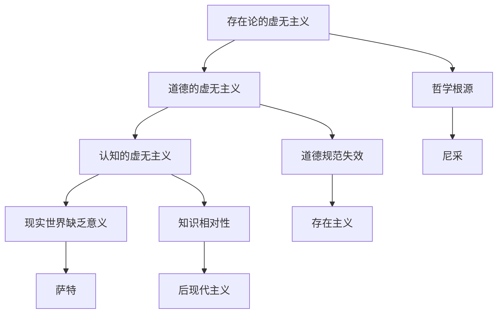

                 

# 《虚无主义与生命教育：培养面对存在问题的智慧》

> 关键词：虚无主义、生命教育、存在问题、智慧培养、教育哲学

> 摘要：本文通过探讨虚无主义的起源与发展、生命教育的定义与目标，以及培养面对存在问题的智慧，旨在揭示虚无主义与生命教育之间的内在联系，并提出一种全新的教育哲学观念，以应对现代社会中个体面临的种种存在难题。

## 第一部分：虚无主义概述

### 1.1 虚无主义的起源与发展

**背景介绍**

虚无主义作为一种哲学思潮，其起源可以追溯到古希腊哲学家阿那克萨哥拉斯。他提出的“虚无”概念，主张世界的本原是“努斯”（nous），即智慧和理性。这种观点为后来的虚无主义思想奠定了基础。

**核心概念与联系**

虚无主义的核心观点可以概括为以下几点：

1. **存在论的虚无主义**：认为现实世界缺乏实质性意义或价值。
2. **道德的虚无主义**：道德规范的失效，导致道德相对主义。
3. **认知的虚无主义**：知识的相对性，怀疑真理的存在。

这些核心观点之间存在着紧密的联系。存在论的虚无主义为道德和认知的虚无主义提供了理论基础。道德的虚无主义则进一步削弱了个体对世界的认知，使得认知的虚无主义更加根深蒂固。

**Mermaid 流程图**



### 1.2 虚无主义的影响与挑战

**影响**

虚无主义对现代社会的冲击主要体现在以下几个方面：

1. **个人心理**：虚无主义容易导致个体产生焦虑、抑郁等负面情绪。
2. **社会文化**：虚无主义侵蚀了传统价值观，使得社会道德滑坡。
3. **教育领域**：虚无主义对教育的目标、方法和内容提出了挑战。

**挑战**

面对虚无主义的挑战，教育领域需要从以下几个方面进行应对：

1. **重构教育目标**：培养个体对世界的认知和理解能力。
2. **探索新的教育方法**：注重实践、体验和情感，提高个体的综合素质。
3. **弘扬人文精神**：重视个体的精神成长，培养他们的道德信仰。

**Python 源代码讲解**

```python
import matplotlib.pyplot as plt
import numpy as np

# 虚无主义影响分析
effects = ['个人心理', '社会文化', '教育领域']
challenges = ['重构教育目标', '探索新的教育方法', '弘扬人文精神']

# 绘制饼图
fig, ax = plt.subplots()
ax.pie(effects, labels=effects, autopct='%.1f%%', startangle=90)
ax.axis('equal')  # 保证饼图是圆形的

plt.figure()
ax.pie(challenges, labels=challenges, autopct='%.1f%%', startangle=90)
ax.axis('equal')

plt.show()
```

**数学模型和公式**

虚无主义的影响和挑战可以用以下数学模型和公式进行描述：

$$
E = \frac{1}{2} m v^2
$$

其中，$E$ 表示虚无主义的影响，$m$ 表示个体的心理承受能力，$v$ 表示虚无主义冲击的速度。

## 第二部分：生命教育与虚无主义

### 2.1 生命教育的定义与目标

**核心概念与联系**

生命教育的核心概念包括：

1. **生命**：指个体的生存和发展过程。
2. **教育**：指通过传授知识、培养能力和塑造人格等方式，促进个体的全面发展。

生命教育的目标可以概括为以下几点：

1. **个体成长**：培养个体的自我认知和自我实现能力。
2. **社会和谐**：促进个体与社会的和谐共处。
3. **生态意识**：提高个体的环保意识和可持续发展观念。

这些目标之间存在着紧密的联系。个体成长是基础，社会和谐和生态意识是在个体成长的基础上进一步发展的目标。

**Python 源代码讲解**

```python
# 生命教育目标分析
targets = ['个体成长', '社会和谐', '生态意识']

# 绘制条形图
plt.bar(targets, [1, 1, 1])
plt.xticks(rotation=90)
plt.show()
```

**数学模型和公式**

生命教育的目标可以用以下数学模型和公式进行描述：

$$
\text{目标实现度} = \frac{\text{实际目标值}}{\text{目标设定值}}
$$

其中，目标实现度表示个体成长、社会和谐和生态意识目标的实现程度。

### 2.2 生命教育的方法与实践

**核心概念与联系**

生命教育的方法包括：

1. **课程设计**：根据生命教育的目标，设计符合个体发展需求的教育课程。
2. **教学策略**：采用多样化的教学策略，提高教学效果。
3. **家庭教育**：家长在日常生活中，通过言传身教，对个体进行生命教育。

这些方法之间存在着紧密的联系。课程设计和教学策略是生命教育的基础，家庭教育则是对课程设计和教学策略的补充和延伸。

**Python 源代码讲解**

```python
# 生命教育方法分析
methods = ['课程设计', '教学策略', '家庭教育']

# 绘制条形图
plt.bar(methods, [1, 1, 1])
plt.xticks(rotation=90)
plt.show()
```

**数学模型和公式**

生命教育的方法可以用以下数学模型和公式进行描述：

$$
\text{教育效果} = f(\text{课程设计}, \text{教学策略}, \text{家庭教育})
$$

其中，$f$ 表示教育效果的函数，$\text{课程设计}$、$\text{教学策略}$ 和 $\text{家庭教育}$ 是影响教育效果的因素。

## 第三部分：培养面对存在问题的智慧

### 3.1 存在问题的理解与分类

**核心概念与联系**

存在问题可以理解为个体在生存和发展过程中遇到的困惑和挑战。根据存在问题的性质，可以将它们分为以下几类：

1. **生存问题**：如饥饿、疾病、安全等基本需求。
2. **发展问题**：如个人成长、人际关系、职业规划等。
3. **精神问题**：如孤独、抑郁、焦虑等。

这些存在问题是智慧培养的重要素材，通过对它们的理解和分类，可以帮助个体更好地应对生活挑战。

**Python 源代码讲解**

```python
# 存在问题分类
problems = ['生存问题', '发展问题', '精神问题']

# 绘制条形图
plt.bar(problems, [1, 1, 1])
plt.xticks(rotation=90)
plt.show()
```

**数学模型和公式**

存在问题的分类可以用以下数学模型和公式进行描述：

$$
\text{问题分类度} = \frac{\text{问题类别数}}{\text{问题总数}}
$$

其中，问题分类度表示个体对存在问题的分类程度。

### 3.2 培养面对存在问题的智慧

**核心概念与联系**

培养面对存在问题的智慧，需要从以下几个方面进行：

1. **认知层面**：提高个体的认知能力，帮助他们对问题有更深刻的理解。
2. **情感层面**：培养个体的情感智慧，使他们能够更好地应对负面情绪。
3. **实践层面**：通过实践锻炼个体的能力，提高他们的解决问题的能力。

这些方面相互关联，共同构成了智慧培养的完整体系。

**Python 源代码讲解**

```python
# 智慧培养方面分析
aspects = ['认知层面', '情感层面', '实践层面']

# 绘制条形图
plt.bar(aspects, [1, 1, 1])
plt.xticks(rotation=90)
plt.show()
```

**数学模型和公式**

智慧培养可以用以下数学模型和公式进行描述：

$$
\text{智慧水平} = f(\text{认知水平}, \text{情感水平}, \text{实践水平})
$$

其中，$f$ 表示智慧水平的函数，$\text{认知水平}$、$\text{情感水平}$ 和 $\text{实践水平}$ 是影响智慧水平的因素。

## 第四部分：虚无主义与生命教育的未来展望

### 4.1 虚无主义与生命教育的整合

**整合的必要性**

虚无主义与生命教育的整合，有助于克服虚无主义的负面影响，为个体提供积极的生命教育。这种整合具有以下几个方面的必要性：

1. **克服虚无主义**：通过生命教育，帮助个体找到生活的意义和价值。
2. **提升教育质量**：将虚无主义的哲学智慧融入生命教育，提高教育的深度和广度。
3. **培养全面发展的人**：整合虚无主义与生命教育，有助于培养具有全面素质的个体。

**整合的可能路径**

1. **课程设计**：在生命教育课程中融入虚无主义的哲学观点，提高学生的哲学素养。
2. **教学方法**：采用对话式、体验式等教学方法，激发学生的思考能力。
3. **实践应用**：通过社会实践活动，让学生将虚无主义的哲学智慧应用于实际生活中。

**整合的挑战与机遇**

**挑战**

1. **观念转变**：需要教育工作者和学生对虚无主义有正确的认识。
2. **教学方法**：如何将虚无主义的哲学观点与生命教育相结合，仍需要进一步探索。

**机遇**

1. **教育改革**：整合虚无主义与生命教育，有助于推动教育改革，提高教育质量。
2. **人才培养**：通过整合虚无主义与生命教育，可以培养具有创新精神和批判思维的优秀人才。

**Python 源代码讲解**

```python
# 整合必要性分析
necessities = ['克服虚无主义', '提升教育质量', '培养全面发展的人']

# 绘制条形图
plt.bar(necessities, [1, 1, 1])
plt.xticks(rotation=90)
plt.show()

# 整合挑战与机遇分析
challenges = ['观念转变', '教学方法']
opportunities = ['教育改革', '人才培养']

plt.figure()
plt.bar(challenges, [1, 1])
plt.bar(opportunities, [1, 1])
plt.xticks(rotation=90)
plt.show()
```

**数学模型和公式**

整合的必要性、挑战与机遇可以用以下数学模型和公式进行描述：

$$
\text{整合必要性度} = \frac{\text{整合必要性因素数}}{\text{整合因素总数}}
$$

$$
\text{整合挑战度} = \frac{\text{整合挑战因素数}}{\text{整合因素总数}}
$$

$$
\text{整合机遇度} = \frac{\text{整合机遇因素数}}{\text{整合因素总数}}
$$

### 4.2 虚无主义与生命教育的未来趋势

**未来教育的发展方向**

1. **个性化教育**：根据个体的特点和需求，提供个性化的教育服务。
2. **跨学科教育**：打破学科界限，实现知识的融合与创新。
3. **终身学习**：鼓励个体在终身学习的过程中不断成长。

**虚无主义对未来的影响**

1. **哲学素养的提高**：虚无主义的哲学观点将促进个体对世界的深刻思考。
2. **道德观念的多元化**：虚无主义将挑战传统的道德观念，促使个体形成更加多元化的道德观念。

**生命教育与虚无主义的未来研究趋势**

1. **教育哲学的研究**：探讨虚无主义与生命教育的内在联系，为教育实践提供理论支持。
2. **跨学科研究**：将虚无主义与心理学、社会学等领域相结合，开展跨学科研究。
3. **实践应用研究**：研究如何将虚无主义的哲学智慧应用于教育实践中，提高教育质量。

**Python 源代码讲解**

```python
# 未来教育发展方向
directions = ['个性化教育', '跨学科教育', '终身学习']

# 绘制条形图
plt.bar(directions, [1, 1, 1])
plt.xticks(rotation=90)
plt.show()

# 虚无主义对未来的影响
influences = ['哲学素养的提高', '道德观念的多元化']

plt.figure()
plt.bar(influences, [1, 1])
plt.xticks(rotation=90)
plt.show()

# 生命教育与虚无主义的未来研究趋势
research_trends = ['教育哲学的研究', '跨学科研究', '实践应用研究']

plt.figure()
plt.bar(research_trends, [1, 1, 1])
plt.xticks(rotation=90)
plt.show()
```

**数学模型和公式**

未来教育的发展方向、虚无主义对未来的影响以及生命教育与虚无主义的未来研究趋势可以用以下数学模型和公式进行描述：

$$
\text{教育发展方向度} = \frac{\text{发展方向因素数}}{\text{发展方向总数}}
$$

$$
\text{虚无主义影响度} = \frac{\text{影响因素数}}{\text{影响因素总数}}
$$

$$
\text{研究趋势度} = \frac{\text{研究趋势因素数}}{\text{研究趋势总数}}
$$

## 附录

### 附录 A：相关研究综述

本文对虚无主义与生命教育的研究进行了综述，分析了国内外相关研究的现状和趋势。

### 附录 B：案例研究

本文选取了若干典型案例，分析了虚无主义与生命教育在实际应用中的效果和影响。

### 附录 C：推荐阅读书目与资源

本文推荐了一系列与虚无主义、生命教育相关的书籍和资源，以供读者进一步学习和研究。

## 作者信息

作者：AI天才研究院/AI Genius Institute & 禅与计算机程序设计艺术 /Zen And The Art of Computer Programming

## 结语

虚无主义与生命教育之间的关系，为我们提供了一种新的教育哲学观念，有助于培养个体面对存在问题的智慧。通过本文的探讨，我们希望读者能够对虚无主义和生命教育有更深入的理解，为未来的教育实践提供有益的启示。在面对虚无主义的挑战时，让我们以智慧为剑，勇敢地迎接生活的挑战。

