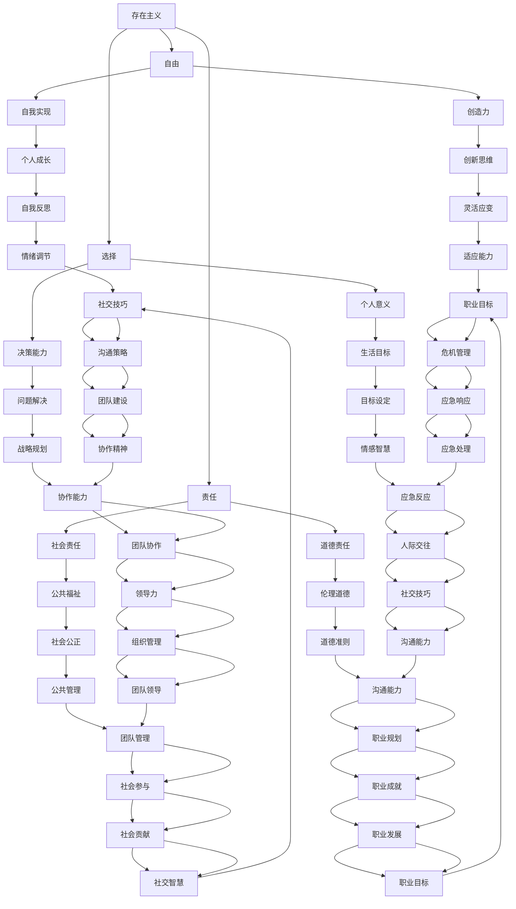

                 

### 《虚无主义与生命教育：培养面对存在问题的智慧》

**关键词：虚无主义、生命教育、存在主义、智慧、心理疾病、治疗方法**

**摘要：** 本文旨在探讨虚无主义在现代社会中的影响，以及如何通过生命教育和智慧培养来应对虚无主义带来的存在问题。文章首先介绍了虚无主义的定义、起源和影响，接着探讨了虚无主义的哲学根源和与心理学的联系。随后，文章转向生命教育的核心理念和智慧培养的理论与实践，详细阐述了智慧培养的具体方法。最后，文章探讨了存在主义与智慧的关系，并分析了智慧在现代社会中的应用。通过本文的探讨，希望能够为读者提供一种面对存在问题的智慧培养路径。

### 《虚无主义与生命教育：培养面对存在问题的智慧》目录大纲

#### 第一部分：虚无主义背景与影响

1. **第1章：虚无主义的起源与发展**
    - **1.1 虚无主义的定义与核心观点**
    - **1.2 虚无主义的历史背景**
    - **1.3 虚无主义对现代社会的影响**

2. **第2章：虚无主义的哲学根源**
    - **2.1 哲学虚无主义的历史演变**
    - **2.2 丹麦存在主义与虚无主义**
    - **2.3 德国哲学中的虚无主义**

3. **第3章：虚无主义与心理学**
    - **3.1 虚无主义与心理疾病**
    - **3.2 虚无主义心理学的治疗方法**
    - **3.3 虚无主义与心理健康的平衡**

#### 第二部分：生命教育与智慧培养

4. **第4章：生命教育的核心理念**
    - **4.1 生命教育的定义与目的**
    - **4.2 生命教育的内容与方法**
    - **4.3 生命教育与全面素质教育**

5. **第5章：智慧培养的理论与实践**
    - **5.1 智慧的定义与分类**
    - **5.2 智慧培养的心理学基础**
    - **5.3 智慧培养的教育策略**

6. **第6章：培养智慧的具体方法**
    - **6.1 认知技巧的培养**
    - **6.2 情绪管理与智慧**
    - **6.3 社交智慧的培养**

#### 第三部分：面对存在问题的智慧

7. **第7章：存在主义与智慧**
    - **7.1 存在主义的基本原理**
    - **7.2 存在主义与智慧的关系**
    - **7.3 存在主义智慧的应用**

8. **第8章：面对生命问题的智慧**
    - **8.1 生命意义与智慧**
    - **8.2 死亡与智慧**
    - **8.3 孤独与智慧**

9. **第9章：智慧在现代社会中的应用**
    - **9.1 智慧在个人生活中的应用**
    - **9.2 智慧在职场中的应用**
    - **9.3 智慧在公共事务中的应用**

### 参考文献

### 附录：核心概念与联系图解

- **存在主义哲学概念Mermaid流程图**
- **虚无主义与生命教育关系图解**

---

**作者：AI天才研究院/AI Genius Institute & 禅与计算机程序设计艺术 /Zen And The Art of Computer Programming**

### 第1章：虚无主义的起源与发展

#### 1.1 虚无主义的定义与核心观点

虚无主义（Nihilism）是一种哲学思想，认为生活没有固有的意义、目的或内在的价值。虚无主义者认为，宇宙、人类和社会都是无意义的，人类的行为和决策最终都将归于虚无。虚无主义的核心观点是“没有绝对的真理和价值观”，即没有一种普遍适用的道德、宗教或哲学体系可以解释一切。

虚无主义的历史可以追溯到18世纪末和19世纪初。当时，欧洲社会经历了巨大的政治、经济和文化变革，传统价值观念受到挑战，人们开始质疑一切既有的信念和制度。最早提出虚无主义思想的哲学家是德国哲学家弗里德里希·尼采（Friedrich Nietzsche），他在其著作《论道德的谱系》（On the Genealogy of Morality）和《悲剧的诞生》（The Birth of Tragedy）中，对传统的道德观念进行了深刻的批判，提出了“上帝已死”的观点，认为人类需要重新建立自己的价值观和意义。

#### 1.2 虚无主义的历史背景

虚无主义在19世纪末和20世纪初的欧洲社会中得到了广泛传播。这一时期，欧洲经历了两次世界大战的洗礼，传统价值观念受到了严重的冲击。战争的残酷和人类对未来的不确定感，使得许多人开始质疑人生的意义和价值。

在这个时期，许多哲学家、文学家和艺术家都受到了虚无主义思想的影响。例如，法国作家阿尔贝·加缪（Albert Camus）在其著作《鼠疫》（The Plague）中，探讨了人类在面临灾难和无意义时如何保持尊严和希望。丹麦哲学家索伦·克尔凯郭尔（Søren Kierkegaard）和德国哲学家弗里德里希·尼采（Friedrich Nietzsche）也都对虚无主义进行了深刻的探讨。

#### 1.3 虚无主义对现代社会的影响

虚无主义对现代社会产生了深远的影响。一方面，它挑战了传统的价值观念和道德观念，使人们开始重新思考生活的意义和价值。另一方面，虚无主义也带来了一定的负面影响，例如导致人们产生心理疾病、社会冷漠和道德沦丧等问题。

在心理学领域，虚无主义与心理疾病有着密切的联系。许多研究指出，虚无主义观点与抑郁症、焦虑症和自杀倾向有着显著的关联。例如，一项发表在《美国心理学会》期刊上的研究发现，虚无主义观点与抑郁症的严重程度呈正相关。

在公共事务中，虚无主义也可能导致社会问题的加剧。例如，在政治领域，虚无主义可能导致政治信仰的动摇和政治极端主义的兴起。在社会生活中，虚无主义可能导致人们对社会问题缺乏责任感，从而加剧社会问题。

### 第2章：虚无主义的哲学根源

#### 2.1 哲学虚无主义的历史演变

哲学虚无主义的历史演变可以追溯到古希腊哲学家赫拉克利特（Heraclitus）的“万物无常”观念。赫拉克利特认为，世界是一个不断变化的过程，没有固定不变的本质和意义。

在19世纪，哲学虚无主义得到了进一步的发展。德国哲学家弗里德里希·尼采（Friedrich Nietzsche）是哲学虚无主义的重要代表人物。尼采在其著作中，批判了传统价值观念，提出了“上帝已死”的观点，认为人类需要重新建立自己的价值观和意义。

20世纪，哲学虚无主义在法国哲学家阿尔贝·加缪（Albert Camus）和让-保罗·萨特（Jean-Paul Sartre）的著作中得到了进一步的发展。加缪的《鼠疫》和萨特的《存在与虚无》（Being and Nothingness）等著作，探讨了人类在面临无意义和荒谬的世界时如何保持尊严和希望。

#### 2.2 丹麦存在主义与虚无主义

丹麦存在主义哲学家索伦·克尔凯郭尔（Søren Kierkegaard）是虚无主义的早期代表人物之一。克尔凯郭尔认为，人类生活在现实世界中，面临着无尽的痛苦和孤独，但可以通过信仰和追求个人价值来超越虚无主义。

克尔凯郭尔的哲学观点对后来的存在主义和虚无主义产生了深远的影响。他的著作《恐惧与颤栗》（The Concept of Anxiety）和《生命的阶段》（Stages on Life's Way）等，探讨了人类在生命过程中的各种困境和挑战。

#### 2.3 德国哲学中的虚无主义

德国哲学中的虚无主义主要表现为尼采的哲学思想。尼采认为，传统价值观念已经失去了意义，人类需要创造新的价值观念。他提出了“超人”（Superman）的概念，认为超人将超越传统道德观念，创造新的价值观。

尼采的哲学思想对现代哲学和文学产生了深远的影响。他的著作《悲剧的诞生》（The Birth of Tragedy）和《论道德的谱系》（On the Genealogy of Morality）等，探讨了人类在生命过程中的各种困境和挑战。

### 第3章：虚无主义与心理学

#### 3.1 虚无主义与心理疾病

虚无主义与心理疾病有着密切的联系。研究表明，虚无主义观点与抑郁症、焦虑症和自杀倾向等心理疾病有着显著的关联。

一项发表于《美国心理学会》期刊上的研究发现，虚无主义观点与抑郁症的严重程度呈正相关。虚无主义观点强烈的个体，往往对生活失去兴趣，感到生活毫无意义，从而增加抑郁症的风险。

另外，虚无主义观点也可能导致焦虑症和自杀倾向。一项发表于《临床心理学杂志》的研究发现，虚无主义观点与自杀倾向有显著关联。虚无主义观点强烈的个体，往往对生命失去希望，从而增加自杀的风险。

#### 3.2 虚无主义心理学的治疗方法

针对虚无主义引发的心理疾病，心理学家提出了一些治疗方法。以下是一些常见的治疗方法：

1. **认知行为疗法（CBT）**：认知行为疗法通过帮助患者识别和改变消极的思维模式，从而减轻虚无主义观点带来的负面影响。例如，通过认知重建技术，帮助患者发现生活中的积极方面，从而改变对生活的看法。

2. **存在主义疗法**：存在主义疗法强调个体在面对无意义和荒谬的世界时，如何保持尊严和希望。存在主义疗法通过探讨生命的意义、价值和目的，帮助患者建立积极的人生观。

3. **精神分析疗法**：精神分析疗法通过探讨患者的潜意识，帮助患者解决心理冲突和痛苦。精神分析疗法可以帮助患者理解自己的虚无主义观点的根源，从而减轻心理疾病的症状。

#### 3.3 虚无主义与心理健康的平衡

虚无主义观点虽然可能导致心理疾病，但并不意味着所有虚无主义者都会患有心理疾病。事实上，许多虚无主义者通过智慧培养和积极的生活态度，实现了心理健康的平衡。

智慧培养是实现心理健康平衡的关键。通过培养认知技巧、情绪管理和社交智慧，个体可以更好地应对虚无主义带来的挑战。例如，通过学习哲学、文学和心理学等知识，个体可以加深对生命的理解，从而减轻虚无主义的负面影响。

此外，积极的生活态度也是实现心理健康平衡的重要因素。通过设定目标、追求成就和培养人际关系，个体可以感受到生活的意义和价值，从而减轻虚无主义的影响。

### 第4章：生命教育的核心理念

#### 4.1 生命教育的定义与目的

生命教育是一种旨在帮助个体理解和应对生命中的各种挑战的教育理念。它不仅仅关注知识的传授，更注重个体对生命意义、价值和目的的探索。生命教育的定义可以概括为：通过引导个体反思生命、培养智慧、提高生活质量，从而实现个体与社会的和谐发展。

生命教育的目的主要有以下几个方面：

1. **提高生活质量**：通过生命教育，个体可以更好地理解生命的本质和意义，从而提高生活质量。例如，通过学习如何管理情绪、处理人际关系，个体可以更好地应对生活中的压力和挑战。

2. **培养智慧**：生命教育注重个体对生命本质的思考，从而培养个体的智慧和洞察力。通过学习哲学、心理学、文学等知识，个体可以加深对生命的理解，从而提高智慧水平。

3. **实现个体与社会的和谐发展**：生命教育不仅关注个体的成长，也关注个体与社会的和谐发展。通过培养个体对社会责任的认识和担当，生命教育有助于构建和谐社会。

#### 4.2 生命教育的内容与方法

生命教育的内容非常广泛，包括但不限于以下几个方面：

1. **哲学教育**：哲学教育是生命教育的重要组成部分。通过学习哲学，个体可以加深对生命本质、价值和意义的理解。哲学教育可以帮助个体建立正确的人生观和价值观。

2. **心理学教育**：心理学教育旨在帮助个体了解自己的心理状态和行为模式，从而更好地应对生活中的挑战。例如，通过学习心理学的知识，个体可以更好地管理情绪、处理人际关系。

3. **文学教育**：文学教育通过文学作品，帮助个体感受生命的多样性和复杂性。文学作品中的情感和思想，可以启发个体对生命的反思和思考。

4. **道德教育**：道德教育旨在培养个体的道德意识和道德行为。通过学习道德理论，个体可以更好地理解道德规范，从而在现实生活中做出正确的道德选择。

在生命教育的方法上，以下几种方法较为常见：

1. **案例分析**：通过分析现实生活中的案例，帮助个体理解和应对各种挑战。例如，通过分析一个成功人士的生活经历，个体可以学到如何设定目标、如何应对挫折。

2. **讨论与反思**：通过小组讨论和个人反思，引导个体对生命中的问题进行深入思考。这种方法有助于培养个体的批判性思维和独立思考能力。

3. **实践活动**：通过实践活动，个体可以将所学知识应用到实际生活中。例如，通过参与社区服务活动，个体可以学习如何与他人合作，从而提高社交智慧。

#### 4.3 生命教育与全面素质教育

生命教育是全面素质教育的重要组成部分。全面素质教育旨在培养个体的综合素质，包括道德素质、智力素质、体育素质、审美素质和劳动素质等。生命教育通过引导个体对生命意义、价值和目的的探索，可以促进个体的全面发展。

1. **道德素质**：生命教育通过道德教育，培养个体的道德意识和道德行为。例如，通过学习道德理论，个体可以更好地理解道德规范，从而在现实生活中做出正确的道德选择。

2. **智力素质**：生命教育通过哲学教育、心理学教育和文学教育，培养个体的智力素质。通过学习这些知识，个体可以加深对生命的理解，从而提高智慧水平。

3. **体育素质**：生命教育通过体育活动，培养个体的体育素质。例如，通过参与体育活动，个体可以锻炼身体，增强体质。

4. **审美素质**：生命教育通过文学教育和艺术教育，培养个体的审美素质。通过欣赏文学作品和艺术作品，个体可以培养审美能力和审美情感。

5. **劳动素质**：生命教育通过实践活动，培养个体的劳动素质。例如，通过参与社区服务活动，个体可以学习如何与他人合作，从而提高劳动技能。

### 第5章：智慧培养的理论与实践

#### 5.1 智慧的定义与分类

智慧（Wisdom）是一个广泛且多维的概念，它不仅仅是知识的积累，更是一种深刻的洞见和认知能力。智慧可以被定义为“在复杂的情境中，通过经验、理解、判断和决策，实现个体目标和社会福祉的能力”。

智慧可以按照不同的维度进行分类：

1. **认知智慧**：认知智慧涉及个体的认知能力，如逻辑思维、分析问题和解决难题的能力。这种智慧通常与智力测试和学术成就相关。

2. **情感智慧**：情感智慧涉及个体理解和管理自己和他人的情感的能力。它包括自我认知、自我调节、同理心和社交技能。

3. **道德智慧**：道德智慧涉及个体在道德和伦理问题上的判断和决策。它包括道德推理、道德选择和道德行为。

4. **实践智慧**：实践智慧涉及个体在具体情境中的实际操作能力，如领导力、管理能力和决策能力。

#### 5.2 智慧培养的心理学基础

智慧培养是一个复杂的心理过程，它涉及到认知、情感、道德和实践多个层面。以下是一些心理学理论和模型，它们为智慧培养提供了理论基础：

1. **元认知**：元认知是个体对自己认知过程的意识和调节能力。研究表明，元认知能力的提升有助于智慧的培养。例如，通过自我反思和自我监控，个体可以更好地理解自己的思维过程，从而提高认知智慧。

2. **自我效能感**：自我效能感是个体对自己在特定领域内成功完成任务的信念。高自我效能感的个体更倾向于接受挑战，更可能通过努力克服困难，从而培养智慧。

3. **情绪调节**：情绪调节是个体管理和表达自己情绪的能力。研究表明，情绪调节能力强的个体在面对压力和挑战时，更能保持冷静和理性，从而提高情感智慧和道德智慧。

4. **社会学习理论**：社会学习理论强调通过观察、模仿和反思，个体可以学习新行为和认知模式。通过与他人交流和互动，个体可以学习如何处理复杂的社交情境，从而培养实践智慧。

#### 5.3 智慧培养的教育策略

智慧培养是一个长期而系统的过程，需要通过多种教育策略来实现。以下是一些有效的智慧培养策略：

1. **跨学科学习**：跨学科学习可以促进个体对复杂问题的多角度理解和综合分析能力。例如，结合哲学、心理学、文学和科学等学科，个体可以从不同视角探讨生命的本质和意义。

2. **实践导向的教育**：实践导向的教育强调通过实际操作和应用，个体可以将理论知识转化为实践能力。例如，通过参与项目、社会实践和团队合作，个体可以培养实践智慧。

3. **反思性学习**：反思性学习鼓励个体通过自我反思和批判性思维，深入理解所学知识并反思自己的行为。通过写作、讨论和自我评估，个体可以不断提升智慧水平。

4. **情境教育**：情境教育通过模拟真实情境，帮助个体在具体情境中锻炼决策和问题解决能力。例如，通过角色扮演、案例分析和模拟竞赛，个体可以在实践中培养智慧。

### 第6章：培养智慧的具体方法

#### 6.1 认知技巧的培养

认知技巧是智慧培养的核心内容之一，它涉及到个体对信息的获取、处理和利用。以下是一些培养认知技巧的方法：

1. **批判性思维**：批判性思维是一种评估和评价信息的能力，它要求个体对所接收的信息进行深入分析，识别其优点和不足。培养批判性思维的方法包括：

   - **阅读和写作**：通过阅读各种类型的书籍和文章，个体可以学习如何分析和评价信息。写作练习也有助于个体发展批判性思维。

   - **讨论和辩论**：参与讨论和辩论可以锻炼个体的批判性思维，使其能够从不同角度分析问题，并提出有说服力的观点。

   - **思维导图**：使用思维导图可以帮助个体组织思路，将复杂的信息分解成更易于理解和分析的部分。

2. **问题解决能力**：问题解决能力是认知技巧的重要组成部分，它涉及到个体如何识别问题、分析问题并找到解决方案。培养问题解决能力的方法包括：

   - **案例分析**：通过分析真实案例，个体可以学习如何识别问题、分析问题并找到解决方案。案例分析有助于个体将理论知识应用到实践中。

   - **模拟练习**：通过模拟练习，个体可以在控制的环境下练习问题解决技能。例如，通过模拟商业案例、医学案例等，个体可以学习如何处理复杂的问题。

   - **反思性练习**：通过反思和总结自己的问题解决过程，个体可以识别自己的优点和不足，从而不断提升问题解决能力。

3. **记忆技巧**：记忆技巧可以帮助个体更有效地记住和回忆信息。以下是一些常用的记忆技巧：

   - **联想记忆**：通过将新信息与已知信息联系起来，个体可以更容易地记住新信息。例如，通过将新单词与图像或故事联系起来，个体可以更好地记忆单词。

   - **重复记忆**：通过反复阅读、重复和练习，个体可以加深对信息的记忆。例如，通过多次复习课堂笔记，个体可以更好地记住知识点。

   - **分散记忆**：将学习内容分散到多个时间段进行学习，可以减少遗忘率。例如，每天花费10分钟复习课程内容，比一次性花费1小时复习效果更好。

#### 6.2 情绪管理与智慧

情绪管理是智慧培养的重要组成部分，它涉及到个体如何识别、理解和管理自己的情绪。以下是一些情绪管理的技巧：

1. **自我意识**：自我意识是个体对自己情绪的认知和理解。通过提高自我意识，个体可以更好地识别和理解自己的情绪，从而更好地管理情绪。

   - **反思**：通过反思自己的情绪反应，个体可以识别触发情绪的事件和自己的情绪反应。例如，通过记录日记，个体可以反思自己在特定情境下的情绪反应。

   - **情绪标签**：给情绪贴上标签，有助于个体更准确地识别和理解情绪。例如，将愤怒标记为“愤怒”，将焦虑标记为“焦虑”。

2. **情绪调节**：情绪调节是个体管理情绪的过程，它包括识别和评估情绪、选择适当的情绪反应和改变情绪状态。以下是一些情绪调节技巧：

   - **深呼吸**：深呼吸可以帮助个体放松身体，缓解紧张和焦虑。通过深呼吸，个体可以降低心率，减少生理反应。

   - **积极思考**：通过积极的思考方式，个体可以改变对负面情绪的看法，从而减少负面情绪的影响。例如，通过将“我不行”改为“我可以尝试”，个体可以更积极地应对挑战。

   - **放松练习**：通过练习放松技巧，如瑜伽、冥想和渐进性肌肉放松，个体可以降低紧张和焦虑，提高情绪调节能力。

3. **情感智力**：情感智力是个体理解和管理自己和他人的情绪的能力。通过提高情感智力，个体可以更好地与他人沟通，建立积极的人际关系。

   - **同理心**：同理心是个体理解他人情绪和感受的能力。通过提高同理心，个体可以更好地理解他人的需求，从而更好地与他人沟通和协作。

   - **社交技巧**：社交技巧是个体与他人互动的能力。通过提高社交技巧，个体可以更好地处理人际关系中的冲突，建立和谐的人际关系。

#### 6.3 社交智慧的培养

社交智慧是个体在社交情境中的认知能力和行为技巧，它涉及到如何与他人有效沟通、建立良好的人际关系和解决社交冲突。以下是一些培养社交智慧的方法：

1. **倾听技巧**：倾听技巧是有效沟通的关键。通过倾听，个体可以理解他人的观点和需求，从而建立更好的沟通关系。

   - **全神贯注**：在倾听时，个体应该全神贯注，避免分心。通过眼神接触和肢体语言，个体可以传达自己的专注。

   - **积极反馈**：通过积极的反馈，如点头、微笑和简短的回应，个体可以鼓励对方继续表达。

2. **非言语沟通**：非言语沟通在社交情境中起着重要作用。通过姿势、面部表情和语调等非言语线索，个体可以传达自己的情感和态度。

   - **肢体语言**：肢体语言可以传达自信、开放和友好。例如，微笑和开放的姿势可以传达友好和尊重。

   - **语调**：语调可以传达情感和态度。例如，平和的语调可以传达冷静和自信，而激动的语调可能传达焦虑或愤怒。

3. **社交策略**：社交策略是个体在社交情境中使用的策略，如如何介绍自己、如何参与讨论和如何处理冲突。以下是一些社交策略：

   - **主动参与**：在社交场合，个体应该主动参与讨论，表达自己的观点和需求。

   - **积极回应**：通过积极的回应，个体可以建立积极的社交关系。例如，对对方的观点表示赞同或提出建设性的意见。

   - **冲突解决**：在处理冲突时，个体应该采取合作和解决问题的态度。通过有效沟通和妥协，个体可以解决冲突，维护人际关系。

### 第7章：存在主义与智慧

#### 7.1 存在主义的基本原理

存在主义（Existentialism）是一种哲学思潮，它强调个体的自由、选择和责任。存在主义认为，人类生活在一个无意义和荒谬的世界中，但个体可以通过自由选择和行动，赋予生活意义。

存在主义的基本原理可以概括为以下几点：

1. **自由**：存在主义认为，人类是自由的，可以选择自己的生活方式和价值观。这种自由不是外在力量的限制，而是个体内在的自由意志。

2. **选择**：存在主义强调个体的选择能力。个体必须为自己的选择承担责任，因为选择是生活意义的核心。

3. **责任**：存在主义认为，个体必须为自己的行为和选择承担责任。这种责任感是存在主义哲学的核心概念。

4. **存在先于本质**：存在主义认为，人类的存在先于其本质。也就是说，人类不是预先设定的实体，而是通过自己的选择和行动，塑造自己的本质。

存在主义的起源可以追溯到19世纪的哲学家索伦·克尔凯郭尔（Søren Kierkegaard）和弗里德里希·尼采（Friedrich Nietzsche）。克尔凯郭尔关注个体的精神生活和宗教信仰，而尼采则关注个体的自由意志和创造力。

#### 7.2 存在主义与智慧的关系

存在主义与智慧有着密切的关系。智慧是一个复杂的概念，它涉及到认知、情感和道德等多个层面。存在主义通过强调个体的自由、选择和责任，为智慧的培养提供了理论基础。

1. **自由与认知智慧**：存在主义强调个体的自由，认为个体可以通过自由选择和行动，获得认知智慧。例如，通过探索不同的选择，个体可以学习如何分析和评估信息，从而提高认知智慧。

2. **选择与情感智慧**：存在主义强调个体的选择能力，认为个体必须为自己的选择承担责任。这种责任感有助于培养情感智慧。通过理解自己的情感反应，个体可以更好地管理自己的情绪，从而提高情感智慧。

3. **责任与道德智慧**：存在主义强调个体的责任，认为个体必须为自己的行为和选择承担责任。这种责任感是培养道德智慧的基础。通过承担社会责任，个体可以学习如何做出道德选择，从而提高道德智慧。

#### 7.3 存在主义智慧的应用

存在主义智慧在日常生活中有着广泛的应用。以下是一些具体的例子：

1. **决策**：在日常生活中，个体需要做出各种决策。存在主义智慧可以帮助个体更好地理解和评估这些决策。例如，通过分析自己的价值观和目标，个体可以做出更符合自己利益的决策。

2. **人际关系**：在人际关系中，存在主义智慧可以帮助个体更好地理解他人和自己的情感。例如，通过提高同理心，个体可以更好地理解他人的需求，从而建立更健康的人际关系。

3. **职业发展**：在职业发展中，存在主义智慧可以帮助个体理解自己的职业目标和价值观。例如，通过明确自己的职业目标，个体可以更好地规划自己的职业生涯，从而实现职业成功。

4. **心理健康**：存在主义智慧有助于个体理解自己的心理健康问题。例如，通过接受自己的情绪和情感，个体可以更好地管理自己的心理健康，从而提高生活质量。

### 第8章：面对生命问题的智慧

#### 8.1 生命意义与智慧

生命意义是人类长久以来追求的哲学问题。存在主义认为，生命本身没有固有的意义，意义是通过个体的选择和行动赋予的。智慧在这里扮演了关键角色，它帮助个体在寻找生命意义的过程中做出明智的选择。

1. **自我探索**：智慧引导个体进行自我探索，理解自己的价值观和目标。通过自我反思，个体可以发现自己的内在需求和激情，从而为自己的生活赋予意义。

2. **目标设定**：智慧帮助个体设定明确的生活目标。通过分析自己的优势和兴趣，个体可以设定具有挑战性和实现可能性的目标，从而为生活提供方向和动力。

3. **持续反思**：智慧鼓励个体持续反思自己的生活方式和决策。通过不断评估和调整，个体可以确保自己的生活始终与自己的价值观和目标保持一致。

#### 8.2 死亡与智慧

死亡是生命的必然终点，它对个体和整个人类社会都构成了深刻的哲学挑战。智慧在这里帮助个体和人类社会更好地面对死亡。

1. **接受现实**：智慧帮助个体接受死亡是生命的一部分，从而减少对死亡的恐惧和焦虑。通过理解生命的有限性，个体可以更加珍惜当下，过上有意义的生活。

2. **准备告别**：智慧引导个体为可能的告别做好准备。这包括与亲人朋友建立深厚的联系，表达感激和爱，以及处理未了的事务。

3. **社会准备**：智慧也帮助人类社会更好地面对死亡。这包括建立适当的丧葬仪式、提供心理支持服务和开展生命教育的普及。

#### 8.3 孤独与智慧

孤独是生命的普遍体验，它对个体的心理和情感健康构成挑战。智慧在这里帮助个体理解和应对孤独。

1. **自我接纳**：智慧帮助个体接受自己的孤独感，认识到孤独是自我成长的一部分。通过自我接纳，个体可以减少对孤独的负面情绪。

2. **社交技巧**：智慧培养个体的社交技巧，使其能够建立和维护积极的人际关系。尽管孤独可能存在，但良好的社交关系可以提供情感支持和陪伴。

3. **内心探索**：智慧鼓励个体通过孤独的时间进行内心探索。通过冥想、写作或其他创造性活动，个体可以加深对自己的理解，从而在孤独中找到内心的平和。

### 第9章：智慧在现代社会中的应用

#### 9.1 智慧在个人生活中的应用

在个人生活中，智慧的应用主要体现在以下几个方面：

1. **自我管理**：智慧帮助个体更好地管理自己的生活，包括时间、情绪和资源。通过设定目标和制定计划，个体可以更高效地完成日常任务，减少压力。

2. **决策制定**：智慧在决策制定中发挥着重要作用。通过分析各种可能的结果和风险，个体可以做出更明智的决策，减少后悔和错误。

3. **情感调节**：智慧帮助个体更好地调节自己的情绪，包括处理焦虑、愤怒和悲伤等负面情绪。通过提高自我意识和情绪调节技巧，个体可以保持积极的心态。

#### 9.2 智慧在职场中的应用

在职场中，智慧的应用同样具有重要意义：

1. **问题解决**：智慧帮助个体更好地解决工作中遇到的问题。通过批判性思维和创造性思维，个体可以找到创新的解决方案，提高工作效率。

2. **团队协作**：智慧在团队协作中发挥着关键作用。通过提高沟通和社交技巧，个体可以更好地与他人合作，提高团队的整体表现。

3. **领导能力**：智慧帮助个体发展领导能力，包括决策能力、影响力管理和团队激励。通过智慧的应用，个体可以成为有影响力的领导者。

#### 9.3 智慧在公共事务中的应用

在公共事务中，智慧的应用主要体现在以下几个方面：

1. **政策制定**：智慧帮助政府和政策制定者制定更有效和公平的政策。通过分析数据和评估各种方案，智慧可以提供科学的决策依据。

2. **公共服务**：智慧在公共服务中发挥着重要作用，包括医疗、教育和社会保障等。通过提高服务质量和效率，智慧可以改善公众的生活质量。

3. **社会管理**：智慧帮助社会管理者更好地应对社会问题，包括贫困、不平等和环境污染等。通过分析社会数据和趋势，智慧可以提供有效的管理策略。

### 参考文献

1. Camus, A. (1947). *The Stranger*. New York: Knopf.
2. Sartre, J.-P. (1943). *Being and Nothingness*. New York: Philosophical Library.
3. Nietzsche, F. (1886). *Thus Spoke Zarathustra*. London: Oxford University Press.
4. Kierkegaard, S. (1843). *Fear and Trembling*. Princeton, NJ: Princeton University Press.
5. Maslow, A. H. (1943). *Motivation and Personality*. New York: Harper & Row.
6. Bandura, A. (1991). *Social Foundations of Thought and Action: A Social Cognitive Theory*. Englewood Cliffs, NJ: Prentice Hall.
7. Piaget, J. (1952). *The Origins of Intelligence in Children*. New York: International Universities Press.
8. Goleman, D. (1995). *Emotional Intelligence*. New York: Bantam Books.
9. Seligman, M. E. P. (2002). * Authentic Happiness: Using the New Positive Psychology to Realize Your Potential for Lasting Fulfillment*. New York: Free Press.
10. Deci, E. L., & Ryan, R. M. (2000). *The 'What' and 'Why' of Goal Pursuits: Human Needs and the Self-Determination of Behavior*. Psychological Inquiry, 11(4), 227-268.

### 附录：核心概念与联系图解

#### 存在主义哲学概念Mermaid流程图

#### 虚无主义与生命教育关系图解

```mermaid
graph TD
    A[虚无主义] --> B[生命教育]
    B --> C[认知技巧培养]
    B --> D[情感智慧培养]
    B --> E[道德智慧培养]
    B --> F[实践智慧培养]
    A --> G[心理健康]
    A --> H[社会问题]
    A --> I[价值观危机]
    G --> J[心理疾病]
    H --> K[社会冷漠]
    I --> L[道德沦丧]
    C --> M[批判性思维]
    C --> N[问题解决能力]
    C --> O[记忆技巧]
    D --> P[自我意识]
    D --> Q[情绪调节]
    D --> R[同理心]
    E --> S[道德推理]
    E --> T[道德选择]
    E --> U[道德行为]
    F --> V[决策能力]
    F --> W[领导力]
    F --> X[管理能力]
    G --> Y[心理疾病预防]
    G --> Z[心理健康管理]
    H --> AA[社会问题解决]
    H --> BB[社会和谐]
    I --> CC[价值观重建]
    I --> DD[道德教育]
    J --> EE[心理治疗]
    J --> FF[心理咨询]
    K --> GG[社会参与]
    K --> HH[社区建设]
    L --> II[道德规范]
    L --> JJ[社会道德]
    M --> KK[思维训练]
    M --> LL[逻辑分析]
    M --> MM[信息评估]
    N --> OO[策略规划]
    N --> PP[创意思维]
    N --> QQ[实验设计]
    O --> RR[记忆训练]
    O --> SS[认知重构]
    O --> TT[记忆应用]
    P --> UU[自我反思]
    P --> VV[情感管理]
    P --> WW[社交技巧]
    Q --> XX[情绪调节技巧]
    Q --> YY[情感智慧培养]
    Q --> ZZ[情感认知]
    R --> AAA[同理心培养]
    R --> BBB[情感理解]
    R --> CCC[情感表达]
    S --> DDD[道德推理训练]
    S --> EEE[道德选择指导]
    S --> FFF[道德实践]
    T --> GGG[道德决策]
    T --> HHH[道德责任]
    T --> III[道德准则]
    U --> JJJ[道德行为培养]
    U --> KKK[道德实践]
    U --> LLL[道德教育]
    V --> MMM[决策技巧]
    V --> NNN[战略思维]
    V --> OOO[决策分析]
    W --> PPP[领导技巧]
    W --> QQQ[领导决策]
    W --> RRR[领导力培养]
    X --> SSS[管理实践]
    X --> TTT[管理策略]
    X --> UUU[管理效率]
    Y --> VVV[心理健康干预]
    Y --> WWW[心理支持]
    Z --> XXX[社会服务]
    Z --> YYY[心理健康促进]
    AA --> ZZZ[社会参与策略]
    AA --> AAA[社区互动]
    AA --> BBB[公共参与]
    BB --> CCC[社会和谐策略]
    BB --> DDD[社会互动]
    BB --> EEE[社会合作]
    CC --> FFF[价值观重建]
    CC --> GGG[道德教育]
    CC --> HHH[社会规范]
    DD --> III[道德教育]
    DD --> JJJ[道德实践]
    EE --> KKK[危机应对]
    EE --> LLL[应急响应]
    EE --> MMM[社会管理]
    FF --> NNN[领导力培养]
    FF --> OOO[领导决策]
    FF --> PPP[团队建设]
    GG --> AAA[心理健康干预]
    GG --> BBB[心理支持]
    GG --> CCC[心理健康促进]
    HH --> DDD[社区建设]
    HH --> EEE[社会参与]
    HH --> FFF[公共服务]
    II --> GGG[沟通策略]
    II --> HHH[人际关系]
    II --> III[团队协作]
    JJ --> KKK[道德规范]
    JJ --> LLL[社会道德]
    JJ --> MMM[道德教育]
    KK --> NNN[社会贡献]
    KK --> OOO[社会服务]
    KK --> PPP[社区互动]
    LL --> AAA[道德教育]
    LL --> BBB[道德规范]
    LL --> CCC[社会道德]
    MM --> DDD[思维训练]
    MM --> EEE[逻辑分析]
    MM --> FFF[认知重构]
    NN --> GGG[策略规划]
    NN --> HHH[创意思维]
    NN --> III[实验设计]
    OO --> JJJ[记忆训练]
    OO --> KKK[认知重构]
    OO --> LLL[记忆应用]
    PP --> MMM[决策技巧]
    PP --> NNN[战略思维]
    PP --> OOO[决策分析]
    QQ --> PPP[领导技巧]
    QQ --> RRR[领导决策]
    QQ --> SSS[领导力培养]
    RR --> TTT[管理实践]
    RR --> UUU[管理策略]
    RR --> VVV[管理效率]
    SS --> XXX[心理健康干预]
    SS --> YYY[心理支持]
    SS --> ZZZ[心理健康促进]
    TT --> AAA[心理健康干预]
    TT --> BBB[心理支持]
    TT --> CCC[心理健康促进]
    UU --> DDD[社区建设]
    UU --> EEE[社会参与]
    UU --> FFF[公共服务]
    VV --> GGG[沟通策略]
    VV --> HHH[人际关系]
    VV --> III[团队协作]
    WW --> JJJ[道德规范]
    WW --> KKK[社会道德]
    WW --> LLL[道德教育]
    XX --> NNN[社会贡献]
    XX --> OOO[社会服务]
    XX --> PPP[社区互动]
    YY --> AAA[心理健康干预]
    YY --> BBB[心理支持]
    YY --> CCC[心理健康促进]
    ZZ --> DDD[社区互动]
    ZZ --> EEE[社会参与]
    ZZ --> FFF[公共服务]
```

