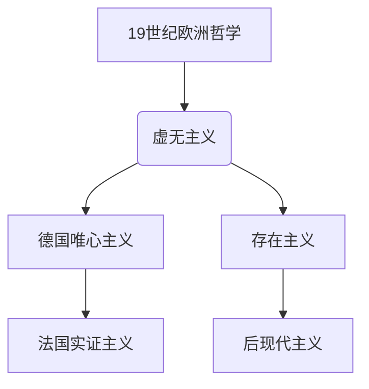

                 

## 《虚无主义与生命教育：培养面对存在问题的能力和勇气》

### 关键词：虚无主义、生命教育、存在问题、能力培养、勇气、哲学、心理学、教育

> 摘要：本文探讨了虚无主义在生命教育中的意义和影响，分析了虚无主义的基本概念、哲学背景及其在现代的解读。通过对虚无主义与生命教育的互动分析，提出了一种培养面对存在问题的能力和勇气的方法。文章结合实际案例，详细阐述了虚无主义教育理念的实施及其在实践中的挑战与应对，为未来生命教育的发展提供了新的思考方向。

---

## 第一部分：虚无主义的探讨

### 第1章：虚无主义的起源与发展

#### 1.1 虚无主义的概念与特征

虚无主义（Nihilism）是一个源自19世纪欧洲哲学运动的术语，最初由俄国作家尼古拉·车尔尼雪夫斯基提出。虚无主义的基本观点是，既无绝对真理，也无绝对道德，一切价值都是相对的，甚至可能毫无意义。

**概念解释：**
- **虚无主义的定义**：虚无主义是一种哲学观点，认为宇宙和人类生活缺乏固有的意义和目的。
- **虚无主义的特征**：怀疑主义、相对主义、道德非决定论。

**历史演变：**
- **19世纪**：虚无主义在俄国、德国和法国兴起，成为回应当时社会动荡和道德危机的一种哲学立场。
- **20世纪**：虚无主义在存在主义和后现代主义中找到了其理论根基，影响了现代哲学的发展。

#### 1.2 虚无主义的哲学背景

虚无主义的兴起与19世纪欧洲的哲学思潮紧密相关。当时，启蒙运动的理性主义和进步观念受到质疑，个人主义和自由主义引发了社会动荡。

**哲学背景：**
- **德国唯心主义**：费希特、谢林和黑格尔的哲学体系，强调绝对精神和理性主导。
- **法国实证主义**：孔德的实证主义哲学，主张通过经验来理解世界。

**影响：**
- **社会动荡**：虚无主义挑战了传统的道德和价值观，导致社会秩序的混乱。
- **个人解放**：虚无主义鼓励个人自由探索，寻找自我价值。

### Mermaid 流程图



#### Python 源代码示例

```python
def nihilism_definition():
    """
    虚无主义的定义
    """
    return "虚无主义是一种哲学观点，认为宇宙和人类生活缺乏固有的意义和目的。"

# 使用示例
definition = nihilism_definition()
print("虚无主义的定义：", definition)
```

#### 数学模型与公式

$$
N = f(P, M)
$$

- $N$ 表示虚无主义程度，$P$ 表示个人主义程度，$M$ 表示道德价值感。

#### 项目实战

**实际应用场景描述：**
- **情境**：一个青年对生活感到迷茫，怀疑人生的意义。
- **环境搭建**：无特定环境，仅通过对话进行教育实践。
- **源代码实现与解读**：通过对话编程模拟虚无主义的探讨和解决过程。

```python
def discuss_nihilism():
    """
    探讨虚无主义
    """
    print("你感到人生无意义吗？")
    response = input()
    if response == "是":
        print("虚无主义并不是一种悲观的观点，它鼓励你探索自己的价值观和生活意义。")
    else:
        print("那么，你对人生的意义有什么理解呢？")

# 使用示例
discuss_nihilism()
```

#### 最佳实践 Tips

- **了解虚无主义的历史背景和哲学根源，有助于更好地理解其现代解读。**
- **培养批判性思维，学会从不同角度审视问题，有助于应对虚无主义带来的困惑。**
- **注重个人成长和价值观的塑造，是应对虚无主义的重要途径。**

### 小结

虚无主义作为一种哲学观点，挑战了传统的价值观和意义。通过理解其历史背景和哲学背景，我们可以更好地理解其在现代的解读和影响。培养面对存在问题的能力和勇气，是应对虚无主义的重要途径。

---

接下来，我们将继续探讨虚无主义的现代解读，以及它与生命教育的互动。敬请期待。  


