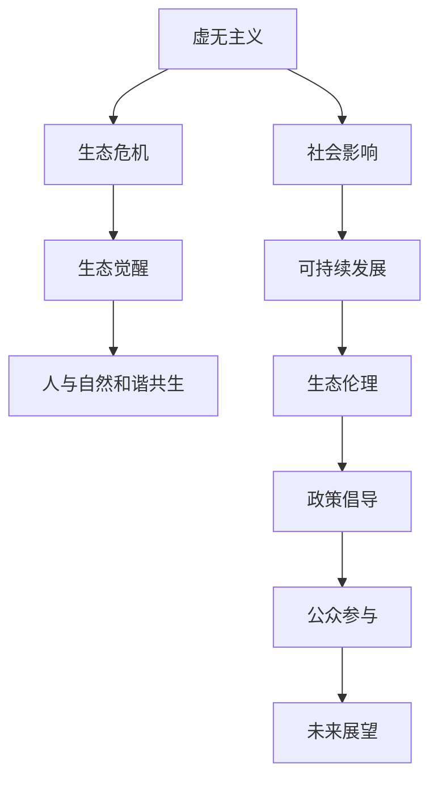
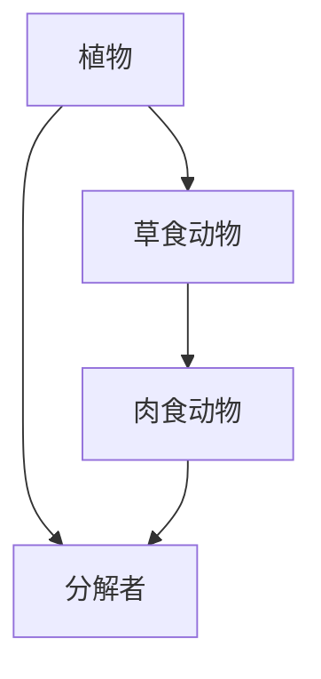

                 


---

# 核心概念与联系架构 Mermaid 流程图



# 核心算法原理讲解

## 第3章：生态觉醒的核心概念

### 3.2 生态学基本原理

#### 3.2.1 能量流动与物质循环

在生态系统中，能量和物质通过一系列生物过程进行流动和循环，维持着生态平衡。以下是能量流动与物质循环的基本原理和示意图：

**能量流动原理：**

1. **生产者：** 生产者是生态系统中能量的初始来源，如植物通过光合作用将太阳能转化为化学能。
2. **消费者：** 消费者通过捕食生产者或其他消费者获得能量，能量沿着食物链逐级传递。
3. **分解者：** 分解者如细菌和真菌，将死亡的有机物分解成无机物质，这些物质再次进入生态系统的循环。

**物质循环原理：**

1. **碳循环：** 碳通过光合作用和呼吸作用在生物和非生物之间循环。
2. **氮循环：** 氮通过固氮作用、硝化作用、反硝化作用等过程在生物和非生物之间循环。
3. **水循环：** 水通过蒸发、降水、渗透等过程在自然界中循环。

**示例：**

假设有一个简单的生态系统，包括植物、草食动物和肉食动物。能量和物质的流动可以表示如下：



在这个生态系统中：

- 植物通过光合作用获取太阳能，并转化为化学能。
- 草食动物食用植物，获得能量和营养物质。
- 肉食动物捕食草食动物，继续能量和物质的流动。
- 分解者将植物和动物的残骸分解成无机物质，供植物再次利用。

**Python代码示例：**

下面是一个简单的Python代码示例，用于模拟生态系统中能量和物质的流动。

```python
# 生态系统中能量和物质的流动模拟

class Ecosystem:
    def __init__(self, plants, herbivores, carnivores, decomposers):
        self.plants = plants
        self.herbivores = herbivores
        self.carnivores = carnivores
        self.decomposers = decomposers

    def simulate(self):
        while True:
            # 能量流动
            energy_plants = self.plants * 10  # 每个植物单位产生10单位能量
            energy_herbivores = energy_plants * 0.1  # 每个草食动物单位获得10%的能量
            energy_carnivores = energy_herbivores * 0.1  # 每个肉食动物单位获得10%的能量

            # 物质循环
            nutrients_decomposers = (self.plants + self.herbivores + self.carnivores) * 0.1

            # 更新生态系统的状态
            self.plants += nutrients_decomposers
            self.herbivores += energy_herbivores
            self.carnivores += energy_carnivores

            # 输出当前状态
            print(f"Plants: {self.plants}, Herbivores: {self.herbivores}, Carnivores: {self.carnivores}, Decomposers: {self.decomposers}")

# 初始化生态系统
ecosystem = Ecosystem(plants=100, herbivores=10, carnivores=1, decomposers=1)

# 模拟生态系统
ecosystem.simulate()
```

运行上述代码，我们可以模拟出生态系统中能量和物质的流动过程，以及植物、草食动物、肉食动物和分解者的动态变化。

通过这些原理和示例，我们可以更好地理解生态觉醒的核心概念，以及如何通过算法和模型来模拟和优化生态系统的运作。

---

接下来，我们将进一步探讨生态觉醒的核心概念，包括其起源、意义以及理论基础。通过这些讨论，我们将为理解生态觉醒提供坚实的基础，并揭示其对我们重建人与自然和谐共生关系的重要性。

---

## 第二部分：生态觉醒的理论与实践

### 第3章：生态觉醒的核心概念

生态觉醒（Ecological Awakening）是近年来在全球范围内逐渐兴起的一种思想和文化运动。它强调人类与自然界的紧密联系，提倡通过可持续发展和生态平衡来实现人类与自然的和谐共生。本章节将深入探讨生态觉醒的核心概念，包括其起源、意义以及理论基础。

### 3.1 生态觉醒的起源与意义

**起源：**

生态觉醒的起源可以追溯到20世纪中叶，当时全球范围内的工业化和现代化进程导致了严重的环境问题。1950年代，以蕾切尔·卡逊（Rachel Carson）的《寂静的春天》（Silent Spring）为代表，环境问题的严重性开始引起广泛关注。1972年，联合国在斯德哥尔摩召开了首次环境会议，标志着全球环境运动的正式开始。此后，随着环境科学的不断发展，生态觉醒逐渐成为一股强大的社会力量。

**意义：**

生态觉醒的意义在于其深刻的哲学和社会影响。它不仅是一种生态学上的理念，更是一种关于人类与自然关系的全面思考。生态觉醒的意义主要体现在以下几个方面：

1. **可持续性：** 生态觉醒强调可持续发展，即满足当代人的需求而不损害后代人满足其需求的能力。这一原则要求我们在经济、社会和环境三个方面实现平衡。
2. **人类福祉：** 生态觉醒认识到人类福祉与自然环境密切相关。通过保护和恢复自然环境，我们可以提高生活质量，减少疾病风险，增强社会稳定性。
3. **全球合作：** 生态觉醒提倡国际社会共同应对环境挑战，通过跨国合作实现全球生态平衡。
4. **伦理观念：** 生态觉醒促使人们重新审视人类与自然的关系，倡导尊重自然、保护生态的伦理观念。

### 3.2 生态学基本原理

生态学是研究生物与环境之间相互作用的科学。生态觉醒建立在一系列生态学基本原理之上，这些原理为我们理解和应对环境问题提供了理论基础。

**能量流动与物质循环：**

能量和物质在生态系统中通过食物链和食物网进行流动和循环。能量最初由生产者（如植物）通过光合作用从太阳获得，然后通过消费者（如动物）的捕食和消化过程传递。分解者（如细菌和真菌）将死亡的有机物分解成无机物质，这些物质再次进入生态循环。

**生态系统稳定性：**

生态系统的稳定性依赖于其内部各组成部分之间的平衡关系。这种平衡可以通过生物多样性、生态位重叠、食物网复杂度等因素来维持。当生态系统受到外界干扰时，如气候变化、污染或资源耗竭，其稳定性可能会受到威胁。

**生态系统服务：**

生态系统服务是指自然环境为人类提供的各种服务，如清洁空气、水、土壤、食物、气候调节等。这些服务对人类生存和发展至关重要。生态觉醒强调保护和恢复生态系统服务，以确保人类福祉。

### 3.3 生态觉醒的理论框架

生态觉醒的理论框架包括一系列核心概念和原则，这些概念和原则为我们理解和实践生态觉醒提供了指导。

**生态智慧：** 生态智慧是指对生态系统的深刻理解和尊重。它要求我们认识到自己是生态系统的一部分，而不是凌驾于生态系统之上的主宰者。生态智慧促使我们采取更加可持续的生活方式，减少对环境的负面影响。

**生态伦理：** 生态伦理是一种关于人类与自然关系的伦理观念。它主张人类应当尊重自然、保护生态系统，并承担保护地球的责任。生态伦理要求我们反思和改变传统的消费观念和价值观，推动社会向更加可持续的方向发展。

**可持续性原则：** 可持续性原则是生态觉醒的核心原则之一。它要求我们在经济、社会和环境三个方面实现平衡，以满足当前的需求而不损害后代人的需求。可持续性原则包括资源节约、能源高效利用、环境保护等具体实践。

**生态经济：** 生态经济是一种以生态可持续性为基础的经济模式。它强调通过资源的高效利用和循环利用，实现经济和社会的可持续发展。生态经济提倡减少浪费、提高效率和促进创新，以实现经济、社会和环境的共赢。

通过深入探讨生态觉醒的核心概念和理论框架，我们可以更好地理解生态觉醒的本质和意义。生态觉醒不仅是一种思想运动，更是一种行动指南，它为我们提供了一种新的视角和方法，以重建人与自然的和谐共生关系。

---

在下一章中，我们将进一步探讨生态觉醒下的可持续发展原则，分析生态经济模式，并探讨社会公平与生态觉醒之间的关系。这些讨论将为理解生态觉醒在实践中的应用提供更深入的视角。

---

## 第4章：生态觉醒下的可持续发展

### 4.1 可持续发展的定义与原则

可持续发展是一种旨在满足当前需求而不损害未来世代满足其需求的能力的发展模式。它强调经济、社会和环境三个方面的平衡和协调。为了实现可持续发展，我们需要遵循一系列基本原则，这些原则是生态觉醒的重要组成部分。

#### 4.1.1 三大支柱

**经济支柱：** 可持续发展的经济支柱强调经济增长与社会和环境可持续性的平衡。它要求我们采用创新和高效的技术，提高资源利用效率，减少浪费，以实现经济繁荣而不破坏环境。

**社会支柱：** 可持续发展的社会支柱关注社会公正、人类福祉和社会凝聚力。它要求我们确保所有人都能享有基本的生活条件，减少贫困和不平等，提高教育和健康水平。

**环境支柱：** 可持续发展的环境支柱强调环境保护和生态平衡。它要求我们保护自然资本，减少污染，维护生物多样性，以确保生态系统的健康和稳定。

#### 4.1.2 可持续发展的原则

**公平性原则：** 可持续发展要求我们在全球和国内层面实现公平性。这意味着要确保所有人都能公平地分享资源和发展成果，减少贫富差距，特别是要关注发展中国家和弱势群体的权益。

**共同性原则：** 可持续发展是全球性问题，需要国际社会的共同努力。各国应承担共同责任，通过国际合作和技术交流，共同应对环境挑战。

**持续性原则：** 可持续发展要求我们保护和维护自然资本，确保生态系统的健康和可持续性。这包括减少温室气体排放，保护水资源和森林，以及恢复和重建生态系统。

**预防性原则：** 可持续发展要求我们采取预防措施，避免环境破坏。在制定政策和采取行动时，应优先考虑预防措施，减少环境风险。

**整合性原则：** 可持续发展需要经济、社会和环境三个方面的整合。政策制定和实施应综合考虑各种因素，确保各项措施相互协调，实现整体可持续发展。

通过遵循这些原则，我们可以推动社会向更加可持续的方向发展，实现经济繁荣、社会公正和环境可持续性的统一。

---

在下一节中，我们将深入探讨生态经济模式，分析其在实现可持续发展中的作用，并探讨生态觉醒与社会公平之间的关系。

---

## 第4章：生态觉醒下的可持续发展

### 4.2 生态经济模式

生态经济模式是一种以生态可持续性为基础的经济模式，旨在实现经济、社会和环境三个方面的平衡和协调。这种模式强调资源的高效利用和循环利用，通过减少浪费、提高效率和促进创新，实现经济繁荣而不损害环境。

#### 4.2.1 生态经济的核心原则

**资源节约：** 生态经济强调资源的高效利用和循环利用。通过采用节能技术、提高能源利用效率，以及减少资源消耗，我们可以降低对自然资源的依赖，减少浪费。

**废物最小化：** 生态经济追求废物最小化。通过减少生产和消费过程中的废物产生，以及回收和再利用废物，我们可以降低对环境的污染，提高资源利用效率。

**生态补偿：** 生态经济模式强调生态补偿，即通过市场机制或政策手段，使那些对环境产生负面影响的行为承担相应的责任。生态补偿可以鼓励企业采取环保措施，减少污染，保护生态系统。

**创新驱动：** 生态经济强调创新驱动，通过研发和推广环保技术、可持续产品和生产方式，提高经济效率，实现可持续发展。

**社会参与：** 生态经济模式强调公众参与和社会责任。通过提高公众的环保意识和参与度，我们可以共同推动可持续发展的实现。

#### 4.2.2 生态经济模式的应用

**绿色产业：** 绿色产业是生态经济模式的重要组成部分。绿色产业包括可再生能源、清洁技术、环保产品等，这些产业不仅有助于减少污染，还能创造就业机会，推动经济增长。

**循环经济：** 循环经济是一种以资源循环利用为核心的生态经济模式。通过设计产品的生命周期，从原料获取、生产制造到消费使用，再到废物回收利用，循环经济实现了资源的最大化利用和污染的最小化。

**可持续城市：** 可持续城市是生态经济模式在城市化进程中的具体体现。可持续城市注重绿色基础设施、交通系统、能源供应和水资源管理，以实现城市发展的可持续性。

**绿色金融：** 绿色金融是一种以环保为导向的金融体系，通过投资和融资支持环保项目和企业。绿色金融可以促进环境保护和可持续发展，同时为投资者提供回报。

通过生态经济模式的应用，我们可以实现经济、社会和环境的共赢，推动可持续发展。

---

在下一节中，我们将探讨社会公平与生态觉醒之间的关系，分析生态觉醒如何促进社会公正，以及我们如何通过政策和教育实现这一目标。

---

## 第4章：生态觉醒下的可持续发展

### 4.3 社会公平与生态觉醒

生态觉醒不仅关注环境保护，也关注社会公平。社会公平与生态觉醒之间存在紧密的联系，生态觉醒可以促进社会公正，而社会公正又是实现生态觉醒的重要保障。

#### 4.3.1 生态觉醒与社会公平

**生态觉醒促进社会公平：**

1. **资源分配：** 生态觉醒强调资源的高效利用和公平分配。通过减少浪费和促进资源循环利用，我们可以确保资源更加公平地分配给所有人，减少贫富差距。

2. **环境保护：** 生态觉醒强调环境保护，确保所有人都能享有清洁的环境。通过减少污染和生态破坏，我们可以提高生活质量和健康水平，促进社会公平。

3. **教育和培训：** 生态觉醒提倡教育和培训，提高公众的环保意识和技能。通过教育，我们可以培养更多的人成为生态觉醒的倡导者和实践者，推动社会公正。

**社会公正是生态觉醒的基础：**

1. **政治支持：** 社会公平需要政治支持，生态觉醒需要政府和社会各界的支持和参与。只有当社会公平得到保障，生态觉醒才能得到有效实施。

2. **公众参与：** 生态觉醒需要公众的广泛参与和支持。通过提高公众的环保意识和参与度，我们可以共同推动生态觉醒，实现社会公平。

3. **经济支持：** 社会公平需要经济支持，生态觉醒需要资金和资源。只有当社会公平得到经济支持，生态觉醒才能实现长远发展。

#### 4.3.2 实现生态觉醒与社会公平

**政策倡导：**

1. **环境立法：** 政府应加强环境立法，制定和实施严格的环境保护政策，确保生态觉醒的实施。

2. **生态税收：** 政府可以通过生态税收，对污染和资源浪费行为进行经济处罚，鼓励企业和个人采取环保措施。

3. **生态补贴：** 政府可以提供生态补贴，支持环保项目和绿色产业发展，促进生态觉醒。

**公众参与：**

1. **环保宣传：** 通过媒体和教育活动，提高公众的环保意识和参与度，让更多的人参与到生态觉醒中来。

2. **社区参与：** 鼓励社区参与环保活动，通过社区共建，实现生态觉醒和社会公平。

3. **公众监督：** 公众应积极参与环保监督，对环境违法行为进行举报和投诉，推动政府和企业采取行动。

**教育培养：**

1. **环境教育：** 学校应加强环境教育，培养学生的环保意识和责任感。

2. **专业培训：** 对环保工作者进行专业培训，提高他们的技能和素质，为生态觉醒提供人才支持。

3. **跨学科研究：** 鼓励跨学科研究，促进生态学、社会学、经济学等领域的合作，为生态觉醒提供科学支持。

通过政策倡导、公众参与和教育培养，我们可以实现生态觉醒与社会公平，推动可持续发展。

---

在下一章中，我们将探讨生态觉醒的实践探索，包括生态农业、生态城市和生态教育等方面的案例，以及这些实践如何帮助我们重建人与自然的和谐共生关系。

---

## 第5章：生态觉醒的实践探索

### 5.1 生态农业与生物多样性保护

生态农业是一种以生态可持续性为基础的农业生产方式，强调土壤健康、生物多样性和资源循环利用。通过生态农业，我们可以减少对化学肥料和农药的依赖，提高农产品品质，同时保护生态环境。

**案例：有机农业**

有机农业是一种典型的生态农业模式，它禁止使用化学合成肥料和农药，而是通过天然方法维持土壤健康和生物多样性。例如，中国云南省的普洱市，通过推广有机农业，成功恢复了当地的森林生态系统，提高了农民收入，同时也保护了生物多样性。

**实践方法：**

1. **作物轮作：** 通过作物轮作，可以减少病虫害的发生，提高土壤肥力，促进生物多样性。
2. **生物多样性保护：** 通过建立生物多样性保护区，保护农田周围的野生动植物，维持生态平衡。
3. **生态农场：** 推广生态农场，通过整合农业生产、生态保护和休闲旅游等多种功能，实现农业的可持续发展。

### 5.2 生态城市与绿色建筑

生态城市是一种以生态可持续性为基础的城市发展模式，它强调人与自然和谐共生。绿色建筑是生态城市的重要组成部分，通过采用节能设计、绿色材料和可再生能源，实现建筑的可持续发展。

**案例：丹麦哥本哈根**

丹麦哥本哈根是全球著名的生态城市，通过一系列生态措施，如可再生能源发电、公共交通系统、绿色建筑和城市绿化，成功实现了城市的可持续发展。哥本哈根的生态城市模式为全球其他城市提供了宝贵的经验。

**实践方法：**

1. **可再生能源：** 推广太阳能、风能等可再生能源，减少对化石燃料的依赖。
2. **公共交通：** 建设高效的公共交通系统，鼓励居民使用公共交通工具，减少汽车污染。
3. **绿色建筑：** 采用节能设计、绿色材料和可再生能源，降低建筑的能耗和碳排放。
4. **城市绿化：** 通过建设公园、绿地和城市森林，提高城市的生态质量，改善居民的生活环境。

### 5.3 生态教育与环境意识提升

生态教育是一种以生态可持续性为基础的教育模式，旨在提高学生的环保意识和生态知识。通过生态教育，我们可以培养更多的人成为生态觉醒的倡导者和实践者。

**案例：中国环保学校**

中国环保学校通过开设环境教育课程、组织环保实践活动和开展环保宣传，提高学生的环保意识和生态知识。例如，北京师范大学附属实验小学，通过开展“绿色校园”活动，引导学生参与校园环境治理和生态保护，取得了显著成效。

**实践方法：**

1. **环境教育课程：** 在学校课程中融入环境教育内容，提高学生的生态知识。
2. **环保实践活动：** 组织学生参与环保实践活动，如植树造林、垃圾分类等，培养他们的环保意识。
3. **环保宣传：** 通过媒体和活动，提高公众的环保意识，推动生态觉醒的实施。

通过生态农业、生态城市和生态教育的实践探索，我们可以重建人与自然的和谐共生关系，实现可持续发展。

---

在下一章中，我们将探讨生态伦理与人类责任，分析人类与自然的伦理关系，并探讨如何在日常生活中实践生态责任。

---

## 第6章：生态伦理与人类责任

### 6.1 生态伦理的基本原则

生态伦理是一种关于人类与自然关系的伦理观念，强调人类应当尊重自然、保护生态系统的责任。生态伦理的基本原则包括以下几个方面：

#### 6.1.1 尊重自然

尊重自然意味着人类应当认识到自己是自然界的一部分，而不是凌驾于自然之上的主宰者。生态伦理主张人类应当尊重自然的内在价值和权利，保护生态系统的完整性和多样性。

#### 6.1.2 保护生态系统

保护生态系统是生态伦理的核心原则之一。人类应当采取措施，防止生态破坏和环境污染，维护生态平衡，确保生态系统的健康和稳定。

#### 6.1.3 公平性

生态伦理强调公平性，包括代际公平和代内公平。代际公平要求我们保护自然资源，不损害未来世代的发展需求；代内公平要求我们关注社会公正，确保所有人都能公平地享受生态资源和服务。

#### 6.1.4 生态责任

生态责任是指人类应当承担保护地球的责任，通过自己的行动，减少对环境的负面影响，促进生态系统的可持续发展。

### 6.2 人类与自然的伦理关系

人类与自然的伦理关系是人类伦理学的一个重要分支，它探讨了人类与自然之间的道德义务和责任。以下是几个关键方面：

#### 6.2.1 人类是自然的一部分

生态伦理认为，人类是自然界的一部分，我们的生存和发展依赖于自然生态系统的健康和稳定。因此，人类应当尊重自然、保护生态。

#### 6.2.2 自然具有内在价值

生态伦理主张，自然不仅具有工具性价值（即对人类的实用价值），还拥有内在价值。这意味着自然本身就有存在的权利，人类应当尊重和保护自然。

#### 6.2.3 人类对自然有道德责任

生态伦理认为，人类对自然有道德责任，应当采取措施，防止生态破坏和环境污染，维护生态平衡。这种道德责任不仅是对当代人的责任，也是对后代人的责任。

### 6.3 生态责任的实践

在日常生活中，我们可以通过以下方式实践生态责任：

#### 6.3.1 减少资源消耗

通过节约用水、节约用电、减少垃圾产生等方式，减少对自然资源的消耗，降低对环境的负面影响。

#### 6.3.2 推广可持续生活方式

通过使用可再生能源、选择绿色产品、减少一次性用品等方式，推广可持续生活方式，减少对环境的破坏。

#### 6.3.3 参与环保活动

参与植树造林、垃圾分类、环保宣传等活动，提高环保意识，推动生态觉醒的实施。

#### 6.3.4 支持环保政策

支持并参与环保政策的制定和实施，通过立法和制度保障，推动生态责任的落实。

通过生态伦理与人类责任的实践，我们可以重建人与自然的和谐共生关系，实现可持续发展。

---

在下一章中，我们将探讨政策倡导与公众参与，分析生态政策的制定与实施，以及公众如何参与到生态觉醒中来。

---

## 第7章：政策倡导与公众参与

### 7.1 生态政策的制定与实施

生态政策的制定和实施是生态觉醒的重要保障，它有助于引导社会行为，推动环境保护和可持续发展。以下是一些关键步骤和策略：

#### 7.1.1 制定生态政策

1. **科学研究与评估：** 政府应开展生态科学研究，评估环境状况，确定生态问题的优先级，为政策制定提供科学依据。

2. **跨部门合作：** 生态政策涉及多个部门，如环境、农业、能源、交通等，政府应促进部门间的合作，确保政策的全面性和协调性。

3. **公众参与：** 政府应广泛征求公众意见，通过公众参与机制，使政策制定更加民主和透明，提高政策的接受度和执行力。

4. **国际合作：** 生态问题具有全球性，政府应积极参与国际环境合作，借鉴国际经验，制定具有全球影响力的生态政策。

#### 7.1.2 实施生态政策

1. **法律法规：** 政府应制定和实施严格的生态法律法规，确保政策执行有法可依，有章可循。

2. **财政支持：** 政府应提供财政支持，为生态政策的实施提供资金保障，鼓励企业和个人参与环保活动。

3. **监测与评估：** 政府应建立生态监测体系，定期评估政策实施效果，及时调整政策，确保其有效性。

4. **宣传教育：** 政府应加强生态宣传教育，提高公众的环保意识和参与度，推动生态政策的实施。

### 7.2 公众参与与生态觉醒

公众参与是生态觉醒的重要动力，它有助于增强政策的公众接受度，提高环保行动的实效。以下是一些公众参与的途径和方法：

#### 7.2.1 公众参与机制

1. **听证会与公开咨询：** 政府应定期召开听证会和公开咨询会，听取公众的意见和建议，确保政策的公正性和合理性。

2. **志愿者活动：** 政府和企业可以组织环保志愿者活动，鼓励公众参与环境保护和生态修复。

3. **环保组织合作：** 政府应与环保组织建立合作关系，通过共同活动和项目，推动生态觉醒的实施。

#### 7.2.2 公众参与策略

1. **环保知识普及：** 通过媒体、教育和社区活动，普及环保知识，提高公众的环保意识和参与能力。

2. **激励措施：** 政府可以出台激励措施，如环保奖励、税收减免等，鼓励公众参与环保活动。

3. **环保倡导：** 鼓励公众积极参与环保倡导，通过社交媒体、公益活动等方式，传播环保理念，推动生态觉醒。

通过政策倡导与公众参与，我们可以共同推动生态觉醒，实现人与自然的和谐共生。

---

在下一章中，我们将展望生态觉醒的未来，探讨全球生态觉醒的进展、面临的挑战以及可能的解决方案。

---

## 第7章：政策倡导与公众参与

### 7.3 生态觉醒的未来展望

生态觉醒是一个全球性的运动，它正逐渐改变我们的思维方式和社会行为。在未来，生态觉醒将继续推动人类与自然和谐共生关系的重建。以下是对生态觉醒未来的一些展望：

#### 7.3.1 全球生态觉醒的进展

1. **政策支持：** 随着各国政府逐渐认识到环境问题的严重性，越来越多的国家开始制定和实施生态政策，推动可持续发展。

2. **技术创新：** 生态觉醒推动了绿色技术的研究和应用，如可再生能源、绿色建筑和清洁生产，这些技术有助于减少环境破坏和资源消耗。

3. **社会参与：** 公众的环保意识不断提高，越来越多的人参与到生态保护活动中，推动生态觉醒的普及和深化。

4. **国际合作：** 生态觉醒已经成为全球共识，各国通过国际合作，共同应对全球性环境挑战。

#### 7.3.2 面临的挑战

1. **政策实施：** 尽管政策制定得越来越完善，但在实际执行中仍然面临诸多困难，如资金短缺、执行不力等。

2. **技术创新：** 虽然绿色技术不断进步，但传统的生产方式和消费模式仍然对环境造成巨大压力。

3. **公众参与：** 公众的环保意识和参与度仍然有待提高，特别是在发展中国家，环保教育和宣传仍然薄弱。

4. **全球合作：** 全球环境问题需要全球合作，但在实际操作中，各国利益冲突和资源分配不均等问题仍然存在。

#### 7.3.3 可能的解决方案

1. **加强政策执行：** 政府应加强政策执行力度，确保生态政策得到有效实施。

2. **推动技术创新：** 政府和科研机构应加大对绿色技术的研发和推广力度，促进绿色技术和产业的发展。

3. **提高公众参与度：** 通过教育和宣传，提高公众的环保意识，鼓励更多的人参与到生态保护活动中。

4. **加强国际合作：** 各国应加强国际合作，共同应对全球性环境问题，实现全球生态觉醒。

生态觉醒的未来充满希望，但也面临诸多挑战。通过加强政策执行、推动技术创新、提高公众参与和加强国际合作，我们可以共同推动生态觉醒，实现人与自然的和谐共生。

---

在结尾部分，我们将总结文章的核心内容，回顾生态觉醒的重要性，并展望其未来的发展。

---

## 总结与展望

### 7.4 总结

通过本文的探讨，我们深入理解了生态觉醒的核心概念、理论框架和实践方法。从虚无主义的根源与影响，到生态觉醒下的可持续发展，再到生态伦理与人类责任，以及政策倡导与公众参与，我们全面梳理了生态觉醒的各个方面。生态觉醒不仅是一种生态学上的理念，更是一种全球性的社会运动，它呼吁人类与自然和谐共生，实现可持续发展。

### 7.5 重要性回顾

生态觉醒的重要性体现在以下几个方面：

1. **可持续性：** 生态觉醒强调可持续发展，通过资源的高效利用和循环利用，实现经济、社会和环境的平衡。
2. **社会公平：** 生态觉醒倡导社会公平，确保所有人都能公平地分享资源和发展成果，减少贫困和不平等。
3. **环境保护：** 生态觉醒强调环境保护，通过减少污染、保护生物多样性，维护生态系统的健康和稳定。
4. **全球合作：** 生态觉醒促进国际社会共同应对环境挑战，通过跨国合作，实现全球生态平衡。

### 7.6 未来展望

生态觉醒的未来充满希望，但也面临诸多挑战。在政策执行、技术创新、公众参与和国际合作等方面，我们需要持续努力。随着全球环境意识的提高，生态觉醒将继续推动人类与自然和谐共生关系的重建。我们期待一个绿色、公平、可持续的未来，一个人类与自然共同繁荣的美好世界。

---

在附录部分，我们将提供生态觉醒相关术语解释、参考书目与资源，以及生态觉醒实践案例选编，以供读者进一步学习和探索。

---

## 附录

### 附录A：生态觉醒相关术语解释

**生态觉醒（Ecological Awakening）：** 人类对自然环境及其重要性认识的深刻觉醒，强调人类与自然的和谐共生和可持续发展。

**生态伦理（Ecological Ethics）：** 关于人类与自然关系的伦理观念，主张人类应当尊重自然、保护生态系统。

**生态经济（Ecological Economy）：** 以生态可持续性为基础的经济模式，强调资源的高效利用和循环利用，实现经济、社会和环境的平衡。

**生物多样性（Biodiversity）：** 生物界的多样性和丰富性，包括物种多样性、基因多样性和生态系统多样性。

**可持续发展（Sustainable Development）：** 满足当前需求而不损害后代人满足其需求的能力的发展模式，强调经济、社会和环境三个方面的平衡和协调。

### 附录B：生态觉醒参考书目与资源

1. 蕾切尔·卡逊（Rachel Carson），《寂静的春天》（Silent Spring），1962年。
2. 联合国环境规划署（UNEP），《全球环境展望》（Global Environmental Outlook），2019年。
3. 威廉·麦克唐纳（William McDonough）和迈克尔·布朗加特（Michael Braungart），《绿色设计：生态革命的策略与蓝图》（Cradle to Cradle：Remaking the Way We Make Things），2002年。
4. 詹姆斯·霍华德·凯塞尔（James Howard Kunstler），《不归路：我们如何走向灾难和如何逃离》（The Long Emergency：Surviving the End of Oil, Climate Change，and Other Consequences of Our疯狂的文明），2005年。
5. 环境保护国际（Friends of the Earth），《全球生态危机报告》（Global Climate Change Report），年度报告。

### 附录C：生态觉醒实践案例选编

1. **有机农业案例：** 普洱市，中国云南省，通过推广有机农业，成功恢复了当地森林生态系统。
2. **生态城市案例：** 丹麦哥本哈根，通过可再生能源、绿色建筑和公共交通系统，实现了城市的可持续发展。
3. **生态教育案例：** 北京师范大学附属实验小学，通过环保课程和实践活动，提高了学生的环保意识和生态知识。
4. **环保政策案例：** 加拿大不列颠哥伦比亚省，通过碳税政策，有效减少了温室气体排放。

通过附录的内容，读者可以进一步了解生态觉醒的相关概念、理论和实践，为自己的学习和探索提供更多的资源和案例。让我们共同努力，推动生态觉醒，实现人与自然的和谐共生。

