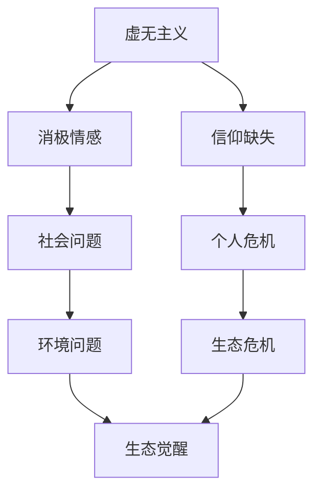

                 

### 文章标题

# 虚无主义与生态觉醒：重建人与自然的和谐关系

> 关键词：虚无主义、生态觉醒、人与自然、和谐关系、可持续发展

> 摘要：本文从虚无主义的起源和影响出发，探讨生态觉醒在重建人与自然和谐关系中的重要性。通过分析虚无主义的哲学背景、现代表现以及生态学的兴起，阐述生态觉醒的哲学意义和实践路径。文章旨在为读者提供对虚无主义和生态觉醒的深刻理解，并探讨如何通过生态伦理、可持续发展、教育文化变革等途径重建人与自然的和谐关系。

### 目录大纲

## 第一部分：虚无主义的起源与影响

## 第1章：虚无主义的起源与哲学背景

### 1.1 虚无主义的定义与特征

虚无主义是一种哲学思潮，其核心观点是宇宙和人生缺乏内在价值和意义。虚无主义认为，现实世界是荒诞的、无意义的，人生是毫无意义的循环。这一思想最早可以追溯到古希腊哲学家伊壁鸠鲁和卢克莱修，他们对生命的荒诞性和宇宙的无意义进行了深刻的探讨。

### 1.2 虚无主义在西方哲学中的发展历程

虚无主义在西方哲学中有悠久的历史，从古希腊的伊壁鸠鲁和卢克莱修，到中世纪的奥古斯丁，再到现代的尼采和萨特，虚无主义思想在不同的历史时期有着不同的表现形式和理论内涵。

### 1.3 虚无主义对现代社会的影响

虚无主义对现代社会产生了深远的影响。它挑战了传统的价值观和信仰体系，引发了人们对生命意义和人生价值的深思。同时，虚无主义也为现代哲学、文学、艺术等领域提供了丰富的思想资源，促使人们反思和探索生命的意义。

## 第二部分：生态觉醒与自然哲学

## 第3章：生态学的兴起与生态危机

### 3.1 生态学的定义与发展

生态学是研究生物与其生存环境之间相互作用的科学。从19世纪末的萌芽阶段到20世纪的快速发展，生态学逐渐成为一门独立的学科，对人类认识自然、理解生态系统的运行机制具有重要意义。

### 3.2 生态危机的表现与原因

生态危机表现为全球气候变化、生物多样性丧失、环境污染等问题。其原因是人类过度开发和消耗自然资源，破坏生态系统的平衡和稳定。

### 3.3 生态危机对人类的影响

生态危机对人类的影响是深远而广泛的。它不仅威胁到人类生存环境的稳定，还导致全球范围内的生态失衡和灾难，对人类社会的可持续发展构成严重挑战。

## 第4章：自然哲学的复兴

### 4.1 自然哲学的基本理念

自然哲学是探讨自然本质和宇宙运行规律的哲学分支。它强调自然界的整体性和内在联系，关注人类与自然的关系。

### 4.2 自然哲学与人文主义的对话

自然哲学与人文主义有着密切的关联。两者都关注人的价值和尊严，但自然哲学更强调人类与自然的和谐共生。

### 4.3 自然哲学在现代社会中的应用

自然哲学在现代社会中的应用广泛，从生态学、环境科学到可持续发展等领域，都体现了自然哲学的基本理念。

## 第三部分：重建人与自然的和谐关系

## 第5章：生态觉醒的哲学意义

### 5.1 生态觉醒的哲学内涵

生态觉醒是一种对自然和生命的深刻认识，它强调人类与自然的和谐共生，倡导可持续发展的理念。

### 5.2 生态觉醒对人类价值观的挑战

生态觉醒对传统的人类中心主义提出了挑战，要求人们重新审视人类与自然的关系，转变传统的发展观念。

### 5.3 生态觉醒与未来社会

生态觉醒为未来社会提供了新的发展方向，它要求人们摒弃传统的发展模式，探索更加和谐、可持续的发展路径。

## 第6章：生态伦理与可持续发展

### 6.1 生态伦理的基本原则

生态伦理强调尊重自然、保护环境、实现可持续发展等原则，它为人类与自然的和谐共生提供了伦理基础。

### 6.2 可持续发展的理念与实践

可持续发展强调在满足当代人类需求的同时，不损害后代满足自身需求的能力。它是生态觉醒的重要实践路径。

### 6.3 生态伦理在政策制定中的应用

生态伦理在政策制定中的应用日益广泛，它为各国政府制定生态政策和规划提供了重要依据。

## 第7章：生态重建的路径与策略

### 7.1 生态修复与环境保护

生态修复和环境保护是生态重建的重要路径，它要求人们采取积极措施，恢复和改善生态环境。

### 7.2 生态城市规划与建设

生态城市规划与建设是生态重建的重要组成部分，它要求在城市规划和管理中充分考虑生态因素，实现人与自然的和谐共生。

### 7.3 生态产业与绿色经济

生态产业和绿色经济是生态重建的重要动力，它要求人们转变传统发展模式，发展低碳、环保的产业体系。

## 第8章：教育与文化的变革

### 8.1 生态教育的重要性

生态教育是生态重建的基础，它要求人们从小培养生态意识，提高环保素养。

### 8.2 生态文化建设的途径

生态文化建设是生态重建的重要任务，它要求人们通过文化传承和创新，推动生态文化的普及和发展。

### 8.3 生态意识与公众参与

生态意识与公众参与是生态重建的重要保障，它要求人们积极参与生态建设，共同构建美好家园。

## 第9章：未来展望

### 9.1 人与自然和谐关系的实现路径

人与自然和谐关系的实现路径包括生态觉醒、可持续发展、生态伦理等，它要求人们采取多种措施，实现人与自然的和谐共生。

### 9.2 科技与自然的交融

科技与自然的交融是未来社会发展的重要趋势，它要求人们充分发挥科技优势，为生态建设提供有力支撑。

### 9.3 人类文明的可持续发展

人类文明的可持续发展是生态觉醒的追求目标，它要求人们不断探索新的发展模式，实现人类社会的永续发展。

### 图1-1：虚无主义与生态觉醒的关系架构图



### 图1-2：核心算法原理讲解（以遗传算法为例）

```python
import numpy as np

# 遗传算法的编码与解码
def encode_chromosomes(length):
    return np.random.randint(2, size=length)

def decode(chromosome):
    return sum(chromosome) == 1

# 遗传算法的适应度函数
def fitness_function(chromosome):
    return decode(chromosome)

# 遗传算法的交叉与变异操作
def crossover(parent1, parent2):
    crossover_point = np.random.randint(0, len(parent1))
    child1 = np.concatenate((parent1[:crossover_point], parent2[crossover_point:]))
    child2 = np.concatenate((parent2[:crossover_point], parent1[crossover_point:]))
    return child1, child2

def mutate(chromosome, mutation_rate):
    for i in range(len(chromosome)):
        if np.random.random() < mutation_rate:
            chromosome[i] = 1 - chromosome[i]
    return chromosome

# 遗传算法的主循环
def genetic_algorithm(population_size, generations, mutation_rate):
    population = encode_chromosomes(population_size)
    for generation in range(generations):
        fitness_scores = np.array([fitness_function(chromosome) for chromosome in population])
        sorted_population = population[fitness_scores.argsort()[::-1]]
        next_population = []
        for _ in range(int(population_size / 2)):
            parent1, parent2 = sorted_population[:2]
            child1, child2 = crossover(parent1, parent2)
            next_population.extend([mutate(child1, mutation_rate), mutate(child2, mutation_rate)])
        population = next_population
    return population
```

### 作者信息

作者：AI天才研究院/AI Genius Institute & 禅与计算机程序设计艺术 /Zen And The Art of Computer Programming

---

现在我们已经完成了文章的标题、关键词、摘要和目录大纲的撰写。接下来，我们将逐步深入探讨虚无主义的起源与影响、生态觉醒与自然哲学、重建人与自然的和谐关系等核心主题。让我们开始吧！## 第1章：虚无主义的起源与哲学背景

### 1.1 虚无主义的定义与特征

虚无主义，作为一种哲学思潮，其核心观点是宇宙和人生缺乏内在价值和意义。虚无主义认为，现实世界是荒诞的、无意义的，人生是毫无意义的循环。这一思想最早可以追溯到古希腊哲学家伊壁鸠鲁和卢克莱修，他们对生命的荒诞性和宇宙的无意义进行了深刻的探讨。

虚无主义的主要特征包括：

1. **现实世界的荒诞性**：虚无主义认为现实世界是一个没有意义、没有目的的荒诞剧场。人们在这个剧场中扮演着各自的角色，但这些角色没有真正的意义。

2. **人生的无意义**：虚无主义认为人生缺乏内在价值和目的。人的存在只是宇宙中微不足道的部分，人的生死、爱恨、追求都显得毫无意义。

3. **信仰的缺失**：虚无主义批判传统宗教和哲学的信仰体系，认为这些信仰体系无法给人们提供真正的意义和目的。

4. **消极的情感**：虚无主义倾向于消极的情感，如绝望、孤独、悲观等。它认为这些情感是人们对现实世界的真实感受。

虚无主义的主要特征表明，它是一种深刻地批判现实世界的哲学思潮，挑战了传统的价值观和信仰体系。虚无主义的思想对后来的哲学、文学、艺术等领域产生了深远的影响。

### 1.2 虚无主义在西方哲学中的发展历程

虚无主义在西方哲学中有悠久的历史，从古希腊的伊壁鸠鲁和卢克莱修，到中世纪的奥古斯丁，再到现代的尼采和萨特，虚无主义思想在不同的历史时期有着不同的表现形式和理论内涵。

1. **古希腊时期**：伊壁鸠鲁和卢克莱修是虚无主义的先驱。伊壁鸠鲁认为，现实世界是荒诞的、无意义的，人的生死、爱恨、追求都显得毫无意义。卢克莱修进一步发展了伊壁鸠鲁的虚无主义思想，强调人的欲望和快乐是生命的唯一意义。

2. **中世纪时期**：奥古斯丁是中世纪最重要的哲学家之一，他的哲学思想对虚无主义产生了深远的影响。奥古斯丁认为，现实世界是上帝创造的，人生的意义在于信仰上帝和追求永恒的福祉。然而，他的哲学中也隐含了虚无主义的影子，如对现实世界的怀疑和对生命的悲观。

3. **现代时期**：尼采和萨特是现代虚无主义的代表人物。尼采提出了“上帝已死”的口号，批判传统宗教和哲学的信仰体系，认为人生缺乏内在价值和目的。萨特则通过他的存在主义哲学，强调人的自由和选择，认为人的存在本身就是一种荒诞。

虚无主义在西方哲学中的发展历程表明，它是一种具有深远影响的哲学思潮，贯穿了古希腊、中世纪和现代三个重要的历史时期。虚无主义的思想不仅挑战了传统的价值观和信仰体系，也为后来的哲学、文学、艺术等领域提供了重要的思想资源。

### 1.3 虚无主义对现代社会的影响

虚无主义对现代社会产生了深远的影响。它挑战了传统的价值观和信仰体系，引发了人们对生命意义和人生价值的深思。同时，虚无主义也为现代哲学、文学、艺术等领域提供了丰富的思想资源，促使人们反思和探索生命的意义。

1. **对个人价值观的挑战**：虚无主义质疑传统宗教和哲学的信仰体系，认为人生缺乏内在价值和目的。这种观点对个人的价值观产生了巨大的冲击，使许多人开始质疑自己的存在意义和人生目标。

2. **对现代哲学的影响**：虚无主义思想为现代哲学提供了丰富的思想资源，促进了哲学的发展和深化。许多现代哲学家如尼采、萨特等，都在他们的哲学体系中融入了虚无主义的元素，对生命的意义、人类的存在等问题进行了深入的探讨。

3. **对文学和艺术的影响**：虚无主义对文学和艺术产生了深远的影响。许多现代文学作品和艺术作品都充满了对生命意义的质疑和探索，如尼采的《查拉图斯特拉如是说》、萨特的《恶心》等。

4. **对心理学的影响**：虚无主义思想对心理学也产生了重要影响。许多心理学家如罗洛·梅、欧文·D·亚隆等，都在他们的心理学理论中融入了虚无主义的思想，探讨人的存在意义和心理健康问题。

虚无主义对现代社会的影响是深远而广泛的。它不仅挑战了传统的价值观和信仰体系，引发了人们对生命意义和人生价值的深思，也为现代哲学、文学、艺术等领域提供了丰富的思想资源。在虚无主义的背景下，人们开始重新审视生命的意义，探索新的价值观念和生活方式。 ## 第2章：虚无主义的现代表现

### 2.1 颓废文化

虚无主义在现代社会的一种表现是颓废文化。颓废文化强调对传统价值观和生活方式的抛弃，追求个性和自我表达。颓废文化不仅体现在生活方式上，如摇滚乐、朋克文化、嘻哈文化等，还体现在文学、艺术和哲学领域。

颓废文化的特点包括：

1. **反传统**：颓废文化反对传统的社会规范和价值观念，追求个性和自我表达。它挑战了传统的道德观念和生活方式，提倡自由、反叛和颠覆。

2. **悲观主义**：颓废文化通常带有悲观主义的色彩，对现实世界和社会现状持怀疑和批判的态度。它认为现实世界是荒诞的、无意义的，人生充满了痛苦和不幸。

3. **形式主义**：颓废文化强调艺术和文学的形式主义，追求独特、个性和创新。它反对内容的教条和枯燥，强调形式和技巧的创新。

4. **享乐主义**：颓废文化倡导享乐主义，追求个人欲望的满足和感官的快乐。它认为人生短暂，应该尽情享受生活的每一个瞬间。

颓废文化在现代社会中有着广泛的影响，它挑战了传统的价值观和生活方式，引发了人们对生命意义和人生价值的反思。颓废文化也为现代文学、艺术和哲学等领域提供了丰富的思想资源，促进了这些领域的发展和变革。

### 2.2 消费主义与虚无主义

消费主义是现代社会的一种重要现象，它强调通过消费来满足个人欲望和追求幸福。消费主义与虚无主义有着密切的关系，消费主义往往被虚无主义所批判。

1. **消费主义的特点**：
   - **物质主义**：消费主义强调物质财富的积累和享受，认为物质生活是幸福和成功的重要标志。
   - **炫耀性消费**：消费主义鼓励人们通过购买奢侈品和炫耀性商品来展示自己的社会地位和身份。
   - **广告文化**：消费主义与广告文化紧密相连，广告通过宣传和诱导，激发人们的消费欲望。

2. **消费主义与虚无主义的关联**：
   - **物化**：消费主义将人视为消费的主体，人的价值和尊严被物质财富所取代，导致人的物化。
   - **空虚感**：尽管消费主义带来物质上的满足，但往往无法填补人们内心的空虚和孤独。人们发现，通过消费无法真正获得幸福和满足。
   - **逃避现实**：消费主义成为人们逃避现实问题的一种方式，通过消费来逃避生活中的困难和挑战。

3. **虚无主义对消费主义的批判**：
   - **无意义**：虚无主义认为消费主义的生活是无意义的，人们通过消费追求的幸福是短暂的、表面的。
   - **虚伪**：虚无主义认为消费主义追求的所谓幸福和成功是虚伪的，它忽略了人的内心需求和真实的生活体验。
   - **生态危机**：虚无主义还指出，消费主义导致了严重的生态危机，人们过度消费资源，破坏了生态系统的平衡。

消费主义与虚无主义的关联和批判，揭示了现代社会中存在的问题和矛盾。虚无主义挑战了消费主义的价值观，呼吁人们重新审视自己的生活目标和价值观，追求更有意义和深度的人生。

### 2.3 虚无主义与个人主义

虚无主义与个人主义有着密切的联系。个人主义强调个体的自由和独立，追求个人的幸福和自我实现。虚无主义则从哲学上质疑个人主义的合理性和价值。

1. **个人主义的特点**：
   - **自由**：个人主义认为每个人都应该拥有自由，包括言论自由、信仰自由等。
   - **自我实现**：个人主义强调个人追求自我实现，实现个人的潜能和价值。
   - **竞争**：个人主义鼓励个人之间的竞争，认为竞争可以促进社会的进步和发展。

2. **虚无主义对个人主义的批判**：
   - **孤独**：虚无主义认为，个人主义强调个体的独立和自由，但这也导致了人与人之间的孤独和隔阂。人们在追求个人幸福的过程中，往往忽略了与他人建立深层次的关系和连接。
   - **无意义**：虚无主义认为，个人主义追求的个人幸福和自我实现往往缺乏内在的价值和意义。个人的成功和幸福在虚无主义看来是短暂的、表面的，无法真正填补内心的空虚。
   - **逃避责任**：虚无主义认为，个人主义鼓励个体逃避对社会的责任和义务。个体只关注自己的利益和幸福，而忽略了社会和集体的利益。

3. **虚无主义与个人主义的互动**：
   - **相互影响**：虚无主义对个人主义的批判促使个人主义重新审视自己的价值观和目标。个人主义在追求自我实现的过程中，也需要考虑到社会的需求和责任。
   - **互补性**：虚无主义和

