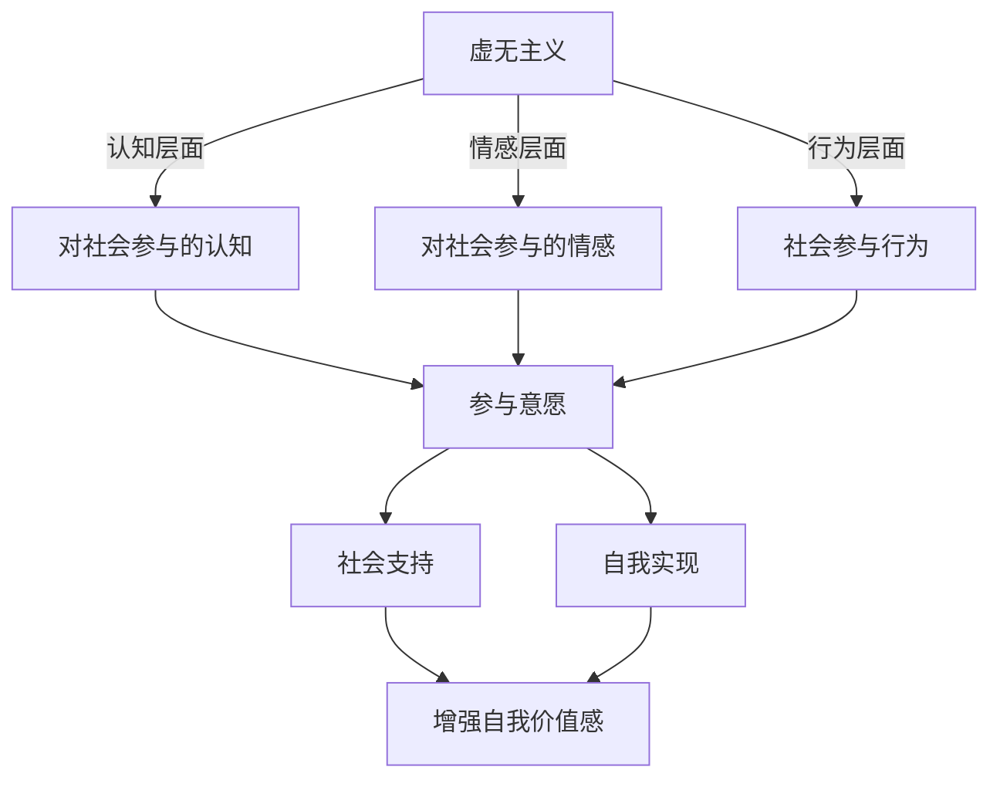
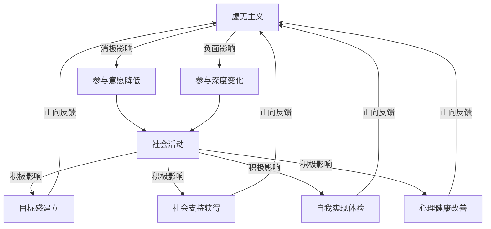

                 

## 《虚无主义与社会参与：在变革中找到个人存在感》

### 关键词：虚无主义，社会参与，个人存在感，社会变革，哲学探讨

#### 摘要

本文旨在探讨虚无主义哲学理论在社会参与和个人存在感方面的应用，帮助读者在快速变化的社会背景下找到自我价值和意义。文章首先介绍了虚无主义的定义和基本哲学观点，随后探讨了社会参与的必要性及其形式和意义。通过分析虚无主义与社会参与的互动关系，本文提出了在变革中找到个人存在感的策略和方法。此外，文章还提供了个人存在感评估与提升的具体方法，以及社会参与与个人成长的关系，旨在为读者提供全面的指导。

### 目录大纲设计思路

在设计《虚无主义与社会参与：在变革中找到个人存在感》的目录大纲时，我们首先明确了文章的核心主题和目标读者群体。本书的核心主题涉及虚无主义哲学理论在社会参与和个人存在感方面的应用，旨在帮助读者在快速变化的社会背景下找到自我价值和意义。因此，目录大纲的设计需要兼顾理论的深度和实用性，以及逻辑性和层次性。

以下是我们的目录大纲设计思路：

#### 第一部分：虚无主义的哲学探讨

- **第1章 虚无主义的哲学探讨**
  - **引言**：介绍虚无主义的定义和基本哲学观点，以及其在现代社会中的影响。
  - **虚无主义的哲学背景**：探讨虚无主义的起源和发展，与存在主义等哲学流派的联系。
  - **虚无主义的现代意义**：分析虚无主义在当代社会中的影响和作用。

- **第2章 社会参与的必要性**
  - **社会参与的定义**：介绍社会参与的概念和重要性。
  - **社会参与的形式**：讨论社会参与的不同形式，如志愿活动、政治参与等。
  - **社会参与的意义**：分析社会参与对个人和社会的影响。

#### 第二部分：虚无主义与社会参与的互动

- **第3章 虚无主义与社会参与的联系**
  - **虚无主义对社会参与的影响**：探讨虚无主义如何影响个人参与社会的意愿和行为。
  - **社会参与对虚无主义的缓解作用**：分析社会参与如何帮助个人克服虚无感，找到存在感。
  - **案例分析**：通过具体案例展示虚无主义与社会参与的互动关系。

- **第4章 在变革中找到个人存在感**
  - **社会变革与个人适应**：分析社会变革的背景和影响，以及个人如何适应这种变化。
  - **自我发现与价值重塑**：探讨个人如何在变革中找到自我，重塑个人价值观。
  - **实际操作方法**：提供具体的方法和策略，帮助读者在变革中找到个人存在感。

#### 第三部分：个人存在感的评估与提升

- **第5章 个人存在感的评估与提升**
  - **个人存在感评估方法**：介绍评估个人存在感的方法和工具。
  - **提升个人存在感的策略**：提供提升个人存在感的具体策略和建议。
  - **心理调适与存在感提升**：讨论心理调适在提升个人存在感中的作用。

- **第6章 社会参与与个人成长**
  - **社会参与对个人成长的影响**：分析社会参与如何促进个人成长和自我实现。
  - **个人成长与社会参与的双向作用**：探讨个人成长如何影响社会参与，以及社会参与如何推动个人成长。

#### 第四部分：总结与展望

- **第7章 总结与展望**
  - **虚无主义与社会参与的融合**：总结本书的主要观点，探讨虚无主义与社会参与的融合可能。
  - **未来研究方向**：提出未来可能的研究方向和未解决的问题。
  - **对读者的一封信**：总结全文，鼓励读者在变革中寻找个人存在感。

通过以上章节的设置，我们希望读者能够从哲学角度理解虚无主义，同时认识到社会参与对于个人存在感的重要性。书中不仅会提供理论分析，还会结合实际案例和操作方法，帮助读者在快速变化的社会中找到个人存在的意义和方向。以下是具体的大纲结构。

### 完整目录大纲

```
# 《虚无主义与社会参与：在变革中找到个人存在感》

# 第一部分：虚无主义的哲学探讨

## 第1章 虚无主义的哲学探讨
### 1.1 虚无主义的定义与基本观点
### 1.2 虚无主义的哲学背景与发展
### 1.3 虚无主义与存在主义的比较

## 第2章 社会参与的必要性
### 2.1 社会参与的定义与意义
### 2.2 社会参与的形式与类型
### 2.3 社会参与对个人发展的作用

# 第二部分：虚无主义与社会参与的互动

## 第3章 虚无主义与社会参与的联系
### 3.1 虚无主义对社会参与的影响
### 3.2 社会参与对虚无主义的缓解作用
### 3.3 虚无主义与社会参与的互动关系

## 第4章 在变革中找到个人存在感
### 4.1 社会变革与个人适应
### 4.2 自我发现与价值重塑
### 4.3 实现个人存在感的策略与技巧

# 第三部分：个人存在感的评估与提升

## 第5章 个人存在感的评估与提升
### 5.1 评估个人存在感的方法
### 5.2 提升个人存在感的策略
### 5.3 心理调适与存在感提升

## 第6章 社会参与与个人成长
### 6.1 社会参与对个人成长的影响
### 6.2 个人成长与社会参与的双向作用
### 6.3 社会参与与个人成长的具体案例

# 第四部分：总结与展望

## 第7章 总结与展望
### 7.1 虚无主义与社会参与的融合
### 7.2 未来研究方向与未解决问题
### 7.3 对读者的一封信
```

该目录大纲旨在为读者提供一个全面、系统的阅读框架，帮助他们深入理解虚无主义与社会参与之间的关系，并在快速变化的社会环境中找到个人存在感。每个章节都设计了具体的子标题，以确保内容覆盖的全面性和逻辑性。通过这种方式，我们希望能够帮助读者在理论和实践层面都能有所收获。

### 背景介绍

虚无主义是一种哲学思想，其核心观点是关于生命和存在的无意义性。虚无主义认为，人类的生活缺乏固有的目的和意义，一切皆无意义。这种观点在历史上有着深远的影响，尤其是在现代社会的背景下。随着科技的发展和社会的变迁，越来越多的人感到迷茫和无力，虚无主义也因此成为了一些人面对现实生活困境的一种哲学反思。

社会参与则是指个人在社会生活中积极参与各种公共事务、公益活动和政治过程的行为。社会参与不仅有助于提高个人的社会地位和认同感，还能增强个人的社会责任感和归属感。在现代社会，社会参与已经成为一种重要的生活方式和价值取向。

本文旨在探讨虚无主义和社会参与之间的联系，以及如何在社会变革中找到个人存在感。文章将首先介绍虚无主义的哲学探讨，分析其基本观点和现代意义；然后探讨社会参与的必要性，包括其定义、形式和意义；接着分析虚无主义与社会参与的互动关系，并通过具体案例进行说明；最后，文章将讨论如何在变革中找到个人存在感，提供实际操作方法和策略，帮助读者在社会参与中提升个人存在感。

### 核心概念与联系

在深入探讨虚无主义与社会参与之间的关系之前，我们需要明确几个核心概念及其相互之间的联系。这些核心概念包括虚无主义的基本观点、社会参与的定义、虚无主义与社会参与的互动机制等。

#### 虚无主义的基本观点

虚无主义认为，生命和存在缺乏固有的目的和意义。这种观点源于对人类生存状态的深刻反思。虚无主义的核心思想是，人类面临的是一个无意义、无目的的世界，生活本身没有预定的目的，一切行为的动机和意义都由个人自己赋予。

虚无主义的主要流派包括存在主义和绝望主义。存在主义认为，虽然世界本身无意义，但个人可以通过自由选择和行动来创造自己的意义。绝望主义则认为，生活本身就是一种无意义的状态，人类应该接受这一点，并在绝望中寻找生存的价值。

#### 社会参与的定义

社会参与是指个人在社会生活中积极参与各种公共事务、公益活动和政治过程的行为。社会参与不仅包括志愿活动、公益活动，还包括政治参与、社区参与等。社会参与的意义在于，它有助于提高个人的社会地位和认同感，增强个人的社会责任感和归属感。

社会参与的形式多样，包括但不限于以下几种：

1. **志愿活动**：通过参与志愿者工作，个人可以为社会做出贡献，同时提升自己的社会责任感。
2. **政治参与**：包括投票、参与政治讨论、加入政治组织等，通过这种方式，个人可以影响社会政策的制定。
3. **社区参与**：参与社区建设、社区活动，促进社区成员之间的互动和合作。

#### 虚无主义与社会参与的互动机制

虚无主义和社会参与之间存在复杂的互动机制。一方面，虚无主义可能影响个人参与社会的意愿和动机。当个人感到生活缺乏意义时，他们可能对社会参与持怀疑态度，甚至拒绝参与。另一方面，社会参与也可能对虚无主义产生缓解作用。通过参与社会活动，个人可以找到新的目标和意义，从而缓解虚无感。

具体来说，虚无主义与社会参与的互动机制可以概括为以下几个方面：

1. **认知层面**：虚无主义影响个人对社会参与的认知，可能导致他们对社会参与的价值观产生怀疑。
2. **情感层面**：虚无主义可能导致个人对社会参与产生消极情感，减少参与社会活动的意愿。
3. **行为层面**：虚无主义可能直接影响个人的社会参与行为，导致参与度降低。

同时，社会参与也可以通过以下几个方面缓解虚无主义的影响：

1. **目标感**：社会参与为个人提供明确的目标和方向，有助于克服虚无感。
2. **社会支持**：通过社会参与，个人可以获得来自社会和他人的支持，增强自我价值感。
3. **自我实现**：社会参与有助于个人实现自我价值，从而提高个人存在感。

为了更清晰地展示这些核心概念之间的关系，我们可以使用Mermaid流程图来描述虚无主义与社会参与的互动机制：



通过上述分析，我们可以看到虚无主义和社会参与之间的密切联系。虚无主义不仅影响个人的社会参与行为，社会参与也能在一定程度上缓解虚无主义的影响。理解这些核心概念及其相互关系，有助于我们更深入地探讨如何在社会变革中找到个人存在感。

### 虚无主义的哲学探讨

虚无主义作为一种哲学思想，其起源可以追溯到古希腊哲学家伊壁鸠鲁和斯多葛学派。然而，虚无主义作为一种独立哲学体系的形成，主要是在19世纪末期至20世纪初期。这个时期，西方社会经历了巨大的变革，包括工业革命、世界大战和科技进步，这些变革使得人们开始质疑传统的价值观和存在的意义。

#### 虚无主义的定义和基本观点

虚无主义的核心观点是关于生命和存在的无意义性。它认为，人类的生活缺乏固有的目的和意义，一切都是虚无和空洞的。虚无主义并不否认人类在物质世界中的活动，而是质疑这些活动是否真正有意义。虚无主义哲学家如尼采、萨特和海德格尔等，从不同角度探讨了虚无主义的内涵。

尼采的虚无主义观点主要体现在其哲学思想中的“上帝已死”这一命题。尼采认为，随着宗教和道德体系的崩溃，人类失去了信仰和价值观的依托，陷入了虚无主义的状态。尼采主张，人类必须通过自我超越，创造新的价值观来克服虚无主义。

萨特的虚无主义则体现在其存在主义哲学中。萨特认为，人类的存在是先于意义的，人类必须在无意义的世界中自己创造意义。萨特的哲学强调自由意志和个人责任，认为人类必须通过行动和选择来赋予生活以意义。

海德格尔的虚无主义观点则集中在“存在”这一概念上。海德格尔认为，传统哲学对存在的理解存在缺陷，真正的存在是“存在本身”，而不是“存在者”。海德格尔强调，人类必须在存在本身中寻找存在的意义。

#### 虚无主义的哲学背景与发展

虚无主义的历史背景可以追溯到古希腊哲学。伊壁鸠鲁是早期虚无主义思想的代表，他认为快乐是生活的最高目标，而痛苦和苦难都是虚无的。斯多葛学派则认为，人类应该通过理性控制情感，接受生活中的苦难，以此达到内心的平静和满足。

在中世纪，虚无主义思想在基督教哲学中得到了体现。一些基督教哲学家如奥古斯丁和托马斯·阿奎那，试图通过宗教信仰来解释人类存在的意义。然而，随着宗教改革的到来，信仰体系开始动摇，虚无主义的种子开始在西方社会生根发芽。

19世纪的虚无主义哲学主要代表人物包括尼采、克尔凯郭尔和陀思妥耶夫斯基。尼采的哲学思想对虚无主义的发展产生了深远影响，他提出的“上帝已死”和“超人”概念，成为虚无主义哲学的重要理论基础。

20世纪的虚无主义哲学则主要体现在存在主义和绝望主义中。存在主义强调人类自由意志的重要性，认为人类必须通过自我选择来创造生活意义。绝望主义则认为，生活本身就是无意义的，人类应该接受这一点，并在绝望中寻找生存的价值。

#### 虚无主义与存在主义的比较

虚无主义和存在主义虽然都关注人类存在的意义，但在哲学观点和解决方法上存在显著差异。

首先，虚无主义认为生活本身缺乏意义，人类必须接受这一点。而存在主义则认为，虽然生活本身无意义，但人类可以通过自由选择和行动来创造意义。

其次，虚无主义强调人类的无力和绝望，而存在主义则强调人类的自由意志和责任。存在主义者认为，人类必须在无意义的世界中自己创造价值，从而克服虚无感。

最后，虚无主义和存在主义在方法论上也存在差异。虚无主义倾向于悲观和消极，认为人类必须接受生活的无意义。而存在主义则主张积极面对生活，通过行动和选择来创造意义。

#### 虚无主义的现代意义

在现代社会，虚无主义依然具有深远的影响。随着科技的进步和社会的变迁，许多人感到自己的生活缺乏意义，陷入虚无主义的困境。虚无主义不仅影响个人的心理健康，还对社会和政治产生了一定的负面影响。

首先，虚无主义可能导致个人的心理健康问题。当个人无法找到生活的意义时，他们可能会感到沮丧、无助和绝望，甚至出现心理疾病。例如，抑郁症和焦虑症在虚无主义倾向的人群中较为常见。

其次，虚无主义对社会和政治产生了一定的负面影响。在某些情况下，虚无主义可能导致社会的不稳定和政治的动荡。例如，一些极端的虚无主义思潮可能导致恐怖主义和暴力行为的增加。

然而，虚无主义也有其积极的一面。通过反思虚无主义，人类可以更深刻地认识到自己的生存状态，从而推动社会进步和个人成长。许多哲学家和思想家通过探讨虚无主义，提出了新的价值观和生活方式，帮助人们克服虚无主义的困扰，找到生活的意义。

总之，虚无主义作为一种哲学思想，在现代社会中依然具有重要的意义。通过理解虚无主义的基本观点、哲学背景和现代意义，我们可以更好地应对虚无主义的挑战，找到生活的意义和价值。

### 社会参与的必要性

社会参与是现代社会中一个重要的现象，它不仅关乎个体的生活质量和幸福感，还对社会的发展与稳定具有深远的影响。探讨社会参与的必要性，首先需要明确其定义，然后分析其形式、类型以及对个人发展的作用。

#### 社会参与的定义与意义

社会参与是指个人在社会生活中积极参与各种公共事务、公益活动和政治过程的行为。这种参与不仅包括物质上的贡献，如志愿服务、捐款等，还涵盖精神上的投入，如参与社区讨论、投票等。社会参与的意义在于，它有助于提高个人的社会地位和认同感，增强个人的社会责任感和归属感。

从更广泛的角度来看，社会参与是现代社会发展的基础。一个高度社会参与的社会往往更加和谐稳定，公民的凝聚力和归属感更强。社会参与还可以促进社会的创新和进步，通过集体的智慧和力量解决社会问题，推动社会向前发展。

#### 社会参与的形式与类型

社会参与的形式多种多样，可以按照参与对象、参与内容、参与动机等进行分类。以下是几种常见的社会参与形式：

1. **志愿活动**：这是社会参与中最常见的形式之一。通过参与志愿者工作，个人可以为社会做出贡献，如教育、医疗、环保等领域。志愿活动不仅有助于提升个人的社会责任感，还可以帮助个人建立新的社交网络。

2. **政治参与**：包括投票、参与政治讨论、加入政治组织等。政治参与是公民权利的体现，也是民主制度的基础。通过政治参与，个人可以影响社会政策的制定，推动社会进步。

3. **社区参与**：参与社区建设、社区活动，促进社区成员之间的互动和合作。社区参与有助于增强个人的归属感，提升社区的凝聚力和和谐度。

4. **经济参与**：通过参与经济活动，如创业、投资等，个人可以为社会创造价值，推动经济增长。经济参与不仅有助于个人实现自我价值，还可以促进社会的繁荣和稳定。

5. **文化参与**：参与文化活动，如阅读、艺术创作、参与文化节等，有助于提升个人的文化素养和审美能力，增强文化自信。

#### 社会参与对个人发展的作用

社会参与对个人发展具有多重积极作用。以下是一些具体的作用：

1. **增强自我价值感**：通过参与社会活动，个人可以感受到自己的价值和贡献，从而增强自我价值感。这种自我价值感的提升有助于提高个人的自信心和自尊心。

2. **培养社会责任感**：社会参与让个人意识到自己是社会的一员，有责任为社会的发展和进步贡献力量。通过参与社会活动，个人可以培养出强烈的社会责任感。

3. **提升人际交往能力**：社会参与往往需要与他人合作和沟通，这有助于个人提升人际交往能力。良好的交际能力不仅有助于个人的职业发展，还可以提升个人的生活品质。

4. **促进心理健康**：社会参与有助于缓解压力和焦虑，提升心理健康水平。通过参与社会活动，个人可以获得成就感和归属感，从而改善心理状态。

5. **扩展视野和知识**：社会参与让个人有机会接触到不同领域和不同文化，从而扩展视野和知识。这种知识扩展有助于个人全面发展，提高综合素质。

6. **实现自我成长**：社会参与是一种实践学习的过程，通过参与各种社会活动，个人可以不断学习和成长。这种自我成长有助于个人实现自我价值的最大化。

总之，社会参与是现代社会中不可或缺的一部分，它不仅对个人的成长和发展具有重要作用，还对社会的稳定和发展具有深远影响。通过积极参与社会活动，个人可以找到自我价值，实现自我成长，同时也为社会的发展贡献力量。

### 虚无主义与社会参与的联系

虚无主义与社会参与之间存在着深刻的互动关系，这种关系不仅影响着个人的行为和态度，还对社会产生广泛影响。通过分析虚无主义对社会参与的影响，以及社会参与对虚无主义的缓解作用，我们可以更全面地理解这两种概念之间的动态联系。

#### 虚无主义对社会参与的影响

虚无主义的核心观点是生命的无意义性，这种观念可能会影响个人对社会参与的意愿和动机。以下是一些具体的影响：

1. **参与意愿的降低**：虚无主义可能会使个人对社会参与的动机产生怀疑，导致参与意愿降低。当个人认为生活本身缺乏意义时，他们可能会质疑参与社会活动的价值，从而减少参与社会事务的积极性。

2. **参与形式的改变**：虚无主义可能会改变个人对社会参与的理解和形式。一些虚无主义倾向的个人可能会选择非传统的参与方式，如通过个人艺术创作或独立研究来寻找自我表达和意义，而不是通过集体活动或组织形式参与。

3. **参与深度的变化**：虚无主义可能会导致个人对社会参与持消极态度，减少参与深度。虽然他们可能会参与某些社会活动，但可能缺乏持续性和深度，难以形成长期的影响。

#### 社会参与对虚无主义的缓解作用

尽管虚无主义可能会影响社会参与，但社会参与本身也可以对虚无主义产生缓解作用，以下是一些具体的缓解方式：

1. **目标感的建立**：通过参与社会活动，个人可以设定具体的目标和任务，从而在一定程度上摆脱虚无感。社会参与提供了一种实现目标的方式，使个人感到自己的生活有实际的意义和价值。

2. **社会支持的获得**：社会参与让个人有机会与他人互动和合作，从而获得社会支持。这种支持可以是情感上的安慰，也可以是实际行动的帮助，有助于个人缓解内心的孤独和无助感。

3. **自我实现的体验**：社会参与使个人有机会为社会做出实际贡献，从而实现自我价值。通过参与社会活动，个人可以体验到成就感和满足感，这种体验有助于提升个人的自我认同和自我价值感。

4. **心理健康的改善**：社会参与有助于缓解压力和焦虑，改善心理健康。通过参与社会活动，个人可以转移注意力，减少对虚无主义的沉思，从而提高心理健康水平。

#### 虚无主义与社会参与的互动关系

虚无主义和社会参与之间的互动关系是复杂的，它们在不同的情境和文化背景下可能表现出不同的特点。以下是一个简化的Mermaid流程图，展示了虚无主义与社会参与之间的互动关系：



通过这个流程图，我们可以看到虚无主义和社会参与之间的相互作用。虚无主义可能会对个人的社会参与产生消极影响，但通过社会参与，个人可以获得积极的反馈，从而缓解虚无主义的影响。这种互动关系表明，社会参与在某种程度上是一种应对虚无主义的策略。

#### 案例分析

为了更具体地展示虚无主义与社会参与的互动关系，以下通过两个实际案例进行分析：

1. **案例一：志愿者工作**  
   李先生是一名年轻程序员，由于长期的工作压力和自我怀疑，他陷入了虚无主义的困境。然而，通过参与志愿者工作，李先生逐渐找到了新的目标和动力。他参与了一个环保组织，定期组织社区清洁和环保宣传。在这个过程中，李先生感受到了自己的价值和贡献，他的虚无感逐渐缓解，自信心得到了提升。

2. **案例二：社区参与**  
   王女士是一位家庭主妇，她对生活的意义感到迷茫。在朋友的建议下，她开始参与社区的公益活动，如社区花园的维护和老年人的陪伴。通过这些活动，王女士不仅与社会建立了更紧密的联系，还获得了来自社区成员的支持和认可。她的虚无感逐渐消失，取而代之的是一种强烈的归属感和满足感。

通过这些案例分析，我们可以看到，社会参与确实在缓解虚无主义的影响方面发挥了重要作用。它不仅为个人提供了新的目标和意义，还增强了他们的社会认同和心理健康。

总之，虚无主义与社会参与之间存在复杂的互动关系。虚无主义可能会对个人的社会参与产生负面影响，但通过社会参与，个人可以找到新的意义和价值，缓解虚无主义的困扰。理解这种互动关系有助于我们更好地应对虚无主义的挑战，提高个人的生活质量和社会参与度。

### 在变革中找到个人存在感

随着社会的不断变革，个人面临的环境和挑战也日益复杂。在这个充满不确定性的时代，如何在变革中找到个人存在感成为了一个重要的课题。本文将从社会变革的背景、个人适应策略以及自我发现与价值重塑三个方面，探讨如何在变革中找到个人存在感。

#### 社会变革的背景

社会变革是一个持续不断的过程，其背后有多种因素推动。首先，科技的快速发展，尤其是互联网和人工智能技术的普及，极大地改变了人们的生活方式和工作模式。其次，全球化进程的加速，使得各国之间的联系更加紧密，文化交流和经济发展变得更加频繁。此外，环境问题的日益严峻，也迫使社会在能源利用、资源管理和环境保护等方面进行重大变革。

这些变革不仅带来了新的机遇，也带来了新的挑战。一方面，科技的发展使人们的生活更加便捷，但同时也加剧了信息过载和隐私保护等问题。全球化进程带来了更多的就业机会和财富，但也不可避免地导致了文化冲突和资源分配不均。环境问题则直接影响到人类生存的质量和未来。

#### 个人适应策略

在社会变革中，个人需要具备灵活的适应能力，以应对不断变化的环境。以下是一些具体的适应策略：

1. **持续学习与成长**：面对快速变化的社会，个人需要不断学习新知识和技能，以适应新的工作要求和生活方式。这可以通过参加培训课程、阅读专业书籍、参加线上学习平台等方式实现。

2. **灵活调整心态**：社会变革往往伴随着不确定性和风险，个人需要保持积极的心态，灵活应对各种变化。这包括接受失败和挫折，从中吸取教训，不断调整自己的目标和策略。

3. **建立社交网络**：在变革中，建立和维护良好的社交网络至关重要。通过与他人建立联系，个人可以获取更多的信息资源和支持，提高适应能力。

4. **关注身心健康**：社会变革可能会对个人的身心健康产生负面影响，因此，关注身心健康也是适应策略之一。这包括保持规律的作息、进行适当的运动、保持良好的饮食习惯等。

#### 自我发现与价值重塑

在变革中找到个人存在感，不仅仅是适应外部环境的变化，更是自我发现和价值重塑的过程。以下是一些具体的方法：

1. **自我反思**：通过自我反思，个人可以更清楚地认识到自己的优点和不足，从而制定更合适的发展计划。自我反思可以通过日记、心理咨询等方式进行。

2. **设定具体目标**：在自我发现的过程中，设定具体的目标是实现个人存在感的重要步骤。这些目标可以是职业上的，也可以是个人成长上的，如学习一项新技能、完成一次旅行等。

3. **追求内在价值**：在追求外在成功的同时，个人也需要关注内在价值的实现。这包括培养兴趣爱好、追求精神满足等。通过追求内在价值，个人可以在变革中找到真正的自我。

4. **积极参与社会活动**：通过参与社会活动，个人可以感受到自己的价值和贡献，从而增强自我认同感。社会活动不仅有助于提升个人存在感，还可以扩展视野和丰富人生经历。

5. **建立支持系统**：在面对变革时，建立支持系统可以帮助个人更好地应对挑战。这包括家庭、朋友和专业人士的支持，通过这些支持系统，个人可以获取更多的资源和帮助。

总之，在变革中找到个人存在感是一个复杂而持续的过程，需要个人具备适应能力、自我发现和价值重塑的能力。通过持续学习与成长、调整心态、建立社交网络、关注身心健康，以及追求内在价值和建立支持系统，个人可以在变革中找到自己的位置，实现个人存在感。

### 自我发现与价值重塑

在快速变化的社会中，个人存在感的问题不仅仅是一个心理问题，更是一个深层次的价值和意义问题。自我发现与价值重塑是实现个人存在感的重要途径，它要求我们深入反思自己的内在需求和价值观，并在此基础上构建新的生活目标。

#### 自我发现的步骤

自我发现是一个持续的过程，需要我们不断地反思和探索。以下是一些具体的步骤：

1. **反思过去的经历**：回顾自己的成长历程，思考哪些经历对自己产生了深远的影响。这些经历可能是积极的，如成功或成就；也可能是消极的，如挫折或失败。通过反思，我们可以了解自己的性格特点、兴趣偏好和价值观。

2. **识别内在需求**：每个人内心都有独特的需求，这些需求可能包括安全感、成就感、认同感、自我实现等。通过自我反思，我们可以识别出自己内心深处的需求，从而更好地理解自己的动机和行为。

3. **探索潜在兴趣**：尝试新的事物和活动，如旅行、学习新技能、参与公益活动等。通过这些活动，我们可以发现自己的兴趣和激情所在，这些兴趣往往是我们实现自我价值的重要途径。

4. **寻求外部反馈**：与亲朋好友、同事或专业人士交流，了解他们对我们的看法和评价。外部反馈可以帮助我们更客观地认识自己，从而做出更准确的自我评估。

5. **持续记录与反思**：通过写日记或记录生活点滴，我们可以持续地跟踪自己的内心变化和成长过程。这种持续的记录和反思有助于我们更好地理解自己，并为未来的决策提供依据。

#### 价值重塑的策略

在自我发现的基础上，价值重塑是构建个人存在感的关键步骤。以下是一些具体的策略：

1. **设定明确目标**：根据自我发现的结果，设定具体、可衡量、可实现的目标。这些目标可以是短期或长期的，如学习一门新语言、完成一次马拉松、建立一家公司等。明确的目标有助于我们集中精力，朝着正确的方向努力。

2. **制定行动计划**：为实现目标，制定详细的行动计划。这包括具体的行动步骤、时间表和资源分配。通过行动计划，我们可以将目标转化为具体的行动，从而提高实现目标的概率。

3. **不断调整与优化**：在实施行动计划的过程中，根据实际情况不断调整和优化。这包括重新评估目标、调整策略、应对意外情况等。灵活调整和优化有助于我们更好地适应环境变化，提高成功的可能性。

4. **培养积极心态**：保持积极的心态是实现价值重塑的重要条件。积极心态可以增强我们的自信心和毅力，帮助我们克服困难和挫折。具体的方法包括保持乐观、感恩、自我激励等。

5. **培养人际关系**：良好的人际关系有助于我们在实现价值重塑的过程中获得支持和帮助。通过培养人际关系，我们可以建立强大的社会支持网络，为个人成长提供外部资源。

#### 实际操作方法

以下是几个实际操作方法，帮助读者在自我发现与价值重塑过程中找到个人存在感：

1. **每日反思**：每天花几分钟时间反思自己的行为和情绪，记录下重要的感受和想法。通过这种方式，我们可以持续关注自己的内心世界，并及时调整自己的行为。

2. **设定每周目标**：每周设定一个或几个具体的目标，并记录实现情况。通过这种方式，我们可以跟踪自己的进步，并不断调整目标，以适应实际变化。

3. **定期体检与反思**：定期进行身体检查，了解自己的健康状况。同时，反思自己在健康方面的行为和习惯，寻找改进的空间。

4. **参与志愿活动**：参与志愿活动不仅可以帮助他人，还可以提升自我价值感。通过帮助他人，我们可以感受到自己的存在和贡献，从而增强个人存在感。

5. **定期旅行与探索**：旅行可以让我们暂时脱离日常生活的压力，拓展视野，发现新的兴趣和激情。通过旅行，我们可以更好地认识自己，找到个人存在感。

总之，自我发现与价值重塑是一个持续、动态的过程，需要我们付出时间和精力。通过反思、设定目标、调整心态和积极参与，我们可以逐步找到个人存在感，实现自我价值的最大化。

### 个人存在感的评估与提升

个人存在感是一个主观的感受，但我们可以通过一些方法和工具对其进行评估和提升。以下介绍几种常用的评估方法、提升策略以及具体案例，帮助读者更好地理解并提升个人存在感。

#### 评估个人存在感的方法

1. **自我反思法**：自我反思是一种简单的评估方法，通过回顾自己的日常生活和经历，思考自己在不同情境中的感受和反应。这种方法可以帮助我们了解自己的内心需求和价值观。

2. **心理测评工具**：使用专业的心理测评工具，如主观幸福感量表（SWB）、生活满意度量表（LSI）等，可以量化地评估个人存在感。这些工具通常包括一系列问题，评估个人在情感、认知、行为等方面的状态。

3. **社会比较法**：通过与他人进行比较，了解自己在社会中的位置和贡献，从而评估个人存在感。这种方法可能存在一定的主观性和偏见，但可以提供一种参考。

#### 提升个人存在感的策略

1. **设定具体目标**：设定清晰、具体的目标可以帮助我们集中精力，提高实现目标的概率。这些目标可以是短期或长期的，如学习新技能、完成某个项目等。

2. **培养兴趣爱好**：兴趣爱好是提升个人存在感的重要途径。通过培养兴趣爱好，我们可以找到自己的兴趣点和激情所在，从而增强自我认同感。

3. **积极参与社会活动**：参与社会活动不仅可以帮助他人，还可以提升自我价值感。通过参与志愿活动、社区服务、公益活动等，我们可以感受到自己的存在和贡献。

4. **建立支持系统**：建立良好的社会支持系统，如与家人、朋友、同事保持密切联系，可以提供情感支持和实际帮助，从而提高个人存在感。

5. **关注身心健康**：身心健康是提升个人存在感的基础。通过保持规律的作息、进行适当的运动、保持良好的饮食习惯等，我们可以提高身心健康水平，从而增强个人存在感。

#### 具体案例

以下是一个具体的案例，展示了如何通过评估和提升个人存在感：

**案例：李女士的蜕变之旅**

李女士是一名职场女性，长期的工作压力让她感到疲惫和迷茫。她开始通过自我反思和心理健康测评工具来评估自己的存在感。通过反思，她意识到自己对工作和生活的满意度较低，内心缺乏动力和目标。

第一步：评估现状

- 使用主观幸福感量表（SWB）评估自己的心理健康水平，结果为中等偏下。
- 通过反思，发现自己在职业发展和家庭生活方面存在不满，缺乏明确的个人目标。

第二步：设定目标

- 设定短期目标：提升工作技能，参加专业培训课程。
- 设定长期目标：在五年内晋升为部门经理，提升家庭生活质量。

第三步：制定行动计划

- 每周参加一次专业培训，学习新的工作技能。
- 每月与家人安排一次家庭活动，增进家庭关系。
- 定期与朋友聚会，保持社交联系。

第四步：实施行动计划

- 按照行动计划执行，逐步提升工作技能和家庭生活质量。
- 在实现短期目标的过程中，逐渐感受到个人存在感的提升。

第五步：持续评估与调整

- 定期使用主观幸福感量表（SWB）评估自己的心理健康水平，观察是否存在改善。
- 根据实际情况，调整目标和行动计划，确保目标的实现。

通过这个案例，我们可以看到，通过评估和提升个人存在感，李女士逐步走出了迷茫和困惑，找到了新的动力和目标。她的经历为我们提供了具体的操作方法和实践经验。

总之，个人存在感的评估与提升是一个动态的过程，需要我们持续关注自己的内心世界，设定明确的目标，制定并实施行动计划。通过这些方法，我们可以更好地理解自己的需求，提升个人存在感，实现自我价值的最大化。

### 社会参与与个人成长

社会参与不仅对个人的心理健康和社会认同感有积极影响，还能促进个人的全面发展。通过社会参与，个人可以提升技能、增强自信心，并在实现自我价值的过程中找到个人成长的路径。

#### 社会参与对个人成长的影响

1. **技能提升**：社会参与提供了一个学习和锻炼的平台，通过参与不同的社会活动，个人可以学习到新的知识和技能。例如，参与社区志愿服务可以让个人学习到组织协调、沟通表达等技能；参与公益活动可以培养领导能力和团队合作精神。

2. **自信心增强**：通过社会参与，个人可以在完成具体任务和目标的过程中获得成就感和满足感，从而增强自信心。这种自信心的提升不仅体现在个人自我认同感的提高，还可以在职业生涯中发挥重要作用。

3. **自我认知深化**：社会参与使个人有机会接触不同的社会群体和文化，从而更加深入地了解自己和社会。通过反思自己的行为和态度，个人可以更好地认识自己的优点和不足，明确自己的价值观和人生目标。

4. **社会责任感培养**：社会参与使个人认识到自己在社会中的角色和责任。通过为社区和他人做出贡献，个人可以培养出强烈的社会责任感，从而更加关注社会问题，积极参与社会建设。

#### 个人成长与社会参与的双向作用

个人成长和社会参与之间存在着相互促进的双向作用：

1. **个人成长推动社会参与**：当个人具备一定的知识和技能，以及明确的人生目标时，他们更有可能积极参与社会事务。个人成长的过程使个人更加自信和有能力去影响和改变社会。

2. **社会参与促进个人成长**：通过社会参与，个人可以获得实际的经验和反馈，这些经验和反馈又可以反过来促进个人的成长。社会参与提供了一个不断学习和适应的实践平台，使个人在挑战和解决问题的过程中不断成长。

#### 社会参与与个人成长的具体案例

以下是一个具体的案例，展示了社会参与如何促进个人成长：

**案例：小张的公益之路**

小张是一名大学生，在大学期间，他积极参与了多个公益活动，包括支教、环保、社区服务等。起初，他的动机是为了积累社会经验和提升自己的综合素质。然而，随着时间的推移，他逐渐发现了社会参与对个人成长的深远影响。

1. **技能提升**：通过参与支教活动，小张学会了如何与不同年龄段的孩子们沟通和教学，提升了他的沟通能力和教育技巧。参与环保活动使他学会了如何组织活动和协调资源，提升了他的组织能力和领导能力。

2. **自信心增强**：每次活动的成功都给小张带来了巨大的成就感，使他逐渐树立了自信心。他开始相信自己有能力为社区和他人做出贡献，这种自信也体现在他的学业和职业选择上。

3. **自我认知深化**：通过参与不同的社会活动，小张接触到了各种社会问题，如教育资源的不均衡、环境污染等。这使他对社会有了更深刻的认识，也让他更加明确了自己的人生目标和价值观。

4. **社会责任感培养**：在参与公益活动的过程中，小张逐渐认识到自己在社会中的责任和使命。他开始积极参与社区建设和公共事务，努力为社会贡献自己的力量。

通过小张的案例，我们可以看到，社会参与不仅提升了他的技能和自信心，还促进了他的自我认知和责任感。这些成长不仅对个人有积极影响，也对社会产生了积极的反馈。社会参与与个人成长之间的双向作用，使社会变得更加和谐和进步。

总之，社会参与是个人成长的重要途径，它通过提供实践机会和反馈机制，促进了个人的全面发展。通过积极参与社会事务，个人可以不断提升自我，实现个人价值，同时为社会的发展贡献力量。社会参与与个人成长的相互促进，为实现个人和社会的可持续发展提供了有力支持。

### 总结与展望

通过本文的探讨，我们可以看到虚无主义与社会参与之间存在着深刻的互动关系。虚无主义作为一种哲学思想，其核心观点是生命的无意义性，这种观点在一定程度上影响了个人参与社会的意愿和动机。然而，社会参与本身也能对虚无主义产生缓解作用，通过设定目标、获得社会支持、实现自我价值等途径，帮助个人找到生活的意义和存在感。

本文首先介绍了虚无主义的定义、基本观点及其哲学背景，探讨了虚无主义与存在主义的区别，并分析了虚无主义在现代社会中的影响。接着，我们探讨了社会参与的必要性，包括其定义、形式和意义，以及社会参与对个人发展的积极作用。随后，通过具体案例分析，我们展示了虚无主义与社会参与的互动关系，并提出了在变革中找到个人存在感的策略和方法。此外，我们还介绍了个人存在感的评估与提升方法，以及社会参与与个人成长之间的双向作用。

在未来，虚无主义与社会参与的研究方向可以进一步拓展。首先，可以探讨不同文化背景下虚无主义和社会参与的关系，了解其普遍性和特殊性。其次，可以研究社会参与的具体形式如何更好地缓解虚无主义，以及不同群体（如年轻人、中年人、老年人）在应对虚无主义时更有效的社会参与方式。此外，还可以通过实证研究，验证社会参与对个人存在感提升的实际效果，并提供具体的操作指南和策略。

总之，虚无主义与社会参与的关系是一个复杂而有趣的研究领域，通过深入探讨这一关系，我们可以更好地理解个人的心理需求和社会行为，为个人和社会的发展提供有益的指导。

### 对读者的一封信

亲爱的读者，

在快速变化的社会中，找到个人存在感或许是一项挑战，但也是一项意义重大的任务。本文通过探讨虚无主义与社会参与之间的关系，希望为你提供一些思路和方法，帮助你在这个充满不确定性的时代找到自我价值和意义。

首先，我们要认识到虚无主义并不是一种消极的哲学思想，而是一种深刻的自我反思。通过理解虚无主义，我们可以更加清晰地认识到生命的无意义性，从而有意识地为自己设定目标和寻找意义。虚无主义并不是让我们放弃生活，而是激励我们去创造自己的生活，去定义自己的价值和意义。

其次，社会参与是提升个人存在感的重要途径。通过参与社会活动，我们可以感受到自己的价值和贡献，从而增强自我认同感和社会责任感。无论是通过志愿服务、公益活动，还是通过政治参与，社会参与都是一种实现自我价值的有效方式。

最后，我希望你能够保持自我反思和自我成长的心态。在追求个人存在感的过程中，不要害怕失败和挫折，而是要从中吸取教训，不断调整自己的目标和策略。记住，每个人的生命都是独特的，每个人都有权利去寻找自己的意义和价值。

祝愿你在变革中找到个人存在感，实现自我价值，让生活变得更加有意义和充实。

衷心感谢你的阅读，希望这篇文章能够对你有所帮助。

作者：AI天才研究院/AI Genius Institute & 禅与计算机程序设计艺术 /Zen And The Art of Computer Programming

