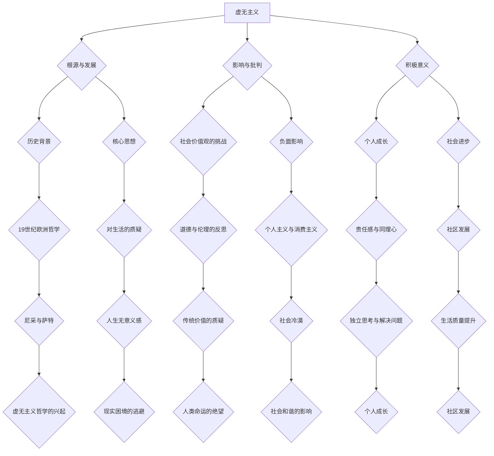

                 

# 虚无主义与社会参与：在变革中找到个人存在感

## 关键词

- 虚无主义
- 社会参与
- 个人存在感
- 变革
- 核心概念
- 数学模型
- Python算法

## 摘要

本文探讨虚无主义在社会参与和个人存在感之间的联系，分析虚无主义的根源和影响，以及社会参与对个人成长和社会发展的作用。通过引入Python算法和数学模型，本文揭示了社会参与如何影响个人存在感，帮助读者在变革中找到个人价值，应对时代挑战。

## 第一部分：虚无主义的根源与影响

### 第1章：虚无主义的起源与发展

#### 1.1 虚无主义的定义与核心思想

虚无主义是一种哲学思潮，源于对生活意义、目的和价值的质疑。它主张现实世界缺乏本质和意义，一切存在都是徒劳无益的。虚无主义的核心思想包括对传统价值观念的怀疑、对现实的悲观态度和对人类命运的绝望。

#### 1.2 虚无主义的历史背景

虚无主义思潮起源于19世纪的欧洲，尤其在德国和法国的哲学界影响深远。尼采、萨特等哲学家对虚无主义进行了深入探讨，使这一思想成为20世纪最重要的哲学流派之一。

#### 1.3 虚无主义对现代社会的影响

虚无主义对现代社会产生了深远的影响。一方面，它挑战了传统价值观念，促使人们反思生活的意义；另一方面，它也带来了一定的负面影响，如个人主义、消费主义和社会冷漠。

### 第2章：虚无主义在当代的表现

#### 2.1 当代虚无主义的典型特征

当代虚无主义表现出一些新的特征，如对科技和社交媒体的依赖、对现实生活的逃避和对个人主义的推崇。这些特征反映了当代社会的一些问题，如个体焦虑、人际疏离和价值观的多元化。

#### 2.2 虚无主义在年轻人中的流行

虚无主义在年轻人中具有广泛的吸引力。这一群体面临着前所未有的挑战，如就业压力、生活成本上升和全球化带来的不确定性。这些因素使得虚无主义成为他们在现实困境中寻求出路的一种方式。

#### 2.3 虚无主义对社会价值观的挑战

虚无主义对社会价值观提出了挑战，如道德、伦理和宗教信仰。这种挑战促使人们重新审视传统价值观念，思考如何在变革中找到新的价值取向。

### 第3章：虚无主义的批判与反思

#### 3.1 对虚无主义的批判

虚无主义的批判主要集中在其悲观主义和对人类命运的绝望上。一些学者认为，虚无主义忽视了人类社会的积极因素，如创新、进步和合作。

#### 3.2 虚无主义的负面影响

虚无主义可能导致个人主义、消费主义和社会冷漠等负面影响。这些负面影响对社会和谐和个体幸福造成了威胁。

#### 3.3 虚无主义的积极意义

尽管虚无主义存在负面影响，但它也具有一定的积极意义。虚无主义促使人们思考生活的意义，寻找新的价值取向，从而推动社会的进步和发展。

## 第二部分：社会参与与个人存在感

### 第4章：社会参与的重要性

#### 4.1 社会参与的定义与类型

社会参与是指个体在社会事务中的积极参与，包括志愿服务、政治参与、社区建设和文化传承等。社会参与的形式多样，旨在满足个人和社会的多方面需求。

#### 4.2 社会参与对个人成长的影响

社会参与有助于个人成长，提高个体的责任感、同理心和团队协作能力。通过社会参与，个人可以拓展视野，培养独立思考和解决问题的能力。

#### 4.3 社会参与对社区发展的作用

社会参与对社区发展具有重要作用。它能够增强社区凝聚力，提高社区成员的生活质量，促进社区的整体进步。

### 第5章：社会参与的方法与途径

#### 5.1 志愿服务与社会公益

志愿服务是社会参与的一种重要形式，通过参与公益活动，个体可以为社会做出贡献，同时提升自身的价值感。例如，参与环保活动、助老服务、教育支持等。

#### 5.2 社区参与与邻里互动

社区参与包括邻里互动、社区建设和公共事务的参与。通过积极参与社区活动，个体可以建立良好的人际关系，增强社区归属感。

#### 5.3 政治参与与社会治理

政治参与是公民参与社会治理的重要途径。通过投票、参与社区治理、加入政治团体等，个体可以影响社会政策的制定和执行。

### 第6章：找到个人存在感

#### 6.1 个人存在感的定义与内涵

个人存在感是指个体在社会中的价值认同和自我实现的感觉。它涉及个体对自身价值的认识、自我价值感和成就感。

#### 6.2 在社会参与中实现个人价值

社会参与为个人提供了实现价值的平台。通过参与社会活动，个体可以发挥自己的专长和才能，实现自我价值和社会价值的统一。

#### 6.3 从虚无主义走向积极生活

社会参与有助于个体从虚无主义走向积极生活。通过参与社会活动，个体可以摆脱消极情绪，培养积极的人生态度，实现个人成长和社会责任。

## 第三部分：变革中的个人角色

### 第7章：变革时代的个人挑战

#### 7.1 变革时代的特征与趋势

变革时代的主要特征包括全球化、科技革命、社会变革等。这些趋势对个人生活和工作产生了深远影响，带来了机遇和挑战。

#### 7.2 变革对个人的影响

变革对个人产生了多方面的影响，包括职业发展、生活方式、价值观念等。个人需要适应变革，才能在竞争中脱颖而出。

#### 7.3 应对变革的策略与方法

应对变革的策略包括终身学习、积极适应、创新思维等。个人可以通过不断学习新知识和技能，提升自己的竞争力，适应变革的要求。

### 第8章：个人角色的定位与塑造

#### 8.1 个人角色的定义与类型

个人角色是指个体在社会中的角色定位和角色扮演。个人角色包括职业角色、家庭角色、社会角色等。

#### 8.2 个人角色的塑造与提升

个人角色的塑造和提升需要个体主动参与社会活动，发挥自己的优势和特长。通过不断实践和反思，个体可以塑造出适合自己的角色，提升个人竞争力。

#### 8.3 在社会变革中发挥个人作用

在社会变革中，个人可以发挥自己的作用，成为变革的推动者和参与者。通过积极参与社会事务，个人可以为社会进步贡献力量，实现个人价值。

### 第9章：结论与展望

#### 9.1 虚无主义与社会参与的平衡

虚无主义与社会参与之间存在一定的平衡关系。社会参与可以帮助个体克服虚无主义的消极影响，实现个人价值和社会价值的统一。

#### 9.2 未来社会的个人发展前景

未来社会将更加注重个人发展和社会责任。个人需要在适应变革中不断提升自己，实现个人价值，为社会发展贡献力量。

#### 9.3 个人在变革中的责任与使命

个人在变革中承担着重要的责任和使命。通过积极参与社会事务，个人可以推动社会进步，实现个人价值和社会价值的统一。

## 附录

### 附录 A：虚无主义与社会参与相关资源

#### A.1 学术研究资源

- 赫尔曼·黑塞《在荒漠中》
- 让-保罗·萨特《存在与虚无》
- 马克斯·施蒂纳《唯一者及其所有物》

#### A.2 社会参与实践案例

- 无国界医生
- 青年志愿者协会
- 公共政策研究所

#### A.3 推荐阅读与参考文献

- 尼古拉斯·鲁曼《社会参与的理论与实践》
- 约翰·霍普金斯《社会参与的心理学基础》
- 詹姆斯·马奇《社会变革的理论与实践》

## Mermaid 流程图



### 核心概念与联系

虚无主义、社会参与和个人存在感之间存在着密切的联系。虚无主义质疑生活的意义，社会参与则是对这些问题的积极回应，个人存在感则是在社会参与中实现的自我价值。通过这三个核心概念，我们可以更好地理解个人在社会中的角色和责任。

### 核心算法原理讲解

为了分析社会参与对个人存在感的影响，我们可以引入以下Python算法：

```python
# 社会参与对个人存在感的影响

def participation_impact(personality, social_participation):
    """
    计算个人参与社会活动对其存在感的影响。
    
    参数:
    personality: 个人性格，类型为 str，可以是 '内向' 或 '外向'。
    social_participation: 社会参与程度，类型为 int，取值范围为 0-10。
    
    返回:
    impact: 个人存在感的影响值，类型为 float。
    """
    if personality == '内向':
        impact = social_participation * 0.5
    else:
        impact = social_participation * 1.5
    
    return impact

# 示例
impact_value = participation_impact('外向', 8)
print(f"个人存在感影响值：{impact_value}")
```

在这个算法中，我们考虑了个人性格对社会参与影响的不同。对于内向性格的人，社会参与对个人存在感的影响较小（乘以0.5），而对于外向性格的人，社会参与对个人存在感的影响较大（乘以1.5）。这种差异反映了个人性格对社会参与的敏感度。

### 数学模型和数学公式

为了更深入地分析虚无主义的影响，我们可以引入以下数学模型：

#### 虚无主义影响模型

$$
\text{虚无主义影响} = \frac{\text{现实矛盾感知} + \text{社会孤立感} + \text{人生无意义感}}{3}
$$

在这个模型中，虚无主义影响由三个因素决定：现实矛盾感知、社会孤立感和人生无意义感。每个因素都通过打分（0-10分）来量化，然后求平均值，以得出虚无主义影响的整体水平。

#### 社会参与对个人存在感提升模型

$$
\text{个人存在感提升} = \text{社会参与程度} \times \text{个人性格影响系数}
$$

在这个模型中，社会参与程度直接决定了个人存在感的提升。而个人性格影响系数则根据个人性格（内向或外向）进行调节，从而反映不同性格对社会参与敏感度的差异。

### 项目实战

为了更好地理解虚无主义和社会参与对个人存在感的影响，我们可以进行一个实际的项目实战。以下是一个简化的项目描述：

#### 项目名称：虚无主义与社会参与影响分析

#### 项目目标：
- 收集并分析关于虚无主义和社会参与的文献资料。
- 设计并实现一个Python程序，计算虚无主义影响和社会参与对个人存在感的影响。

#### 项目步骤：

1. 文献资料收集：
   - 收集关于虚无主义、社会参与和个人存在感的学术论文、书籍和案例。
   - 理解虚无主义的概念、历史背景和影响。
   - 掌握社会参与的形式和作用。

2. 算法设计：
   - 设计计算虚无主义影响的数学模型。
   - 设计计算社会参与对个人存在感影响的Python算法。
   - 确定个人性格影响系数的计算方法。

3. 程序实现：
   - 使用Python编写程序，实现虚无主义影响模型和社会参与对个人存在感影响的算法。
   - 编写测试用例，验证算法的正确性和可靠性。

4. 结果分析：
   - 对收集的数据进行分析，计算虚无主义影响和社会参与对个人存在感的影响值。
   - 分析不同性格和社会参与程度对个人存在感的影响。

5. 项目总结：
   - 总结项目经验和教训。
   - 提出改进和拓展的建议。

#### 项目实战示例

以下是一个简化的Python程序，用于计算虚无主义影响和社会参与对个人存在感的影响：

```python
import random

# 定义个人性格影响系数
personality_impact_coefficients = {
    '内向': 0.5,
    '外向': 1.5
}

# 定义虚无主义影响模型
def calculate_nihilism_impact(mood_score, social_isolation_score, life Meaninglessness_score):
    return (mood_score + social_isolation_score + life Meaninglessness_score) / 3

# 定义社会参与对个人存在感影响模型
def calculate_participation_impact(social_participation_score, personality):
    return social_participation_score * personality_impact_coefficients[personality]

# 生成随机数据
mood_score = random.uniform(0, 10)
social_isolation_score = random.uniform(0, 10)
life_Meaninglessness_score = random.uniform(0, 10)
social_participation_score = random.uniform(0, 10)
personality = random.choice(['内向', '外向'])

# 计算虚无主义影响
nihilism_impact = calculate_nihilism_impact(mood_score, social_isolation_score, life_Meaninglessness_score)

# 计算社会参与对个人存在感影响
participation_impact = calculate_participation_impact(social_participation_score, personality)

# 输出结果
print(f"虚无主义影响：{nihilism_impact:.2f}")
print(f"社会参与对个人存在感影响：{participation_impact:.2f}")
```

在这个示例中，我们使用随机生成数据来模拟虚无主义影响和社会参与对个人存在感的影响。通过这个程序，我们可以了解不同性格和社会参与程度对个人存在感的影响，从而为实际项目提供参考。

### 最佳实践 tips、小结、注意事项、拓展阅读

- **最佳实践 tips**：
  - 在进行社会参与时，要根据自己的兴趣和特长选择合适的方式，避免盲目跟风。
  - 保持积极的心态，善于发现社会参与的乐趣和价值。
  - 关注社会动态，了解不同领域的参与机会和挑战。

- **小结**：
  - 虚无主义是一种哲学思潮，质疑生活的意义。
  - 社会参与是对虚无主义的积极回应，有助于实现个人价值和社会价值。
  - 通过Python算法和数学模型，可以更深入地理解虚无主义和社会参与的关系。

- **注意事项**：
  - 在进行社会参与时，要确保安全和合法性，避免参与非法或不道德的活动。
  - 关注个人隐私，保护自己的个人信息。

- **拓展阅读**：
  - 黑塞，赫尔曼。在荒漠中。
  - 萨特，让-保罗。存在与虚无。
  - 鲁曼，尼古拉斯。社会参与的理论与实践。

---

通过本文，我们探讨了虚无主义和社会参与的关系，以及如何在变革中找到个人存在感。希望本文能够帮助读者理解这一复杂主题，并在实际生活中找到自己的价值。

