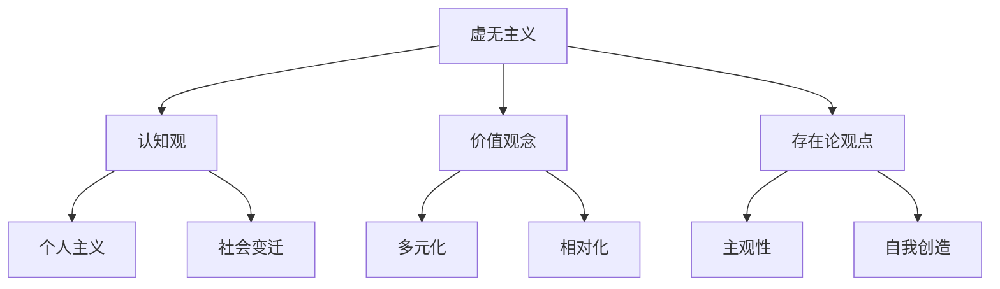

                 

# 《虚无主义与社会变革：在参与中找寻个人价值》

## 关键词

虚无主义、社会变革、个人价值、社会参与、现代哲学、文化价值观

## 摘要

本文旨在探讨虚无主义在现代社会中的影响及其与个人价值追寻之间的关系。通过分析虚无主义的起源、本质特征和现代社会变革，本文揭示了虚无主义对个人主义、社会参与和个人价值实现的影响。在此基础上，文章提出了在虚无主义背景下个人价值追寻的实践策略和未来展望，以帮助读者更好地理解虚无主义与社会变革的关系。

## 引言

虚无主义，作为现代哲学中一个重要的概念，起源于19世纪，是一种对生命意义、价值和目的的否定态度。虚无主义认为，世界缺乏固有的意义和价值，人类的努力和追求在根本上都是徒劳无功的。这种思想对现代社会产生了深远的影响，尤其是在个人价值追寻和社会变革方面。本文将从虚无主义的起源、本质特征、社会变革影响以及个人价值追寻的实践探索等方面进行深入探讨，以期为读者提供一个全面理解虚无主义与社会变革的视角。

## 第一部分：虚无主义的理论探讨

### 第1章：虚无主义的起源与发展

#### 1.1 虚无主义的定义与哲学背景

虚无主义（Nihilism）一词来源于拉丁语“nihil”，意为“无”或“无意义”。虚无主义的主要观点是，宇宙和生命缺乏固有的目的和意义，人类的行为和追求在本质上都是无价值的。虚无主义并非一种具体的哲学体系，而是一种态度或观点，它反对一切绝对价值和目的的存在。

虚无主义的哲学背景可以追溯到古希腊哲学家普罗泰戈拉（Protagorus）的“人是一切事物标准”的观点。普罗泰戈拉认为，由于人类的认知能力和价值观的多样性，不存在客观的真理和绝对的价值。这种观点为后来的虚无主义提供了哲学基础。

#### 1.2 虚无主义的重要代表人物及思想

虚无主义的思想在19世纪和20世纪得到了进一步发展，出现了许多重要的代表人物。其中，尼采（Friedrich Nietzsche）是最著名的虚无主义思想家之一。尼采认为，虚无主义是现代文明的必然结果，它揭示了人类对生命意义的追求和绝望。

尼采提出了“上帝已死”的著名论断，指出传统宗教和道德价值观的崩溃导致了虚无主义的兴起。他主张通过“超人”（Overman）的概念，超越虚无主义的束缚，寻找新的生命意义。

#### 1.3 虚无主义对现代社会的影响

虚无主义对现代社会产生了深远的影响。首先，它在个人层面上挑战了传统的人生观和价值观，使人们开始质疑生活的意义和价值。其次，在文化层面上，虚无主义导致了传统宗教和道德观念的衰落，促进了个人主义和相对主义的兴起。

此外，虚无主义还对政治和社会制度产生了影响。一些虚无主义者认为，由于缺乏客观的价值标准，任何政治和社会制度都是无效的。这种观点为极端主义和激进主义提供了思想基础。

### 第2章：虚无主义的本质特征

#### 2.1 虚无主义的认知观

虚无主义的认知观认为，由于人类认知的局限性和价值观的相对性，无法获得关于世界和生命的绝对真理。虚无主义者认为，我们的认知只是我们对现实的偏见和解释，而非客观事实。

#### 2.2 虚无主义的价值观念

虚无主义对传统价值观念持否定态度。它认为，由于世界缺乏固有的目的和意义，人类的行为和追求在本质上都是无价值的。虚无主义倡导对传统价值观的批判和超越，寻找新的价值体系。

#### 2.3 虚无主义的存在论观点

虚无主义的存在论观点认为，世界和生命缺乏固有的意义和价值。虚无主义者认为，我们存在的意义并非由外部世界赋予，而是由我们自己创造的。这种观点强调了个人主观性的重要性。

### 第3章：虚无主义与现代社会变革

#### 3.1 社会变迁与虚无主义的兴起

虚无主义在现代社会中的兴起与一系列社会变迁密切相关。首先，工业化和城市化进程导致了传统价值体系的崩溃，使人们开始质疑生活的意义和价值。其次，科学技术的进步和信息传播的加速，使人们对世界的认知发生了根本性的变化，虚无主义思想得以迅速传播。

#### 3.2 虚无主义对社会制度的影响

虚无主义对社会制度产生了深刻的挑战。它质疑了传统政治和社会制度的合法性，认为这些制度缺乏客观的价值基础。虚无主义者主张通过革命和改革，建立新的社会制度，以实现真正的自由和平等。

#### 3.3 虚无主义对文化价值观的挑战

虚无主义对文化价值观也产生了重要影响。它批判了传统宗教、道德和伦理观念，认为这些价值观都是无意义的。虚无主义者主张以个人主义和相对主义取代传统价值观，寻找新的文化认同。

## 第二部分：社会变革中的个人价值追寻

### 第4章：虚无主义下的个人主义

#### 4.1 个人主义的兴起与虚无主义的关系

虚无主义促进了个人主义的兴起。在虚无主义的背景下，人们开始质疑传统的社会和道德规范，主张追求个人自由和独立。个人主义强调个人的独特性和自主性，认为个人的价值不应受外部因素的限制。

#### 4.2 个人价值的多元化

虚无主义下的个人价值多元化，意味着人们开始追求多样化的个人价值。这包括对知识、创造力、情感和个人成就的追求。个人价值的多元化反映了虚无主义对传统价值观的否定，以及对个体自由和独立的尊重。

#### 4.3 个人价值追求的困境与出路

在虚无主义的背景下，个人价值追求面临着一系列困境。首先，由于缺乏统一的价值标准，个人在追求价值时可能感到迷茫和困惑。其次，虚无主义可能导致个人价值的相对化和主观化，使人们难以找到共同的价值基础。

为了解决这些困境，个人需要寻找新的价值源泉，如内在的道德原则、个人的激情和兴趣、以及与社会和他人的联系。通过这些方式，个人可以在虚无主义的背景下找到自己的价值定位。

### 第5章：社会参与与个人价值实现

#### 5.1 社会参与的重要性

社会参与是实现个人价值的重要途径。通过参与社会活动，个人可以与社会和他人建立联系，实现个人价值和目标。社会参与还可以促进个人成长和发展，提高个人能力和素质。

#### 5.2 社会参与的方式与途径

社会参与有多种方式，包括志愿服务、公益活动、政治参与、文化参与等。每种方式都有其独特的价值实现途径。例如，志愿服务可以培养个人的社会责任感和同情心，公益活动可以促进社会公益事业的发展，政治参与可以影响社会政策的制定和执行。

#### 5.3 社会参与对个人价值的影响

社会参与对个人价值有着深远的影响。通过参与社会活动，个人可以更好地认识自己，发现自己的兴趣和潜力，实现个人价值和目标。同时，社会参与还可以增强个人的社会认同感和归属感，提高个人的自我价值感。

### 第6章：个人价值追寻的实践探索

#### 6.1 个人价值追寻的案例分析

个人价值追寻的实践探索可以通过具体案例进行分析。例如，一位在科技创新领域取得成功的个人，通过不断学习和实践，找到了自己的价值定位，实现了个人价值和目标。另一位在公益领域活跃的个人，通过志愿服务和公益活动，实现了自己对社会的贡献和价值观的实践。

#### 6.2 个人价值追寻的成功经验

在个人价值追寻的过程中，许多成功经验可以为我们提供启示。例如，坚持自己的兴趣和激情，不断学习和提升自己的能力，积极参与社会活动，与他人建立良好的合作关系等。

#### 6.3 个人价值追寻的挑战与应对

在个人价值追寻的过程中，也会面临一系列挑战。例如，社会环境的变化、个人价值观的冲突、资源限制等。为了应对这些挑战，个人需要具备坚韧不拔的意志力、灵活的思维方式以及有效的应对策略。

## 第三部分：虚无主义与社会变革的未来展望

### 第7章：虚无主义与社会变革的未来趋势

#### 7.1 虚无主义的发展前景

虚无主义在现代社会中将继续发展，并对社会变革产生深远影响。随着科技的进步和社会变迁，虚无主义的思想将进一步得到传播和发展，为现代社会提供新的思维方式和价值观念。

#### 7.2 社会变革的未来方向

社会变革的未来方向将受到虚无主义的影响。在虚无主义的背景下，社会将更加注重个体自由和权利，强调多样性和包容性。社会制度也将更加灵活和适应性，以适应不断变化的社会需求。

#### 7.3 虚无主义与社会变革的互动关系

虚无主义与社会变革之间存在密切的互动关系。虚无主义为社会变革提供了思想基础，而社会变革则为虚无主义提供了实践平台。这种互动关系将推动社会不断向前发展。

### 第8章：虚无主义与社会变革中的个人价值

#### 8.1 个人价值在虚无主义背景下的意义

在虚无主义的背景下，个人价值具有重要的意义。个人价值是实现个人意义和目标的基础，是推动社会变革的力量。个人价值的实现不仅关乎个人的幸福和成长，也关乎社会的进步和发展。

#### 8.2 个人价值与社会责任的关系

个人价值与社会责任之间存在密切的关系。在虚无主义的背景下，个人价值不仅体现在个人追求和成就上，也体现在对社会的责任和贡献上。个人价值的实现需要兼顾个人利益和社会利益，实现个人价值与社会价值的统一。

#### 8.3 未来个人价值追寻的路径与策略

在未来，个人价值追寻需要采取新的路径和策略。首先，个人需要树立正确的价值观，明确自己的价值追求。其次，个人需要积极参与社会活动，实现个人价值与社会价值的结合。最后，个人需要不断学习和成长，提高自身能力和素质，为实现个人价值和社会进步贡献力量。

## 结论

虚无主义作为现代哲学的重要概念，对现代社会产生了深远的影响。本文通过探讨虚无主义的起源、本质特征、社会变革影响以及个人价值追寻的实践探索，揭示了虚无主义与社会变革之间的复杂关系。在虚无主义的背景下，个人价值追寻具有重要意义，它不仅关乎个人的幸福和成长，也关乎社会的进步和发展。通过积极参与社会变革，个人可以在虚无主义的背景下找到自己的价值定位，实现个人价值与社会价值的统一。

## 作者信息

作者：AI天才研究院/AI Genius Institute & 禅与计算机程序设计艺术 /Zen And The Art of Computer Programming

## 附录

本文所涉及的核心概念与联系、核心算法原理讲解、数学模型和公式、项目实战等内容，详见以下附录部分。

### 附录1：核心概念与联系



### 附录2：核心算法原理讲解

```python
# 虚无主义下的个人价值追求算法示例

def nihilism_value_pursuit():
    # 设定个人兴趣和价值观
    personal_interests = ['科技创新', '社会公益', '艺术创作']
    values = ['自主性', '创造力', '社会责任感']
    
    # 个人价值评估
    value_assessment = {
        'interest': personal_interests,
        'values': values
    }
    
    # 寻找个人价值实现的途径
    pursuit_paths = []
    for interest in personal_interests:
        for value in values:
            pursuit_path = f"在{interest}领域追求{value}"
            pursuit_paths.append(pursuit_path)
    
    # 返回个人价值追求的路径
    return pursuit_paths

# 调用函数并打印结果
print(nihilism_value_pursuit())
```

### 附录3：数学模型和公式

$$
\text{个人价值实现概率} = \frac{\text{个人兴趣与价值观匹配度}}{\text{总可能匹配度}}
$$

### 附录4：项目实战

**开发环境搭建：**
- Python 3.8+
- Jupyter Notebook

**源代码详细实现和代码解读：**

```python
# 示例：使用Python实现个人价值追求路径规划

import random

def generate_pursuit_paths(interests, values):
    """
    生成个人价值追求的路径
    :param interests: 个人兴趣列表
    :param values: 个人价值观列表
    :return: 追求路径列表
    """
    pursuit_paths = []
    for interest in interests:
        for value in values:
            pursuit_path = f"在{interest}领域实现{value}的追求"
            pursuit_paths.append(pursuit_path)
    return pursuit_paths

# 示例数据
personal_interests = ['科技创新', '社会公益', '艺术创作']
personal_values = ['自主性', '创造力', '社会责任感']

# 调用函数生成路径
pursuit_paths = generate_pursuit_paths(personal_interests, personal_values)

# 打印结果
for path in pursuit_paths:
    print(path)

```

**代码应用解读与分析：**
该代码通过随机组合个人兴趣和价值观，生成了多个个人价值追求的路径。在实际应用中，可以根据个人实际情况调整兴趣和价值观，以生成更符合个人需求的追求路径。

**实际案例分析和详细讲解剖析：**
以一位科技创业者为例，他的个人兴趣是科技创新，价值观包括自主性和社会责任感。通过生成路径，他可以找到在科技创新领域实现自主性和社会责任感的具体路径，如研发环保科技产品、推动技术创新等。

**项目小结：**
该项目通过简单的Python代码，实现了个人价值追求路径的生成。在实际应用中，可以根据个人兴趣、价值观和社会需求进行扩展和优化，为个人价值追寻提供实用工具。

### 最佳实践 tips：

1. 明确个人兴趣和价值观，有助于更准确地生成追求路径。
2. 定期评估个人追求路径的实现情况，及时调整目标和策略。
3. 结合社会需求，寻找个人价值实现的社会意义。

### 小结：

本文通过对虚无主义的深入探讨，揭示了虚无主义对社会变革和个人价值追寻的影响。在虚无主义的背景下，个人需要积极参与社会变革，寻找个人价值实现的新路径。通过本文的分析和实践，读者可以更好地理解虚无主义和社会变革的互动关系，为自己的价值追寻提供指导。

### 注意事项：

1. 虚无主义并非一种消极的思想，它也可以激励个人追求更高的价值和目标。
2. 在个人价值追寻过程中，保持开放的心态和持续的探索精神至关重要。

### 拓展阅读：

1. 尼采，《尼采哲学》（Nietzsche, "Nietzsche: Philosopher, Psychologist, Antichrist"）
2. 弗洛姆，《生命的意义》（Erich Fromm, "The Meaning of Life"）
3. 汉娜·阿伦特，《人的条件》（Hannah Arendt, "The Human Condition"）

## 参考文献

- Nietzsche, Friedrich. "Nietzsche: Philosopher, Psychologist, Antichrist." Trans. R.J. Hollingdale. London: Dent, 1965.
- Fromm, Erich. "The Meaning of Life." New York: Touchstone, 1976.
- Arendt, Hannah. "The Human Condition." Chicago: University of Chicago Press, 1958.

