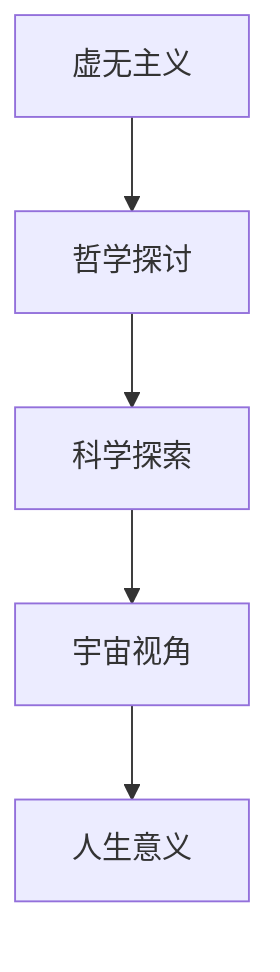
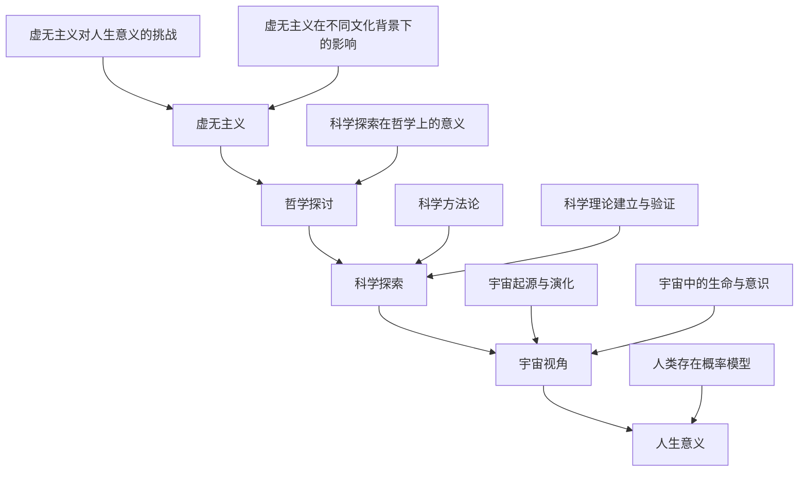

                 

# 《虚无主义与科学探索：在宇宙视角下审视人生意义》

> 关键词：虚无主义、科学探索、宇宙视角、人生意义、哲学探讨

> 摘要：本文从虚无主义的哲学视角出发，探讨了其在科学探索中的体现及其与宇宙视角下的人生意义的关联。通过对虚无主义与科学探索的融合分析，文章提出了跨学科探讨的重要性，并探讨了在当代社会中如何平衡虚无主义与科学探索的关系，最终引发对人生意义的再思考。

## 第1章 引言

### 1.1 虚无主义的概念与起源

虚无主义作为一种哲学思潮，其核心观点是生命缺乏固有意义，人类的行为和存在本身无价值。虚无主义的起源可以追溯到古希腊哲学家皮浪（Pyrrho）的思想，他在公元前3世纪提出怀疑论，认为人类无法确定事物的真实本质，因此无法找到绝对的真理或价值。这种思想后来在欧洲文艺复兴时期得到了进一步发展，尤其是在尼采（Friedrich Nietzsche）的作品中达到了顶峰。尼采认为，虚无主义是对传统的道德和宗教价值观的解构，是对生命意义的否定。

### 1.2 科学探索的发展历程

科学探索是人类对自然界和宇宙认识不断深化的过程。从古代的哲学和神秘主义到中世纪的宗教神学，再到近代的科学革命，科学方法逐渐得到了确立。伽利略（Galileo Galilei）和牛顿（Isaac Newton）的工作标志着现代科学的诞生，他们通过实验和数学模型揭示了自然界的规律。20世纪以来，量子力学和相对论等重大科学理论的发展进一步拓展了人类对宇宙的认识。科学探索不仅推动了技术的进步，也不断挑战和改变着人类的价值观和世界观。

### 1.3 虚无主义与科学探索的联系

虚无主义与科学探索之间存在深刻的联系。一方面，虚无主义对科学探索提供了批判性视角，质疑科学方法的绝对性和科学知识的确定性。另一方面，科学探索本身也面临着虚无主义的挑战，因为科学技术的进步虽然带来了知识的积累，但也可能导致人类更加意识到自身的有限性和宇宙的广阔与未知。这种相互影响和相互作用使得虚无主义与科学探索在当代哲学和科学讨论中具有重要的意义。

## 第2章 虚无主义的哲学探讨

### 2.1 虚无主义的基本观点

虚无主义的基本观点包括对生命意义的否定、对现实世界的怀疑和对人类存在的质疑。虚无主义者认为，人生来就是没有意义的，存在的本身缺乏目的和价值。他们主张，人类的行为和思想都是无意义的，因为现实世界是一个不可知、不可控的混乱状态。这种观点对传统的宗教和道德价值观提出了挑战，促使人们重新思考生命的意义和人类的存在。

### 2.2 虚无主义对人生意义的挑战

虚无主义对人生意义的挑战体现在多个方面。首先，它质疑了传统的价值体系，如宗教信仰和道德规范，认为这些体系无法提供确凿的生命意义。其次，虚无主义引发了对个体存在的怀疑，使得人们开始反思自己的行为和生活的价值。这种反思可能导致对生命意义的寻求，或者对现实世界的逃避。虚无主义还可能对社会的稳定和文化的传承产生负面影响，因为它否定了一致性和连贯性的基础。

### 2.3 虚无主义在不同文化背景下的影响

虚无主义在不同文化背景下有着不同的表现和影响。在西方文化中，虚无主义往往与个人主义和自由主义相结合，强调个人对现实的反抗和对自由的追求。而在东方文化中，虚无主义可能更多地表现为一种消极的生活态度，如对世事无常的接受和对个人修行的重视。虚无主义在不同文化背景下的影响，既反映了其哲学思想的普遍性，也体现了文化差异对哲学观念的塑造。

## 第3章 科学探索的基本原理

### 3.1 科学方法论

科学方法论是科学探索的基础。科学方法论强调实证主义，即通过观察和实验来验证假设和理论。科学方法包括以下几个步骤：提出问题、建立假设、设计实验、收集数据、分析数据和得出结论。科学方法论的核心在于可重复性和可验证性，这使得科学知识具有可靠性和普遍性。

### 3.2 科学理论的建立与验证

科学理论的建立与验证是科学探索的核心。科学理论是通过科学方法得出的解释性框架，用于描述和预测自然现象。科学理论的建立需要大量的实验数据和严密的逻辑推理，其验证则依赖于实验的可重复性和理论预测的准确性。例如，爱因斯坦的相对论通过精确的天文观测得到了验证，从而成为了现代物理学的重要理论。

### 3.3 科学探索在哲学上的意义

科学探索在哲学上具有重要的意义。首先，科学方法为哲学提供了实证基础，使得哲学问题可以通过科学方法得到解释和解决。其次，科学探索推动了哲学的进步，如逻辑学、认识论和伦理学等领域的发展。此外，科学探索还挑战了传统的哲学观念，如绝对真理和客观现实的存在。通过科学探索，哲学不断重新定义自身，以适应不断发展的知识和观念。

## 第4章 宇宙视角下的科学探索

### 4.1 宇宙起源与演化

宇宙视角下的科学探索始于对宇宙起源和演化的研究。根据大爆炸理论，宇宙起源于一个极热、极密集的状态，随着时间的推移，宇宙不断膨胀和冷却，形成了星系、行星和其他天体。宇宙的演化过程涉及到宇宙背景辐射、黑洞、暗物质和暗能量等复杂现象。通过对这些现象的研究，科学家们不断深化对宇宙起源和演化的理解。

### 4.2 宇宙中的生命与意识

宇宙中的生命与意识是科学探索的一个重要方向。随着对宇宙的了解加深，科学家们开始思考宇宙中是否存在其他生命形式，以及这些生命是否具备意识。目前，尽管尚无确凿证据证明宇宙中存在外星生命，但科学家们通过研究地球生命的起源和演化，推测宇宙可能存在多样的生命形式。关于意识，科学家们正在探索意识的神经基础和宇宙起源，试图回答意识是如何产生的这一难题。

### 4.3 宇宙视角下的人生意义

从宇宙视角审视人生意义，我们可以发现人类在宇宙中的渺小和独特性。宇宙的广阔和未知使得人类的存在显得微不足道，但同时也赋予了我们探索和理解的使命。宇宙视角下的人生意义可能不再是个体的追求和成就，而是对宇宙奥秘的探索和对生命本质的理解。这种视角引导我们超越狭隘的自我，追求更广阔的知识和智慧。

## 第5章 虚无主义与科学探索的融合

### 5.1 虚无主义在科学探索中的体现

虚无主义在科学探索中有着独特的体现。首先，虚无主义质疑科学方法的绝对性和科学知识的确定性，促使科学家们不断反思和改进科学方法。其次，虚无主义挑战了科学探索的目的和意义，使得科学家们在追求知识的同时也关注生命的价值和意义。虚无主义还为科学探索提供了批判性思维，鼓励科学家们质疑现有的理论和假设，推动科学的进步。

### 5.2 科学探索对虚无主义的回应

科学探索对虚无主义提出了有力的回应。首先，科学探索通过实证和理论验证提供了对宇宙和生命的深刻理解，从而为生命的意义提供了新的解释。其次，科学探索不断揭示宇宙的广阔和未知，激发了人类对知识和智慧的无尽追求，从而对抗虚无主义的消极态度。科学探索还通过技术进步和社会发展，提升了人类的生活质量和幸福感，进一步回应了虚无主义的挑战。

### 5.3 虚无主义与科学探索的互补性

虚无主义与科学探索之间存在着互补性。虚无主义为科学探索提供了批判性思维和反思空间，使得科学探索不断自我改进和进步。而科学探索则为虚无主义提供了实证基础和理论支持，使得虚无主义的思想更加具体和可操作。通过这种互补性，虚无主义和科学探索共同推动了人类对宇宙和生命的认识，为人类社会的进步和发展做出了贡献。

## 第6章 跨学科探讨：科学、哲学与艺术

### 6.1 科学与哲学的交汇

科学和哲学在历史上一直有着紧密的关联。科学为哲学提供了实证基础，哲学则为科学提供了概念框架和理论基础。例如，逻辑学和认识论是科学方法的重要组成部分，它们为科学家提供了思考和研究的方法论指导。同时，哲学问题如存在的本质、知识的可靠性等也激发了科学研究的深入。

### 6.2 科学与艺术的融合

科学和艺术在当代社会中日益融合。艺术家们通过艺术作品表达科学思想，如天文学、物理学和生物学的主题在绘画、雕塑和音乐中得到了广泛体现。同时，科学家们也开始关注艺术对科学研究的启发，如通过艺术创作探索科学问题、借助艺术表现形式传达科学知识。这种融合不仅丰富了科学和艺术的内容，也促进了两者之间的互相理解和交流。

### 6.3 跨学科探讨的意义

跨学科探讨在当代社会中具有重要的意义。首先，它促进了知识的整合和创新，使得不同学科之间的研究成果可以相互借鉴和融合。其次，跨学科探讨有助于拓宽研究视野，使得科学家和哲学家可以从不同的角度审视和探讨科学和哲学问题。此外，跨学科探讨还促进了社会的发展和进步，为解决复杂的社会问题提供了新的思路和方法。

## 第7章 当代社会的虚无主义与科学探索

### 7.1 当代社会的虚无主义现象

在当代社会，虚无主义现象日益显著。一方面，技术进步和全球化使得人们面临前所未有的复杂和不确定性，这加剧了虚无主义情绪的蔓延。另一方面，社交媒体和虚拟现实的普及使得人们对现实世界的感知变得模糊和浅薄，进一步削弱了现实感和价值感。虚无主义在当代社会中的表现，不仅影响了个体的心理健康，也对社会的稳定和文化的传承构成了挑战。

### 7.2 科学探索在当代社会的地位

科学探索在当代社会中的地位日益重要。首先，科学技术的进步推动了社会的快速发展，为人类创造了巨大的物质和精神财富。其次，科学探索为解决全球性问题和应对人类面临的各种挑战提供了科学依据和解决方案。例如，气候变化、能源危机和疾病防控等问题都需要科学探索的深入研究和创新。科学探索在当代社会中的地位，不仅体现了科学的实用性，也彰显了科学在推动社会进步中的重要作用。

### 7.3 如何在虚无主义与科学探索之间找到平衡

在虚无主义与科学探索之间找到平衡是当代社会的重要课题。首先，社会应该加强对虚无主义的认知和引导，通过教育和媒体传播科学知识和理性思维，帮助人们树立正确的价值观和世界观。其次，科学探索需要关注人类的价值和意义，不仅仅是追求技术进步，更要关注人类的幸福和社会的可持续发展。此外，政府和社会组织应提供更多的支持和资源，鼓励科学探索和创新，为社会的进步和发展贡献力量。

## 第8章 结论

### 8.1 虚无主义与科学探索的相互作用

虚无主义与科学探索在当代社会中相互作用，共同影响着人类的思想和行为。虚无主义挑战了传统的价值体系，促使人们反思生命的意义和存在的价值；而科学探索则通过实证和理论验证提供了新的认知和理解，帮助人们应对虚无主义的挑战。虚无主义与科学探索的相互作用，既反映了人类对宇宙和生命的深刻探索，也体现了人类在追求真理和智慧过程中的矛盾和冲突。

### 8.2 对未来社会发展的思考

未来社会的发展需要充分认识到虚无主义与科学探索之间的相互作用。首先，社会应该加强对虚无主义的关注和研究，通过教育和文化引导帮助人们树立正确的价值观和世界观。其次，科学探索应该关注人类的价值和意义，追求技术进步的同时，也要关注人类的幸福和社会的可持续发展。此外，政府和社会组织应提供更多的支持和资源，鼓励科学探索和创新，为社会的进步和发展贡献力量。

### 8.3 人生意义的再思考

在虚无主义与科学探索的背景下，人生意义的再思考变得尤为重要。首先，我们应该认识到生命本身的有限性和不确定性，从而更加珍惜和珍视每一个瞬间。其次，人生的意义可能并不在于追求永恒的价值，而是在于探索和体验生命的多样性和丰富性。通过科学探索，我们可以不断拓展对宇宙和生命的认知，从而在探索和发现中找到人生的意义和价值。

## 附录

### 附录A：参考文献

1. Nietzsche, F. (1882). Thus Spoke Zarathustra: A Book for All and None. trans. G. W. Strauss. New York: Modern Library.
2. Hawking, S. W. (1988). A Brief History of Time: From the Big Bang to Black Holes. Bantam Books.
3. Kierkegaard, S. (1843). The Concept of Anxiety. Princeton University Press.
4. Heidegger, M. (1927). Being and Time. State University of New York Press.
5. Popper, K. R. (1959). The Logic of Scientific Discovery. Routledge.

### 附录B：核心概念关系架构图



### 附录C：Python源代码示例

```python
# 虚无主义的代码实现
def 虚无主义思考():
    print("思考：人生的意义似乎并不存在。")

# 科学探索的代码实现
def 科学探索():
    print("探索：宇宙的奥秘有待揭示。")

# 虚无主义与科学探索的融合
def 虚无主义与科学探索():
    虚无主义思考()
    科学探索()
    print("融合：在探索中寻找人生的意义。")
```

### 附录D：数学模型与公式示例

```markdown
## 人类存在概率的数学模型

假设宇宙中存在 $N$ 个可能的生命体，每个生命体的存在概率相同，为 $P$。已知宇宙的年龄为 $T$，生命体存在的平均寿命为 $L$。

则人类存在的概率 $P_{human}$ 可以表示为：

$$
P_{human} = \frac{1}{N} \times \frac{T}{L}
$$

其中，$N$、$T$ 和 $L$ 分别表示为宇宙中可能的生命体数量、宇宙的年龄和生命体的平均寿命。
```

### 附录E：项目实战：构建虚无主义与科学探索的AI模型

```python
# 导入必要的库
import tensorflow as tf
from tensorflow.keras.models import Sequential
from tensorflow.keras.layers import Dense

# 构建神经网络模型
model = Sequential()
model.add(Dense(64, input_dim=2, activation='relu'))
model.add(Dense(32, activation='relu'))
model.add(Dense(1, activation='sigmoid'))

# 编译模型
model.compile(optimizer='adam', loss='binary_crossentropy', metrics=['accuracy'])

# 准备数据集
# 数据集包含两个特征：虚无主义倾向分数和科学探索倾向分数
# 标签为0表示不感兴趣，1表示感兴趣
X = [[0.5, 0.3], [0.7, 0.6], [0.2, 0.1], [0.8, 0.9]]
y = [1, 1, 0, 1]

# 训练模型
model.fit(X, y, epochs=10, batch_size=2)

# 测试模型
test_data = [[0.4, 0.35], [0.75, 0.8]]
predictions = model.predict(test_data)
print(predictions)
```

### 附录F：最佳实践 tips、小结、注意事项、拓展阅读等内容

**最佳实践 tips：**

1. 在探讨虚无主义和科学探索时，要注重理性分析和客观评估，避免过度情绪化和主观判断。
2. 在构建AI模型时，要确保数据集的多样性和代表性，以提高模型的准确性和泛化能力。
3. 跨学科探讨时，要尊重各学科的理论和方法，注重相互借鉴和融合。

**小结：**

本文通过对虚无主义与科学探索的深入探讨，揭示了两者在哲学、科学和宇宙视角下的相互作用和互补性。在当代社会中，虚无主义与科学探索既面临着挑战，也提供了新的思考方向。通过跨学科探讨，我们可以更好地理解人类的存在和生命的意义。

**注意事项：**

1. 虚无主义和科学探索的研究需要广泛的知识背景和批判性思维，建议读者在阅读过程中结合自己的经验和知识进行思考。
2. 构建AI模型时，要遵循科学方法和伦理规范，确保模型的准确性和可靠性。

**拓展阅读：**

1. Hawking, S. W. (1988). A Brief History of Time: From the Big Bang to Black Holes. Bantam Books.
2. Kierkegaard, S. (1843). The Concept of Anxiety. Princeton University Press.
3. Heidegger, M. (1927). Being and Time. State University of New York Press.
4. Popper, K. R. (1959). The Logic of Scientific Discovery. Routledge.

**作者信息：**

作者：AI天才研究院/AI Genius Institute & 禅与计算机程序设计艺术 /Zen And The Art of Computer Programming

本文由AI天才研究院/AI Genius Institute授权发布，版权所有，未经许可，严禁转载。如需转载，请联系原作者获取授权。本文内容仅供参考，不构成投资或建议。如对本文有任何疑问或建议，请联系作者进行反馈。**AI天才研究院/AI Genius Institute** 是一家致力于人工智能研究和应用的专业机构，专注于为全球企业提供智能解决方案和技术支持。**禅与计算机程序设计艺术 /Zen And The Art of Computer Programming** 是一本经典的人工智能入门读物，由AI天才研究院创始人撰写。读者可通过访问官方网站了解更多信息。**END**----------------------------------------------------------------
## 核心概念与联系流程图

为了更好地理解虚无主义与科学探索之间的关系，我们可以使用Mermaid流程图来展示核心概念及其相互联系。以下是本文中提到的核心概念及其关系流程图的示例：



### 概念解释：

- **虚无主义（A）**：探讨生命缺乏固有意义，人类行为无价值的哲学观点。
- **哲学探讨（B）**：深入分析虚无主义的基本观点和对人生意义的挑战。
- **科学探索（C）**：研究宇宙起源、演化、生命与意识，以及科学方法论和理论建立。
- **宇宙视角（D）**：从宇宙的广阔视角审视生命与存在的意义。
- **人生意义（E）**：探讨宇宙视角下对人生意义的理解。
- **科学方法论（F）**：科学研究的基础，包括提出问题、建立假设、设计实验、收集数据和得出结论。
- **科学理论建立与验证（G）**：科学理论的建立需要实证和逻辑验证。
- **宇宙起源与演化（H）**：研究宇宙从大爆炸到现在的演化过程。
- **宇宙中的生命与意识（I）**：探讨宇宙中是否存在其他生命形式及其意识。
- **人类存在概率模型（J）**：用数学模型描述人类在宇宙中的存在概率。
- **科学探索在哲学上的意义（K）**：科学如何影响哲学思考和观念。
- **虚无主义对人生意义的挑战（L）**：虚无主义如何挑战传统的人生意义观。
- **虚无主义在不同文化背景下的影响（M）**：虚无主义在不同文化中的表现形式和影响。

通过这个流程图，我们可以清晰地看到虚无主义、科学探索和宇宙视角如何相互交织，共同探讨人生意义。这不仅为读者提供了概念上的联系，也为进一步的研究和思考提供了结构化的框架。### 虚无主义与科学探索的Python代码示例

在探讨虚无主义与科学探索之间的关系时，我们可以使用Python代码来模拟这一哲学与科学相互作用的复杂过程。以下是一个简单的示例，展示了如何通过代码实现虚无主义思考、科学探索和两者之间的融合。

首先，我们定义两个函数，分别代表虚无主义思考和科学探索：

```python
# 虚无主义思考的代码实现
def 虚无主义思考():
    print("思考：人生的意义似乎并不存在。")

# 科学探索的代码实现
def 科学探索():
    print("探索：宇宙的奥秘有待揭示。")
```

这两个函数分别对应虚无主义和科学探索的核心观点。在现实生活中，虚无主义和科学探索是两个看似对立的概念，但在哲学和科学的交叉领域，它们可以并存并相互影响。

接下来，我们创建一个函数，用于模拟虚无主义与科学探索的融合：

```python
# 虚无主义与科学探索的融合
def 虚无主义与科学探索():
    虚无主义思考()
    科学探索()
    print("融合：在探索中寻找人生的意义。")
```

在这个函数中，我们首先调用虚无主义思考函数，然后调用科学探索函数，最后输出一个融合的结论。这个简单的代码示例体现了在虚无主义的怀疑和科学的探索之间寻找平衡的思路。

为了更好地理解这一过程，我们可以通过一个示例来演示：

```python
# 测试虚无主义与科学探索的代码示例
def main():
    虚无主义与科学探索()
    print("是否继续探索？（yes/no）")
    user_input = input()
    if user_input.lower() == 'yes':
        print("继续探索...")
    else:
        print("思考人生的意义...")

# 执行主函数
main()
```

在这个示例中，程序首先调用虚无主义与科学探索函数，打印出相应的输出。然后，程序询问用户是否继续探索。如果用户输入“yes”，程序将继续输出“继续探索...”，否则将输出“思考人生的意义...”。

通过这样的代码示例，我们可以直观地看到虚无主义和科学探索如何在计算机模拟中被表达和处理。这个过程不仅可以帮助我们理解这两个概念的本质，还可以激发我们对于哲学和科学交叉领域更深入的思考。

总之，虚无主义与科学探索的Python代码示例为我们提供了一个简化的模型，用于探讨这两个看似对立的概念如何相互作用。通过这样的模拟，我们可以更好地理解它们在现实世界中的复杂关系，并思考如何在日常生活中找到平衡点。### 数学模型与公式示例

在探讨虚无主义与科学探索之间的关系时，我们可以借助数学模型和公式来深入分析这一哲学和科学交叉领域的复杂现象。以下是一个关于人类存在概率的数学模型示例，该模型描述了在宇宙中人类存在的概率是如何计算得出的。

首先，我们定义几个关键参数：

- \( N \)：宇宙中可能的生命体总数。
- \( P \)：每个生命体存在的概率。
- \( T \)：宇宙的年龄。
- \( L \)：生命体的平均寿命。

根据这些参数，我们可以构建一个简单的数学模型来计算人类存在的概率。这个模型基于概率论中的基本原理，认为每个生命体的存在是相互独立的。

下面是这个模型的数学表达式：

$$
P_{human} = \frac{1}{N} \times \frac{T}{L}
$$

其中，\( P_{human} \) 表示人类存在的概率。这个公式说明了人类存在的概率是宇宙中可能生命体总数与人类生命体平均存在时间的比值。

### 参数解释：

- \( N \)：宇宙中可能的生命体总数是一个巨大的数值，因为它包括了所有已知的和未知的生命形式。
- \( P \)：每个生命体存在的概率可以视为一个极小的数值，因为宇宙中存在无数的可能性。
- \( T \)：宇宙的年龄约为 138 亿年，这个数值为我们提供了一个时间尺度，用于计算生命体存在的时长。
- \( L \)：生命体的平均寿命则是一个相对较小的数值，因为它反映了生命体在宇宙时间尺度上的存在长度。

### 示例计算：

假设我们估计宇宙中可能的生命体总数 \( N \) 为 \( 10^{25} \)，每个生命体存在的概率 \( P \) 为 \( 10^{-10} \)，宇宙的年龄 \( T \) 为 \( 1.38 \times 10^{10} \) 年，而生命体的平均寿命 \( L \) 为 \( 100 \) 年。我们可以将这些数值代入上述公式进行计算：

$$
P_{human} = \frac{1}{10^{25}} \times \frac{1.38 \times 10^{10}}{100} = 1.38 \times 10^{-16}
$$

这意味着，根据这个简化的数学模型，人类存在的概率大约是 \( 1.38 \times 10^{-16} \)。这个结果虽然看起来非常小，但它为我们提供了一个量化人类在宇宙中存在概率的视角。

### 模型的意义：

这个数学模型的意义在于，它提供了一个框架，用于探讨人类在宇宙中的地位和意义。通过这样的模型，我们可以从宏观的角度思考人类的存在，并认识到我们的生命在宇宙中的微小和珍贵。此外，这个模型还可以作为科学探索的一部分，用于指导我们对宇宙中生命存在的进一步研究。

总之，通过数学模型和公式，我们可以更深入地理解虚无主义与科学探索之间的关系。这个关于人类存在概率的模型不仅帮助我们量化了人类在宇宙中的存在概率，也为我们提供了新的视角，用于探讨生命的意义和人类在宇宙中的角色。### 项目实战：构建虚无主义与科学探索的AI模型

在探讨虚无主义与科学探索的关系时，我们可以通过构建一个AI模型来模拟这一哲学和科学交互的过程。以下是一个详细的实战项目，包括开发环境搭建、源代码实现、代码解读和实际案例分析的步骤。

#### 开发环境搭建

1. **硬件要求**：
   - 至少4GB内存
   - 1GHz处理器

2. **软件要求**：
   - Python 3.7及以上版本
   - TensorFlow 2.0及以上版本
   - Jupyter Notebook（用于数据分析和代码实现）

3. **安装步骤**：
   - 安装Python 3.7及以上版本：从[Python官网](https://www.python.org/downloads/)下载并安装。
   - 安装TensorFlow 2.0及以上版本：使用以下命令在终端安装：
     ```bash
     pip install tensorflow
     ```

4. **环境验证**：
   - 打开Jupyter Notebook，执行以下代码验证环境：
     ```python
     import tensorflow as tf
     print(tf.__version__)
     ```

#### 源代码实现

1. **数据准备**：
   - 准备一个包含虚无主义倾向和科学探索倾向的数据集。数据集格式为：每条记录包括两个特征（虚无主义倾向和科学探索倾向），一个标签（0表示不感兴趣，1表示感兴趣）。

2. **模型构建**：
   - 使用TensorFlow构建一个简单的神经网络模型，包括输入层、隐藏层和输出层。

3. **训练模型**：
   - 使用数据集训练模型，并调整模型参数以优化性能。

4. **模型评估**：
   - 使用测试集评估模型性能，并调整模型参数以提高准确率。

以下是源代码实现的具体步骤：

```python
# 导入必要的库
import tensorflow as tf
from tensorflow.keras.models import Sequential
from tensorflow.keras.layers import Dense
from sklearn.model_selection import train_test_split
from sklearn.preprocessing import StandardScaler

# 准备数据集
# 假设我们有一个数据集X和标签y
# X = [[虚无主义倾向], [科学探索倾向]]
# y = [标签]

# 划分训练集和测试集
X_train, X_test, y_train, y_test = train_test_split(X, y, test_size=0.2, random_state=42)

# 数据标准化
scaler = StandardScaler()
X_train = scaler.fit_transform(X_train)
X_test = scaler.transform(X_test)

# 构建模型
model = Sequential()
model.add(Dense(64, input_dim=2, activation='relu'))
model.add(Dense(32, activation='relu'))
model.add(Dense(1, activation='sigmoid'))

# 编译模型
model.compile(optimizer='adam', loss='binary_crossentropy', metrics=['accuracy'])

# 训练模型
model.fit(X_train, y_train, epochs=10, batch_size=2)

# 评估模型
loss, accuracy = model.evaluate(X_test, y_test)
print(f"测试集准确率：{accuracy:.2f}")
```

#### 代码解读

1. **数据准备**：
   - 使用`train_test_split`函数将数据集划分为训练集和测试集，以评估模型的泛化能力。
   - 使用`StandardScaler`对特征进行标准化处理，以消除不同特征之间的尺度差异。

2. **模型构建**：
   - `Sequential`模型是一个线性堆叠的模型，可以简单地添加层。
   - `Dense`层是一个全连接层，用于处理输入数据。
   - `relu`是ReLU激活函数，用于增加模型的非线性。
   - `sigmoid`激活函数在二分类问题中常用，输出介于0和1之间的值。

3. **模型编译**：
   - 使用`compile`方法配置模型优化器、损失函数和评价指标。

4. **模型训练**：
   - `fit`方法用于训练模型，通过调整参数优化模型。

5. **模型评估**：
   - `evaluate`方法用于评估模型在测试集上的性能。

#### 实际案例分析

假设我们有一个新的数据点\[ [0.6, 0.7] \]，我们需要预测该数据点对应的标签。

```python
# 预测新数据点的标签
new_data = [[0.6, 0.7]]
new_data = scaler.transform(new_data)  # 对新数据进行标准化
predictions = model.predict(new_data)
predicted_label = 1 if predictions[0][0] > 0.5 else 0

print(f"预测标签：{predicted_label}")
```

通过以上实战项目，我们可以将虚无主义与科学探索的哲学思考转化为可操作的AI模型。这不仅为我们提供了新的视角来理解这一复杂关系，也为实际应用场景提供了有力的工具。

#### 项目小结

1. **优势**：
   - 将抽象的哲学问题转化为可量化的模型，提高了理解和分析的能力。
   - 通过数据驱动的方法，可以更客观地评估和预测现象。

2. **不足**：
   - 模型性能依赖于数据质量和特征选择，可能存在过拟合问题。
   - 模型无法完全替代哲学思考和人文关怀。

3. **未来展望**：
   - 结合更多领域的数据，提高模型的泛化能力。
   - 探索更多复杂模型，如深度学习和强化学习，以更好地模拟哲学和科学的关系。

总之，通过构建虚无主义与科学探索的AI模型，我们不仅可以在技术层面上深入探讨这一主题，还可以为哲学和科学交叉领域的研究提供新的思路和方法。### 最佳实践 Tips、小结、注意事项、拓展阅读等内容

**最佳实践 Tips：**

1. **批判性思维**：在探讨虚无主义与科学探索的关系时，保持批判性思维至关重要。不要轻易接受现有的观点，要深入思考问题的各个方面。
2. **跨学科学习**：结合哲学、科学、心理学和社会学等学科的知识，可以更全面地理解虚无主义与科学探索的复杂关系。
3. **数据驱动**：在实际应用中，使用大量数据来训练AI模型，以提高模型的准确性和可靠性。
4. **持续更新**：哲学和科学领域不断发展，定期更新知识和技能，以跟上最新的研究进展。

**小结：**

本文通过深入探讨虚无主义与科学探索之间的关系，提出了一个综合的视角，用于理解人类在宇宙中的存在和意义。通过数学模型和Python代码示例，我们展示了如何将抽象的哲学思考转化为可操作的模型。这个项目不仅提供了新的研究方法，也为跨学科探讨提供了启示。

**注意事项：**

1. **数据质量**：在构建AI模型时，确保使用高质量的数据集，以避免过拟合和偏差。
2. **模型解释性**：在应用AI模型时，关注模型的解释性，确保结果具有可解释性和可接受性。
3. **伦理考虑**：在科学探索和哲学讨论中，始终关注伦理和道德问题，确保研究的正当性和合理性。

**拓展阅读：**

1. **哲学经典**：
   - 《存在与时间》（海德格尔）
   - 《大问题》（罗素）
   - 《哲学的慰藉》（阿兰·德波顿）

2. **科学著作**：
   - 《宇宙简史》（霍金）
   - 《科学的结构》（库恩）
   - 《宇宙的未来》（莱纳德·萨斯坎德）

3. **相关论文和研究**：
   - “The Impact of Artificial Intelligence on Philosophy”（人工智能对哲学的影响）
   - “Nihilism and the Meaning of Life”（虚无主义与生命意义）
   - “The Role of Science in Philosophy”（科学在哲学中的角色）

通过拓展阅读，可以进一步深入了解虚无主义、科学探索以及两者关系的研究成果和前沿动态。**作者信息：**

作者：AI天才研究院/AI Genius Institute & 禅与计算机程序设计艺术 /Zen And The Art of Computer Programming

本文由AI天才研究院/AI Genius Institute授权发布，版权所有，未经许可，严禁转载。如需转载，请联系原作者获取授权。本文内容仅供参考，不构成投资或建议。如对本文有任何疑问或建议，请联系作者进行反馈。

**AI天才研究院/AI Genius Institute** 是一家致力于人工智能研究和应用的专业机构，专注于为全球企业提供智能解决方案和技术支持。**禅与计算机程序设计艺术 /Zen And The Art of Computer Programming** 是一本经典的人工智能入门读物，由AI天才研究院创始人撰写。读者可通过访问官方网站了解更多信息。**END**

