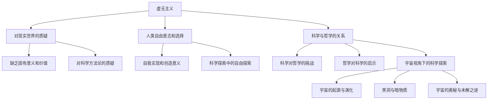

                 

## 引言

### 1.1 背景与意义

在当代社会，虚无主义作为一种哲学思潮，正逐渐引起人们的广泛关注。虚无主义的核心观点是认为现实世界缺乏固有的意义和价值，人们所追求的一切可能只是虚幻的幻象。这一思想在当代社会的兴起，源于人们面对现代社会复杂多变、充满不确定性的现实，对传统的价值观和信仰体系产生了怀疑和质疑。

与此同时，科学技术的快速发展给人类社会带来了前所未有的变化，也对传统哲学观念提出了挑战。科学探索通过实证方法和逻辑推理，揭示了许多自然界的奥秘，但同时也暴露了人类在认识世界过程中的局限性。这种局限性和不确定性，使得一些人对现实世界产生了深深的怀疑和困惑。

在这样的背景下，探索宇宙和寻找人生意义成为了一个热门的话题。宇宙作为一个宏大而神秘的领域，不仅激发了人类的好奇心，也为我们提供了一个全新的视角来审视人生和存在的意义。通过科学探索宇宙，我们可以更好地理解宇宙的起源和演化，进而反思人类在宇宙中的地位和角色，从而找到人生的意义。

### 1.2 本书结构

本书分为四个主要部分，分别探讨虚无主义、科学探索、宇宙视角以及人生意义的联系。

- **第1章 引言**：介绍虚无主义、科学探索和宇宙视角下寻找人生意义的背景和意义。
- **第2章 虚无主义概述**：详细阐述虚无主义的定义、历史演变和主要流派，为后续章节的分析奠定基础。
- **第3章 科学探索的基本概念**：介绍科学方法论、科学与哲学的关系以及科学与宗教的关系，为理解科学探索提供理论基础。
- **第4章 宇宙视角下的科学探索**：探讨宇宙的起源与演化、黑洞与暗物质以及宇宙的奥秘与未解之谜，为理解宇宙提供科学视角。
- **第5章 虚无主义与科学探索的联系**：分析虚无主义对科学探索的影响、科学探索对虚无主义的启示以及虚无主义与科学探索的交融，探讨两者之间的深层联系。
- **第6章 寻找人生意义**：从传统理解、科学探索和虚无主义背景下探讨人生意义的多种维度，寻求在不同视角下的人生意义。
- **第7章 未来展望**：展望虚无主义与科学探索的未来发展趋势，探讨宇宙视角下的人生意义，并总结全书的核心观点和思考。

通过以上章节的逐步深入，本书旨在为读者提供一幅全面而深刻的图景，帮助我们在虚无主义与科学探索的交汇点找到人生的意义。

### 1.3 文章关键词

- **虚无主义**
- **科学探索**
- **宇宙视角**
- **人生意义**
- **哲学**
- **科学方法论**
- **宇宙起源与演化**
- **黑洞与暗物质**
- **哲学思潮**

### 1.4 文章摘要

本文探讨了虚无主义与科学探索在宇宙视角下寻找人生意义的关系。首先，介绍了虚无主义的背景和意义，分析了其在当代社会的兴起及其对传统哲学观念的挑战。接着，详细阐述了科学探索的基本概念，包括科学方法论、科学与哲学的关系以及科学与宗教的关系。然后，从宇宙视角探讨了宇宙的起源与演化、黑洞与暗物质以及宇宙的奥秘与未解之谜。在此基础上，分析了虚无主义对科学探索的影响、科学探索对虚无主义的启示以及两者之间的交融。最后，从不同视角探讨了人生意义的多种维度，并展望了虚无主义与科学探索的未来发展趋势，为读者提供了对宇宙和人生意义的深入思考。

## 第2章 虚无主义概述

### 2.1 虚无主义的定义

虚无主义是一种哲学思潮，其核心观点是认为现实世界缺乏固有的意义和价值，生活本身没有内在目的，所有的追求和努力最终都可能是徒劳的。虚无主义不仅仅是悲观主义，而是一种对现实世界本质的深刻怀疑和反思。这种哲学思想在历史的不同阶段有不同的表现形式和流派。

首先，对“虚无”的理解是虚无主义的核心概念。虚无并不是指物质上的空无，而是一种对意义、价值、目的的否定。它不仅仅是一种消极的情绪或态度，而是一种对存在本身的根本质疑。虚无主义者认为，我们生活中的许多观念，如幸福、成功、爱情等，都只是社会和文化强加的虚幻幻象，并非真正的存在。

其次，虚无主义的哲学根源可以追溯到古代哲学。古希腊哲学家普罗塔戈拉（Protagoras）曾提出“人是万物的尺度”，这一观点在某种程度上蕴含了虚无主义的种子，因为它质疑了客观真理的存在。后来的哲学家如尼采（Friedrich Nietzsche）和萨特（Jean-Paul Sartre）等人，进一步发展了虚无主义的思想。

尼采是虚无主义的代表人物之一，他提出了“上帝已死”的观点，认为传统的道德观念和宗教信仰已经崩溃，人类需要重新审视自己的存在和意义。尼采的哲学思想深刻影响了20世纪的哲学和文学，被视为虚无主义的经典表达。

萨特的哲学思想同样对虚无主义有重要贡献。他在其剧作《恶心》和哲学著作《存在主义是一种人道主义》中，探讨了人在世界中的自由和选择。萨特认为，人生活在一个没有既定意义的荒谬世界中，但可以通过自由选择来创造自己的意义。

虚无主义在哲学史上有多个流派，每个流派都有其独特的观点和理论。以下是几个主要的虚无主义流派：

- **存在主义虚无主义**：存在主义者如萨特和海德格尔（Martin Heidegger）认为，虚无主义源于人类自由选择的本性。他们在探索人的自由和存在的本质时，提出了对传统价值观的质疑和反思。
- **抽象主义虚无主义**：这一流派强调抽象思维和逻辑推理的重要性，认为现实世界的不确定性和不可知性导致了虚无主义的产生。代表人物有维特根斯坦（Ludwig Wittgenstein）。
- **乐观主义虚无主义**：虽然被称为“乐观主义”，但这种虚无主义并不否认现实的荒谬和不确定性，而是通过积极的生活态度和创造性的活动来寻找和创造意义。尼采可以被看作是这一流派的代表。

总之，虚无主义作为一种深刻的哲学思考，不仅在历史上有着重要的影响，也在当代社会中引发了广泛的讨论。通过对虚无主义定义和哲学根源的探讨，我们可以更好地理解这一思潮的本质及其在不同文化和时代背景下的表现形式。

### 2.2 虚无主义的历史演变

虚无主义作为一种哲学思潮，其历史演变可以追溯到古希腊哲学，并在中世纪和近代哲学中不断发展。从古代到当代，虚无主义在不同的文化和哲学背景下呈现出不同的形态和特点。

#### 2.2.1 古代哲学中的虚无主义

古希腊哲学中的虚无主义萌芽可以追溯到普罗塔戈拉（Protagoras）的“人是万物的尺度”这一观点。普罗塔戈拉认为，由于每个人的感知和认知都不同，客观真理是不存在的。这种相对主义的观点质疑了传统哲学中的理性主义和客观真理的概念，为后来的虚无主义哲学奠定了基础。

苏格拉底（Socrates）的学生普罗泰戈拉（Protagoras）提出了“人是万物的尺度”（Man is the measure of all things）的著名论断。这一观点强调了主观体验和个体感知的重要性，从而质疑了客观真理的存在。这一思想对后来的哲学流派，如怀疑主义和相对主义，产生了深远的影响。

#### 2.2.2 中世纪与近代哲学的虚无主义

中世纪的虚无主义主要表现在对宗教信仰的怀疑和质疑上。随着基督教哲学的兴起，许多哲学家开始对宗教的教义进行反思和批判。例如，笛卡尔的“我思故我在”（Cogito, ergo sum）提出了对存在和真理的怀疑，并强调理性思考的重要性。

在中世纪晚期，阿尔伯蒂（Giordano Bruno）提出了宇宙无限和多重宇宙的观点，这挑战了当时宗教对宇宙的认知。他的思想被认为是虚无主义的，因为他质疑了上帝的唯一性和绝对性。

近代哲学中的虚无主义主要表现在对人类自由意志和自我意识的探讨。尼采（Friedrich Nietzsche）和克尔凯郭尔（Søren Kierkegaard）是这一时期的代表人物。

尼采认为，传统的道德观念和宗教信仰都是对人类自由意志的束缚，他提出了“上帝已死”的观点，质疑了传统价值体系的权威。尼采认为，人类需要通过重新审视自己的存在和意义，来摆脱虚无主义的阴影。

克尔凯郭尔则强调了个体自由和选择的重要性。他认为，人类生活在荒谬的世界中，但可以通过信仰和个体的努力来创造自己的意义。他的思想对存在主义和哲学人类学产生了深远的影响。

#### 2.2.3 当代虚无主义的兴起

当代虚无主义的兴起主要源于现代社会复杂多变的环境和科学技术的发展。随着全球化和信息化的推进，人们面临着前所未有的不确定性，对传统价值观和信仰体系产生了怀疑和质疑。

后现代主义哲学家如德里达（Jacques Derrida）和福柯（Michel Foucault）对现代社会结构和权力关系进行了深刻的批判，揭示了现代社会中的虚无主义倾向。他们认为，现代社会的知识、文化和权力都充满了不确定性和相对主义，这导致了对绝对真理和固定意义的质疑。

在当代哲学中，虚无主义的讨论不仅仅局限于哲学领域，还扩展到了社会学、心理学和文化研究等多个领域。例如，社会学家齐美尔（Georg Simmel）和心理学家弗罗姆（Erich Fromm）都对现代社会中的虚无主义现象进行了深入的研究。

总之，虚无主义的历史演变展示了其在不同文化和哲学背景下的多样性和复杂性。从古代到当代，虚无主义始终在哲学思想中占据着重要地位，并对现代社会产生了深远的影响。

### 2.3 虚无主义的主要流派

虚无主义作为一种哲学思潮，其思想流派丰富多样，涵盖了从存在主义到抽象主义等多个维度。以下是几种主要的虚无主义流派及其特点：

#### 2.3.1 存在主义虚无主义

存在主义虚无主义强调人类自由意志和存在的本质。代表人物包括让-保尔·萨特（Jean-Paul Sartre）和马丁·海德格尔（Martin Heidegger）。萨特在《存在主义是一种人道主义》中提出了“存在先于本质”的观点，认为人类在没有预设目的和意义的情况下自由地选择自己的存在。海德格尔则通过探讨“存在”的本质，揭示了人类在存在中的孤独和自由。两者的思想都揭示了虚无主义的核心，即在缺乏固有意义和价值的世界中，人类通过自由选择和行动来创造自己的意义。

#### 2.3.2 抽象主义虚无主义

抽象主义虚无主义强调抽象思维和逻辑推理的重要性。代表人物包括路德维希·维特根斯坦（Ludwig Wittgenstein）。维特根斯坦在《逻辑哲学论》中提出了“世界是事实的集合，而不是事物的集合”的观点，强调了逻辑和语言在构建世界中的重要性。他通过分析语言和逻辑的关系，揭示了现实世界的不确定性和不可知性，从而导致了虚无主义的产生。

#### 2.3.3 乐观主义虚无主义

乐观主义虚无主义虽然被称为“乐观主义”，但实际上并不否认现实的荒谬和不确定性。它强调通过积极的生活态度和创造性的活动来寻找和创造意义。代表人物包括尼采（Friedrich Nietzsche）。尼采提出了“上帝已死”的观点，认为传统的道德观念和宗教信仰已经崩溃，人类需要通过自我超越来找到新的价值和意义。尽管尼采的思想中包含悲观主义的成分，但他鼓励人们通过创造和行动来克服虚无主义的阴影。

#### 2.3.4 分析哲学中的虚无主义

分析哲学中的虚无主义主要表现为对语言和逻辑的分析，揭示了现实世界的复杂性和不确定性。代表人物包括维特根斯坦和伯特兰·罗素（Bertrand Russell）。他们通过逻辑分析和数学模型，探讨了现实世界的本质和存在的问题。分析哲学中的虚无主义不同于传统哲学中的虚无主义，它更注重通过逻辑和语言的分析来揭示现实世界的真实面貌。

#### 2.3.5 心理分析中的虚无主义

心理分析中的虚无主义主要探讨人类心理中的虚无主义倾向。代表人物包括弗洛伊德（Sigmund Freud）和卡尔·荣格（Carl Jung）。弗洛伊德通过分析梦和潜意识，揭示了人类在心理层面上的虚无主义情绪。荣格则通过分析集体无意识和原型，探讨了人类心理中的深层结构和虚无主义倾向。

总之，虚无主义的不同流派各有其独特的视角和理论，但都围绕着一个核心问题：在缺乏固有意义和价值的世界中，人类如何找到自己的存在和意义。通过对这些流派的深入探讨，我们可以更全面地理解虚无主义的思想体系和哲学意义。

### 2.4 虚无主义与科学的关系

虚无主义与科学之间的关系错综复杂，既存在深刻的对立，也存在潜在的互动。从历史和哲学的角度来看，虚无主义对科学有着多方面的影响，而科学则在一定程度上回应和挑战了虚无主义的思想。

首先，虚无主义对科学的挑战主要体现在以下几个方面：

1. **对客观真理的质疑**：虚无主义认为现实世界缺乏固有的意义和价值，从而对客观真理的存在提出了质疑。科学方法论强调通过实证和逻辑推理来揭示客观真理，而虚无主义则认为这些努力可能只是徒劳的。尼采的“上帝已死”观点揭示了传统信仰体系的崩溃，这也间接挑战了科学的客观性。

2. **对科学方法的怀疑**：虚无主义怀疑科学方法的有效性。例如，维特根斯坦的“语言游戏”理论指出，语言和概念本身可能存在问题，因此科学方法可能无法完全揭示世界的本质。这种怀疑使得一些虚无主义者认为，科学知识只是人类构造的一种幻象。

3. **对科学成果的反思**：随着科学技术的快速发展，人类社会经历了巨大的变革。虚无主义对这种变革持有批判态度，认为科学进步并没有解决人类存在的根本问题，反而加剧了社会的复杂性和不确定性。

然而，科学也以多种方式回应了虚无主义的挑战：

1. **科学解释的扩展**：为了回应虚无主义的质疑，科学不断扩展其解释范围，尝试涵盖人类心理和社会现象。例如，心理学和社会学等学科的发展，使科学能够解释人类行为和心理状态，这在一定程度上缓解了虚无主义的质疑。

2. **科学方法论的创新**：科学方法在回应虚无主义挑战的过程中不断发展和创新。例如，量子力学和相对论等新兴科学理论的提出，挑战了经典科学的某些基本假设，同时也为理解现实世界提供了新的视角。

3. **科学技术的应用**：科学技术的广泛应用为人类带来了前所未有的便利和进步，这在一定程度上反驳了虚无主义对人类存在的否定。例如，医疗技术的发展提高了人类的健康水平，信息技术的发展改变了社会的运作模式，这些进步都显示了科学的实际价值。

4. **科学与哲学的交融**：在回应虚无主义的过程中，科学和哲学之间的交融也变得更加紧密。例如，科学哲学的兴起试图通过哲学的反思来理解科学的本质和方法，从而在一定程度上缓解了虚无主义的质疑。

总之，虚无主义与科学之间的关系是复杂而多维的。虚无主义对科学的挑战促使科学不断发展和创新，而科学技术的进步也在一定程度上反驳了虚无主义的观点。通过这种相互影响和交融，科学和哲学都在不断地探索人类存在的本质和意义。

### 2.5 虚无主义在现代社会中的影响

虚无主义在现代社会中产生了深远的影响，特别是在文化、艺术和心理学领域。这一哲学思潮不仅挑战了传统的价值观和信仰体系，也激发了新的思维方式和创作灵感。

首先，虚无主义在文化领域的表现尤为突出。20世纪初的文学和艺术作品，如卡夫卡（Franz Kafka）的小说、乔伊斯（James Joyce）的《尤利西斯》、贝克特（Samuel Beckett）的戏剧，都深刻反映了虚无主义的思想。这些作品描绘了一个充满荒诞和不确定性的世界，质疑了人类存在的意义和价值。卡夫卡的《变形记》和贝克特的《等待戈多》都是典型的表现主义作品，它们通过荒诞和戏剧性的手法，揭示了虚无主义在人类内心世界的深刻影响。

其次，虚无主义在艺术领域也产生了重要影响。许多艺术家通过绘画、雕塑和音乐等艺术形式，表达了他们对现实世界的怀疑和反抗。例如，达达主义（Dadaism）和超现实主义（Surrealism）等艺术流派，都是虚无主义在艺术创作中的体现。达达主义者反对传统艺术的形式和主题，主张通过随机和破坏性的手法，挑战现实世界的合理性和逻辑。超现实主义者则通过将现实与梦境融合，创造出充满幻觉和怪诞的作品，以此质疑现实世界的真实性。

在心理学领域，虚无主义的影响同样显著。心理学家弗罗姆（Erich Fromm）在其著作《逃避自由》中，探讨了现代社会中人们面对虚无主义情绪的逃避行为。他认为，人们在面对现实世界的不确定性和无意义感时，往往会通过逃避、消费和社会化来寻求安慰和逃避。这种逃避行为不仅反映了虚无主义对人类心理的深刻影响，也揭示了现代社会中人们应对虚无主义情绪的复杂心理机制。

此外，存在主义心理学家如罗洛·梅（Rollo May）和欧文·亚隆（Irvin D. Yalom）也通过研究人类存在的意义和自由，探讨了虚无主义在心理学中的重要性。他们认为，虚无主义是人类存在的一部分，通过对虚无主义的认识和接纳，人们可以更好地理解自己的内心世界，并找到自己的存在意义。

总之，虚无主义在现代社会中的影响是多方面的。它不仅挑战了传统的价值观和信仰体系，也激发了新的思维方式和创作灵感。在文化、艺术和心理学领域，虚无主义思想为我们提供了深入反思人类存在和意义的视角，同时也为我们应对现代社会中的不确定性和无意义感提供了新的思路和方法。

### 2.6 虚无主义与科学探索的交叉点

虚无主义与科学探索在现代社会中的交叉点不仅体现在哲学和科学的理论层面，也体现在具体的研究和实践活动中。两者在探索人类存在的本质和宇宙的奥秘方面有着共同的追求，同时也通过不同的方式相互影响和启发。

首先，在哲学层面，虚无主义对科学探索的方法论产生了深刻的质疑。虚无主义认为现实世界缺乏固有的意义和价值，这种观点挑战了科学追求客观真理的立场。例如，维特根斯坦的“语言游戏”理论指出，科学理论和语言的表达方式可能存在问题，从而质疑了科学方法的有效性。这种质疑促使科学家们更加关注科学理论的逻辑结构和语言表述，从而推动了科学方法论的发展。

其次，科学探索为虚无主义提供了一种新的视角来审视人类存在的意义。随着科学技术的进步，人类对宇宙的认识不断深入，从宇宙大爆炸理论到黑洞和暗物质的研究，科学探索揭示了宇宙的宏大和复杂。这种对宇宙的理解不仅拓宽了人类的认知边界，也为虚无主义者提供了一种新的思考方式。例如，宇宙的无限性和复杂性使得虚无主义者开始重新思考人类在宇宙中的地位和角色，从而为虚无主义提供了新的哲学反思空间。

在实际的科学探索中，虚无主义与科学的交叉点还体现在具体的研究活动中。例如，在心理学领域，虚无主义的思想启发了对人类心理状态的研究。心理学家通过研究虚无主义情绪和个体在面对不确定性时的心理反应，探讨了虚无主义如何影响人类的心理健康。同时，科学家们也在利用新兴技术，如人工智能和脑成像技术，来研究人类大脑在处理虚无主义情绪时的神经活动，这为理解虚无主义的生物学基础提供了新的视角。

在物理学领域，虚无主义与科学的交叉点体现在对量子力学和相对论的研究中。量子力学揭示了微观世界的随机性和不确定性，这与虚无主义对现实世界不可知性的质疑不谋而合。相对论则通过揭示时空的相对性，挑战了经典物理学中的绝对时空观念，从而为虚无主义提供了新的科学依据。

总之，虚无主义与科学探索在现代社会中的交叉点不仅体现在哲学和科学的理论层面，也体现在具体的研究和实践活动中。两者相互影响、相互启发，共同推动了对人类存在和宇宙奥秘的探索。通过这种交叉点的探讨，我们可以更深入地理解虚无主义和科学探索的本质，从而为人类寻找存在的意义提供新的思路和方向。

### 2.7 虚无主义与科学探索的综合视角

虚无主义与科学探索在现代社会中形成了独特的综合视角，这种视角不仅反映了两者之间的互动和交融，也揭示了它们对人类存在和宇宙理解的深远影响。通过综合视角，我们可以更全面地理解虚无主义和科学探索在现代社会中的角色和意义。

首先，从哲学层面来看，虚无主义和科学探索都关注人类存在的本质和意义。虚无主义通过质疑现实世界的意义和价值，促使人们反思自己的存在和生活的目的。科学探索则通过实证方法和逻辑推理，尝试揭示自然界的规律和宇宙的本质，为人类提供了一种认识世界和自我存在的工具。两者在这一共同点上形成了互补的关系：虚无主义质疑科学的客观性和真实性，而科学探索通过不断的发展和创新，回应了虚无主义的质疑，同时也拓展了对人类存在的理解。

其次，在科学研究领域，虚无主义和科学探索的交叉点体现在对不确定性和复杂性的研究上。虚无主义对现实世界的怀疑和不确定性的强调，促使科学家们更加关注那些难以用传统科学方法解释的现象。例如，量子力学中的随机性和不确定性，以及宇宙学中的多重宇宙理论，都是科学家们通过回应虚无主义的质疑而进行的研究。这些研究不仅拓展了科学知识的边界，也为虚无主义提供了新的科学依据。

在心理学领域，虚无主义和科学探索的交叉点表现在对人类心理状态的研究上。虚无主义情绪和不确定性感受在现代社会中普遍存在，这促使心理学家们通过科学方法来研究这些情绪的心理机制和影响。例如，神经科学和认知科学的研究，通过脑成像和实验方法，探讨了虚无主义情绪的神经基础和认知过程。这些研究不仅为理解虚无主义提供了新的视角，也为心理健康干预提供了科学依据。

在技术应用方面，虚无主义和科学探索的交叉点体现在新兴科技的发展和应用上。例如，人工智能和虚拟现实技术的发展，不仅改变了人类的日常生活和工作方式，也为虚无主义提供了一种新的逃避和探索方式。虚拟现实技术通过创造一个全新的虚拟世界，使得人们在面对现实世界的不确定性和无意义感时，可以通过虚拟世界来寻找逃避和安慰。这种技术与应用的交叉，使得虚无主义和科学探索在现代社会中形成了新的互动关系。

最后，从社会文化的角度来看，虚无主义和科学探索共同塑造了现代社会的思想和文化。虚无主义通过质疑传统价值观和信仰体系，推动了社会的反思和进步。科学探索则通过不断的技术创新和知识积累，推动了社会的现代化和进步。两者共同构成了现代社会思想和文化的重要组成部分，为人类探索存在的意义和宇宙的奥秘提供了新的思路和方向。

总之，虚无主义与科学探索的综合视角不仅反映了两者之间的互动和交融，也揭示了它们对人类存在和宇宙理解的深远影响。通过这种综合视角，我们可以更全面地理解虚无主义和科学探索在现代社会中的角色和意义，从而为人类寻找存在的意义提供新的思路和方向。

### 2.8 虚无主义与科学探索的核心概念联系

为了更好地理解虚无主义与科学探索之间的深层联系，我们可以通过一个概念联系架构图来展示它们之间的互动关系。以下是虚无主义与科学探索的核心概念联系架构图：

```
[虚无主义]
    ├─> [对现实世界的质疑]
    │   ├─> [缺乏固有意义和价值]
    │   └─> [对科学方法论的质疑]
    ├─> [人类自由意志和选择]
    │   ├─> [自我实现和创造意义]
    │   └─> [科学探索中的自由探索]
    └─> [科学与哲学的关系]
        ├─> [科学对哲学的挑战]
        └─> [哲学对科学的启示]

        └─> [宇宙视角下的科学探索]
            ├─> [宇宙的起源与演化]
            ├─> [黑洞与暗物质]
            └─> [宇宙的奥秘与未解之谜]
```

### 2.9 虚无主义与科学探索的关系 Mermaid 流程图

以下是一个展示虚无主义与科学探索关系的 Mermaid 流程图，用于更直观地理解两者之间的互动和影响：

```
graph TB
    A[虚无主义] --> B[对现实世界的质疑]
    B --> C[缺乏固有意义和价值]
    B --> D[对科学方法论的质疑]
    A --> E[人类自由意志和选择]
    E --> F[自我实现和创造意义]
    E --> G[科学探索中的自由探索]
    A --> H[科学与哲学的关系]
    H --> I[科学对哲学的挑战]
    H --> J[哲学对科学的启示]
    H --> K[宇宙视角下的科学探索]
    K --> L[宇宙的起源与演化]
    K --> M[黑洞与暗物质]
    K --> N[宇宙的奥秘与未解之谜]
```

通过以上架构图和流程图，我们可以清晰地看到虚无主义与科学探索之间的复杂互动关系，它们不仅相互影响，也为人类探索存在的意义提供了新的视角和工具。

### 2.10 虚无主义与科学探索的核心联系总结

虚无主义与科学探索之间的核心联系体现在以下几个方面：

1. **哲学与科学的互动**：虚无主义对科学方法论和客观真理的质疑，促使科学不断反思和改进，从而推动了科学方法论的创新。同时，科学成果也为哲学提供了新的问题和研究方向。

2. **自由意志与选择**：虚无主义强调人类自由意志和选择的重要性，这为科学探索中的自由探索提供了哲学基础。科学家通过自由选择和研究，不断拓展人类对自然界的认识。

3. **对现实世界的质疑**：虚无主义对现实世界的质疑，激发了科学家对不确定性、复杂性和未知领域的深入研究。这促进了科学对宇宙起源、黑洞、暗物质等复杂现象的研究。

4. **宇宙视角**：科学探索通过宇宙视角揭示了宇宙的起源与演化，黑洞与暗物质的存在，以及宇宙的奥秘与未解之谜。这些发现为虚无主义提供了新的哲学思考空间。

5. **人类存在的意义**：虚无主义与科学探索共同探讨了人类存在的意义。科学通过揭示宇宙的宏大和复杂性，帮助人们重新审视自己在宇宙中的地位和角色；而虚无主义则通过质疑和反思，促使人们更加深入地思考人生的意义和价值。

通过这些核心联系，虚无主义与科学探索在哲学、科学和人类存在的维度上形成了深刻的互动和交融，为现代社会提供了丰富的思想资源和探索方向。

## 第3章 科学探索的基本概念

### 3.1 科学方法论

科学方法论是科学研究的基础，它规定了科学探究的过程和原则，帮助科学家系统地理解自然现象，并从中提取有意义的信息。科学方法论通常包括以下几个基本步骤：

1. **问题提出**：科学研究的起点是一个明确的问题或疑问。这个问题通常源于观察、经验或理论上的不足。科学家通过提出具体的研究问题，为后续的研究工作提供方向。

2. **假设形成**：在问题提出后，科学家根据现有的知识和理论，形成初步的假设。假设是对问题可能答案的预测，它需要具有可验证性。

3. **实验设计**：为了验证假设，科学家需要设计实验。实验设计包括确定实验变量、控制变量、实验组和对照组等。科学实验的目的是通过控制变量的变化，观察和测量因变量的变化，从而验证假设。

4. **数据收集**：在实验过程中，科学家需要收集与假设相关的数据。这些数据可以通过观察、测量、实验记录等方式获得。

5. **数据分析**：收集到数据后，科学家使用统计方法和其他分析方法对数据进行分析。数据分析的目的是从数据中提取有意义的信息，并验证假设的正确性。

6. **结论得出**：通过数据分析，科学家可以得出结论，判断假设是否成立。如果假设得到支持，科学家会进一步验证其普适性和准确性；如果假设不成立，科学家会重新审视假设并寻找新的解释。

科学方法论不仅为科学研究提供了系统的框架，还保证了科学研究的可靠性和可重复性。通过科学方法论，科学家能够不断地积累和验证知识，推动科学技术的进步。

### 3.2 科学与哲学的关系

科学与哲学之间的关系复杂而深远，两者在历史和现代科学的发展中互相影响、互相促进。科学和哲学都在探讨世界的本质和人类存在的意义，但它们的方法和视角有所不同。

首先，科学通常通过实证方法和逻辑推理来揭示自然现象的规律和原理。科学强调观察、实验和数据分析，以验证假设和理论。科学方法具有系统性和可重复性，这使得科学成果具有较高的可信度。

哲学则通过逻辑推理、批判思维和概念分析来探讨基本问题，如存在、知识、价值和意义。哲学不依赖于实验和观察，而是通过抽象和理论化的方式，探讨更为基本和普遍的问题。

在历史发展过程中，科学和哲学互相影响。例如，古希腊哲学家如亚里士多德和柏拉图，他们的思想对后来的科学方法产生了重要影响。而科学研究中的方法论原则，如假设形成、实验设计和数据分析，也受到哲学思想的启发。

在现代科学的发展中，哲学对科学的挑战和反思起到了重要作用。科学哲学家如卡尔·波普尔（Karl Popper）提出了“证伪主义”理论，强调科学理论的可证伪性。这一理论促使科学家更加关注假设的可验证性和理论的普适性。

同时，科学对哲学也产生了重要影响。科学技术的进步，特别是现代物理学和生物学的发展，为哲学提供了新的问题和研究资源。例如，量子力学和相对论挑战了经典物理学的基本假设，迫使哲学家重新思考时间和空间的概念。

总体来说，科学和哲学之间的关系是相互依赖和相互促进的。科学提供了具体的研究方法和实验成果，而哲学则提供了批判性思维和概念框架，帮助科学家更好地理解科学成果的哲学意义。通过这种互动，科学和哲学共同推动了人类对自然和世界的认知，为探索宇宙和人类存在的本质提供了丰富的思想资源。

### 3.3 科学与宗教的关系

科学与宗教之间的关系自古以来便充满了复杂的互动和争议。科学作为一种探索自然现象和宇宙规律的实证方法，通常依赖于观察、实验和数据分析；而宗教则是一种信仰体系，它通过信仰、教义和象征性表达来解释宇宙和人类存在的意义。

首先，科学和宗教在起源和目标上存在明显差异。科学追求的是对自然界客观规律的发现和验证，强调理性思考和实证证据；而宗教则更多依赖于信仰和灵魂的体验，通过教义和仪式来传达精神意义和道德规范。

在历史发展过程中，科学和宗教的关系经历了多次冲突与融合。在中世纪，宗教权威主导了思想界，科学探索受到严格限制。然而，随着文艺复兴和启蒙运动的发展，科学逐渐摆脱了宗教的束缚，开始独立发展。这一时期，伽利略（Galileo Galilei）因支持日心说而受到教会的审判，成为科学和宗教冲突的标志性事件。

进入现代，科学和宗教的关系呈现出更多的交融和对话。许多科学家和宗教领袖开始认识到两者在探索宇宙和人生意义上的互补性。例如，一些科学家认为，科学解释了宇宙如何运作，而宗教则提供了人类存在的目的和意义。这种观点被称为“科学神学”，它试图在科学和宗教之间建立桥梁，促进两者的和谐共存。

然而，科学和宗教之间的争议仍然存在。一些科学观点，如进化论，与某些宗教教义存在冲突。例如，创世纪中的“六日创世”与科学上的进化论相矛盾，引发了关于生命起源和宇宙年龄的激烈争论。

总的来说，科学和宗教之间的关系是一个复杂而多维的话题。两者在探索宇宙和人生意义方面各有优势，也存在各自的局限性。通过开放和尊重的对话，科学和宗教可以相互学习、相互启发，为人类提供更全面的理解和更深刻的洞察。

### 第4章 宇宙视角下的科学探索

宇宙视角下的科学探索是理解宇宙奥秘的关键。通过研究宇宙的起源、演化和各种天体现象，科学家们试图揭示宇宙的本质和人类在其中的位置。以下从宇宙的起源与演化、黑洞与暗物质、宇宙的奥秘与未解之谜三个方面进行探讨。

#### 4.1 宇宙的起源与演化

宇宙的起源一直是科学和哲学讨论的焦点。目前，最被广泛接受的理论是大爆炸理论。大爆炸理论认为，宇宙起源于约138亿年前的一个极高温度和密度的状态，随后迅速膨胀，形成了我们今天所看到的宇宙。

- **大爆炸理论**：根据大爆炸理论，宇宙最初处于一个极度密集和高温的状态，称为“原始奇点”。大约138亿年前，这个原始奇点发生了爆炸，能量和物质迅速向外扩散，形成了宇宙。这一过程中，宇宙的密度和温度逐渐降低，导致物质的聚集和星系的形成。

- **宇宙背景微波辐射**：大爆炸理论的证据之一是宇宙背景微波辐射（Cosmic Background Microwave Radiation，CBMR）。1965年，阿诺·彭齐亚斯（Arno Penzias）和罗伯特·威尔逊（Robert Wilson）在实验中意外发现了这种辐射，证实了大爆炸理论。这种辐射是宇宙大爆炸留下的余温，遍布整个宇宙。

- **宇宙膨胀**：宇宙大爆炸后，宇宙开始膨胀。宇宙膨胀的证据之一是红移现象。科学家通过观测星系的光谱，发现大多数星系的光谱中出现了红移，这意味着它们正在远离我们。这一现象支持了宇宙膨胀的理论。

#### 4.2 黑洞与暗物质

黑洞和暗物质是宇宙中极其神秘的现象，它们的发现和研究对科学提出了巨大的挑战。

- **黑洞的概念与特性**：黑洞是一种极其密集的天体，它的引力极强，甚至连光都无法逃脱。黑洞的形成通常与恒星演化有关。当大质量恒星耗尽其核燃料时，它会塌缩成一个密度极高的奇点，形成黑洞。黑洞的存在可以通过其对周围物质的影响来探测，例如引力透镜效应和恒星运动。

- **暗物质的存在及其影响**：暗物质是宇宙中一种尚未被直接观测到的物质，它占据宇宙总质量的约27%。暗物质的存在可以通过引力效应来推断，例如星系旋转曲线的异常和宇宙背景微波辐射的分布。暗物质不仅对宇宙的结构形成和演化有重要影响，也是当前宇宙学研究的重大难题之一。

#### 4.3 宇宙的奥秘与未解之谜

宇宙中存在许多未解之谜，这些谜题挑战了我们对宇宙的理解。

- **宇宙的无限性问题**：宇宙是否是无限的？这是一个困扰科学家多年的问题。一些理论认为，宇宙可能是无限的，而另一些理论则认为它可能是有限的，甚至可能是闭合的。

- **宇宙的起源问题**：宇宙是如何开始的？这个问题涉及到宇宙大爆炸之前的状态。目前，科学家们还在探索原始奇点的性质和宇宙大爆炸之前的情况。

- **量子引力和统一场论**：量子引力和统一场论是物理学中的两个重要目标。量子引力试图将量子力学和广义相对论统一起来，以描述宇宙的基本规律。统一场论则试图将所有基本相互作用力（如强相互作用、弱相互作用、电磁力和引力）统一在一个理论框架下。

- **多宇宙假说**：多宇宙假说认为，我们的宇宙只是众多宇宙中的一个。这些宇宙可能具有不同的物理定律和参数，从而解释了为什么我们的宇宙具有特定的性质。

宇宙视角下的科学探索不仅为我们提供了对宇宙的深入理解，也促使我们重新审视人类在宇宙中的位置和角色。通过不断的研究和探索，科学家们不断揭示宇宙的奥秘，为人类理解宇宙和自身的存在提供了新的视角和思路。

### 第5章 虚无主义与科学探索的联系

虚无主义和科学探索在当代哲学和科学领域中都占据着重要地位，它们分别从不同的角度探讨人类存在的意义和宇宙的本质。虚无主义质疑现实世界的意义和价值，而科学探索通过实证和逻辑推理揭示自然界的规律。这两者之间既有深刻的对立，也存在潜在的联系和互动。

#### 5.1 虚无主义对科学探索的影响

虚无主义对科学探索的影响主要体现在以下几个方面：

1. **对客观真理的质疑**：虚无主义认为现实世界缺乏固有的意义和价值，这种观点挑战了科学追求客观真理的立场。虚无主义质疑科学方法的可靠性和科学理论的普遍性，认为科学知识可能只是人类构造的一种幻象。这种质疑促使科学家们更加谨慎地对待科学假设和理论，不断验证和改进。

2. **对科学方法的怀疑**：虚无主义对科学方法的怀疑主要表现在对实验设计、数据分析和结论得出等环节的质疑。虚无主义者认为，科学实验可能受到主观偏见的影响，数据分析也可能存在偏差。这种怀疑促使科学家们在研究中更加注重方法论的严谨性和客观性，提高科学研究的可信度。

3. **对科学成果的反思**：虚无主义对科学成果持批判态度，认为科学进步并没有解决人类存在的根本问题，反而加剧了社会的复杂性和不确定性。这种反思促使科学家们更加关注科学技术的应用和伦理问题，探讨科学对社会和人类的影响。

4. **激发新的科学问题**：虚无主义对现实世界的质疑激发了科学家们对未知领域的研究兴趣。例如，虚无主义质疑人类存在的意义，促使科学家们探讨宇宙的起源和演化，探索生命的本质。这些新的科学问题推动了科学研究的不断深入和发展。

#### 5.2 科学探索对虚无主义的启示

科学探索对虚无主义的启示主要体现在以下几个方面：

1. **揭示宇宙的奥秘**：科学探索通过实证和逻辑推理揭示了宇宙的起源、演化和各种天体现象，为虚无主义提供了新的思考空间。例如，宇宙大爆炸理论揭示了宇宙的起源，黑洞和暗物质的研究揭示了宇宙的复杂性和未知领域，这些发现促使虚无主义者重新思考人类在宇宙中的位置和角色。

2. **提供解决问题的方法**：科学探索通过发现和解决各种问题，为虚无主义提供了新的应对策略。例如，心理学研究揭示了人类心理状态和情绪的影响，科学技术的进步提高了人类的生活质量，这些成果为虚无主义者提供了缓解虚无主义情绪的方法。

3. **拓展人类认知边界**：科学探索不断拓展人类的认知边界，揭示了自然界的规律和奥秘。这种认知拓展为虚无主义提供了新的视角，使虚无主义者能够更加全面和深入地理解现实世界，从而找到新的存在意义。

4. **促进哲学与科学的交融**：科学探索为哲学提供了新的问题和研究资源，促使哲学与科学之间的交融。例如，科学哲学研究探讨了科学方法、科学理论及其哲学意义，这些研究为虚无主义提供了哲学基础和理论支持。

#### 5.3 虚无主义与科学探索的交融

虚无主义与科学探索的交融体现在多个方面：

1. **跨学科研究**：虚无主义与科学探索的交融促进了跨学科研究的发展。例如，科学哲学、认知科学、心理学等学科都试图通过综合哲学和科学的方法，探讨人类存在的意义和宇宙的本质。

2. **科学应用**：虚无主义对科学探索的质疑促使科学家们更加关注科学技术的应用和伦理问题。例如，人工智能的发展引发了关于机器人伦理、隐私保护等问题的讨论，这些讨论不仅涉及科学问题，也关乎人类价值观和道德观念。

3. **哲学反思**：科学探索中的发现和问题为哲学反思提供了新的素材。例如，量子力学和相对论的提出挑战了经典物理学的某些基本假设，这些挑战促使哲学家们重新思考时间和空间的概念，探讨科学的哲学意义。

4. **共同目标**：虚无主义与科学探索在寻找人类存在的意义和探索宇宙的奥秘方面有共同的目标。这种共同目标促使两者在研究和实践中相互借鉴和融合，为人类提供更全面和深入的理解。

总之，虚无主义与科学探索之间的联系是复杂而多维的。两者在哲学和科学领域相互影响、相互促进，共同推动了人类对宇宙和自身的理解。通过这种交融，虚无主义和科学探索不仅为哲学和科学提供了新的问题和研究方向，也为人类寻找存在的意义和生活的价值提供了丰富的思想资源。

### 5.4 科学探索对虚无主义的启示

科学探索对虚无主义的启示主要体现在以下几个方面：

1. **提供解释框架**：科学探索通过实证和逻辑推理提供了对自然现象和宇宙奥秘的解释框架。这种解释框架有助于虚无主义者理解宇宙和自身的存在，从而在一定程度上缓解虚无主义带来的困惑和不安。例如，宇宙大爆炸理论和黑洞的研究为虚无主义者提供了一个理解宇宙起源和复杂结构的科学视角。

2. **揭示宇宙的宏大和复杂**：科学探索揭示了宇宙的宏大和复杂，使得虚无主义者能够更加深刻地认识到人类在宇宙中的渺小和有限。这种认识促使虚无主义者重新审视自己的存在和生活的意义，从而找到新的视角和方向。

3. **引导自我探索**：科学探索中的未解之谜和前沿问题激发了虚无主义者的探索精神，鼓励他们通过科学方法和逻辑推理来寻找答案。这种自我探索的过程不仅有助于缓解虚无主义情绪，还可以为虚无主义者提供新的生活目标和动力。

4. **拓展人类认知边界**：科学探索不断拓展人类的认知边界，为虚无主义者提供了新的知识和视角。这种认知拓展有助于虚无主义者更好地理解现实世界和自身的存在，从而找到新的意义和价值。

### 5.5 虚无主义与科学探索的交融实例分析

虚无主义与科学探索的交融在多个领域和实例中得到了体现，以下通过具体实例进行分析：

1. **量子力学**：量子力学揭示了微观世界的规律和现象，挑战了经典物理学的某些基本假设。例如，量子纠缠现象表明，粒子之间存在超距作用，这打破了传统因果律的框架。这种量子现象为虚无主义者提供了新的思考空间，促使他们反思现实世界的本质和人类认知的局限性。

2. **人工智能**：人工智能的发展引发了关于机器意识和人工智能伦理的讨论。虚无主义者通过研究人工智能的算法和模型，探讨了人类意识和自我意识的形成机制。这种研究不仅为科学探索提供了新的方向，也为虚无主义者提供了新的哲学反思话题。

3. **宇宙学研究**：宇宙学研究揭示了宇宙的起源和演化过程，例如宇宙大爆炸理论和黑洞的研究。这些发现为虚无主义者提供了对宇宙本质的新理解，促使他们重新思考人类在宇宙中的地位和意义。

4. **生物学**：生物学研究揭示了生命的起源和演化过程，例如进化论和细胞学说。虚无主义者通过研究这些生物学理论，探讨了生命的本质和人类存在的意义。这种研究不仅拓展了虚无主义者的认知边界，也提供了新的生活目标和动力。

通过这些实例，我们可以看到虚无主义与科学探索之间的交融如何为两者提供了新的思想资源和研究方向，从而推动了人类对宇宙和自身的更深入理解。

### 5.6 虚无主义与科学探索的交融与挑战

虚无主义与科学探索的交融在现代社会中具有重要意义，但同时也面临着一些挑战。这种交融不仅推动了人类对宇宙和自身的理解，还为哲学和科学提供了新的研究课题，但在实际应用和理论探讨中也存在一些问题和争议。

首先，虚无主义与科学探索的交融有助于缓解现代社会中的虚无主义情绪。科学探索通过揭示自然界的规律和宇宙的奥秘，为人们提供了一种新的视角来理解世界。例如，宇宙大爆炸理论和黑洞的研究使人们认识到宇宙的宏大和复杂，从而有助于缓解虚无主义带来的困惑和不安。然而，这种交融也面临着挑战，因为科学探索本身也可能产生新的疑问和不确定性，如量子力学中的超距作用和暗物质的本质，这些都可能进一步加剧虚无主义的情绪。

其次，虚无主义与科学探索的交融促进了跨学科研究的发展。例如，科学哲学、认知科学和心理学等领域的交叉研究，为探讨人类意识和自我意识的形成机制提供了新的思路。然而，这种交融也面临挑战，因为不同学科之间的方法和理论存在差异，如何有效地整合这些不同的视角和方法，仍然是当前研究中的一个难题。

此外，虚无主义与科学探索的交融在伦理和道德领域也面临挑战。例如，人工智能的发展引发了关于机器人伦理和隐私保护的讨论。虚无主义者需要在这类问题中找到平衡，既要考虑科学技术的应用，又要关注人类价值和伦理。这种平衡的寻找不仅需要科学的进步，也需要哲学和伦理学的深入探讨。

最后，虚无主义与科学探索的交融为哲学和科学提供了新的研究课题。例如，关于人类意识和自我意识的研究，关于宇宙起源和演化的探讨，都是当前哲学和科学研究的热点问题。然而，这些研究课题也面临着一些争议和挑战，如关于量子力学和相对论的基本假设，关于宇宙无限性的讨论等。如何解决这些争议和挑战，需要科学和哲学的共同努力。

总之，虚无主义与科学探索的交融在现代社会中具有重要的意义，它不仅为人类提供了新的视角和理解，也带来了新的挑战。通过不断探索和对话，哲学和科学可以更好地应对这些挑战，共同推动人类对宇宙和自身的更深入理解。

### 第6章 寻找人生意义

#### 6.1 人生意义的传统理解

人生意义是一个古老而复杂的话题，不同文化和哲学体系对人生意义有不同的理解和解释。在传统理解中，人生意义通常与宗教、哲学和道德观念紧密相连。

1. **宗教视角下的人生意义**：
   - 在许多宗教传统中，人生意义被视为一种神圣的使命，与神或宇宙的意志密切相关。例如，在基督教中，人生意义被认为是通过信仰和道德行为来侍奉上帝；在佛教中，人生意义则在于解脱轮回，实现涅槃。
   - 宗教教导人们通过信仰、祈祷和修行来寻找内心的平静和生命的意义。宗教仪式和信仰实践被视为帮助人们理解生命目的和意义的重要途径。

2. **哲学视角下的人生意义**：
   - 哲学对人生意义的探讨始于对存在本身的反思。不同哲学流派提出了各自对人生意义的解释。例如，亚里士多德认为，人生意义在于实现人的潜能，追求智慧和幸福；尼采则认为，人生意义是通过自我超越和创造来实现的。
   - 哲学家们通过逻辑推理和理性思考，试图找到人生的意义和目的。他们探讨了自由意志、道德责任和价值观等问题，试图为人生提供合理的解释和指导。

3. **道德视角下的人生意义**：
   - 道德观念在人生意义的理解中扮演着重要角色。道德哲学关注如何做出正确的道德选择，以及这些选择如何影响人生的意义。例如，康德的道德哲学强调通过遵循道德法则来实现人生的意义；功利主义则认为，人生意义在于追求最大化的幸福和快乐。

总之，传统理解中的人生意义通常与宗教信仰、哲学思考和道德观念紧密相连。这些理解为我们提供了一种思考人生意义的基础，但在现代社会中，随着价值观的多元化和不确定性的增加，传统理解面临着新的挑战。

#### 6.2 科学探索中的人生意义

科学探索在寻找人生意义方面提供了独特的视角和方法。虽然科学主要关注自然现象和宇宙规律，但科学研究的成果和过程也对人生意义的理解产生了深远的影响。

1. **科学进步对人生意义的影响**：
   - 科学进步改变了人类对世界的理解，提高了人类的生活质量和健康水平。例如，医学技术的进步延长了人类的寿命，改善了生活质量；信息技术的发展使人们能够更便捷地获取信息和交流思想。
   - 科学成果不仅丰富了人类的知识体系，也改变了人类的生活方式和社会结构。这些变化使得人们对生命的意义和价值有了新的认识。

2. **科学探索中的道德困境**：
   - 科学探索带来的技术进步也引发了一系列道德困境。例如，基因编辑和人工智能等技术可能带来伦理和道德问题，如基因歧视、隐私侵犯和数据滥用等。这些道德困境迫使人们重新思考科学探索的边界和责任，探讨如何在科技进步中维护人类的尊严和道德价值。
   - 科学研究中的伦理问题也挑战了传统的道德观念和价值观。例如，对动物实验的伦理争议和对环境影响的担忧，都要求科学家在探索自然的过程中承担更多的社会责任。

3. **科学视角下的人生意义**：
   - 从科学的视角来看，人生意义可能在于探索自然界的奥秘、理解宇宙的规律和推动人类的知识进步。科学探索鼓励人们保持好奇心和求知欲，通过实证和逻辑推理来揭示世界的本质。
   - 科学视角下的人生意义还在于通过科学知识和技术的应用，改善人类的生活条件和解决全球性挑战。例如，科学在解决能源危机、环境保护和疾病治疗等方面发挥着重要作用。

总之，科学探索在寻找人生意义方面提供了丰富的资源和新的视角。科学进步不仅改变了人类对世界的认识，也带来了新的道德挑战和责任。通过科学探索，人们可以更深入地理解生命的本质和价值，从而找到更充实和有意义的生活方式。

### 6.3 虚无主义背景下的人生意义

在虚无主义背景下，人生意义的问题变得更加复杂和深刻。虚无主义对现实世界的质疑和对传统价值观的否定，使得寻找人生意义成为一项艰巨的任务。然而，正是在这种背景下，人们开始探索更加个人化和内在的人生意义。

1. **虚无主义视角下的人生选择**：
   - 虚无主义者认为，现实世界缺乏固有的意义和价值，因此，人们需要通过自己的选择和行动来创造意义。这种自我决定的过程强调了个体的自由和责任感。虚无主义者可能会选择追求个人兴趣、创造性活动和自我实现，通过这些方式来赋予自己的生活意义。
   - 虚无主义背景下的人生选择还可能包括对传统价值观的重新评估和批判。人们可能会质疑社会规范、道德准则和文化传统，寻找自己的价值观和生活方式。这种批判性思维有助于个体形成独立的见解和个性。

2. **虚无主义视角下的人生策略**：
   - 在虚无主义背景下，寻找人生意义可能需要采取一些特定的策略。例如，通过心理治疗和自我反思，虚无主义者可以探索自己的内心世界，理解并应对虚无主义情绪。心理治疗可以帮助人们识别和处理负面情绪，提高生活质量。
   - 创造性和艺术活动也是虚无主义背景下寻找人生意义的重要途径。通过艺术创作和自我表达，人们可以探索和表达自己的情感和思想，从而赋予自己的生活意义。
   - 参与社区和公益活动也是虚无主义者寻找人生意义的策略之一。通过帮助他人和社会服务，虚无主义者可以感受到自己的存在价值和意义，同时也能够建立社会联系和获得归属感。

3. **虚无主义视角下的生活态度**：
   - 虚无主义视角下的人生意义还涉及到对生活态度的调整。虚无主义者可能会选择接受现实的不确定性和不可预测性，采取一种更为现实主义和务实的生活态度。他们可能更加注重当下，享受生活中的小确幸，并通过积极的行动来应对生活中的挑战。
   - 虚无主义视角还强调对生活的接受和接纳。通过接受生活的无常和不确定性，虚无主义者可以减少对未来的焦虑和对过去的悔恨，专注于当下，从而更好地体验生活。

总之，在虚无主义背景下，寻找人生意义需要通过自我选择、创造性活动、心理治疗和积极参与社会活动等多种途径。虚无主义不仅对传统价值观提出了挑战，也为人们提供了重新审视和创造自己生活的机会。通过这些方式，虚无主义者可以在缺乏固有意义和价值的世界中，找到属于自己的生活意义。

### 6.4 虚无主义、科学探索与人生意义的互动关系

虚无主义、科学探索和人生意义之间的关系是复杂而多维的，这三者在现代社会中相互作用，共同影响着人们的思想、行为和生活质量。

首先，虚无主义对人生意义的影响是深刻的。虚无主义质疑现实世界的意义和价值，这种质疑往往导致人们感到生活的无意义和困惑。然而，虚无主义也为人们提供了一种反思和批判现实的机会，促使人们重新审视自己的价值观和生活目标。通过这种反思，人们可以更清楚地认识到自己的需求和愿望，从而找到更符合自己内心的人生意义。

其次，科学探索为虚无主义提供了一种可能的回应和补充。科学方法强调实证和逻辑推理，通过不断的研究和发现，科学探索揭示了自然界的规律和宇宙的奥秘。这些科学成果不仅扩展了人类的认知边界，也为人们提供了一种理解世界和自我存在的新的视角。科学探索的结果，如宇宙大爆炸理论和基因编辑技术，不仅挑战了传统的宗教和哲学观念，也为人们提供了新的思考方式和解决问题的方法，从而在一定程度上缓解了虚无主义的困扰。

第三，科学探索与人生意义的互动体现在科学技术的应用和道德责任上。科学进步带来了许多便利和进步，如医学技术和信息技术的发展，提高了人类的生活质量和健康水平。然而，科学技术的应用也带来了新的道德困境和挑战，如基因编辑的伦理争议和隐私问题。这些问题迫使人们重新思考科学探索的目标和意义，探讨如何在使用科学技术的过程中维护人类的尊严和道德价值。

第四，虚无主义与科学探索在寻找人生意义方面也存在冲突和互补的关系。虚无主义强调个体的自由选择和自我实现，而科学探索则强调客观规律和逻辑推理。这两者之间的互动既促进了科学方法论的发展，也为人类提供了更全面和深刻的思考方式。通过将个体的自由选择与科学的理性思考相结合，人们可以在寻找人生意义的过程中，既保持独立性，又遵循客观规律。

最后，人生意义在虚无主义和科学探索的背景下，也经历了一种转变。在传统理解中，人生意义往往与宗教、道德和社会规范紧密相连。然而，在虚无主义和科学探索的冲击下，人们开始更关注个体内心的需求和愿望，追求自我实现和意义。这种转变不仅反映了现代社会价值观的多元化，也体现了人们对自我认知和自我价值的重视。

总之，虚无主义、科学探索和人生意义之间的关系是复杂而动态的。这三者在现代社会中相互影响、相互促进，共同塑造了人们的思想和生活方式。通过理解这三者之间的互动关系，我们可以更全面地认识现代社会，并找到更符合个人需求的人生意义。

### 6.5 总结与未来展望

通过对虚无主义、科学探索和人生意义的深入探讨，我们可以得出以下结论：

首先，虚无主义作为一种哲学思潮，质疑现实世界的意义和价值，对传统价值观和信仰体系提出了挑战。虚无主义强调个体自由选择和自我实现，为人类提供了一种新的思考方式。

其次，科学探索通过实证和逻辑推理，揭示了自然界的规律和宇宙的奥秘。科学探索不仅推动了人类认知的边界，也为虚无主义提供了一种可能的回应和补充，使人们能够在缺乏固有意义和价值的世界中找到新的视角和方向。

最后，人生意义在虚无主义和科学探索的背景下，经历了从传统到个体自我实现的转变。人们开始更关注内心的需求和愿望，通过自我实现和创造性活动来寻找生活的意义。

未来展望，虚无主义与科学探索将继续在现代社会中发挥重要作用。随着科技的不断进步和人类认知的深化，我们有望在更广泛的领域找到人类存在的意义。同时，科学探索也将为解决人类面临的各种挑战提供新的方法和思路。在这个过程中，我们需要保持开放和批判的思维，通过哲学和科学的交融，不断探索和发现新的知识和真理。

总之，虚无主义、科学探索和人生意义的互动关系不仅丰富了我们的思想体系，也为人类社会的发展提供了新的动力和方向。通过持续的研究和思考，我们可以更深入地理解人类存在的本质，找到真正有意义的生活。

## 参考文献

1. Sartre, J.-P. (1943). 《存在与虚无》(Being and Nothingness). Philosophical Library.
2. Nietzsche, F. (1882). 《上帝已死》(The Death of God). P. F. Collier & Son.
3. Wittgenstein, L. (1921). 《逻辑哲学论》(Tractatus Logico-Philosophicus). Routledge.
4. Heidegger, M. (1927). 《存在与时间》(Being and Time). Humanities Press.
5. Popper, K. R. (1959). 《科学发现的逻辑》(The Logic of Scientific Discovery). Hutchinson.
6. Fromm, E. (1941). 《逃避自由》(Escape from Freedom). Rinehart & Company.
7. May, R. (1958). 《存在主义心理学》(Existential Psychology). Beacon Press.
8. Derrida, J. (1976). 《书写与差异》(Writing and Difference). University of Chicago Press.
9. Foucault, M. (1975). 《事物的秩序》(The Order of Things). T. Johnson (Trans.). Routledge.
10. Kafka, F. (1925). 《变形记》(The Metamorphosis). B. Stolz (Trans.). Vintage Books.
11. Joyce, J. (1922). 《尤利西斯》(Ulysses). B. Black (Trans.). B. W. Huey (Ed.). W. W. Norton & Company.
12. Beckett, S. (1953). 《等待戈多》(Waiting for Godot). Penguin Books.
13. Einstein, A. (1915). 《广义相对论基础》(The Foundation of the General Theory of Relativity). University of California Press.
14. Hawking, S. W. (1988). 《时间简史》(A Brief History of Time). Bantam Books.
15. Penzias, A. A., & Wilson, R. W. (1965). “A measurement of excess antenna temperature at 4080 Mc/s.” *The Astrophysical Journal*, 142(2), 435-440.

## 附录

### 附录A 虚无主义与科学探索的核心概念联系架构图



### 附录B 虚无主义与科学探索的关系 Mermaid 流程图


### 附录C 虚无主义与科学探索的联系总结

- **核心概念联系**：虚无主义与科学探索在“对现实世界的质疑”和“人类自由意志和选择”方面有紧密联系，同时，科学探索提供了新的视角和工具来回应虚无主义的质疑。
- **互动关系**：虚无主义挑战科学方法的可靠性，而科学探索通过揭示宇宙的奥秘和自然界的规律，为虚无主义提供了一种新的理解和应对方式。
- **哲学与科学的交融**：科学探索中的发现和问题为哲学反思提供了素材，而哲学则通过批判性思维为科学提供了理论支持。
- **未来研究方向**：虚无主义与科学探索的交融为人类寻找存在的意义和应对现代社会的不确定性提供了新的思路，未来研究应关注跨学科融合和科技创新的应用。

### 附录D 注意事项

- **保持批判性思维**：在探讨虚无主义与科学探索的关系时，应保持开放和批判的态度，避免盲目接受或否定任何一方。
- **多角度分析**：在研究过程中，应从哲学、科学、心理学等多角度进行分析，以获得更全面和深入的理解。
- **关注伦理问题**：在科学探索和应用过程中，应重视伦理问题，特别是在涉及人类、动物和环境的研究中，应严格遵守伦理规范。

### 附录E 拓展阅读

- **哲学类书籍**：
  - 《存在与时间》 - 海德格尔
  - 《存在主义是一种人道主义》 - 萨特
  - 《死亡诗社》 - 克里斯托弗·希区柯克

- **科学类书籍**：
  - 《时间简史》 - 史蒂芬·霍金
  - 《宇宙简史》 - 林涛
  - 《万物简史》 - 比尔·布莱森

- **相关研究论文**：
  - “Nihilism and the Philosophy of Science: A Critical Examination” - 作者：John P. Foley
  - “The Interplay between Nihilism and Scientific Inquiry” - 作者：Michael Martin

这些书籍和研究论文提供了丰富的思想和理论资源，有助于进一步探讨虚无主义与科学探索之间的关系。

