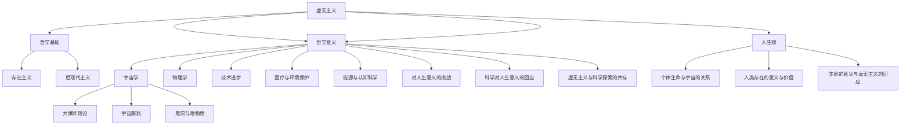

                 

### 第1章 引言

## 1.1 虚无主义的起源与发展

虚无主义（Nihilism）一词起源于19世纪，起源于对宗教和道德价值的质疑。最初的虚无主义者如彼得·基尔凯郭尔（Søren Kierkegaard）和弗里德里希·尼采（Friedrich Nietzsche），他们对传统价值观提出了深刻的挑战，认为人类在缺乏绝对意义和目的的世界中感到迷茫和困惑。

基尔凯郭尔在《恐惧和 Trembling》中提出了“上帝已死”的概念，认为随着宗教信仰的衰落，人类失去了道德和伦理的根基。尼采则在《善恶的彼岸》中提出了“超人”概念，试图通过重塑价值观来超越虚无主义的困境。

虚无主义在20世纪得到了进一步的发展，特别是在存在主义和后现代主义中。存在主义者如让-保尔·萨特（Jean-Paul Sartre）和马丁·海德格尔（Martin Heidegger）探讨了个体存在的意义，认为通过行动和选择，个体能够创造自己的意义。

## 1.2 科学探索的历程与成果

科学探索是人类对自然界和宇宙的理解和探索的历程。从古希腊的泰勒斯（Thales）和亚里士多德（Aristotle），到中世纪的阿拉伯学者，再到文艺复兴时期的伽利略（Galileo Galilei）和牛顿（Isaac Newton），科学的进步不断推动人类认知的边界。

20世纪的物理学和宇宙学取得了突破性的进展，例如爱因斯坦的相对论（Special and General Theory of Relativity）和量子力学的发现。这些理论改变了我们对宇宙的理解，揭示了物质和能量的本质。

在宇宙学的领域，大爆炸理论（Big Bang Theory）提出了宇宙起源于一个极高温度和密度的状态，并持续膨胀至今。黑体辐射、宇宙微波背景辐射（Cosmic Microwave Background Radiation，CMB）等实验证据支持了这一理论。

## 1.3 虚无主义与科学探索的交汇

虚无主义和科学探索在某些方面有着共通点。虚无主义质疑传统价值观和意义，而科学探索寻求通过实证和理性方法理解宇宙的本质。

在科学哲学中，有些观点认为科学方法本身就是一种虚无主义的实践，因为科学追求的是相对真理，而不是绝对真理。例如，库尔特·哥德尔（Kurt Gödel）的不完备性定理表明，即使是数学这样的严格学科，也存在无法证明的命题。

另一方面，虚无主义对科学探索的质疑也表现在对人类在宇宙中的地位和意义的探讨上。随着对宇宙和生命的了解不断深入，一些人感到人类在宇宙中可能是无足轻重的，这种观点与虚无主义的思想有相似之处。

总的来说，虚无主义和科学探索在哲学和科学领域都提供了深刻的思考，它们不仅挑战了传统的价值观，也激发了人类对宇宙和生命的探索精神。在接下来的章节中，我们将深入探讨虚无主义的哲学基础、科学探索的成果以及二者之间的关系。

## 1.4 虚无主义与科学探索的未来

虚无主义和科学探索在当今社会和哲学界仍然具有重要的地位。虚无主义不断提醒我们，在没有绝对意义和目的的世界中，人类需要寻找自己的价值和意义。这种反思有助于推动个人和社会的进步，促进个体对自身存在和行为的深入思考。

科学探索则为我们提供了理解宇宙和生命的工具。随着技术的进步，人类在宇宙中的地位和角色也在不断变化。例如，通过探测宇宙微波背景辐射，科学家们获得了关于宇宙早期状态的重要信息。这些发现不仅深化了我们对宇宙的理解，也激发了对人类起源和未来探索的思考。

未来的研究可能涉及以下几个方面：

1. **跨学科融合**：将虚无主义哲学与科学探索相结合，探讨人类在宇宙中的意义和角色，从而形成新的哲学体系。

2. **技术伦理**：随着人工智能和生物技术的发展，人类面临新的伦理挑战。如何确保技术进步不会加剧虚无主义的困境，将是未来研究的重要议题。

3. **宇宙起源与演化**：进一步研究宇宙的起源和演化，特别是关于暗物质和暗能量的本质，将有助于我们理解宇宙的运行规律。

4. **生命的起源**：通过探索生命的起源和进化，人类可能找到生命存在的更深层次的意义。

虚无主义与科学探索的交汇不仅丰富了哲学和科学的研究领域，也为人类提供了更广阔的思考空间。在未来的探索中，我们可能会找到新的答案，也可能面临新的挑战。无论如何，这一旅程将继续推动人类对自身和宇宙的理解，为我们的存在赋予更深层次的意义。

## 虚无主义的概念与哲学基础

### 2.1 虚无主义的基本定义

虚无主义是一种哲学思潮，其核心观点是质疑或否认生活中普遍接受的道德、宗教和社会价值体系。虚无主义认为，这些价值体系缺乏客观基础，因而被认为是虚假的或无意义的。虚无主义的核心概念是“虚无”，即不存在绝对的价值、意义或目的。

在定义虚无主义时，我们可以从其否定性和建设性两个角度来理解。否定性虚无主义认为，由于无法找到绝对的价值和意义，生活变得没有意义。建设性虚无主义则试图通过批判现有价值体系，重新定义个人和社会的价值观。

### 2.2 虚无主义在西方哲学中的地位

虚无主义在西方哲学中具有重要地位，尤其是在19世纪和20世纪。19世纪的虚无主义运动起源于对宗教和道德价值的质疑，最早可以追溯到哲学家彼得·基尔凯郭尔和弗里德里希·尼采。

彼得·基尔凯郭尔是丹麦哲学家，他的思想对后来的虚无主义产生了深远影响。基尔凯郭尔认为，宗教信仰是人类找到生命意义的关键，但现实世界的宗教和道德体系已经衰落，导致人们感到生命的虚无。他的代表作《恐惧与战栗》和《存在与本质》中，深入探讨了人类存在的荒谬和意义。

弗里德里希·尼采是德国哲学家，被认为是虚无主义的代表人物。尼采提出了“上帝已死”的命题，认为传统宗教和道德价值观的衰落导致人类失去了生命的意义。尼采主张通过“超人”的概念，重新定义人类的价值和意义，他的著作《查拉图斯特拉如是说》和《善恶的彼岸》对后世哲学产生了巨大影响。

20世纪的虚无主义继续在存在主义和后现代主义中得到了发展。存在主义者如让-保尔·萨特和马丁·海德格尔探讨了个体存在的荒谬性和自由意志，认为通过行动和选择，个体能够创造自己的意义。后现代主义则对传统哲学和科学的客观性提出了质疑，强调知识和现实的相对性和多元性。

### 2.3 虚无主义的主要流派

虚无主义有多种流派，每种流派都有其独特的核心理念和理论基础。

1. **西方虚无主义**

西方虚无主义是虚无主义的主要流派之一，其核心思想是质疑宗教和道德价值的客观性。西方虚无主义起源于19世纪，与基尔凯郭尔和尼采的思想密切相关。西方虚无主义者认为，由于缺乏绝对价值，人类生活变得没有意义。

2. **存在主义虚无主义**

存在主义虚无主义是存在主义的一个分支，强调个体存在的荒谬性和自由意志。代表人物有让-保尔·萨特和马丁·海德格尔。萨特在其代表作《存在与虚无》中，提出了存在主义的核心观点，即人类在没有预先设定意义的情况下存在，必须通过自由意志为自己创造意义。海德格尔则在其哲学中探讨了存在的本质和意义，强调人类在存在中的独特性和自由。

3. **俄国虚无主义**

俄国虚无主义起源于19世纪的俄国，其核心思想是反对当时的封建制度和社会不公。俄国虚无主义者认为，通过暴力革命和社会变革，可以消除社会的不公和压迫，为人类创造一个更公平的社会。俄国虚无主义的代表人物包括赫尔岑（Alexander Herzen）和奥格辽夫（Nikolai Ogarev）。

4. **技术虚无主义**

技术虚无主义是一种当代虚无主义思潮，其核心观点是质疑现代技术的价值和意义。技术虚无主义者认为，现代技术的发展导致了人类社会的异化，使得人类失去了对自然的控制和尊重。技术虚无主义的代表人物有波兹曼（Neil Postman）和利奥塔（Jean-François Lyotard）。

### 2.4 虚无主义与存在主义的关系

虚无主义与存在主义有着密切的联系。存在主义是一种哲学思潮，强调个体存在的荒谬性和自由意志，而虚无主义则是对传统价值观和意义的质疑。可以说，虚无主义为存在主义提供了理论基础，存在主义则通过实践和行动回应了虚无主义的挑战。

让-保尔·萨特的存在主义思想深受虚无主义的影响。他在《存在与虚无》中，探讨了人类在没有预先设定意义的情况下存在的状态，认为人类必须通过自由意志为自己创造意义。萨特的存在主义观点与基尔凯郭尔和尼采的思想相似，都是对传统价值观的质疑和反思。

另一方面，存在主义也为虚无主义提供了一种回应方式。通过强调个体的自由意志和行动，存在主义者试图在虚无主义的困境中找到出路。他们认为，尽管世界可能缺乏绝对的意义，但个体仍然可以通过自己的选择和行动创造出个人的意义和价值。

总的来说，虚无主义和存在主义在哲学领域形成了互为补充的关系。虚无主义挑战了传统价值观，使人们意识到生活的荒谬和无意义；而存在主义则通过强调个体的自由意志和行动，为人类提供了一种寻找意义的途径。这种相互关系不仅丰富了哲学思想，也推动了人类对自身存在的深入思考。

## 宇宙视角下的科学探索

### 3.1 宇宙学的基本概念

宇宙学是一门研究宇宙起源、结构、演化以及宇宙中物质和能量的学科。宇宙学的基本概念包括宇宙的尺度、结构和宇宙学原理。

宇宙的尺度是指宇宙的大小。根据现代宇宙学的理解，宇宙的直径约为930亿光年，且仍在不断膨胀。宇宙的结构是指宇宙中的物质和能量的分布形式。目前，宇宙被认为是一个多层次的、层次分明的结构，包括星系、星系团和超星系团等。

宇宙学原理是宇宙学研究的重要基础。广义的宇宙学原理包括宇宙的均匀性和各向同性。均匀性指的是宇宙在宏观尺度上看起来是相同的，即宇宙中任意两个相同体积的空间区域具有相同的物质和能量分布。各向同性则是指宇宙在所有方向上都看起来是相同的。

### 3.2 宇宙起源与演化

宇宙起源与演化是宇宙学中最具挑战性的问题之一。目前，最被广泛接受的宇宙起源理论是大爆炸理论（Big Bang Theory）。

大爆炸理论认为，宇宙起源于约138亿年前的一个极高温度和密度的状态，称为“原始奇点”。在这个原始奇点中，所有的物质和能量都集中在一个极其微小的空间中。在大约10^-43秒后，原始奇点发生了急剧的膨胀，这一膨胀过程称为“宇宙膨胀”。随着宇宙的膨胀，温度和密度逐渐降低，宇宙逐渐冷却并形成了基本粒子和元素。

在大爆炸后的前几分钟内，宇宙经历了“核合成”过程，形成了大多数宇宙中的重元素，如氢、氦和锂。这些元素在宇宙膨胀的过程中逐渐凝结形成了星系、恒星和行星。

宇宙的演化还包括恒星的形成和死亡、星系的形成和演化、以及宇宙的膨胀。恒星在其生命周期中，通过核聚变将氢转化为氦，释放出大量的能量。恒星的死亡方式包括成为白矮星、中子星或黑洞，这些死亡恒星的核心物质将继续影响宇宙的演化。

星系的形成和演化是由恒星、星系团和宇宙大尺度结构共同作用的结果。宇宙大尺度结构是指宇宙中的巨大结构，如超星系团和宇宙网。这些结构通过引力相互作用，形成了复杂的宇宙形态。

宇宙的膨胀是指宇宙在整体上的扩张。根据哈勃定律（Hubble's Law），宇宙的膨胀速度与宇宙距离成正比。这种膨胀是由宇宙中的暗能量（Dark Energy）驱动的，暗能量是一种神秘的能量形式，其性质和起源仍然是宇宙学中的研究热点。

### 3.3 黑洞与暗物质

黑洞（Black Hole）是宇宙中一种极其密集的天体，其引力场强大到连光都无法逃逸。黑洞的形成通常发生在恒星的死亡过程中，当恒星耗尽其核燃料时，会发生坍缩，形成黑洞。

黑洞的研究是现代宇宙学的重要组成部分。科学家们已经通过观测和计算，对黑洞的性质和行为有了深入的了解。例如，黑洞的吸积盘（Accretion Disk）和喷流（Jet）等现象，都是黑洞物理的重要研究领域。

暗物质（Dark Matter）是宇宙中另一种神秘的存在，其质量远大于普通物质，但无法直接观测到。暗物质的存在最初是通过观测宇宙中星系旋转曲线的异常来推测的。根据牛顿第二定律，星系中心的星体应受到向外的离心力，导致星系迅速解体。然而，观测发现，星系中的星体运动速度远高于预期，这表明星系中存在大量的看不见的物质，即暗物质。

暗物质的研究是现代宇宙学中的另一个重要问题。科学家们认为，暗物质可能是一种未知的粒子，如弱相互作用大质量粒子（Weakly Interacting Massive Particles，WIMPs）。为了研究暗物质，科学家们进行了大量的实验和观测，如宇宙微波背景辐射（Cosmic Microwave Background Radiation，CMB）的测量、星系旋转曲线的研究以及引力透镜效应的观测等。

黑洞和暗物质的研究不仅有助于我们理解宇宙的结构和演化，也揭示了宇宙中许多未解之谜。随着科学技术的不断进步，科学家们期待在未来能够揭开这些神秘存在的更多秘密。

### 3.4 宇宙的膨胀与宇宙学常数

宇宙的膨胀是指宇宙在整体上的扩张。根据哈勃定律（Hubble's Law），宇宙的膨胀速度与宇宙距离成正比。这一现象表明，宇宙中的物质和能量正在远离彼此，宇宙的体积在不断增大。

宇宙学常数（Cosmological Constant）是描述宇宙膨胀的一个重要参数。它最初由爱因斯坦在1917年提出，作为他的广义相对论方程中的一个项，用来平衡宇宙中的引力和膨胀力。爱因斯坦将宇宙学常数设为一个正数，以保持宇宙的静态状态。

然而，1929年埃德温·哈勃（Edwin Hubble）的观测结果表明，宇宙正在膨胀。这一发现与爱因斯坦的静态宇宙模型相矛盾，爱因斯坦因此戏称宇宙学常数为“他的最大错误”。

后来，随着对宇宙膨胀的研究深入，科学家们发现，宇宙的膨胀速度似乎在加快。这一现象被解释为暗能量的存在，暗能量是一种具有负压强的能量形式，其作用是加速宇宙的膨胀。目前，宇宙学常数被视为暗能量的一种表现形式，是研究宇宙膨胀和演化的重要参数。

宇宙学常数的数值约为 \(10^{-122}\) m\(^{-2}\)，这个极小的数值使得宇宙的膨胀得以在数十亿年的时间尺度上维持。科学家们仍在探索宇宙学常数的本质和起源，这一研究对于理解宇宙的起源和演化具有重要意义。

### 虚无主义与科学探索的哲学意义

虚无主义和科学探索在哲学上具有深远的意义，它们对人生意义、价值和存在的讨论提供了不同的视角和思考路径。

#### 4.1 虚无主义对人生意义的挑战

虚无主义的核心观点是质疑生活中普遍接受的价值和意义。虚无主义者认为，由于缺乏绝对的价值和意义，人类生活变得空虚和无意义。这种观点对传统宗教和道德价值观提出了挑战，使得许多人感到迷茫和困惑。

在虚无主义的视角下，人生意义的问题变得尤为突出。如果生活中没有固有的目的和意义，那么个体如何找到自己的价值？虚无主义提醒我们，在现代社会中，许多人可能感到生活的无意义，这种感受源于对传统价值观的质疑和对未来方向的迷失。

虚无主义对人生意义的挑战还表现在对人类存在的本质的探讨上。如果宇宙中的存在只是随机和偶然的产物，那么人类的存在是否有价值？虚无主义鼓励我们反思自己的存在，寻找个人价值和社会意义。

#### 4.2 科学探索对人生意义的回应

科学探索为人类提供了一种寻找生命意义的方式。通过科学方法，人类不断深入探索宇宙的本质，理解自然界和生命的规律。科学不仅帮助我们解决了许多实际问题，还激发了我们对宇宙和生命的探索精神。

科学探索对人生意义的回应体现在以下几个方面：

1. **知识的追求**：科学探索促进了人类对自然界的认知，提供了理解宇宙和生命的工具。知识的积累不仅满足了人类的好奇心，也为我们提供了新的视角和思考路径。

2. **技术的进步**：科学探索推动了技术的进步，为人类创造了更多的便利和可能性。从医疗技术到信息技术，科学技术的进步改变了人类的生活方式，为我们的存在赋予了更多的意义。

3. **对宇宙的探索**：科学探索使我们能够了解宇宙的起源和演化，认识到人类在宇宙中的微小地位。这种认识不仅拓宽了我们的视野，也激发了我们对宇宙的敬畏和探索精神。

#### 4.3 虚无主义与科学探索的共存

虚无主义和科学探索并不是对立的，它们可以共存并相互补充。虚无主义提醒我们，生活中可能没有固有的意义，这促使我们更加主动地寻找个人价值和社会意义。科学探索则为我们提供了寻找意义的方法和工具，通过不断探索和认知，我们能够找到新的视角和意义。

在现代社会中，虚无主义和科学探索的共同存在反映了人类对生活和宇宙的深刻反思。虚无主义挑战了传统价值观，科学探索提供了新的解释和工具，这两种思潮共同推动了人类对自身存在和宇宙的理解。

总的来说，虚无主义和科学探索在哲学上具有深远的意义。虚无主义促使我们反思生活的意义，科学探索为我们提供了寻找意义的方法和工具。在虚无主义的挑战和科学探索的回应中，人类不断寻找自己的价值和社会意义，为我们的存在赋予新的意义。

### 虚无主义视角下的人生观

#### 5.1 个体生命与宇宙的关系

在虚无主义的视角下，个体生命与宇宙之间的关系被重新审视。虚无主义认为，宇宙本身缺乏绝对的意义和价值，个体生命也不例外。因此，个体生命在宇宙中的地位显得尤为微小和脆弱。

然而，这种视角并不意味着个体生命无足轻重。相反，虚无主义鼓励我们认识到个体生命独特性和自主性，从而在宇宙的虚无中寻找个人的价值和意义。

1. **宇宙的浩瀚与个体的渺小**：从宇宙的尺度来看，人类和地球只是宇宙中微小的存在。宇宙的直径约为930亿光年，而地球的直径仅为12742公里。这种宏观视角使我们意识到，在宇宙的尺度上，人类的存在几乎可以忽略不计。

2. **个体生命的独特性和自主性**：尽管个体生命在宇宙中的地位微不足道，但它们拥有独特的内在价值。每个个体都有其独特的经历、思想和情感，这些都是宇宙中不可复制的部分。此外，个体具有自主选择和创造的能力，这使得个体生命在宇宙的虚无中拥有了独特的意义。

3. **生命的短暂与永恒的追求**：虚无主义提醒我们，生命是短暂的，但个体可以通过自身的努力和创造，赋予生命永恒的价值。虽然生命本身可能缺乏固有的意义，但个体可以在生命的过程中创造自己的意义，通过追求知识和经验，使生命变得有意义。

#### 5.2 人类存在的意义与价值

在虚无主义的视角下，人类存在的意义和价值成为一个深刻的问题。虚无主义挑战了传统的宗教和道德价值观，认为这些价值观缺乏客观基础。因此，人类存在的意义和价值需要从个体的角度进行重新定义。

1. **意义的创造**：虚无主义认为，人类存在的意义不是固有的，而是需要个体通过自身的努力和选择来创造。人类可以通过追求知识、经验和成长，赋予生命意义。例如，通过学习科学知识，人类可以更好地理解宇宙和生命的本质；通过艺术创作和文学表达，人类可以传递情感和思想。

2. **价值的多维度**：在虚无主义的视角下，人类存在的价值是多维度的。不仅包括物质层面的成就，如科技进步和经济发展，还包括精神层面的成就，如道德、艺术和哲学的贡献。例如，爱因斯坦的物理理论和达芬奇的绘画作品都是人类价值的体现，它们在各自的领域中具有深远的影响。

3. **个体与社会的互动**：人类存在的价值也体现在个体与社会之间的互动中。通过合作和互助，个体可以为社会做出贡献，从而实现自身的价值。例如，医生通过治疗病人，科学家通过发现新知识，都可以为社会带来积极的影响。

#### 5.3 生命的意义与虚无主义的回应

虚无主义对生命的意义提出了深刻的挑战，但也提供了一种回应方式。虚无主义者认为，生命的意义不是固有的，而是需要个体通过自身的努力和选择来发现和实现。

1. **积极的生活态度**：虚无主义鼓励个体采取积极的生活态度，通过行动和选择，为自己创造意义。例如，通过追求知识、从事有意义的工作、建立良好的人际关系等，个体可以在生命的虚无中找到自己的意义。

2. **自我实现**：虚无主义强调自我实现的重要性。通过追求个人成长和发展，个体可以找到生命的意义。例如，通过学习新技能、探索未知的领域、参与社会公益活动等，个体可以不断丰富自己的人生经历，从而实现自我价值。

3. **哲学和精神的探索**：虚无主义还鼓励个体通过哲学和精神的探索，寻找生命的意义。例如，通过阅读哲学著作、参加精神修行、进行冥想等，个体可以深入思考生命的本质和意义，从而找到内心的平静和满足。

总的来说，虚无主义视角下的人生观提醒我们，生命的意义不是固有的，而是需要个体通过自身的努力和选择来创造和实现。尽管宇宙可能缺乏绝对的意义，但个体可以在自己的生命中找到独特的价值和意义。通过积极的生活态度、自我实现和哲学探索，个体可以在虚无主义的挑战中找到生命的意义。

### 科学探索与人类文明的发展

#### 6.1 科学探索的历史与现状

科学探索是人类文明发展的重要推动力。从古代到现代，科学探索不断推动着人类认知的边界，改变了我们对自然界和宇宙的理解。

在古代，人类通过观察自然现象，提出了许多初步的科学理论。例如，古希腊哲学家泰勒斯（Thales）认为水是万物的本原，亚里士多德（Aristotle）则提出了四元素说。这些早期理论为后来的科学发展奠定了基础。

中世纪时期，阿拉伯学者在数学、天文学和医学等领域取得了显著成就，为欧洲文艺复兴时期的科学革命奠定了基础。文艺复兴时期，伽利略（Galileo Galilei）和牛顿（Isaac Newton）等科学家通过实验和数学方法，开创了现代科学的新纪元。伽利略通过望远镜观测天体，证明了地球围绕太阳旋转；牛顿则提出了经典力学，为物理学奠定了坚实的理论基础。

20世纪以来，科学探索取得了更为惊人的进展。爱因斯坦的相对论（Special and General Theory of Relativity）彻底改变了我们对时空和引力的理解；量子力学的发现揭示了物质和能量在微观尺度上的行为；宇宙学的发展使我们能够探索宇宙的起源和演化。

现代科学探索不仅依赖于传统的实验和理论方法，还受益于先进技术的支持。例如，粒子加速器和射电望远镜等实验设施，使科学家能够进行更为精确的实验和观测；计算机科学的发展则为数据分析、模拟和计算提供了强大的工具。

#### 6.2 科学技术在现代社会中的作用

科学技术在现代社会中扮演着至关重要的角色，深刻影响了人类的生活、经济、文化和政治等方面。

1. **经济增长**：科学技术是推动现代经济增长的关键因素。技术创新和产业升级带动了新的商业模式和就业机会，推动了全球经济的发展。例如，互联网和移动通信技术的普及，改变了传统产业的生产和运营模式，催生了众多新兴产业。

2. **医疗进步**：科学技术的进步显著提高了人类的健康水平。医学研究和技术创新使得许多疾病得以预防和治疗，延长了人类的寿命。例如，疫苗的研发和广泛应用，有效控制了传染病的流行；基因编辑技术的出现，为治疗遗传病和癌症提供了新的希望。

3. **环境保护**：科学技术在环境保护和可持续发展方面也发挥着重要作用。通过环境监测和治理技术的改进，人类能够更好地应对气候变化和环境污染问题。例如，太阳能和风能等可再生能源技术的发展，为减少对化石燃料的依赖提供了有效途径。

4. **文化传播**：科学技术的普及改变了人类的文化传播方式。互联网和社交媒体平台使得信息和文化的传播速度和范围大大增加，促进了全球化进程。例如，在线教育和远程工作等新模式，使得教育和文化交流变得更加便捷和高效。

5. **政治影响**：科学技术在政治决策和国家安全方面也具有重要影响。通过数据分析和人工智能技术，政府能够更准确地了解社会状况，制定更加科学的政策和决策。同时，网络安全和防务技术的研究，有助于维护国家的安全和稳定。

#### 6.3 科学探索的未来展望

未来的科学探索将在多个领域取得重大突破，为人类文明的发展带来新的机遇和挑战。

1. **生命科学**：生命科学领域将继续深入探索生命的起源、进化和机制。基因编辑技术如CRISPR将可能带来医学和农业的革命性进展，为治疗遗传病和提升农作物产量提供新途径。

2. **人工智能**：人工智能技术的进步将深刻改变人类社会。通过深度学习和机器学习算法，人工智能将在医疗、教育、交通等多个领域发挥重要作用，提高生产效率和决策水平。

3. **宇宙探索**：宇宙探索将继续拓展人类的视野。未来的太空任务可能包括载人火星探索、星际飞行，以及对黑洞和暗物质的深入研究。这些探索将帮助我们更好地理解宇宙的本质和人类的地位。

4. **能源与环境**：随着全球环境问题的日益严重，可再生能源技术、环境保护技术和能源储存技术的发展将受到更多关注。这些技术将为实现可持续发展目标提供关键支持。

5. **脑科学与认知科学**：脑科学与认知科学领域将揭示人类大脑的工作机制，为心理健康、认知增强和神经系统疾病的治疗提供新的方法。

总的来说，科学探索将继续推动人类文明的发展，为解决全球性问题和提升人类生活质量提供创新的解决方案。在未来的科学探索中，人类将不断突破认知的边界，创造更加美好的未来。

### 跨越虚无主义的道路

#### 7.1 心理学与哲学的启示

在面对虚无主义的挑战时，心理学与哲学提供了许多有价值的启示，帮助我们寻找跨越虚无主义的道路。

心理学研究个体如何应对生活中的困难和不确定性，揭示了人类心理的复杂性和适应性。心理学家卡尔·荣格（Carl Jung）提出的“个体化”过程，强调个体通过自我探索和内在成长，找到自己的独特价值和意义。荣格认为，个体需要通过自我觉察和与内在自我（即个人潜意识）的联系，来实现内在的平衡和和谐。

哲学则提供了更广泛的思考框架，帮助我们在更宏观的层面上理解虚无主义。哲学家马丁·海德格尔（Martin Heidegger）在其著作《存在与时间》中，探讨了存在的意义和人类存在的本质。海德格尔认为，人类的存在是一种“存在-在世界中”（Dasein），即人类在世界上不断地与世界和他人互动，通过这种互动，个体能够赋予自己的生命以意义。

哲学家让-保尔·萨特（Jean-Paul Sartre）的存在主义哲学也提供了重要的启示。萨特强调自由意志的重要性，认为个体通过自主选择和行动，能够为自己创造意义。尽管世界可能缺乏固有的意义，但个体可以通过自己的选择和行动，找到生活的方向和目的。

#### 7.2 艺术与宗教的价值

艺术与宗教在应对虚无主义方面也发挥了重要作用。艺术通过表达情感和思想，为个体提供了寻找意义和自我表达的途径。艺术作品如文学、音乐、绘画等，能够触动人的内心，引发深刻的思考，从而在某种程度上弥补虚无主义带来的空虚感。

宗教则通过信仰和仪式，为个体提供了精神寄托和意义框架。宗教信仰帮助人们相信某种超越的、永恒的存在，从而赋予生命以意义。通过宗教仪式和社区活动，个体能够感受到归属感和凝聚力，从而减轻虚无主义的负面影响。

心理学家维克托·弗兰克尔（Viktor Frankl）在其著作《生命的意义》中，通过自己集中营的经历，阐述了意义疗法（Logotherapy）的概念。弗兰克尔认为，即使在极端的逆境中，人类也能够通过寻找生命的意义来应对虚无主义。意义疗法强调，通过找到和实现个人的生命意义，个体能够获得内心的平静和满足。

#### 7.3 跨学科研究的可能途径

跨学科研究为应对虚无主义提供了一种新的思路。通过结合心理学、哲学、艺术和宗教等领域的知识，我们可以从多个角度探讨虚无主义的问题，找到更加综合和有效的解决方案。

心理学与哲学的结合，可以深入探讨人类存在的意义和心理机制。例如，通过心理学的方法研究人类的价值观和意义感，结合哲学的思考，探讨如何通过内在成长和自我觉察来应对虚无主义。

艺术与宗教的跨学科研究，可以帮助我们更好地理解人类情感和精神需求的本质。例如，通过分析艺术作品和宗教仪式，探讨它们如何影响个体的心理状态和价值观，从而在虚无主义的困境中找到安慰和指导。

跨学科研究的另一个重要领域是科学和宗教的对话。尽管科学和宗教在方法和观点上有所不同，但它们都关注人类存在的意义和宇宙的本质。通过科学和宗教的对话，我们可以尝试找到一种综合的哲学体系，为应对虚无主义提供更加全面的视角。

总之，心理学与哲学的启示、艺术与宗教的价值，以及跨学科研究的可能途径，为我们跨越虚无主义提供了多种思路和路径。通过这些方法，我们可以更好地理解虚无主义，找到生活的意义和目的，从而实现内心的平衡和和谐。

## 第8章 结论

虚无主义与科学探索在哲学和科学领域都提供了深刻的思考，它们不仅挑战了传统的价值观，也激发了人类对宇宙和生命的探索精神。在这篇文章中，我们探讨了虚无主义的概念、哲学基础、宇宙视角下的科学探索以及二者之间的哲学意义。

首先，虚无主义是一种哲学思潮，质疑生活中普遍接受的道德、宗教和社会价值体系。它在19世纪和20世纪得到了发展，特别是在存在主义和后现代主义中。虚无主义认为，由于缺乏绝对的价值和意义，人类生活变得没有意义。然而，虚无主义也提醒我们反思生活的意义，寻找个人价值和社会意义。

科学探索则为我们提供了理解宇宙和生命的工具。通过科学方法，人类不断深入探索宇宙的本质，理解自然界和生命的规律。科学技术的进步改变了人类的生活方式，为我们的存在赋予了更多的意义。

在虚无主义与科学探索的交汇中，我们看到了二者在哲学和科学领域的互补作用。虚无主义挑战了传统价值观，科学探索提供了新的解释和工具。通过这种相互补充的关系，人类在反思和探索中不断寻找生活的意义。

未来，虚无主义与科学探索将继续推动人类对自身和宇宙的理解。跨学科研究将结合心理学、哲学、艺术和宗教等领域的知识，为应对虚无主义提供更加综合和有效的解决方案。在虚无主义的挑战和科学探索的回应中，人类将不断寻找自己的价值和社会意义，为我们的存在赋予新的意义。

总结来说，虚无主义与科学探索的共同探讨不仅丰富了哲学和科学的研究领域，也为我们提供了深刻的思考和启示。通过反思和探索，我们能够更好地理解生活的意义，找到内心的平衡和和谐，共同迈向一个更加美好的未来。

### 图1-1 虚无主义与科学探索的关系架构 Mermaid 流程图

以上Mermaid流程图展示了虚无主义与科学探索之间的复杂关系，包括它们在哲学基础、科学领域和人生观上的相互影响和补充。通过这种结构化的展示，我们能够更清晰地理解二者如何相互作用，共同推动人类对自身和宇宙的深入探索。

