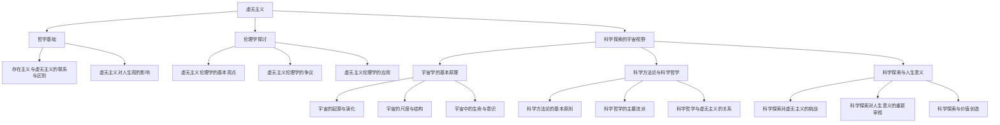

                 

## 《虚无主义与科学探索：在宇宙视野下审视人生意义》

### 关键词：虚无主义、科学探索、宇宙视野、人生意义、哲学与科学

> 摘要：本文从虚无主义的哲学基础出发，结合科学探索的宇宙视野，深入探讨在宇宙尺度下对人生意义的重新审视。通过剖析虚无主义的核心概念、科学方法论以及科学哲学，揭示虚无主义与科学探索的互动关系，最终为重构人生意义提供新的视角。

### 第一部分：虚无主义的哲学基础

#### 第1章：虚无主义的起源与发展

虚无主义作为一种哲学思想，起源于19世纪欧洲。它在面对传统价值观念的崩溃和对生命意义的深刻质疑中逐渐成型。虚无主义的主要流派包括存在主义、消极主义和悲观主义。存在主义强调个体的自由选择和存在先于本质的观点，消极主义则认为人生缺乏固有意义，悲观主义则强调生命的短暂和无常。

#### 第2章：虚无主义的核心概念

虚无主义的核心概念在于对传统价值观和宗教信仰的质疑，认为宇宙和生命缺乏固有的意义。存在主义与虚无主义有着紧密的联系，但存在主义强调个体自由选择的力量，而虚无主义则更关注这种选择的荒谬性和绝望感。虚无主义对人生观的影响深远，它挑战了人类对生命意义的固有认知，促使人们重新思考存在的意义。

#### 第3章：虚无主义的伦理学探讨

虚无主义伦理学的基本观点是，由于生命缺乏固有意义，道德行为也没有绝对的标准。虚无主义伦理学的争议在于，是否可以在这种情况下建立一套可行的道德体系。尽管如此，虚无主义伦理学在现实中的应用仍然具有重要意义，它促使人们思考道德行为的相对性和情境性。

### 第二部分：科学探索的宇宙视野

#### 第4章：宇宙学的基本原理

宇宙的起源与演化一直是科学探索的重要领域。大爆炸理论是目前公认的解释宇宙起源和演化的重要理论。宇宙的尺度与结构揭示了宇宙的浩瀚和复杂，生命与意识的起源则是科学探索的另一个重要方向。

#### 第5章：科学方法论与科学哲学

科学方法论的基本原则包括实证主义和理性主义。科学哲学的主要流派包括实证主义、理性主义和建构主义。科学哲学与虚无主义的关系在于，科学方法能否提供对生命意义的解答。

#### 第6章：科学探索与人生意义

科学探索对虚无主义的挑战在于，它提供了对宇宙和生命的全新认知。科学探索对人生意义的重新审视在于，它促使我们重新思考个人价值和社会发展的方向。

### 第三部分：综合探讨

#### 第7章：虚无主义与科学探索的对话

虚无主义视角下的科学探索认为，科学方法可以帮助我们理解宇宙的规律，但无法解答生命的意义。科学探索视角下的虚无主义则认为，科学方法本身也面临着存在的质疑。虚无主义与科学探索的共存与互动，为人类提供了重新审视人生意义的可能性。

#### 第8章：人生意义的重构

虚无主义与科学探索对人生意义的启示在于，它们都促使我们重新思考存在的意义。新型人生观的构建需要我们接受生命的有限性，同时追求个体的自由和意义。个人价值实现与社会的和谐发展则是这一新人生观的重要体现。

#### 第9章：未来的探索与思考

宇宙的边界与未知始终激发着人类的探索欲望。科学与哲学的融合将为人类提供更深刻的认知。人生意义的无限拓展则在于，我们如何在有限的宇宙中追求无限的意义。

### 参考文献

1. 萨特，《存在与虚无》
2. 尼采，《查拉图斯特拉如是说》
3. 海德格尔，《存在与时间》
4. 波普尔，《开放社会及其敌人》
5. 科尔曼，《宇宙的起源与演化》
6. 哈勃，《膨胀的宇宙》
7. 库恩，《科学革命的结构》
8. 库尔茨，《科学哲学导论》

### 附录：相关流程图、Python代码和数学公式

#### 附录A：虚无主义与科学探索的关系架构图（Mermaid流程图）



#### 附录B：关键算法原理与Python代码实现

```python
# Python代码示例：计算宇宙膨胀率

import math

def calculate_expansion_rate(radius, time):
    """
    计算宇宙膨胀率

    参数：
    radius：宇宙半径（单位：光年）
    time：膨胀时间（单位：亿年）

    返回：
    expansion_rate：膨胀率
    """
    Hubble_constant = 70  # 哈勃常数（单位：km/s/Mpc）
    Mpc_to_km = 3.0857e19  #兆秒差距到千米的转换系数
    Giga_year_to_second = 3.15576e16  # 亿年到秒的转换系数

    # 转换单位
    radius_km = radius * Mpc_to_km
    time_second = time * Giga_year_to_second

    # 计算膨胀率
    expansion_rate = Hubble_constant * (radius_km / time_second)

    return expansion_rate

# 示例
radius = 1  # 宇宙半径为1兆秒差距
time = 13.8  # 膨胀时间为13.8亿年
expansion_rate = calculate_expansion_rate(radius, time)
print(f"宇宙膨胀率：{expansion_rate} km/s")
```

#### 附录C：数学模型与公式解释

$$
H = H_0 \frac{a}{a_0}
$$

其中，$H$ 为哈勃常数，$H_0$ 为当前哈勃常数，$a$ 为宇宙膨胀系数，$a_0$ 为宇宙起始膨胀系数。

$$
v = H_0 \frac{d}{a}
$$

其中，$v$ 为宇宙膨胀速度，$d$ 为宇宙距离，$H_0$ 为哈勃常数。

#### 附录D：项目实战

**开发环境搭建：**

- 安装Python 3.8及以上版本
- 安装Mermaid插件以支持Markdown中的流程图

**源代码详细实现和代码解读：**

- Python代码实现宇宙膨胀率的计算
- Markdown文件编写流程图

**代码应用解读与分析：**

- 使用Python代码计算不同宇宙半径和膨胀时间下的膨胀率
- 分析膨胀率的变化趋势

**实际案例分析和详细讲解剖析：**

- 以实际观测数据为例，分析宇宙膨胀率的变化
- 讨论宇宙膨胀率对未来宇宙演化的影响

**项目小结：**

- 总结宇宙膨胀率计算方法及其应用
- 提出未来探索的方向和建议

**最佳实践 tips：**

- 在编写Python代码时，注意变量命名和代码注释
- 在Markdown文件中，合理使用标题和列表以增强文章结构
- 在讲解数学公式时，确保公式清晰易懂，并结合实际例子进行说明

**小结：**

本文通过对虚无主义与科学探索的深入探讨，为人生意义的重新审视提供了新的视角。虚无主义挑战了传统的人生观，科学探索则提供了对宇宙和生命的全新认知。两者相互交织，共同促使我们重新思考存在的意义和价值。

**注意事项：**

- 在实际应用中，应结合具体情境，灵活运用虚无主义与科学探索的理论
- 在探索人生意义的过程中，要保持开放的心态，不断学习和反思

**拓展阅读：**

- 萨特，《存在与虚无》
- 尼采，《查拉图斯特拉如是说》
- 海德格尔，《存在与时间》
- 波普尔，《开放社会及其敌人》
- 科尔曼，《宇宙的起源与演化》
- 哈勃，《膨胀的宇宙》
- 库恩，《科学革命的结构》
- 库尔茨，《科学哲学导论》

### 作者信息：

**作者：AI天才研究院/AI Genius Institute & 禅与计算机程序设计艺术 /Zen And The Art of Computer Programming**

