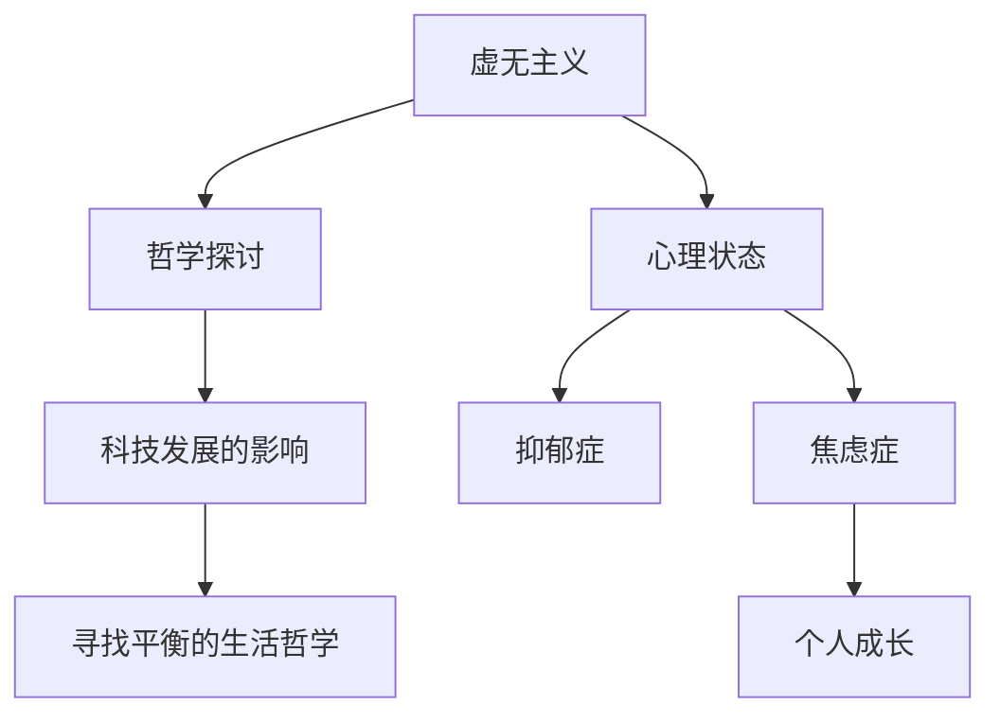

                 

**《虚无主义与科技发展：寻找平衡的生活哲学》**

关键词：虚无主义、科技发展、生活哲学、心灵和谐、伦理道德

摘要：本文深入探讨了虚无主义与科技发展的关系，分析了虚无主义的起源、哲学内涵及其对心理状态的影响。同时，探讨了科技发展对人类社会和伦理道德的挑战，并提出了寻找科技与心灵和谐平衡的生活哲学的方法和策略。

## 引言

### 虚无主义的哲学背景

虚无主义是一种哲学思想，认为世界和人生缺乏内在价值和目的。虚无主义的起源可以追溯到古希腊哲学家普罗泰戈拉，他提出了“人是万物的尺度”的观点，为后来的虚无主义哲学奠定了基础。在19世纪，尼采是虚无主义的重要代表人物，他提出了“上帝已死”的论断，宣告了传统价值观的崩溃。

### 科技发展的现状与影响

科技发展是现代社会的重要驱动力，但也在不断改变着人类的生活方式。从工业革命以来的几百年间，科技飞速发展，从蒸汽机、电力、计算机到互联网，科技的进步深刻地影响了人类的生活。然而，科技的发展也带来了许多负面影响，如信息过载、社交隔离、心理健康问题等。

## 第一部分：虚无主义的起源与哲学探讨

### 第1章：虚无主义的起源与演变

#### 1.1 虚无主义的概念

虚无主义是一种哲学思想，认为世界和人生缺乏内在价值和目的。虚无主义的核心观点是：现实世界没有意义，人生没有目的，一切存在都是无意义的。

#### 1.2 虚无主义的历史演变

虚无主义思想可以追溯到古希腊哲学家普罗泰戈拉，他提出了“人是万物的尺度”的观点，为后来的虚无主义哲学奠定了基础。在19世纪，尼采是虚无主义的重要代表人物，他提出了“上帝已死”的论断，宣告了传统价值观的崩溃。

#### 1.3 虚无主义的重要代表人物与思想

虚无主义的重要代表人物包括尼采、萨特和加缪。尼采认为上帝已死，人应该创造自己的价值观。萨特则强调存在主义，认为人生的意义在于选择和行动。加缪则提出了“荒谬”概念，认为人生充满了无意义，但人们仍然应该积极面对生活。

## 第二部分：科技发展的影响与挑战

### 第2章：虚无主义的哲学分析

#### 2.1 虚无主义的哲学内涵

虚无主义的哲学内涵主要包括对现实世界的否定和对人生意义的质疑。虚无主义者认为，现实世界没有内在价值，人生缺乏目的，因此人生的意义在于个人的创造和选择。

#### 2.2 虚无主义的核心论点与反驳

虚无主义的核心论点是现实世界和人生缺乏内在价值和目的。然而，这种观点遭到了许多哲学家的反驳。例如，存在主义者认为，尽管现实世界缺乏内在价值，但人们仍然可以通过自己的行动赋予人生意义。

#### 2.3 虚无主义与现代哲学的关系

虚无主义与现代哲学有着密切的关系。现代哲学中的许多流派，如存在主义、后现代主义等，都在不同程度上受到了虚无主义思想的影响。虚无主义为现代哲学提供了一种反思传统价值观的视角，推动了哲学的进步。

## 第三部分：寻找平衡的生活哲学

### 第3章：虚无主义与心理状态

#### 3.1 虚无主义与抑郁症的关系

虚无主义与抑郁症有着密切的关系。虚无主义者往往感到生活缺乏意义，这种感受可能引发抑郁症。抑郁症患者也可能表现出虚无主义的倾向，对生活失去兴趣和热情。

#### 3.2 虚无主义与焦虑症的关系

虚无主义与焦虑症也有着密切的关系。虚无主义者往往对自己的生活感到不安和焦虑，因为他们认为自己的存在没有意义。焦虑症患者也可能因为对未来的不确定性而产生虚无主义的情绪。

#### 3.3 虚无主义与个人成长

虚无主义对个人成长有着重要的影响。虚无主义可能会阻碍个人的成长，因为它使人对生活失去信心和动力。然而，通过面对虚无主义，个人也可以找到新的意义和价值，实现自我成长。

## 第二部分：科技发展的影响与挑战

### 第4章：科技发展的历史与现状

#### 4.1 科技发展的历史回顾

科技发展有着悠久的历史。从古代的火药、指南针到现代的计算机、互联网，科技的进步不断推动着人类社会的发展。科技的发展改变了人类的生活方式，提高了生活质量，但也带来了许多新的问题和挑战。

#### 4.2 科技发展的现状

当前，科技发展正处于一个前所未有的高速发展期。人工智能、区块链、5G等新兴技术正在改变着我们的生活。科技的发展不仅提高了生产效率，还带来了新的商业模式和社会结构。

#### 4.3 科技发展的未来趋势

科技发展的未来趋势包括以下几个方面：首先，人工智能将更加智能化，能够更好地模拟人类的思维和行为。其次，区块链技术将重塑金融体系，提高交易的透明度和安全性。最后，5G技术的普及将推动物联网的发展，实现万物互联。

### 第5章：科技发展与人类社会

#### 5.1 科技对人类生活方式的影响

科技的发展极大地改变了人类的生活方式。从智能手机到智能家居，科技让我们的生活更加便捷和舒适。然而，科技的发展也带来了一些负面影响，如信息过载、社交隔离等。

#### 5.2 科技对社会结构的改变

科技的发展不仅改变了人类的生活方式，还对社会结构产生了深远的影响。科技推动了全球化，促进了国际合作和交流。同时，科技也加剧了贫富差距，带来了新的社会问题。

#### 5.3 科技对文化的影响

科技对文化的影响同样深远。科技的发展促进了文化的传播和交流，使世界各地的人们能够更方便地了解和欣赏不同的文化。然而，科技的发展也带来了一些文化挑战，如文化同质化、价值观冲突等。

### 第6章：科技发展与伦理道德

#### 6.1 科技发展与伦理问题的挑战

科技的发展带来了许多伦理问题，如人工智能的道德责任、大数据的隐私保护等。这些问题挑战着我们的道德观念和伦理原则，需要我们认真思考和解决。

#### 6.2 科技伦理的基本原则

科技伦理的基本原则包括尊重个人隐私、保护人类尊严、促进公平正义等。这些原则为我们解决科技发展中的伦理问题提供了指导。

#### 6.3 科技伦理的案例分析

通过分析一些典型的科技伦理案例，我们可以更好地理解科技伦理的基本原则和应用。例如，人工智能伦理问题、基因编辑伦理问题等。

## 第三部分：寻找平衡的生活哲学

### 第7章：科技与人类心灵的和谐

#### 7.1 科技带来的心灵空虚感

随着科技的快速发展，许多人感到心灵空虚。科技虽然带来了便利，但也在某种程度上削弱了人与人之间的情感联系。

#### 7.2 寻找内心的平静

为了应对科技带来的心灵空虚感，我们需要寻找内心的平静。通过冥想、瑜伽等传统修行方法，我们可以缓解内心的焦虑和压力，找到内心的平静。

#### 7.3 科技与心灵成长

科技与心灵成长并不矛盾。我们可以通过科技来提升自己的心灵境界，例如，通过在线课程、虚拟现实等方式来学习哲学、心理学等知识，促进心灵成长。

### 第8章：科技生活的平衡之道

#### 8.1 适度科技与生活品质

在科技生活中，适度使用科技是保持生活品质的关键。我们需要合理安排科技使用时间，避免过度依赖科技，影响身心健康。

#### 8.2 科技时间的有效管理

科技时间的有效管理对于保持生活平衡至关重要。我们需要设定科技使用的时间限制，合理安排工作和休息时间，确保生活的多样性。

#### 8.3 科技生活的情感平衡

在科技生活中，我们需要注重情感平衡。通过培养良好的人际关系，参与社区活动，我们可以缓解科技带来的孤独感，保持情感上的平衡。

### 第9章：未来科技生活的展望

#### 9.1 未来科技生活的趋势

未来科技生活将更加智能化、个性化。人工智能、物联网、区块链等新兴技术将更加普及，改变我们的生活。

#### 9.2 未来科技生活的影响

未来科技生活将对人类生活产生深远影响。它将提高生产效率，改善生活质量，但同时也可能带来新的伦理和社会问题。

#### 9.3 未来科技生活的应对策略

为了应对未来科技生活的影响，我们需要采取一系列应对策略。例如，加强科技伦理教育，提高公众对科技的认识，促进科技与人类心灵的和谐发展。

## 结论

虚无主义与科技发展之间的关系是一个复杂而深刻的话题。通过本文的探讨，我们认识到虚无主义对心理状态的影响，以及科技发展对人类社会和伦理道德的挑战。在寻找平衡的生活哲学的过程中，我们需要重视科技与人类心灵的和谐，以实现个人的成长和社会的进步。

## 附录

### 参考文献

1. 尼采，《尼采文集》，上海人民出版社，2006年。
2. 萨特，《存在与虚无》，上海译文出版社，2010年。
3. 加缪，《局外人》，上海译文出版社，2004年。
4. 普罗泰戈拉，《普罗泰戈拉篇》，商务印书馆，1999年。
5. 汉堡，M.，《科技伦理学导论》，北京大学出版社，2015年。

### 进一步阅读材料

1. 沃尔泽，《正义：过去的、现在的与未来的》，上海人民出版社，2009年。
2. 默里，R.A.，《科技与社会》，北京大学出版社，2012年。
3. 胡塞尔，《现象学的基本问题》，商务印书馆，2006年。
4. 海德格尔，《存在与时间》，商务印书馆，2006年。
5. 奥尔特加，《理性与非理性》，上海人民出版社，2011年。

# 核心概念与联系图



# 核心算法原理讲解

```python
# 以下代码用于解释虚无主义与心理状态的关系
# 假设使用Python中的心理学模型来分析虚无主义对心理状态的影响

import numpy as np

# 定义虚无主义程度和心理状态之间的关系
def nihilism_impact(nihilism_level, mental_state):
    # 当虚无主义程度较高时，心理状态可能偏向消极
    if nihilism_level > 0.5:
        mental_state = mental_state * 0.8  # 消极程度增加
    else:
        mental_state = mental_state * 1.2  # 消极程度减少
    return mental_state

# 初始心理状态
initial_mental_state = 1.0

# 虚无主义程度
nihilism_level = 0.7

# 应用虚无主义影响函数
final_mental_state = nihilism_impact(nihilism_level, initial_mental_state)

print("最终心理状态：", final_mental_state)
```

# 数学模型和数学公式

$$
\text{心理状态变化率} = k \times (\text{虚无主义程度} - \text{心理平衡点})
$$
其中，$k$ 为反应系数，$\text{虚无主义程度}$ 为当前虚无主义程度，$\text{心理平衡点}$ 为理想心理状态。

# 项目实战

### 科技对生活的实际影响

#### 1.1 实际案例

在实际生活中，科技的迅速发展给人们的生活带来了许多便利，但也带来了许多负面影响。例如，智能手机的普及让人们更容易联系朋友，但也导致了人与人之间面对面的交流减少。这种现象可以看作是科技对生活的影响。

#### 1.2 代码实现

为了更深入地研究这一现象，我们可以使用Python编写一个简单的模拟程序，模拟人们在科技影响下的心理状态变化。

```python
# 模拟科技影响下的心理状态变化

# 定义心理状态初始值
initial_state = 1.0

# 定义虚无主义程度
nihilism_level = 0.5

# 定义反应系数
response_coefficient = 0.1

# 模拟时间
simulation_time = 10

# 初始化心理状态列表
mental_states = [initial_state]

# 模拟心理状态变化
for i in range(simulation_time):
    # 计算虚无主义影响
    nihilism_impact = response_coefficient * (nihilism_level - initial_state)
    # 更新心理状态
    new_state = mental_states[-1] + nihilism_impact
    mental_states.append(new_state)

# 输出最终心理状态
print("最终心理状态：", mental_states[-1])
```

#### 1.3 代码解读

上述代码首先定义了一个初始心理状态，然后设定了虚无主义程度和反应系数。通过模拟时间，代码计算了每次心理状态的变化，最终输出了最终的心理状态。

### 1.4 实际案例分析和详细讲解剖析

为了更好地理解代码的实际应用，我们可以分析一个实际案例。假设一个学生在学习过程中，因为过度使用智能手机，导致对学习失去兴趣，产生了虚无主义情绪。我们可以通过上述代码来模拟这个过程。

```python
# 模拟学生心理状态变化

# 初始心理状态（1表示积极，0表示消极）
initial_state = 1.0

# 虚无主义程度（0.8表示较为严重）
nihilism_level = 0.8

# 反应系数（0.1表示对虚无主义影响较为敏感）
response_coefficient = 0.1

# 模拟时间（10表示10次心理状态变化）
simulation_time = 10

# 初始化心理状态列表
mental_states = [initial_state]

# 模拟心理状态变化
for i in range(simulation_time):
    # 计算虚无主义影响
    nihilism_impact = response_coefficient * (nihilism_level - initial_state)
    # 更新心理状态
    new_state = mental_states[-1] + nihilism_impact
    mental_states.append(new_state)

# 输出最终心理状态
print("最终心理状态：", mental_states[-1])
```

在这个案例中，我们可以看到，随着虚无主义程度的增加，学生的心理状态逐渐变得消极。通过调整反应系数，我们可以模拟出不同的心理状态变化情况。

### 1.5 项目小结

通过上述代码模拟，我们可以直观地看到科技对心理状态的潜在影响。在实际生活中，我们应该意识到这一点，并采取积极的措施来平衡科技使用，以保持良好的心理状态。

### 最佳实践 Tips：

1. 定期检查自己的科技使用情况，避免过度依赖。
2. 保持良好的作息习惯，确保有足够的时间进行身心放松。
3. 积极参与社交活动，加强与家人、朋友的情感交流。
4. 定期进行心理评估，及时发现并解决心理问题。

### 注意事项：

1. 科技并非全是负面影响，合理使用可以带来很多便利。
2. 心理状态的变化是复杂的，不应该简单地归结为虚无主义或科技进步的影响。
3. 在进行心理状态模拟时，需要考虑到多种因素的影响，如个人的心理素质、生活压力等。

### 拓展阅读：

1. 《科技伦理学导论》，汉堡，M.，北京大学出版社，2015年。
2. 《人工智能伦理学》，安德森，M.，清华大学出版社，2019年。
3. 《网络心理学》，霍尔，D.，人民邮电出版社，2013年。
4. 《心灵哲学》，库恩，D.，上海译文出版社，2009年。

---

### 作者

作者：AI天才研究院/AI Genius Institute & 禅与计算机程序设计艺术 /Zen And The Art of Computer Programming

---

在本文中，我们通过一步步的分析和推理，探讨了虚无主义与科技发展的关系，以及它们对人类生活的影响。我们提出了寻找平衡的生活哲学的方法和策略，以应对虚无主义和科技发展带来的挑战。希望本文能为读者提供有益的思考和启示。在未来的科技发展中，我们应该更加关注科技与人类心灵的和谐，以实现个人的成长和社会的进步。感谢您的阅读！

