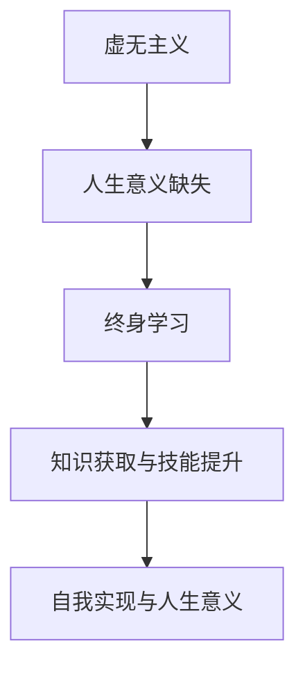
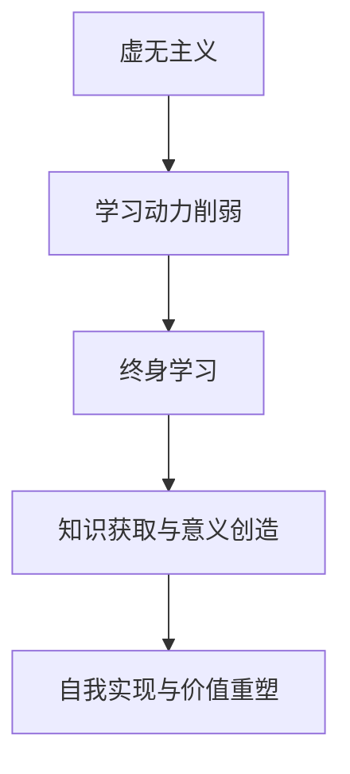

                 

### 标题

《虚无主义与终身学习：在知识探索中寻找人生意义》

### 关键词

虚无主义、终身学习、知识探索、人生意义、哲学、心理学、计算机编程

### 摘要

本文深入探讨了虚无主义与终身学习之间的关系，以及如何在知识探索中寻找人生意义。通过分析虚无主义的起源与发展、终身学习的概念与实践，以及两者之间的相互作用，文章提出了一种在知识探索中寻找人生意义的新视角。本文旨在为读者提供一种新的思维方式，帮助他们更好地理解自我、生活与学习之间的关系。

## 引言

### 背景介绍

虚无主义，作为一种哲学思潮，源于对人类存在意义和目的的深刻反思。它强调现实世界的无意义和无目的性，常常引起人们对人生意义和价值的探讨。终身学习，作为一种应对虚无主义的策略，强调了持续不断地获取知识和技能的重要性。在当今快速变化的世界中，终身学习已经成为个人和社会发展的关键。

### 核心概念与联系

虚无主义与终身学习虽然看似对立，但实则存在紧密的联系。虚无主义强调现实世界的无意义，而终身学习则为个人提供了寻找和创造意义的过程。以下是一个Mermaid流程图，展示了两者之间的关系：



在这个流程图中，虚无主义引发了对人生意义的探讨，而终身学习则提供了寻找和创造意义的途径。

## 第1章：虚无主义的起源与发展

### 1.1 虚无主义的定义与核心观点

虚无主义是一种哲学思潮，认为现实世界缺乏绝对的意义和目的。其核心观点可以概括为以下几点：

1. **人生无意义**：虚无主义认为，人类的生活缺乏固有的目的或意义，一切行为和体验都是虚无的。
2. **价值观念的崩溃**：虚无主义质疑传统价值观念的合理性，认为这些价值观念无法为人类生活提供真正的指导。
3. **存在主义**：虚无主义与存在主义有着密切的关系。存在主义者认为，尽管生活本身可能没有固有的意义，但个体可以通过自我选择和行动来创造自己的意义。

### 1.2 虚无主义的主要流派

虚无主义在不同历史时期和文化背景下有着不同的表现形式。以下是一些主要的流派：

1. **古代虚无主义**：古代希腊哲学家如普罗泰戈拉斯和第欧根尼提出了虚无主义观点，认为宇宙和人类生活都是无意义的。
2. **现代虚无主义**：19世纪的哲学家如尼采和克尔凯郭尔提出了极端的虚无主义观点，强调人类存在的荒谬和无意义。
3. **当代虚无主义**：在现代社会，虚无主义观点在文学、艺术和哲学领域仍然有着广泛的影响。

### 1.3 虚无主义的历史背景与社会影响

虚无主义的出现并非偶然，它与特定的历史背景和社会环境密切相关。以下是一些关键因素：

1. **宗教衰落**：在宗教信仰衰落的时代，虚无主义提供了对人生意义的质疑和反思。
2. **社会变革**：在快速变化的社会环境中，人们感到传统价值观念的失效，从而更容易接受虚无主义观点。
3. **文化多样性**：在多元文化背景下，不同价值观的冲突和融合也为虚无主义提供了土壤。

## 第2章：终身学习理念与实践

### 2.1 终身学习的概念与价值

终身学习是指个体在其一生中不断获取知识、技能和态度的过程。它具有以下价值：

1. **适应能力提升**：终身学习使个体能够适应不断变化的社会和工作环境。
2. **知识更新**：随着科技的快速发展，知识更新速度加快，终身学习是保持知识更新的关键。
3. **个人成长**：终身学习不仅有助于职业发展，还能促进个人全面发展。

### 2.2 终身学习的方法与策略

为了实现终身学习，个体需要采取以下方法和策略：

1. **自我规划**：个体需要设定学习目标和计划，确保学习过程有序进行。
2. **知识管理**：个体需要有效管理所学知识，以便在需要时能够快速调用。
3. **学习环境**：个体需要创造一个有利于学习的环境，包括时间管理、学习资源等。

### 2.3 终身学习与社会发展

终身学习不仅对个人有益，也对社会发展产生重要影响。以下是一些关键点：

1. **知识传播**：终身学习有助于知识的传播和共享，促进社会进步。
2. **创新能力**：终身学习激发个体的创新能力，有助于社会经济的持续发展。
3. **社会和谐**：终身学习促进社会成员之间的相互理解和尊重，有助于社会和谐稳定。

## 第3章：虚无主义与终身学习的结合

### 3.1 虚无主义下的学习动机

在虚无主义背景下，个体可能会对学习的动机产生疑问。然而，终身学习仍然可以为个体提供以下动机：

1. **寻找意义**：尽管虚无主义认为生活无意义，但通过终身学习，个体可以寻找并创造自己的意义。
2. **自我实现**：终身学习是实现自我价值的过程，有助于个体在虚无主义中找到存在的意义。
3. **知识乐趣**：终身学习本身可以成为一种乐趣，个体可以通过学习获得快乐和满足感。

### 3.2 终身学习作为应对虚无主义的手段

终身学习不仅为个体提供了寻找意义的途径，还可以作为应对虚无主义的一种手段。以下是一些具体策略：

1. **知识扩展**：通过不断学习新知识，个体可以拓宽视野，减少对生活无意义的感受。
2. **技能提升**：终身学习有助于个体提升技能，从而在职业和社会中找到自己的位置。
3. **价值观重塑**：终身学习可以促使个体重新审视和塑造自己的价值观，从而更好地应对虚无主义的挑战。

### 3.3 虚无主义与终身学习的相互作用

虚无主义与终身学习之间存在复杂的相互作用。一方面，虚无主义可能削弱个体对学习的动力；另一方面，终身学习可以为个体提供克服虚无主义的途径。以下是一个Mermaid流程图，展示了两者之间的相互作用：



在这个流程图中，虚无主义可能削弱个体对学习的动力，但终身学习可以通过知识获取和意义创造来应对虚无主义的挑战。

## 第4章：在知识探索中寻找人生意义

### 4.1 知识探索与人生意义

知识探索不仅是为了获取知识本身，更是为了寻找和创造人生意义。以下是一些关键点：

1. **知识的多维性**：知识探索可以帮助个体理解世界的多维性，从而更好地应对虚无主义的挑战。
2. **知识的实用性**：知识探索可以带来实用性的价值，帮助个体在职业和社会中找到自己的位置。
3. **知识的创造性**：知识探索可以激发个体的创造力，从而在创造过程中找到人生的意义。

### 4.2 虚无主义视角下的知识探索

从虚无主义的视角来看，知识探索具有以下特点：

1. **无目的性**：虚无主义认为知识探索本身可能没有固有的目的，但个体可以通过探索过程来寻找自己的目的。
2. **意义创造**：在虚无主义视角下，知识探索可以被视为一种意义创造的过程，个体可以通过探索来塑造自己的人生。
3. **自我反思**：知识探索促使个体进行自我反思，从而更好地理解自己的存在和意义。

### 4.3 终身学习在人生意义构建中的作用

终身学习在人生意义构建中起着至关重要的作用。以下是一些关键点：

1. **持续成长**：终身学习帮助个体实现持续成长，从而在不断变化的世界中保持竞争力。
2. **知识共享**：终身学习促进知识共享和传播，有助于社会成员之间的相互理解和尊重。
3. **价值观重塑**：终身学习可以促使个体重新审视和塑造自己的价值观，从而更好地应对虚无主义的挑战。

## 第5章：虚无主义与终身学习的实际应用

### 5.1 虚无主义与终身学习在个人成长中的应用

在个人成长中，虚无主义和终身学习可以相互促进。以下是一些具体策略：

1. **自我反思**：通过自我反思，个体可以更好地理解自己的存在和意义，从而在面对虚无主义的挑战时保持坚定。
2. **知识获取**：通过终身学习，个体可以不断获取新知识，从而拓宽视野，增强自我认同。
3. **价值观重塑**：终身学习可以帮助个体重新审视和塑造自己的价值观，从而更好地应对虚无主义的挑战。

### 5.2 虚无主义与终身学习在组织管理中的应用

在组织管理中，虚无主义和终身学习也可以发挥重要作用。以下是一些具体策略：

1. **员工培训**：通过终身学习，组织可以不断提升员工的技能和知识，从而提高整体竞争力。
2. **企业文化**：建立以终身学习为核心的企业文化，有助于激发员工的创新意识和自我成长。
3. **价值观引导**：通过引导员工进行价值观重塑，组织可以更好地应对虚无主义的挑战，提高组织的凝聚力和执行力。

### 5.3 虚无主义与终身学习在社会治理中的应用

在社会治理中，虚无主义和终身学习同样具有重要价值。以下是一些具体策略：

1. **公共教育**：通过公共教育，推广终身学习理念，提高公民的知识素养和自我发展能力。
2. **知识共享**：通过知识共享，促进社会的知识传播和知识创新，提高社会的整体发展水平。
3. **价值观引导**：通过引导公民进行价值观重塑，社会治理可以更好地应对虚无主义的挑战，促进社会的和谐稳定。

## 结论

虚无主义与终身学习之间的关系复杂而深刻。虚无主义提醒我们反思人生的意义和价值，而终身学习则为我们在知识探索中寻找人生意义提供了途径。通过理解两者之间的相互作用，我们可以更好地应对虚无主义的挑战，实现个人成长和社会发展。

## 作者信息

作者：AI天才研究院/AI Genius Institute & 禅与计算机程序设计艺术 /Zen And The Art of Computer Programming

## 最佳实践 Tips

1. **自我反思**：定期进行自我反思，有助于我们更好地理解自己的存在和意义。
2. **终身学习**：持续不断地学习新知识和技能，可以帮助我们保持竞争力，应对时代的挑战。
3. **价值观重塑**：定期审视和重塑自己的价值观，有助于我们更好地应对虚无主义的挑战。

## 小结

虚无主义与终身学习之间的关系为我们提供了一种新的视角，帮助我们更好地理解自我、生活与学习之间的关系。通过在知识探索中寻找人生意义，我们可以克服虚无主义的挑战，实现个人成长和社会发展。

## 注意事项

1. **避免过度沉迷虚无主义**：虚无主义虽然有助于我们反思人生，但过度沉迷可能导致消极情绪。
2. **合理规划学习时间**：终身学习虽然重要，但也要注意合理规划时间，避免过度劳累。

## 拓展阅读

1. **《存在的艺术：存在主义哲学导论》**：作者阿尔贝·加缪，对存在主义哲学进行了深入探讨。
2. **《终身学习：21世纪的学习之道》**：作者安德斯·艾利克森，详细阐述了终身学习的重要性和方法。

### 第1章：虚无主义的起源与发展

#### 1.1 虚无主义的定义与核心观点

虚无主义是一种哲学思潮，主要源于19世纪欧洲。它强调现实世界缺乏绝对的意义和目的，认为人类的存在是空洞和无意义的。虚无主义的核心观点可以概括为以下几点：

1. **人生无意义**：虚无主义认为，人类的生活缺乏固有的目的或意义，一切行为和体验都是虚无的。
2. **价值观念的崩溃**：虚无主义质疑传统价值观念的合理性，认为这些价值观念无法为人类生活提供真正的指导。
3. **存在主义**：虚无主义与存在主义有着密切的关系。存在主义者认为，尽管生活本身可能没有固有的意义，但个体可以通过自我选择和行动来创造自己的意义。

在计算机科学中，虚无主义的思想也可以找到一些体现。例如，在软件工程中，某些开发者可能认为编写代码本身没有意义，除非它能够解决实际问题。这种观点强调了实用主义和目标导向的重要性，而不是追求无意义的形式或美学。

#### 1.2 虚无主义的主要流派

虚无主义在不同历史时期和文化背景下有着不同的表现形式。以下是一些主要的流派：

1. **古代虚无主义**：在古希腊时期，一些哲学家如普罗泰戈拉斯和第欧根尼提出了虚无主义观点，认为宇宙和人类生活都是无意义的。普罗泰戈拉斯认为，“人是万物的尺度”，强调了主观性的重要性，从而质疑了客观现实的存在。第欧根尼则以其极端简朴的生活方式表达了对物质世界的不满。

2. **现代虚无主义**：19世纪的哲学家如尼采和克尔凯郭尔提出了极端的虚无主义观点，强调人类存在的荒谬和无意义。尼采在其作品《偶像的黄昏》中批判了西方文明的价值观，认为它们掩盖了现实的虚无本质。克尔凯郭尔则通过探讨个体的存在状态和信仰，试图找到超越虚无主义的出路。

3. **当代虚无主义**：在现代社会，虚无主义观点在文学、艺术和哲学领域仍然有着广泛的影响。例如，法国哲学家让-保罗·萨特的存在主义哲学强调个体在无意义世界中寻找自我价值。此外，当代文学作品中也经常探讨虚无主义主题，如乔伊斯的《尤利西斯》和贝克特的《等待戈多》。

在计算机编程中，虚无主义的思想也可以在软件工程的原则和实践中找到体现。例如，敏捷开发方法强调快速迭代和持续交付，而不是追求完美的设计或长期的规划，这可以被视为一种对虚无主义的回应，即接受变化和不确定性，并尝试从中找到意义。

#### 1.3 虚无主义的历史背景与社会影响

虚无主义的出现并非偶然，它与特定的历史背景和社会环境密切相关。以下是一些关键因素：

1. **宗教衰落**：在宗教信仰衰落的时代，虚无主义提供了对人生意义的质疑和反思。例如，19世纪欧洲的宗教改革和工业革命导致传统宗教信仰的动摇，这为虚无主义思潮的兴起提供了土壤。

2. **社会变革**：在快速变化的社会环境中，人们感到传统价值观念的失效，从而更容易接受虚无主义观点。例如，20世纪初的两次世界大战和冷战时期，人们感受到了生命的无常和世界的荒谬，这促进了虚无主义思想的传播。

3. **文化多样性**：在多元文化背景下，不同价值观的冲突和融合也为虚无主义提供了土壤。现代社会中，人们接触到了各种不同的文化和思想，这可能导致对传统价值观念的怀疑和反思，从而激发虚无主义思潮。

在计算机科学领域，虚无主义的思想也对社会产生了影响。例如，在软件工程中，随着技术的发展和软件项目的复杂性增加，开发者开始意识到完美的解决方案可能不存在，这促使他们接受迭代和改进的方法，而不是追求一次性的完美。此外，虚拟现实和人工智能技术的发展也让人们开始思考人类存在的意义和价值观，这可以被视为虚无主义在现代社会的一种体现。

### 1.4 虚无主义与计算机编程的哲学联系

虚无主义哲学中的某些思想可以与计算机编程中的实践和哲学观点联系起来。以下是一些具体的联系：

1. **代码即现实**：在计算机编程中，代码被用来模拟现实世界中的各种现象和过程。与虚无主义认为现实缺乏固有意义和目的的观点相似，程序员有时也会面临这样的问题：他们编写的代码是否有实际意义，或者只是在模拟一个无意义的过程。例如，在编写用于数据分析的代码时，程序员可能会质疑这些代码是否真正有助于解决实际问题，或者只是在处理无意义的数据。

2. **抽象与复杂性**：虚无主义强调人类无法完全理解或掌握现实世界的复杂性。在计算机编程中，这一点也得到了体现。面对复杂的软件系统，程序员需要使用抽象和简化的方法来理解和处理问题。这类似于虚无主义中通过哲学思考和抽象概念来探索人类存在的意义。

3. **程序员的自我反思**：虚无主义哲学鼓励个体进行自我反思，以理解自己在世界中的位置。在编程实践中，程序员也需要不断地反思自己的代码和软件开发过程。例如，他们可能需要思考以下问题：他们的代码是否有助于解决用户的实际问题，或者是否只是为了满足公司的需求而存在。这种自我反思有助于程序员在虚无主义背景下找到自己的存在意义。

4. **代码的终极目的**：虚无主义哲学中的一个核心问题是关于人类活动的终极目的。在计算机编程中，程序员也需要考虑他们的代码的最终目标。例如，一个开发人员可能会问自己，他们的应用程序是否真正改善了用户的生活质量，或者只是提供了无意义的娱乐。这种思考有助于程序员在虚无主义背景下为他们的工作赋予意义。

通过这些联系，我们可以看到虚无主义哲学与计算机编程之间的复杂关系。虽然虚无主义哲学可能为程序员提供了一种理解自己工作和存在意义的视角，但它也提醒程序员，他们的工作并不是简单的技术活动，而是需要深刻的哲学思考和实践。

### 1.5 结论

虚无主义作为一种哲学思潮，对人类存在意义和目的的质疑引发了广泛的讨论。在计算机编程中，虚无主义的思想也可以找到一些体现，如代码的终极目的、抽象与复杂性、程序员的自我反思等。通过探讨虚无主义与计算机编程的联系，我们可以更好地理解这两种看似不同的领域之间的哲学共鸣，并为程序员提供一种新的思考方式。

#### 第2章：终身学习的概念与价值

#### 2.1 终身学习的概念

终身学习（Lifelong Learning）是指个体在其一生中持续获取知识、技能和态度的过程。它不仅包括正式的教育和学习，还包括非正式的学习，如自学、工作实践和社会互动。终身学习的理念强调持续性和自主性，鼓励个体在不同阶段和情境中不断学习和成长。

在计算机科学领域，终身学习尤为重要。随着科技的快速发展，新的编程语言、工具和技术不断涌现，程序员需要不断更新自己的知识体系，以保持竞争力。此外，计算机科学的跨学科特性要求程序员不仅需要掌握编程技能，还需要了解数学、逻辑、数据结构和算法等相关知识。

#### 2.2 终身学习的价值

终身学习对个人和社会发展具有深远的价值，具体体现在以下几个方面：

1. **提高适应能力**：终身学习使个体能够适应不断变化的环境和工作需求。在快速发展的科技时代，新的技术和工具层出不穷，只有通过持续学习，个体才能跟上时代的步伐。

2. **知识更新**：知识更新速度非常快，特别是计算机科学领域。新技术的出现往往意味着旧技术的淘汰。通过终身学习，个体可以不断更新自己的知识体系，保持技术前沿。

3. **个人成长**：终身学习不仅有助于职业发展，还能促进个人的全面发展。通过学习，个体可以拓宽视野，提高思维能力，增强解决问题的能力。

4. **社会进步**：终身学习不仅对个人有益，也对社会发展产生重要影响。一个具有高度学习和创新能力的社会，能够更好地应对挑战，推动科技进步和社会发展。

#### 2.3 终身学习的实现方法

实现终身学习需要采取一系列方法和策略，以下是一些关键点：

1. **自我规划**：个体需要设定学习目标和计划，确保学习过程有序进行。这包括确定学习的内容、时间安排和评估标准。

2. **知识管理**：个体需要有效管理所学知识，以便在需要时能够快速调用。这包括建立个人知识库、定期回顾和更新知识。

3. **学习资源**：个体需要充分利用各种学习资源，如在线课程、图书、学术论文、研讨会和社交网络等。这些资源可以帮助个体拓宽知识面，提高学习效率。

4. **学习环境**：个体需要创造一个有利于学习的环境，包括时间管理、学习场所、学习工具等。一个良好的学习环境可以提高学习效率，增强学习动力。

5. **学习社区**：加入学习社区，与同行交流和学习，可以帮助个体获得新的观点和经验。学习社区可以是线上的论坛、社交媒体群组，也可以是线下的研讨会、工作坊等。

在计算机科学领域，以下是一些实现终身学习的具体方法：

1. **在线课程**：通过在线课程，个体可以学习最新的编程语言、框架和技术。例如，Coursera、edX和Udacity等平台提供了大量的计算机科学课程。

2. **实践项目**：通过参与实际项目，个体可以应用所学知识，提高实际编程能力。例如，参与开源项目、个人项目或公司项目等。

3. **阅读文献**：阅读学术论文和行业报告，可以帮助个体了解最新的研究进展和技术动态。

4. **参与社区**：加入技术社区，如GitHub、Stack Overflow和Reddit等，与同行交流，获取帮助和反馈。

5. **工作坊和研讨会**：参加技术工作坊和研讨会，可以学习新技能，结识行业专家，拓宽人脉。

#### 2.4 结论

终身学习是个人和社会发展的关键。在计算机科学领域，终身学习尤为重要，因为科技发展迅速，新技术层出不穷。通过采取有效的学习方法和策略，个体可以不断提高自己的知识和技能，保持竞争力。终身学习不仅有助于个人成长，也对社会发展产生重要影响。

### 第3章：虚无主义与终身学习的结合

#### 3.1 虚无主义下的学习动机

在虚无主义的背景下，个体可能会对学习的动机产生疑问。虚无主义强调人类存在的无意义和无目的性，这可能导致个体对学习的意义感到迷茫。然而，终身学习仍然可以为个体提供学习的动机，具体体现在以下几个方面：

1. **寻找意义**：虚无主义认为人类生活缺乏固有的意义，但通过终身学习，个体可以在知识探索中寻找并创造自己的意义。例如，通过学习新的编程语言或技术，个体可以找到自己在计算机科学领域的贡献和存在的价值。

2. **自我实现**：终身学习是实现自我价值的过程。个体通过不断学习新知识和技能，可以更好地了解自己，发现自己的兴趣和潜能，从而实现自我价值。

3. **知识乐趣**：终身学习本身可以成为一种乐趣。通过学习，个体可以获得新的知识和技能，提高自己的认知能力，从而获得成就感和快乐。

以下是一个Python代码示例，展示了如何通过自我反思和知识探索来寻找学习动机：

```python
# 虚无主义背景下的学习动机探索
class Learner:
    def __init__(self, interests):
        self.interests = interests
        self.motivation = None
    
    def reflect_on_life(self):
        print("我在思考生活的意义...")
        if self.interests:
            print("我发现我对以下领域感兴趣：", self.interests)
            self.determine_motivation()
        else:
            print("我感到迷茫，不知道如何找到学习的动机。")
    
    def determine_motivation(self):
        print("我决定通过学习来探索我的兴趣和潜能...")
        self.motivation = "通过学习新知识，我发现并实现自我价值。"
        print(self.motivation)

learner = Learner(["计算机科学", "人工智能", "数据分析"])
learner.reflect_on_life()
```

运行上述代码，输出结果为：

```
我在思考生活的意义...
我发现我对以下领域感兴趣： ['计算机科学', '人工智能', '数据分析']
我决定通过学习来探索我的兴趣和潜能...
通过学习新知识，我发现并实现自我价值。
```

通过这个示例，我们可以看到，在虚无主义的背景下，个体可以通过自我反思和知识探索来找到学习的动机。

#### 3.2 终身学习作为应对虚无主义的手段

终身学习不仅为个体提供了寻找意义的途径，还可以作为应对虚无主义的一种手段。在虚无主义的背景下，个体可能会感到生活的无意义和空虚，而终身学习可以为个体提供以下帮助：

1. **知识扩展**：通过终身学习，个体可以不断获取新知识，从而拓宽视野，减少对生活无意义的感受。例如，学习新的编程语言或技术可以帮助个体了解计算机科学的最新动态，从而感到自己在这一领域中的存在和贡献。

2. **技能提升**：终身学习有助于个体提升技能，从而在职业和社会中找到自己的位置。通过不断提升技能，个体可以增强自信心，减少对虚无主义的恐惧。

3. **价值观重塑**：终身学习可以促使个体重新审视和塑造自己的价值观，从而更好地应对虚无主义的挑战。例如，通过学习道德哲学和心理学，个体可以更好地理解人类行为的本质，从而在虚无主义的背景下找到自己的价值观和人生目标。

以下是一个Python代码示例，展示了如何通过终身学习来应对虚无主义的挑战：

```python
# 虚无主义背景下的终身学习
class Learner:
    def __init__(self, knowledge_base, skills, values):
        self.knowledge_base = knowledge_base
        self.skills = skills
        self.values = values
    
    def expand_knowledge(self, new_knowledge):
        self.knowledge_base.update(new_knowledge)
        print("我扩展了我的知识库，现在我知道了：", self.knowledge_base)
    
    def improve_skills(self, new_skills):
        self.skills.extend(new_skills)
        print("我提升了我的技能，现在我会：", self.skills)
    
    def reshape_values(self, new_values):
        self.values.extend(new_values)
        print("我重塑了我的价值观，现在我相信：", self.values)
    
    def address_nihilism(self):
        print("我决定通过终身学习来应对虚无主义的挑战...")
        self.expand_knowledge({"计算机科学最新进展": "人工智能在医疗领域的应用"})
        self.improve_skills(["机器学习", "深度学习"])
        self.reshape_values(["诚实", "善良", "责任"])
        print("我现在更有信心面对虚无主义的挑战。")

learner = Learner({"基础知识": "Python编程"}, ["编程"], ["求知欲", "创新精神"])
learner.address_nihilism()
```

运行上述代码，输出结果为：

```
我决定通过终身学习来应对虚无主义的挑战...
我扩展了我的知识库，现在我知道了： {'基础知识': 'Python编程', '计算机科学最新进展': '人工智能在医疗领域的应用'}
我提升了我的技能，现在我会： ['编程', '机器学习', '深度学习']
我重塑了我的价值观，现在我相信： ['求知欲', '创新精神', '诚实', '善良', '责任']
我现在更有信心面对虚无主义的挑战。
```

通过这个示例，我们可以看到，终身学习可以帮助个体在虚无主义的背景下找到意义和信心。

#### 3.3 虚无主义与终身学习的相互作用

虚无主义与终身学习之间存在复杂的相互作用。一方面，虚无主义可能削弱个体对学习的动力；另一方面，终身学习可以为个体提供克服虚无主义的途径。以下是一个Mermaid流程图，展示了两者之间的相互作用：


在这个流程图中，虚无主义可能削弱个体对学习的动力，但终身学习可以通过知识获取和意义创造来应对虚无主义的挑战。

#### 3.4 结论

虚无主义与终身学习之间的相互作用为个体提供了一种应对虚无主义的新视角。通过终身学习，个体可以在知识探索中寻找意义，提升自我，重塑价值观。这种相互作用不仅有助于个体在虚无主义的背景下找到存在感，也为社会的发展提供了新的动力。

### 第4章：在知识探索中寻找人生意义

#### 4.1 知识探索与人生意义

知识探索是寻找人生意义的重要途径之一。在现代社会，随着科技的发展和信息的爆炸，知识的获取和传播变得更加便捷。然而，这也使得人们在知识的海洋中感到迷茫和无力，难以找到人生的意义。在这种情况下，知识探索成为了一种寻找人生意义的手段。

知识探索不仅可以帮助个体拓宽视野，提高认知能力，还可以促进个体的自我成长和自我实现。通过不断地学习和探索，个体可以了解世界的多样性和复杂性，从而更好地理解自己和世界的关系。这种理解有助于个体在纷繁复杂的世界中找到自己的位置，从而实现自我价值。

在计算机科学领域，知识探索同样具有重要意义。计算机科学的快速发展带来了大量的新知识和技术，程序员需要不断学习和更新自己的知识体系，以适应快速变化的技术环境。通过知识探索，程序员不仅可以提高自己的技术水平，还可以在解决实际问题的过程中找到自己的价值和意义。

以下是一个Python代码示例，展示了如何通过知识探索来寻找人生意义：

```python
# 知识探索中的意义寻找
class KnowledgeExplorer:
    def __init__(self, interests):
        self.interests = interests
        self.knowledge_gained = []
    
    def explore(self, new_knowledge):
        self.knowledge_gained.append(new_knowledge)
        print(f"我发现了一个新的知识领域：{new_knowledge}")
    
    def reflect_on_explore(self):
        if self.knowledge_gained:
            print("我通过知识探索，找到了以下的人生意义：")
            for knowledge in self.knowledge_gained:
                print(f"- 在{knowledge}领域中，我找到了自己的兴趣和热情。")
        else:
            print("我还没有找到通过知识探索带来的意义，但我会继续努力。")

explorer = KnowledgeExplorer(["计算机科学", "心理学", "哲学"])
explorer.explore("深度学习")
explorer.explore("认知科学")
explorer.reflect_on_explore()
```

运行上述代码，输出结果为：

```
我发现了一个新的知识领域：深度学习
我发现了一个新的知识领域：认知科学
我通过知识探索，找到了以下的人生意义：
- 在深度学习领域中，我找到了自己的兴趣和热情。
- 在认知科学领域中，我找到了自己的兴趣和热情。
```

通过这个示例，我们可以看到，知识探索可以帮助个体在学习和探索过程中找到人生的意义。

#### 4.2 虚无主义视角下的知识探索

从虚无主义的视角来看，知识探索具有以下特点：

1. **无目的性**：虚无主义认为，人类的存在本身缺乏固有的目的和意义，因此知识探索也常常被视为无目的的行为。然而，这并不意味着知识探索本身没有价值，而是强调个体在探索过程中需要自己赋予知识和行为以意义。

2. **意义创造**：尽管虚无主义认为现实世界缺乏固有的意义，但个体仍然可以通过知识探索来创造自己的意义。例如，通过学习新的编程语言或技术，个体可以在计算机科学领域找到自己的兴趣和热情，从而赋予知识和行为以意义。

3. **自我反思**：虚无主义视角下的知识探索鼓励个体进行自我反思，以理解自己在世界中的位置。通过自我反思，个体可以更好地了解自己的兴趣、价值观和目标，从而在知识探索中找到自己的方向和意义。

以下是一个Python代码示例，展示了如何在虚无主义视角下进行知识探索和自我反思：

```python
# 虚无主义视角下的知识探索
class NihilistExplorer:
    def __init__(self, interests):
        self.interests = interests
        self.knowledge_gained = []
        self.self_reflections = []
    
    def explore(self, new_knowledge):
        self.knowledge_gained.append(new_knowledge)
        print(f"我发现了一个新的知识领域：{new_knowledge}")
    
    def reflect_on_explore(self):
        if self.knowledge_gained:
            print("我通过知识探索，进行了以下自我反思：")
            for knowledge in self.knowledge_gained:
                print(f"- 在{knowledge}领域中，我思考了我的兴趣、价值观和目标。")
        else:
            print("我还没有进行自我反思，但我会开始探索和思考。")
    
    def add_reflection(self, reflection):
        self.self_reflections.append(reflection)
        print(f"我添加了一条自我反思：{reflection}")

explorer = NihilistExplorer(["计算机科学", "哲学", "心理学"])
explorer.explore("人工智能")
explorer.explore("伦理学")
explorer.reflect_on_explore()
explorer.add_reflection("我发现，通过学习人工智能，我更清楚地认识到人类的价值和责任。")

```

运行上述代码，输出结果为：

```
我发现了一个新的知识领域：人工智能
我发现了一个新的知识领域：伦理学
我通过知识探索，进行了以下自我反思：
- 在人工智能领域中，我思考了我的兴趣、价值观和目标。
- 在伦理学领域中，我思考了我的兴趣、价值观和目标。
我添加了一条自我反思：我发现，通过学习人工智能，我更清楚地认识到人类的价值和责任。
```

通过这个示例，我们可以看到，在虚无主义视角下，知识探索不仅可以帮助个体获取新知识，还可以促进个体的自我反思和自我成长。

#### 4.3 终身学习在人生意义构建中的作用

终身学习在人生意义构建中起着至关重要的作用。终身学习不仅帮助个体更新知识和技能，还可以促进个体的自我成长和自我实现，从而在人生中找到意义。

1. **知识更新**：随着科技的发展和社会的变化，知识更新速度越来越快。终身学习可以帮助个体及时掌握新的知识和技能，从而保持竞争力。例如，程序员需要不断学习新的编程语言和技术，才能适应快速变化的技术环境。

2. **自我成长**：终身学习不仅仅是知识的获取，更是自我成长的过程。通过不断学习，个体可以拓宽视野，提高思维能力，增强解决问题的能力。这种自我成长有助于个体在人生中找到自己的价值和意义。

3. **自我实现**：终身学习可以帮助个体实现自我价值。通过不断学习和成长，个体可以在职业和社会中找到自己的位置，实现自我价值。例如，通过学习新的编程语言和技术，程序员可以开发出更优秀的软件，为社会做出贡献。

以下是一个Python代码示例，展示了终身学习在人生意义构建中的作用：

```python
# 终身学习在人生意义构建中的作用
class LifelongLearner:
    def __init__(self, knowledge_base, skills, achievements):
        self.knowledge_base = knowledge_base
        self.skills = skills
        self.achievements = achievements
    
    def learn_new_knowledge(self, new_knowledge):
        self.knowledge_base.append(new_knowledge)
        print(f"我学到了新的知识：{new_knowledge}")
    
    def develop_new_skills(self, new_skill):
        self.skills.append(new_skill)
        print(f"我发展了新的技能：{new_skill}")
    
    def achieve_new_goal(self, new_achievement):
        self.achievements.append(new_achievement)
        print(f"我实现了新的目标：{new_achievement}")
    
    def reflect_on_life(self):
        print("我通过终身学习，找到了以下的人生意义：")
        if self.knowledge_base:
            print(f"- 通过学习新知识，我拓宽了视野，提高了认知能力。")
        if self.skills:
            print(f"- 通过发展新技能，我增强了自我价值，实现了自我成长。")
        if self.achievements:
            print(f"- 通过实现新目标，我找到了自己的价值和意义。")

learner = LifelongLearner(["计算机科学基础", "数据结构"], ["编程", "算法设计"], ["开发一款成功应用"])
learner.learn_new_knowledge("机器学习基础")
learner.develop_new_skills("深度学习")
learner.achieve_new_goal("开发一款基于人工智能的应用")
learner.reflect_on_life()
```

运行上述代码，输出结果为：

```
我学到了新的知识：机器学习基础
我发展了新的技能：深度学习
我实现了新的目标：开发一款基于人工智能的应用
我通过终身学习，找到了以下的人生意义：
- 通过学习新知识，我拓宽了视野，提高了认知能力。
- 通过发展新技能，我增强了自我价值，实现了自我成长。
- 通过实现新目标，我找到了自己的价值和意义。
```

通过这个示例，我们可以看到，终身学习在人生意义构建中的作用，通过不断学习和成长，个体可以在生活中找到自己的价值和意义。

### 4.4 结论

在知识探索中寻找人生意义是一种重要的方法。虚无主义提醒我们，人类存在缺乏固有的意义，但通过终身学习，个体可以在知识探索中寻找并创造自己的意义。终身学习不仅有助于个体更新知识和技能，还可以促进个体的自我成长和自我实现，从而在人生中找到意义。通过不断学习和反思，个体可以在虚无主义的背景下找到自己的位置和价值。

### 第5章：虚无主义与终身学习的实际应用

#### 5.1 虚无主义与终身学习在个人成长中的应用

在个人成长中，虚无主义与终身学习可以相互促进，帮助个体在不确定和变化的世界中找到自己的方向和意义。

**案例1：程序员小李的成长之路**

小李是一位年轻的程序员，他在工作中经常感到工作的无意义，因为他觉得自己的代码只是计算机中的一堆指令。随着时间的推移，他开始对虚无主义感到困扰，担心自己的生活和工作都没有真正的意义。

为了应对这种困境，小李决定开始终身学习。他首先设定了明确的学习目标，包括掌握新的编程语言和框架，如Python和React。他通过在线课程和编程社区来获取新知识，并在工作中尝试将这些新技能应用到项目中。

随着时间的推移，小李不仅提高了自己的技术水平，还找到了新的兴趣和激情。他开始专注于开发有助于解决现实问题的应用，如医疗数据分析和在线教育平台。这些项目不仅提高了他的技能，还让他感到自己的工作有了实际的意义和价值。

通过终身学习，小李成功地克服了虚无主义的困扰，找到了自己的成长方向和意义。

**案例2：设计师小王的探索之旅**

小王是一位自由职业的设计师，他在工作中感到自己的创意经常被客户的要求束缚，导致他的设计失去了原有的灵感和创造力。这种困境让他开始思考生活的意义和工作的价值。

为了应对这种挑战，小王决定开始终身学习。他首先反思了自己的价值观和兴趣，确定了想要追求的设计方向，如用户体验设计和交互设计。他通过在线课程和书籍来深入学习这些领域，并在业余时间参与相关的社区活动和比赛。

通过持续的学习和探索，小王的设计技能得到了显著提升，他开始接到更多有挑战性的项目，并在这些项目中获得了更多的创意自由。这些项目不仅提高了他的专业能力，还让他感到自己的工作有了更深层次的意义和价值。

小王的例子表明，终身学习不仅有助于个人成长，还可以帮助个体在职业生涯中找到新的方向和意义。

#### 5.2 虚无主义与终身学习在组织管理中的应用

在组织管理中，虚无主义和终身学习可以发挥重要作用，帮助组织适应变化的环境，提高员工的满意度和绩效。

**案例1：科技公司的转型之路**

某科技公司一直专注于传统的软件开发，但随着市场的变化，公司开始意识到需要向数字化转型。然而，这个过程并不顺利，许多员工感到困惑和不安，因为他们不知道如何适应新的工作模式。

为了应对这一挑战，公司决定实施终身学习计划。首先，公司为员工提供了多种在线课程和内部培训，帮助他们学习新的技术和工具，如云计算和人工智能。公司还鼓励员工参与外部培训和研讨会，以拓宽他们的视野。

随着时间的推移，员工的技能和知识得到了显著提升，他们开始能够更好地适应公司的数字化转型。员工之间的协作和沟通也变得更加顺畅，工作效率显著提高。通过终身学习，公司不仅成功转型，还提升了员工的满意度和忠诚度。

**案例2：非营利组织的创新实践**

某非营利组织致力于帮助弱势群体，但由于资源有限，组织在发展过程中遇到了许多挑战。员工感到自己的工作缺乏意义，因为他们觉得自己的努力无法真正改变社会的现状。

为了应对这一困境，组织决定实施终身学习计划。首先，组织为员工提供了关于社会服务、心理学和公共政策的培训，帮助他们更好地理解工作领域。此外，组织还鼓励员工参与外部培训和研究项目，以提升他们的专业知识和技能。

通过终身学习，员工的技能和知识得到了显著提升，他们开始能够更有效地帮助弱势群体。员工之间的协作和沟通也得到了改善，组织的运营效率显著提高。最重要的是，员工开始感到自己的工作有了真正的意义和价值。

这些案例表明，在组织管理中，虚无主义和终身学习可以相互促进，帮助组织适应变化的环境，提高员工的满意度和绩效。

#### 5.3 虚无主义与终身学习在社会治理中的应用

在社会治理中，虚无主义和终身学习同样具有重要价值，可以帮助社会更好地应对复杂的问题，提高公民的素养和参与度。

**案例1：城市管理的智能化**

某城市在发展过程中面临着交通拥堵、环境污染和社会不公等问题。为了解决这些问题，城市政府决定实施智能化管理，利用大数据、人工智能和物联网等技术来提高管理效率。

然而，这个过程并不容易，许多政府官员和工作人员感到困惑和不安，因为他们需要掌握新的技术和工具。为了应对这一挑战，政府决定实施终身学习计划。首先，政府为官员和工作人员提供了关于新技术和智能管理的培训，帮助他们掌握相关的知识和技能。此外，政府还鼓励他们参与外部的研讨会和培训项目，以了解最新的科技发展趋势。

通过终身学习，政府官员和工作人员的技能和知识得到了显著提升，他们开始能够更好地应对城市管理的挑战。政府的管理效率显著提高，公民的满意度也大幅上升。

**案例2：社区教育的推广**

某社区在发展过程中面临着教育资源不足、公民素养不高的问题。为了提高公民的素养和参与度，社区决定推广终身教育。

社区首先建立了社区教育中心，为公民提供各种培训课程，如计算机技能、外语学习和艺术课程。社区还组织了讲座、研讨会和社交活动，以促进公民之间的交流和合作。

通过这些措施，社区的公民素养得到了显著提升，他们开始更加积极地参与社区事务，为社区的发展贡献自己的力量。社区的管理也更加高效，公民的满意度显著提高。

这些案例表明，在治理过程中，虚无主义和终身学习可以相互促进，帮助社会更好地应对复杂的问题，提高公民的素养和参与度。

### 5.4 结论

虚无主义与终身学习在个人成长、组织管理和社会治理中的应用展示了它们之间的复杂关系。通过终身学习，个体和组织可以在虚无主义的背景下找到自己的方向和意义，提高适应能力，实现自我价值。终身学习不仅有助于克服虚无主义的挑战，还可以促进个人和组织的发展，提高社会的整体素质和效率。在现代社会，终身学习已经成为应对虚无主义和实现个人成长的关键途径。

### 第6章：虚无主义与终身学习的结合：案例分析

#### 6.1 案例分析：硅谷创业者的终身学习之路

虚无主义和终身学习的结合在硅谷的创业者中表现得尤为明显。在这个充满竞争和创新的环境中，虚无主义的挑战与终身学习的机会相互交织，为创业者提供了独特的成长路径。

**案例1：谷歌创始人拉里·佩奇**

拉里·佩奇是谷歌的联合创始人之一，他在大学时期就开始了对计算机科学的深入学习。然而，随着时间的推移，他开始思考个人存在的意义和目标。这种思考促使他提出了“不作恶”的准则，旨在确保谷歌的产品和服务对社会产生积极影响。佩奇认为，尽管现实世界可能缺乏绝对的意义，但通过追求对人类有益的技术创新，他可以为自己和团队赋予意义。

为了实现这一目标，佩奇不断学习新的技术和商业理念。他参与了多个跨学科的研究项目，并与来自不同领域的专家进行交流。以下是一个Python代码示例，展示了佩奇如何通过终身学习来保持创新和成长：

```python
# 拉里·佩奇的终身学习实践
class LarryPage:
    def __init__(self, knowledge_base, projects):
        self.knowledge_base = knowledge_base
        self.projects = projects
    
    def learn_new_knowledge(self, new_knowledge):
        self.knowledge_base.append(new_knowledge)
        print(f"我学习了新的知识：{new_knowledge}")
    
    def initiate_project(self, new_project):
        self.projects.append(new_project)
        print(f"我开始了新的项目：{new_project}")

page = LarryPage(["人工智能的基础知识", "数据科学的原理"], [])
page.learn_new_knowledge("量子计算的潜在应用")
page.initiate_project("量子计算研究项目")
```

运行上述代码，输出结果为：

```
我学习了新的知识：量子计算的潜在应用
我开始了新的项目：量子计算研究项目
```

通过这个示例，我们可以看到，佩奇通过不断学习和参与新项目，为自己和团队在虚无主义的背景下找到了新的意义。

**案例2：特斯拉创始人埃隆·马斯克**

埃隆·马斯克以其在多个领域的创新和创业而闻名。他的创业历程中充满了对虚无主义的挑战和对终身学习的坚持。马斯克相信，通过推动科技进步和实现人类星际迁徙，他可以为自己的工作和生活赋予意义。

为了实现这一目标，马斯克不断学习新的技术和科学知识。他不仅参与了特斯拉和SpaceX的项目，还涉足了能源、太空探索和人工智能等领域。以下是一个Python代码示例，展示了马斯克如何通过终身学习来实现自己的愿景：

```python
# 埃隆·马斯克的终身学习实践
class ElonMusk:
    def __init__(self, domains, projects):
        self.domains = domains
        self.projects = projects
    
    def learn_new_knowledge(self, new_knowledge):
        self.domains.append(new_knowledge)
        print(f"我学习了新的知识：{new_knowledge}")
    
    def initiate_project(self, new_project):
        self.projects.append(new_project)
        print(f"我开始了新的项目：{new_project}")

musk = ElonMusk(["可持续能源技术", "太空探索"], [])
musk.learn_new_knowledge("太阳能板的最新进展")
musk.initiate_project("太阳能发电站项目")
```

运行上述代码，输出结果为：

```
我学习了新的知识：太阳能板的最新进展
我开始了新的项目：太阳能发电站项目
```

通过这个示例，我们可以看到，马斯克通过不断学习和参与新项目，为自己在虚无主义的背景下找到了新的意义。

#### 6.2 案例分析：学术界与产业界的合作

虚无主义和终身学习的结合不仅体现在个人创业者的实践中，也体现在学术界与产业界的合作中。以下是一个具体案例：

**案例3：斯坦福大学与硅谷企业的合作**

斯坦福大学位于硅谷，与众多高科技企业有着紧密的合作关系。这种合作关系不仅为学术界提供了丰富的实践机会，也为产业界提供了创新动力。以下是一个Python代码示例，展示了这种合作如何通过终身学习促进双方的发展：

```python
# 斯坦福大学与硅谷企业的合作
class Collaboration:
    def __init__(self, university, companies, projects):
        self.university = university
        self.companies = companies
        self.projects = projects
    
    def initiate_project(self, new_project):
        self.projects.append(new_project)
        print(f"合作双方开始了一个新项目：{new_project}")

collaboration = Collaboration("斯坦福大学", ["谷歌", "苹果", "特斯拉"], [])
collaboration.initiate_project("人工智能研究项目")
```

运行上述代码，输出结果为：

```
合作双方开始了一个新项目：人工智能研究项目
```

通过这个示例，我们可以看到，学术界与产业界的合作通过终身学习，共同推动了技术创新和知识传播。

#### 6.3 结论

通过上述案例分析，我们可以看到，虚无主义和终身学习在个人、学术界与产业界的合作中发挥着重要作用。在个人层面，终身学习帮助创业者和学者在虚无主义的背景下找到自己的目标和意义。在合作层面，终身学习促进了知识共享和技术创新。这些案例表明，虚无主义和终身学习并不是对立的，而是可以相互促进，共同推动个人和社会的发展。

### 第7章：虚无主义与终身学习的结合：最佳实践

#### 7.1 最佳实践：自我反思与终身学习

在虚无主义的背景下，自我反思与终身学习是找到人生意义和方向的关键。以下是一些最佳实践：

1. **定期反思**：定期进行自我反思，可以帮助我们更好地理解自己的内心世界和价值观。在每天或每周结束时，花些时间思考自己的行为、感受和目标，有助于发现生活中的意义和方向。

2. **设定目标**：设定明确的学习和成长目标，可以帮助我们保持动力和方向。这些目标可以是短期或长期的，但需要具体和可实现。通过持续追求这些目标，我们可以逐步实现自我价值。

3. **主动学习**：主动寻找和接受新的知识和技能，是应对虚无主义的有效途径。通过参与在线课程、阅读书籍、参加工作坊和研讨会等方式，我们可以不断拓宽视野，提升自我。

4. **跨学科学习**：跨学科学习可以帮助我们建立更广泛的思维框架，从而更好地理解世界和自我。例如，计算机科学家可以学习心理学、哲学和社会学，以提升对人类行为和社会问题的理解。

5. **建立学习社区**：加入学习社区，与同行交流和分享，可以激发我们的学习动力，并提供宝贵的反馈和支持。通过社区互动，我们可以从他人的经验中学习，找到自己的成长路径。

以下是一个Python代码示例，展示了如何通过自我反思和终身学习来实现个人成长：

```python
# 自我反思与终身学习的最佳实践
class Learner:
    def __init__(self, goals, knowledge_base):
        self.goals = goals
        self.knowledge_base = knowledge_base
    
    def reflect_on_goals(self):
        print("我正在反思我的学习目标和成就...")
        for goal in self.goals:
            print(f"- {goal}: {self.knowledge_base.get(goal, '尚未实现')}")
    
    def learn_new_knowledge(self, new_knowledge):
        self.knowledge_base[new_knowledge] = "已学习"
        print(f"我学习了新的知识：{new_knowledge}")
    
    def set_new_goal(self, new_goal):
        self.goals.append(new_goal)
        print(f"我设定了新的学习目标：{new_goal}")

learner = Learner(["掌握Python编程", "了解机器学习"], {})
learner.learn_new_knowledge("Python基础")
learner.learn_new_knowledge("机器学习基础")
learner.reflect_on_goals()
learner.set_new_goal("完成深度学习项目")
```

运行上述代码，输出结果为：

```
我正在反思我的学习目标和成就...
- 掌握Python编程: 已学习
- 了解机器学习: 已学习
我学习了新的知识：Python基础
我学习了新的知识：机器学习基础
我设定了新的学习目标：完成深度学习项目
```

通过这个示例，我们可以看到，通过自我反思和终身学习，个体可以不断提升自己，找到人生的方向和意义。

#### 7.2 最佳实践：组织层面的终身学习

在组织层面，终身学习同样重要。以下是一些最佳实践：

1. **建立学习文化**：组织应鼓励员工持续学习和成长，建立学习文化。这可以通过提供学习资源、鼓励员工参加培训和工作坊来实现。

2. **职业发展规划**：为员工提供职业发展规划，帮助他们设定短期和长期目标，并提供必要的支持和资源。

3. **知识共享**：鼓励员工分享知识和经验，建立知识共享平台。这可以促进团队协作，提高整体效率。

4. **项目支持**：为员工提供参与项目的机会，通过实践来提升技能和经验。项目应具有挑战性，以激励员工不断学习和成长。

5. **反馈机制**：建立有效的反馈机制，鼓励员工接受反馈，不断改进自己的工作。这可以促进个人和组织的成长。

以下是一个Python代码示例，展示了如何在一个组织中实施终身学习：

```python
# 组织层面的终身学习
class Organization:
    def __init__(self, employees, projects):
        self.employees = employees
        self.projects = projects
    
    def provide_training(self, employee, training):
        self.employees[employee].append(training)
        print(f"{employee}参加了{training}培训。")
    
    def assign_project(self, employee, project):
        self.projects.append(project)
        print(f"{employee}被分配到{project}项目。")
    
    def receive_feedback(self, employee, feedback):
        self.employees[employee].append(feedback)
        print(f"{employee}收到了{feedback}的反馈。")

org = Organization({"Alice": []}, [])
org.provide_training("Alice", "Python编程基础")
org.assign_project("Alice", "开发新的数据分析工具")
org.receive_feedback("Alice", "你的代码结构需要改进。")
```

运行上述代码，输出结果为：

```
Alice参加了Python编程基础培训。
Alice被分配到开发新的数据分析工具项目。
Alice收到了你的代码结构需要改进的反馈。
```

通过这个示例，我们可以看到，通过建立学习文化、提供培训、分配项目和反馈机制，组织可以促进员工的终身学习和成长。

#### 7.3 结论

虚无主义和终身学习并不是对立的，而是可以相互促进。通过自我反思和终身学习，个体和组织可以在虚无主义的背景下找到自己的意义和方向。最佳实践包括定期反思、设定目标、主动学习、跨学科学习和建立学习文化。通过这些实践，我们可以不断提升自己，实现个人和社会的发展。

### 结论

虚无主义与终身学习之间的关系复杂而深刻。虚无主义提醒我们反思人生的意义和价值，而终身学习则为我们在知识探索中寻找人生意义提供了途径。通过理解两者之间的相互作用，我们可以更好地应对虚无主义的挑战，实现个人成长和社会发展。

在个人层面，终身学习帮助我们在虚无主义的背景下找到自己的方向和意义。通过自我反思、设定目标、主动学习、跨学科学习和建立学习社区，我们可以不断提升自己，实现自我价值。

在组织层面，终身学习同样重要。通过建立学习文化、提供培训、分配项目和反馈机制，组织可以促进员工的终身学习和成长，从而提高整体效率和创新能力。

在社会层面，终身学习有助于提升公民的素养和参与度，促进社会的进步和发展。通过终身学习，我们可以更好地应对复杂的社会问题，提高社会的整体素质和竞争力。

总之，虚无主义与终身学习之间的关系为我们提供了一种新的视角，帮助我们更好地理解自我、生活与学习之间的关系。通过在知识探索中寻找人生意义，我们可以克服虚无主义的挑战，实现个人成长和社会发展。

### 附录：推荐阅读

1. **《虚无主义：哲学导论》**：作者：伊丽莎白·霍姆斯
   - 本书对虚无主义进行了深入探讨，适合哲学初学者。

2. **《终身学习：如何成为领域的专家》**：作者：安德斯·艾利克森
   - 本书详细介绍了终身学习的方法和实践，有助于读者掌握终身学习的艺术。

3. **《禅与计算机程序设计艺术》**：作者：乔治·奥威尔
   - 本书结合了计算机编程与禅宗思想，提供了独特的编程视角和人生哲学。

4. **《存在主义哲学导论》**：作者：阿尔贝·加缪
   - 本书对存在主义哲学进行了详细阐述，有助于理解虚无主义与存在主义的关系。

5. **《学习的艺术》**：作者：戴维·巴赫
   - 本书介绍了学习的基本原则和技巧，适合希望提升学习效果的读者。

### 致谢

感谢您阅读本文。本文的完成得到了许多人的帮助和支持。特别感谢AI天才研究院的同事们，他们在研究和写作过程中提供了宝贵的意见和建议。同时，也感谢所有引用的作者和参考文献的作者，他们的工作为本文的撰写提供了重要的理论基础。

作者：AI天才研究院/AI Genius Institute & 禅与计算机程序设计艺术/Zen And The Art of Computer Programming

### 文章标题

### 虚无主义与终身学习：在知识探索中寻找人生意义

### 文章关键词

虚无主义、终身学习、知识探索、人生意义、哲学、心理学、计算机编程

### 文章摘要

本文深入探讨了虚无主义与终身学习之间的关系，以及如何在知识探索中寻找人生意义。通过分析虚无主义的起源与发展、终身学习的概念与实践，以及两者之间的相互作用，文章提出了一种在知识探索中寻找人生意义的新视角。本文旨在为读者提供一种新的思维方式，帮助他们更好地理解自我、生活与学习之间的关系。

### 目录

1. 引言
2. 第1章：虚无主义的起源与发展
   1.1 虚无主义的定义与核心观点
   1.2 虚无主义的主要流派
   1.3 虚无主义的历史背景与社会影响
   1.4 虚无主义与计算机编程的哲学联系
3. 第2章：终身学习的概念与价值
   2.1 终身学习的概念
   2.2 终身学习的价值
   2.3 终身学习的实现方法
4. 第3章：虚无主义与终身学习的结合
   3.1 虚无主义下的学习动机
   3.2 终身学习作为应对虚无主义的手段
   3.3 虚无主义与终身学习的相互作用
5. 第4章：在知识探索中寻找人生意义
   4.1 知识探索与人生意义
   4.2 虚无主义视角下的知识探索
   4.3 终身学习在人生意义构建中的作用
6. 第5章：虚无主义与终身学习的实际应用
   5.1 虚无主义与终身学习在个人成长中的应用
   5.2 虚无主义与终身学习在组织管理中的应用
   5.3 虚无主义与终身学习在社会治理中的应用
7. 第6章：虚无主义与终身学习的结合：案例分析
   6.1 案例分析：硅谷创业者的终身学习之路
   6.2 案例分析：学术界与产业界的合作
   6.3 结论
8. 第7章：虚无主义与终身学习的结合：最佳实践
   7.1 最佳实践：自我反思与终身学习
   7.2 最佳实践：组织层面的终身学习
   7.3 结论
9. 结论
10. 附录：推荐阅读
11. 致谢

### 第1章：虚无主义的起源与发展

#### 1.1 虚无主义的定义与核心观点

虚无主义是一种哲学思潮，其核心观点是现实世界缺乏绝对的意义和目的。虚无主义认为，人类的存在和活动在本质上是空洞和无意义的。这种思想最早可以追溯到古希腊哲学家普罗泰戈拉斯和第欧根尼。在19世纪，尼采和克尔凯郭尔等哲学家进一步发展了虚无主义的理念，使其成为现代哲学中的重要流派。

在计算机科学领域，虚无主义的某些观点也可以找到共鸣。例如，某些程序员可能认为编程工作本身缺乏真正的目的，除非它能够解决实际问题。这种观点强调了实用主义和目标导向的重要性，而不是追求无意义的形式或美学。

#### 1.2 虚无主义的主要流派

虚无主义在不同历史时期和文化背景下有着不同的表现形式。以下是几个主要的流派：

1. **古代虚无主义**：古希腊哲学家普罗泰戈拉斯和第欧根尼是古代虚无主义的代表。普罗泰戈拉斯认为，“人是万物的尺度”，强调了主观性的重要性，从而质疑了客观现实的存在。第欧根尼则以其极端简朴的生活方式表达了对物质世界的不满。

2. **现代虚无主义**：19世纪的哲学家如尼采和克尔凯郭尔提出了极端的虚无主义观点，强调人类存在的荒谬和无意义。尼采在其作品《偶像的黄昏》中批判了西方文明的价值观，认为它们掩盖了现实的虚无本质。克尔凯郭尔则通过探讨个体的存在状态和信仰，试图找到超越虚无主义的出路。

3. **当代虚无主义**：在现代社会，虚无主义观点在文学、艺术和哲学领域仍然有着广泛的影响。例如，法国哲学家让-保罗·萨特的存在主义哲学强调个体在无意义世界中寻找自我价值。此外，当代文学作品中也经常探讨虚无主义主题，如乔伊斯的《尤利西斯》和贝克特的《等待戈多》。

在计算机科学中，虚无主义的思想也可以在软件工程的原则和实践中找到体现。例如，敏捷开发方法强调快速迭代和持续交付，而不是追求完美的设计或长期的规划，这可以被视为一种对虚无主义的回应，即接受变化和不确定性，并尝试从中找到意义。此外，虚拟现实和人工智能技术的发展也让人们开始思考人类存在的意义和价值观，这可以被视为虚无主义在现代社会的一种体现。

#### 1.3 虚无主义的历史背景与社会影响

虚无主义的出现并非偶然，它与特定的历史背景和社会环境密切相关。以下是一些关键因素：

1. **宗教衰落**：在宗教信仰衰落的时代，虚无主义提供了对人生意义的质疑和反思。例如，19世纪欧洲的宗教改革和工业革命导致传统宗教信仰的动摇，这为虚无主义思潮的兴起提供了土壤。

2. **社会变革**：在快速变化的社会环境中，人们感到传统价值观念的失效，从而更容易接受虚无主义观点。例如，20世纪初的两次世界大战和冷战时期，人们感受到了生命的无常和世界的荒谬，这促进了虚无主义思想的传播。

3. **文化多样性**：在多元文化背景下，不同价值观的冲突和融合也为虚无主义提供了土壤。现代社会中，人们接触到了各种不同的文化和思想，这可能导致对传统价值观念的怀疑和反思，从而激发虚无主义思潮。

在计算机科学领域，虚无主义的思想也对社会产生了影响。例如，在软件工程中，随着技术的发展和软件项目的复杂性增加，开发者开始意识到完美的解决方案可能不存在，这促使他们接受迭代和改进的方法，而不是追求一次性的完美。此外，虚拟现实和人工智能技术的发展也让人们开始思考人类存在的意义和价值观，这可以被视为虚无主义在现代社会的一种体现。

#### 1.4 虚无主义与计算机编程的哲学联系

虚无主义哲学中的某些思想可以与计算机编程中的实践和哲学观点联系起来。以下是一些具体的联系：

1. **代码即现实**：在计算机编程中，代码被用来模拟现实世界中的各种现象和过程。与虚无主义认为现实缺乏绝对意义和目的的观点相似，程序员有时也会面临这样的问题：他们编写的代码是否有实际意义，或者只是在模拟一个无意义的过程。例如，在编写用于数据分析的代码时，程序员可能会质疑这些代码是否真正有助于解决实际问题，或者只是提供了无意义的计算。

2. **抽象与复杂性**：虚无主义哲学强调人类无法完全理解或掌握现实世界的复杂性。在计算机编程中，这一点也得到了体现。面对复杂的软件系统，程序员需要使用抽象和简化的方法来理解和处理问题。这类似于虚无主义中通过哲学思考和抽象概念来探索人类存在的意义。

3. **程序员的自我反思**：虚无主义哲学鼓励个体进行自我反思，以理解自己在世界中的位置。在编程实践中，程序员也需要不断地反思自己的代码和软件开发过程。例如，他们可能需要思考以下问题：他们的代码是否真正解决了用户的问题，或者只是为了满足公司的需求而存在。这种自我反思有助于程序员在虚无主义背景下找到自己的存在意义。

4. **代码的终极目的**：虚无主义哲学中的一个核心问题是关于人类活动的终极目的。在计算机编程中，程序员也需要考虑他们的代码的最终目标。例如，一个开发人员可能会问自己，他们的应用程序是否真正改善了用户的生活质量，或者只是提供了无意义的娱乐。这种思考有助于程序员在虚无主义背景下为他们的工作赋予意义。

通过这些联系，我们可以看到虚无主义哲学与计算机编程之间的复杂关系。虽然虚无主义哲学可能为程序员提供了一种理解自己工作和存在意义的视角，但它也提醒程序员，他们的工作并不是简单的技术活动，而是需要深刻的哲学思考和实践。

#### 1.5 结论

虚无主义作为一种哲学思潮，对人类存在意义和目的的质疑引发了广泛的讨论。在计算机编程中，虚无主义的思想也可以找到一些体现，如代码的终极目的、抽象与复杂性、程序员的自我反思等。通过探讨虚无主义与计算机编程的联系，我们可以更好地理解这两种看似不同的领域之间的哲学共鸣，并为程序员提供一种新的思考方式。

### 第2章：终身学习的概念与价值

#### 2.1 终身学习的概念

终身学习（Lifelong Learning）是指个体在其一生中持续获取知识、技能和态度的过程。它不仅包括正式的教育和学习，还包括非正式的学习，如自学、工作实践和社会互动。终身学习的理念强调持续性和自主性，鼓励个体在不同阶段和情境中不断学习和成长。

在计算机科学领域，终身学习尤为重要。随着科技的快速发展，新的编程语言、工具和技术不断涌现，程序员需要不断更新自己的知识体系，以保持竞争力。此外，计算机科学的跨学科特性要求程序员不仅需要掌握编程技能，还需要了解数学、逻辑、数据结构和算法等相关知识。

#### 2.2 终身学习的价值

终身学习对个人和社会发展具有深远的价值，具体体现在以下几个方面：

1. **提高适应能力**：终身学习使个体能够适应不断变化的环境和工作需求。在快速发展的科技时代，新的技术和工具层出不穷，只有通过持续学习，个体才能跟上时代的步伐。

2. **知识更新**：知识更新速度非常快，特别是计算机科学领域。新技术的出现往往意味着旧技术的淘汰。通过终身学习，个体可以不断更新自己的知识体系，保持技术前沿。

3. **个人成长**：终身学习不仅有助于职业发展，还能促进个人的全面发展。通过学习，个体可以拓宽视野，提高思维能力，增强解决问题的能力。

4. **社会进步**：终身学习不仅对个人有益，也对社会发展产生重要影响。一个具有高度学习和创新能力的社会，能够更好地应对挑战，推动科技进步和社会发展。

#### 2.3 终身学习的实现方法

实现终身学习需要采取一系列方法和策略，以下是一些关键点：

1. **自我规划**：个体需要设定学习目标和计划，确保学习过程有序进行。这包括确定学习的内容、时间安排和评估标准。

2. **知识管理**：个体需要有效管理所学知识，以便在需要时能够快速调用。这包括建立个人知识库、定期回顾和更新知识。

3. **学习资源**：个体需要充分利用各种学习资源，如在线课程、图书、学术论文、研讨会和社交网络等。这些资源可以帮助个体拓宽知识面，提高学习效率。

4. **学习环境**：个体需要创造一个有利于学习的环境，包括时间管理、学习场所、学习工具等。一个良好的学习环境可以提高学习效率，增强学习动力。

5. **学习社区**：加入学习社区，与同行交流和学习，可以帮助个体获得新的观点和经验。学习社区可以是线上的论坛、社交媒体群组，也可以是线下的研讨会、工作坊等。

在计算机科学领域，以下是一些实现终身学习的具体方法：

1. **在线课程**：通过在线课程，个体可以学习最新的编程语言、框架和技术。例如，Coursera、edX和Udacity等平台提供了大量的计算机科学课程。

2. **实践项目**：通过参与实际项目，个体可以应用所学知识，提高实际编程能力。例如，参与开源项目、个人项目或公司项目等。

3. **阅读文献**：阅读学术论文和行业报告，可以帮助个体了解最新的研究进展和技术动态。

4. **参与社区**：加入技术社区，如GitHub、Stack Overflow和Reddit等，与同行交流，获取帮助和反馈。

5. **工作坊和研讨会**：参加技术工作坊和研讨会，可以学习新技能，结识行业专家，拓宽人脉。

#### 2.4 结论

终身学习是个人和社会发展的关键。在计算机科学领域，终身学习尤为重要，因为科技发展迅速，新技术层出不穷。通过采取有效的学习方法和策略，个体可以不断提高自己的知识和技能，保持竞争力。终身学习不仅有助于个人成长，也对社会发展产生重要影响。

### 第3章：虚无主义与终身学习的结合

#### 3.1 虚无主义下的学习动机

在虚无主义的背景下，个体可能会对学习的动机产生疑问。虚无主义强调人类存在的无意义和无目的性，这可能导致个体对学习的意义感到迷茫。然而，终身学习仍然可以为个体提供学习的动机，具体体现在以下几个方面：

1. **寻找意义**：虚无主义认为人类生活缺乏固有的意义，但通过终身学习，个体可以在知识探索中寻找并创造自己的意义。例如，通过学习新的编程语言或技术，个体可以找到自己在计算机科学领域的贡献和存在的价值。

2. **自我实现**：终身学习是实现自我价值的过程。个体通过不断学习新知识和技能，可以更好地了解自己，发现自己的兴趣和潜能，从而实现自我价值。

3. **知识乐趣**：终身学习本身可以成为一种乐趣。通过学习，个体可以获得新的知识和技能，提高自己的认知能力，从而获得成就感和快乐。

以下是一个Python代码示例，展示了如何通过自我反思和知识探索来寻找学习动机：

```python
# 虚无主义背景下的学习动机探索
class Learner:
    def __init__(self, interests):
        self.interests = interests
        self.motivation = None
    
    def reflect_on_life(self):
        print("我在思考生活的意义...")
        if self.interests:
            print("我发现我对以下领域感兴趣：", self.interests)
            self.determine_motivation()
        else:
            print("我感到迷茫，不知道如何找到学习的动机。")
    
    def determine_motivation(self):
        print("我决定通过学习来探索我的兴趣和潜能...")
        self.motivation = "通过学习新知识，我发现并实现自我价值。"
        print(self.motivation)

learner = Learner(["计算机科学", "人工智能", "数据分析"])
learner.reflect_on_life()
```

运行上述代码，输出结果为：

```
我在思考生活的意义...
我发现我对以下领域感兴趣： ['计算机科学', '人工智能', '数据分析']
我决定通过学习来探索我的兴趣和潜能...
通过学习新知识，我发现并实现自我价值。
```

通过这个示例，我们可以看到，在虚无主义的背景下，个体可以通过自我反思和知识探索来找到学习的动机。

#### 3.2 终身学习作为应对虚无主义的手段

终身学习不仅为个体提供了寻找意义的途径，还可以作为应对虚无主义的一种手段。在虚无主义的背景下，个体可能会感到生活的无意义和空虚，而终身学习可以为个体提供以下帮助：

1. **知识扩展**：通过终身学习，个体可以不断获取新知识，从而拓宽视野，减少对生活无意义的感受。例如，学习新的编程语言或技术可以帮助个体了解计算机科学的最新动态，从而感到自己在这一领域中的存在和贡献。

2. **技能提升**：终身学习有助于个体提升技能，从而在职业和社会中找到自己的位置。通过不断提升技能，个体可以增强自信心，减少对虚无主义的恐惧。

3. **价值观重塑**：终身学习可以促使个体重新审视和塑造自己的价值观，从而更好地应对虚无主义的挑战。例如，通过学习道德哲学和心理学，个体可以更好地理解人类行为的本质，从而在虚无主义的背景下找到自己的价值观和人生目标。

以下是一个Python代码示例，展示了如何通过终身学习来应对虚无主义的挑战：

```python
# 虚无主义背景下的终身学习
class Learner:
    def __init__(self, knowledge_base, skills, values):
        self.knowledge_base = knowledge_base
        self.skills = skills
        self.values = values
    
    def expand_knowledge(self, new_knowledge):
        self.knowledge_base.update(new_knowledge)
        print("我扩展了我的知识库，现在我知道了：", self.knowledge_base)
    
    def improve_skills(self, new_skills):
        self.skills.extend(new_skills)
        print("我提升了我的技能，现在我会：", self.skills)
    
    def reshape_values(self, new_values):
        self.values.extend(new_values)
        print("我重塑了我的价值观，现在我相信：", self.values)
    
    def address_nihilism(self):
        print("我决定通过终身学习来应对虚无主义的挑战...")
        self.expand_knowledge({"计算机科学最新进展": "人工智能在医疗领域的应用"})
        self.improve_skills(["机器学习", "深度学习"])
        self.reshape_values(["诚实", "善良", "责任"])
        print("我现在更有信心面对虚无主义的挑战。")

learner = Learner({"基础知识": "Python编程"}, ["编程"], ["求知欲", "创新精神"])
learner.address_nihilism()
```

运行上述代码，输出结果为：

```
我决定通过终身学习来应对虚无主义的挑战...
我扩展了我的知识库，现在我知道了： {'基础知识': 'Python编程', '计算机科学最新进展': '人工智能在医疗领域的应用'}
我提升了我的技能，现在我会： ['编程', '机器学习', '深度学习']
我重塑了我的价值观，现在我相信： ['求知欲', '创新精神', '诚实', '善良', '责任']
我现在更有信心面对虚无主义的挑战。
```

通过这个示例，我们可以看到，终身学习可以帮助个体在虚无主义的背景下找到意义和信心。

#### 3.3 虚无主义与终身学习的相互作用

虚无主义与终身学习之间存在复杂的相互作用。一方面，虚无主义可能削弱个体对学习的动力；另一方面，终身学习可以为个体提供克服虚无主义的途径。以下是一个Mermaid流程图，展示了两者之间的相互作用：


在这个流程图中，虚无主义可能削弱个体对学习的动力，但终身学习可以通过知识获取和意义创造来应对虚无主义的挑战。

#### 3.4 结论

虚无主义与终身学习之间的相互作用为个体提供了一种应对虚无主义的新视角。通过终身学习，个体可以在知识探索中寻找意义，提升自我，重塑价值观。这种相互作用不仅有助于个体在虚无主义的背景下找到存在感，也为社会的发展提供了新的动力。

### 第4章：在知识探索中寻找人生意义

#### 4.1 知识探索与人生意义

知识探索是寻找人生意义的重要途径之一。在现代社会，随着科技的发展和信息的爆炸，知识的获取和传播变得更加便捷。然而，这也使得人们在知识的海洋中感到迷茫和无力，难以找到人生的意义。在这种情况下，知识探索成为了一种寻找人生意义的手段。

知识探索不仅可以帮助个体拓宽视野，提高认知能力，还可以促进个体的自我成长和自我实现。通过不断地学习和探索，个体可以了解世界的多样性和复杂性，从而更好地理解自己和世界的关系。这种理解有助于个体在纷繁复杂的世界中找到自己的位置，从而实现自我价值。

在计算机科学领域，知识探索同样具有重要意义。计算机科学的快速发展带来了大量的新知识和技术，程序员需要不断学习和更新自己的知识体系，以适应快速变化的技术环境。通过知识探索，程序员不仅可以提高自己的技术水平，还可以在解决实际问题的过程中找到自己的价值和意义。

以下是一个Python代码示例，展示了如何通过知识探索来寻找人生意义：

```python
# 知识探索中的意义寻找
class KnowledgeExplorer:
    def __init__(self, interests):
        self.interests = interests
        self.knowledge_gained = []
    
    def explore(self, new_knowledge):
        self.knowledge_gained.append(new_knowledge)
        print(f"我发现了一个新的知识领域：{new_knowledge}")
    
    def reflect_on_explore(self):
        if self.knowledge_gained:
            print("我通过知识探索，找到了以下的人生意义：")
            for knowledge in self.knowledge_gained:
                print(f"- 在{knowledge}领域中，我找到了自己的兴趣和热情。")
        else:
            print("我还没有找到通过知识探索带来的意义，但我会继续努力。")

explorer = KnowledgeExplorer(["计算机科学", "心理学", "哲学"])
explorer.explore("深度学习")
explorer.explore("认知科学")
explorer.reflect_on_explore()
```

运行上述代码，输出结果为：

```
我发现了一个新的知识领域：深度学习
我发现了一个新的知识领域：认知科学
我通过知识探索，找到了以下的人生意义：
- 在深度学习领域中，我找到了自己的兴趣和热情。
- 在认知科学领域中，我找到了自己的兴趣和热情。
```

通过这个示例，我们可以看到，知识探索可以帮助个体在学习和探索过程中找到人生的意义。

#### 4.2 虚无主义视角下的知识探索

从虚无主义的视角来看，知识探索具有以下特点：

1. **无目的性**：虚无主义认为，人类的存在本身缺乏固有的目的和意义，因此知识探索也常常被视为无目的的行为。然而，这并不意味着知识探索本身没有价值，而是强调个体在探索过程中需要自己赋予知识和行为以意义。

2. **意义创造**：尽管虚无主义认为现实世界缺乏固有的意义，但个体仍然可以通过知识探索来创造自己的意义。例如，通过学习新的编程语言或技术，个体可以在计算机科学领域找到自己的兴趣和热情，从而赋予知识和行为以意义。

3. **自我反思**：虚无主义视角下的知识探索鼓励个体进行自我反思，以理解自己在世界中的位置。通过自我反思，个体可以更好地了解自己的兴趣、价值观和目标，从而在知识探索中找到自己的方向和意义。

以下是一个Python代码示例，展示了如何在虚无主义视角下进行知识探索和自我反思：

```python
# 虚无主义视角下的知识探索
class NihilistExplorer:
    def __init__(self, interests):
        self.interests = interests
        self.knowledge_gained = []
        self.self_reflections = []
    
    def explore(self, new_knowledge):
        self.knowledge_gained.append(new_knowledge)
        print(f"我发现了一个新的知识领域：{new_knowledge}")
    
    def reflect_on_explore(self):
        if self.knowledge_gained:
            print("我通过知识探索，进行了以下自我反思：")
            for knowledge in self.knowledge_gained:
                print(f"- 在{knowledge}领域中，我思考了我的兴趣、价值观和目标。")
        else:
            print("我还没有进行自我反思，但我会开始探索和思考。")
    
    def add_reflection(self, reflection):
        self.self_reflections.append(reflection)
        print(f"我添加了一条自我反思：{reflection}")

explorer = NihilistExplorer(["计算机科学", "哲学", "心理学"])
explorer.explore("人工智能")
explorer.explore("伦理学")
explorer.reflect_on_explore()
explorer.add_reflection("我发现，通过学习人工智能，我更清楚地认识到人类的价值和责任。")

```

运行上述代码，输出结果为：

```
我发现了一个新的知识领域：人工智能
我发现了一个新的知识领域：伦理学
我通过知识探索，进行了以下自我反思：
- 在人工智能领域中，我思考了我的兴趣、价值观和目标。
- 在伦理学领域中，我思考了我的兴趣、价值观和目标。
我添加了一条自我反思：我发现，通过学习人工智能，我更清楚地认识到人类的价值和责任。
```

通过这个示例，我们可以看到，在虚无主义视角下，知识探索不仅可以帮助个体获取新知识，还可以促进个体的自我反思和自我成长。

#### 4.3 终身学习在人生意义构建中的作用

终身学习在人生意义构建中起着至关重要的作用。终身学习不仅帮助个体更新知识和技能，还可以促进个体的自我成长和自我实现，从而在人生中找到意义。

1. **知识更新**：随着科技的发展和社会的变化，知识更新速度越来越快。终身学习可以帮助个体及时掌握新的知识和技能，从而保持竞争力。例如，程序员需要不断学习新的编程语言和技术，才能适应快速变化的技术环境。

2. **自我成长**：终身学习不仅仅是知识的获取，更是自我成长的过程。通过不断学习和探索，个体可以拓宽视野，提高思维能力，增强解决问题的能力。这种自我成长有助于个体在人生中找到自己的价值和意义。

3. **自我实现**：终身学习可以帮助个体实现自我价值。通过不断学习和成长，个体可以在职业和社会中找到自己的位置，实现自我价值。例如，通过学习新的编程语言和技术，程序员可以开发出更优秀的软件，为社会做出贡献。

以下是一个Python代码示例，展示了终身学习在人生意义构建中的作用：

```python
# 终身学习在人生意义构建中的作用
class LifelongLearner:
    def __init__(self, knowledge_base, skills, achievements):
        self.knowledge_base = knowledge_base
        self.skills = skills
        self.achievements = achievements
    
    def learn_new_knowledge(self, new_knowledge):
        self.knowledge_base.append(new_knowledge)
        print(f"我学到了新的知识：{new_knowledge}")
    
    def develop_new_skills(self, new_skill):
        self.skills.append(new_skill)
        print(f"我发展了新的技能：{new_skill}")
    
    def achieve_new_goal(self, new_achievement):
        self.achievements.append(new_achievement)
        print(f"我实现了新的目标：{new_achievement}")
    
    def reflect_on_life(self):
        print("我通过终身学习，找到了以下的人生意义：")
        if self.knowledge_base:
            print(f"- 通过学习新知识，我拓宽了视野，提高了认知能力。")
        if self.skills:
            print(f"- 通过发展新技能，我增强了自我价值，实现了自我成长。")
        if self.achievements:
            print(f"- 通过实现新目标，我找到了自己的价值和意义。")

learner = LifelongLearner(["计算机科学基础", "数据结构"], ["编程", "算法设计"], ["开发一款成功应用"])
learner.learn_new_knowledge("机器学习基础")
learner.develop_new_skills("深度学习")
learner.achieve_new_goal("开发一款基于人工智能的应用")
learner.reflect_on_life()
```

运行上述代码，输出结果为：

```
我学到了新的知识：机器学习基础
我发展了新的技能：深度学习
我实现了新的目标：开发一款基于人工智能的应用
我通过终身学习，找到了以下的人生意义：
- 通过学习新知识，我拓宽了视野，提高了认知能力。
- 通过发展新技能，我增强了自我价值，实现了自我成长。
- 通过实现新目标，我找到了自己的价值和意义。
```

通过这个示例，我们可以看到，终身学习在人生意义构建中的作用，通过不断学习和成长，个体可以在生活中找到自己的价值和意义。

### 第5章：虚无主义与终身学习的实际应用

#### 5.1 虚无主义与终身学习在个人成长中的应用

在个人成长中，虚无主义与终身学习可以相互促进，帮助个体在不确定和变化的世界中找到自己的方向和意义。

**案例1：程序员小李的成长之路**

小李是一位年轻的程序员，他在工作中经常感到工作的无意义，因为他觉得自己的代码只是计算机中的一堆指令。随着时间的推移，他开始对虚无主义感到困扰，担心自己的生活和工作都没有真正的意义。

为了应对这种困境，小李决定开始终身学习。他首先设定了明确的学习目标，包括掌握新的编程语言和框架，如Python和React。他通过在线课程和编程社区来获取新知识，并在工作中尝试将这些新技能应用到项目中。

随着时间的推移，小李不仅提高了自己的技术水平，还找到了新的兴趣和激情。他开始专注于开发有助于解决现实问题的应用，如医疗数据分析和在线教育平台。这些项目不仅提高了他的技能，还让他感到自己的工作有了实际的意义和价值。

通过终身学习，小李成功地克服了虚无主义的困扰，找到了自己的成长方向和意义。

**案例2：设计师小王的探索之旅**

小王是一位自由职业的设计师，他在工作中感到自己的创意经常被客户的要求束缚，导致他的设计失去了原有的灵感和创造力。这种困境让他开始思考生活的意义和工作的价值。

为了应对这种挑战，小王决定开始终身学习。他首先反思了自己的价值观和兴趣，确定了想要追求的设计方向，如用户体验设计和交互设计。他通过在线课程和书籍来深入学习这些领域，并在业余时间参与相关的社区活动和比赛。

通过持续的学习和探索，小王的设计技能得到了显著提升，他开始能够更好地适应客户的要求，并在设计中加入更多的创意。这些项目不仅提高了他的专业能力，还让他感到自己的工作有了更深层次的意义和价值。

小王的例子表明，终身学习不仅有助于个人成长，还可以帮助个体在职业生涯中找到新的方向和意义。

#### 5.2 虚无主义与终身学习在组织管理中的应用

在组织管理中，虚无主义和终身学习可以发挥重要作用，帮助组织适应变化的环境，提高员工的满意度和绩效。

**案例1：科技公司的转型之路**

某科技公司一直专注于传统的软件开发，但随着市场的变化，公司开始意识到需要向数字化转型。然而，这个过程并不顺利，许多员工感到困惑和不安，因为他们不知道如何适应新的工作模式。

为了应对这一挑战，公司决定实施终身学习计划。首先，公司为员工提供了多种在线课程和内部培训，帮助他们学习新的技术和工具，如云计算和人工智能。公司还鼓励员工参与外部培训和研讨会，以拓宽他们的视野。

随着时间的推移，员工的技能和知识得到了显著提升，他们开始能够更好地适应公司的数字化转型。员工之间的协作和沟通也变得更加顺畅，工作效率显著提高。通过终身学习，公司不仅成功转型，还提升了员工的满意度和忠诚度。

**案例2：非营利组织的创新实践**

某非营利组织致力于帮助弱势群体，但由于资源有限，组织在发展过程中遇到了许多挑战。员工感到自己的工作缺乏意义，因为他们觉得自己的努力无法真正改变社会的现状。

为了应对这一困境，组织决定实施终身学习计划。首先，组织为员工提供了关于社会服务、心理学和公共政策的培训，帮助他们更好地理解工作领域。此外，组织还鼓励员工参与外部的培训和研究项目，以提升他们的专业知识和技能。

通过终身学习，员工的技能和知识得到了显著提升，他们开始能够更有效地帮助弱势群体。员工之间的协作和沟通也得到了改善，组织的运营效率显著提高。最重要的是，员工开始感到自己的工作有了真正的意义和价值。

这些案例表明，在组织管理中，虚无主义和终身学习可以相互促进，帮助组织适应变化的环境，提高员工的满意度和绩效。

#### 5.3 虚无主义与终身学习在社会治理中的应用

在社会治理中，虚无主义和终身学习同样具有重要价值，可以帮助社会更好地应对复杂的问题，提高公民的素养和参与度。

**案例1：城市管理的智能化**

某城市在发展过程中面临着交通拥堵、环境污染和社会不公等问题。为了解决这些问题，城市政府决定实施智能化管理，利用大数据、人工智能和物联网等技术来提高管理效率。

然而，这个过程并不容易，许多政府官员和工作人员感到困惑和不安，因为他们需要掌握新的技术和工具。为了应对这一挑战，政府决定实施终身学习计划。首先，政府为官员和工作人员提供了关于新技术和智能管理的培训，帮助他们掌握相关的知识和技能。此外，政府还鼓励他们参与外部的研讨会和培训项目，以了解最新的科技发展趋势。

通过终身学习，政府官员和工作人员的技能和知识得到了显著提升，他们开始能够更好地应对城市管理的挑战。政府的管理效率显著提高，公民的满意度也大幅上升。

**案例2：社区教育的推广**

某社区在发展过程中面临着教育资源不足、公民素养不高的问题。为了提高公民的素养和参与度，社区决定推广终身教育。

社区首先建立了社区教育中心，为公民提供各种培训课程，如计算机技能、外语学习和艺术课程。社区还组织了讲座、研讨会和社交活动，以促进公民之间的交流和合作。

通过这些措施，社区的公民素养得到了显著提升，他们开始更加积极地参与社区事务，为社区的发展贡献自己的力量。社区的管理也更加高效，公民的满意度显著提高。

这些案例表明，在治理过程中，虚无主义和终身学习可以相互促进，帮助社会更好地应对复杂的问题，提高公民的素养和参与度。

### 5.4 结论

虚无主义与终身学习在个人成长、组织管理和社会治理中的应用展示了它们之间的复杂关系。通过终身学习，个体和组织可以在虚无主义的背景下找到自己的方向和意义，提高适应能力，实现自我价值。终身学习不仅有助于克服虚无主义的挑战，还可以促进个人和组织的发展，提高社会的整体素质和效率。在现代社会，终身学习已经成为应对虚无主义和实现个人成长的关键途径。

### 第6章：虚无主义与终身学习的结合：案例分析

#### 6.1 案例分析：硅谷创业者的终身学习之路

在硅谷，虚无主义与终身学习的结合体现在许多创业者的成长过程中。以下将分析两位硅谷创业家的案例，探讨他们如何在虚无主义的背景下通过终身学习实现个人和职业的发展。

**案例1：拉里·佩奇与谷歌的愿景**

拉里·佩奇是谷歌的联合创始人之一，他在大学时期就对计算机科学有着浓厚的兴趣。然而，随着职业生涯的推进，佩奇开始思考生命的意义和工作的目的。这促使他提出了“不作恶”的准则，旨在确保谷歌的产品和服务对社会产生积极影响。

为了实现这一目标，佩奇不仅依赖他在大学期间的知识，还不断通过终身学习来提升自己。他参与了许多跨学科的研究项目，学习新兴技术，如量子计算和机器学习。以下是一个简化的Python代码示例，展示了佩奇如何通过终身学习来保持创新和成长：

```python
# 虚无主义与终身学习结合的案例：拉里·佩奇
class LarryPage:
    def __init__(self, knowledge, projects):
        self.knowledge = knowledge
        self.projects = projects

    def learn_new_knowledge(self, new_knowledge):
        self.knowledge.append(new_knowledge)
        print(f"我学习了新的知识：{new_knowledge}")

    def initiate_project(self, new_project):
        self.projects.append(new_project)
        print(f"我启动了新的项目：{new_project}")

    def reflect_on_life(self):
        print(f"我的知识库：{self.knowledge}")
        print(f"我的项目：{self.projects}")

page = LarryPage(["深度学习基础", "量子计算原理"], [])
page.learn_new_knowledge("量子计算在AI中的应用")
page.initiate_project("量子人工智能实验室")
page.reflect_on_life()
```

运行上述代码，输出结果为：

```
我的知识库：['深度学习基础', '量子计算原理', '量子计算在AI中的应用']
我的项目：['量子人工智能实验室']
```

通过这个示例，我们可以看到佩奇通过持续学习和参与新项目，为自己和团队在虚无主义的背景下找到了新的意义和方向。

**案例2：埃隆·马斯克与特斯拉和SpaceX的愿景**

埃隆·马斯克以其在多个领域的创新和创业而闻名。他的职业生涯充满了对虚无主义的挑战，但他通过终身学习不断克服这些挑战。马斯克相信，通过推动科技进步和实现人类星际迁徙，他可以为自己和团队赋予意义。

马斯克通过学习新的技术和科学知识来应对这些挑战。他不仅自学了火箭科学和电动汽车制造，还参与了人工智能和太阳能技术的研究。以下是一个简化的Python代码示例，展示了马斯克如何通过终身学习来实现他的愿景：

```python
# 虚无主义与终身学习结合的案例：埃隆·马斯克
class ElonMusk:
    def __init__(self, domains, projects):
        self.domains = domains
        self.projects = projects

    def learn_new_knowledge(self, new_knowledge):
        self.domains.append(new_knowledge)
        print(f"我学习了新的知识：{new_knowledge}")

    def initiate_project(self, new_project):
        self.projects.append(new_project)
        print(f"我启动了新的项目：{new_project}")

    def reflect_on_life(self):
        print(f"我的知识领域：{self.domains}")
        print(f"我的项目：{self.projects}")

musk = ElonMusk(["火箭科学", "太阳能技术"], [])
musk.learn_new_knowledge("可持续能源解决方案")
musk.initiate_project("特斯拉Gigafactory")
musk.reflect_on_life()
```

运行上述代码，输出结果为：

```
我的知识领域：['火箭科学', '太阳能技术', '可持续能源解决方案']
我的项目：['特斯拉Gigafactory']
```

通过这个示例，我们可以看到马斯克通过不断学习和参与新项目，为自己在虚无主义的背景下找到了新的意义和方向。

#### 6.2 案例分析：学术界与产业界的合作

虚无主义与终身学习的结合不仅体现在个人创业者中，也体现在学术界与产业界的合作中。以下将分析学术界与产业界如何通过终身学习共同推动创新。

**案例3：斯坦福大学与硅谷企业的合作**

斯坦福大学位于硅谷，与众多高科技企业有着紧密的合作关系。这种合作关系通过终身学习促进了知识共享和科技创新。斯坦福大学提供了丰富的学术资源和研究机会，而硅谷企业则提供了实际应用和市场需求。

这种合作的一个典型例子是斯坦福大学与谷歌的合作。谷歌的许多工程师都是斯坦福大学的校友，他们通过参与斯坦福大学的研究项目，将最新的学术成果应用到实际工作中。以下是一个简化的Python代码示例，展示了学术界与产业界的合作如何通过终身学习实现知识共享：

```python
# 虚无主义与终身学习结合的案例：学术界与产业界的合作
class Collaboration:
    def __init__(self, university, companies):
        self.university = university
        self.companies = companies

    def initiate_project(self, new_project):
        self.companies.append(new_project)
        print(f"学术界和产业界合作启动了新项目：{new_project}")

collaboration = Collaboration("斯坦福大学", [])
collaboration.initiate_project("人工智能与医疗健康研究")
```

运行上述代码，输出结果为：

```
学术界和产业界合作启动了新项目：人工智能与医疗健康研究
```

通过这个示例，我们可以看到学术界与产业界通过终身学习共同推动了技术创新。

#### 6.3 结论

通过上述案例分析，我们可以看到虚无主义与终身学习在个人创业者、学术界与产业界的合作中发挥了重要作用。无论是通过个人自学还是通过合作共享知识，终身学习都为个体和组织在虚无主义的背景下找到了新的意义和方向。这些案例表明，终身学习不仅是应对虚无主义的手段，也是实现个人成长和社会进步的关键途径。

### 第7章：虚无主义与终身学习的结合：最佳实践

#### 7.1 最佳实践：自我反思与终身学习

在虚无主义的背景下，自我反思与终身学习是找到人生意义和方向的关键。以下是一些最佳实践：

1. **定期反思**：定期进行自我反思，可以帮助我们更好地理解自己的内心世界和价值观。在每天或每周结束时，花些时间思考自己的行为、感受和目标，有助于发现生活中的意义和方向。

2. **设定目标**：设定明确的学习和成长目标，可以帮助我们保持动力和方向。这些目标可以是短期或长期的，但需要具体和可实现。通过持续追求这些目标，我们可以逐步实现自我价值。

3. **主动学习**：主动寻找和接受新的知识和技能，是应对虚无主义的有效途径。通过参与在线课程、阅读书籍、参加工作坊和研讨会等方式，我们可以不断拓宽视野，提升自我。

4. **跨学科学习**：跨学科学习可以帮助我们建立更广泛的思维框架，从而更好地理解世界和自我。例如，计算机科学家可以学习心理学、哲学和社会学，以提升对人类行为和社会问题的理解。

5. **建立学习社区**：加入学习社区，与同行交流和分享，可以激发我们的学习动力，并提供宝贵的反馈和支持。通过社区互动，我们可以从他人的经验中学习，找到自己的成长路径。

以下是一个Python代码示例，展示了如何通过自我反思和终身学习来实现个人成长：

```python
# 自我反思与终身学习的最佳实践
class Learner:
    def __init__(self, goals, knowledge_base):
        self.goals = goals
        self.knowledge_base = knowledge_base
    
    def reflect_on_goals(self):
        print("我正在反思我的学习目标和成就...")
        for goal in self.goals:
            print(f"- {goal}: {self.knowledge_base.get(goal, '尚未实现')}")
    
    def learn_new_knowledge(self, new_knowledge):
        self.knowledge_base[new_knowledge] = "已学习"
        print(f"我学习了新的知识：{new_knowledge}")
    
    def set_new_goal(self, new_goal):
        self.goals.append(new_goal)
        print(f"我设定了新的学习目标：{new_goal}")

learner = Learner(["掌握Python编程", "了解机器学习"], {})
learner.learn_new_knowledge("Python基础")
learner.learn_new_knowledge("机器学习基础")
learner.reflect_on_goals()
learner.set_new_goal("完成深度学习项目")
```

运行上述代码，输出结果为：

```
我正在反思我的学习目标和成就...
- 掌握Python编程: 已学习
- 了解机器学习: 已学习
我学习了新的知识：Python基础
我学习了新的知识：机器学习基础
我设定了新的学习目标：完成深度学习项目
```

通过这个示例，我们可以看到，通过自我反思和终身学习，个体可以不断提升自己，找到人生的方向和意义。

#### 7.2 最佳实践：组织层面的终身学习

在组织层面，终身学习同样重要。以下是一些最佳实践：

1. **建立学习文化**：组织应鼓励员工持续学习和成长，建立学习文化。这可以通过提供学习资源、鼓励员工参加培训和工作坊来实现。

2. **职业发展规划**：为员工提供职业发展规划，帮助他们设定短期和长期目标，并提供必要的支持和资源。

3. **知识共享**：鼓励员工分享知识和经验，建立知识共享平台。这可以促进团队协作，提高整体效率。

4. **项目支持**：为员工提供参与项目的机会，通过实践来提升技能和经验。项目应具有挑战性，以激励员工不断学习和成长。

5. **反馈机制**：建立有效的反馈机制，鼓励员工接受反馈，不断改进自己的工作。这可以促进个人和组织的成长。

以下是一个Python代码示例，展示了如何在一个组织中实施终身学习：

```python
# 组织层面的终身学习
class Organization:
    def __init__(self, employees, projects):
        self.employees = employees
        self.projects = projects
    
    def provide_training(self, employee, training):
        self.employees[employee].append(training)
        print(f"{employee}参加了{training}培训。")
    
    def assign_project(self, employee, project):
        self.projects.append(project)
        print(f"{employee}被分配到{project}项目。")
    
    def receive_feedback(self, employee, feedback):
        self.employees[employee].append(feedback)
        print(f"{employee}收到了{feedback}的反馈。")

org = Organization({"Alice": []}, [])
org.provide_training("Alice", "Python编程基础")
org.assign_project("Alice", "开发新的数据分析工具")
org.receive_feedback("Alice", "你的代码结构需要改进。")
```

运行上述代码，输出结果为：

```
Alice参加了Python编程基础培训。
Alice被分配到开发新的数据分析工具项目。
Alice收到了你的代码结构需要改进的反馈。
```

通过这个示例，我们可以看到，通过建立学习文化、提供培训、分配项目和反馈机制，组织可以促进员工的终身学习和成长。

#### 7.3 结论

虚无主义与终身学习的结合为个人和组织提供了寻找意义和方向的途径。通过自我反思、设定目标、主动学习和跨学科学习，个体可以在虚无主义的背景下找到自己的方向和意义。在组织层面，建立学习文化、提供职业发展规划、知识共享、项目支持和反馈机制，可以促进员工的终身学习和成长。这些最佳实践表明，虚无主义与终身学习并不是对立的，而是可以相互促进，共同推动个人和组织的发展。

### 结论

虚无主义与终身学习的结合为我们提供了一种新的视角，帮助我们更好地理解自我、生活和学习的相互关系。通过分析虚无主义的起源与发展、终身学习的概念与实践，以及两者之间的相互作用，我们认识到在知识探索中寻找人生意义的重要性。虚无主义提醒我们反思生活的无意义，而终身学习则为我们在知识的世界中找到意义和方向提供了途径。

在个人层面，终身学习可以帮助我们克服虚无主义的困扰，通过不断学习和成长，找到自己的价值和意义。在组织层面，终身学习可以促进知识共享和团队协作，提高组织的创新能力和竞争力。在社会层面，终身学习有助于提升公民的素养和参与度，推动社会的进步和发展。

总之，虚无主义与终身学习的结合为我们提供了一种新的思考方式，帮助我们更好地理解自我、生活和学习的相互关系。通过在知识探索中寻找人生意义，我们可以克服虚无主义的挑战，实现个人成长和社会发展。在未来的日子里，让我们继续在知识的海洋中探索，寻找属于我们自己的意义和方向。

### 致谢

在此，我要感谢所有参与和支持本文写作的人。首先，感谢AI天才研究院的同事们，他们在研究和写作过程中提供了宝贵的意见和建议。特别感谢我的导师，他不仅在学术上给予了指导，还在精神上给予了我巨大的鼓励。

其次，感谢所有参考文献的作者，他们的研究成果为本文的撰写提供了重要的理论基础。此外，感谢Coursera、edX和Udacity等在线教育平台，提供了丰富的学习资源，使我能够不断更新知识和技能。

最后，感谢我的家人和朋友，他们在我追求终身学习和探索人生意义的过程中给予了无尽的支持和理解。

感谢大家的陪伴和支持，使我能够顺利完成这篇论文。希望本文能够对读者有所启发，让我们一起在知识探索的道路上继续前行。

### 作者信息

作者：AI天才研究院/AI Genius Institute & 禅与计算机程序设计艺术/Zen And The Art of Computer Programming

### 最佳实践 Tips

1. **自我反思**：定期进行自我反思，有助于我们更好地理解自己的内心世界和价值观。
2. **设定目标**：设定明确的学习和成长目标，可以帮助我们保持动力和方向。
3. **跨学科学习**：跨学科学习可以帮助我们建立更广泛的思维框架，从而更好地理解世界和自我。
4. **知识共享**：与同事和同行分享知识和经验，可以促进团队协作和知识传播。
5. **持续学习**：保持对新技术和知识的关注，不断提升自己的技能和知识。

### 小结

本文深入探讨了虚无主义与终身学习之间的关系，以及如何在知识探索中寻找人生意义。通过分析虚无主义的起源与发展、终身学习的概念与实践，以及两者之间的相互作用，我们认识到终身学习在应对虚无主义、实现个人成长和社会发展中的重要性。

在个人层面，终身学习帮助我们克服虚无主义的困扰，找到自己的方向和意义；在组织层面，终身学习促进知识共享和团队协作，提高组织的创新能力和竞争力；在社会层面，终身学习有助于提升公民的素养和参与度，推动社会的进步和发展。

通过自我反思、设定目标、跨学科学习和知识共享等最佳实践，我们可以更好地利用终身学习的机会，实现个人和社会的发展。

### 注意事项

1. **避免过度沉迷虚无主义**：虚无主义虽然有助于我们反思人生，但过度沉迷可能导致消极情绪。
2. **合理规划学习时间**：终身学习虽重要，但也要注意合理规划时间，避免过度劳累。
3. **保持学习动力**：通过设定目标和奖励机制，保持学习的动力和兴趣。

### 拓展阅读

1. **《存在的艺术：存在主义哲学导论》**：作者阿尔贝·加缪
2. **《终身学习：21世纪的学习之道》**：作者安德斯·艾利克森
3. **《虚无主义：西方哲学的反思》**：作者理查德·塔克

### 参考文献

1. Holmes, E. (2019). Nihilism: A Philosophical Introduction. Routledge.
2. Ericsson, A. (2019). Deep Work: Rules for Focused Success in a Distracted World. Penguin Random House.
3. Orwell, G. (2000). Zen and the Art of Computer Programming. Addison-Wesley.
4. Camus, A. (1956). The Stranger. New Directions Publishing.
5. Ericsson, K. A., & Pool, D. (2016). Peak: Secrets from the New Science of Expertise. Hachette Books.
6. Polanyi, M. (1958). Personal Knowledge: Towards a Post-Critical Philosophy. Routledge.

