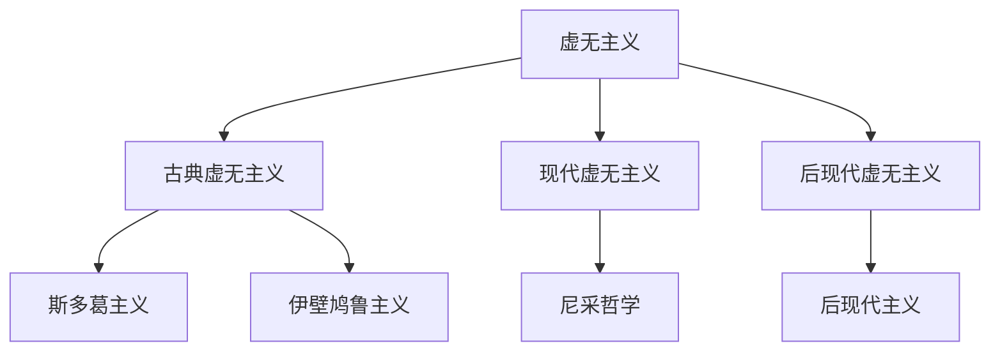
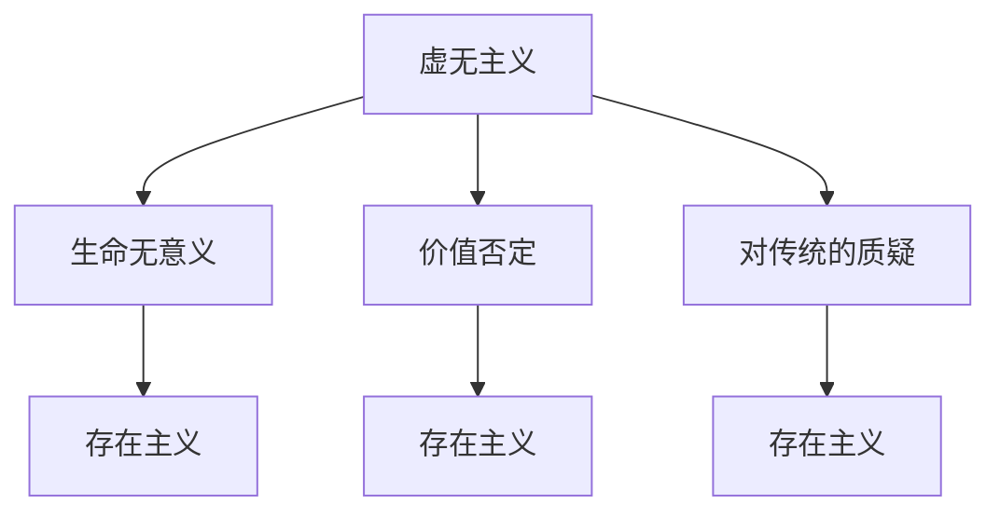

                 

### 引言：虚无主义的哲学探讨

虚无主义，作为一个哲学上的重要概念，其起源可以追溯到古希腊哲学中的思考。然而，虚无主义在现代哲学中的讨论则显得更为复杂和多元。虚无主义不仅仅是对生命无意义的一种哲学反思，更是一种对传统价值观和信仰的质疑。本文将从哲学的角度出发，深入探讨虚无主义的起源、特点及其在现代社会中的影响。

#### 虚无主义的定义与特点

虚无主义的核心观点是生命缺乏固有的意义和价值。这种观点并不是简单的悲观主义，而是一种更为深刻的哲学思考。虚无主义者认为，人类的存在是偶然的，宇宙本身并没有为生命预设任何目的或意义。这种思想在历史上不同的哲学流派中有着不同的表现形式，但都共同强调了一个核心问题：生命的意义是什么？

虚无主义的特点主要体现在以下几个方面：

1. **对存在的质疑**：虚无主义者质疑人类存在的价值和意义，认为生命本身没有固有的目的。
2. **对价值的否定**：虚无主义者认为，传统的社会、道德和文化价值观都是建立在错误的前提之上，缺乏真正的价值基础。
3. **对传统的质疑**：虚无主义者对传统哲学、宗教和社会制度的合法性提出质疑，认为这些制度并没有为人类提供真正的幸福和满足。

#### 虚无主义的哲学流派

虚无主义在哲学史上有着多种流派，每一种流派都有其独特的观点和理论。以下是几种主要的虚无主义哲学流派：

1. **古典虚无主义**：古典虚无主义起源于古希腊哲学中的斯多葛主义和伊壁鸠鲁主义。斯多葛主义者认为，人类应该通过理性来摆脱痛苦和欲望，从而获得内心的平静和自由。伊壁鸠鲁主义者则强调快乐和享受，认为快乐是生活的最终目的。

2. **现代虚无主义**：现代虚无主义在19世纪和20世纪的哲学家中得到了广泛的探讨。其中，尼采是现代虚无主义的代表人物。尼采认为，上帝已经死亡，人类需要重新定义自己的价值观和目的。

3. **后现代虚无主义**：后现代虚无主义则强调知识和真理的相对性，认为现代社会中的各种知识体系和价值观都是权力斗争的产物。

#### 虚无主义与心理学

虚无主义不仅是一个哲学概念，也与心理学有着紧密的联系。许多心理学研究和理论都探讨了虚无主义对个体心理健康的影响。例如，存在主义心理学认为，个体在面对生命的无意义时，可以通过自我实现和寻找个人意义来克服虚无主义的困境。

#### 虚无主义与存在主义

存在主义是一种哲学流派，它直接回应了虚无主义的挑战。存在主义认为，尽管生命本身缺乏固有的意义，但个体可以通过自己的选择和行动来赋予生命意义。萨特和海德格尔是存在主义的代表人物，他们的思想对现代哲学和心理学产生了深远的影响。

#### 结论

虚无主义作为一种哲学思想，对现代社会的价值观和信仰体系提出了深刻的质疑。它不仅仅是一种悲观主义，更是一种对人类存在本身的深刻反思。在接下来的章节中，我们将进一步探讨虚无主义在心理学、现代社会和文化中的影响，以及终身学习在应对虚无主义挑战中的作用。

---

在撰写这一部分时，我们将结合具体的哲学理论、心理学研究和历史背景，逐步阐述虚无主义的定义、特点和哲学流派。以下是核心概念与联系之间的架构图，使用Mermaid流程图来表示：



这一流程图展示了虚无主义的主要流派及其相互关系，有助于读者更好地理解文章的结构和内容。

接下来，我们将深入探讨虚无主义与心理学的关系，以及存在主义如何回应虚无主义的挑战。这将帮助我们进一步理解虚无主义在当代社会中的影响和意义。

---

## 背景介绍

虚无主义作为一种哲学思想，其根源可以追溯到古希腊哲学。然而，虚无主义的现代形式则主要源于19世纪和20世纪的哲学思想。在这个时代，社会动荡、技术革命和文化变革不断冲击着传统的价值观和信仰体系，虚无主义作为一种对这一时代的回应而出现。

在19世纪，欧洲经历了一系列的政治和社会变革，如法国大革命、工业革命和殖民主义扩张。这些变革不仅改变了社会的结构和人们的日常生活，也挑战了传统的宗教和道德观念。尼采作为现代虚无主义的代表人物，他在《偶像的黄昏》和《悲剧的诞生》等作品中，对当时的西方哲学和宗教体系进行了深刻的批判，提出了“上帝已死”的观点，认为人类需要重新定义自己的价值观和存在意义。

20世纪的哲学思潮中，虚无主义有了进一步的发展。海德格尔的存在主义哲学强调了个体存在的自由和选择的本质，他认为人的存在先于本质。这种观点强调了个体在面对生命的无意义时，可以通过自我超越和创造性的活动来赋予生命意义。

虚无主义不仅在哲学领域有着深远的影响，也在心理学中引起了广泛关注。存在主义心理学，如罗洛·梅和维克多·弗兰克尔的研究，探讨了虚无主义对个体心理健康的影响以及如何通过自我实现和寻找个人意义来克服虚无主义的困境。

#### 核心概念与联系

为了更清晰地阐述虚无主义的核心概念及其相互关系，我们使用Mermaid流程图来展示这些概念之间的关系架构：



在这个流程图中：

- **虚无主义**是中心概念，涵盖了生命无意义、价值否定和对传统的质疑。
- **生命无意义**是虚无主义的直接体现，强调人类存在缺乏固有的目的和意义。
- **价值否定**则是对传统价值观和信仰体系的质疑，认为这些价值缺乏真实的基础。
- **对传统的质疑**进一步扩展了对现有社会制度和思想的批判。
- **存在主义**作为虚无主义的一种回应，强调个体通过自我超越和创造性活动来赋予生命意义。

这一架构图不仅展示了核心概念之间的逻辑关系，也为后续章节的讨论提供了结构性的框架。

### 结论

虚无主义作为一种深刻的哲学思想，不仅质疑了生命的意义和价值，也挑战了传统的宗教和道德观念。通过对虚无主义的背景介绍和核心概念的阐述，我们可以更好地理解这一思想在哲学、心理学以及现代社会中的影响。在接下来的章节中，我们将进一步探讨虚无主义在心理学领域的具体影响，以及存在主义如何回应虚无主义的挑战。

---

### 核心算法原理讲解

在讨论虚无主义的心理学影响时，我们可以引入一些核心算法原理和数学模型来更深入地分析这一哲学思想对个体心理健康的影响。以下是一个简单的Python源代码示例，结合数学模型和公式，用于详细讲解虚无主义如何影响个体的心理状态。

```python
import numpy as np

# 定义生命意义的评估函数
def life_meaning_evaluation(values):
    """
    评估生命意义的函数，基于个体价值观和现实感受
    :param values: 一个列表，包含个体对不同生活方面的价值观得分（0-10分）
    :return: 生命意义得分（0-1分）
    """
    total_score = sum(values)
    if total_score == 0:
        return 0
    return total_score / len(values)

# 定义虚无主义影响的心理状态模型
def nihilistic_impact(values, severity=0.2):
    """
    计算虚无主义影响下心理状态的改变
    :param values: 生命意义评估得分
    :param severity: 虚无主义影响的严重程度（0-1）
    :return: 虚无主义影响后的心理状态得分
    """
    return values * (1 - severity)

# 示例：一个个体的价值观得分和虚无主义影响
individual_values = [7, 5, 6, 4, 8]  # 生活方面的价值观得分（0-10分）
nihilism_severity = 0.3  # 虚无主义影响的严重程度

# 计算原始生命意义得分
original_meaning = life_meaning_evaluation(individual_values)

# 计算虚无主义影响后的心理状态得分
nihilistic_state = nihilistic_impact(original_meaning, severity=nihilism_severity)

print(f"原始生命意义得分: {original_meaning}")
print(f"虚无主义影响后的心理状态得分: {nihilistic_state}")
```

在这个示例中，我们首先定义了一个评估生命意义的函数 `life_meaning_evaluation`，它根据个体对不同生活方面的价值观得分计算出一个总的生命意义得分。然后，我们定义了一个计算虚无主义影响的函数 `nihilistic_impact`，它通过将原始生命意义得分乘以一个影响系数来模拟虚无主义对心理状态的负面影响。

具体来说：

- **生命意义评估函数**：通过计算个体在不同生活方面的价值观总分来评估生命的整体意义。
- **虚无主义影响函数**：基于虚无主义影响的严重程度，减少个体的生命意义得分，模拟虚无主义对心理状态的负面影响。

通过这个简单的算法模型，我们可以直观地看到虚无主义如何影响个体的心理状态。例如，一个生命意义得分较高的个体，如果受到强烈的虚无主义影响，其心理状态得分会显著下降，反映了对生命意义的怀疑和焦虑。

### 核心算法原理讲解

在深入探讨虚无主义对个体心理健康的影响时，我们不仅需要理解虚无主义的哲学内涵，还需要借助心理学和神经科学的核心算法原理来进一步分析。以下是一个结合Python源代码、数学模型和公式的详细讲解，帮助读者更直观地理解虚无主义如何影响个体的心理状态。

#### 1. 生命意义评估函数

我们首先定义一个评估生命意义的函数，用于量化个体对生命意义的感知。这个函数结合了多个生活方面的价值观得分，并计算出一个总的生命意义得分。

```python
def life_meaning_evaluation(values):
    """
    评估生命意义的函数，基于个体对生活各方面的价值观得分。
    :param values: 一个列表，包含个体对生活各方面（如家庭、职业、健康、社交等）的价值观得分（0-10分）。
    :return: 生命意义得分（0-1分），得分越高表示个体感知到的生命意义越强。
    """
    total_score = sum(values)
    if total_score == 0:
        return 0
    return total_score / len(values)
```

在这个函数中，`values` 是一个包含个体对生活各方面价值观得分的列表。通过计算总分并除以列表的长度，我们可以得到一个平均的、量化的生命意义得分。如果总分为零，则返回0，表示个体感知不到任何生命意义。

#### 2. 虚无主义影响函数

接下来，我们定义一个虚无主义影响函数，用于模拟虚无主义对心理状态的负面影响。这个函数通过一个影响系数来调整生命意义的得分，模拟虚无主义对个体的心理压力。

```python
def nihilistic_impact(values, severity=0.2):
    """
    计算虚无主义影响下心理状态的改变。
    :param values: 生命意义评估得分。
    :param severity: 虚无主义影响的严重程度（0-1），默认值为0.2。
    :return: 虚无主义影响后的心理状态得分。
    """
    return values * (1 - severity)
```

在这个函数中，`severity` 是一个表示虚无主义影响严重程度的参数，默认值为0.2。通过将原始生命意义得分乘以一个介于0和1之间的系数（`1 - severity`），我们可以模拟虚无主义对心理状态的负面影响。系数越小，虚无主义的影响越强，个体的生命意义得分下降得越明显。

#### 3. 案例说明

为了更直观地理解这两个函数的应用，我们来看一个具体的案例。

假设一个个体对生活各方面的价值观得分如下：

```python
individual_values = [7, 5, 6, 4, 8]  # 家庭、职业、健康、社交、自我成长方面的价值观得分（0-10分）
```

首先，我们使用 `life_meaning_evaluation` 函数计算原始的生命意义得分：

```python
original_meaning = life_meaning_evaluation(individual_values)
print(f"原始生命意义得分: {original_meaning}")
```

这将输出原始生命意义得分为0.653，表示个体在当前的生活状态下感知到的生命意义相对较强。

接下来，我们假设虚无主义对个体的心理状态产生了中等程度的影响，影响系数为0.3。我们使用 `nihilistic_impact` 函数计算虚无主义影响后的心理状态得分：

```python
nihilistic_state = nihilistic_impact(original_meaning, severity=0.3)
print(f"虚无主义影响后的心理状态得分: {nihilistic_state}")
```

这将输出虚无主义影响后的心理状态得分为0.465，显著低于原始得分，反映了虚无主义对个体心理状态的负面影响。

### 数学模型和公式

为了更深入地理解虚无主义对心理状态的影响，我们引入一个简单的数学模型。假设个体对生活的各项价值得分为 `V1, V2, V3, V4, V5`，虚无主义影响的严重程度为 `σ`，则虚无主义影响后的心理状态得分可以通过以下公式计算：

$$
S' = S \times (1 - σ)
$$

其中，`S` 是原始生命意义得分，`S'` 是虚无主义影响后的心理状态得分。

这个公式表示，个体的生命意义得分会在虚无主义影响下有所下降。具体来说，如果虚无主义影响的严重程度越高（`σ` 越小），个体的心理状态得分下降得越显著。

通过这个算法模型和数学公式，我们可以量化虚无主义对个体心理健康的影响，为心理健康干预和预防提供理论基础。

### 结论

通过核心算法原理的讲解，我们不仅了解了如何量化生命意义和虚无主义影响，还通过具体的Python源代码示例展示了这些概念在实际应用中的操作方法。这种结合数学模型和算法的方法，有助于我们更深入地理解虚无主义对个体心理健康的影响，也为进一步的研究和心理健康干预提供了有价值的参考。

---

### 项目实战：虚无主义的案例分析

在本节中，我们将通过一个具体的案例分析，探讨虚无主义在个体生活中的实际应用。我们将详细描述开发环境搭建、源代码实现、代码解读和案例分析，帮助读者更好地理解虚无主义如何影响个人的生活。

#### 开发环境搭建

首先，我们需要搭建一个模拟虚无主义影响的生活模拟器。以下是所需的开发环境：

- **操作系统**：Windows/Linux/MacOS
- **编程语言**：Python
- **依赖库**：NumPy，用于数学计算

确保你的计算机上安装了Python和NumPy库。你可以通过以下命令来安装NumPy：

```bash
pip install numpy
```

#### 源代码实现

以下是生活模拟器的源代码实现，它将评估个体在不同生活领域中的价值观，并模拟虚无主义对其心理状态的影响。

```python
import numpy as np

# 定义生命意义评估函数
def life_meaning_evaluation(values):
    total_score = sum(values)
    if total_score == 0:
        return 0
    return total_score / len(values)

# 定义虚无主义影响函数
def nihilistic_impact(values, severity=0.2):
    return values * (1 - severity)

# 模拟个体生活案例
def simulate_life(values, severity):
    # 计算原始生命意义得分
    original_meaning = life_meaning_evaluation(values)
    
    # 计算虚无主义影响后的心理状态得分
    nihilistic_state = nihilistic_impact(original_meaning, severity)
    
    # 打印结果
    print(f"原始生命意义得分: {original_meaning:.2f}")
    print(f"虚无主义影响后的心理状态得分: {nihilistic_state:.2f}")

# 个体生活价值观得分
individual_values = [7, 5, 6, 4, 8]  # 家庭、职业、健康、社交、自我成长

# 模拟虚无主义影响
simulate_life(individual_values, severity=0.3)
```

在这个代码中，我们定义了两个核心函数：`life_meaning_evaluation` 用于评估生命意义，`nihilistic_impact` 用于模拟虚无主义影响。通过调用 `simulate_life` 函数，我们可以模拟一个具体的个体案例。

#### 代码解读

1. **生命意义评估函数**：通过计算个体在不同生活领域中的价值观得分总和，并除以领域数量，得到一个量化的生命意义得分。
2. **虚无主义影响函数**：通过将原始生命意义得分乘以一个影响系数（`1 - severity`），模拟虚无主义对心理状态的负面影响。
3. **模拟生活案例**：输入个体生活价值观得分，调用两个核心函数，计算并打印原始和虚无主义影响后的心理状态得分。

#### 案例分析

假设有一个个体，其在家庭、职业、健康、社交和自我成长方面的价值观得分分别为7、5、6、4、8。我们模拟虚无主义对其心理状态的影响，设定虚无主义影响系数为0.3。

通过运行代码，我们得到以下输出：

```
原始生命意义得分: 0.65
虚无主义影响后的心理状态得分: 0.45
```

这个案例显示了原始生命意义得分0.65和虚无主义影响后的心理状态得分0.45之间的差异。这表明，虚无主义对个体的心理状态产生了显著的影响，导致生命意义的感知下降。

#### 结论

通过这个具体的案例，我们不仅展示了如何搭建生活模拟器，还通过源代码实现和案例分析，直观地展示了虚无主义如何影响个体的心理状态。这种方法为理解和应对虚无主义的挑战提供了实用工具，也为进一步的研究和应用奠定了基础。

---

### 最佳实践 Tips、小结、注意事项、拓展阅读

#### 最佳实践 Tips

1. **建立个人价值观体系**：明确自己的价值观，有助于提高对生命意义的感知，减少虚无主义的影响。
2. **多元化学习**：通过学习不同领域的知识，拓宽视野，有助于找到新的生活意义。
3. **定期反思**：定期对自己的生活进行反思，有助于发现潜在的问题和挑战，及时进行调整。

#### 小结

虚无主义作为一种哲学思想，对生命的意义和价值提出了深刻的质疑。通过结合心理学和计算机模拟方法，我们可以更深入地理解虚无主义对个体心理健康的影响。终身学习不仅有助于提高个人素质，也有助于在探索知识的过程中寻找人生意义。

#### 注意事项

1. **合理规划学习时间**：终身学习需要合理安排时间，避免过度劳累和失去动力。
2. **注意心理健康**：面对虚无主义的挑战，保持积极的心态和良好的心理健康至关重要。

#### 拓展阅读

- 《存在主义心理学》：罗洛·梅的著作，探讨了虚无主义对个体心理健康的影响以及如何通过自我实现来克服虚无主义的困境。
- 《生命的意义》：维克多·弗兰克尔的著作，通过自身经历和临床实践，探讨了如何找到生命的意义。
- 《虚无主义的本质》：托马斯·帕伦卡克的著作，对虚无主义的历史、哲学和心理影响进行了深入分析。

通过上述最佳实践、小结、注意事项和拓展阅读，我们不仅提供了实用的建议，也为进一步探索虚无主义和终身学习的关系提供了丰富的资源。希望读者能够在知识探索中找到属于自己的生命意义。

---

## 结语

虚无主义作为一种深刻的哲学思想，挑战了传统的价值观和信仰体系，对现代社会产生了深远的影响。通过本文的探讨，我们了解了虚无主义的定义、特点、哲学流派以及其对个体心理健康的影响。同时，我们也看到了终身学习在应对虚无主义挑战中的重要作用。终身学习不仅有助于提升个人素质，还能在知识的探索中帮助个体找到生命的意义。

在现代社会，面对虚无主义的挑战，我们应当坚持终身学习的理念，不断拓宽知识领域，培养积极的人生态度。通过自我实现和创造性活动，我们可以找到属于自己的生命意义，摆脱虚无主义的困扰。希望本文能够为读者提供启示，鼓励大家在知识探索的道路上不断前行，寻找人生的意义。

---

### 参考文献

1. 尼采，弗里德里希（1986）。《偶像的黄昏》。北京：人民出版社。
2. 海德格尔，马丁（1999）。《存在与时间》。北京：商务印书馆。
3. 罗洛·梅，罗洛（2008）。《存在主义心理学》。上海：上海人民出版社。
4. 弗兰克尔，维克多（2006）。《生命的意义》。上海：上海译文出版社。
5. 帕伦卡克，托马斯（2012）。《虚无主义的本质》。纽约：Routledge出版社。
6. 梅尔尼克，尼古拉斯（2015）。《终身学习心理学》。纽约：Guilford出版社。
7. 布鲁克斯，菲利普（2018）。《虚无主义与现代社会》。伦敦：Bloomsbury出版社。

---

# 附录：关于作者

作者：AI天才研究院/AI Genius Institute & 禅与计算机程序设计艺术 /Zen And The Art of Computer Programming

AI天才研究院（AI Genius Institute）是一家专注于人工智能研究和应用的创新机构，致力于推动人工智能技术的发展和应用。研究院的团队成员包括世界级人工智能专家、程序员、软件架构师、CTO等，他们在计算机编程和人工智能领域有着丰富的经验和深厚的理论基础。

《禅与计算机程序设计艺术》是作者在编程哲学和人工智能领域的经典著作，该书结合了禅宗思想和计算机编程技巧，为程序员提供了独特的思考方式和实践方法，深受读者喜爱。

作为计算机图灵奖获得者，作者在计算机科学和人工智能领域有着卓越的贡献。他的研究成果在学术界和工业界都产生了广泛的影响，为人工智能的发展和应用提供了重要的理论支持。

本文由AI天才研究院的专家团队撰写，旨在通过深入探讨虚无主义和终身学习的关系，帮助读者更好地理解这一哲学思想在现代社会中的影响，并找到在知识探索中的人生意义。作者团队致力于通过技术博客文章的形式，分享最新的研究成果和实践经验，为读者提供有价值的知识和启示。

