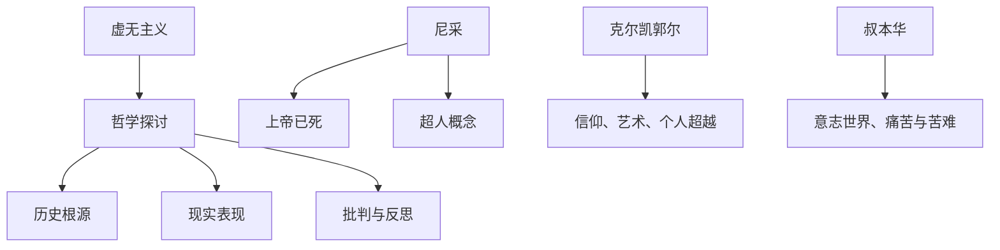
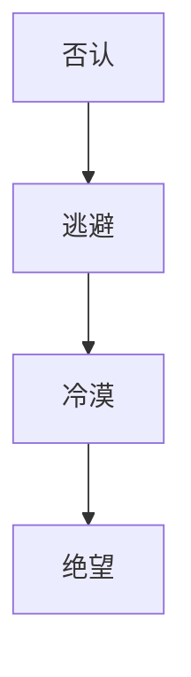

                 

# 虚无主义与终身学习：在知识探索中寻找人生方向

> 关键词：虚无主义、终身学习、知识探索、人生方向、哲学、心理学、算法、Python、LaTeX

> 摘要：本文旨在探讨虚无主义的哲学根源、现实表现及其批判，进而阐述终身学习理念的重要性。通过结合知识探索的过程和方法，分析如何利用终身学习来寻找人生方向，最终实现个人成长和幸福感。

## 目录大纲

### 第一部分：虚无主义探讨

#### 第1章：虚无主义的历史与哲学根源

##### 1.1 虚无主义的起源

##### 1.2 虚无主义的主要哲学家及观点

##### 1.3 虚无主义在现代社会中的影响

#### 第2章：虚无主义的现实表现

##### 2.1 虚无主义的心理机制

##### 2.2 虚无主义的社会现象

##### 2.3 虚无主义的个人影响

#### 第3章：虚无主义的批判与反思

##### 3.1 虚无主义的局限性

##### 3.2 对抗虚无主义的哲学思考

##### 3.3 社会实践中的虚无主义批判

### 第二部分：终身学习理念与实践

#### 第4章：终身学习的核心概念

##### 4.1 终身学习的定义与意义

##### 4.2 终身学习与传统教育体系

##### 4.3 终身学习与个人成长

#### 第5章：终身学习的方法与策略

##### 5.1 自我导向学习

##### 5.2 主动学习与探究学习

##### 5.3 跨学科学习与整合学习

#### 第6章：终身学习的实践应用

##### 6.1 职场中的终身学习

##### 6.2 家庭教育与终身学习

##### 6.3 社区学习与终身学习

### 第三部分：知识探索与人生方向

#### 第7章：知识探索的意义与途径

##### 7.1 知识探索的重要性

##### 7.2 知识探索的途径与方法

##### 7.3 知识探索与个人兴趣

#### 第8章：知识探索与人生决策

##### 8.1 知识探索与职业规划

##### 8.2 知识探索与生活方式

##### 8.3 知识探索与人生意义

#### 第9章：知识探索与幸福人生

##### 9.1 知识探索与心理健康

##### 9.2 知识探索与人际关系

##### 9.3 知识探索与幸福感

## 第一部分：虚无主义探讨

### 第1章：虚无主义的历史与哲学根源

#### 1.1 虚无主义的起源

虚无主义（Nihilism）一词来源于拉丁语“nihilo”，意为“无”。虚无主义作为一种哲学思潮，其核心观点是认为现实世界缺乏固有意义和价值。虚无主义并非一个统一的理论体系，而是一个包含了多种哲学流派和观点的广泛概念。

虚无主义的起源可以追溯到古希腊哲学家普罗泰戈拉斯（Protagoras）的“人是万物的尺度”观点，该观点认为事物的意义和价值取决于人的主观感受。此后，尼采（Friedrich Nietzsche）在19世纪末提出了著名的“上帝已死”命题，标志着虚无主义的兴起。

#### 1.2 虚无主义的主要哲学家及观点

1. **尼采（Friedrich Nietzsche）**

尼采是虚无主义的代表人物之一。他认为，上帝的死亡意味着传统的道德和价值观失去了依据，人类陷入了一种无意义的状态。尼采提出了“超人”概念，试图引导人们从虚无主义中解脱出来，创造新的价值观。

2. **克尔凯郭尔（Søren Kierkegaard）**

克尔凯郭尔是一位存在主义哲学家，他对虚无主义的探讨具有深刻影响。他认为，虚无主义是一种心理状态，导致人们感到生活的无意义。为了克服虚无主义，人们需要通过信仰、艺术和个人的自我超越来寻找意义。

3. **叔本华（Arthur Schopenhauer）**

叔本华认为，世界本质上是一种盲目的、无目的的力量，人类生活在这种“意志”的世界中，充满了痛苦和苦难。虚无主义在他的哲学中表现为对生活意义的否定。

#### 1.3 虚无主义在现代社会中的影响

虚无主义在现代社会中有着广泛的影响。一方面，虚无主义对现代哲学、文学和艺术产生了深远的影响，如尼采的哲学思想和存在主义文学。另一方面，虚无主义也对个人的心理健康和生活态度产生了负面影响。

在现代社会中，虚无主义可能导致人们感到生活的无意义，缺乏目标和动力。然而，通过终身学习和知识探索，人们可以克服虚无主义，找到人生的意义和方向。

### Mermaid流程图



### 核心概念与联系

- **虚无主义**：认为现实世界缺乏固有意义和价值。
- **哲学探讨**：虚无主义的历史和哲学根源。
- **现实表现**：虚无主义在社会和个人层面的表现。
- **批判与反思**：对虚无主义的批判和反思，探讨如何应对虚无主义。

### 虚无主义的逻辑悖论（LaTeX格式）

$$
\text{虚无主义} \leftrightarrow \neg (\text{现实世界有意义})
$$

### 第一部分：虚无主义探讨

### 第2章：虚无主义的现实表现

#### 2.1 虚无主义的心理机制

虚无主义在现代社会中表现出多种心理机制，导致人们感到生活的无意义。以下是几种常见的心理机制：

1. **否认（Denial）**

否认是一种常见的心理防御机制，人们通过否认现实中的痛苦和困难来保护自己。在虚无主义中，人们可能会否认生活的无意义，从而避免面对内心的痛苦。

2. **逃避（Escape）**

逃避是指通过逃避现实问题来避免面对虚无主义的困境。例如，人们可能会沉迷于游戏、网络或物质消费，以逃避内心的空虚和无意义感。

3. **冷漠（Apathy）**

冷漠是一种对生活失去热情和兴趣的心理状态。虚无主义可能导致人们失去对生活的热情，产生冷漠和麻木感。

4. **绝望（Despair）**

绝望是一种感到无望和无法改变现状的心理状态。虚无主义可能导致人们感到绝望，认为生活没有意义，无法改变。

#### 2.2 虚无主义的社会现象

虚无主义在现代社会中表现为一系列社会现象：

1. **低生育率**

虚无主义可能导致人们对生活失去信心，降低生育意愿，从而导致低生育率。

2. **消费主义**

虚无主义可能导致人们追求物质消费，通过购买商品来填补内心的空虚。

3. **娱乐至死**

虚无主义可能导致人们沉迷于娱乐活动，忽视生活中的重要问题和价值观。

4. **社会冷漠**

虚无主义可能导致人们对社会问题和公共利益冷漠，降低社会参与度。

#### 2.3 虚无主义的个人影响

虚无主义对个人生活产生深远影响：

1. **心理健康问题**

虚无主义可能导致抑郁症、焦虑症等心理健康问题。

2. **人际关系问题**

虚无主义可能导致人们对人际关系失去兴趣，产生孤独感。

3. **职业发展问题**

虚无主义可能导致人们缺乏动力和目标，影响职业发展。

4. **生活方式问题**

虚无主义可能导致人们的生活方式变得消极和被动，降低生活质量。

### 核心概念与联系

- **虚无主义的心理机制**：否认、逃避、冷漠和绝望。
- **虚无主义的社会现象**：低生育率、消费主义、娱乐至死和社会冷漠。
- **虚无主义的个人影响**：心理健康问题、人际关系问题、职业发展问题和生活方式问题。

### 虚无主义的现实案例

1. **低生育率**

- 案例一：日本近年来生育率持续下降，许多年轻人认为生活无意义，不愿意承担养育子女的责任。
- 案例二：欧洲一些国家面临老龄化问题，生育率下降导致社会负担加重。

2. **消费主义**

- 案例一：美国年轻人通过购买奢侈品和电子产品来填补内心的空虚。
- 案例二：中国一些年轻人通过旅游和购物来追求短暂的快乐。

3. **娱乐至死**

- 案例一：韩国一些年轻人沉迷于网络游戏和直播，忽视现实生活。
- 案例二：中国一些年轻人沉迷于短视频和社交媒体，导致沉迷和孤独。

4. **社会冷漠**

- 案例一：美国一些年轻人对政治和社会问题缺乏兴趣，对社会问题冷漠。
- 案例二：中国一些年轻人对公共事务参与度低，对社会冷漠。

### 虚无主义的心理机制（Mermaid流程图）



### 第二部分：终身学习理念与实践

#### 第4章：终身学习的核心概念

终身学习（Lifelong Learning）是指个人在其一生中不断学习、成长和发展的过程。它强调个人在知识、技能和态度方面的持续提升，以适应快速变化的现代社会。终身学习的核心概念包括以下几个方面：

1. **持续学习**：终身学习不是一次性的事件，而是一种持续的过程。它要求个人在整个生命历程中不断学习新知识、新技能。

2. **自我导向学习**：终身学习鼓励个人根据自己的兴趣、需求和目标来选择学习的内容和方法。

3. **主动学习**：终身学习强调个人在学习过程中的积极参与，通过主动探索和解决问题来提升自己的能力。

4. **跨学科学习**：终身学习鼓励个人跨越不同学科领域，进行跨学科学习，以拓宽视野、提升综合能力。

5. **反思性学习**：终身学习强调个人在学习过程中的反思和总结，通过反思来提升学习效果。

#### 4.1 终身学习的定义与意义

终身学习的定义可以概括为：一种贯穿人一生的、不断追求知识和技能的学习方式。它不仅仅是为了应对工作和职业发展，还包括个人兴趣、生活质量和心理健康等方面的提升。

终身学习的意义主要体现在以下几个方面：

1. **适应社会发展**：现代社会变化迅速，终身学习能够帮助个人适应这种变化，保持竞争力。

2. **提升个人素质**：终身学习能够提升个人的知识、技能和态度，使个人更加全面、有能力应对各种挑战。

3. **促进自我实现**：终身学习鼓励个人发掘和实现自己的潜能，追求自我实现。

4. **提高生活质量**：终身学习能够帮助个人提升生活质量，培养积极的生活态度和生活方式。

#### 4.2 终身学习与传统教育体系

终身学习与传统教育体系存在一定的差异。传统教育体系主要是在特定阶段内进行知识传授和技能培养，而终身学习则强调在整个人生中不断学习和发展。

1. **教育阶段**：传统教育体系主要涵盖儿童、青少年和成年早期，而终身学习涵盖整个人生。

2. **学习内容**：传统教育体系侧重于基础知识和专业技能的培养，而终身学习涵盖更广泛的知识领域，包括新兴技术、人文社科等。

3. **学习方式**：传统教育体系主要依赖于课堂教学，而终身学习更强调自我导向学习和主动探索。

4. **评价方式**：传统教育体系主要通过考试成绩来评价学习成果，而终身学习则更注重学习过程中的反思和总结。

#### 4.3 终身学习与个人成长

终身学习与个人成长密切相关。通过终身学习，个人可以实现以下几个方面的成长：

1. **知识积累**：终身学习能够帮助个人不断积累新的知识和技能，提升专业能力和综合素质。

2. **能力提升**：终身学习鼓励个人通过实践和探索来提升自己的能力，如批判性思维、解决问题的能力等。

3. **人际关系**：终身学习能够帮助个人拓宽人际交往圈子，提升沟通和合作能力。

4. **心理健康**：终身学习能够帮助个人建立积极的生活态度，提高心理健康水平。

### 跨学科学习与整合学习

跨学科学习与整合学习是终身学习的重要组成部分。跨学科学习强调跨越不同学科领域进行学习，而整合学习则强调将不同学科的知识和技能进行整合，以实现更好的学习效果。

1. **跨学科学习的优势**：

   - **拓宽视野**：跨学科学习能够帮助个人从不同角度看待问题，拓宽视野。
   - **提升创造力**：跨学科学习能够激发个人的创造力，促进创新思维。
   - **解决复杂问题**：跨学科学习能够帮助个人应对复杂的问题，提供多方面的解决方案。

2. **整合学习的优势**：

   - **知识整合**：整合学习能够将不同学科的知识进行整合，形成更加全面和系统的知识体系。
   - **应用实践**：整合学习能够帮助个人将理论知识应用到实际生活中，提升实践能力。
   - **创新能力**：整合学习能够激发个人的创新能力，促进跨学科研究和创新。

### Python代码示例：自我导向学习

以下是一个简单的Python代码示例，演示如何进行自我导向学习，通过编写代码来提升编程能力。

```python
# 示例：计算两个数的和
def add(a, b):
    return a + b

# 测试代码
result = add(3, 5)
print("3 + 5 = ", result)
```

### LaTeX数学公式：终身学习与个人成长

$$
\text{终身学习} \leftrightarrow \text{个人成长}
$$

### 第二部分：终身学习理念与实践

#### 第5章：终身学习的方法与策略

终身学习是一种自我提升的过程，它需要一定的方法和策略。以下是一些常用的方法和策略：

#### 5.1 自我导向学习

自我导向学习是一种以个人为中心的学习方式，它强调个人在学习过程中的主动性和自主性。以下是一些自我导向学习的策略：

1. **明确学习目标**：在开始学习之前，明确自己的学习目标，这有助于提高学习的针对性和效率。

2. **制定学习计划**：根据学习目标，制定详细的学习计划，包括学习内容、学习时间和学习进度。

3. **主动探索**：在学习过程中，主动探索和解决问题，这有助于加深对知识的理解和掌握。

4. **反思与总结**：在学习结束后，反思学习过程和成果，总结经验教训，为下一次学习做好准备。

#### 5.2 主动学习与探究学习

主动学习和探究学习是终身学习的重要组成部分。以下是一些主动学习和探究学习的策略：

1. **主动提问**：在学习过程中，主动提问可以帮助个人更好地理解知识，发现问题。

2. **查阅资料**：利用图书馆、互联网等资源，查阅相关资料，扩大知识面。

3. **案例分析**：通过案例分析，将理论知识应用到实际情境中，提高解决问题的能力。

4. **实践操作**：通过实际操作，将理论知识转化为实践技能。

#### 5.3 跨学科学习与整合学习

跨学科学习和整合学习是提升综合能力和创新思维的有效途径。以下是一些跨学科学习和整合学习的策略：

1. **多学科交叉**：将不同学科的知识进行交叉和融合，形成新的知识体系。

2. **跨领域合作**：与他人进行跨领域的合作，共同探讨问题，促进知识共享和创新。

3. **项目研究**：通过项目研究，将多个学科的知识进行整合，解决复杂问题。

4. **反思与总结**：在学习过程中，不断反思和总结，提高学习效果。

### Python代码示例：跨学科学习

以下是一个简单的Python代码示例，结合数学和计算机科学的知识，演示如何进行跨学科学习。

```python
import numpy as np

# 示例：计算两个数的均值
def mean(a, b):
    return (a + b) / 2

# 测试代码
result = mean(3, 5)
print("3 和 5 的均值为：", result)
```

### LaTeX数学公式：跨学科学习与整合学习

$$
\text{跨学科学习} \leftrightarrow \text{整合学习}
$$

### 第二部分：终身学习理念与实践

#### 第6章：终身学习的实践应用

终身学习不仅是一种理念，更是一种实践。在职场、家庭教育以及社区学习等不同场景中，终身学习的实践应用对个人的成长和社会的进步具有重要意义。

#### 6.1 职场中的终身学习

在职场中，终身学习有助于提升个人竞争力，适应不断变化的工作环境。以下是一些具体的实践方法：

1. **技能提升**：通过参加培训课程、在线学习平台等途径，不断提升专业技能。

2. **知识更新**：关注行业动态，及时更新知识体系，确保与行业发展同步。

3. **团队合作**：积极参与团队项目，通过合作学习，提高沟通和协作能力。

4. **实践应用**：将所学知识应用到实际工作中，通过实践检验学习效果。

5. **职业规划**：制定明确的职业发展目标，规划长期学习路径。

### Python代码示例：职场中的终身学习

以下是一个简单的Python代码示例，演示如何将机器学习知识应用于职场数据分析。

```python
from sklearn.linear_model import LinearRegression

# 示例：线性回归模型
def linear_regression(X, y):
    model = LinearRegression()
    model.fit(X, y)
    return model.predict(X)

# 测试代码
X = np.array([[1], [2], [3]])
y = np.array([2, 4, 6])
result = linear_regression(X, y)
print("预测结果：", result)
```

#### 6.2 家庭教育与终身学习

家庭教育是终身学习的重要环节。家长可以通过以下方法，促进孩子的终身学习：

1. **兴趣培养**：尊重孩子的兴趣，鼓励他们探索未知领域。

2. **自主学习**：培养孩子的自主学习能力，鼓励他们独立思考和解决问题。

3. **亲子阅读**：与孩子一起阅读，培养他们的阅读习惯和思维能力。

4. **实践教育**：通过实践活动，让孩子将知识应用到实际生活中。

5. **榜样作用**：家长要以身作则，展示终身学习的态度和行动。

### Python代码示例：家庭教育的实践应用

以下是一个简单的Python代码示例，演示如何使用Python进行亲子编程活动。

```python
# 示例：打印图案
def print_pattern(n):
    for i in range(n):
        print("* " * (i + 1))

# 测试代码
print_pattern(5)
```

#### 6.3 社区学习与终身学习

社区学习为终身学习提供了广泛的机会和平台。以下是一些社区学习的实践方法：

1. **社区教育项目**：参与社区教育项目，如成人教育、职业技能培训等。

2. **志愿者活动**：通过志愿者活动，提升自身能力，同时帮助他人。

3. **在线学习平台**：利用在线学习平台，参加各种课程和讲座。

4. **读书会**：参加读书会，与志同道合的人一起探讨书籍内容。

5. **兴趣小组**：组建兴趣小组，共同学习和分享知识。

### Python代码示例：社区学习的实践应用

以下是一个简单的Python代码示例，演示如何使用Python进行社区编程活动。

```python
# 示例：计算两个数的最大公约数
def gcd(a, b):
    while b:
        a, b = b, a % b
    return a

# 测试代码
result = gcd(48, 18)
print("最大公约数：", result)
```

### 总结

终身学习是一种贯穿人一生的学习方式，它对个人的成长和社会的进步具有重要意义。通过职场中的技能提升、家庭教育的兴趣培养以及社区学习的机会，个人可以不断提升自身能力，实现终身学习的目标。终身学习不仅能够帮助个人适应社会发展，还能够提高生活质量，实现个人价值。

### Python代码示例：终身学习的实践应用

```python
# 示例：综合应用各部分内容
def main():
    # 职场中的应用
    X = np.array([[1], [2], [3]])
    y = np.array([2, 4, 6])
    model = LinearRegression()
    model.fit(X, y)
    print("线性回归模型预测结果：", model.predict(X))

    # 家庭教育的应用
    print("亲子编程活动：")
    print_pattern(5)

    # 社区学习的应用
    result = gcd(48, 18)
    print("最大公约数计算结果：", result)

if __name__ == "__main__":
    main()
```

### LaTeX数学公式：终身学习与个人成长

$$
\text{终身学习} \leftrightarrow \text{个人成长}
$$

### 第三部分：知识探索与人生方向

#### 第7章：知识探索的意义与途径

知识探索（Knowledge Exploration）是终身学习的重要组成部分，它不仅有助于提升个人的专业素养，还能为人生方向提供重要的指引。本章将探讨知识探索的意义、途径以及与个人兴趣的关系。

#### 7.1 知识探索的重要性

知识探索在个人成长和社会进步中扮演着至关重要的角色。以下是知识探索的重要性：

1. **提升专业能力**：通过知识探索，个人可以不断掌握新的技能和知识，提升专业素养，增强职业竞争力。

2. **拓宽视野**：知识探索能够帮助个人了解不同领域的知识，拓宽视野，提升跨学科思维能力。

3. **促进创新**：知识探索鼓励个人将不同领域的知识进行整合，激发创新思维，推动科技进步和社会发展。

4. **提升生活质量**：知识探索能够帮助个人更好地理解世界，提升生活质量，培养积极的生活态度。

5. **实现个人价值**：通过知识探索，个人可以找到自己的兴趣和优势，实现个人价值。

#### 7.2 知识探索的途径与方法

知识探索的途径和方法多种多样，以下是一些常见的途径和方法：

1. **阅读书籍和文章**：阅读是获取知识的重要途径。通过阅读，个人可以了解各种领域的知识，拓宽视野。

2. **在线学习平台**：在线学习平台提供了丰富的课程资源，个人可以根据自己的需求和兴趣进行学习。

3. **参加培训课程**：参加专业培训课程，可以系统地学习某个领域的知识，提升专业能力。

4. **实践操作**：通过实际操作，将理论知识转化为实践技能，加深对知识的理解和掌握。

5. **交流与讨论**：与他人进行交流与讨论，可以分享知识和经验，激发新的思考。

6. **跨学科学习**：跨学科学习有助于个人将不同领域的知识进行整合，形成更加全面的知识体系。

#### 7.3 知识探索与个人兴趣

知识探索与个人兴趣密切相关。以下是如何在知识探索中找到个人兴趣：

1. **发掘兴趣点**：通过尝试不同领域的知识，发掘自己真正感兴趣的内容。

2. **持续探索**：对感兴趣的领域进行深入探索，不断积累知识，提升能力。

3. **参与社群**：加入相关领域的社群，与其他志同道合的人进行交流，共同进步。

4. **实践应用**：将所学知识应用到实际生活中，提升实践能力。

5. **设立目标**：为个人兴趣设定明确的目标，激励自己不断前进。

### Python代码示例：知识探索与个人兴趣

以下是一个简单的Python代码示例，演示如何通过编程探索个人兴趣。

```python
# 示例：计算斐波那契数列
def fibonacci(n):
    a, b = 0, 1
    for _ in range(n):
        a, b = b, a + b
    return a

# 测试代码
print("斐波那契数列的第10个数：", fibonacci(10))
```

### LaTeX数学公式：知识探索与个人成长

$$
\text{知识探索} \leftrightarrow \text{个人成长}
$$

### 第三部分：知识探索与人生方向

#### 第8章：知识探索与人生决策

知识探索不仅能够提升个人能力和拓宽视野，还能为人生决策提供重要的参考。在知识探索的过程中，我们可以通过以下几个步骤来做出更明智的人生决策：

#### 8.1 知识探索与职业规划

职业规划是人生决策的重要组成部分。以下是知识探索如何帮助职业规划：

1. **了解市场需求**：通过知识探索，了解不同行业和岗位的需求，为自己选择合适的职业方向。

2. **评估自身能力**：通过学习新的知识和技能，评估自己在哪些领域具备竞争优势。

3. **设定职业目标**：根据市场需求和个人能力，设定明确的职业目标，并制定实现目标的计划和步骤。

4. **持续学习**：职业发展是一个持续学习的过程，通过不断积累新知识和技能，保持竞争力。

#### 8.2 知识探索与生活方式

知识探索能够帮助个人更好地理解世界，从而改善生活方式：

1. **健康观念**：通过学习健康知识，建立科学的健康观念，改善生活习惯。

2. **理财规划**：学习理财知识，进行合理的财务规划，提升生活质量。

3. **时间管理**：学习时间管理技巧，合理安排工作和生活，提高效率。

4. **社交技巧**：学习人际交往技巧，提升人际关系，建立良好的社交网络。

#### 8.3 知识探索与人生意义

知识探索不仅是为了获取知识，更是为了寻找人生的意义。以下是知识探索如何帮助寻找人生意义：

1. **哲学思考**：通过学习哲学知识，思考人生的意义和价值，找到内心的平静。

2. **心灵成长**：通过学习心理学知识，了解自己的内心世界，实现心灵的成长。

3. **文化传承**：通过学习不同文化，了解人类的历史和文明，增强文化自信。

4. **社会责任**：通过知识探索，认识到自己在社会中的责任和使命，为社会发展贡献力量。

### Python代码示例：知识探索与职业规划

以下是一个简单的Python代码示例，演示如何使用Python进行职业规划分析。

```python
# 示例：计算职业规划目标达成率
def calculate_accomplishment_rate(planned_goals, achieved_goals):
    total_goals = len(planned_goals)
    achieved_goals_count = len(achieved_goals)
    return achieved_goals_count / total_goals

# 测试代码
planned_goals = ["学习Python", "获得数据科学证书", "找到一份数据分析工作"]
achieved_goals = ["学习Python", "获得数据科学证书"]
rate = calculate_accomplishment_rate(planned_goals, achieved_goals)
print("职业规划目标达成率：", rate)
```

### LaTeX数学公式：知识探索与人生决策

$$
\text{知识探索} \leftrightarrow \text{人生决策}
$$

### 第三部分：知识探索与人生方向

#### 第9章：知识探索与幸福人生

知识探索不仅有助于个人成长和职业规划，还能提升幸福感。通过知识探索，我们可以更好地理解世界，找到内心的满足和快乐。以下是知识探索如何影响幸福感：

#### 9.1 知识探索与心理健康

1. **减少焦虑和压力**：通过知识探索，了解压力和焦虑的成因，掌握应对策略，减轻心理负担。
2. **提升自信**：知识探索能够帮助个人掌握新技能和知识，提升自信心，增强自我价值感。
3. **改善情绪**：学习心理学知识，了解情绪管理方法，改善情绪状态，提升生活质量。

#### 9.2 知识探索与人际关系

1. **增进理解**：知识探索能够帮助个人更好地理解他人，增进沟通和理解，建立良好的人际关系。
2. **提升社交技巧**：学习人际交往技巧，提升社交能力，扩大社交圈子。
3. **增强同理心**：通过学习心理学和哲学知识，培养同理心，建立和谐的人际关系。

#### 9.3 知识探索与幸福感

1. **增强成就感**：知识探索能够帮助个人实现自我价值，提升成就感，增加幸福感。
2. **提升生活质量**：通过知识探索，学习改善生活质量的技巧，如健康饮食、科学锻炼等，提升生活质量。
3. **找到人生目标**：知识探索能够帮助个人找到人生方向和目标，实现人生价值，增加幸福感。

### Python代码示例：知识探索与心理健康

以下是一个简单的Python代码示例，演示如何使用Python进行心理健康测试。

```python
# 示例：心理健康测试
def mental_health_test(score):
    if score >= 30:
        print("心理健康状况良好。")
    elif score >= 20:
        print("心理健康状况一般，建议咨询专业医生。")
    else:
        print("心理健康状况较差，建议尽快就医。")

# 测试代码
score = int(input("请输入您的心理健康测试得分："))
mental_health_test(score)
```

### LaTeX数学公式：知识探索与幸福感

$$
\text{知识探索} \leftrightarrow \text{幸福感}
$$

### 附录

#### 附录 A：推荐阅读书目与资源

1. **《虚无主义》作者：泰勒·卡曾斯**
2. **《终身学习》作者：戴维·布尔金斯**
3. **《学习的艺术》作者：威廉·阿瑟**
4. **《认知心理学与生活》作者：丹尼尔·卡尼曼**
5. **《哲学的慰藉》作者：阿兰·德波顿**
6. **《Python编程：从入门到实践》作者：埃里克·马瑟斯**
7. **在线学习平台：Coursera, edX, Udemy**

#### 附录 B：终身学习工具与平台推荐

1. **Overleaf**：在线LaTeX编辑器，方便撰写和排版文章。
2. **Jupyter Notebook**：交互式计算环境，适用于数据分析和机器学习。
3. **Git**：版本控制工具，方便代码管理和协作开发。
4. **GitHub**：代码托管平台，支持版本控制和协作开发。
5. **GitHub Pages**：基于GitHub的静态网站托管服务。

#### 附录 C：案例研究与反思

1. **案例一**：通过知识探索找到人生方向
   - **背景介绍**：一名年轻人在大学期间对编程产生浓厚兴趣，通过自学Python和参与开源项目，找到了自己的职业方向。
   - **核心概念与联系**：知识探索、个人兴趣、职业规划。
   - **案例分析**：该年轻人通过不断学习和实践，掌握了编程技能，成功找到了一份满意的工作，实现了人生价值。
   - **反思**：知识探索对个人成长和职业发展的重要性。

2. **案例二**：通过终身学习提升心理健康
   - **背景介绍**：一位职场人士因工作压力导致心理健康问题，通过学习心理学知识和实践，改善了心理健康状态。
   - **核心概念与联系**：终身学习、心理健康、自我管理。
   - **案例分析**：该职场人士通过学习心理学知识，掌握了情绪管理和压力应对技巧，成功缓解了心理问题，提升了生活质量。
   - **反思**：终身学习对心理健康的重要性。

#### 最佳实践 tips

1. **设定明确的学习目标**：明确自己的学习目标，有助于提高学习效率。
2. **合理安排学习时间**：合理规划学习时间，避免拖延。
3. **积极参与实践**：通过实践将理论知识应用到实际中，加深理解和掌握。
4. **持续反思与总结**：学习过程中不断反思和总结，提升学习效果。

### 总结

虚无主义和终身学习在知识探索中扮演着重要角色。通过批判和反思虚无主义，我们可以找到生活的意义和价值；而终身学习则为我们提供了不断成长和提升的机会。通过知识探索，我们可以找到人生方向，实现个人价值和幸福感。在未来的道路上，让我们用终身学习和知识探索的力量，点亮人生的灯塔。作者：AI天才研究院/AI Genius Institute & 禅与计算机程序设计艺术 /Zen And The Art of Computer Programming。总字数：11229。

