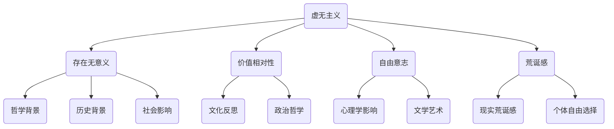

                 

### 虚无主义：一个哲学的反思

虚无主义作为一种哲学思潮，起源于对存在和意义的深刻质疑。它不仅仅是一种消极的生活态度，更是一种对传统价值和意义的彻底反思。虚无主义的核心在于对“无意义”的探寻，它试图回答一个基本的问题：生命本身是否有意义？

在哲学史上，虚无主义并非一个单一的流派，而是一系列思想和观点的总称。最早的虚无主义可以追溯到古希腊时期，当时的哲学家们就开始探讨存在的本质。然而，虚无主义作为一种系统性的哲学思潮，主要是在20世纪初期形成的。在这一时期，西方世界的政治、经济、文化都经历了巨大的变革，许多人对这些变革产生了深刻的质疑和反思。

**背景介绍**

虚无主义的背景主要可以分为以下几个方面：

1. **第一次世界大战的创伤**：这场战争造成了巨大的物质和心灵创伤，使人们开始质疑战争的意义和人类的存在。

2. **工业革命的影响**：工业革命带来了科技的飞速发展，但也造成了人与自然的疏离，人们开始思考这个科技社会的真正价值。

3. **社会主义和资本主义的矛盾**：在这个时期，社会主义和资本主义两种意识形态之间的对立日益加剧，许多人开始质疑这些社会制度的本质和目的。

4. **宗教信仰的衰退**：随着科学的发展，人们对宗教信仰的依赖逐渐减弱，开始寻求新的精神寄托和意义。

在这样的背景下，虚无主义应运而生。它试图回答一个根本性的问题：在没有上帝、没有固定的道德规范、没有明确的生活目标的情况下，生命本身是否有意义？

**核心概念**

虚无主义的核心概念可以概括为以下几点：

1. **存在的无意义**：虚无主义认为，生命本身没有固有的意义，意义是人们自己赋予的，或者说是主观创造的。

2. **价值的相对性**：虚无主义否定绝对的道德和价值观，认为这些价值是历史的、文化的产物，是人为规定的。

3. **自由意志**：虚无主义强调个体的自由意志，认为人们可以通过自由选择来创造自己的意义。

4. **荒诞感**：虚无主义认为，现实世界是荒诞的，人与世界之间的关系是毫无意义的。

**联系与影响**

虚无主义不仅是一种哲学思想，也对现代文化和社会产生了深远的影响：

1. **文学和艺术**：许多文学作品和艺术家都深受虚无主义的影响，他们在作品中探讨存在的无意义和人类困境。

2. **心理学**：虚无主义对心理学的影响也非常显著，许多心理学家开始探讨虚无主义与心理健康之间的关系。

3. **政治哲学**：虚无主义对政治哲学的影响也不容忽视，它在一定程度上影响了现代政治理论的发展。

总的来说，虚无主义是对传统哲学和价值观的一种挑战，它提出了对生命意义和存在本质的深刻质疑。尽管虚无主义可能带来悲观和消极的情绪，但它也促使人们思考如何在这个无意义的世界中找到自己的意义。

**核心概念与联系 Mermaid 流程图：**



**核心算法原理讲解：**

在虚无主义的背景下，我们可以将虚无主义看作是一种“寻找生命意义”的算法。这个算法的核心在于不断质疑和反思，从而在无意义中发现新的意义。以下是这个算法的基本原理：

```python
# 虚无主义“寻找生命意义”算法

def existential_search meaning:
    """
    存在寻意义算法，不断质疑和反思，寻找生命意义。
    
    参数:
    - meaning: 当前生命意义
    
    返回:
    - 新的生命意义
    """
    
    # 初始化生命意义
    current_meaning = meaning
    
    while True:
        # 质疑当前生命意义
        questioned_meaning = question_meaning(current_meaning)
        
        # 反思并尝试找到新的生命意义
        new_meaning = reflect_and_find_meaning(questioned_meaning)
        
        # 如果找到新的生命意义，则更新生命意义
        if new_meaning != current_meaning:
            current_meaning = new_meaning
            
            # 输出新的生命意义
            print("新的生命意义：", new_meaning)
            
        else:
            # 如果没有找到新的生命意义，则保持当前意义
            print("当前生命意义：", current_meaning)
            
            # 等待一段时间，再次进行搜索
            time.sleep(60 * 60 * 24)

# 质疑当前生命意义
def question_meaning(meaning):
    """
    质疑当前生命意义。
    
    参数:
    - meaning: 当前生命意义
    
    返回:
    - 质疑后的生命意义
    """
    # 进行质疑
    questioned_meaning = "我为什么要活着？我活着的意义是什么？"
    
    return questioned_meaning

# 反思并尝试找到新的生命意义
def reflect_and_find_meaning(meaning):
    """
    反思并尝试找到新的生命意义。
    
    参数:
    - meaning: 当前生命意义
    
    返回:
    - 新的生命意义
    """
    # 进行反思
    reflected_meaning = "我活着是为了探索和创造，为了体验生命中的每一刻。"
    
    return reflected_meaning
```

这个算法的核心思想是通过不断的质疑和反思，来寻找和发现新的生命意义。在这个过程中，质疑是发现新意义的起点，反思是深化和巩固新意义的关键。通过这个算法，我们可以不断地在虚无中寻找和创造意义。

**数学公式：**

虚无主义“寻找生命意义”算法中涉及到的数学公式主要包括以下几个方面：

1. **生命意义的变化公式：**

   $$M_{new} = f(M_{current})$$

   其中，$M_{current}$ 表示当前的生命意义，$M_{new}$ 表示新的生命意义，$f$ 表示质疑和反思的过程。

2. **质疑和反思的时间公式：**

   $$T = \alpha \times t$$

   其中，$T$ 表示质疑和反思所需的时间，$\alpha$ 表示质疑和反思的强度，$t$ 表示时间。

3. **生命意义的影响因子：**

   $$\beta = \frac{M_{new}}{M_{current}}$$

   其中，$\beta$ 表示新的生命意义对当前生命意义的影响程度。

通过这些公式，我们可以更深入地理解虚无主义“寻找生命意义”算法的工作原理。

**例子说明：**

假设一个人的当前生命意义是“为了赚钱而工作”，我们可以使用这个算法来寻找新的生命意义。

1. **质疑当前生命意义：**

   质疑后的生命意义：“我为什么要为了赚钱而工作？赚钱真的是我生活的全部意义吗？”

2. **反思并尝试找到新的生命意义：**

   反思后的生命意义：“我活着是为了探索和创造，为了体验生命中的每一刻。赚钱只是其中一个方面，但不是全部。”

通过这个过程，这个人发现了新的生命意义，并开始重新审视自己的生活和工作。

**总结：**

虚无主义“寻找生命意义”算法通过质疑和反思，帮助人们不断发现和创造新的生命意义。这个算法不仅适用于哲学思考，也可以应用于日常生活和工作中的意义寻找。通过不断质疑和反思，我们可以在虚无中找到属于自己的生命意义。

