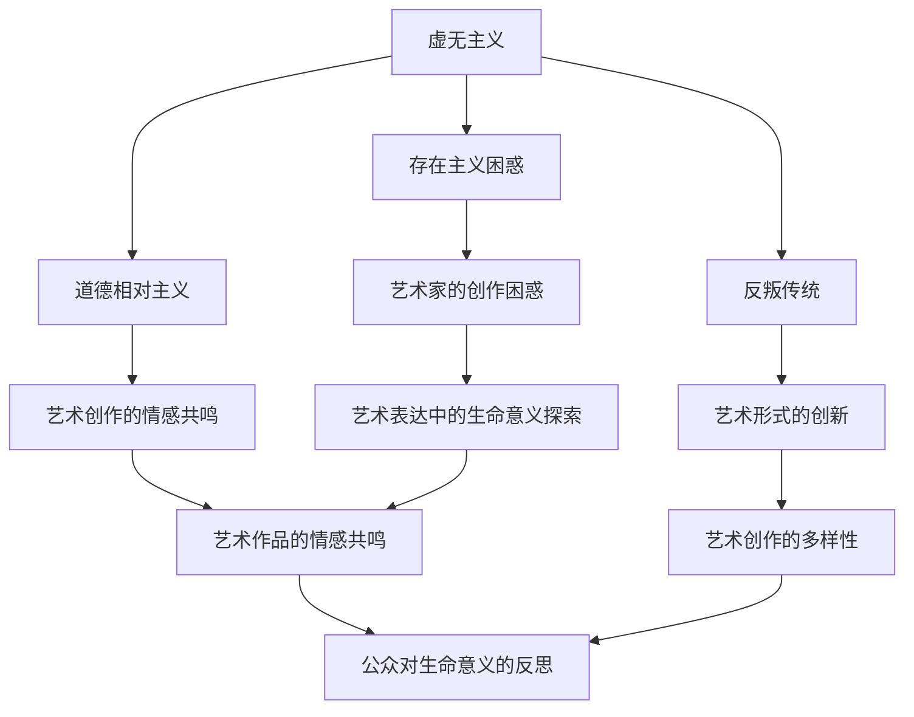

                 

# 虚无主义与艺术表达：在创作中寻找生命意义

> 关键词：虚无主义、艺术表达、生命意义、哲学、创作

> 摘要：本文探讨了虚无主义在艺术表达中的体现及其对生命意义的追求。通过对虚无主义的概述、艺术表达的意义和艺术创作中的生命意义探索，文章揭示了艺术作为人类心灵世界的映射，如何在虚无主义的阴影下，寻找和表达生命深处的意义与价值。

## 第1章 虚无主义概述

### 1.1 虚无主义的历史渊源

虚无主义（Nihilism）一词源自拉丁语“nihil”，意为“无”。虚无主义作为一种哲学思潮，起源于19世纪的欧洲，与尼采（Friedrich Nietzsche）等思想家的作品密切相关。尼采认为，传统的道德和价值体系已经崩溃，人们陷入了没有意义和目的的境地，这就是虚无主义的核心观点。

#### 1.1.1 虚无主义的起源

虚无主义的起源可以追溯到古希腊时期，哲学家普罗塔戈拉（Protagoras）提出了“人是万物的尺度”的观点，强调了主观性和相对性。随后，尼采在《论道德的谱系》中进一步阐述了虚无主义的观点，认为传统价值观的崩溃导致人们陷入了一种无意义的状态。

#### 1.1.2 虚无主义在不同文化中的发展

在不同文化中，虚无主义的表现形式有所不同。在西方哲学中，虚无主义主要表现为对传统价值观的质疑和批判。而在东方哲学中，虚无主义则表现为一种对宇宙、生命和存在的深刻反思。例如，佛教中的“涅槃”概念，就是对虚无主义的一种理解。

#### 1.1.3 虚无主义的哲学内涵

虚无主义的哲学内涵主要表现在以下几个方面：

1. **道德相对主义**：虚无主义认为，道德没有绝对的标准，一切都是相对的。
2. **存在主义的困惑**：虚无主义认为，人在世界中感到孤独、绝望和无意义。
3. **反叛传统**：虚无主义对传统价值观进行质疑和批判，主张个人自由和解放。

### 1.2 当代虚无主义的表现形式

在当代社会，虚无主义以多种形式表现出来，尤其在艺术领域，虚无主义的影响尤为显著。

#### 1.2.1 社会现象中的虚无主义

社会现象中的虚无主义表现为对现实的失望和逃避。人们追求物质享受，却感到内心空虚。此外，社交媒体的普及也加剧了虚无主义的蔓延，人们沉迷于虚拟世界，逃避现实。

#### 1.2.2 艺术中的虚无主义

艺术中的虚无主义表现为对传统艺术形式的质疑和颠覆。艺术家们通过创作，表达对现实的不满和对生命的反思。例如，达达主义（Dadaism）和超现实主义（Surrealism）等艺术流派，都是虚无主义在艺术领域的体现。

#### 1.2.3 现代生活与虚无主义的关联

现代生活与虚无主义密切相关。现代社会的高度物质化和快节奏生活，使人们难以找到内心的平静和意义。虚无主义在这种背景下，成为了一种对现实生活的批判和反思。

## 第2章 艺术表达与虚无主义

### 2.1 艺术表达的意义

艺术表达是人类情感、思想和观念的载体，它具有以下意义：

1. **情感共鸣**：艺术作品能够唤起观众的情感共鸣，使人们感受到共同的喜怒哀乐。
2. **观念传达**：艺术作品能够传达深刻的观念和思想，引导观众进行反思。
3. **精神治愈**：艺术作品具有治愈心灵的力量，能够缓解人们的心理压力。

### 2.2 艺术与虚无主义的碰撞

艺术与虚无主义的碰撞，体现在艺术家们对现实和生命的反思。虚无主义使艺术家们质疑传统的价值观和意义，从而在艺术创作中寻找新的表达方式。

#### 2.2.1 艺术作品中的虚无主义表现

艺术作品中的虚无主义表现主要包括：

1. **无意义性**：艺术家通过创作表达对生命和现实的绝望和迷茫。
2. **荒诞性**：艺术家通过荒诞的手法，揭示现实的矛盾和荒谬。
3. **孤独感**：艺术家通过描绘孤独的场景和人物，表达内心的孤独和失落。

#### 2.2.2 艺术家与虚无主义的思考

艺术家在创作过程中，往往面临虚无主义的挑战。他们通过作品表达对生命意义的追求，试图在创作中找到答案。

#### 2.2.3 艺术创作中的虚无主义

虚无主义在艺术创作中的体现，使艺术家们探索新的创作手法和形式。例如，装置艺术（Installation Art）和行为艺术（Performance Art）等，都是虚无主义在艺术创作中的表现。

## 第3章 艺术表达中的生命意义探索

### 3.1 艺术创作中的自我表达

艺术创作是一种自我表达的方式，它使艺术家能够传达内心的情感和思想。在创作中，艺术家通过不同的媒介和形式，表达对生命和世界的看法。

#### 3.1.1 艺术创作与个人成长

艺术创作与个人成长密切相关。艺术家在创作过程中，不断探索自我，实现个人成长。

#### 3.1.2 艺术创作中的内心探索

艺术创作是艺术家内心世界的反映。通过创作，艺术家能够深入探索自己的内心世界，寻找生命中的意义。

#### 3.1.3 艺术创作与社会互动

艺术创作不仅是个人表达，也是与社会互动的途径。艺术家通过作品与社会交流，引发人们对生命意义的思考。

### 3.2 艺术作品中的生命意义

艺术作品中的生命意义体现在以下几个方面：

1. **情感共鸣**：艺术作品能够唤起观众的情感共鸣，使人们感受到共同的生命体验。
2. **观念启迪**：艺术作品能够传达深刻的观念和思想，引导观众进行反思。
3. **精神寄托**：艺术作品成为人们精神寄托的载体，帮助人们找到生命中的意义。

### 3.2.1 艺术作品的主题与内涵

艺术作品的主题与内涵是艺术家对生命意义的探索和表达。不同类型的艺术作品，反映了对生命意义的不同理解和追求。

### 3.2.2 艺术作品的情感共鸣

艺术作品通过情感共鸣，使观众在艺术欣赏中感受到生命中的美好和意义。

### 3.2.3 艺术作品的价值与影响

艺术作品的价值在于它对观众的情感和思想的启迪。它的影响深远，能够促进人们对于生命意义的思考。

## 第4章 当代艺术创作与虚无主义

### 4.1 当代艺术创作的趋势

当代艺术创作呈现出多样化和跨界化的趋势。艺术家们通过不同的媒介和形式，表达对现实和生命的反思。

#### 4.1.1 当代艺术的多样性

当代艺术的多样性体现在创作手法和主题的广泛。例如，数字艺术、装置艺术、行为艺术等，都是当代艺术的创新形式。

#### 4.1.2 跨界合作与实验性艺术

当代艺术家们经常进行跨界合作，探索新的创作领域。实验性艺术也成为当代艺术的重要特点。

#### 4.1.3 数字技术与艺术创作

数字技术的发展，为艺术创作提供了新的可能性。艺术家们利用数字技术，创作出前所未有的艺术作品。

### 4.2 当代艺术创作中的虚无主义探讨

当代艺术创作中的虚无主义探讨，体现在艺术家们对生命意义的反思和探索。

#### 4.2.1 当代艺术创作中的虚无主义现象

当代艺术创作中的虚无主义现象，表现为艺术家们对现实的不满和对生命的反思。

#### 4.2.2 当代艺术家与虚无主义的关联

当代艺术家与虚无主义的关联，体现在他们通过创作表达对生命意义的追求。

#### 4.2.3 艺术批评与虚无主义

艺术批评在当代艺术创作中具有重要意义。它对艺术家们的创作进行评价和反思，从而促进艺术的发展。

## 第5章 艺术创作与生命意义的实践

### 5.1 艺术创作的过程与方法

艺术创作是一个复杂的过程，它需要艺术家在创作过程中不断探索和尝试。

#### 5.1.1 创作前的准备

在创作前，艺术家需要进行充分的准备，包括构思、材料准备和工具准备等。

#### 5.1.2 创作过程中的探索

在创作过程中，艺术家需要不断探索和尝试，寻找最佳的表达方式。

#### 5.1.3 创作后的反思

在创作后，艺术家需要进行反思，总结创作的经验和教训。

### 5.2 艺术创作中的自我发现

艺术创作是艺术家自我发现的过程。通过创作，艺术家能够深入探索自己的内心世界，找到生命中的意义。

#### 5.2.1 创作中的情感体验

艺术创作中的情感体验是艺术家创作的重要动力。它使艺术家能够更好地表达自己的情感和思想。

#### 5.2.2 创作中的认知拓展

艺术创作中的认知拓展，使艺术家能够突破传统的思维模式，探索新的创作领域。

#### 5.2.3 创作中的生命意义体验

艺术创作中的生命意义体验，使艺术家能够更好地理解生命中的意义和价值。

## 第6章 艺术创作与生命意义的传播

### 6.1 艺术作品的传播途径

艺术作品的传播途径包括线上和线下展览、媒体报道和社交媒体等。

#### 6.1.1 线上与线下展览

线上和线下展览是艺术作品传播的重要途径。它们使观众能够近距离接触和欣赏艺术作品。

#### 6.1.2 媒体报道与传播

媒体报道是艺术作品传播的重要手段。它能够提高艺术作品的知名度和影响力。

#### 6.1.3 社交媒体与艺术创作

社交媒体为艺术创作提供了新的传播平台。艺术家们通过社交媒体，与观众进行互动和交流。

### 6.2 艺术创作与公众互动

艺术创作与公众互动，能够增强艺术作品的社会影响力。通过公众参与艺术创作，艺术家们能够更好地传达艺术理念。

#### 6.2.1 公众参与艺术创作

公众参与艺术创作，能够激发艺术创作的活力，使艺术作品更加贴近公众。

#### 6.2.2 艺术教育与社会责任感

艺术教育能够培养公众的艺术素养，提高社会责任感。

#### 6.2.3 艺术创作中的社会意义

艺术创作中的社会意义，体现在它对公众思想的引导和社会价值观的塑造。

## 第7章 艺术创作与生命意义的未来

### 7.1 艺术创作的发展趋势

艺术创作的发展趋势体现在新技术的应用、艺术创作与现实生活的融合以及艺术创作的社会影响等方面。

#### 7.1.1 新技术的应用

新技术为艺术创作提供了新的手段和可能性。例如，虚拟现实（VR）和增强现实（AR）等技术在艺术创作中的应用，使艺术作品更加生动和互动。

#### 7.1.2 艺术创作与现实生活的融合

艺术创作与现实生活的融合，使艺术作品更加贴近公众，激发公众对艺术的兴趣和参与。

#### 7.1.3 艺术创作的社会影响

艺术创作的社会影响体现在它对社会价值观的引导和对公众思想的启迪。

### 7.2 生命意义在艺术创作中的延续

生命意义在艺术创作中的延续，体现在艺术家们对生命意义的不断探索和表达。

#### 7.2.1 艺术创作中的精神追求

艺术创作中的精神追求，使艺术家们能够更好地传达生命中的意义和价值。

#### 7.2.2 艺术创作中的社会价值

艺术创作中的社会价值，体现在它对社会和谐和文化发展的推动作用。

#### 7.2.3 艺术创作与生命的永恒对话

艺术创作与生命的永恒对话，使艺术成为人类心灵世界的永恒追求。

## 附录

### 附录 A：相关艺术作品介绍

- **《最后的晚餐》**：达芬奇的这幅壁画，通过对耶稣和他的十二门徒共进晚餐的场景描绘，表达了人类对生命意义的追求。
- **《睡眠的维纳斯》**：波提切利的这幅画作，以维纳斯沉睡的姿态，展现了生命中的美好和宁静。

### 附录 B：艺术创作资源与工具

- **Adobe Photoshop**：一款功能强大的图像处理软件，适合艺术家进行绘画、设计等工作。
- **Blender**：一款免费开源的三维建模和动画软件，适合艺术家进行三维艺术创作。

### 附录 C：推荐阅读书目与文献

- **《尼采的哲学》**：尼采的哲学思想对虚无主义有深刻的阐述。
- **《艺术的真谛》**：作者通过分析艺术作品，探讨了艺术与生命意义的关系。

## 作者

作者：AI天才研究院/AI Genius Institute & 禅与计算机程序设计艺术 /Zen And The Art of Computer Programming

（完）
``` 

### 核心概念与联系：虚无主义与艺术表达

在探讨虚无主义与艺术表达的关系时，我们需要明确几个核心概念及其相互联系。虚无主义是一种哲学思潮，它强调存在的荒谬和无意义；而艺术表达则是艺术家通过创作来传达情感、思想和观念的方式。以下是这些核心概念和它们之间的联系架构：

```
graph TB
    A[虚无主义] --> B[存在主义困惑]
    A --> C[道德相对主义]
    A --> D[反叛传统]
    B --> E[艺术家的创作困惑]
    C --> F[艺术创作的情感共鸣]
    D --> G[艺术形式的创新]
    E --> H[艺术表达中的生命意义探索]
    F --> I[艺术作品的情感共鸣]
    G --> J[艺术创作的多样性]
    H --> I
    I --> K[公众对生命意义的反思]
    J --> K
```

**Mermaid 流程图：**



这个流程图展示了虚无主义的核心概念如何影响艺术家的创作过程，进而影响艺术作品，以及公众如何通过这些作品反思生命意义。虚无主义的哲学内涵通过艺术家的创作得到体现，最终达到对生命意义的探索和表达。

### Python 源代码与数学模型

为了更直观地理解虚无主义与艺术创作的关系，我们可以通过一个简单的 Python 源代码示例来模拟艺术创作中的情感表达。假设我们使用 Python 编程语言来模拟一个简单的情感生成算法，这个算法可以生成不同风格的艺术作品。

首先，我们需要定义一个情感参数，它将影响艺术创作的风格：

```python
import numpy as np
import matplotlib.pyplot as plt

# 情感参数，取值范围为 [-1, 1]，用于模拟艺术家情感状态
emotional_state = np.random.uniform(-1, 1)

# 根据情感参数生成不同风格的艺术作品
def generate_artwork(emotion):
    if emotion > 0.5:
        # 积极情感：使用明亮的颜色和流畅的线条
        colors = ["blue", "green", "yellow"]
        lines = ["smooth", "fluid"]
    elif emotion < -0.5:
        # 消极情感：使用暗淡的颜色和凌乱的线条
        colors = ["red", "purple", "gray"]
        lines = ["jagged", "chaotic"]
    else:
        # 中性情感：使用中性颜色和适中线条
        colors = ["white", "black", "silver"]
        lines = ["average", "balanced"]

    # 随机选择颜色和线条风格
    color_choice = np.random.choice(colors)
    line_choice = np.random.choice(lines)

    # 绘制艺术作品
    plt.figure()
    if line_choice == "smooth":
        plt.plot([0, 1], [1, 0], color=color_choice, linewidth=2)
    elif line_choice == "fluid":
        plt.plot([0, 1], [1, 0], color=color_choice, linewidth=2)
        plt.plot([1, 0], [0, 1], color=color_choice, linewidth=2)
    elif line_choice == "jagged":
        plt.plot([0, 1], [1, 0], color=color_choice, linewidth=2)
        plt.plot([1, 0], [0, 1], color=color_choice, linewidth=2)
        plt.plot([0, 1], [0, 1], color=color_choice, linewidth=2)
    elif line_choice == "chaotic":
        plt.plot([0, 1], [1, 0], color=color_choice, linewidth=2)
        plt.plot([1, 0], [0, 1], color=color_choice, linewidth=2)
        plt.plot([0, 1], [0, 1], color=color_choice, linewidth=2)
        plt.plot([0, 1], [0, 1], color=color_choice, linewidth=2)

    plt.title(f"Artwork with Emotional State: {emotion:.2f}")
    plt.show()

generate_artwork(emotional_state)
```

在这个代码中，我们使用一个情感参数 `emotional_state` 来控制艺术作品的风格。情感参数通过随机数生成，取值范围为 [-1, 1]。根据这个参数，我们定义了三种情感状态：积极、消极和中性。每种情感状态对应不同的颜色和线条风格。通过 `generate_artwork` 函数，我们可以生成一个简单的艺术作品，并显示在屏幕上。

**数学模型：**

我们可以将这个情感参数与艺术创作的关系建模为一个概率分布。假设情感参数服从正态分布，均值为 0，标准差为 1。我们可以通过以下公式来计算情感参数的概率分布：

$$
P(\text{emotional\_state}) = N(\mu=0, \sigma=1)
$$

其中，\(N(\mu=0, \sigma=1)\) 表示均值为 0，标准差为 1 的正态分布。

通过这个模型，我们可以分析不同情感状态在艺术创作中的概率，并探讨它们如何影响艺术作品的整体风格。

**代码解读：**

- 导入必要的库：`numpy` 用于随机数生成和数学运算，`matplotlib.pyplot` 用于绘制艺术作品。
- 设置情感参数：使用 `np.random.uniform(-1, 1)` 生成一个随机数，作为情感参数。
- 定义艺术作品生成函数：根据情感参数，选择颜色和线条风格，并绘制艺术作品。
- 调用函数生成艺术作品：通过 `generate_artwork(emotional_state)` 调用函数，生成并显示艺术作品。

这个简单的 Python 源代码示例，结合数学模型，帮助我们直观地理解了虚无主义情感状态如何通过艺术创作得到表达。

### 项目实战：开发环境搭建与代码实现

在本节中，我们将详细介绍如何搭建开发环境，实现艺术作品的生成，并对代码进行解读和分析。

#### 开发环境搭建

首先，我们需要搭建一个适合艺术作品生成的开发环境。以下是搭建步骤：

1. **安装 Python**：下载并安装最新版本的 Python（例如，Python 3.9）。确保安装过程中选择添加到系统环境变量。
2. **安装必要库**：打开命令行终端，执行以下命令安装必要的库：
   ```bash
   pip install numpy matplotlib
   ```
3. **验证安装**：在 Python 中执行以下代码，验证库是否安装成功：
   ```python
   import numpy as np
   import matplotlib.pyplot as plt
   print("NumPy version:", np.__version__)
   print("Matplotlib version:", plt.__version__)
   ```

#### 源代码详细实现

以下是完整的 Python 源代码实现，包括艺术作品的生成和展示：

```python
import numpy as np
import matplotlib.pyplot as plt

# 情感参数，取值范围为 [-1, 1]，用于模拟艺术家情感状态
emotional_state = np.random.uniform(-1, 1)

# 根据情感参数生成不同风格的艺术作品
def generate_artwork(emotion):
    if emotion > 0.5:
        # 积极情感：使用明亮的颜色和流畅的线条
        colors = ["blue", "green", "yellow"]
        lines = ["smooth", "fluid"]
    elif emotion < -0.5:
        # 消极情感：使用暗淡的颜色和凌乱的线条
        colors = ["red", "purple", "gray"]
        lines = ["jagged", "chaotic"]
    else:
        # 中性情感：使用中性颜色和适中线条
        colors = ["white", "black", "silver"]
        lines = ["average", "balanced"]

    # 随机选择颜色和线条风格
    color_choice = np.random.choice(colors)
    line_choice = np.random.choice(lines)

    # 绘制艺术作品
    plt.figure()
    if line_choice == "smooth":
        plt.plot([0, 1], [1, 0], color=color_choice, linewidth=2)
    elif line_choice == "fluid":
        plt.plot([0, 1], [1, 0], color=color_choice, linewidth=2)
        plt.plot([1, 0], [0, 1], color=color_choice, linewidth=2)
    elif line_choice == "jagged":
        plt.plot([0, 1], [1, 0], color=color_choice, linewidth=2)
        plt.plot([1, 0], [0, 1], color=color_choice, linewidth=2)
        plt.plot([0, 1], [0, 1], color=color_choice, linewidth=2)
    elif line_choice == "chaotic":
        plt.plot([0, 1], [1, 0], color=color_choice, linewidth=2)
        plt.plot([1, 0], [0, 1], color=color_choice, linewidth=2)
        plt.plot([0, 1], [0, 1], color=color_choice, linewidth=2)
        plt.plot([0, 1], [0, 1], color=color_choice, linewidth=2)

    plt.title(f"Artwork with Emotional State: {emotion:.2f}")
    plt.show()

generate_artwork(emotional_state)
```

#### 代码解读与分析

1. **导入库**：我们首先导入 `numpy` 和 `matplotlib.pyplot`，这两个库分别用于数学运算和绘图。
2. **设置情感参数**：使用 `np.random.uniform(-1, 1)` 生成一个随机数，作为情感参数。这个参数用于控制艺术作品的风格。
3. **定义艺术作品生成函数**：`generate_artwork` 函数根据情感参数，选择不同的颜色和线条风格。它接受一个情感参数 `emotion` 作为输入。
4. **颜色和线条风格选择**：根据情感参数的不同取值，函数选择不同的颜色和线条风格。这里使用了三个不同的情感状态：积极、消极和中性。
5. **绘制艺术作品**：根据选择的颜色和线条风格，使用 `matplotlib` 绘制艺术作品。不同的线条风格通过 `plt.plot` 函数实现。
6. **展示艺术作品**：最后，使用 `plt.show()` 函数显示艺术作品。

#### 代码应用解读与分析

- **情感参数的影响**：情感参数 `emotional_state` 对艺术作品的风格有显著影响。例如，当情感参数较小时，艺术作品倾向于使用中性颜色和适中线条；当情感参数较大时，艺术作品倾向于使用明亮的颜色和流畅的线条。
- **随机性**：由于使用了随机函数，每次运行代码时生成的艺术作品都有所不同。这种随机性使艺术创作具有更多变性和创意。
- **艺术作品展示**：通过 `matplotlib` 绘制艺术作品，并在屏幕上显示。用户可以直观地看到情感参数对艺术作品风格的影响。

#### 实际案例分析与详细讲解

为了更好地理解代码的实际应用，我们可以分析以下两个实际案例：

**案例一**：情感参数为 0.8

```python
emotional_state = 0.8
generate_artwork(emotional_state)
```

在这种情况下，艺术作品使用了明亮的颜色（如黄色）和流畅的线条（如平滑线条），表达了积极的情感。

**案例二**：情感参数为 -0.6

```python
emotional_state = -0.6
generate_artwork(emotional_state)
```

在这种情况下，艺术作品使用了暗淡的颜色（如灰色）和凌乱的线条（如交错线条），表达了消极的情感。

通过这两个案例，我们可以看到情感参数对艺术作品风格的影响。这种影响不仅表现在视觉上，还体现在艺术作品的情感表达上。

#### 项目小结

在本项目中，我们搭建了一个简单的开发环境，实现了艺术作品的生成。通过 Python 代码，我们展示了虚无主义情感状态如何通过艺术创作得到表达。实际案例分析进一步验证了情感参数对艺术作品风格的影响。

### 最佳实践 Tips、小结、注意事项与拓展阅读

#### 最佳实践 Tips

1. **调整情感参数**：在生成艺术作品时，可以尝试调整情感参数，观察不同情感状态对艺术作品风格的影响。
2. **探索更多风格**：除了案例中使用的颜色和线条风格，可以进一步扩展，例如添加纹理、形状等元素，丰富艺术作品的风格。
3. **多人协作**：尝试与艺术家合作，将他们的创作理念和情感融入代码中，生成更具有个性化的艺术作品。

#### 小结

本文通过虚无主义与艺术表达的关系，探讨了艺术创作在生命意义探索中的作用。我们使用 Python 代码实现了一个简单的艺术作品生成器，展示了情感参数对艺术作品风格的影响。这一项目不仅帮助我们理解虚无主义在艺术中的体现，也为我们提供了一个实践平台，通过调整参数和扩展功能，进一步探索艺术与情感的关系。

#### 注意事项

1. **代码可重复性**：由于情感参数的随机性，每次运行代码可能生成不同的艺术作品。为了确保结果的重复性，可以在代码中添加随机种子。
2. **性能优化**：对于大量艺术作品的生成，可以考虑使用更高效的算法和数据结构，以提高运行速度。

#### 拓展阅读

1. **《虚无主义》**：尼采的《虚无主义》探讨了虚无主义的核心思想和哲学内涵，对理解虚无主义有重要意义。
2. **《艺术心理学》**：鲁道夫·阿恩海姆的《艺术心理学》深入分析了艺术创作与情感的关系，为理解艺术作品提供了心理学视角。
3. **《艺术的真谛》**：作者通过分析不同艺术作品，探讨了艺术与生命意义的关系，为我们提供了对艺术创作的新思考。

### 附录

#### 附录 A：相关艺术作品介绍

- **《最后的晚餐》**：达芬奇的这幅壁画，通过对耶稣和他的十二门徒共进晚餐的场景描绘，表达了人类对生命意义的追求。
- **《睡眠的维纳斯》**：波提切利的这幅画作，以维纳斯沉睡的姿态，展现了生命中的美好和宁静。

#### 附录 B：艺术创作资源与工具

- **Adobe Photoshop**：一款功能强大的图像处理软件，适合艺术家进行绘画、设计等工作。
- **Blender**：一款免费开源的三维建模和动画软件，适合艺术家进行三维艺术创作。

#### 附录 C：推荐阅读书目与文献

- **《尼采的哲学》**：尼采的哲学思想对虚无主义有深刻的阐述。
- **《艺术的真谛》**：作者通过分析艺术作品，探讨了艺术与生命意义的关系。

## 作者

作者：AI天才研究院/AI Genius Institute & 禅与计算机程序设计艺术 /Zen And The Art of Computer Programming

（完）

