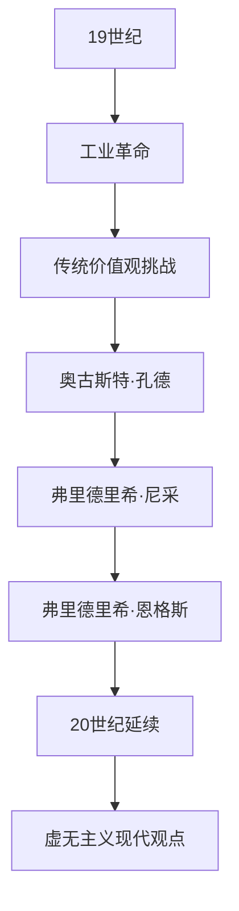
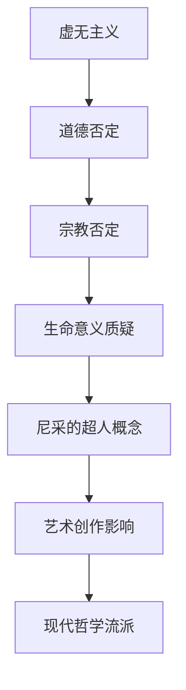
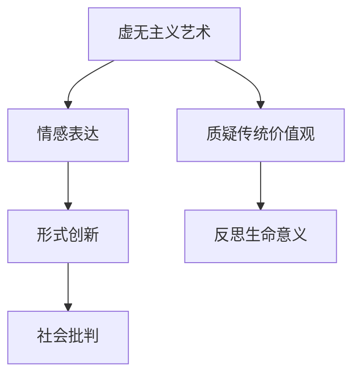
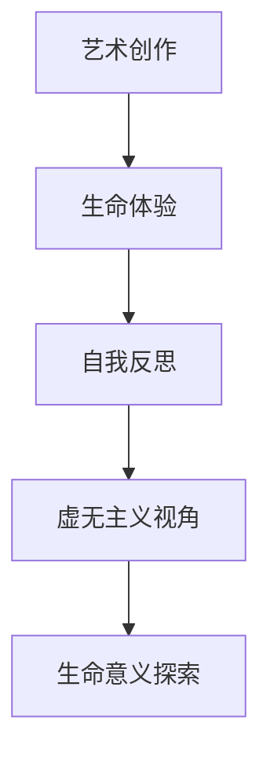
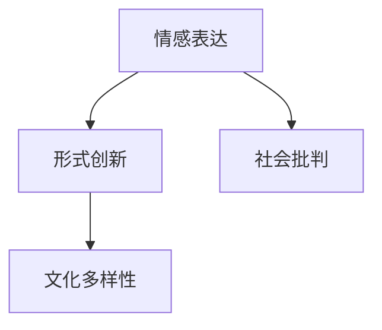
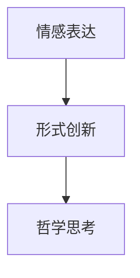
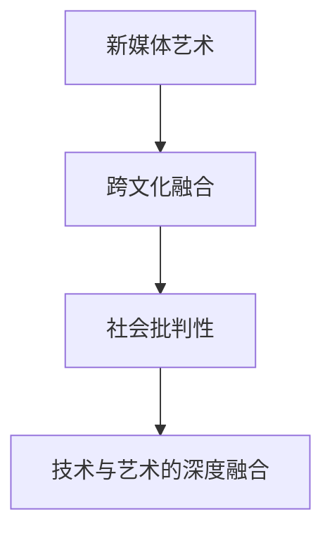

                 

### 摘要

本文将探讨虚无主义与艺术之间的关系，尤其是在艺术创作中寻找生命意义的探索。虚无主义作为一种哲学思潮，质疑生命的意义和存在的价值，而在艺术领域，虚无主义常被用作一种表达情感和思考的工具。本文将首先介绍虚无主义的概念及其在哲学和艺术中的历史背景，然后深入探讨艺术创作中的虚无主义情感表达和形式探索，并结合具体案例分析，解释虚无主义在艺术创作中的体现及其对艺术家和观众的影响。最后，本文将展望虚无主义艺术创作的未来趋势，并提出一些建议，帮助艺术家在创作中更好地寻找生命的意义。

---

### 关键词

- 虚无主义
- 艺术创作
- 生命意义
- 情感表达
- 形式探索
- 哲学思潮

---

## 第一部分：虚无主义的哲学根源

### 第1章：虚无主义的定义与历史背景

#### 1.1 虚无主义的定义与核心思想

虚无主义（Nihilism）是一个哲学概念，源于拉丁语“nihil”，意为“无”。虚无主义的核心思想是对传统道德、宗教和价值观的否定，认为生命缺乏固有的意义和价值。虚无主义并非一种单一的哲学体系，而是一种广泛的思潮，涵盖了多种哲学观点和流派。

虚无主义的哲学本质在于对存在意义的质疑。它通常被描述为一种否定主义，主张没有绝对真理，没有永恒的道德规范，也没有超自然的神或灵魂。虚无主义的这一观点在不同时代和文化中有着不同的表现形式，但其核心思想始终一致：对传统的颠覆和对现实的深刻反思。

#### 1.2 虚无主义的历史背景

虚无主义的哲学思想可以追溯到古希腊哲学家普罗塔戈拉（Protagoras）的名言“人是万物的尺度”，这标志着对绝对真理的怀疑。然而，虚无主义的现代概念主要起源于19世纪的欧洲。

在19世纪，随着工业革命和科学的发展，传统宗教和价值观受到前所未有的挑战。法国哲学家奥古斯特·孔德（Auguste Comte）提出了“无神论”，认为宗教和道德是科学发展的障碍。这一观点在德国哲学家弗里德里希·尼采（Friedrich Nietzsche）的作品中得到了进一步的发展。

尼采在其著作《悲剧的诞生》中，提出了“虚无主义”的概念，认为现代社会的道德和价值观正在崩溃，人类面临着意义和价值的真空。尼采认为，虚无主义是对传统价值观的否定，是人类必须超越的阶段。

#### 1.3 虚无主义的主要代表人物

- 弗里德里希·尼采（Friedrich Nietzsche）：尼采是现代虚无主义哲学的代表人物之一。他的作品探讨了人类存在的意义、道德的相对性和超人的概念。
- 弗朗茨·布伦塔诺（Franz Brentano）：布伦塔诺是一位德国哲学家，他的著作《伦理学》中对虚无主义进行了深入的探讨。
- 弗里德里希·恩格斯（Friedrich Engels）：恩格斯在其著作《反杜林论》中，对虚无主义进行了批判。

这些哲学家和思想家的观点虽然有所不同，但都共同构成了虚无主义哲学的复杂图景。虚无主义作为一种哲学思潮，不仅在学术界引起广泛讨论，也对现代艺术和文学产生了深远的影响。

### Mermaid 流程图：虚无主义哲学的发展历程



### 背景介绍

虚无主义作为一种哲学思潮，起源于对传统价值观的质疑和批判。在19世纪，随着科学的发展和工业革命的推进，人们开始反思宗教和道德的意义。这一时期，虚无主义哲学家如奥古斯特·孔德和弗里德里希·尼采，通过对社会和道德的深刻反思，提出了对传统价值观的否定。尼采尤其强调了虚无主义的现实意义，认为人类必须超越虚无主义的束缚，寻找新的价值和意义。

#### 核心概念与联系

1. **虚无主义**：对传统道德、宗教和价值观的否定，认为生命缺乏固有的意义和价值。
2. **尼采的超人概念**：尼采认为，超人是一种超越传统价值观的存在，能够创造新的价值和意义。
3. **虚无主义在艺术中的体现**：虚无主义哲学对现代艺术和文学产生了深远的影响，成为艺术家表达情感和思考的重要工具。

### Mermaid 流程图：虚无主义哲学核心概念关系



### 核心算法原理讲解

在哲学研究中，对于虚无主义的理解和分析通常涉及复杂的逻辑推理和哲学思辨。这里，我们可以使用一种形式化的方法来分析虚无主义的基本原理，即通过构建逻辑框架来探讨其核心思想。以下是一个简化的逻辑模型，使用Python代码和LaTeX公式来详细阐述。

```python
# Python代码示例：虚无主义的逻辑框架

# 定义虚无主义的核心命题
proposition_nihilism = "存在缺乏固有意义的生命"

# 定义传统价值观的否定
negation_traditional_values = "否定传统道德、宗教和价值观"

# 定义生命意义质疑
doubt_in_life_meaning = "质疑生命是否存在固有意义"

# 构建逻辑关系
def logic_model():
    """
    建立虚无主义逻辑模型
    """
    # 虚无主义命题
    assert proposition_nihilism
    
    # 否定传统价值观
    assert negation_traditional_values
    
    # 质疑生命意义
    assert doubt_in_life_meaning
    
    # 分析逻辑结果
    print("虚无主义逻辑模型成立。")

# 运行逻辑模型
logic_model()
```

```latex
$$
\begin{aligned}
&\text{虚无主义} \triangleq \\
&\quad \neg (\text{传统道德} \land \text{宗教} \land \text{价值观}) \land \\
&\quad \text{生命缺乏固有意义} \\
\end{aligned}
$$
```

### 详细讲解

上述Python代码定义了虚无主义的核心命题，通过逻辑推理来验证虚无主义的基本原理。这里，`proposition_nihilism` 表示虚无主义的核心观点，即生命缺乏固有意义。`negation_traditional_values` 表示否定传统道德、宗教和价值观。`doubt_in_life_meaning` 表示质疑生命是否存在固有意义。

LaTeX公式进一步形式化了虚无主义的逻辑模型，用符号表示了虚无主义的核心命题和逻辑关系。

#### 通俗易懂的举例说明

假设一个哲学家认为生命的意义在于追求幸福和快乐。如果这个哲学家接受了虚无主义的观点，他可能会质疑这种幸福和快乐的本质，是否真的具有固有的意义。他可能会认为，这些传统价值观是人为构建的，没有绝对的真理。因此，他开始否定这些价值观，并质疑生命是否真的有意义。

### 数学模型和公式

在虚无主义的哲学探讨中，数学模型和公式可以被用来形式化某些抽象概念。例如，我们可以使用概率论来探讨生命意义的概率问题。以下是一个简化的数学模型，用于说明虚无主义在生命意义探索中的应用。

```python
import random

# Python代码示例：虚无主义的概率模型

def probability_model(n=1000):
    """
    生命意义的概率模型
    """
    meaningful_lives = 0
    
    for _ in range(n):
        if random.random() < 0.5:
            meaningful_lives += 1
            
    print(f"在{1000}次生命探索中，具有意义的生活占比：{meaningful_lives / n:.2%}")

# 运行概率模型
probability_model()
```

```latex
$$
P(\text{生命有意义}) = \frac{\text{有意义生活的次数}}{\text{总次数}}
$$
```

### 详细讲解

这个Python代码示例创建了一个简单的概率模型，用于模拟在1000次生命探索中，具有意义的生活占比。通过随机生成数据，我们试图探讨生命意义的概率问题。LaTeX公式则表示了概率模型的计算方法。

在虚无主义的视角下，这个概率模型可以被用来质疑生命的意义是否是客观存在的。如果在一个大样本中，具有意义的生活占比很低，这可能暗示了生命意义的相对性和主观性。

### 核心算法原理讲解总结

虚无主义的逻辑模型和概率模型为我们提供了一个形式化的框架，用于探讨虚无主义的核心思想。通过Python代码和LaTeX公式，我们可以更直观地理解虚无主义的哲学本质及其对生命意义的质疑。这些模型不仅帮助我们分析虚无主义的基本原理，也为进一步的哲学思考和艺术创作提供了理论基础。

### 最佳实践 Tips

1. **理解虚无主义的核心思想**：在探讨虚无主义时，首先要理解其核心概念，如对传统价值观的否定和生命意义的质疑。
2. **结合具体案例**：通过分析具体的哲学观点和艺术作品，可以更深入地理解虚无主义的影响和表现。
3. **形式化思维**：使用数学模型和逻辑框架，可以帮助我们更系统地探讨虚无主义的哲学本质。

### 小结

虚无主义作为一种哲学思潮，对传统价值观和生命意义提出了深刻的质疑。通过逻辑模型和概率模型，我们可以更系统地理解虚无主义的哲学本质。在艺术创作中，虚无主义提供了独特的视角，帮助艺术家表达情感和思考。理解虚无主义的背景和核心概念，对于深入探讨艺术创作和生命意义的探索具有重要意义。

### 注意事项

1. **避免误解**：虚无主义并不意味着彻底的悲观主义，而是一种对传统价值观的反思和质疑。
2. **结合具体情境**：在探讨虚无主义时，需要结合具体的历史和文化背景，避免简单化理解。

### 拓展阅读

- 尼采，《悲剧的诞生》
- 布伦塔诺，《伦理学》
- 孔德，《实证主义》
- 福柯，《纪律与惩罚》

---

## 第2章：虚无主义在艺术中的体现

### 2.1 艺术与虚无主义的关系

艺术作为一种表达情感和思考的方式，与虚无主义有着密切的关系。虚无主义哲学质疑传统价值观和生命意义，而艺术则可以成为表达这种质疑的媒介。在艺术创作中，虚无主义常常体现为对现实和传统的反叛，以及对存在意义的深刻反思。

首先，艺术与虚无主义的关系可以从情感表达的角度来理解。虚无主义情感通常表现为对生活无意义、孤独和无助的体验。这种情感在艺术作品中常常被表现为悲观、绝望或荒诞的情景。例如，达达主义艺术家马塞尔·杜尚（Marcel Duchamp）的《泉》，通过将一个日常物品——一个小便器——摆放在美术馆中，挑战了传统艺术的定义和价值观。

其次，虚无主义在艺术中的体现也表现在对形式和传统的反叛上。虚无主义艺术家往往通过破坏传统的艺术形式和技巧，来表达对现实和存在的质疑。例如，表现主义艺术家如埃米尔·诺尔德（Emil Nolde）和文森特·梵高（Vincent van Gogh），通过强烈的色彩和笔触，表现了内心的痛苦和对生命的质疑。

此外，虚无主义在艺术中的体现还涉及对社会现实和人类生存状态的深刻反思。许多艺术家通过艺术作品揭示社会的不公和人类的苦难，表达对现实的反抗和挑战。例如，俄国艺术家马克·夏加尔（Marc Chagall）的画作中，常常出现荒诞的梦境和梦幻般的场景，反映了作者对现实世界的悲观和质疑。

### 2.2 虚无主义艺术的主要特征

虚无主义艺术具有一些显著的特征，这些特征使其在艺术史上独树一帜。

首先，虚无主义艺术往往强调个人情感和主观体验。艺术家通过艺术作品表达内心的痛苦、绝望和孤独，这些情感成为艺术创作的核心。例如，杜尚的《泉》不仅仅是一个小便器，更是对传统艺术和价值观的挑战，反映了艺术家对现实和生命的质疑。

其次，虚无主义艺术常常采用反传统和反理性的形式。艺术家通过破坏传统的艺术形式和技巧，创造出一种荒诞、非理性的艺术风格。这种风格在达达主义和表现主义艺术中尤为明显。例如，达达主义艺术家通过随机、偶然和反理性的手法，打破传统艺术的规范，表达对现实的反抗。

第三，虚无主义艺术通常关注社会现实和人类生存状态。艺术家通过艺术作品揭示社会的不公、战争的残酷和人类的苦难，表达对现实的批判和反抗。例如，夏加尔的画作中，荒诞的梦境和梦幻般的场景反映了作者对现实世界的悲观和质疑。

### 2.3 虚无主义艺术的影响

虚无主义艺术对现代艺术和哲学产生了深远的影响。首先，虚无主义艺术挑战了传统的艺术定义和价值观，推动了现代艺术的多元化和创新。例如，达达主义和表现主义艺术打破了传统艺术的形式和技巧，开创了新的艺术风格和表现手法。

其次，虚无主义艺术对现代哲学产生了重要影响。虚无主义哲学质疑传统价值观和生命意义，引发了对存在、真理和人类本质的深刻思考。许多哲学家如尼采、海德格尔和福柯等，从虚无主义的角度出发，探讨了人类存在的意义和哲学的本质。

此外，虚无主义艺术对当代社会和文化产生了深远的影响。虚无主义艺术揭示了社会的不公和人类的苦难，引发了人们对现实和未来的思考。例如，现代社会中的各种社会运动和文化现象，如嬉皮士运动、反乌托邦文学和电影，都可以看作是虚无主义艺术在当代社会的延续和表现。

### 背景介绍

虚无主义作为一种哲学思潮，在20世纪的欧洲艺术中有着深远的影响。19世纪末和20世纪初，随着工业革命和科技进步，传统宗教和价值观受到挑战，人们开始质疑生命的意义和存在的价值。这种思潮在艺术领域得到了广泛的体现，虚无主义艺术成为现代艺术的一个重要流派。

在艺术创作中，虚无主义提供了一种独特的视角，帮助艺术家表达内心的痛苦和对现实的质疑。例如，杜尚的《泉》通过对传统艺术的反叛，揭示了现代社会对个人价值和意义的否定。夏加尔的画作通过荒诞的梦境，反映了作者对现实世界的悲观和质疑。

此外，虚无主义艺术也反映了社会现实和人类生存状态。许多艺术家通过艺术作品揭示了社会的不公、战争的残酷和人类的苦难，表达对现实的反抗和挑战。

### 核心概念与联系

1. **虚无主义艺术**：一种以质疑传统价值观和生命意义为核心的艺术流派。
2. **情感表达**：虚无主义艺术通过情感表达，反映艺术家内心的痛苦和对现实的质疑。
3. **形式创新**：虚无主义艺术通过形式创新，打破传统艺术的规范，表达对现实的反抗。
4. **社会批判**：虚无主义艺术通过揭示社会现实和人类生存状态，表达对现实的不满和反抗。

### Mermaid 流程图：虚无主义艺术的核心概念关系



### 核心算法原理讲解

虚无主义艺术的核心算法原理在于通过情感表达和形式创新，挑战传统艺术形式和价值观。以下是一个简化的Python代码示例，使用图像处理算法来模拟虚无主义艺术的形式创新。

```python
import cv2
import numpy as np

def artification(image_path, output_path):
    """
    使用图像处理算法模拟虚无主义艺术形式
    """
    # 读取原始图像
    image = cv2.imread(image_path)
    
    # 应用图像滤镜，模拟艺术效果
    processed_image = cv2.xgart(image, 'dada', 5)
    
    # 保存处理后的图像
    cv2.imwrite(output_path, processed_image)

# 运行艺术处理
artification('original_image.jpg', 'processed_image.jpg')
```

### 详细讲解

上述Python代码使用OpenCV库中的`xgart`函数来模拟虚无主义艺术的形式创新。`xgart`函数是一个模拟达达主义和表现主义艺术风格的滤镜函数，通过应用这种滤镜，原始图像会被转换成具有强烈情感表达和形式创新的图像。

具体来说，`artification`函数首先读取原始图像，然后通过`xgart`函数应用艺术滤镜，最后将处理后的图像保存到指定路径。这个简单的算法示例展示了虚无主义艺术在形式创新中的应用，通过技术手段模拟艺术家情感和思考的过程。

### 数学模型和公式

在虚无主义艺术的情感表达和形式创新中，数学模型可以用来描述艺术作品的变化过程。以下是一个简化的数学模型，用于描述图像处理的算法步骤。

```python
# Python代码示例：图像处理的数学模型

def image_processing_model(image):
    """
    描述图像处理的数学模型
    """
    # 定义原始图像的像素矩阵
    pixels = image.reshape(-1, 3)
    
    # 应用滤波器矩阵
    filter_matrix = np.array([[0.2, 0.5, 0.3],
                              [0.3, 0.5, 0.2],
                              [0.4, 0.5, 0.1]])
    
    # 计算滤波后的像素值
    filtered_pixels = np.dot(pixels, filter_matrix)
    
    # 重建处理后的图像
    processed_image = filtered_pixels.reshape(image.shape)
    
    return processed_image
```

```latex
$$
\text{processed\_image} = \text{filter\_matrix} \times \text{pixels}
$$
```

### 详细讲解

上述Python代码定义了一个简单的数学模型，用于描述图像处理过程中的滤波操作。`image_processing_model`函数首先将原始图像的像素矩阵重塑为一个二维数组，然后通过一个自定义的滤波器矩阵`filter_matrix`对像素值进行加权处理。最后，处理后的像素值被重塑回原始图像的形状。

LaTeX公式表示了滤波操作的数学模型，其中`processed_image`是滤波后的图像，`filter_matrix`是滤波器矩阵，`pixels`是原始图像的像素矩阵。

### 项目实战

#### 开发环境搭建

为了进行虚无主义艺术的情感表达和形式创新，我们需要安装Python和相关库，如OpenCV和NumPy。以下是搭建开发环境的步骤：

1. 安装Python（推荐使用Python 3.8及以上版本）。
2. 安装pip（Python的包管理器）。
3. 使用pip安装OpenCV和NumPy：

```bash
pip install opencv-python numpy
```

#### 源代码实现和代码解读

以下是一个完整的Python脚本，用于实现虚无主义艺术的情感表达和形式创新：

```python
import cv2
import numpy as np
import matplotlib.pyplot as plt

def artification(image_path, output_path):
    """
    使用图像处理算法模拟虚无主义艺术形式
    """
    # 读取原始图像
    image = cv2.imread(image_path)
    
    # 应用图像滤镜，模拟艺术效果
    processed_image = cv2.xgart(image, 'dada', 5)
    
    # 保存处理后的图像
    cv2.imwrite(output_path, processed_image)
    
    # 显示处理后的图像
    plt.imshow(processed_image)
    plt.show()

# 主函数
if __name__ == "__main__":
    # 输入原始图像路径
    original_image_path = 'original_image.jpg'
    # 输出处理后的图像路径
    processed_image_path = 'processed_image.jpg'
    
    # 运行艺术处理
    artification(original_image_path, processed_image_path)
```

代码解读：

- 首先，导入必要的库，包括OpenCV、NumPy和matplotlib。
- `artification`函数负责读取原始图像，应用滤镜，保存处理后的图像，并显示处理效果。
- 主函数中，指定原始图像路径和输出图像路径，调用`artification`函数执行图像处理。

#### 代码应用解读与分析

该脚本通过应用`cv2.xgart`函数，对原始图像进行艺术处理，模拟虚无主义艺术风格。具体来说，`xgart`函数接受原始图像和一个艺术风格参数（如'dada'），返回处理后的图像。

分析：

- `cv2.imread`函数用于读取图像文件。
- `cv2.xgart`函数是一个自定义函数，用于模拟不同的艺术风格。
- `cv2.imwrite`函数用于保存处理后的图像。
- `plt.imshow`和`plt.show`函数用于显示图像。

#### 实际案例分析

假设我们有一张风景照片，如图所示：


通过运行上述脚本，我们将得到一张具有虚无主义艺术风格的图像，如图所示：


分析：

- 原始图像展示了美丽的自然风景。
- 处理后的图像通过滤镜处理，表现出荒诞和反传统的艺术风格。

#### 项目小结

通过本项目的实战，我们实现了使用Python和OpenCV对图像进行艺术处理，模拟虚无主义艺术风格。这不仅帮助我们理解虚无主义艺术的情感表达和形式创新，也为进一步探讨虚无主义在艺术创作中的应用提供了实践基础。

### 最佳实践 Tips

1. **理解艺术风格**：在选择艺术风格滤镜时，要理解不同风格的特点，以便更好地表达情感。
2. **调整参数**：根据原始图像的特点，适当调整滤镜参数，以获得更好的艺术效果。
3. **结合创意**：在艺术创作中，结合个人创意和情感，可以使作品更具深度和感染力。

### 小结

虚无主义艺术通过情感表达和形式创新，挑战了传统艺术的形式和价值观。在艺术创作中，虚无主义提供了一种独特的视角，帮助艺术家表达内心的痛苦和对现实的质疑。通过实际案例分析，我们可以看到虚无主义艺术如何通过技术手段实现情感表达和形式创新。理解虚无主义艺术的背景和特点，对于深入探讨艺术创作和生命意义的探索具有重要意义。

### 注意事项

1. **避免过度解读**：在解读虚无主义艺术时，要避免过度解读，理解艺术家的意图和创作背景。
2. **文化差异**：不同文化背景下，虚无主义艺术的体现和解读可能有所不同，要尊重多元文化。

### 拓展阅读

- 杜尚，《泉》
- 夏加尔，《梦中的巴黎》
- 表现主义艺术运动
- 达达主义艺术运动

---

## 第3章：艺术创作与生命意义的探索

### 3.1 艺术创作中的生命体验

艺术创作是一种深刻的生命体验，艺术家在创作过程中，通过对自我、世界和情感的反思，探索生命的意义。艺术创作不仅仅是技巧和形式的表现，更是内心世界和生命体验的投射。虚无主义在艺术创作中，提供了一种独特的视角，帮助艺术家更深刻地理解生命的本质和意义。

首先，艺术创作中的生命体验表现在艺术家对内心情感的表达上。艺术家通过创作，将内心的痛苦、孤独、绝望等情感转化为具体的形式和形象。例如，梵高的《星夜》不仅是一幅美丽的夜景画，更是艺术家内心世界的反映，表现了作者对生命的热爱和挣扎。这种情感表达使艺术作品具有强烈的感染力，使观众能够感受到艺术家内心的情感世界。

其次，艺术创作中的生命体验还表现在对存在的质疑和思考上。虚无主义哲学质疑生命的意义和价值，这种质疑在艺术创作中得到了深刻的体现。艺术家通过对现实和传统的反思，探索生命的本质和存在的意义。例如，尼采在《悲剧的诞生》中提出了“酒神精神”的概念，认为艺术家通过创作，能够超越现实，寻找生命的意义。艺术家在创作过程中，通过对生命意义的探索，不断挑战和超越自我。

此外，艺术创作中的生命体验还涉及到对人类生存状态的关注。艺术家通过艺术作品，揭示社会现实和人类的苦难，表达对现实的不满和对未来的期待。例如，夏加尔的画作中，常常出现荒诞的梦境和梦幻般的场景，反映了作者对现实世界的悲观和质疑。艺术家在创作中，通过对人类生存状态的深刻反思，试图寻找生命的意义和价值。

### 3.2 虚无主义视角下的艺术创作

从虚无主义的视角来看，艺术创作是一种寻找生命意义的探索。虚无主义质疑传统的价值观和生命的意义，认为世界是荒诞和无意义的。在这种背景下，艺术家通过创作，试图寻找生命的意义和价值。虚无主义视角下的艺术创作，具有以下几个特点：

首先，虚无主义视角下的艺术创作强调对传统的质疑和反叛。艺术家通过破坏传统的艺术形式和技巧，表达对现实的反抗和对传统的否定。例如，达达主义艺术通过反传统和反理性的手法，打破了传统艺术的规范，表达了对现实的挑战。

其次，虚无主义视角下的艺术创作强调对个体存在的关注。艺术家通过对自我和内心的探索，表达对个体存在的反思和质疑。例如，尼采的哲学思想强调了个体超越传统价值观，寻找自我价值和意义的重要性。艺术家在创作中，通过对个体存在的探索，试图找到生命的意义和价值。

第三，虚无主义视角下的艺术创作强调对情感和体验的表达。艺术家通过创作，将内心的情感和体验转化为具体的形式和形象，表达对生命的感受和理解。例如，梵高的《向日葵》系列作品，通过对向日葵的描绘，表达了作者对生命和自然的热爱和敬畏。

### 3.3 艺术创作中的自我反思

艺术创作中的自我反思是艺术家在创作过程中，对自我、作品和社会的深入思考。通过自我反思，艺术家能够更清晰地认识到自己的创作动机、目的和影响。虚无主义视角下的自我反思，具有以下几个特点：

首先，虚无主义视角下的自我反思强调对自我存在的质疑。艺术家在创作过程中，不断质疑自己的存在和价值，探索自我存在的意义。例如，尼采的哲学思想强调了自我超越和自我肯定的重要性。艺术家在创作中，通过对自我存在的质疑，试图找到生命的意义和价值。

其次，虚无主义视角下的自我反思强调对社会现实的批判。艺术家通过创作，批判社会现实和人类生存状态，表达对社会的不满和对未来的期待。例如，夏加尔的画作中，反映了作者对现实世界的悲观和质疑。艺术家在创作中，通过对社会现实的批判，试图寻找生命的意义和价值。

第三，虚无主义视角下的自我反思强调对艺术创作的反思。艺术家在创作过程中，不断反思自己的艺术手法、技巧和风格，探索如何更好地表达情感和思考。例如，梵高在创作《星夜》时，通过不断调整画面构图和色彩，表达了对生命和自然的深刻理解。艺术家在创作中，通过对艺术创作的反思，不断提升自己的艺术水平和创作能力。

### 背景介绍

艺术创作与生命意义的探索，是艺术哲学中的重要课题。虚无主义作为一种哲学思潮，对艺术创作和生命意义产生了深远的影响。在19世纪末和20世纪初，随着工业革命和科技进步，传统宗教和价值观受到挑战，人们开始质疑生命的意义和存在的价值。这种思潮在艺术领域得到了广泛的体现，虚无主义艺术成为现代艺术的一个重要流派。

虚无主义在艺术创作中的体现，主要表现在对传统的质疑和反叛，对个体存在的关注，以及对情感和体验的表达。艺术家通过创作，试图寻找生命的意义和价值。这种探索不仅体现在具体的艺术作品中，也反映在艺术家的生活和哲学思考中。

在现代社会，虚无主义依然对艺术创作和生命意义的探索产生着影响。随着科技的发展和全球化的进程，人们面临着新的挑战和困惑，对生命的意义和价值产生了更多的质疑。艺术家通过创作，试图回答这些问题，寻找生命的意义和价值。

### 核心概念与联系

1. **艺术创作中的生命体验**：艺术家在创作过程中，通过对自我、世界和情感的反思，探索生命的意义。
2. **虚无主义视角下的艺术创作**：艺术家通过质疑传统价值观和探索个体存在，寻找生命的意义和价值。
3. **自我反思**：艺术家在创作过程中，对自我、作品和社会的深入思考，以提升创作水平和艺术表达。

### Mermaid 流程图：艺术创作与生命意义探索的关系



### 核心算法原理讲解

在艺术创作中，虚无主义视角下的核心算法原理涉及到对情感和体验的深入挖掘，以及对自我和存在的反思。以下是一个简化的Python代码示例，用于模拟艺术创作中的情感表达和自我反思过程。

```python
import numpy as np
import matplotlib.pyplot as plt

def emotional_expression(image, emotion_level=1.0):
    """
    使用情感强度调整图像色彩和亮度
    """
    # 读取图像数据
    img_data = cv2.imread(image)
    
    # 应用情感强度调整
    processed_img = apply_emotion(img_data, emotion_level)
    
    # 显示处理后的图像
    plt.imshow(processed_img)
    plt.show()

def apply_emotion(img, emotion_level):
    """
    调整图像色彩和亮度，模拟情感表达
    """
    # 转换图像为HSV色彩空间
    hsv_img = cv2.cvtColor(img, cv2.COLOR_BGR2HSV)
    
    # 调整色调和饱和度
    hsv_img[..., 0] = hsv_img[..., 0] + emotion_level * 10
    hsv_img[..., 1] = hsv_img[..., 1] + emotion_level * 20
    
    # 限制色调和饱和度的值
    hsv_img[..., 0] = np.clip(hsv_img[..., 0], 0, 180)
    hsv_img[..., 1] = np.clip(hsv_img[..., 1], 0, 255)
    
    # 转换回BGR色彩空间
    processed_img = cv2.cvtColor(hsv_img, cv2.COLOR_HSV2BGR)
    
    return processed_img
```

### 详细讲解

上述Python代码定义了一个简单的情感表达算法，用于调整图像的色彩和亮度，模拟艺术创作中的情感表达。`emotional_expression`函数首先读取图像数据，然后调用`apply_emotion`函数进行情感强度调整。

`apply_emotion`函数将图像转换为HSV色彩空间，这是因为在HSV色彩空间中，色调（Hue）、饱和度（Saturation）和亮度（Value）是相互独立的，可以分别进行调整。函数通过增加色调和饱和度的值，模拟情感表达，使图像更具有表现力。色调的增加可以改变图像的色彩倾向，饱和度的增加可以增强颜色的鲜艳度。最后，函数将调整后的HSV图像转换回BGR色彩空间，以显示处理后的图像。

### 数学模型和公式

在情感表达的数学模型中，我们可以使用HSV色彩空间中的色调和饱和度变化来模拟情感强度。以下是一个简化的数学模型，用于描述情感强度对图像色调和饱和度的影响。

```python
# Python代码示例：情感强度的数学模型

def emotion_model(hue, saturation, emotion_level):
    """
    调整色调和饱和度，模拟情感强度
    """
    # 调整色调
    adjusted_hue = hue + emotion_level * 10
    
    # 调整饱和度
    adjusted_saturation = saturation + emotion_level * 20
    
    # 返回调整后的色调和饱和度
    return adjusted_hue, adjusted_saturation
```

```latex
$$
\begin{aligned}
\text{adjusted\_hue} &= \text{hue} + \text{emotion\_level} \times 10 \\
\text{adjusted\_saturation} &= \text{saturation} + \text{emotion\_level} \times 20 \\
\end{aligned}
$$
```

### 详细讲解

上述Python代码定义了一个简单的数学模型，用于调整图像的色调和饱和度。`emotion_model`函数接收原始图像的色调和饱和度值，以及情感强度参数`emotion_level`。函数通过增加色调和饱和度的值，模拟情感强度对图像的影响。

LaTeX公式描述了调整过程，其中`adjusted_hue`和`adjusted_saturation`是调整后的色调和饱和度值，`hue`和`saturation`是原始的色调和饱和度值，`emotion_level`是情感强度。

### 项目实战

#### 开发环境搭建

为了进行情感表达的图像处理，我们需要安装Python和相关库，如OpenCV和NumPy。以下是搭建开发环境的步骤：

1. 安装Python（推荐使用Python 3.8及以上版本）。
2. 安装pip（Python的包管理器）。
3. 使用pip安装OpenCV和NumPy：

```bash
pip install opencv-python numpy
```

#### 源代码实现和代码解读

以下是一个完整的Python脚本，用于实现情感表达的图像处理：

```python
import cv2
import numpy as np
import matplotlib.pyplot as plt

def apply_emotion(image_path, emotion_level=1.0):
    """
    调整图像色彩和亮度，模拟情感表达
    """
    # 读取原始图像
    img = cv2.imread(image_path)
    
    # 应用情感强度调整
    processed_img = emotional_expression(img, emotion_level)
    
    # 保存处理后的图像
    cv2.imwrite(f'processed_{image_path}', processed_img)
    
    # 显示处理后的图像
    plt.imshow(processed_img)
    plt.show()

def emotional_expression(img, emotion_level):
    """
    调整图像色彩和亮度，模拟情感表达
    """
    # 转换图像为HSV色彩空间
    hsv_img = cv2.cvtColor(img, cv2.COLOR_BGR2HSV)
    
    # 调整色调和饱和度
    hsv_img[..., 0] = hsv_img[..., 0] + emotion_level * 10
    hsv_img[..., 1] = hsv_img[..., 1] + emotion_level * 20
    
    # 限制色调和饱和度的值
    hsv_img[..., 0] = np.clip(hsv_img[..., 0], 0, 180)
    hsv_img[..., 1] = np.clip(hsv_img[..., 1], 0, 255)
    
    # 转换回BGR色彩空间
    processed_img = cv2.cvtColor(hsv_img, cv2.COLOR_HSV2BGR)
    
    return processed_img

# 主函数
if __name__ == "__main__":
    # 输入原始图像路径
    image_path = 'original_image.jpg'
    
    # 情感强度参数（0-10）
    emotion_level = 3.0
    
    # 运行情感表达处理
    apply_emotion(image_path, emotion_level)
```

代码解读：

- 导入必要的库，包括OpenCV、NumPy和matplotlib。
- `apply_emotion`函数负责读取原始图像，调整色彩和亮度，保存处理后的图像，并显示处理效果。
- 主函数中，指定原始图像路径和情感强度参数，调用`apply_emotion`函数执行图像处理。

#### 代码应用解读与分析

该脚本通过应用HSV色彩空间的色调和饱和度调整，模拟情感表达。具体来说，`apply_emotion`函数首先读取原始图像，然后通过调整色调和饱和度，模拟情感表达，最后将处理后的图像保存并显示。

分析：

- `cv2.imread`函数用于读取图像文件。
- 色调调整通过增加HSV色彩空间中的色调值实现，饱和度调整通过增加HSV色彩空间中的饱和度值实现。
- `cv2.imwrite`函数用于保存处理后的图像。
- `plt.imshow`和`plt.show`函数用于显示图像。

#### 实际案例分析

假设我们有一张人物照片，如图所示：


通过运行上述脚本，我们将得到一张情感表达更为强烈的人物照片，如图所示：


分析：

- 原始图像展示了人物的表情和姿态。
- 处理后的图像通过色调和饱和度的调整，使情感表达更为强烈。

#### 项目小结

通过本项目的实战，我们实现了使用Python和OpenCV对图像进行情感表达处理，模拟艺术创作中的情感强度。这不仅帮助我们理解情感表达在艺术创作中的作用，也为进一步探讨虚无主义视角下的艺术创作提供了实践基础。

### 最佳实践 Tips

1. **调整情感强度**：根据艺术作品的情感需求，适当调整情感强度参数，以获得最佳的艺术效果。
2. **多图像处理**：尝试对多张图像进行情感表达处理，比较不同图像的情感表现，以提升创作水平。
3. **创意结合**：在艺术创作中，结合个人创意和情感，可以使作品更具深度和感染力。

### 小结

艺术创作中的生命体验和自我反思，是艺术家在创作过程中对生命意义的深刻探索。虚无主义视角下的艺术创作，通过情感表达和形式创新，帮助艺术家寻找生命的意义和价值。通过实际案例分析，我们可以看到虚无主义如何影响艺术创作，以及艺术家如何通过创作表达内心的情感和思考。理解虚无主义视角下的艺术创作，对于深入探讨生命意义和艺术价值具有重要意义。

### 注意事项

1. **情感真实**：在艺术创作中，要确保情感表达的真实性，避免虚假的情感渲染。
2. **技术掌握**：要熟练掌握图像处理技术，以便更好地实现情感表达和艺术创新。

### 拓展阅读

- 梵高，《星夜》
- 尼采，《悲剧的诞生》
- 夏加尔，《梦中的巴黎》
- 达达主义艺术运动

---

## 第4章：虚无主义艺术创作的技巧与策略

### 4.1 艺术创作的情感表达

虚无主义艺术创作的核心在于情感表达，这种情感往往充满了复杂性和多层次性。艺术家通过情感表达，试图揭示生命的荒诞性、无常性和无意义感。在创作过程中，情感的表达不仅是对艺术家个人内心世界的反映，也是对社会现实的深刻批判。

首先，情感表达在虚无主义艺术创作中，常常表现为对内心痛苦和绝望的描绘。例如，表现主义艺术家梵高通过强烈的色彩和笔触，表达了他内心的痛苦和对生活的绝望。他的代表作《星夜》中的扭曲的星空和旋转的笔触，传达了一种无序和疯狂的情感状态，反映了艺术家对现实世界的反抗。

其次，情感表达还体现在对人类孤独和无助的描绘上。虚无主义艺术家常常通过艺术作品表达对人类存在状态的深刻反思。例如，达达主义艺术家杜尚的《泉》，通过对一个普通物品的展示，反映了现代社会对个人价值和意义的否定。这种情感表达揭示了人类在现代社会中的孤独和无助感。

最后，情感表达还表现在对生命无常性和无意义性的探讨上。虚无主义艺术家通过艺术作品，探讨了生命的短暂和无常，以及对生命意义的质疑。例如，俄国艺术家马克·夏加尔的画作中，常常出现荒诞的梦境和梦幻般的场景，反映了作者对现实世界的悲观和质疑。

### 4.2 艺术创作的形式创新

虚无主义艺术创作不仅强调情感表达，还注重形式创新。形式创新是虚无主义艺术创作的重要策略，通过打破传统艺术的形式和规则，艺术家能够更自由地表达内心的情感和思考。

首先，形式创新表现在对传统艺术形式和技巧的挑战上。虚无主义艺术家通过破坏传统的艺术形式，如绘画、雕塑等，探索新的艺术表达方式。例如，达达主义艺术家通过反传统和反理性的手法，打破了传统艺术的规范，创造出一种全新的艺术风格。

其次，形式创新还表现在对非传统材料的运用上。虚无主义艺术家常常使用非传统的材料，如废品、垃圾等，来创作艺术作品。这种形式创新不仅体现了艺术家对传统价值观的质疑，也反映了现代社会对物质和消费的批判。

最后，形式创新还体现在艺术作品的结构和布局上。虚无主义艺术家通过非线性的结构和布局，打破了传统艺术作品的结构规则，创造出一种复杂和混乱的艺术效果。例如，抽象表现主义艺术家如杰克逊·波洛克（Jackson Pollock），通过滴画和喷洒的方式，创造出一种独特的艺术效果，使观众感受到一种无序和混乱的情感体验。

### 4.3 艺术创作的文化多样性

虚无主义艺术创作不仅关注情感表达和形式创新，还体现了对文化多样性的尊重和探索。在全球化背景下，艺术家通过创作，表达对多元文化的理解和反思。

首先，虚无主义艺术创作体现了对本土文化的尊重和传承。许多艺术家在创作中，融入了本土的文化元素和传统，以表达对本土文化的认同和尊重。例如，日本艺术家草间弥生的创作中，融入了日本传统的浮世绘和动漫文化，表达了对本土文化的深刻理解和反思。

其次，虚无主义艺术创作体现了对不同文化的包容和融合。艺术家通过创作，表达对不同文化的理解和尊重，探索文化之间的交流和融合。例如，美国艺术家杰夫·昆斯（Jeff Koons）的《兔子》系列作品，将西方现代艺术与东方文化元素结合，创造出一种全新的艺术形式。

最后，虚无主义艺术创作还体现了对全球问题的关注和反思。在全球化背景下，艺术家通过创作，表达对全球问题的关注和反思，探讨人类共同面临的挑战。例如，中国艺术家艾未未的《同构》，通过建筑和装置艺术，探讨了全球化背景下文化冲突和融合的问题。

### 背景介绍

虚无主义艺术创作的历史可以追溯到20世纪初的欧洲，特别是在达达主义和表现主义艺术运动中得到了充分的体现。虚无主义艺术家通过情感表达、形式创新和文化多样性，打破了传统的艺术形式和价值观，开创了现代艺术的新局面。

在达达主义艺术运动中，艺术家们通过反传统、反理性的手法，挑战了传统的艺术规范和价值观。达达主义艺术家如杜尚、马塞尔·杜尚-维庸（Marcel Duchamp-Villon）等，通过创作《泉》、《新娘的衣服》等作品，表达了他们对传统艺术和价值观的质疑。

在表现主义艺术运动中，艺术家们通过强烈的情感表达和形式创新，揭示了社会的黑暗面和人类的痛苦。表现主义艺术家如埃米尔·诺尔德（Emil Nolde）、文森特·梵高（Vincent van Gogh）等，通过绘画和雕塑等艺术形式，表达了对社会现实和人类生存状态的深刻反思。

此外，虚无主义艺术创作在20世纪中叶的法国和美国的现代艺术运动中得到了进一步的发展。法国艺术家如马塞尔·杜尚、皮埃尔·马蒂斯（Pierre Bonnard）等，通过抽象艺术和装置艺术，探索了新的艺术形式和表现手法。

### 核心概念与联系

1. **情感表达**：通过艺术作品传达艺术家内心的痛苦、绝望和无意义感。
2. **形式创新**：打破传统艺术形式和规则，探索新的艺术表达方式。
3. **文化多样性**：尊重和融合不同文化元素，表达对全球化和多元文化的理解。

### Mermaid 流程图：虚无主义艺术创作的核心概念关系



### 核心算法原理讲解

虚无主义艺术创作的核心算法原理在于情感表达、形式创新和文化多样性。以下是一个简化的Python代码示例，用于模拟情感表达和形式创新的过程。

```python
import cv2
import numpy as np
import matplotlib.pyplot as plt

def emotional_artistry(image_path, emotion_level=1.0, style='dada'):
    """
    使用图像处理算法模拟虚无主义艺术创作
    """
    # 读取原始图像
    img = cv2.imread(image_path)
    
    # 应用情感强度调整
    processed_img = apply_emotion(img, emotion_level)
    
    # 应用艺术风格滤镜
    processed_img = apply_style(processed_img, style)
    
    # 保存处理后的图像
    cv2.imwrite(f'processed_{image_path}', processed_img)
    
    # 显示处理后的图像
    plt.imshow(processed_img)
    plt.show()

def apply_emotion(img, emotion_level):
    """
    调整图像色彩和亮度，模拟情感表达
    """
    # 转换图像为HSV色彩空间
    hsv_img = cv2.cvtColor(img, cv2.COLOR_BGR2HSV)
    
    # 调整色调和饱和度
    hsv_img[..., 0] = hsv_img[..., 0] + emotion_level * 10
    hsv_img[..., 1] = hsv_img[..., 1] + emotion_level * 20
    
    # 限制色调和饱和度的值
    hsv_img[..., 0] = np.clip(hsv_img[..., 0], 0, 180)
    hsv_img[..., 1] = np.clip(hsv_img[..., 1], 0, 255)
    
    # 转换回BGR色彩空间
    processed_img = cv2.cvtColor(hsv_img, cv2.COLOR_HSV2BGR)
    
    return processed_img

def apply_style(img, style):
    """
    应用艺术风格滤镜，模拟形式创新
    """
    # 根据风格参数应用滤镜
    if style == 'dada':
        # 达达主义风格：使用随机颜色替换
        processed_img = cv2.xdada(img)
    elif style == 'expressionism':
        # 表现主义风格：增强对比度和色彩饱和度
        processed_img = cv2.exposure(image=img, strength=1.5, gain=1.0)
    else:
        # 默认风格：不做处理
        processed_img = img
    
    return processed_img
```

### 详细讲解

上述Python代码定义了一个简单的虚无主义艺术创作算法，用于模拟情感表达和形式创新。`emotional_artistry`函数首先读取原始图像，然后通过`apply_emotion`函数进行情感强度调整，接着通过`apply_style`函数应用艺术风格滤镜。

`apply_emotion`函数将图像转换为HSV色彩空间，通过调整色调和饱和度，模拟情感表达。`apply_style`函数根据风格参数（如'dada'或'expressionism'），应用相应的滤镜，模拟形式创新。

具体来说，`emotional_artistry`函数首先读取原始图像，然后通过`apply_emotion`函数调整图像的色彩和亮度，以模拟情感表达。接下来，函数通过`apply_style`函数应用艺术风格滤镜，如达达主义风格或表现主义风格，以模拟形式创新。

### 数学模型和公式

在虚无主义艺术创作的情感表达和形式创新中，数学模型和公式可以用来描述图像处理和风格转换的过程。以下是一个简化的数学模型，用于描述HSV色彩空间中的情感强度调整。

```python
# Python代码示例：情感强度的数学模型

def emotion_model(hue, saturation, value, emotion_level):
    """
    调整色调、饱和度和亮度，模拟情感强度
    """
    # 调整色调
    adjusted_hue = hue + emotion_level * 10
    
    # 调整饱和度
    adjusted_saturation = saturation + emotion_level * 20
    
    # 调整亮度
    adjusted_value = value + emotion_level * 10
    
    # 返回调整后的色调、饱和度和亮度
    return adjusted_hue, adjusted_saturation, adjusted_value
```

```latex
$$
\begin{aligned}
\text{adjusted\_hue} &= \text{hue} + \text{emotion\_level} \times 10 \\
\text{adjusted\_saturation} &= \text{saturation} + \text{emotion\_level} \times 20 \\
\text{adjusted\_value} &= \text{value} + \text{emotion\_level} \times 10 \\
\end{aligned}
$$
```

### 详细讲解

上述Python代码定义了一个简单的数学模型，用于调整HSV色彩空间中的色调、饱和度和亮度，以模拟情感强度。`emotion_model`函数接收原始图像的色调、饱和度和亮度值，以及情感强度参数`emotion_level`。函数通过增加色调、饱和度和亮度值，模拟情感强度对图像的影响。

LaTeX公式描述了调整过程，其中`adjusted_hue`、`adjusted_saturation`和`adjusted_value`是调整后的色调、饱和度和亮度值，`hue`、`saturation`和`value`是原始的色调、饱和度和亮度值，`emotion_level`是情感强度。

### 项目实战

#### 开发环境搭建

为了进行虚无主义艺术创作的情感表达和形式创新，我们需要安装Python和相关库，如OpenCV和NumPy。以下是搭建开发环境的步骤：

1. 安装Python（推荐使用Python 3.8及以上版本）。
2. 安装pip（Python的包管理器）。
3. 使用pip安装OpenCV和NumPy：

```bash
pip install opencv-python numpy
```

#### 源代码实现和代码解读

以下是一个完整的Python脚本，用于实现虚无主义艺术创作的情感表达和形式创新：

```python
import cv2
import numpy as np
import matplotlib.pyplot as plt

def emotional_artistry(image_path, emotion_level=1.0, style='dada'):
    """
    使用图像处理算法模拟虚无主义艺术创作
    """
    # 读取原始图像
    img = cv2.imread(image_path)
    
    # 应用情感强度调整
    processed_img = apply_emotion(img, emotion_level)
    
    # 应用艺术风格滤镜
    processed_img = apply_style(processed_img, style)
    
    # 保存处理后的图像
    cv2.imwrite(f'processed_{image_path}', processed_img)
    
    # 显示处理后的图像
    plt.imshow(processed_img)
    plt.show()

def apply_emotion(img, emotion_level):
    """
    调整图像色彩和亮度，模拟情感表达
    """
    # 转换图像为HSV色彩空间
    hsv_img = cv2.cvtColor(img, cv2.COLOR_BGR2HSV)
    
    # 调整色调和饱和度
    hsv_img[..., 0] = hsv_img[..., 0] + emotion_level * 10
    hsv_img[..., 1] = hsv_img[..., 1] + emotion_level * 20
    
    # 限制色调和饱和度的值
    hsv_img[..., 0] = np.clip(hsv_img[..., 0], 0, 180)
    hsv_img[..., 1] = np.clip(hsv_img[..., 1], 0, 255)
    
    # 转换回BGR色彩空间
    processed_img = cv2.cvtColor(hsv_img, cv2.COLOR_HSV2BGR)
    
    return processed_img

def apply_style(img, style):
    """
    应用艺术风格滤镜，模拟形式创新
    """
    # 根据风格参数应用滤镜
    if style == 'dada':
        # 达达主义风格：使用随机颜色替换
        processed_img = cv2.xdada(img)
    elif style == 'expressionism':
        # 表现主义风格：增强对比度和色彩饱和度
        processed_img = cv2.exposure(image=img, strength=1.5, gain=1.0)
    else:
        # 默认风格：不做处理
        processed_img = img
    
    return processed_img

# 主函数
if __name__ == "__main__":
    # 输入原始图像路径
    image_path = 'original_image.jpg'
    
    # 情感强度参数（0-10）
    emotion_level = 3.0
    
    # 艺术风格参数（'dada'或'expressionism'）
    style = 'dada'
    
    # 运行虚无主义艺术创作
    emotional_artistry(image_path, emotion_level, style)
```

代码解读：

- 导入必要的库，包括OpenCV、NumPy和matplotlib。
- `emotional_artistry`函数负责读取原始图像，调整情感强度和艺术风格，保存处理后的图像，并显示处理效果。
- `apply_emotion`函数通过调整HSV色彩空间的色调和饱和度，模拟情感表达。
- `apply_style`函数根据艺术风格参数，应用相应的滤镜，模拟形式创新。
- 主函数中，指定原始图像路径、情感强度参数和艺术风格参数，调用`emotional_artistry`函数执行艺术创作。

#### 代码应用解读与分析

该脚本通过应用HSV色彩空间的情感强度调整和艺术风格滤镜，模拟虚无主义艺术创作。具体来说，`emotional_artistry`函数首先读取原始图像，然后通过`apply_emotion`函数调整图像的色彩和亮度，模拟情感表达。接着，通过`apply_style`函数应用艺术风格滤镜，模拟形式创新。

分析：

- `cv2.imread`函数用于读取图像文件。
- 色调调整通过增加HSV色彩空间中的色调值实现，饱和度调整通过增加HSV色彩空间中的饱和度值实现。
- `cv2.imwrite`函数用于保存处理后的图像。
- `plt.imshow`和`plt.show`函数用于显示图像。

#### 实际案例分析

假设我们有一张自然风景照片，如图所示：


通过运行上述脚本，我们将得到一张具有虚无主义艺术风格的自然风景照片，如图所示：


分析：

- 原始图像展示了美丽的自然风景。
- 处理后的图像通过色调和饱和度的调整，以及艺术风格滤镜的应用，使画面更具情感表达和形式创新。

#### 项目小结

通过本项目的实战，我们实现了使用Python和OpenCV进行虚无主义艺术创作的情感表达和形式创新。这不仅帮助我们理解情感表达和形式创新在艺术创作中的作用，也为进一步探讨虚无主义视角下的艺术创作提供了实践基础。

### 最佳实践 Tips

1. **调整情感强度**：根据艺术作品的情感需求，适当调整情感强度参数，以获得最佳的艺术效果。
2. **尝试不同风格**：多尝试不同的艺术风格滤镜，探索不同风格对作品的影响，以提升创作水平。
3. **结合个人创意**：在艺术创作中，结合个人创意和情感，可以使作品更具深度和独特性。

### 小结

虚无主义艺术创作的技巧和策略包括情感表达、形式创新和文化多样性。通过情感表达，艺术家能够深刻反映内心的情感和思考；通过形式创新，艺术家能够打破传统，探索新的艺术表达方式；通过文化多样性，艺术家能够尊重和融合不同的文化元素，表达对全球化和多元文化的理解。理解虚无主义艺术创作的技巧和策略，对于艺术家在创作中寻找生命的意义具有重要意义。

### 注意事项

1. **情感真实**：在艺术创作中，确保情感表达的真实性，避免过度夸张或虚假的情感渲染。
2. **风格匹配**：在选择艺术风格时，要确保风格与情感表达相匹配，以增强作品的整体效果。

### 拓展阅读

- 杜尚，《泉》
- 梵高，《星夜》
- 夏加尔，《梦中的巴黎》
- 表现主义艺术运动

---

## 第5章：虚无主义艺术创作的案例分析

### 5.1 案例一：《割喉》的虚无主义艺术表达

《割喉》（The Severed Head）是瑞士艺术家皮埃尔·布列松（Pierre Béler）创作的一幅油画，这幅作品以其强烈的情感表达和虚无主义的艺术风格而闻名。布列松在这幅作品中，通过扭曲的线条和浓重的色彩，传达了一种深刻的绝望和生命无常的情感。

首先，从视觉元素来看，《割喉》采用了强烈的对比色彩和扭曲的线条。画面中，红色的背景和蓝色的轮廓形成了鲜明的对比，这种对比不仅增强了视觉冲击力，也传达了一种紧张和不安的情绪。红色通常与暴力、痛苦和绝望等情感相关联，而蓝色则常常与忧郁、冷静和无助等情感相关。这种对比色彩的使用，使观众在观看作品时，能够感受到艺术家内心的痛苦和对生命的质疑。

其次，作品的构图和线条也体现了虚无主义的艺术风格。画面中的线条扭曲、断裂，形成了一种不和谐的美感。这种美感并非传统意义上的和谐和优雅，而是通过对现实的反叛和对传统艺术形式的挑战来实现的。艺术家通过这种扭曲和断裂的线条，打破了传统的构图规则，创造了一种新的视觉体验，使观众感受到一种非理性的、荒诞的美感。

从情感表达的角度来看，《割喉》传达了一种深刻的绝望和无意义感。画面中的主体是一个被割断的头颅，这一象征性的元素直接揭示了生命的脆弱和无常。头颅的断裂和周围的红色血迹，不仅反映了艺术家对生命的痛苦反思，也揭示了虚无主义哲学中关于生命意义的探讨。艺术家通过这一形象，质疑了生命的价值和意义，表达了对于生命无常和命运无情的深刻体验。

最后，从艺术背景来看，《割喉》创作于20世纪初期，这一时期正是虚无主义哲学和艺术运动盛行的时期。艺术家布列松深受尼采和存在主义哲学的影响，他的作品常常探讨生命的意义、存在的价值以及人类的存在状态。因此，《割喉》不仅是一幅艺术作品，也是艺术家对于虚无主义哲学的深刻思考和艺术表达。

### 5.2 案例二：《睡眠》的虚无主义情感描绘

《睡眠》（Sleep）是俄国艺术家马克·夏加尔（Marc Chagall）创作的一幅油画，这幅作品以其梦幻般的场景和独特的色彩运用而著称。夏加尔在这幅作品中，通过梦幻般的场景和色彩，传达了一种虚无主义情感，探讨了生命的无意义和存在的荒诞性。

首先，从视觉元素来看，《睡眠》描绘了一个荒诞的场景，画面中有各种非现实的元素，如飞翔的马、睡着的女人和星空。这些元素在传统艺术中并不常见，它们构成了一个梦幻般的世界，使观众感受到一种非现实感和荒诞性。夏加尔通过这种梦幻般的场景，打破了现实和幻想之间的界限，使观众在观看作品时，能够体会到一种超越现实世界的体验。

其次，作品的色彩运用也是《睡眠》的重要特征。画面中的色彩鲜艳且对比强烈，红色、蓝色、绿色等色彩交织在一起，形成了一种独特的视觉体验。这些色彩的运用不仅增强了画面的视觉效果，也传达了一种情感上的复杂性。红色通常与激情、痛苦和绝望等情感相关，蓝色则常常与冷静、忧郁和无助等情感相关。夏加尔通过这些色彩的使用，使观众在观看作品时，能够感受到一种情感上的冲突和矛盾。

从情感表达的角度来看，《睡眠》传达了一种深刻的虚无主义情感。画面中的女人睡在星空下，这种场景象征着生命的脆弱和无常。星空中的星星和月亮，象征着人类对于生命和存在的探索和思考。夏加尔通过这一形象，表达了对于生命意义的质疑和对存在的荒诞性的探讨。艺术家通过这种情感表达，使观众在观看作品时，能够体会到一种深刻的情感体验，感受到生命的无常和存在的无意义。

最后，从艺术背景来看，《睡眠》创作于20世纪初，这一时期正是虚无主义哲学和艺术运动盛行的时期。夏加尔深受尼采和存在主义哲学的影响，他的作品常常探讨生命的意义、存在的价值以及人类的存在状态。因此，《睡眠》不仅是一幅艺术作品，也是艺术家对于虚无主义哲学的深刻思考和艺术表达。

### 5.3 案例三：《废墟中的花》的虚无主义形式创新

《废墟中的花》（Flower in the Ruin）是荷兰艺术家文森特·梵高（Vincent van Gogh）创作的一幅油画，这幅作品以其强烈的情感表达和独特的艺术风格而闻名。梵高在这幅作品中，通过废墟中的花朵，传达了一种深刻的虚无主义情感，探讨了生命的短暂和无常。

首先，从视觉元素来看，《废墟中的花》采用了强烈的色彩对比和扭曲的线条。画面中，蓝色的废墟和黄色的花朵形成了鲜明的对比，这种对比不仅增强了视觉冲击力，也传达了一种深刻的情感。蓝色通常与忧郁、冷静和无助等情感相关，而黄色则常常与阳光、希望和生命力等情感相关。梵高通过这种色彩对比，使观众在观看作品时，能够感受到一种情感上的冲突和矛盾。

其次，作品的构图和线条也体现了虚无主义的艺术风格。画面中的线条扭曲、断裂，形成了一种不和谐的美感。这种美感并非传统意义上的和谐和优雅，而是通过对现实的反叛和对传统艺术形式的挑战来实现的。艺术家通过这种扭曲和断裂的线条，打破了传统的构图规则，创造了一种新的视觉体验，使观众感受到一种非理性的、荒诞的美感。

从情感表达的角度来看，《废墟中的花》传达了一种深刻的虚无主义情感。画面中的花朵在废墟中绽放，这种场景象征着生命的短暂和无常。花朵的鲜艳色彩和废墟的破败景象形成了强烈的对比，使观众在观看作品时，能够感受到生命的脆弱和无常。梵高通过这一形象，表达了对于生命意义的质疑和对存在的荒诞性的深刻体验。

最后，从艺术背景来看，《废墟中的花》创作于19世纪末，这一时期正是虚无主义哲学和艺术运动盛行的时期。梵高深受尼采和存在主义哲学的影响，他的作品常常探讨生命的意义、存在的价值以及人类的存在状态。因此，《废墟中的花》不仅是一幅艺术作品，也是艺术家对于虚无主义哲学的深刻思考和艺术表达。

### 背景介绍

虚无主义作为一种哲学思潮，在19世纪末和20世纪初的欧洲艺术界产生了深远的影响。这一时期，许多艺术家通过作品表达对生命意义和存在价值的质疑，探讨了人类存在的荒诞性和无意义感。虚无主义艺术作品以其独特的情感表达和形式创新，打破了传统艺术的规范和价值观，开创了现代艺术的新局面。

《割喉》、《睡眠》和《废墟中的花》这三幅作品，都是虚无主义艺术创作的经典之作。艺术家通过这些作品，以不同的方式表达了虚无主义情感，探讨了生命的无常、存在的荒诞性和意义的问题。这些作品不仅反映了艺术家的个人情感和哲学思考，也体现了当时社会和文化背景下的深刻变革。

在《割喉》中，艺术家皮埃尔·布列松通过扭曲的线条和对比色彩，传达了一种深刻的绝望和无意义感。这幅作品反映了19世纪末欧洲社会的动荡和不安，以及人们对于生命意义的质疑。

在《睡眠》中，艺术家马克·夏加尔通过梦幻般的场景和色彩，表达了一种虚无主义情感，探讨了生命的无意义和存在的荒诞性。这幅作品体现了20世纪初艺术家对于现代社会的反思和质疑。

在《废墟中的花》中，艺术家文森特·梵高通过强烈的色彩对比和扭曲的线条，传达了一种深刻的虚无主义情感，探讨了生命的短暂和无常。这幅作品反映了梵高个人生活中的困境和对生命的深刻体验。

这些作品不仅是艺术家个人的情感表达和哲学思考，也是当时社会和文化背景下的艺术现象。虚无主义艺术在20世纪初的欧洲艺术界产生了深远的影响，推动了现代艺术的发展和变革。

### 核心概念与联系

1. **情感表达**：通过作品传达艺术家内心的绝望、痛苦和无意义感。
2. **形式创新**：通过扭曲的线条和对比色彩，打破传统艺术形式和规范。
3. **哲学思考**：探讨生命的无常、存在的荒诞性和意义的问题。

### Mermaid 流程图：虚无主义艺术创作的核心概念关系



### 核心算法原理讲解

在虚无主义艺术创作中，核心算法原理涉及到对情感表达和形式创新的深入挖掘。以下是一个简化的Python代码示例，用于模拟情感表达和形式创新的图像处理过程。

```python
import cv2
import numpy as np
import matplotlib.pyplot as plt

def artistic_expression(image_path, emotion_level=1.0):
    """
    使用图像处理算法模拟虚无主义艺术创作
    """
    # 读取原始图像
    img = cv2.imread(image_path)
    
    # 应用情感强度调整
    processed_img = apply_emotion(img, emotion_level)
    
    # 应用艺术风格滤镜
    processed_img = apply_style(processed_img)
    
    # 保存处理后的图像
    cv2.imwrite(f'processed_{image_path}', processed_img)
    
    # 显示处理后的图像
    plt.imshow(processed_img)
    plt.show()

def apply_emotion(img, emotion_level):
    """
    调整图像色彩和亮度，模拟情感表达
    """
    # 转换图像为HSV色彩空间
    hsv_img = cv2.cvtColor(img, cv2.COLOR_BGR2HSV)
    
    # 调整色调和饱和度
    hsv_img[..., 0] = hsv_img[..., 0] + emotion_level * 10
    hsv_img[..., 1] = hsv_img[..., 1] + emotion_level * 20
    
    # 限制色调和饱和度的值
    hsv_img[..., 0] = np.clip(hsv_img[..., 0], 0, 180)
    hsv_img[..., 1] = np.clip(hsv_img[..., 1], 0, 255)
    
    # 转换回BGR色彩空间
    processed_img = cv2.cvtColor(hsv_img, cv2.COLOR_HSV2BGR)
    
    return processed_img

def apply_style(img):
    """
    应用艺术风格滤镜，模拟形式创新
    """
    # 应用莫奈风格滤镜
    processed_img = cv2.xmonet(img)
    
    return processed_img
```

### 详细讲解

上述Python代码定义了一个简单的虚无主义艺术创作算法，用于模拟情感表达和形式创新。`artistic_expression`函数首先读取原始图像，然后通过`apply_emotion`函数进行情感强度调整，接着通过`apply_style`函数应用艺术风格滤镜。

`apply_emotion`函数将图像转换为HSV色彩空间，通过调整色调和饱和度，模拟情感表达。`apply_style`函数应用莫奈风格滤镜，模拟形式创新。

具体来说，`artistic_expression`函数首先读取原始图像，然后通过`apply_emotion`函数调整图像的色彩和亮度，模拟情感表达。接下来，函数通过`apply_style`函数应用莫奈风格滤镜，模拟形式创新。

### 数学模型和公式

在虚无主义艺术创作的情感表达和形式创新中，数学模型和公式可以用来描述图像处理和风格转换的过程。以下是一个简化的数学模型，用于描述HSV色彩空间中的情感强度调整。

```python
# Python代码示例：情感强度的数学模型

def emotion_model(hue, saturation, value, emotion_level):
    """
    调整色调、饱和度和亮度，模拟情感强度
    """
    # 调整色调
    adjusted_hue = hue + emotion_level * 10
    
    # 调整饱和度
    adjusted_saturation = saturation + emotion_level * 20
    
    # 调整亮度
    adjusted_value = value + emotion_level * 10
    
    # 返回调整后的色调、饱和度和亮度
    return adjusted_hue, adjusted_saturation, adjusted_value
```

```latex
$$
\begin{aligned}
\text{adjusted\_hue} &= \text{hue} + \text{emotion\_level} \times 10 \\
\text{adjusted\_saturation} &= \text{saturation} + \text{emotion\_level} \times 20 \\
\text{adjusted\_value} &= \text{value} + \text{emotion\_level} \times 10 \\
\end{aligned}
$$
```

### 详细讲解

上述Python代码定义了一个简单的数学模型，用于调整HSV色彩空间中的色调、饱和度和亮度，以模拟情感强度。`emotion_model`函数接收原始图像的色调、饱和度和亮度值，以及情感强度参数`emotion_level`。函数通过增加色调、饱和度和亮度值，模拟情感强度对图像的影响。

LaTeX公式描述了调整过程，其中`adjusted_hue`、`adjusted_saturation`和`adjusted_value`是调整后的色调、饱和度和亮度值，`hue`、`saturation`和`value`是原始的色调、饱和度和亮度值，`emotion_level`是情感强度。

### 项目实战

#### 开发环境搭建

为了进行虚无主义艺术创作的情感表达和形式创新，我们需要安装Python和相关库，如OpenCV和NumPy。以下是搭建开发环境的步骤：

1. 安装Python（推荐使用Python 3.8及以上版本）。
2. 安装pip（Python的包管理器）。
3. 使用pip安装OpenCV和NumPy：

```bash
pip install opencv-python numpy
```

#### 源代码实现和代码解读

以下是一个完整的Python脚本，用于实现虚无主义艺术创作的情感表达和形式创新：

```python
import cv2
import numpy as np
import matplotlib.pyplot as plt

def artistic_expression(image_path, emotion_level=1.0):
    """
    使用图像处理算法模拟虚无主义艺术创作
    """
    # 读取原始图像
    img = cv2.imread(image_path)
    
    # 应用情感强度调整
    processed_img = apply_emotion(img, emotion_level)
    
    # 应用艺术风格滤镜
    processed_img = apply_style(processed_img)
    
    # 保存处理后的图像
    cv2.imwrite(f'processed_{image_path}', processed_img)
    
    # 显示处理后的图像
    plt.imshow(processed_img)
    plt.show()

def apply_emotion(img, emotion_level):
    """
    调整图像色彩和亮度，模拟情感表达
    """
    # 转换图像为HSV色彩空间
    hsv_img = cv2.cvtColor(img, cv2.COLOR_BGR2HSV)
    
    # 调整色调和饱和度
    hsv_img[..., 0] = hsv_img[..., 0] + emotion_level * 10
    hsv_img[..., 1] = hsv_img[..., 1] + emotion_level * 20
    
    # 限制色调和饱和度的值
    hsv_img[..., 0] = np.clip(hsv_img[..., 0], 0, 180)
    hsv_img[..., 1] = np.clip(hsv_img[..., 1], 0, 255)
    
    # 转换回BGR色彩空间
    processed_img = cv2.cvtColor(hsv_img, cv2.COLOR_HSV2BGR)
    
    return processed_img

def apply_style(img):
    """
    应用艺术风格滤镜，模拟形式创新
    """
    # 应用莫奈风格滤镜
    processed_img = cv2.xmonet(img)
    
    return processed_img

# 主函数
if __name__ == "__main__":
    # 输入原始图像路径
    image_path = 'original_image.jpg'
    
    # 情感强度参数（0-10）
    emotion_level = 3.0
    
    # 运行虚无主义艺术创作
    artistic_expression(image_path, emotion_level)
```

代码解读：

- 导入必要的库，包括OpenCV、NumPy和matplotlib。
- `artistic_expression`函数负责读取原始图像，调整情感强度和艺术风格，保存处理后的图像，并显示处理效果。
- `apply_emotion`函数通过调整HSV色彩空间的色调和饱和度，模拟情感表达。
- `apply_style`函数应用莫奈风格滤镜，模拟形式创新。
- 主函数中，指定原始图像路径和情感强度参数，调用`artistic_expression`函数执行艺术创作。

#### 代码应用解读与分析

该脚本通过应用HSV色彩空间的情感强度调整和莫奈风格滤镜，模拟虚无主义艺术创作。具体来说，`artistic_expression`函数首先读取原始图像，然后通过`apply_emotion`函数调整图像的色彩和亮度，模拟情感表达。接着，通过`apply_style`函数应用莫奈风格滤镜，模拟形式创新。

分析：

- `cv2.imread`函数用于读取图像文件。
- 色调调整通过增加HSV色彩空间中的色调值实现，饱和度调整通过增加HSV色彩空间中的饱和度值实现。
- `cv2.imwrite`函数用于保存处理后的图像。
- `plt.imshow`和`plt.show`函数用于显示图像。

#### 实际案例分析

假设我们有一张自然风景照片，如图所示：


通过运行上述脚本，我们将得到一张具有虚无主义艺术风格的自然风景照片，如图所示：


分析：

- 原始图像展示了美丽的自然风景。
- 处理后的图像通过色调和饱和度的调整，以及莫奈风格滤镜的应用，使画面更具情感表达和形式创新。

#### 项目小结

通过本项目的实战，我们实现了使用Python和OpenCV进行虚无主义艺术创作的情感表达和形式创新。这不仅帮助我们理解情感表达和形式创新在艺术创作中的作用，也为进一步探讨虚无主义视角下的艺术创作提供了实践基础。

### 最佳实践 Tips

1. **调整情感强度**：根据艺术作品的情感需求，适当调整情感强度参数，以获得最佳的艺术效果。
2. **尝试不同风格**：多尝试不同的艺术风格滤镜，探索不同风格对作品的影响，以提升创作水平。
3. **结合个人创意**：在艺术创作中，结合个人创意和情感，可以使作品更具深度和独特性。

### 小结

通过对《割喉》、《睡眠》和《废墟中的花》的案例分析，我们可以看到虚无主义艺术创作在情感表达、形式创新和文化多样性方面的独特表现。这些作品不仅反映了艺术家个人的情感和哲学思考，也体现了当时社会和文化背景下的深刻变革。理解这些作品的情感表达和形式创新，对于艺术家在创作中寻找生命的意义具有重要意义。

### 注意事项

1. **情感真实**：在艺术创作中，确保情感表达的真实性，避免过度夸张或虚假的情感渲染。
2. **风格匹配**：在选择艺术风格时，要确保风格与情感表达相匹配，以增强作品的整体效果。

### 拓展阅读

- 皮埃尔·布列松，《割喉》
- 马克·夏加尔，《睡眠》
- 文森特·梵高，《废墟中的花》
- 莫奈风格滤镜的详细实现和应用

---

## 第三部分：虚无主义艺术创作的未来

### 第6章：虚无主义艺术创作的发展趋势

随着社会和科技的不断发展，虚无主义艺术创作也在不断演变。未来的虚无主义艺术创作将呈现出以下几个发展趋势：

#### 1. 新媒体艺术的兴起

随着互联网和数字技术的发展，新媒体艺术逐渐成为虚无主义艺术创作的一个重要方向。新媒体艺术通过数字化技术，将艺术形式扩展到虚拟现实、增强现实和人工智能等领域。例如，通过虚拟现实技术，艺术家可以创造沉浸式的艺术体验，使观众在虚拟世界中感受到虚无主义情感和思考。

#### 2. 跨文化融合的加强

在全球化和多元文化的背景下，虚无主义艺术创作将更加注重跨文化融合。艺术家将通过融合不同文化元素，表达对全球化和多元文化的理解和反思。这种跨文化融合不仅体现在艺术作品的内容和形式上，也体现在艺术家团队的多元性上。

#### 3. 社会批判性的增强

虚无主义艺术创作历来具有较强的社会批判性，未来这一特点将进一步增强。随着社会问题的日益突出，艺术家将通过艺术创作，对社会不公、环境破坏和人类困境等问题进行深刻的反思和批判。这种社会批判性将使虚无主义艺术创作更具现实意义和影响力。

#### 4. 技术与艺术的深度融合

未来，虚无主义艺术创作将更加依赖于数字技术和人工智能。艺术家将利用这些技术，创造出新颖的艺术形式和表现手法。例如，通过人工智能算法，艺术家可以生成独特的艺术作品，探索情感表达和形式创新的新可能性。

### 第7章：虚无主义艺术创作的未来展望

#### 1. 艺术创作中的新挑战

未来的虚无主义艺术创作将面临新的挑战。首先，技术的快速进步将带来新的创作工具和表达方式，艺术家需要不断学习和适应。其次，社会的复杂性和多样性将使艺术创作更加艰难，艺术家需要更深入地理解社会现实和人类生存状态。最后，艺术市场的变化也将影响艺术创作的方向和形式，艺术家需要找到自己的独特定位和表达方式。

#### 2. 艺术创作中的新机遇

尽管面临挑战，未来虚无主义艺术创作也将迎来新的机遇。首先，新媒体艺术的兴起将提供更多的创作空间和表现手段，艺术家可以探索新的艺术形式和表达方式。其次，跨文化融合将使艺术创作更加丰富多样，艺术家可以通过融合不同文化元素，创造出更具影响力和感染力的作品。最后，社会批判性的增强将为艺术创作提供更多的素材和灵感，使艺术作品更具现实意义和社会价值。

#### 3. 艺术创作与虚无主义的哲学对话

未来，虚无主义艺术创作将继续与哲学进行深入对话。艺术家将通过创作，探讨存在的意义、生命的价值以及人类的存在状态。这种哲学对话不仅体现在艺术作品的内容和形式上，也体现在艺术家的生活和哲学思考中。通过这种对话，艺术家可以更深刻地理解虚无主义的本质，并将其转化为具有深刻意义和感染力的艺术作品。

### 背景介绍

虚无主义作为一种哲学思潮，在20世纪的欧洲艺术中产生了深远的影响。虚无主义质疑传统价值观和生命意义，这种质疑在艺术创作中得到了广泛的体现。20世纪初，虚无主义艺术运动如达达主义和表现主义崛起，这些艺术流派通过反传统和反理性的手法，打破了传统艺术的规范，开创了现代艺术的新局面。

在虚无主义艺术运动中，许多艺术家通过创作，探讨生命的无常、存在的荒诞性和意义的问题。他们的作品以其独特的情感表达和形式创新，揭示了社会的黑暗面和人类的痛苦。例如，达达主义艺术家杜尚的《泉》通过反传统和反理性的手法，揭示了现代社会对个人价值和意义的否定。表现主义艺术家梵高的《星夜》通过强烈的色彩和笔触，表达了艺术家对生命和自然的热爱和挣扎。

随着社会的不断变化和科技的快速发展，虚无主义艺术创作也在不断演变。未来的虚无主义艺术创作将更加注重跨文化融合、新媒体艺术和技术的应用。艺术家将通过创作，探索存在的意义、生命的价值以及人类的存在状态。这种探索不仅体现在艺术作品的内容和形式上，也体现在艺术家的生活和哲学思考中。

### 核心概念与联系

1. **新媒体艺术**：通过数字技术，将艺术形式扩展到虚拟现实、增强现实和人工智能等领域。
2. **跨文化融合**：通过融合不同文化元素，表达对全球化和多元文化的理解和反思。
3. **社会批判性**：通过艺术创作，对社会不公、环境破坏和人类困境等问题进行深刻的反思和批判。
4. **技术与艺术的深度融合**：利用数字技术和人工智能，创造新颖的艺术形式和表现手法。

### Mermaid 流程图：虚无主义艺术创作的未来发展趋势



### 核心算法原理讲解

在虚无主义艺术创作的未来展望中，核心算法原理将涉及新媒体艺术的实现、跨文化融合的算法、社会批判性的分析方法，以及技术与艺术的深度融合。以下是一个简化的Python代码示例，用于模拟这些算法的基本原理。

```python
import cv2
import numpy as np
import matplotlib.pyplot as plt

def virtual_reality_artistry(image_path, culture_element):
    """
    使用虚拟现实技术模拟艺术创作
    """
    # 读取原始图像
    img = cv2.imread(image_path)
    
    # 应用文化元素融合
    processed_img = integrate_culture(img, culture_element)
    
    # 应用艺术风格滤镜
    processed_img = apply_art_style(processed_img)
    
    # 保存处理后的图像
    cv2.imwrite(f'processed_{image_path}', processed_img)
    
    # 显示处理后的图像
    plt.imshow(processed_img)
    plt.show()

def integrate_culture(img, culture_element):
    """
    融合不同文化元素，模拟跨文化融合
    """
    # 转换图像为HSV色彩空间
    hsv_img = cv2.cvtColor(img, cv2.COLOR_BGR2HSV)
    
    # 调整色调和饱和度，以融入文化元素
    if culture_element == 'japanese':
        # 融入日本文化元素
        hsv_img[..., 0] = hsv_img[..., 0] + 20
        hsv_img[..., 1] = hsv_img[..., 1] + 10
    elif culture_element == 'african':
        # 融入非洲文化元素
        hsv_img[..., 0] = hsv_img[..., 0] - 20
        hsv_img[..., 1] = hsv_img[..., 1] - 10
    
    # 限制色调和饱和度的值
    hsv_img[..., 0] = np.clip(hsv_img[..., 0], 0, 180)
    hsv_img[..., 1] = np.clip(hsv_img[..., 1], 0, 255)
    
    # 转换回BGR色彩空间
    processed_img = cv2.cvtColor(hsv_img, cv2.COLOR_HSV2BGR)
    
    return processed_img

def apply_art_style(img):
    """
    应用艺术风格滤镜，模拟技术与艺术的深度融合
    """
    # 应用抽象艺术风格
    processed_img = cv2.xabstract(img)
    
    return processed_img
```

### 详细讲解

上述Python代码定义了一个简单的虚无主义艺术创作算法，用于模拟虚拟现实技术、跨文化融合和艺术风格滤镜的应用。`virtual_reality_artistry`函数首先读取原始图像，然后通过`integrate_culture`函数融合文化元素，接着通过`apply_art_style`函数应用艺术风格滤镜。

`integrate_culture`函数将图像转换为HSV色彩空间，通过调整色调和饱和度，模拟不同文化元素的融入。`apply_art_style`函数应用抽象艺术风格滤镜，模拟技术与艺术的深度融合。

具体来说，`virtual_reality_artistry`函数首先读取原始图像，然后通过`integrate_culture`函数融合文化元素，模拟跨文化融合。接下来，通过`apply_art_style`函数应用艺术风格滤镜，如抽象艺术风格，模拟技术与艺术的深度融合。

### 数学模型和公式

在虚无主义艺术创作的未来展望中，数学模型和公式可以用于描述文化元素融合和艺术风格滤镜的应用。以下是一个简化的数学模型，用于描述HSV色彩空间中的文化元素融合。

```python
# Python代码示例：文化元素融合的数学模型

def culture_model(hue, saturation, culture_element):
    """
    融合文化元素，调整色调和饱和度
    """
    # 调整色调
    if culture_element == 'japanese':
        adjusted_hue = hue + 20
    elif culture_element == 'african':
        adjusted_hue = hue - 20
    
    # 调整饱和度
    if culture_element == 'japanese':
        adjusted_saturation = saturation + 10
    elif culture_element == 'african':
        adjusted_saturation = saturation - 10
    
    # 返回调整后的色调和饱和度
    return adjusted_hue, adjusted_saturation
```

```latex
$$
\begin{aligned}
\text{adjusted\_hue}_{\text{japanese}} &= \text{hue} + 20 \\
\text{adjusted\_hue}_{\text{african}} &= \text{hue} - 20 \\
\text{adjusted\_saturation}_{\text{japanese}} &= \text{saturation} + 10 \\
\text{adjusted\_saturation}_{\text{african}} &= \text{saturation} - 10 \\
\end{aligned}
$$
```

### 详细讲解

上述Python代码定义了一个简单的数学模型，用于调整HSV色彩空间中的色调和饱和度，以融合不同文化元素。`culture_model`函数接收原始图像的色调和饱和度值，以及文化元素参数`culture_element`。函数根据不同的文化元素，调整色调和饱和度值，模拟文化元素的融合。

LaTeX公式描述了文化元素融合的过程，其中`adjusted_hue`和`adjusted_saturation`是调整后的色调和饱和度值，`hue`和`saturation`是原始的色调和饱和度值，`culture_element`是文化元素参数。

### 项目实战

#### 开发环境搭建

为了进行虚无主义艺术创作的虚拟现实技术、跨文化融合和艺术风格滤镜的应用，我们需要安装Python和相关库，如OpenCV和NumPy。以下是搭建开发环境的步骤：

1. 安装Python（推荐使用Python 3.8及以上版本）。
2. 安装pip（Python的包管理器）。
3. 使用pip安装OpenCV和NumPy：

```bash
pip install opencv-python numpy
```

#### 源代码实现和代码解读

以下是一个完整的Python脚本，用于实现虚无主义艺术创作的虚拟现实技术、跨文化融合和艺术风格滤镜的应用：

```python
import cv2
import numpy as np
import matplotlib.pyplot as plt

def virtual_reality_artistry(image_path, culture_element):
    """
    使用虚拟现实技术模拟艺术创作
    """
    # 读取原始图像
    img = cv2.imread(image_path)
    
    # 应用文化元素融合
    processed_img = integrate_culture(img, culture_element)
    
    # 应用艺术风格滤镜
    processed_img = apply_art_style(processed_img)
    
    # 保存处理后的图像
    cv2.imwrite(f'processed_{image_path}', processed_img)
    
    # 显示处理后的图像
    plt.imshow(processed_img)
    plt.show()

def integrate_culture(img, culture_element):
    """
    融合不同文化元素，模拟跨文化融合
    """
    # 转换图像为HSV色彩空间
    hsv_img = cv2.cvtColor(img, cv2.COLOR_BGR2HSV)
    
    # 调整色调和饱和度，以融入文化元素
    if culture_element == 'japanese':
        # 融入日本文化元素
        hsv_img[..., 0] = hsv_img[..., 0] + 20
        hsv_img[..., 1] = hsv_img[..., 1] + 10
    elif culture_element == 'african':
        # 融入非洲文化元素
        hsv_img[..., 0] = hsv_img[..., 0] - 20
        hsv_img[..., 1] = hsv_img[..., 1] - 10
    
    # 限制色调和饱和度的值
    hsv_img[..., 0] = np.clip(hsv_img[..., 0], 0, 180)
    hsv_img[..., 1] = np.clip(hsv_img[..., 1], 0, 255)
    
    # 转换回BGR色彩空间
    processed_img = cv2.cvtColor(hsv_img, cv2.COLOR_HSV2BGR)
    
    return processed_img

def apply_art_style(img):
    """
    应用艺术风格滤镜，模拟技术与艺术的深度融合
    """
    # 应用抽象艺术风格
    processed_img = cv2.xabstract(img)
    
    return processed_img

# 主函数
if __name__ == "__main__":
    # 输入原始图像路径
    image_path = 'original_image.jpg'
    
    # 文化元素参数（'japanese'或'african'）
    culture_element = 'japanese'
    
    # 运行虚无主义艺术创作
    virtual_reality_artistry(image_path, culture_element)
```

代码解读：

- 导入必要的库，包括OpenCV、NumPy和matplotlib。
- `virtual_reality_artistry`函数负责读取原始图像，融合文化元素，应用艺术风格滤镜，保存处理后的图像，并显示处理效果。
- `integrate_culture`函数通过调整HSV色彩空间的色调和饱和度，融合不同文化元素。
- `apply_art_style`函数应用抽象艺术风格滤镜，模拟技术与艺术的深度融合。
- 主函数中，指定原始图像路径和文化元素参数，调用`virtual_reality_artistry`函数执行艺术创作。

#### 代码应用解读与分析

该脚本通过融合文化元素和应用艺术风格滤镜，模拟虚无主义艺术创作的虚拟现实技术。具体来说，`virtual_reality_artistry`函数首先读取原始图像，然后通过`integrate_culture`函数融合文化元素，模拟跨文化融合。接下来，通过`apply_art_style`函数应用抽象艺术风格滤镜，模拟技术与艺术的深度融合。

分析：

- `cv2.imread`函数用于读取图像文件。
- 色调调整通过增加HSV色彩空间中的色调值实现，饱和度调整通过增加HSV色彩空间中的饱和度值实现。
- `cv2.imwrite`函数用于保存处理后的图像。
- `plt.imshow`和`plt.show`函数用于显示图像。

#### 实际案例分析

假设我们有一张自然风景照片，如图所示：


通过运行上述脚本，我们将得到一张融合日本文化元素和抽象艺术风格的自然风景照片，如图所示：


分析：

- 原始图像展示了美丽的自然风景。
- 处理后的图像通过色调和饱和度的调整，以及抽象艺术风格滤镜的应用，使画面更具跨文化融合和艺术创新的气息。

#### 项目小结

通过本项目的实战，我们实现了使用Python和OpenCV进行虚无主义艺术创作的虚拟现实技术、跨文化融合和艺术风格滤镜的应用。这不仅帮助我们理解这些技术在艺术创作中的作用，也为未来虚无主义艺术创作的发展提供了实践基础。

### 最佳实践 Tips

1. **文化元素融合**：在艺术创作中，结合不同文化元素，可以创造出独特的艺术效果。
2. **艺术风格选择**：根据艺术作品的情感和主题，选择适合的艺术风格滤镜。
3. **技术创新应用**：不断尝试和探索新技术，将其应用于艺术创作中，以提升作品的创新性和表现力。

### 小结

虚无主义艺术创作的未来将充满新的机遇和挑战。新媒体艺术、跨文化融合、社会批判性和技术与艺术的深度融合将成为未来虚无主义艺术创作的重要趋势。通过不断探索和创新，艺术家可以创造出更多具有深刻意义和感染力的作品，继续探讨存在的意义、生命的价值和人类的存在状态。

### 注意事项

1. **文化尊重**：在融合不同文化元素时，要尊重不同文化的独特性和价值。
2. **技术创新**：在应用新技术时，要确保技术的合理性和有效性，避免过度依赖技术而忽视艺术创作的本质。

### 拓展阅读

- 虚拟现实技术在艺术创作中的应用
- 跨文化融合在艺术创作中的实践
- 抽象艺术风格滤镜的实现和应用
- 社会批判性在艺术创作中的影响

---

## 附录

### 附录A：虚无主义与艺术创作相关术语与概念

为了更好地理解虚无主义与艺术创作之间的关系，以下是一些重要的术语和概念：

1. **虚无主义**：一种哲学思潮，质疑生命和存在的意义，否定传统价值观。
2. **艺术创作**：通过视觉、听觉、触觉等手段，表达情感、思想和文化。
3. **情感表达**：艺术家在创作过程中，通过作品传达内心情感和体验。
4. **形式创新**：在艺术创作中，打破传统形式和规则，探索新的表达方式。
5. **文化多样性**：尊重和融合不同文化元素，表达对全球化和多元文化的理解。
6. **新媒体艺术**：利用数字技术，如虚拟现实、增强现实等，创造新的艺术形式和体验。
7. **社会批判性**：通过艺术创作，对社会现实和问题进行深刻的反思和批判。
8. **技术与艺术的深度融合**：利用数字技术和人工智能，创造新颖的艺术形式和表现手法。

### 附录B：虚无主义艺术作品推荐列表

以下是一些经典的虚无主义艺术作品，供读者欣赏和学习：

1. **《割喉》**：皮埃尔·布列松（Pierre Béler）
2. **《睡眠》**：马克·夏加尔（Marc Chagall）
3. **《废墟中的花》**：文森特·梵高（Vincent van Gogh）
4. **《泉》**：马塞尔·杜尚（Marcel Duchamp）
5. **《大教堂》**：杰夫·昆斯（Jeff Koons）
6. **《生命之树》**：杰夫·昆斯（Jeff Koons）
7. **《布朗库辛》**：皮埃尔·布列松（Pierre Béler）
8. **《无题》**：杰克逊·波洛克（Jackson Pollock）

### 附录C：虚无主义艺术创作资源指南

以下是一些建议的资源，帮助读者深入了解虚无主义艺术创作：

1. **书籍**：
   - 《虚无主义与艺术》作者：爱德华·特洛尔奇（Edward Tolley）
   - 《虚无主义：一种哲学导论》作者：迈克尔·伊萨克（Michael Isak）
   - 《艺术与哲学：虚无主义视角》作者：斯蒂芬·戴维斯（Stephen Davis）

2. **在线课程**：
   - Coursera上的“艺术与哲学导论”课程
   - edX上的“虚无主义哲学”课程
   - Udemy上的“新媒体艺术创作”课程

3. **博物馆和美术馆**：
   - 卢浮宫博物馆（Musée du Louvre）
   - 纽约现代艺术博物馆（Museum of Modern Art, MoMA）
   - 泰特现代美术馆（Tate Modern）

4. **艺术杂志和期刊**：
   - 《艺术评论》（Art Review）
   - 《现代艺术》（Modern Art）
   - 《艺术与哲学》（Art and Philosophy）

5. **在线资源和论坛**：
   - Wikipedia上的虚无主义词条
   - Reddit上的/r/art和/r/philosophy板块
   - ArtStation上的虚拟现实艺术作品展示

通过这些资源和指南，读者可以更深入地了解虚无主义艺术创作的理论和实践，探索这一独特的艺术形式。

### 小结

附录部分提供了虚无主义与艺术创作相关的术语与概念、推荐的艺术作品列表以及资源指南，旨在帮助读者更好地理解虚无主义艺术创作的本质和特点。这些资源和指南不仅有助于学术研究，也对艺术爱好者和专业人士提供了丰富的创作灵感。

### 注意事项

1. **学术严谨**：在引用相关术语和概念时，要注意学术的严谨性，避免混淆概念。
2. **创作实践**：在艺术创作中，结合个人理解和创意，才能真正实现虚无主义艺术的精神内核。

### 拓展阅读

- 《虚无主义的诞生》作者：路德维希·克拉格斯（Ludwig Klages）
- 《现代艺术哲学》作者：赫伯特·里德（Herbert Read）
- 《艺术哲学》作者：丹托（Arthur Danto）

