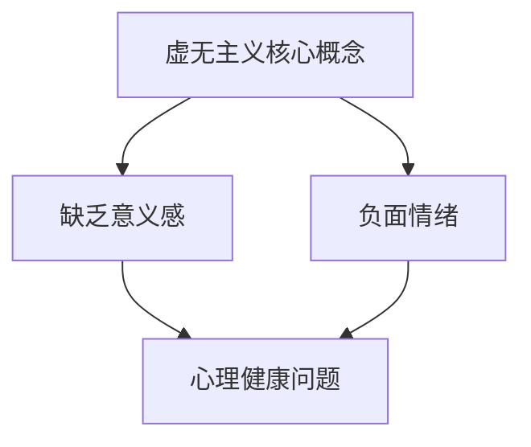

                 

### 虚无主义的理解

#### 1.1 虚无主义概述

虚无主义（Nihilism）是一个源自19世纪欧洲哲学流派的术语，主要用于描述一种思想状态，即对传统道德、宗教和文化的价值观进行批判和否定，并认为生命和宇宙的本质缺乏固有意义和目的。虚无主义的核心理念源于对存在本身的质疑，主张现实世界是没有固有的内在价值的，一切都是空虚和徒劳。

##### 1.1.1 虚无主义的概念界定

虚无主义可以定义为一种哲学态度，认为生命无意义，且不存在绝对的价值或目的。虚无主义不仅是一种思想体系，也是一种存在状态，它使个体在面对生活的挑战时感到迷茫和无助。

##### 1.1.2 虚无主义的历史背景

虚无主义在19世纪欧洲的兴起与当时的社会、文化和哲学环境密切相关。随着启蒙运动的衰落和浪漫主义的终结，人们对理性、科学和进步的信仰逐渐减弱，开始对传统的道德、宗教和文化进行批判。德国哲学家弗里德里希·尼采（Friedrich Nietzsche）被认为是虚无主义的代表人物之一，他的作品《查拉图斯特拉如是说》和《善恶的彼岸》等作品中，阐述了虚无主义的思想。

##### 1.1.3 虚无主义的主要观点和流派

虚无主义的主要观点包括：

- **存在主义虚无主义**：认为生命本身没有固有意义，但人类可以通过自己的行为赋予生活意义。
- **道德虚无主义**：认为道德标准是人为制定的，没有绝对的善恶之分。
- **文化虚无主义**：认为文化、传统和宗教信仰都是没有根据的虚构，应该被抛弃。

虚无主义在不同的历史时期和文化背景下有着不同的表现，例如在苏联的无神论运动中，虚无主义被视为一种反文化思潮。

#### 1.2 虚无主义对心理健康的影响

虚无主义可能会对个体的心理健康产生负面影响，因为它常常伴随着悲观、失望和无助的情绪。以下是对虚无主义对心理健康影响的具体分析：

##### 1.2.1 虚无主义引发的负面情绪

虚无主义可能导致个体感到生活没有意义，从而引发一系列负面情绪，如抑郁、焦虑和孤独感。这些情绪可能会进一步加剧个体的心理困扰。

##### 1.2.2 虚无主义对个体心理健康的影响

长期的虚无主义态度可能导致心理健康问题，如抑郁症、焦虑症和自杀倾向。虚无主义个体可能会感到无助，无法找到生活的动力和方向。

##### 1.2.3 虚无主义与抑郁症的关系

虚无主义与抑郁症之间存在密切联系。抑郁症患者常常对生活感到绝望和无意义，这与虚无主义的核心理念相符。此外，虚无主义态度可能会加重抑郁症患者的症状。

#### 1.3 虚无主义与心理健康之间的联系

虚无主义与心理健康之间存在复杂的联系。一方面，虚无主义可能导致心理健康问题；另一方面，心理健康问题也可能促使个体倾向于虚无主义。

##### 1.3.1 虚无主义的核心概念与心理健康的关系架构图（Mermaid流程图）

在这个架构图中，虚无主义的核心概念（缺乏意义感）和负面情绪（如抑郁、焦虑）是心理健康问题（如抑郁症、焦虑症）的直接原因。

##### 1.3.2 虚无主义与心理健康之间的相互影响

虚无主义与心理健康之间的相互影响可以通过以下几个步骤进行分析：

1. **虚无主义导致负面情绪**：虚无主义使个体感到生活没有意义，导致负面情绪的产生，如抑郁和焦虑。
2. **负面情绪影响心理健康**：长期的负面情绪会损害个体的心理健康，导致心理疾病的发生。
3. **心理健康问题加剧虚无主义**：心理健康问题可能会使个体对生活的态度更加悲观，进一步加深虚无主义。

这种相互作用关系表明，虚无主义和心理健康之间存在复杂的动态平衡。了解这种关系对于预防和治疗虚无主义相关的心理健康问题具有重要意义。

#### 1.4 虚无主义在现代社会中的存在形式

虚无主义在现代社会中仍然存在，并且在不同背景下有着不同的表现。

##### 1.4.1 虚无主义在年轻人中的流行趋势

随着社交媒体和即时通讯工具的普及，年轻人更容易受到虚无主义思想的影响。在追求虚拟世界的刺激和逃避现实问题的过程中，他们可能会逐渐陷入虚无主义的思维模式。

##### 1.4.2 虚无主义在职场压力中的表现

在职场环境中，虚无主义可能表现为对工作的漠不关心、缺乏动力和缺乏成就感。高强度的工作压力和竞争环境可能加剧个体的虚无主义倾向。

##### 1.4.3 虚无主义对人际关系的影响

虚无主义不仅影响个体内心的感受，还会对人际关系产生负面影响。虚无主义者可能会感到与他人疏离，难以建立深层次的情感联系。

#### 1.5 虚无主义的克服与心理健康平衡

克服虚无主义和实现心理健康平衡是现代个体面临的重大挑战。以下是一些可能的方法和策略：

##### 1.5.1 心理防御机制在虚无主义克服中的作用

心理防御机制可以帮助个体应对虚无主义带来的负面情绪。例如，合理化、否认和转移注意力等防御机制可以帮助个体暂时逃避虚无主义的困扰。

##### 1.5.2 心理疗法在虚无主义治疗中的应用

心理疗法，如认知行为疗法和存在主义心理治疗，可以帮助个体探索虚无主义的根源，并寻找生活的意义和目的。

##### 1.5.3 心理健康平衡的生活方式构建

通过培养健康的生活方式，如定期锻炼、保持良好的作息习惯、建立社交网络和进行自我反思，个体可以逐步克服虚无主义，实现心理健康的平衡。

### 总结

虚无主义作为一种哲学态度，对个体的心理健康产生了深远的影响。了解虚无主义的概念、影响和克服方法，对于维护个体心理健康具有重要意义。在现代社会中，个体需要积极应对虚无主义的挑战，寻找生活的意义和平衡。

---

关键词：虚无主义、心理健康、负面情绪、抑郁症、心理疗法

摘要：本文探讨了虚无主义的理解及其对心理健康的影响。通过分析虚无主义的核心概念、历史背景、存在形式，以及与心理健康之间的复杂关系，本文提出了克服虚无主义和实现心理健康平衡的方法和策略。

# 第二部分：压力与身心健康

## 2.1 压力的来源与类型

压力是现代社会中普遍存在的现象，它对个体的身心健康产生了深远的影响。理解压力的来源和类型，有助于我们更好地应对和管理压力。

### 2.1.1 压力的生理和心理来源

压力可以来源于生理和心理两个方面：

- **生理来源**：生理压力通常与身体健康有关，如疾病、疼痛、疲劳和营养不良等。这些生理问题会导致个体的生理状态发生变化，从而增加心理压力。
- **心理来源**：心理压力通常与个体的心理状态有关，如焦虑、抑郁、恐惧和不确定性等。这些情绪问题会导致个体感到紧张和不安，从而增加心理压力。

### 2.1.2 压力的主要类型和表现形式

压力可以分为以下几种主要类型：

- **急性压力**：急性压力是指短时间内突然出现的压力，如紧急情况、突发事件和危机事件。急性压力会导致个体感到紧张、焦虑和恐慌。
- **慢性压力**：慢性压力是指长期存在的压力，如长期工作压力、家庭冲突和人际关系问题。慢性压力会导致个体感到疲惫、沮丧和无助。
- **情境压力**：情境压力是指与特定情境相关的压力，如考试、演讲和竞争等。情境压力通常会在特定情境中产生，并影响个体的行为和情绪。
- **内在压力**：内在压力是指个体内部产生的压力，如自我要求、担忧和自我批评等。内在压力通常与个体的自我认知和心理状态有关。

### 2.1.3 压力的长期影响与应对策略

长期的压力会对个体的身心健康产生负面影响。以下是一些长期压力的影响和应对策略：

- **生理影响**：长期压力可能导致生理问题，如心血管疾病、免疫系统功能下降和消化系统问题等。应对策略包括定期体检、保持健康的生活习惯和进行适当的体育锻炼。
- **心理影响**：长期压力可能导致心理健康问题，如抑郁症、焦虑症和睡眠障碍等。应对策略包括寻求心理咨询、进行心理调适和练习放松技巧。
- **行为影响**：长期压力可能导致不良行为，如过度饮酒、吸烟和暴饮暴食等。应对策略包括改变不良行为习惯、培养健康的生活方式和寻求社会支持。

### 2.1.4 压力的多重效应

压力具有多重效应，即它可以对个体的生理、心理和社会功能产生综合影响。这种综合影响可能导致以下后果：

- **生理和心理健康的损害**：长期的生理和心理压力可能导致健康问题，如心血管疾病、抑郁症和焦虑症等。
- **社会功能的下降**：长期的压力可能导致个体在社会功能方面的下降，如工作表现不佳、人际关系紧张和社交能力下降等。
- **生活质量的影响**：长期的压力会影响个体的生活质量，如幸福感降低、满意度下降和自我价值感减弱等。

### 2.1.5 压力的来源与心理健康的关系

压力的来源与心理健康之间存在密切关系。以下是一些具体的关系：

- **压力与心理健康问题**：高水平的压力与心理健康问题之间存在显著关联。长期的高水平压力可能导致心理健康问题的发生，如抑郁症、焦虑症和睡眠障碍等。
- **压力与心理健康干预**：适当的压力管理和干预可以帮助改善心理健康。通过心理健康教育和心理治疗，个体可以学会应对压力，提高心理健康水平。
- **压力与心理健康平衡**：适度的压力可以激发个体的动力和潜能，但过度的压力会导致心理健康的损害。因此，保持压力与心理健康的平衡对于个体的身心健康至关重要。

### 2.1.6 压力的管理策略

为了有效管理压力，个体可以采取以下策略：

- **时间管理**：合理安排时间，确保有足够的休息和放松时间。
- **情绪调节**：学会控制情绪，避免情绪失控和过度反应。
- **健康生活方式**：保持健康的生活习惯，如定期锻炼、保持良好的饮食习惯和充足的睡眠。
- **社交支持**：建立良好的社交网络，寻求亲友和专业人士的支持。
- **心理调适**：通过心理咨询、心理治疗和自我调适技巧来管理压力。

### 2.1.7 压力的适应与应对

个体在面对压力时，可以通过以下方式来适应和应对：

- **积极应对**：采取积极的态度来应对压力，寻找解决问题的方法。
- **消极应对**：避免消极的应对方式，如逃避、否认和压抑情绪。
- **自我调适**：通过自我反思和自我调节来适应压力，提高心理韧性。

### 2.1.8 压力管理的长期效果

有效的压力管理策略不仅可以缓解当下的压力，还可以带来长期的益处。以下是一些长期效果：

- **心理健康水平的提升**：通过压力管理，个体的心理健康水平可以得到显著提升，减少心理疾病的发生。
- **生活质量改善**：压力管理有助于改善个体的生活质量，提高幸福感和满意度。
- **工作与生活平衡**：有效的压力管理可以帮助个体实现工作与生活的平衡，提高工作效率和生活质量。

### 2.1.9 压力管理的社会意义

压力管理不仅对个体有益，也对社会有重要意义。以下是一些社会意义：

- **提高社会生产力**：通过压力管理，个体的工作能力和效率可以得到提高，从而提高整个社会的生产力。
- **促进社会和谐**：有效的压力管理可以减少因压力引起的冲突和矛盾，促进社会和谐稳定。
- **心理健康普及**：压力管理是心理健康普及的重要组成部分，有助于提高全民的心理健康水平。

### 2.1.10 压力管理的未来趋势

随着社会的发展和人们对心理健康的重视，压力管理将呈现出以下趋势：

- **个性化压力管理**：未来的压力管理将更加注重个性化，根据个体的特点和环境进行定制化的压力管理策略。
- **科技支持**：随着科技的进步，科技手段将越来越多地应用于压力管理，如虚拟现实、人工智能和移动应用等。
- **社会支持系统**：未来的压力管理将更加重视社会支持系统的建立，通过政府、企业和社区等多方面的合作，提供全面的压力管理服务。

### 总结

压力是现代社会中普遍存在的现象，对个体的身心健康产生了深远的影响。通过理解压力的来源和类型，采取有效的管理策略，个体可以更好地应对压力，实现身心健康和生活的平衡。

---

关键词：压力、身心健康、管理策略、长期影响、情绪调节

摘要：本文详细探讨了压力的来源与类型，以及压力对身心健康的影响。通过分析压力的生理和心理来源、主要类型、长期影响和应对策略，本文提供了有效的压力管理方法和技巧，帮助个体实现身心健康和生活的平衡。

