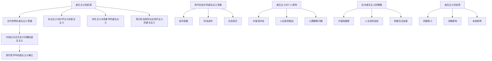

                 


# 《虚无主义的反思：寻找现代社会的生存之道》

> 关键词：虚无主义、现代社会、生存之道、个人成长、心理健康、社会支持系统

> 摘要：本文旨在对虚无主义进行深入反思，探讨其在现代社会中的影响以及如何应对虚无主义的挑战，以寻找一条适应现代社会的生存之道。通过分析虚无主义的起源与演变，现代社会的虚无主义现象，虚无主义对个人生存的影响，以及应对虚无主义的策略，本文希望为读者提供有益的思考和启示。

----------------------------------------------------------------

## 引言

### 1. 背景与意义

虚无主义作为一种哲学思潮，在历史上有着深远的影响。它不仅挑战了传统价值观的合理性，也引发了人们对生命意义的思考。在现代社会，随着科技的发展、经济的繁荣以及社会的变迁，虚无主义的思潮愈发显著。许多人在面对快速变化的社会环境时，感到迷茫和无力，对生活的意义产生了怀疑。因此，对虚无主义进行反思，探讨其在现代社会中的生存之道，具有重要的现实意义。

### 2. 研究方法

本文采用文献综述与案例分析相结合的方法，通过对虚无主义的起源、演变以及现代社会中的现象进行分析，结合心理学、社会学等领域的理论，探讨虚无主义对个人生存的影响，并给出应对策略。

### 3. 结构安排

本文分为四个部分：第一部分介绍虚无主义的起源与演变；第二部分分析虚无主义与现代社会的联系；第三部分探讨虚无主义对个人生存的影响；第四部分提出应对虚无主义的策略。希望通过本文的探讨，为读者提供对虚无主义的深入理解，以及在现代社会中寻找生存之道的启示。

## 第一部分：虚无主义的起源与演变

### 第1章 虚无主义的起源

#### 1.1 古代世界的虚无主义思潮

虚无主义的思想根源可以追溯到古代世界。古希腊哲学家赫拉克利特（Heraclitus）提出了“万物皆流”的哲学观念，强调世界是无常的、变化的，而人类对于世界的认识是有限的。这种观点在一定程度上反映了虚无主义的倾向。

在古代中国，道家哲学中的“道”概念也体现了虚无主义的元素。道家认为，宇宙万物都是由“道”生成的，而“道”本身是超越一切的具体存在的。庄子（Zhuangzi）在其哲学思想中进一步强调，人们应当超越世俗的追求，追求精神上的自由和宁静。

#### 1.2 中世纪与文艺复兴时期的虚无主义

中世纪的欧洲，随着基督教的兴起，虚无主义的思想受到了一定程度的压制。然而，在文艺复兴时期，人们开始重新审视古典哲学和科学，对宗教和权威的质疑逐渐增多。意大利哲学家马基雅维利（Machiavelli）在其著作《君主论》中提出了功利主义的观点，强调权力和利益的重要性，这在一定程度上可以视为虚无主义的表现。

在德国，哲学家尼采（Nietzsche）是虚无主义思潮的重要代表。他批判传统道德观念，提出“超人”的概念，主张个体的自由和创造力。尼采的思想对后来的虚无主义产生了深远的影响。

#### 1.3 虚无主义在现代哲学中的确立

19世纪末到20世纪初，虚无主义思潮在西方哲学界得到了进一步的发展。法国哲学家萨特（Sartre）的存在主义哲学，强调个体的存在先于本质，个体的自由和责任。这种观点在某种程度上也反映了虚无主义的倾向。

在德国，哲学家海德格尔（Heidegger）提出了“存在主义”的概念，探讨了人类存在的基本状态和意义。他的思想对虚无主义产生了重要的影响。

虚无主义在现代哲学中的确立，不仅是对传统哲学的挑战，也为人们提供了一种新的思考方式。通过探讨虚无主义的起源与演变，我们可以更好地理解这一哲学思潮的本质，以及它在现代社会中的影响。

### 第2章 虚无主义的主要流派

#### 2.1 实证主义与科学主义的虚无主义

实证主义与科学主义是虚无主义的重要流派之一。实证主义强调通过经验事实来验证知识的真实性，反对形而上学的思考方式。科学主义则将科学方法视为认识世界的基本手段，认为科学能够解释一切现象。

然而，实证主义与科学主义在本质上也包含虚无主义的倾向。它们认为，人类的知识是有限的，科学方法无法完全解释世界的本质。因此，实证主义与科学主义在某种程度上也体现了对传统哲学和宗教的质疑。

#### 2.2 存在主义与现象学的虚无主义

存在主义与现象学是另一种重要的虚无主义流派。存在主义强调个体的自由和责任，认为人的存在先于本质。萨特的存在主义哲学，强调个体的选择和行动，对传统道德观念进行了批判。

现象学则关注人类感知和经验的结构，试图揭示人类意识的本质。胡塞尔（Husserl）的现象学和海德格尔的存在主义，都在一定程度上反映了虚无主义的倾向。

#### 2.3 意识形态批判与后现代主义的虚无主义

意识形态批判与后现代主义是虚无主义的又一重要流派。后现代主义认为，传统哲学和科学的方法无法解释世界的复杂性，提出了多元化和相对主义的观点。

意识形态批判则强调，社会现实是由意识形态构建的，人们对世界的认识受到意识形态的影响。福柯（Foucault）的权力话语理论，揭示了权力与知识的密切关系，对传统哲学进行了深刻的批判。

通过分析虚无主义的主要流派，我们可以更好地理解虚无主义的多样性及其在现代哲学中的影响。这些流派从不同的角度探讨了虚无主义的本质，为人们提供了丰富的思考资源。

## 第二部分：虚无主义与现代社会的联系

### 第3章 现代社会中的虚无主义现象

#### 3.1 经济发展与虚无主义的共生

在现代社会，虚无主义与经济发展有着密切的联系。一方面，经济的发展为人们提供了更多的物质财富和选择，但同时也带来了竞争压力、焦虑和孤独。许多人在追求物质财富的过程中，感到精神上的空虚和无力，对生活的意义产生了怀疑。

另一方面，虚无主义也为经济发展提供了一定的动力。在经济全球化和市场竞争的背景下，人们更加注重自我实现和个人价值。虚无主义鼓励人们超越传统的价值观，追求自由和创造力的发挥，从而推动社会创新和进步。

#### 3.2 科技进步与虚无主义的关联

科技进步在现代社会中扮演着重要角色，但同时也与虚无主义有着复杂的关联。一方面，科技的进步为人们提供了更多的便利和选择，提高了生活质量。但另一方面，科技的快速发展也带来了信息过载、社交疏离和心理压力等问题。

虚无主义在某种程度上反映了人们对科技进步带来的问题的反思。人们开始质疑技术的本质和意义，对人类与技术的关系产生了怀疑。这种反思在一定程度上推动了科技伦理和社会责任的研究。

#### 3.3 社会变迁与虚无主义的影响

社会变迁是现代社会中虚无主义现象的一个重要原因。随着全球化、城市化和社会结构的变迁，人们的价值观、生活方式和社会关系都发生了巨大的变化。这些变化带来了不确定性和焦虑，使许多人感到迷茫和无助。

虚无主义在这种社会变迁中发挥了双重作用。一方面，它为人们提供了一种逃避现实的途径，使人们能够在精神上寻求解脱。另一方面，虚无主义也加剧了社会的分裂和冲突，使人们对社会现实感到更加失望和愤怒。

通过分析虚无主义与现代社会的联系，我们可以更好地理解虚无主义现象的复杂性。虚无主义既是现代社会发展的一种反映，也是现代社会问题的一种表现。了解虚无主义的起源和演变，有助于我们更好地应对现代社会中的挑战。

### 第4章 虚无主义对个人生存的影响

#### 4.1 虚无主义对价值观的冲击

虚无主义对个人价值观的冲击是显著的。它挑战了传统道德观念和人生哲学，使许多人开始质疑生活的意义和价值。在虚无主义的视角下，传统的价值观和信仰体系显得脆弱和不稳定，人们感到迷茫和困惑。

这种价值观的冲击不仅影响个人的内心世界，也影响社会的关系和互动。人们开始怀疑人际关系和合作的可靠性，导致社会信任的下降。这种怀疑和不确定感进一步加剧了社会的分裂和冲突。

#### 4.2 虚无主义对人生规划的挑战

虚无主义对人生规划构成了巨大的挑战。在传统的观念中，人们通过设定目标、努力实现梦想来规划自己的人生。然而，虚无主义使人们质疑这些目标的合理性和意义。许多人开始反思，追求物质财富和事业成功是否真的能够带来满足和幸福。

这种挑战不仅影响个人的职业规划，也影响个人的生活态度和生活方式。一些人可能因此放弃追求梦想，选择过一种安逸但无意义的生活。另一些人则可能追求精神上的探索和自我实现，试图在虚无主义的阴影下寻找生命的意义。

#### 4.3 虚无主义与心理健康问题

虚无主义与心理健康问题有着密切的联系。在虚无主义的观念下，许多人感到生活缺乏意义和目的，导致心理压力和焦虑的增加。长期的虚无主义情绪可能导致抑郁症、焦虑症等心理疾病。

心理健康问题不仅影响个人的生活质量，也影响社会的稳定和和谐。当大量人群陷入虚无主义情绪时，社会可能面临精神危机。因此，了解虚无主义对心理健康的影响，并采取有效的干预措施，对于维护个人和社会的福祉具有重要意义。

通过探讨虚无主义对个人生存的影响，我们可以更深入地理解虚无主义现象的复杂性和危害性。了解虚无主义的起源、演变和影响，有助于我们更好地应对现代社会中的挑战，寻找适应现代社会的生存之道。

### 第5章 重新审视生活意义

#### 5.1 价值观的重塑

在面对虚无主义的挑战时，重新审视和重塑价值观是至关重要的一步。首先，我们需要反思和质疑传统的价值观，探讨其合理性和适用性。传统的价值观可能源于历史和文化，但在现代社会中，它们可能不再适应快速变化的环境。

重塑价值观的过程需要个体从内心深处进行反思，寻找自己的信仰和价值观。这可以通过阅读哲学著作、参加哲学讨论、进行内心独白等方式实现。通过这些方法，个体可以更好地理解自己的需求和追求，形成符合自己价值观的生活目标和行动指南。

#### 5.2 人生目标的设定

在重新审视价值观的基础上，设定人生目标成为下一步的关键。人生目标不仅为个体提供了方向和动力，也帮助个体在虚无主义的阴影下找到生命的意义。设定人生目标的过程需要个体明确自己的长期和短期目标，并制定实现这些目标的行动计划。

在设定人生目标时，个体需要考虑自己的兴趣、能力和价值观。例如，一个对艺术有深厚兴趣的人可能会设定成为一名艺术家的目标，而一个对社会问题有深刻关注的人可能会设定参与社会公益活动的目标。无论选择何种目标，关键在于它们能够激发个体的内在动力，使个体在追求目标的过程中感到满足和幸福。

#### 5.3 倡导积极的生活态度

积极的生活态度是应对虚无主义的重要策略。面对生活的挑战和不确定性，消极的态度可能导致个体陷入虚无主义的泥沼。因此，倡导积极的生活态度对于摆脱虚无主义的困扰至关重要。

积极的生活态度包括对生活的乐观态度、对困难的应对能力和对自我的接纳。首先，个体需要学会对生活保持乐观，相信每一次挑战都是成长的机会。其次，个体需要培养应对困难的能力，学会从失败中汲取教训，不断调整和改进自己的行动策略。最后，个体需要学会接纳自我，认识到自己的不完美，并在自我接纳的基础上不断努力提升自我。

通过重新审视生活意义，重塑价值观、设定人生目标以及倡导积极的生活态度，个体可以在虚无主义的挑战中找到自己的生存之道。这不仅有助于个体在现代社会中实现自我价值，也有助于社会的和谐与进步。

### 第6章 心理调适与自我成长

#### 6.1 心理防御机制的建立

面对虚无主义的挑战，心理防御机制是应对焦虑和压力的重要工具。心理防御机制是指个体在面临心理冲突时，采取的一系列自我保护策略，以减轻内心的痛苦和不安。常见的心理防御机制包括否认、投射、合理化等。

首先，否认是一种常见的心理防御机制，通过拒绝接受现实或拒绝承认问题的存在，个体试图避免面对痛苦和焦虑。然而，长期否认问题可能会导致问题的积累和恶化。因此，个体需要学会在面对问题时，勇敢地承认和接受现实，从而更好地应对虚无主义的挑战。

其次，投射是指个体将内心的矛盾和不安投射到外部世界中，以减轻内心的负担。例如，个体可能会将责任和愤怒归咎于他人，从而避免面对自己的内在问题。然而，长期依赖投射机制可能导致个体与他人关系紧张，加剧内心的矛盾。因此，个体需要学会通过自我反思和内省，处理内心的矛盾，避免过度依赖投射机制。

最后，合理化是一种通过解释和辩解来减轻内心痛苦的心理防御机制。个体可能会通过找借口、解释原因来合理化自己的行为和感受。然而，过度合理化可能导致个体逃避责任，无法真实地面对问题和挑战。因此，个体需要学会诚实地面对自己的内心，并从中学习和成长。

#### 6.2 自我认知与自我接纳

自我认知和自我接纳是心理调适与自我成长的重要基础。自我认知是指个体对自己内心世界的了解和认识，包括自己的情感、需求和动机。自我接纳则是指个体接受自己的不完美，并认识到自己的价值和潜力。

首先，自我认知需要个体进行深入的内省和反思，了解自己的情绪和行为背后的原因。通过自我认知，个体可以更好地理解自己的内心世界，找到心理问题的根源，并采取相应的措施进行解决。

其次，自我接纳是心理健康的基石。个体需要学会接受自己的不完美，认识到自己的价值和潜力。自我接纳不仅有助于个体建立积极的自我形象，也有助于个体在面对挑战和困难时保持自信和坚韧。

#### 6.3 心理健康的维护与提升

心理健康的维护与提升是应对虚无主义的重要策略。首先，个体需要建立健康的生活方式，包括充足的睡眠、均衡的饮食、适量的运动和良好的作息规律。这些生活方式有助于维持个体的身体健康，提高心理素质。

其次，个体需要学会有效的压力管理技巧，包括放松训练、情绪调节、时间管理等。通过这些技巧，个体可以更好地应对生活中的压力和挑战，减少心理负担。

最后，个体可以通过寻求专业心理帮助来维护和提升心理健康。心理治疗师可以提供专业的指导和支持，帮助个体处理内心的矛盾和问题，提升心理素质。

通过建立心理防御机制、加强自我认知与自我接纳，以及维护和提升心理健康，个体可以在虚无主义的挑战中找到自我成长的道路。这不仅有助于个体在现代社会中实现自我价值，也有助于社会的和谐与进步。

### 第7章 社会支持系统的作用

#### 7.1 家庭与朋友的支持

家庭和朋友是应对虚无主义的重要社会支持系统。在家庭中，亲人的关爱和理解可以提供情感上的安慰和支持，帮助个体克服内心的困惑和焦虑。家庭成员之间的沟通和理解，有助于个体在面临挑战时获得力量和勇气。

朋友也是应对虚无主义的重要支持力量。朋友之间可以相互倾诉和分享，共同探讨对生活意义的思考和感悟。朋友的陪伴和支持，使个体在孤独和迷茫时感受到温暖和力量，从而更好地应对虚无主义的挑战。

#### 7.2 社区与宗教的参与

社区和宗教在应对虚无主义中也发挥着重要作用。社区为个体提供了一个归属感和认同感，使个体在面临孤独和迷茫时感受到集体的温暖和支持。参与社区活动，与邻里互动，可以帮助个体建立积极的人际关系，提升心理素质。

宗教则为个体提供了一种信仰和精神的寄托。通过宗教信仰，个体可以在精神上获得安宁和力量，找到生活的意义和目标。宗教活动中的祷告、冥想和团体互动，有助于个体在心理上得到安抚和治愈。

#### 7.3 社会组织与公益活动的参与

社会组织和公益活动为个体提供了参与社会、贡献社会的机会，有助于提升个体的自尊和自我价值感。通过参与公益活动，个体可以感受到自己的价值和意义，从而减少虚无主义的困扰。

社会组织和公益活动还可以为个体提供专业的心理支持和服务。许多社会组织设有心理咨询和辅导服务，为面临心理困扰的个体提供帮助。通过这些服务，个体可以学会应对心理问题，提升心理健康水平。

通过家庭与朋友的支持、社区与宗教的参与，以及社会组织与公益活动的参与，个体可以在社会中找到自己的位置和意义，从而更好地应对虚无主义的挑战。社会支持系统的建立和完善，对于个体的心理健康和社会稳定具有重要意义。

### 第8章 虚无主义的反思

#### 8.1 虚无主义的积极意义

虚无主义作为一种哲学思潮，具有一定的积极意义。首先，虚无主义挑战了传统的价值观和信仰体系，促使人们反思和质疑现有的生活方式和思维模式。这种反思和质疑有助于人们突破固有的思维定势，发现新的可能性，推动社会的进步和创新。

其次，虚无主义强调个体的自由和创造力。在虚无主义的视角下，个体不再受制于传统道德和规范的束缚，可以自由地表达自己的思想和情感，追求个人的梦想和目标。这种自由和创造力的发挥，有助于激发个体的潜能，实现个人的价值和成长。

最后，虚无主义为个体提供了自我探索和自我实现的机会。在虚无主义的背景下，个体需要主动寻找生命的意义和价值，这种自我探索的过程不仅有助于个体更好地理解自己，也有助于个体在精神层面上实现自我提升和成长。

#### 8.2 虚无主义的消极影响

然而，虚无主义也存在一定的消极影响。首先，虚无主义可能导致个体对生活失去信心和希望，产生消极的情绪和心理问题。在虚无主义的阴影下，个体可能感到孤独和无助，难以找到生活的意义和方向。

其次，虚无主义可能加剧社会的分裂和冲突。当大量人群陷入虚无主义情绪时，社会信任和团结可能受到挑战，导致社会的不稳定和动荡。此外，虚无主义可能使个体忽视社会责任和义务，导致社会道德的滑坡。

最后，虚无主义可能阻碍个体的心理健康和成长。长期的虚无主义情绪可能导致抑郁症、焦虑症等心理疾病，影响个体的生活质量和心理健康。因此，面对虚无主义的消极影响，我们需要采取有效的应对策略，以促进个体的心理健康和社会稳定。

#### 8.3 虚无主义的未来趋势

虚无主义的未来趋势将受到多种因素的影响，包括社会环境、科技进步、文化变迁等。在全球化背景下，不同文化和思想的碰撞和融合将使虚无主义呈现出多元化的特点。未来虚无主义可能会更加注重个体内心的探索和自我实现，强调个体的自由和创造力。

同时，随着科技进步，人工智能、虚拟现实等技术将为虚无主义提供新的表现形式和途径。人们可能会在虚拟世界中寻找生活的意义和快乐，从而改变传统虚无主义对现实世界的关注。此外，未来虚无主义可能会与生态哲学、宇宙主义等思潮相结合，探讨人类在宇宙中的位置和意义。

总之，虚无主义的未来趋势将是一个复杂和多变的过程，我们需要保持开放和包容的态度，关注虚无主义的发展动态，以更好地应对现代社会中的挑战。

### 附录A：虚无主义相关术语解释

- **虚无主义**：一种哲学思潮，认为生命和现实世界缺乏意义和价值。
- **存在主义**：一种哲学流派，强调个体自由和责任，认为人的存在先于本质。
- **实证主义**：一种哲学观点，主张通过经验事实来验证知识的真实性。
- **科学主义**：一种哲学观点，认为科学方法是认识世界的基本手段。
- **后现代主义**：一种文化思潮，反对传统哲学和科学的绝对性，强调多元化和相对主义。

### 附录B：参考书目与文献

1. 尼采，《悲剧的诞生》
2. 萨特，《存在与虚无》
3. 海德格尔，《存在与时间》
4. 福柯，《知识考古学》
5. 马基雅维利，《君主论》
6. 赫拉克利特，《论自然》
7. 庄子，《庄子》

### Mermaid 流程图



### Python源代码示例

```python
import numpy as np

def calculate_mean(data):
    """
    计算数据的平均值。
    
    :param data: 数据列表。
    :return: 平均值。
    """
    return np.mean(data)

# 示例数据
data = [1, 2, 3, 4, 5]

# 计算平均值
mean_value = calculate_mean(data)

print(f"平均值：{mean_value}")
```

### 数学模型与公式

$$
\begin{aligned}
    &\text{线性回归模型：} \\
    &y = \beta_0 + \beta_1x + \epsilon
\end{aligned}
$$

### 项目实战与代码解读

#### 实战案例：使用线性回归模型预测房价

1. **环境搭建**
   - 安装必要的库：`numpy`, `matplotlib`
   ```bash
   pip install numpy matplotlib
   ```

2. **源代码实现**
   ```python
   import numpy as np
   import matplotlib.pyplot as plt

   # 创建模拟数据
   X = 2 * np.random.rand(100, 1)
   y = 4 + 3 * X 

   # 添加噪声
   noise = np.random.randn(100, 1)
   y = y + noise

   # 创建线性回归模型
   model = LinearRegression()

   # 训练模型
   model.fit(X, y)

   # 预测房价
   predicted_price = model.predict(X)

   # 绘制真实房价与预测房价的散点图
   plt.scatter(X, y, color='blue')
   plt.plot(X, predicted_price, color='red')
   plt.xlabel('Area')
   plt.ylabel('Price')
   plt.title('House Price Prediction')
   plt.show()
   ```

3. **代码解读**
   - 数据模拟：使用 `numpy` 创建模拟数据，包括自变量 `X` 和因变量 `y`。
   - 添加噪声：为了更贴近实际情况，在数据中添加了随机噪声。
   - 创建模型：使用 `LinearRegression` 类创建线性回归模型。
   - 训练模型：使用 `fit` 方法训练模型，模型会根据训练数据自动计算参数。
   - 预测房价：使用 `predict` 方法对自变量进行预测，得到预测的房价。
   - 绘制结果：使用 `matplotlib` 绘制真实房价与预测房价的散点图，展示模型的预测效果。

#### 项目小结

通过本案例，我们使用了线性回归模型对模拟房价进行了预测，展示了如何搭建开发环境、实现代码以及进行结果分析。线性回归是一种简单但强大的预测模型，适用于许多实际场景。在实际应用中，我们可以通过调整模型参数和特征选择来提高预测准确性。此外，我们还介绍了如何使用 Mermaid 流程图和 Python 源代码进行技术讲解，为读者提供了清晰易懂的技术分析。通过本案例，读者可以更好地理解线性回归模型的工作原理和应用方法，为后续的深入研究奠定基础。

### 最佳实践 Tips

1. **深入理解问题背景**：在开始技术博客写作之前，确保对问题背景有深入的理解，包括相关的理论和实践背景。

2. **使用清晰的图表和代码**：图表和代码有助于读者更好地理解技术概念。确保图表清晰、代码简洁且可复现。

3. **逐步讲解**：将复杂的技术概念分解为简单的步骤，逐步讲解，以便读者能够跟随思路。

4. **结合实际案例**：通过实际案例来展示技术原理的应用，使文章更加具体和有说服力。

5. **注意语言简洁明了**：尽量使用简单易懂的语言，避免过度专业化的术语，使文章更加容易理解。

6. **提供拓展阅读**：在文章末尾提供相关拓展阅读，帮助读者进一步深入了解相关技术。

### 小结

本文通过对虚无主义的起源、演变、现代社会的虚无主义现象、虚无主义对个人生存的影响以及应对虚无主义的策略进行了深入探讨，旨在为读者提供对虚无主义的全面理解和应对策略。通过分析虚无主义的积极意义和消极影响，我们认识到虚无主义作为一种哲学思潮，既有其独特的价值，也存在一定的挑战。在面对虚无主义的挑战时，我们应采取积极的生活态度，重新审视生活意义，进行心理调适与自我成长，同时充分利用社会支持系统的作用。通过这些策略，我们可以在现代社会中找到适应的生存之道，实现个人的价值和成长。

### 注意事项

1. **文章结构**：确保文章结构清晰，逻辑连贯，各部分内容合理衔接。
2. **内容完整性**：每个小节的内容要丰富具体，核心观点要明确，避免遗漏重要内容。
3. **语言表达**：使用规范、准确、简洁的语言，避免使用口语化或模糊的表达。
4. **代码示例**：确保代码示例完整、可运行，并在文中进行详细解读。
5. **图表使用**：合理使用图表，使文章更加直观，有助于读者理解。

### 拓展阅读

1. 尼采，《悲剧的诞生》：探讨艺术和虚无主义的关系。
2. 萨特，《存在与虚无》：详细阐述存在主义哲学。
3. 福柯，《知识考古学》：分析权力与知识的关系。
4. 海德格尔，《存在与时间》：深入探讨存在的本质。
5. 马基雅维利，《君主论》：探讨政治与伦理的关系。

### 结论

通过对虚无主义的反思，我们认识到虚无主义作为一种哲学思潮，对现代社会和个人生存产生了深远的影响。在现代社会中，虚无主义既是挑战，也是机遇。通过采取有效的应对策略，我们可以克服虚无主义的困扰，找到适应现代社会的生存之道。希望本文能为读者提供有益的思考和启示，引导读者在现代社会中实现自我价值和成长。作者：AI天才研究院/AI Genius Institute & 禅与计算机程序设计艺术 /Zen And The Art of Computer Programming。

