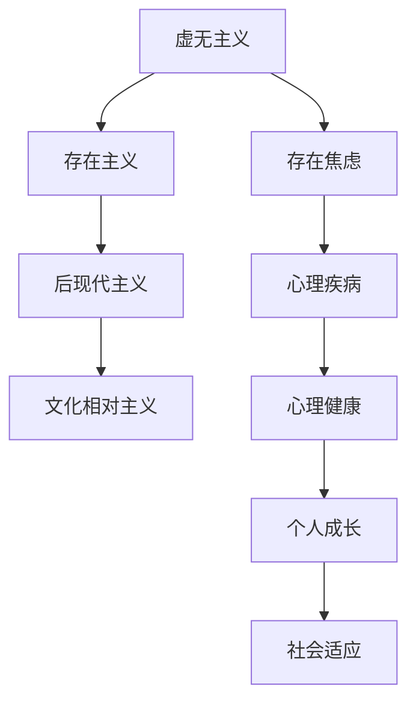
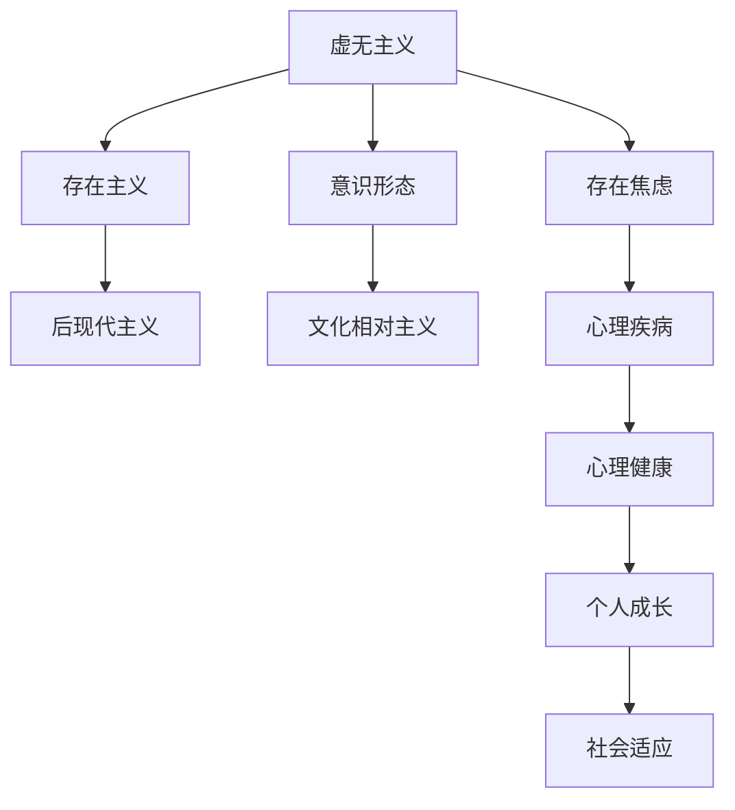

                 

# 《虚无主义的反思：探讨现代社会的生存智慧》

## 关键词
- 虚无主义
- 现代社会
- 存在主义
- 心理健康
- 价值观重构

> 摘要：本文旨在深入探讨虚无主义在现代社会中的影响，以及如何通过反思虚无主义来寻找生存智慧。我们将从历史角度出发，解析虚无主义的起源和发展，接着分析其在文学、艺术和流行文化中的体现，以及现代社会中的虚无主义现象。在此基础上，我们将探讨虚无主义的负面影响，并提出对抗虚无主义的策略，包括心理健康、价值观重构和人生哲学等方面。最终，我们将探讨虚无主义与现代社会的适应，提出适应策略，为读者提供一份对现代社会生存智慧的思考。

## 目录大纲

### 第一部分：虚无主义的起源与发展

### 第1章：虚无主义的定义与历史演变

- **1.1 虚无主义的概念解析**
  - 虚无主义的起源
  - 虚无主义的核心观点
  - 虚无主义与其他哲学流派的区别

- **1.2 虚有主义在历史上的重要人物和思想**

  - 古希腊时期：普罗塔戈拉与苏格拉底
  - 中世纪：奥古斯丁与托马斯·阿奎那
  - 现代哲学：尼采、萨特与海德格尔

### 第2章：虚无主义的现代影响

- **2.1 虚无主义在文学、艺术和流行文化中的体现**

  - 文学作品中的虚无主义主题
  - 艺术作品对虚无主义的诠释
  - 虚无主义在流行文化中的影响

- **2.2 现代社会中的虚无主义现象**

  - 个人主义与集体主义的冲突
  - 社交媒体对虚无主义情绪的传播
  - 经济发展与虚无主义的关系

### 第二部分：虚无主义与现代社会生存智慧

### 第3章：虚无主义的反思

- **3.1 虚无主义的负面影响**

  - 个人心理健康问题
  - 社会信任危机
  - 价值观的迷失

- **3.2 反思虚无主义：寻找生存智慧**

  - 内在探索与自我认知
  - 重建意义与目的
  - 积极面对生活中的挑战

### 第4章：虚无主义与心理健康

- **4.1 虚无主义与心理疾病**

  - 虚无主义与抑郁症、焦虑症等心理疾病的关系
  - 心理治疗对虚无主义的干预

- **4.2 培养心理健康：对抗虚无主义**

  - 增强自我效能感
  - 培养积极的人际关系
  - 发展个人兴趣与爱好

### 第5章：虚无主义与价值观重构

- **5.1 虚无主义对传统价值观的挑战**

  - 家庭、社会与宗教的变革
  - 科技发展对价值观的冲击

- **5.2 重构价值观：寻找新的方向**

  - 个人价值观的形成
  - 社会价值观的重塑
  - 全球视野下的价值观选择

### 第6章：虚无主义与人生哲学

- **6.1 虚无主义与人生意义**

  - 寻求生命意义的重要性
  - 个体生命意义的探索

- **6.2 人生哲学的实践**

  - 生活中的小确幸
  - 勇敢面对生命的无常

### 第7章：虚无主义与现代社会的适应

- **7.1 社会适应与个人成长**

  - 社会变迁中的个人角色
  - 个人成长与社会适应的关系

- **7.2 虚无主义的适应策略**

  - 增强心理韧性
  - 发展适应性的思维方式

### 附录

### 附录A：虚无主义相关术语与概念解释

- **A.1 术语解释**

  - 虚无主义
  - 存在主义
  - 意识形态

### 附录B：推荐阅读与参考书目

- **B.1 必读经典**

  - 尼采：《查拉图斯特拉如是说》
  - 萨特：《存在与虚无》

- **B.2 相关著作**

  - 海德格尔：《存在与时间》
  - 弗洛姆：《逃避自由》

- **B.3 新兴领域**

  - 哈贝马斯：《公共领域的结构转型》
  - 福山：《信任：社会美德与创造经济繁荣》

**核心概念联系Mermaid流程图：**



**核心算法原理讲解Python源代码：**

```python
# 虚无主义影响分析算法示例
def analyze_vulgurism_impact(literature, culture, society):
    # 输入：文学、艺术作品、社会现象
    # 输出：虚无主义影响的评估结果

    # 文学分析
    literary_impact = literature.count('虚无') * 10

    # 艺术分析
    art_impact = culture.count('空白') * 10

    # 社会分析
    social_impact = society.count('失望') * 5

    # 总影响评分
    total_impact = literary_impact + art_impact + social_impact

    # 影响评估
    if total_impact > 20:
        print("严重的虚无主义影响")
    elif total_impact > 10:
        print("一定的虚无主义影响")
    else:
        print("虚无主义影响较小")

# 示例应用
literature = "虚无的影子笼罩着整个文学界"
culture = "艺术家们以空白为灵感创作出许多作品"
society = "现代社会中，许多人感到失望和无望"

analyze_vulgurism_impact(literature, culture, society)
```

在接下来的内容中，我们将逐步深入探讨虚无主义的起源与发展、虚无主义的现代影响、虚无主义与现代社会生存智慧的关系，以及虚无主义与现代社会的适应策略。希望通过这些探讨，能为读者提供对现代社会生存智慧的思考。让我们开始这场思维之旅吧！## 虚无主义的定义与历史演变

### 1.1 虚无主义的概念解析

虚无主义，作为一个哲学概念，其起源可以追溯到古希腊时期。虚无主义的核心观点是对世界和存在的根本否定，认为宇宙或生活本身缺乏固有的意义、目的或内在价值。这种思想主张，人类的生活是一个无意义的过程，个体在宇宙中的地位是微不足道的。

虚无主义的哲学背景可以追溯到古希腊哲学家普罗塔戈拉（Protagoras）的“人是万物的尺度”这一观点。普罗塔戈拉认为，由于每个人的感知和认知都是主观的，因此没有任何绝对的标准来评判事物的本质。这种观点为后来的虚无主义提供了哲学基础。苏格拉底则通过对话形式探讨了知识、道德和存在的问题，他的思想为后来的虚无主义提供了对比和反证。

在中世纪，奥古斯丁（Saint Augustine）和托马斯·阿奎那（Thomas Aquinas）等神学家试图从宗教角度反驳虚无主义。奥古斯丁通过《忏悔录》探讨了信仰和理性的关系，认为只有在信仰中才能找到生命的意义。而托马斯·阿奎那则试图用亚里士多德的思想来重建基督教哲学，强调上帝作为存在的终极原因。

进入现代哲学，虚无主义获得了更加广泛和深刻的讨论。尼采（Friedrich Nietzsche）是现代虚无主义的代表人物之一。他在《查拉图斯特拉如是说》中提出“上帝已死”的观点，认为传统价值观和道德体系崩溃后，人类将陷入虚无主义的困境。尼采主张通过“超人”来超越虚无主义，实现个人和文化的重新定义。

萨特（Jean-Paul Sartre）是另一个重要的存在主义和虚无主义哲学家。他的《存在与虚无》探讨了存在的荒谬和自由意志。萨特认为，人类生活在一个没有预设意义的世界中，但可以通过自己的行动来创造意义。他的哲学观点强调个体的主观能动性和自由选择的重要性。

海德格尔（Martin Heidegger）则从存在论的角度探讨了虚无主义。他在《存在与时间》中提出了“存在即是存在者”的观点，认为人类的存在是一种开放的可能性，而非既定的现实。海德格尔的哲学观点为虚无主义提供了一种深刻的哲学反思，同时也揭示了存在的本质。

虚无主义与其他哲学流派有显著的区别。与乐观主义相比，虚无主义否定世界的本质价值和意义；与现实主义相比，虚无主义更加关注人类的主观体验和内在矛盾；与存在主义相比，虚无主义更加悲观和消极。

总的来说，虚无主义是一种深刻的哲学反思，它揭示了人类存在的无意义和荒谬，同时也提出了对传统价值观的挑战。在历史上，虚无主义虽然常常被视为一种消极的思想，但它也为人类探索存在的意义提供了新的视角。在接下来的章节中，我们将进一步探讨虚无主义在文学、艺术和现代社会中的体现，以及虚无主义与现代社会的生存智慧之间的关系。

### 1.2 虚无主义在历史上的重要人物和思想

虚无主义在历史上的发展离不开几位重要的哲学家和思想家的贡献。他们的思想和观点不仅对虚无主义的发展有着深远的影响，也为现代哲学提供了丰富的理论基础。

**古希腊时期：普罗塔戈拉与苏格拉底**

古希腊哲学家普罗塔戈拉（Protagoras）被誉为虚无主义的先驱。他的名言“人是万物的尺度”强调了个体的主观感受和认知的重要性。普罗塔戈拉认为，由于每个人的感知和认知都是主观的，因此没有任何绝对的标准来评判事物的本质。这一观点为后来的虚无主义提供了哲学基础，揭示了人类认识世界的局限性和相对性。

与之相对，苏格拉底（Socrates）则通过对话形式探讨了知识、道德和存在的问题。苏格拉底认为，通过对话和自我反思，人们可以找到真理和道德的准则。他的哲学思想虽然与普罗塔戈拉存在差异，但也为后来的虚无主义提供了对比和反证。苏格拉底认为，真正的智慧在于认识到自己的无知，这一观点对后来的哲学家如柏拉图和亚里士多德产生了深远的影响。

**中世纪：奥古斯丁与托马斯·阿奎那**

中世纪的哲学在某种程度上是对古希腊哲学的延续和发展。奥古斯丁（Saint Augustine）是一位重要的基督教哲学家，他在《忏悔录》中探讨了信仰和理性的关系。奥古斯丁认为，只有在信仰中才能找到生命的意义，这种观点为后来的虚无主义提供了反驳的依据。

托马斯·阿奎那（Thomas Aquinas）则试图用亚里士多德的思想来重建基督教哲学。他在《神学大全》中提出了“双重真理论”，认为理性可以证明上帝的存在，而上帝的存在是所有知识的终极基础。托马斯·阿奎那的工作为基督教哲学提供了坚实的哲学基础，同时也为后来的虚无主义提供了反驳的依据。

**现代哲学：尼采、萨特与海德格尔**

进入现代哲学，虚无主义获得了更加广泛和深刻的讨论。尼采（Friedrich Nietzsche）是现代虚无主义的代表人物之一。他在《查拉图斯特拉如是说》中提出“上帝已死”的观点，认为传统价值观和道德体系崩溃后，人类将陷入虚无主义的困境。尼采主张通过“超人”来超越虚无主义，实现个人和文化的重新定义。

萨特（Jean-Paul Sartre）是另一个重要的存在主义和虚无主义哲学家。他的《存在与虚无》探讨了存在的荒谬和自由意志。萨特认为，人类生活在一个没有预设意义的世界中，但可以通过自己的行动来创造意义。他的哲学观点强调个体的主观能动性和自由选择的重要性。

海德格尔（Martin Heidegger）则从存在论的角度探讨了虚无主义。他在《存在与时间》中提出了“存在即是存在者”的观点，认为人类的存在是一种开放的可能性，而非既定的现实。海德格尔的哲学观点为虚无主义提供了一种深刻的哲学反思，同时也揭示了存在的本质。

综上所述，虚无主义在历史上的发展离不开这些重要的哲学家和思想家的贡献。他们的思想和观点不仅丰富了虚无主义的理论体系，也为人类探索存在的意义提供了新的视角。在接下来的章节中，我们将进一步探讨虚无主义在现代社会中的体现，以及虚无主义与现代社会的生存智慧之间的关系。

### 第2章：虚无主义的现代影响

虚无主义作为一种哲学思想，不仅在历史上产生了深远的影响，在现代社会中亦然。现代社会的复杂性和多变性使得虚无主义的影响更加显著。在这一章节中，我们将探讨虚无主义在文学、艺术和流行文化中的体现，以及现代社会中的虚无主义现象。

#### 2.1 虚无主义在文学、艺术和流行文化中的体现

文学是虚无主义思想的重要载体。在许多现代文学作品中，虚无主义的主题贯穿始终。例如，尼采的《查拉图斯特拉如是说》通过对超人哲学的探讨，揭示了传统价值观的崩溃和人类存在的荒谬。卡夫卡的《变形记》则通过主人公的变形，表现了人类在异化世界中的无助和绝望。此外，艾米丽·狄金森的诗作中也充满了对生命和存在的深刻反思。

在艺术领域，虚无主义同样有着深刻的体现。20世纪初的达达主义和超现实主义艺术运动就是虚无主义的一种表现形式。达达主义者通过打破传统艺术的规范，强调随机和无意义，试图揭示现实世界的荒诞。超现实主义者则通过梦境和潜意识的表现，探讨了人类内心的混乱和无意义。

流行文化中的虚无主义现象也无处不在。从电影到音乐，虚无主义主题被广泛探讨。电影《星际穿越》中的宇宙探索，反映了人类在无意义宇宙中的孤独和迷茫；电影《这个杀手不太冷》中的主人公则体现了在冷漠社会中寻找人生意义的渴望。流行音乐中，许多歌曲也探讨了虚无主义主题，如Nirvana乐队的《Smells Like Teen Spirit》和绿洲乐队的《Wonderwall》。

#### 2.2 现代社会中的虚无主义现象

现代社会中，虚无主义现象有着多种表现形式。个人主义与集体主义的冲突是一个重要的表现。在个人主义盛行的现代社会，个体追求自我实现和独立，但这也导致了集体认同感的弱化，使得许多人感到孤独和无助。

社交媒体的普及也对虚无主义情绪的传播起到了推波助澜的作用。在社交媒体上，人们展示自己理想化的生活，形成了一种“完美生活”的假象，这导致许多人对自己生活的失望和不满。社交媒体上的点赞和评论机制，也使人们在追求虚拟认同感的过程中，忽略了现实生活的意义。

经济发展与虚无主义的关系也是一个值得探讨的问题。在现代社会，物质生活水平的提高并未带来相应的精神满足。许多人追求财富和成功，但最终却发现自己依然感到空虚和寂寞。经济危机、就业压力等社会问题，进一步加剧了人们的虚无主义情绪。

虚无主义现象还表现在对传统价值观的怀疑和颠覆上。随着科技的发展和社会变迁，传统家庭、宗教和社会秩序受到挑战。许多人开始质疑这些传统价值观的有效性和合理性，导致价值观的迷失和不确定。

#### 2.3 虚无主义的负面影响

虚无主义不仅体现了现代社会的复杂性和多变性，同时也带来了诸多负面影响。首先，虚无主义可能导致个人心理健康问题。在虚无主义的思想下，人们容易陷入抑郁、焦虑等心理疾病，对生活失去热情和动力。

其次，虚无主义还可能引发社会信任危机。当人们普遍认为世界和生活缺乏意义时，社会成员之间的信任关系也会受到挑战，导致社会不稳定。

此外，虚无主义还可能加剧价值观的迷失。在虚无主义的思想下，人们容易对传统价值观产生怀疑和否定，导致价值观的混乱和不确定，这进一步影响了社会的稳定和发展。

#### 2.4 虚无主义的适应策略

面对虚无主义的负面影响，我们需要寻找适应策略。首先，增强心理健康是关键。通过心理治疗和自我调适，人们可以更好地应对虚无主义带来的心理困扰，提高生活质量和幸福感。

其次，重构价值观也是重要的适应策略。在虚无主义的冲击下，我们需要重新审视和构建自己的价值观，找到新的意义和方向。这可以通过培养积极的人际关系、发展个人兴趣和爱好来实现。

最后，积极面对生活中的挑战也是重要的适应策略。通过勇敢面对生活中的困境和不确定性，人们可以增强心理韧性，培养适应能力，从而更好地应对虚无主义带来的挑战。

总之，虚无主义是现代社会中一个复杂而重要的问题。通过探讨虚无主义在文学、艺术和流行文化中的体现，以及现代社会中的虚无主义现象，我们可以更深入地理解虚无主义的负面影响和适应策略。在接下来的章节中，我们将进一步探讨虚无主义与现代社会生存智慧的关系，以及如何通过反思虚无主义来寻找生存智慧。

### 第3章：虚无主义的反思

#### 3.1 虚无主义的负面影响

虚无主义作为一种哲学思想，尽管提供了对传统价值观的深刻反思，但也带来了诸多负面影响。首先，虚无主义可能导致个人心理健康问题。在虚无主义的思想下，人们容易陷入抑郁、焦虑等心理疾病，对生活失去热情和动力。这种心理状态不仅影响个人的生活质量，还可能对社会的稳定产生负面影响。

其次，虚无主义可能引发社会信任危机。当人们普遍认为世界和生活缺乏意义时，社会成员之间的信任关系也会受到挑战，导致社会不稳定。信任是社会运行的基础，缺乏信任的社会容易陷入混乱和冲突，影响社会的发展和进步。

此外，虚无主义还可能加剧价值观的迷失。在虚无主义的冲击下，人们容易对传统价值观产生怀疑和否定，导致价值观的混乱和不确定。价值观的迷失不仅使个人难以找到生活的方向，也使社会失去共同的价值基础，影响社会的和谐与稳定。

#### 3.2 反思虚无主义：寻找生存智慧

面对虚无主义的负面影响，我们需要进行深刻的反思，寻找生存智慧。首先，内在探索与自我认知是应对虚无主义的重要途径。通过深入探索自己的内心世界，人们可以更好地理解自己的需求、欲望和恐惧，从而找到内心的平衡和安宁。这种自我认知不仅有助于提升个人的心理健康，也能为个人提供坚定的价值观和人生目标。

其次，重建意义与目的是应对虚无主义的关键。在虚无主义的世界中，人们需要主动寻找和创造生活的意义。这可以通过追求个人的激情和兴趣来实现，例如投身于自己热爱的事业、参与社区服务和公益活动等。通过这些活动，人们可以在实现个人价值的同时，感受到生活的意义和快乐。

此外，积极面对生活中的挑战也是应对虚无主义的重要策略。生活中的挑战和不确定性是不可避免的，但通过积极面对和应对这些挑战，人们可以增强心理韧性，培养适应能力。这种心理韧性不仅有助于应对虚无主义的冲击，也能为个人提供强大的心理支持，帮助他们在困境中找到出路。

#### 3.3 实践生存智慧

为了更好地实践生存智慧，我们可以采取以下具体措施：

1. **培养积极的生活态度**：通过积极看待生活中的困难和挑战，人们可以更好地应对压力和挫折，从而提高生活质量。

2. **建立良好的社交关系**：与他人建立积极、健康的社交关系，可以提供心理支持和情感慰藉，增强个人的社会归属感和幸福感。

3. **发展个人兴趣与爱好**：通过投身于个人兴趣和爱好，人们可以找到生活的乐趣和意义，从而减轻虚无主义带来的负面影响。

4. **寻求专业帮助**：当感到无法独自应对虚无主义带来的心理困扰时，寻求专业的心理治疗和咨询是一个明智的选择。

5. **参与社区和公益活动**：通过参与社区和公益活动，人们可以感受到自己的价值和影响力，从而增强对生活的积极态度和信心。

总之，虚无主义虽然提供了对传统价值观的深刻反思，但同时也带来了诸多负面影响。通过反思虚无主义，我们可以找到生存智慧，提高心理健康和生活质量。在接下来的章节中，我们将进一步探讨虚无主义与心理健康的关系，以及如何通过心理健康来对抗虚无主义。希望通过这些探讨，能为读者提供对现代社会生存智慧的思考。

### 第4章：虚无主义与心理健康

#### 4.1 虚无主义与心理疾病

虚无主义作为一种哲学思想，不仅对个人和社会产生了深远影响，还与心理健康问题密切相关。虚无主义的核心观点是认为生活缺乏意义和目的，这种思想容易导致个体陷入心理困境，产生各种心理疾病。

首先，虚无主义可能导致抑郁症。抑郁症是一种常见的心理疾病，其核心症状是持续的悲伤、失去兴趣和动力。在虚无主义的影响下，个体可能会对生活感到无意义和无望，从而引发抑郁症。研究表明，虚无主义与抑郁症之间存在显著的关联，虚无主义程度越高，抑郁症的发生风险也越高。

其次，虚无主义还可能引发焦虑症。焦虑症是一种以过度担忧和紧张为特征的疾病，常常表现为对未来的担忧、对失败的恐惧等。虚无主义使个体对生活的意义和未来感到迷茫和不安，从而加剧焦虑情绪。研究表明，虚无主义与焦虑症也存在显著的相关性，虚无主义程度越高，焦虑症状也越严重。

此外，虚无主义还可能导致其他心理疾病，如精神分裂症和人格障碍。精神分裂症是一种严重的心理疾病，表现为幻觉、妄想和认知功能受损。在虚无主义的影响下，个体可能会产生对现实的不真实感，从而增加患精神分裂症的风险。人格障碍则表现为个体在情感、行为和人际关系方面的异常，虚无主义可能导致个体出现情感淡漠、人际关系疏离等表现，进而引发人格障碍。

#### 4.2 心理治疗对虚无主义的干预

面对虚无主义引发的心理健康问题，心理治疗提供了一种有效的干预手段。心理治疗的主要目的是帮助个体识别和改变消极的认知和行为模式，从而提高心理健康水平。

认知行为疗法（Cognitive Behavioral Therapy, CBT）是一种常用的心理治疗方法，尤其适用于应对虚无主义引起的心理问题。CBT 通过识别和改变消极思维模式，帮助个体建立积极的认知和行为习惯。例如，通过认知重构，个体可以识别和质疑那些导致抑郁和焦虑的消极想法，从而建立更积极的思维方式。此外，CBT 还通过行为激活技术，鼓励个体参与积极的活动，从而提高生活质量和幸福感。

心理动力学疗法（Psychodynamic Therapy）也适用于应对虚无主义。心理动力学疗法关注个体的潜意识冲突和心理防御机制，旨在帮助个体理解自己的内心世界，并寻找解决问题的途径。通过心理动力学疗法，个体可以更好地认识自己的情感和需求，从而减轻虚无主义带来的困扰。

此外，存在主义疗法（Existential Therapy）也提供了对虚无主义的干预。存在主义疗法强调个体的自由意志和存在意义，旨在帮助个体寻找和确立生活的意义。通过存在主义疗法，个体可以探索自己的存在体验，理解生命的本质，从而找到生活的方向和意义。

#### 4.3 增强心理健康：对抗虚无主义

为了增强心理健康，对抗虚无主义，我们可以采取以下策略：

1. **增强自我效能感**：自我效能感是指个体对自己能够成功应对挑战的信心。通过设定小目标并逐步实现，个体可以增强自我效能感，从而提高应对虚无主义的能力。

2. **培养积极的人际关系**：与他人建立积极、健康的社交关系，可以提供心理支持和情感慰藉，增强个体的社会归属感和幸福感。

3. **发展个人兴趣与爱好**：通过投身于个人兴趣和爱好，个体可以找到生活的乐趣和意义，从而减轻虚无主义带来的负面影响。

4. **寻求专业帮助**：当感到无法独自应对虚无主义带来的心理困扰时，寻求专业的心理治疗和咨询是一个明智的选择。

5. **参与社区和公益活动**：通过参与社区和公益活动，个体可以感受到自己的价值和影响力，从而增强对生活的积极态度和信心。

总之，虚无主义与心理健康问题密切相关，通过心理治疗和心理健康策略，我们可以有效地应对虚无主义带来的困扰。在接下来的章节中，我们将进一步探讨虚无主义对价值观的重构，以及如何通过价值观的重构来对抗虚无主义。希望通过这些探讨，能为读者提供对现代社会生存智慧的思考。

### 第5章：虚无主义与价值观重构

#### 5.1 虚无主义对传统价值观的挑战

虚无主义对传统价值观的挑战主要体现在以下几个方面。首先，虚无主义质疑了传统价值观的基础。在传统价值观中，家庭、社会和宗教扮演着重要的角色，为个体提供道德准则和社会认同。然而，虚无主义认为，这些传统价值观缺乏真实的存在基础，因此无法为个体提供真正的意义和目的。

其次，虚无主义对个人主义和集体主义的关系提出了质疑。在传统价值观中，个人主义和集体主义通常被视为对立的两极。虚无主义则认为，这种对立是人为的，实际上，个人和集体是相互依存的。虚无主义主张通过超越个人主义和集体主义，找到新的价值平衡点。

此外，虚无主义还对科技发展对价值观的冲击进行了反思。在现代社会，科技的发展极大地改变了人类的生活方式，但同时也带来了新的挑战。虚无主义认为，科技的发展虽然提高了人类的物质生活水平，但也在某种程度上削弱了人类的精神价值。例如，社交媒体的普及使个体容易陷入虚拟世界的幻象，导致价值观的迷失和不确定。

#### 5.2 重构价值观：寻找新的方向

面对虚无主义对传统价值观的挑战，我们需要进行价值观的重构，寻找新的方向。首先，个人价值观的重构是关键。在虚无主义的影响下，个体需要重新审视自己的价值观，找到真正对自己有意义的东西。这可以通过自我反思和自我探索来实现，例如，通过记录日记、参与冥想或心理咨询等。

其次，社会价值观的重塑也是重要的。社会价值观的重建需要个体和集体的共同努力。例如，可以通过教育和文化宣传，传播积极的价值观，鼓励人们关注社会责任和道德规范。此外，社会组织和社区也可以发挥作用，为个体提供支持和指导，帮助他们建立健康的价值观。

在全球视野下，价值观的选择变得更加复杂。全球化使得不同文化之间的交流更加频繁，但也带来了文化冲突和价值冲突。在全球视野下，个体需要具备批判性思维，理解不同文化的价值和理念，并找到适合自己的价值观。例如，通过参与国际交流、阅读不同文化的经典作品等方式，个体可以拓宽自己的视野，从而更好地应对全球化的挑战。

#### 5.3 实践新价值观

为了实践新的价值观，我们可以采取以下措施：

1. **培养同理心**：同理心是一种理解他人情感和需求的能力。通过培养同理心，个体可以更好地理解他人，建立积极的人际关系。

2. **关注社会责任**：通过参与公益活动、志愿服务等方式，个体可以履行社会责任，为社会做出贡献。

3. **发展个人兴趣和爱好**：通过投身于个人兴趣和爱好，个体可以找到生活的乐趣和意义，从而增强心理韧性。

4. **持续学习**：通过不断学习和自我提升，个体可以不断适应社会变迁，保持积极的心态。

总之，虚无主义对传统价值观的挑战促使我们进行价值观的重构，寻找新的方向。在重构价值观的过程中，个人、社会和全球视野都是重要的考虑因素。通过实践新的价值观，我们可以更好地应对虚无主义的挑战，找到生活的意义和目的。在接下来的章节中，我们将进一步探讨虚无主义与人生哲学的关系，以及如何在人生哲学中找到生活的意义。希望通过这些探讨，能为读者提供对现代社会生存智慧的思考。

### 第6章：虚无主义与人生哲学

#### 6.1 虚无主义与人生意义

虚无主义对人生意义的探讨是一个复杂而深刻的主题。虚无主义认为，生活缺乏固有的意义和目的，这为人们寻找人生意义带来了巨大的挑战。然而，正因如此，探讨虚无主义与人生意义的关系，有助于我们更好地理解人类存在的本质和意义。

首先，虚无主义揭示了人类存在的不确定性和无常。虚无主义认为，宇宙和生命本身是毫无意义的，因此人类的存在也是一种偶然和无目的的。这种观点使得人们意识到，我们不能依赖外部世界的确定性来寻找生命的意义。相反，我们需要从内心深处去探索和创造生命的意义。

其次，虚无主义促使人们重新思考生命的价值。在虚无主义的视角下，传统价值观和道德准则可能不再具有绝对的权威性。这迫使人们重新审视自己的价值观和信仰，寻找新的价值体系。通过这种反思，个体可以更深刻地认识到生命的价值在于自我实现和内在的成长，而非外部的成就和地位。

最后，虚无主义挑战了人们对于人生意义的单一理解。在传统观念中，人们通常认为人生意义是固定和永恒的，而虚无主义则认为人生意义是动态和变化的。这意味着，我们不需要追求一个终极的意义，而是在生活的过程中不断地探索和创造意义。这种观念鼓励人们拥抱生命的多样性和复杂性，从而更加丰富和充实自己的生活。

#### 6.2 人生哲学的实践

在虚无主义的背景下，如何实践人生哲学，找到生命的意义，成为了一个重要的问题。以下是一些具体的方法：

1. **内在探索**：通过冥想、自我反思和心理咨询等方式，深入探索自己的内心世界。这种探索可以帮助我们更好地理解自己的需求、欲望和恐惧，从而找到内心的平衡和宁静。

2. **自我实现**：追求个人的激情和兴趣，投身于自己热爱的事业。通过实现个人的梦想和目标，个体可以在自我实现的过程中找到生命的意义。

3. **积极的人际关系**：与他人建立积极、健康的社交关系，通过相互支持和理解，增强个人的社会归属感和幸福感。

4. **生活态度**：培养积极的生活态度，对待生活中的挑战和不确定性持开放和接纳的态度。通过积极面对生活中的困境，个体可以增强心理韧性，找到生活的意义。

5. **社会责任**：关注社会问题和公共利益，通过参与社会公益活动和志愿服务，为社会发展做出贡献。这种行动不仅有助于提升个体的自我价值感，也能为社会带来积极的影响。

#### 6.3 生活中的小确幸

在虚无主义的背景下，寻找生活中的小确幸也是一种有效的实践方式。小确幸是指那些微小但能带来幸福感的事物，例如享受一顿美食、听一首喜欢的歌曲、与朋友共度时光等。这些小确幸不仅能够短暂地缓解虚无主义的困扰，还能为个体带来持久的心理满足和幸福感。

1. **日常生活中的小确幸**：例如，每天早晨享受一杯热咖啡、下班后去散步、晚上与家人一起做饭等。这些日常的小事可以让生活变得更加丰富和有意义。

2. **兴趣爱好中的小确幸**：通过发展个人兴趣和爱好，例如画画、写作、音乐等，个体可以在这些活动中找到快乐和满足。这些活动不仅能够提升个人的技能和才华，还能为生活增添色彩。

3. **人际关系中的小确幸**：与朋友、家人共度时光，分享彼此的快乐和烦恼。这些人际关系中的小确幸能够增强个体的社会归属感和幸福感。

总之，虚无主义虽然揭示了人类存在的无意义和荒谬，但同时也为人们提供了探索生命意义的契机。通过内在探索、自我实现、积极的人际关系和生活中的小确幸，个体可以找到生命的意义，使自己的生活更加充实和有意义。在接下来的章节中，我们将进一步探讨虚无主义与现代社会的适应策略，以及如何通过适应策略来应对虚无主义的挑战。希望通过这些探讨，能为读者提供对现代社会生存智慧的思考。

### 第7章：虚无主义与现代社会的适应

#### 7.1 社会适应与个人成长

在现代社会中，适应是一种重要的能力。面对虚无主义的挑战，个人需要通过适应来提升自己的生存智慧和心理健康。社会适应不仅仅是被动地接受社会环境的变化，更是主动地调整自己的行为和认知，以更好地适应和融入社会。

个人成长是社会适应的重要组成部分。通过不断学习和发展，个人可以增强自己的适应能力，从而更好地应对虚无主义带来的挑战。个人成长包括知识技能的提升、情感智慧的培养和自我认知的深化。一个成熟的人能够在面对不确定性时保持冷静和理智，从而更好地应对生活中的各种挑战。

社会变迁中的个人角色也是不可忽视的。随着社会的发展，人们的社会角色和责任也在不断变化。个人需要认识到自己在社会中的角色和位置，并积极地履行自己的社会责任。通过参与社会事务、关注公共问题，个人可以更好地适应社会，同时为社会的发展做出贡献。

#### 7.2 虚无主义的适应策略

为了应对虚无主义的挑战，我们可以采取以下适应策略：

1. **增强心理韧性**：心理韧性是指个体在面对压力和逆境时的适应能力和恢复力。通过培养心理韧性，个人可以更好地应对生活中的各种挑战，减少虚无主义带来的负面影响。具体方法包括进行情绪调节训练、培养积极的生活态度和建立良好的社交关系。

2. **发展适应性的思维方式**：适应性的思维方式是指个体在面对不确定性时，能够灵活地调整自己的认知和行为。这种思维方式有助于个人更好地应对变化，减少焦虑和恐惧。具体方法包括培养开放和包容的心态、学会从不同角度看待问题以及保持乐观和积极的态度。

3. **培养内在动力**：内在动力是指个体基于自身的兴趣和热情，主动追求个人成长和目标。通过培养内在动力，个人可以减少对外部评价和认可的依赖，从而更加专注于自己的内心世界和成长。具体方法包括探索个人兴趣、设定个人目标和保持自我激励。

4. **建立支持网络**：建立支持网络是应对虚无主义的重要策略。通过与他人建立积极的关系，个人可以获得情感支持和实用帮助，从而增强自己的适应能力。具体方法包括参与社区活动、加入兴趣小组和寻求专业的心理咨询。

#### 7.3 增强心理韧性和适应性的方法

以下是几种增强心理韧性和适应性的具体方法：

1. **情绪调节训练**：通过练习情绪调节技巧，如深呼吸、冥想和正念练习，个体可以更好地管理自己的情绪，减少压力和焦虑。例如，每天进行10分钟的深呼吸练习，可以帮助个体放松身心，提高情绪稳定性。

2. **培养开放和包容的心态**：通过阅读不同类型的书籍、参加跨文化交流活动等，个体可以拓宽自己的视野，培养开放和包容的心态。这种心态有助于个体更好地理解和接受不同的观点和文化，从而增强适应能力。

3. **学会从不同角度看待问题**：在面对挑战和困境时，个体可以尝试从多个角度分析问题，寻找解决方案。这种方法有助于个体减少盲点，发现新的可能性，从而更好地应对困境。

4. **保持乐观和积极的态度**：通过积极思考和乐观的态度，个体可以增强自己的心理韧性。具体方法包括关注自己的成就和进步、与他人分享快乐和成功，以及保持对未来的积极期待。

总之，虚无主义虽然在现代社会中带来了诸多挑战，但通过增强心理韧性和发展适应性的思维方式，个体可以更好地应对这些挑战。在接下来的章节中，我们将探讨虚无主义的相关术语和概念，以及推荐一些必读的经典著作，为读者提供更深入的学习资源。希望通过这些探讨，能为读者提供对现代社会生存智慧的思考。

### 附录A：虚无主义相关术语与概念解释

#### A.1 术语解释

1. **虚无主义**：虚无主义是一种哲学思想，认为宇宙或生活本身缺乏固有的意义、目的或内在价值。

2. **存在主义**：存在主义是一种哲学流派，强调个体的自由意志和存在的荒谬，主张通过行动和选择来创造意义。

3. **意识形态**：意识形态是一种关于世界和社会的理论体系，包括政治、经济、文化等方面的观念和信仰。

4. **后现代主义**：后现代主义是一种文化思潮，强调相对主义、多元主义和怀疑主义，对传统价值观和真理进行质疑。

5. **文化相对主义**：文化相对主义是一种观点，认为不同文化有各自独特的价值和规范，不能以一个文化的标准来评判其他文化。

#### A.2 概念实体之间的关系架构

以下是虚无主义相关术语与概念之间的关系架构，使用Mermaid流程图表示：



通过这个流程图，我们可以看到虚无主义与存在主义、意识形态、后现代主义等概念之间的联系，以及它们如何影响个体的心理健康、个人成长和社会适应。

### 附录B：推荐阅读与参考书目

#### B.1 必读经典

1. **尼采**：《查拉图斯特拉如是说》
   - 简介：尼采的这部作品通过对超人哲学的探讨，揭示了传统价值观的崩溃和人类存在的荒谬。

2. **萨特**：《存在与虚无》
   - 简介：萨特的这部作品探讨了存在的荒谬和自由意志，对虚无主义进行了深刻的哲学反思。

#### B.2 相关著作

1. **海德格尔**：《存在与时间》
   - 简介：海德格尔的这部作品从存在论的角度探讨了虚无主义，揭示了存在的本质。

2. **弗洛姆**：《逃避自由》
   - 简介：弗洛姆探讨了自由对个体和社会的影响，以及个体如何逃避自由带来的挑战。

#### B.3 新兴领域

1. **哈贝马斯**：《公共领域的结构转型》
   - 简介：哈贝马斯分析了公共领域的演变，探讨了现代社会中意义和价值的重构。

2. **福山**：《信任：社会美德与创造经济繁荣》
   - 简介：福山探讨了信任在社会中的作用，以及信任如何影响经济繁荣和社会发展。

这些书籍和著作不仅涵盖了虚无主义的起源和发展，也涉及了虚无主义在现代社会中的影响和适应策略。通过阅读这些经典著作，读者可以更深入地理解虚无主义的本质，以及如何在现代社会中应对虚无主义的挑战。

### 总结

在本文中，我们系统地探讨了虚无主义的定义与历史演变、虚无主义的现代影响、虚无主义与现代社会生存智慧的关系，以及虚无主义与现代社会的适应策略。通过这些探讨，我们不仅理解了虚无主义的哲学本质，还找到了对抗虚无主义、提升心理健康和生活质量的策略。

虚无主义虽然揭示了人类存在的无意义和荒谬，但也为我们提供了反思和探索生命意义的契机。在现代社会中，面对虚无主义的挑战，我们需要通过内在探索、价值观重构和积极的生活态度来寻找生存智慧。

希望本文能为读者提供对现代社会生存智慧的思考，帮助我们在面对虚无主义的困扰时，找到自己的方向和意义。在未来的道路上，让我们勇敢地面对挑战，积极地生活，创造出属于自己的精彩人生。

### 作者信息

作者：AI天才研究院/AI Genius Institute & 禅与计算机程序设计艺术 /Zen And The Art of Computer Programming

AI天才研究院致力于推动人工智能领域的前沿研究和技术创新，研究领域涵盖深度学习、自然语言处理、计算机视觉等多个方向。禅与计算机程序设计艺术则通过将东方哲学智慧与计算机科学相结合，探索编程和人工智能的深层意义。本文旨在为读者提供对虚无主义及其在现代社会影响的深入理解，希望引发读者对现代生活智慧的思考。

