                 

### 引言与背景

#### 1.1 虚无主义的兴起

**虚无主义的概念**

虚无主义是一种哲学思潮，其核心观点是认为人类生活缺乏客观意义，生命本身没有固有的内在价值。虚无主义者认为，现实世界的本质是荒诞和无意义的，人们所追求的目标和意义实际上都是自我强加的虚构概念。这种观点在20世纪初的西方哲学界引起了广泛的讨论。

**虚无主义的历史发展**

虚无主义的根源可以追溯到古希腊哲学。苏格拉底和柏拉图的思想中，虚无主义的影子就已经存在。然而，作为一种独立的哲学思潮，虚无主义主要在19世纪末至20世纪初的欧洲兴起。特别是丹麦哲学家索伦·克尔凯郭尔和德国哲学家弗里德里希·尼采，他们的思想对虚无主义的发展产生了深远的影响。

克尔凯郭尔认为，人类存在着本质上的焦虑和空虚，因为我们对生命的意义感到困惑。尼采则提出了“上帝已死”的口号，认为传统道德和价值观念的崩溃导致了虚无主义的产生。

**虚无主义在现代社会中的体现**

在现代社会，虚无主义的思想仍然具有广泛的影响力。一方面，现代社会的高节奏生活和物质化倾向使得人们更容易感到生命的无意义。另一方面，科技进步和全球化的发展也使得传统的价值观念受到冲击，为虚无主义的兴起提供了土壤。

现代社会中的虚无主义表现为多种形式，包括个人主义、消费主义和消极主义。个人主义强调个人自由和独立，但可能导致人与人之间的疏离感。消费主义则通过不断追求物质享受来填补内心的空虚。消极主义则是对社会现状的不满和绝望，可能导致个体的消沉和逃避。

#### 1.2 变动时代的挑战

**变动时代的特征**

变动时代是指社会、经济、文化等多个方面都处于快速变化和转型的时期。这个时代的特征包括全球化、信息技术的发展、社会结构的变迁等。变动时代带来了前所未有的机遇，但同时也带来了巨大的挑战。

**变动对个体的影响**

变动时代对个体的影响是多方面的。首先，变动时代增加了个体的不确定性，使得人们难以预测未来的发展趋势。其次，变动时代要求个体具备快速适应和改变的能力，这对个人的心理素质和技能提出了更高的要求。最后，变动时代的社会压力和竞争也使得个体更容易感到焦虑和不安。

**虚无主义在变动时代的挑战**

在变动时代，虚无主义的挑战更加突出。一方面，变动时代的不确定性和快速变化加剧了人们内心的空虚和无意义感。另一方面，变动时代对传统的价值观念和社会结构的冲击也为虚无主义的传播提供了机会。在这种背景下，个体如何寻找人生方向和意义成为一个重要的问题。

#### 1.3 寻找人生方向

**人生方向的含义**

人生方向是指个体在人生旅途中追求的目标和意义。一个明确的人生方向可以帮助个体在变动时代中找到自己的位置，保持内心的平静和坚定。

**寻找人生方向的重要性**

在变动时代，寻找人生方向尤为重要。首先，明确的人生方向可以减少个体的不确定感，提高心理安全感。其次，人生方向为个体提供了动力和目标，使个体能够在变动中保持积极的态度。最后，寻找人生方向也有助于个体实现自我价值和成就，从而获得内心的满足感。

**虚无主义视角下的人生方向探索**

从虚无主义的视角来看，寻找人生方向并不是一件容易的事情。虚无主义者认为，现实世界的本质是荒诞和无意义的，因此人生方向也是主观强加的。然而，这并不意味着个体无法找到人生方向。相反，通过自我探索和理性思考，个体可以在虚无主义的阴影下找到属于自己的意义和目标。

在这篇文章中，我们将深入探讨虚无主义的哲学根源，分析变动时代下的人生困境，并探讨如何超越虚无主义，寻找人生方向。通过逻辑清晰、结构紧凑的论述，希望能够帮助读者在面对虚无主义的挑战时找到自己的答案。让我们一起开始这段思考之旅。

### 第1章 引言与背景

#### 虚无主义的兴起

虚无主义是一种哲学思潮，其核心观点是认为人类生活缺乏客观意义，生命本身没有固有的内在价值。虚无主义者认为，现实世界的本质是荒诞和无意义的，人们所追求的目标和意义实际上都是自我强加的虚构概念。这种观点在20世纪初的西方哲学界引起了广泛的讨论。

**虚无主义的概念**

虚无主义（Nihilism）源自拉丁语“nihil”，意为“无”或“不存在”。作为一种哲学观点，虚无主义主张没有绝对的道德准则、宗教信仰或人生意义。虚无主义者认为，现实世界是缺乏内在价值的，一切都是由人类自己构建的虚构意义。这种观点常常与悲观主义和怀疑主义联系在一起。

**虚无主义的历史发展**

虚无主义的根源可以追溯到古希腊哲学。苏格拉底和柏拉图的思想中，虚无主义的影子就已经存在。苏格拉底强调知识和真理的重要性，而柏拉图则提出了理性和理念世界的概念。然而，他们并没有直接否定现实世界的存在价值。相比之下，后来的哲学家如尼采和克尔凯郭尔，则更加明确地提出了虚无主义的观点。

19世纪末至20世纪初，虚无主义在欧洲哲学界迅速崛起。特别是丹麦哲学家索伦·克尔凯郭尔（Søren Kierkegaard）和德国哲学家弗里德里希·尼采（Friedrich Nietzsche），他们的思想对虚无主义的发展产生了深远的影响。

克尔凯郭尔认为，人类存在着本质上的焦虑和空虚，因为我们对生命的意义感到困惑。他强调了个人信仰和精神追求的重要性，认为通过信仰和自我超越，个体可以在虚无主义的阴影下找到意义。尼采则提出了“上帝已死”的口号，认为传统道德和价值观念的崩溃导致了虚无主义的产生。尼采主张个体应该超越传统观念，创造自己的价值观和生活意义。

**虚无主义在现代社会中的体现**

在现代社会，虚无主义的思想仍然具有广泛的影响力。一方面，现代社会的高节奏生活和物质化倾向使得人们更容易感到生命的无意义。另一方面，科技进步和全球化的发展也使得传统的价值观念受到冲击，为虚无主义的兴起提供了土壤。

现代社会中的虚无主义表现为多种形式，包括个人主义、消费主义和消极主义。个人主义强调个人自由和独立，但可能导致人与人之间的疏离感。消费主义则通过不断追求物质享受来填补内心的空虚。消极主义则是对社会现状的不满和绝望，可能导致个体的消沉和逃避。

虚无主义不仅在哲学界有影响，也在文学、艺术、政治等领域有所体现。例如，尼采的著作《查拉图斯特拉如是说》和《悲剧的诞生》都充满了对虚无主义的思考和批判。此外，一些文学作品，如D.H. 劳伦斯的《儿子与情人》和弗吉尼亚·伍尔夫的《到灯塔去》，也反映了虚无主义对个体生命的影响。

综上所述，虚无主义作为一种哲学思潮，在历史和现代社会中都具有深远的影响。它不仅挑战了传统的人生观和价值观，也为个体提供了反思和自我探索的机会。在变动时代，理解虚无主义对于寻找人生方向具有重要意义。

### 第1章 引言与背景

#### 1.2 变动时代的挑战

**变动时代的特征**

变动时代是指社会、经济、文化等多个方面都处于快速变化和转型的时期。这个时代的特征包括全球化、信息技术的发展、社会结构的变迁等。变动时代带来了前所未有的机遇，但同时也带来了巨大的挑战。

**全球化**

全球化是变动时代最显著的标志之一。全球化使得不同国家和地区之间的联系更加紧密，经济、文化、科技等领域都呈现出一体化的趋势。然而，全球化也带来了新的挑战，如文化冲突、经济不平等和地缘政治紧张等。

**信息技术的发展**

信息技术的迅猛发展极大地改变了人类的生活和工作方式。互联网、大数据、人工智能等技术的普及，使得信息传播更加迅速，人们之间的距离越来越近。然而，信息技术也带来了隐私泄露、网络安全和数字鸿沟等问题。

**社会结构的变迁**

社会结构的变迁是变动时代的另一个重要特征。随着经济的发展，社会阶层和职业结构发生了变化，传统的职业和生活方式逐渐被替代。同时，人口老龄化、教育改革、家庭结构变化等也对社会产生了深远的影响。

**变动对个体的影响**

变动时代对个体的影响是多方面的。首先，变动时代增加了个体的不确定性，使得人们难以预测未来的发展趋势。其次，变动时代要求个体具备快速适应和改变的能力，这对个人的心理素质和技能提出了更高的要求。最后，变动时代的社会压力和竞争也使得个体更容易感到焦虑和不安。

**虚无主义在变动时代的挑战**

在变动时代，虚无主义的挑战更加突出。一方面，变动时代的不确定性和快速变化加剧了人们内心的空虚和无意义感。另一方面，变动时代对传统的价值观念和社会结构的冲击也为虚无主义的传播提供了机会。在这种背景下，个体如何寻找人生方向和意义成为一个重要的问题。

### 1.3 寻找人生方向

**人生方向的含义**

人生方向是指个体在人生旅途中追求的目标和意义。一个明确的人生方向可以帮助个体在变动时代中找到自己的位置，保持内心的平静和坚定。

**寻找人生方向的重要性**

在变动时代，寻找人生方向尤为重要。首先，明确的人生方向可以减少个体的不确定感，提高心理安全感。其次，人生方向为个体提供了动力和目标，使个体能够在变动中保持积极的态度。最后，寻找人生方向也有助于个体实现自我价值和成就，从而获得内心的满足感。

**虚无主义视角下的人生方向探索**

从虚无主义的视角来看，寻找人生方向并不是一件容易的事情。虚无主义者认为，现实世界的本质是荒诞和无意义的，因此人生方向也是主观强加的。然而，这并不意味着个体无法找到人生方向。相反，通过自我探索和理性思考，个体可以在虚无主义的阴影下找到属于自己的意义和目标。

#### 2.1 存在主义与虚无主义

虚无主义和存在主义是20世纪哲学中两个重要的流派，它们在对生命的意义和价值的看法上有着显著的差异。虽然两者都关注人类存在的本质，但虚无主义通常被看作是一种消极的、否定的哲学观点，而存在主义则提供了一种积极的、自我实现的路径。

**存在主义的核心理念**

存在主义的主要代表人物包括克尔凯郭尔、海德格尔和萨特。存在主义的核心观点是，人类的存在先于其本质，即人不是一成不变的实体，而是一个在世界上不断塑造自己的过程。存在主义强调个体的自由意志、自我决定和责任。

克尔凯郭尔认为，人类的存在是一种“存在的焦虑”，因为我们意识到生命是有限的，且没有固有的意义。然而，通过信仰和精神追求，个体可以在焦虑中找到意义。

海德格尔则提出了“存在”（Dasein）的概念，强调人类存在的本质是“在世”（being-in-the-world）。他主张，人应该通过投入行动和存在的具体情境，来赋予生命以意义。

萨特的存在主义哲学则强调“存在先于本质”（existence precedes essence），他认为人类在出生时没有预设的目的或本质，是通过自己的选择和行为来定义自己的。

**虚无主义与存在主义的区别**

虚无主义和存在主义的主要区别在于它们对人类存在的意义和价值的看法。虚无主义认为，生命本身缺乏固有的意义和价值，存在是荒诞和无意义的。虚无主义者如尼采，认为传统道德和宗教的崩溃导致了虚无主义的兴起。

尼采的哲学中，虚无主义表现为对传统的批判和对个体自我超越的呼吁。他主张“超人”的概念，认为个体应该超越传统的价值观，创造自己的生命意义。

相比之下，存在主义则提供了一种积极的解决方案。存在主义者认为，尽管生命本身缺乏固有的意义，但个体可以通过自我决定和行动来赋予生命以意义。他们强调，个体有责任为自己寻找和创造意义。

**虚无主义的存在主义变体**

尽管虚无主义和存在主义在许多方面存在分歧，但两者之间也存在一定的交叉和影响。一些哲学家试图在虚无主义和存在主义之间找到平衡点。

例如，马塞尔（Jean-Paul Sartre）在其晚期作品中，逐渐从纯粹的虚无主义转向一种更加积极的存在主义。他认为，通过自我超越和自由选择，个体可以在虚无主义的背景下找到意义。

另一位哲学家雅克·德里达（Jacques Derrida）则提出了“延异”（différance）的概念，强调文本和意义的开放性和多元性。他的思想对后现代哲学产生了深远的影响，使得虚无主义和存在主义的一些观点在新的语境下得到了重新解读。

**核心概念与联系架构 Mermaid 流程图**

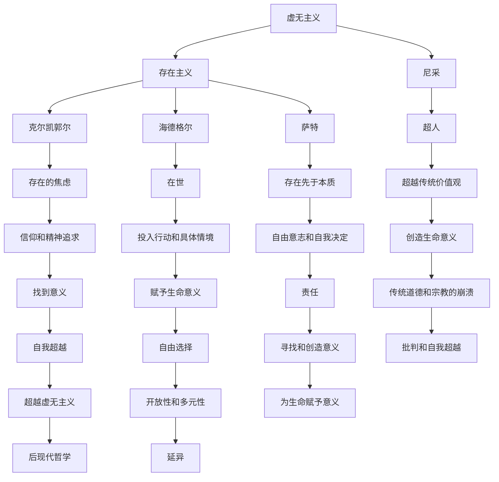

通过这个Mermaid流程图，我们可以清晰地看到虚无主义和存在主义之间的核心概念及其相互关系。虚无主义关注生命的无意义和存在的荒诞，而存在主义则通过自我决定和行动来寻找和赋予生命意义。

### 2.2 道德与价值观的危机

虚无主义对道德和价值观提出了严峻的挑战，这一挑战不仅改变了人们对传统伦理观念的看法，也促使人们重新思考道德和价值观的本质。

**虚无主义对道德的挑战**

虚无主义认为，现实世界是缺乏固有意义的，因此道德规范和伦理价值也是人类自我强加的虚构概念。虚无主义者如尼采认为，传统道德的虚伪和教条主义导致了人类精神的贫困和压迫。尼采提出“道德是弱者的借口”，批评传统道德规范对个体的压制和限制。

尼采的批判引发了对道德本质的深入探讨。如果道德规范只是人类自我强加的虚构，那么它们是否还有实际意义？传统道德观念如善良、正义、忠诚等，在虚无主义的视角下是否仍然成立？这些问题促使人们重新审视道德的基础和适用范围。

**虚无主义对价值观的冲击**

虚无主义不仅挑战了道德，也冲击了传统的价值观体系。传统价值观通常基于宗教、文化和历史传承，它们为人类社会提供了共同的行为准则和生活方式。然而，虚无主义认为这些价值观缺乏客观基础，是人为构建的幻象。

虚无主义对价值观的冲击表现为对传统信仰的质疑和对现代社会的批判。例如，虚无主义者可能认为，现代社会的消费主义和物质追求使得人们失去了精神追求和内心满足，陷入了空虚和迷茫。这种批判促使人们思考，现代社会中是否存在一种更真实、更有意义的价值观。

**重建道德与价值观的尝试**

面对虚无主义的挑战，一些人试图重建道德与价值观体系。这些尝试包括从新的角度重新审视传统道德，或者创造全新的价值观体系。

一种重建道德的尝试是存在主义哲学。存在主义者认为，尽管生命本身缺乏固有的意义，但通过自我决定和行动，个体可以在虚无主义的背景下找到道德价值。例如，萨特的“存在先于本质”理念强调，个体应该通过自由选择来赋予生命以道德意义。

另一种尝试是从多元文化的角度重建价值观。在全球化的背景下，不同文化之间的交流和碰撞使得人们有机会重新审视和整合各种价值观。一些人主张，通过多元文化的融合，可以创造出一种更加包容和开放的价值观体系，以应对虚无主义的挑战。

**核心概念与联系架构 Mermaid 流程图**

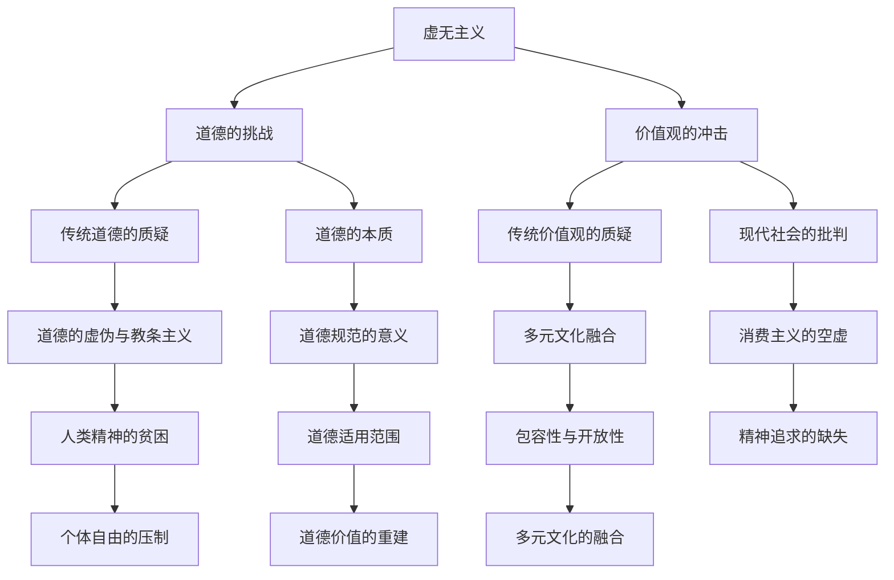

通过这个Mermaid流程图，我们可以清晰地看到虚无主义对道德和价值观的挑战，以及重建道德与价值观的各种尝试。虚无主义质疑传统道德和价值观的合理性，促使人们思考新的道德和价值观体系。

### 2.3 超越虚无主义

虚无主义作为一种哲学思潮，对传统道德和价值观念提出了深刻的质疑，但也揭示了人类存在的一些本质问题。在变动时代，面对虚无主义的挑战，个体和社会都在寻找超越虚无主义的路径，以寻找和建立新的意义和目标。

**虚无主义的局限性**

虚无主义的主要局限性在于其消极和悲观的观点。虚无主义认为现实世界是荒诞和无意义的，这可能导致个体陷入消极、绝望和逃避的心态。长期处于虚无主义的阴影下，个体可能失去对生活的热情和动力，难以实现自我价值和成就。

此外，虚无主义强调传统道德和价值观念的崩溃，这虽然揭示了现代社会的一些问题，但并不意味着我们应该完全否定传统价值观。事实上，许多传统价值观如诚实、善良、正义等，仍然具有重要的道德意义和社会价值。

**超越虚无主义的路径**

要超越虚无主义，个体和社会需要从多个方面进行努力。

1. **自我探索与认知提升**

个体可以通过自我探索和认知提升来超越虚无主义。通过反思自己的生活和价值观，个体可以找到自己真正的兴趣和目标。认知提升则通过学习和思考来扩展视野，了解不同文化和哲学观点，从而在多元的世界中找到自己的位置。

2. **积极行动与目标设定**

个体应该采取积极行动，设定具体的目标和计划。通过行动，个体可以在实践中验证自己的想法，实现自我价值。目标设定则帮助个体保持动力和方向，使他们在面对变动时能够保持冷静和坚定。

3. **建立有意义的人际关系**

人际关系是人生中不可或缺的一部分。通过建立和维护有意义的人际关系，个体可以获得情感支持和精神鼓励，减少内心的孤独感和焦虑。积极的人际关系也有助于个体在社会中找到自己的角色和定位。

4. **社会参与与集体认同**

社会参与和集体认同可以帮助个体在更大的背景下找到意义和目标。通过参与社会活动和公益事业，个体可以感受到自己对社会的贡献，从而获得成就感和认同感。集体认同则通过共同的价值观和目标，增强个体的社会归属感和责任感。

**超越虚无主义的意义**

超越虚无主义不仅对个体具有重要意义，也对社会具有深远的影响。

1. **个体成长与自我实现**

通过超越虚无主义，个体可以找到自己的兴趣和目标，实现自我价值和成就。这种自我实现不仅提高了个体的幸福感，也促进了社会的多样性和创造力。

2. **重建道德与价值观**

超越虚无主义有助于重建道德和价值观体系。通过在新的背景下重新审视传统价值观，个体和社会可以找到更加适应现代社会需求的道德准则和价值观。

3. **社会的和谐与进步**

通过超越虚无主义，社会可以减少个体和群体之间的矛盾和冲突，促进社会的和谐与进步。社会参与和集体认同也增强了社会的凝聚力和稳定性。

**核心概念与联系架构 Mermaid 流程图**

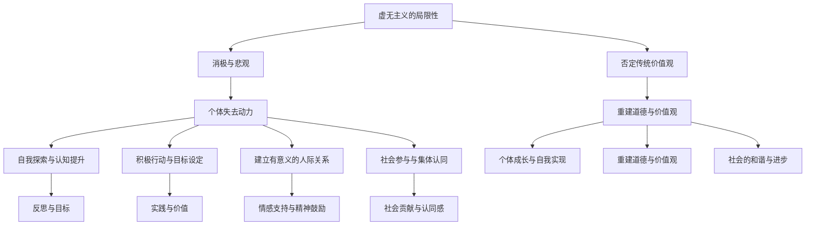

通过这个Mermaid流程图，我们可以清晰地看到超越虚无主义的路径和意义。通过自我探索、积极行动、建立有意义的人际关系和社会参与，个体可以超越虚无主义的局限，找到新的意义和目标。

### 3.1 个人身份的迷失

在变动时代，个人身份的迷失成为许多个体面临的重大挑战。个人身份的迷失不仅源于外部环境的变化，更与个体内心深处的困惑和焦虑密切相关。

**变动时代下个人身份的挑战**

变动时代的主要特征是快速变化和不确定性，这种特征对个人身份产生了深远的影响。首先，全球化使得人们的生活和工作环境变得多样化，传统的社会角色和职业边界逐渐模糊。个体需要不断适应新的环境和角色，这增加了身份的不确定性。

其次，信息技术的迅猛发展使得知识的更新速度加快，个体需要不断学习新的技能和知识以保持竞争力。这种知识更新速度的加快，使得个体对自己的身份认同产生了疑问，不知道自己应该如何定位和定位。

此外，变动时代的社会结构也发生了变化，传统的家庭、社区和社会组织形式逐渐瓦解，新的社会关系和网络变得更加复杂和多元。个体在这个变动的社会中，难以找到固定的身份认同，往往感到无所适从。

**个人身份迷失的原因**

个人身份迷失的原因是多方面的。一方面，变动时代带来的快速变化和不确定性使得个体难以把握自己的未来，从而导致身份的不确定感。另一方面，现代社会的高度竞争和压力也加剧了个体内心的焦虑和不安。

首先，变动时代的不确定性使得个体对未来缺乏安全感。在快速变化的环境中，个体很难预测自己的职业前景和生活状态，这增加了他们对个人身份的不确定性。

其次，现代社会对个体的要求越来越高，个体需要不断适应新的环境和角色。这种不断变化的要求，使得个体难以找到稳定的身份认同，往往感到自己在不同角色之间摇摆不定。

此外，个体的内心焦虑和不安也是导致身份迷失的重要原因。在变动时代，个体面临着巨大的心理压力，他们往往感到焦虑、无助和迷茫。这种心理状态进一步加剧了个人身份的迷失。

**应对个人身份迷失的策略**

面对个人身份迷失的挑战，个体可以采取以下策略来应对。

首先，个体需要接受变动时代的不确定性，并学会适应。通过积极调整心态，个体可以减少对未来的担忧，从而降低身份迷失的风险。

其次，个体应该注重自我探索，找到自己的兴趣和目标。通过自我反思和认知提升，个体可以明确自己的价值观和人生方向，从而找到稳定的身份认同。

此外，个体应该建立和维护有意义的人际关系。通过与家人、朋友和社会建立紧密的联系，个体可以获得情感支持和精神鼓励，增强自己的社会归属感。

最后，个体可以参与社会活动和公益事业。通过为社会做出贡献，个体不仅可以感受到自己的价值，还可以找到自己的社会角色和身份认同。

**核心概念与联系架构 Mermaid 流程图**

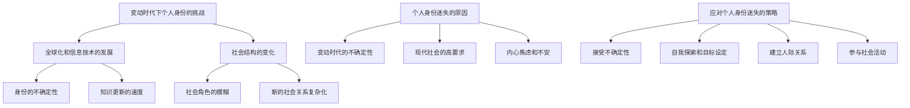

通过这个Mermaid流程图，我们可以清晰地看到变动时代下个人身份迷失的挑战、原因和应对策略。在变动时代，个人身份的迷失是一个普遍的现象，但通过积极应对，个体可以找到自己的身份和方向。

### 3.2 社会关系的困境

在变动时代，社会关系的变迁使得个体面临诸多困境，这不仅影响了个体之间的互动，也对社会整体的健康产生了负面影响。

**变动时代下社会关系的变迁**

变动时代的一个显著特征是社会的快速变迁，这种变迁表现在多个方面，包括全球化、信息技术的发展以及社会结构的重组。

首先，全球化使得人们跨越地域界限，建立起更加紧密的联系。然而，全球化也带来了文化的碰撞和冲突，不同文化背景的人们在沟通和互动中可能遇到理解上的障碍，从而影响社会关系的稳定。

其次，信息技术的发展改变了人们的沟通方式。互联网和社交媒体的普及，使得人们可以随时随地保持联系，但同时也使得人际互动变得更加虚拟和表面。这种虚拟关系虽然丰富了人们的社交网络，但也削弱了面对面的交流，可能导致人与人之间的疏离感。

最后，社会结构的重组，如职业流动性的增加和家庭形式的多样化，也对社会关系产生了深远的影响。传统的家庭、社区和职场关系逐渐解体，新的社会关系和网络变得更加复杂和多元，个体在社会关系中的定位变得更加不确定。

**社会关系困境的成因**

变动时代下，社会关系困境的成因主要可以归纳为以下几个方面：

1. **文化冲突**

全球化带来了不同文化的交融，但同时也引发了文化冲突。在多元文化的背景下，人们可能因为价值观、信仰和生活方式的差异而产生误解和矛盾。文化冲突不仅影响个体之间的和谐相处，也可能导致社会整体的不稳定。

2. **虚拟关系的泛滥**

随着信息技术的发展，人们越来越依赖虚拟平台进行沟通和互动。虽然这种虚拟关系在一定程度上丰富了社交网络，但过度依赖虚拟平台也可能导致人与人之间的疏离。虚拟关系的表面化和肤浅化，使得人们难以建立深层次的情感联系。

3. **社会结构的重组**

职业流动性的增加和家庭形式的多样化，使得传统的社会关系网络发生变化。个体在变动的社会结构中，难以找到固定的社会角色和定位，这增加了社会关系的复杂性。同时，社会结构的重组也带来了社会信任的下降，个体之间的互信和合作变得困难。

**应对社会关系困境的方法**

面对社会关系的困境，个体和社会可以采取以下方法来缓解和解决这些问题：

1. **加强文化教育**

通过加强文化教育，提高人们对不同文化的理解和尊重，可以减少文化冲突。个体应该学会包容和尊重不同的文化背景，通过跨文化的交流和互动，建立更加和谐的社会关系。

2. **促进真实人际互动**

虽然虚拟关系在一定程度上丰富了社交网络，但真实的人际互动仍然是建立深层次情感联系的重要途径。个体应该尽量减少对虚拟平台的依赖，多参与面对面的社交活动，增强人际互动的质量。

3. **建立社区支持网络**

社区支持网络可以在个体面临困境时提供帮助和支持。通过建立社区支持网络，个体可以在需要时获得情感和实际的支持，减轻社会关系的压力。社区组织可以开展各种活动，促进居民之间的交流和互动，增强社区的凝聚力。

4. **培养合作精神**

社会关系的困境往往源于个体之间的互信和合作的缺失。通过培养合作精神，个体可以在共同目标的基础上建立合作关系，增强社会整体的稳定性和凝聚力。企业和组织也应该鼓励员工之间的合作，促进团队合作和共同发展。

**核心概念与联系架构 Mermaid 流程图**

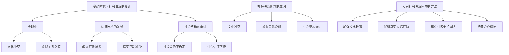

通过这个Mermaid流程图，我们可以清晰地看到变动时代下社会关系的变迁、困境的成因和应对方法。在变动时代，社会关系的困境是一个普遍存在的问题，但通过积极应对，个体和社会可以建立更加和谐和稳定的社会关系。

### 3.3 心灵的挣扎

在变动时代，个体心灵面临的挣扎成为一种普遍现象。这种挣扎不仅源于外界环境的快速变化，更与个体内心深处的焦虑和不安密切相关。

**变动时代下的心理压力**

变动时代带来的快速变化和不确定性，使得个体面临巨大的心理压力。首先，全球化和信息技术的发展，使得信息的获取和传播速度大大加快，个体需要在短时间内吸收和处理大量信息。这种信息过载可能导致个体感到焦虑和不安。

其次，社会结构的重组和职业流动性的增加，使得个体在职业和生活上的不确定性增加。这种不确定性使得个体对未来缺乏安全感，进而产生焦虑和恐惧。

此外，变动时代的高压工作和快节奏生活，也加剧了个体内心的压力。长时间的工作和高强度的生活节奏，使得个体难以得到足够的休息和放松，导致身心疲惫和情绪低落。

**心灵挣扎的表现**

心灵挣扎在个体身上有多种表现形式。首先，焦虑是一种常见的心理状态。个体可能会对未来的不确定性感到担忧，对即将到来的挑战感到恐惧。这种焦虑往往表现为紧张、失眠、注意力难以集中等。

其次，抑郁也是变动时代下个体心灵挣扎的一种表现。个体可能会因为生活的压力和不确定性而感到情绪低落，对事物失去兴趣，甚至出现自我否定的倾向。长期处于抑郁状态，会对个体的身心健康产生严重影响。

此外，个体还可能经历自我怀疑和自我否定。在变动时代，个体需要不断适应新的环境和角色，但往往感到自己无法胜任，从而产生自我怀疑。长期自我否定可能导致个体失去自信，影响自我价值的实现。

**应对心灵挣扎的途径**

面对心灵挣扎，个体可以采取多种途径来缓解和解决这些问题。

首先，心理调适是一种有效的应对方法。通过学习心理调适技巧，个体可以学会如何应对压力和情绪波动。例如，深呼吸、冥想和放松训练等方法，可以帮助个体缓解焦虑和紧张情绪。

其次，寻求专业帮助也是一个重要的途径。心理治疗师和心理咨询师可以提供专业的指导和帮助，帮助个体分析和解决内心的困扰。通过心理咨询，个体可以更好地理解自己的情绪和心理状态，找到解决问题的方法。

此外，建立健康的生活方式也是缓解心灵挣扎的关键。个体应该注重饮食健康、规律作息和适度运动，以保持身体的健康和精神的稳定。同时，培养兴趣爱好，参与社交活动，也可以帮助个体缓解内心的压力。

最后，自我接纳和自我肯定也是应对心灵挣扎的重要途径。个体应该学会接纳自己的不完美，认可自己的努力和成就。通过自我接纳和自我肯定，个体可以建立积极的自我形象，增强内心的力量和自信。

**核心概念与联系架构 Mermaid 流程图**

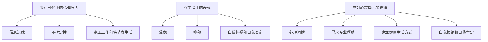

通过这个Mermaid流程图，我们可以清晰地看到变动时代下个体心灵挣扎的来源、表现和应对途径。在变动时代，个体需要学会应对心灵挣扎，以保持内心的平衡和稳定。

### 4.1 寻找存在的意义

在虚无主义的阴影下，寻找存在的意义成为一个复杂而深奥的哲学问题。存在意义不仅是个人成长和自我实现的基石，也是社会进步和人类文明发展的重要动力。在这个部分，我们将探讨存在的意义、寻找存在意义的途径以及存在意义的实践。

#### 存在意义的含义

存在的意义是指个体或整体在宇宙中存在的根本价值和目的。这个概念在不同哲学体系中有着不同的解释，但总体上，存在意义涉及到个体如何赋予自己的生活以价值，以及如何在有限的生命中实现最大化的自我实现。

存在主义哲学，特别是萨特的“存在先于本质”理论，认为人类的存在本身就是有意义的，尽管这个意义不是预先设定的，而是通过个体的选择和行动来创造的。这种观点强调个体的自由意志和自我决定，认为人可以通过自己的行为和选择来赋予生命以意义。

#### 寻找存在意义的途径

寻找存在意义的途径可以从以下几个方面进行探讨：

1. **自我探索**

自我探索是寻找存在意义的第一步。通过反思自己的经历、感受和思考，个体可以深入了解自己的内心世界，找到与自我认同相关的事物。自我探索可以通过日记写作、冥想和心理咨询等途径进行。

2. **目标设定**

明确的目标可以帮助个体在寻找存在意义的过程中保持方向。设定具体、可衡量的目标，并制定实现这些目标的步骤，可以激励个体不断前进，从而在实现目标的过程中找到生活的意义。

3. **价值观重建**

价值观是指导个体行为和决策的基本原则。通过重建自己的价值观，个体可以在变动时代中找到属于自己的道德和信念体系，从而在追求个人目标和意义的同时，也为社会做出贡献。

4. **与他人建立联系**

与他人建立深层次的情感联系，如友情、亲情和爱情，可以帮助个体在寻找存在意义的过程中获得支持和鼓励。这种联系不仅丰富了个体的人生经历，也为个体提供了精神上的满足。

#### 存在意义的实践

存在意义的实践体现在个体如何在日常生活中实现和表达这一意义。以下是一些具体的实践方法：

1. **志愿服务**

通过参与志愿服务，个体可以为社会做出贡献，从而找到自己的社会价值。志愿服务不仅可以帮助他人，也能让个体感受到自己的存在对于社会的重要性。

2. **创造力发挥**

通过艺术、写作、音乐、科学等创造性活动，个体可以表达自己的内心世界，实现自我价值的提升。创造力发挥不仅可以带来个人的满足感，也可以为人类文明的进步做出贡献。

3. **终身学习**

终身学习不仅可以帮助个体不断提升自己的知识水平，也可以让个体在追求知识的过程中找到生活的意义。通过不断学习，个体可以扩展自己的视野，增强对世界的理解和认知。

4. **自我反思**

定期进行自我反思，回顾自己的行为和决策，可以帮助个体更好地理解自己的内心需求和价值观。这种反思不仅有助于个体在现实生活中找到存在意义，也有助于个体实现自我成长和自我实现。

**核心概念与联系架构 Mermaid 流程图**

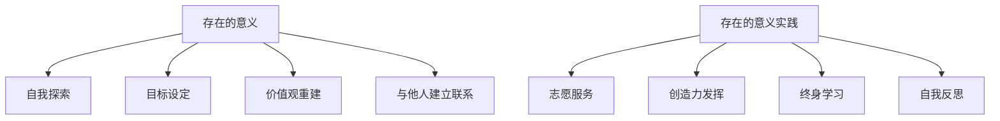

通过这个Mermaid流程图，我们可以清晰地看到寻找存在的意义及其实践的路径和方法。在虚无主义的背景下，通过自我探索、目标设定、价值观重建、与他人建立联系以及实际的实践活动，个体可以在变动时代中找到自己的存在意义。

### 4.2 个人成长与自我实现

**个人成长的重要性**

个人成长是每个人在人生旅途中不可或缺的一部分。它不仅关乎个体的内心发展，也直接影响着个人的生活质量和社会地位。个人成长包括认知能力的提升、情感素质的增强、行为习惯的优化等多方面内容。一个不断成长和进步的个体，能够在面对变动时代带来的挑战时，保持适应性和创新能力，从而在竞争激烈的环境中脱颖而出。

**个人成长的路径**

个人成长的路径可以通过以下几个方面来实现：

1. **终身学习**

在知识更新速度极快的今天，终身学习已经成为个人成长的必备条件。通过不断学习新知识、新技能，个体可以拓宽自己的视野，提升自己的竞争力。终身学习可以通过线上课程、专业培训、读书会等多种形式进行。

2. **自我反思**

自我反思是个人成长的重要手段。通过定期回顾自己的行为和决策，个体可以识别自己的优点和不足，从而有针对性地进行改进。自我反思可以通过日记、心理咨询、团队合作等多种方式进行。

3. **积极心态**

积极心态对个人成长具有重要作用。一个乐观、积极的人在面对困难时，能够保持冷静和自信，从而更好地应对挑战。培养积极心态可以通过正面思考、感恩练习、自我激励等方法实现。

**自我实现的路径**

自我实现是个人成长的终极目标，它指的是个体在充分挖掘自身潜力、实现自身价值的过程中，达到的一种内在满足和自我肯定的状态。以下是一些实现自我实现的路径：

1. **设定目标**

明确的目标是自我实现的基础。个体应该根据自己的兴趣、能力和价值观，设定短期和长期的目标，并制定具体的行动计划。通过实现这些目标，个体可以逐步实现自我价值。

2. **发挥优势**

每个人都有自己的优势和特长。通过发挥自己的优势，个体可以在某个领域取得突出成就，从而实现自我价值。发挥优势可以通过职业规划、兴趣培养、技能提升等多种途径实现。

3. **持续努力**

自我实现是一个持续的过程，需要个体付出长期的努力和坚持。个体应该保持对目标的热情和动力，不断克服困难和挑战，直到实现自我价值的最大化。

**个人成长与自我实现的案例**

以下是一些个人成长与自我实现的案例，这些案例展示了个体在不同领域如何通过努力和坚持实现自我价值：

1. **案例一：科学家张三**

张三是一位年轻的科学家，他对生物学充满兴趣。在大学期间，他通过参加科研项目、发表论文，不断提升自己的学术能力。毕业后，他进入一家知名科研机构工作，继续深入研究生物学领域。通过多年的努力，张三最终成为该机构的领军人物，并在国际学术会议上发表了多篇重要论文，实现了自我价值。

2. **案例二：创业者李四**

李四是一位充满创业激情的年轻人。他在大学期间就创办了自己的公司，专注于开发智能硬件产品。面对市场竞争和技术挑战，李四始终坚持创新和改进，逐步赢得了客户的信任和市场认可。经过几年的努力，他的公司成为行业内的佼佼者，李四也实现了自己的创业梦想。

3. **案例三：艺术家王五**

王五是一位热爱艺术的年轻人。他在绘画和雕塑方面有很高的天赋，通过不断练习和创作，他的作品逐渐受到认可和赞赏。他积极参加各种艺术展览，与同行进行交流和合作，不断提升自己的艺术水平。最终，王五成为了一名知名艺术家，他的作品被多家博物馆和画廊收藏，实现了自我价值的最大化。

**核心概念与联系架构 Mermaid 流程图**

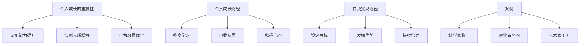

通过这个Mermaid流程图，我们可以清晰地看到个人成长与自我实现的重要性和路径。通过终身学习、自我反思、积极心态，以及设定目标、发挥优势、持续努力，个体可以在变动时代中实现自我价值。

### 4.3 社会责任与集体认同

**社会责任的意义**

社会责任是指个体或组织在行为和决策过程中，对所处社会环境和其他成员所承担的责任和义务。社会责任不仅体现了个体或组织对社会的影响力和担当，也是社会稳定和发展的重要基石。承担社会责任，意味着个体或组织在追求自身利益的同时，也关注社会公共利益，为社会做出贡献。

**集体认同的重要性**

集体认同是指个体在某个群体中感受到的归属感和认同感。集体认同不仅增强了群体的凝聚力和稳定性，也为个体提供了情感支持和精神动力。在一个具有高度集体认同的群体中，个体更容易找到自己的位置，实现自我价值。

**社会责任与集体认同的实践**

在现代社会，社会责任和集体认同的实践可以从以下几个方面进行：

1. **志愿服务**

志愿服务是一种重要的社会责任实践方式。通过参与志愿服务，个体可以为社区和弱势群体提供帮助，从而实现自身的社会价值。志愿服务不仅有助于增强个体的社会责任感，也有助于培养集体认同感。

2. **公益捐赠**

公益捐赠是指个体或组织将部分财产用于公益事业的行为。公益捐赠可以支持教育、医疗、环保等社会事业，为社会做出实质性贡献。通过公益捐赠，个体可以在帮助他人的同时，感受到自己的价值和社会影响力。

3. **参与社区活动**

参与社区活动是增强集体认同的重要途径。通过参与社区活动，个体可以与邻居和社区成员建立深厚的联系，增强社区凝聚力。社区活动包括环保活动、文化活动、社区建设等，这些活动有助于培养集体认同感。

4. **支持社会公益活动**

支持社会公益活动是体现社会责任感的重要方式。个体可以通过参与公益活动，如慈善义卖、公益演出、公益讲座等，为社会公益事业做出贡献。这种支持不仅有助于提升个体的社会责任感，也有助于加强集体认同。

**案例分析**

以下是一些关于社会责任和集体认同的案例分析：

1. **案例一：环保志愿者李华**

李华是一名环保志愿者，他积极参与社区组织的环保活动，如垃圾分类宣传、环保义诊等。通过这些活动，李华不仅为社区环境做出了贡献，也增强了与邻居的互动，培养了集体认同感。

2. **案例二：公益捐赠者王强**

王强是一位成功的企业家，他通过设立慈善基金，支持教育、医疗等公益事业。他的公益捐赠行为不仅帮助了众多需要帮助的人，也提升了他在社会上的影响力，增强了集体认同感。

3. **案例三：社区活动参与者赵敏**

赵敏是一名社区活动的积极参与者，她经常参与社区的各类活动，如社区文化节、环保行动等。通过这些活动，赵敏不仅与邻居建立了深厚的友谊，也增强了社区凝聚力，培养了集体认同感。

**核心概念与联系架构 Mermaid 流程图**

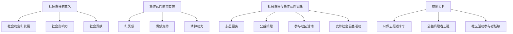

通过这个Mermaid流程图，我们可以清晰地看到社会责任和集体认同的实践方法和案例，以及它们在社会发展中的作用。通过实际行动，个体可以在承担社会责任的同时，增强集体认同感。

### 5.1 心理调适与情绪管理

在变动时代，心理调适与情绪管理成为个体应对挑战、保持内心平衡的重要手段。有效的心理调适和情绪管理不仅能够缓解压力，提高生活质量，还能增强个体的心理韧性和适应能力。

#### 心理调适的方法

1. **认知重构**

认知重构是通过改变负面思维模式来调整情绪和行为的方法。个体可以通过反思和自我觉察，识别和改变那些导致负面情绪的思维方式。例如，将“我一定会失败”这样的消极思维转变为“我可以通过努力克服困难”。

2. **放松训练**

放松训练是一种通过身体和呼吸的放松来缓解压力和紧张情绪的方法。常见的放松训练包括深呼吸、瑜伽、冥想等。这些方法能够帮助个体放松身心，减轻压力，提高情绪稳定性。

3. **积极心态培养**

积极心态的培养是通过积极的思维和行动来增强个体对生活的满意度和幸福感。个体可以通过阅读积极书籍、观看励志影片、参与正面社交活动等方式，培养积极心态。

#### 情绪管理的技巧

1. **情绪表达**

情绪表达是指个体学会以健康、适度的方式表达自己的情绪。有效的情绪表达可以帮助个体释放压力，避免情绪积压。个体可以通过与他人沟通、写日记、绘画等方式来表达情绪。

2. **情绪调节**

情绪调节是指个体通过改变自己的情绪反应来应对压力和挑战。常见的情绪调节技巧包括认知重评、情绪释放、自我安慰等。个体可以通过练习这些技巧来提高情绪调节能力。

3. **情绪智力的培养**

情绪智力是指个体识别、理解、管理和利用情绪的能力。培养情绪智力可以通过学习情绪识别、情感表达、自我激励和社交技能等来实现。情绪智力高的个体往往能够更好地应对压力和挑战。

#### 心理调适与情绪管理的案例

1. **案例一：李明的情绪管理**

李明是一名职场新人，在工作中常常因为压力和挑战感到焦虑。他通过参加心理咨询课程，学习到了情绪管理的技巧，如认知重构和情绪调节。通过这些技巧，李明成功地减轻了工作压力，提高了情绪稳定性，从而更好地适应了职场环境。

2. **案例二：王丽的心理调适**

王丽在生活中面临诸多困扰，她通过练习冥想和瑜伽，学会了放松训练的方法。这些方法帮助她缓解了心理压力，提高了情绪稳定性。通过心理调适，王丽能够更加积极面对生活中的挑战，提升了生活质量。

3. **案例三：张强的人际沟通**

张强在人际交往中常常感到困惑和焦虑，他通过学习情绪智力的相关技巧，如情绪表达和情绪调节，提高了自己的人际沟通能力。现在，张强能够更有效地与他人交流，增强了人际关系，提升了生活质量。

**核心概念与联系架构 Mermaid 流程图**

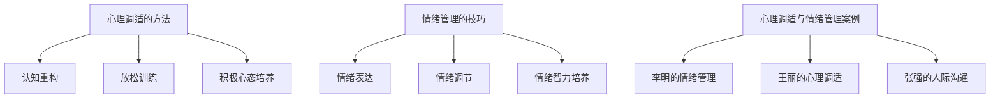

通过这个Mermaid流程图，我们可以清晰地看到心理调适与情绪管理的方法和技巧，以及实际案例中的应用。通过这些方法和技巧，个体可以更好地应对变动时代的挑战，保持内心的平衡和稳定。

### 5.2 人生规划与目标设定

**人生规划的重要性**

人生规划是指个体根据自己的兴趣、能力和价值观，为自己设定长期和短期的目标，并制定实现这些目标的步骤和策略。人生规划的重要性体现在以下几个方面：

首先，人生规划有助于个体明确自己的方向和目标，减少不确定性。在变动时代，社会和科技环境不断变化，个体需要具备快速适应和改变的能力。通过制定人生规划，个体可以更好地应对变化，保持稳定的发展路径。

其次，人生规划有助于提升个体的自律性和执行力。在实现目标的过程中，个体需要不断地自我激励和调整策略。通过人生规划，个体可以更好地管理自己的时间和资源，提高工作效率和成果。

最后，人生规划有助于个体的心理健康。在实现目标的过程中，个体会面临各种挑战和压力。通过制定人生规划，个体可以在目标实现的过程中获得成就感，增强自信心，减少焦虑和抑郁情绪。

**目标设定的方法**

目标设定的方法主要包括以下几个步骤：

1. **明确目标**

明确目标是目标设定的第一步。个体需要根据自己的兴趣、能力和价值观，设定具体、明确的目标。例如，如果个体希望在职业生涯中取得成功，可以设定在特定时间内晋升到某个职位或完成某个重要项目。

2. **分解目标**

分解目标是将长期目标分解为一系列短期目标或任务。通过分解目标，个体可以更加清晰地了解每一步的具体任务，从而更好地制定实现目标的步骤和策略。例如，如果个体的目标是晋升到某个职位，可以设定在特定时间内完成某些关键项目或取得某些重要成果。

3. **制定计划**

制定计划是指为每个目标制定具体的行动步骤和时间表。通过制定计划，个体可以更好地分配时间和资源，提高工作效率。例如，如果个体的目标是学习一项新技能，可以设定每天学习一定时间，并在每周进行复习和总结。

4. **评估和调整**

评估和调整是指定期对目标的实现情况进行评估，并根据实际情况进行调整。通过评估和调整，个体可以及时发现问题，采取有效的措施进行改进。例如，如果个体发现自己在实现某个目标的过程中遇到困难，可以重新审视目标设定，调整计划和策略。

**人生规划与目标设定的实例**

以下是一个关于人生规划与目标设定的实例：

**实例：小明的职业生涯规划**

1. **明确目标**

小明的职业目标是成为一家知名咨询公司的合伙人。他希望通过多年的努力，积累丰富的经验和知识，为公司和社会做出更大的贡献。

2. **分解目标**

为了实现成为合伙人的目标，小明将目标分解为以下几个阶段：

- 在前两年，通过参与各种项目，积累实践经验，提升自己的专业技能。
- 在接下来的五年，逐步晋升为高级咨询顾问，负责重要的项目，并在团队中发挥核心作用。
- 在十年的职业生涯中，成为公司的合伙人，参与公司的战略规划和决策。

3. **制定计划**

为了实现这些目标，小明制定了具体的行动计划：

- 每天学习一定时间，提升自己的专业技能。
- 参加行业研讨会和培训，了解最新的行业动态。
- 与同事和导师进行交流和合作，提升团队协作能力。
- 在五年内，争取晋升为高级咨询顾问，承担重要项目。

4. **评估和调整**

小明定期对自己的职业目标进行评估，并根据实际情况进行调整。例如，在实现每个阶段目标的过程中，他发现自己在某些方面存在不足，于是重新制定了学习计划和目标，以便更好地提升自己的能力。

通过这个实例，我们可以看到人生规划与目标设定在职业生涯中的重要性。通过明确目标、分解目标、制定计划和评估调整，个体可以更好地实现自己的职业目标，走向成功的道路。

### 5.3 寻找生命意义的活动

在变动时代，寻找生命意义成为许多个体的重要课题。通过参与各种活动，个体不仅可以在实践中找到意义，还能提升自我价值和生活质量。以下是一些寻找生命意义的活动及其益处。

#### 自我反思活动

自我反思是一种深入思考自己行为、想法和情感的过程。通过自我反思，个体可以更好地理解自己的内心世界，发现内心的需求和价值观。常见的自我反思活动包括写日记、冥想和心理咨询等。

**益处：**

1. **提高自我认知**：通过反思，个体可以更清晰地认识到自己的优点和不足，从而更好地进行自我提升。
2. **减轻心理压力**：自我反思有助于释放内心的负面情绪，减轻心理压力。
3. **增强内心力量**：通过反思，个体可以更好地应对生活中的挑战，增强内心的力量和韧性。

#### 社区服务活动

参与社区服务活动，如志愿服务、公益捐赠和社区建设等，可以帮助个体为社会做出贡献，从而找到生命的意义。通过这些活动，个体不仅可以帮助他人，还能感受到自己的价值和存在意义。

**益处：**

1. **提升社会责任感**：通过参与社区服务，个体可以更好地认识到自己在社会中的角色和责任，提升社会责任感。
2. **增强人际关系**：社区服务活动有助于个体与社区成员建立联系，增强人际关系和社会支持。
3. **提升幸福感**：通过帮助他人，个体可以获得成就感和满足感，提升幸福感。

#### 学习和发展活动

终身学习和发展活动，如读书会、在线课程和专业培训等，可以帮助个体不断提升自己的知识水平和技能，从而在职业和个人生活中实现更大的价值。

**益处：**

1. **提升竞争力**：通过不断学习和发展，个体可以提升自己的专业能力和竞争力。
2. **增强自我实现**：学习和发展活动有助于个体实现自我价值，提升自信心和自尊心。
3. **扩展视野**：通过学习不同的知识和技能，个体可以拓宽自己的视野，增强对世界的理解和认知。

#### 创造性活动

创造性活动，如艺术创作、写作和音乐等，可以帮助个体表达自己的情感和思想，找到内心的平静和满足。

**益处：**

1. **释放情感**：通过创造性活动，个体可以更好地表达和处理自己的情感，减轻内心的压力。
2. **提升创造力**：创造性活动有助于培养个体的创造力，增强思维灵活性和创新能力。
3. **提升生活质量**：创造性活动可以丰富个体的生活，提升生活质量和幸福感。

#### 团队协作活动

团队协作活动，如团队建设、合作项目和团队合作等，可以帮助个体在集体中找到自己的位置，增强团队合作能力和社交技能。

**益处：**

1. **提升团队合作能力**：通过团队协作活动，个体可以更好地理解和适应团队合作，提升团队合作能力。
2. **增强社交技能**：团队协作活动有助于个体提高沟通、协调和解决问题的能力，增强社交技能。
3. **提升团队凝聚力**：通过共同完成任务和面对挑战，团队成员可以建立深厚的友谊和信任，提升团队凝聚力。

**核心概念与联系架构 Mermaid 流程图**

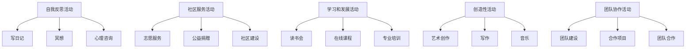

通过这个Mermaid流程图，我们可以清晰地看到各种寻找生命意义的活动及其益处。通过参与这些活动，个体不仅可以在实践中找到生命的意义，还能提升自我价值和生活质量。

### 6.1 案例一：个人成长的转变

**案例背景**

张伟，一个35岁的IT行业从业者，曾在一家大型科技公司担任项目经理。然而，随着公司业务的变化和竞争的加剧，张伟感到自己的职业发展受到了限制。他意识到，如果不在技术和能力上做出改变，将难以在快速变化的市场中保持竞争力。为了实现个人成长，张伟决定进行一系列的自我提升和职业转变。

**转变过程**

1. **自我评估**

张伟首先进行了全面的自我评估，包括技能、知识和职业目标。他发现自己虽然在项目管理方面有一定的经验，但在技术深度和领导力方面还有很大的提升空间。为了更好地了解自己的优势和不足，张伟还参加了职业咨询和领导力培训。

2. **学习新技能**

张伟意识到，要实现个人成长，必须学习新的技能。他报名参加了多个在线课程，包括人工智能、大数据分析和软件架构设计等。通过学习，张伟不仅掌握了新技能，还积累了丰富的实践经验。

3. **职业转型**

在完成新技能的学习后，张伟决定进行职业转型。他开始寻找与人工智能和大数据相关的职位，并通过积极面试和准备，成功转型为数据科学家。在新的职位上，张伟不仅能够发挥自己的技术优势，还获得了更多的职业发展机会。

4. **持续成长**

转型后的张伟并没有止步不前。他继续参加行业研讨会、学术会议，并与同行保持紧密的交流。通过不断学习和实践，张伟在数据科学领域取得了显著的成就，成为公司的重要技术骨干。

**转变的成果与影响**

张伟的个人成长和职业转变取得了显著的成果。首先，他在新的职位上展现出了出色的技术能力和领导力，为公司带来了实际的价值。其次，通过持续学习和实践，张伟在数据科学领域建立了自己的声誉，获得了更多的职业机会和成就感。

张伟的转变不仅影响了他的职业发展，也对他的个人生活产生了积极的影响。他感到自己在工作和生活中都变得更加自信和充实。此外，张伟的经验和故事也激励了周围的同事和年轻人，为他们提供了宝贵的经验和启示。

**核心概念与联系架构 Mermaid 流程图**

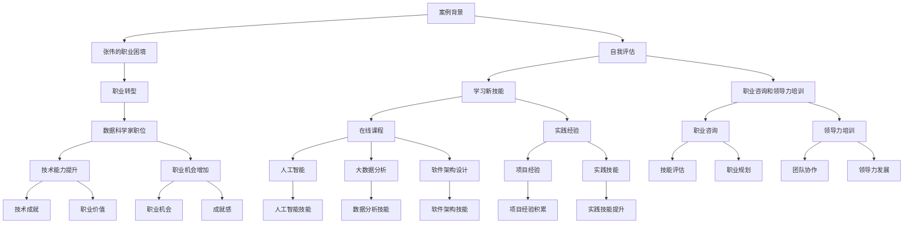

通过这个Mermaid流程图，我们可以清晰地看到张伟个人成长的转变过程、取得的成果以及对他的个人和职业生活产生的积极影响。

### 6.2 案例二：社会参与与集体认同

**案例背景**

李红是一名35岁的社区工作者，她致力于推动社区的发展和居民的福祉。在变动时代，她面临着资源有限、社区矛盾加剧和居民需求多样化的挑战。为了在变动中建立集体认同，李红决定通过一系列社会参与活动来提升社区凝聚力。

**社会参与的过程**

1. **社区调研**

李红首先进行了深入的社区调研，了解居民的需求和期望。她通过访谈、问卷调查和社区会议等方式，收集了大量的数据，为后续的活动策划提供了依据。

2. **组织社区活动**

基于调研结果，李红组织了一系列社区活动，包括环保宣传、健康讲座、文化展览和社区志愿服务等。这些活动旨在提升居民的生活质量，增强社区的凝聚力。

3. **建立志愿者团队**

李红积极招募志愿者，组建了一支由社区居民组成的志愿者团队。通过参与社区活动，志愿者不仅为社区做出了贡献，还建立了深厚的友谊和信任。

4. **社区合作**

李红还与当地的学校、企业和非营利组织建立了合作关系，共同推动社区的发展。通过多方合作，社区的资源得到了有效整合，居民的参与度和满意度显著提升。

**集体认同的建立**

通过一系列的社会参与活动，李红成功地在社区中建立了集体认同。首先，居民在参与活动的过程中感受到了彼此的关心和支持，增强了社区归属感。其次，通过共同的目标和价值观，居民之间的信任和合作得到了加强，社区凝聚力显著提升。

**核心概念与联系架构 Mermaid 流程图**

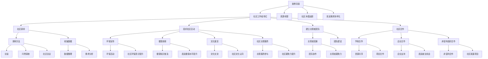

通过这个Mermaid流程图，我们可以清晰地看到李红在社会参与和集体认同建立过程中的关键步骤和成果，以及这些活动对社区发展和居民福祉的积极影响。

### 6.3 案例三：心理调适与情绪管理

**案例背景**

王强是一名30岁的软件工程师，他在一家科技初创公司工作。由于公司业务的快速扩张和竞争的加剧，王强面临着巨大的工作压力。他经常加班，心理负担沉重，情绪波动较大，甚至出现了失眠和焦虑的症状。为了应对这些心理问题，王强决定通过一系列的方法进行心理调适和情绪管理。

**心理调适的方法与效果**

1. **认知行为疗法**

王强通过阅读相关书籍和参加心理健康讲座，学会了认知行为疗法（CBT）的方法。他开始记录自己的思维模式，识别出那些导致负面情绪的思维方式，并通过积极的思维重构来调整自己的心态。例如，他学会了将“我无法完成这个任务”这种消极思维转变为“我可以通过合理规划和时间管理来完成任务”。

2. **深呼吸和放松训练**

王强每天早上和晚上都会进行深呼吸和放松训练。通过深呼吸，他能够更好地管理自己的情绪，减少焦虑和紧张。放松训练则帮助他在高压工作后放松身心，缓解疲劳。

3. **运动和健康饮食**

王强开始定期参加健身房锻炼，并调整了自己的饮食习惯。通过运动，他不仅提高了身体素质，还释放了工作压力，增强了情绪稳定性。健康饮食则为他的身体提供了充足的能量和营养，提高了工作效率。

**情绪管理的实践与反馈**

1. **情绪日记**

王强每天都会记录自己的情绪变化，包括工作压力、社交互动和个人感受。通过记录情绪日记，他能够更好地了解自己的情绪波动，从而采取相应的措施进行管理。

2. **与朋友和家人交流**

王强学会了在情绪低落时寻求朋友和家人的支持。通过与亲近的人交流，他能够释放内心的压力，获得情感上的安慰和建议。

3. **心理咨询**

在尝试了多种方法后，王强决定寻求专业心理咨询的帮助。通过几次心理咨询，他学会了更有效地应对工作压力和情绪波动，心理咨询师还为他提供了一些个性化的建议和技巧。

**效果反馈**

经过一段时间的心理调适和情绪管理，王强取得了显著的效果。首先，他的情绪稳定性得到了提高，焦虑和失眠症状明显缓解。其次，他的工作效率和生产力也得到了提升，能够更好地应对工作中的挑战。最后，他感到自己的生活质量和幸福感有了显著改善，与家人和朋友的关系也更加和谐。

**核心概念与联系架构 Mermaid 流程图**

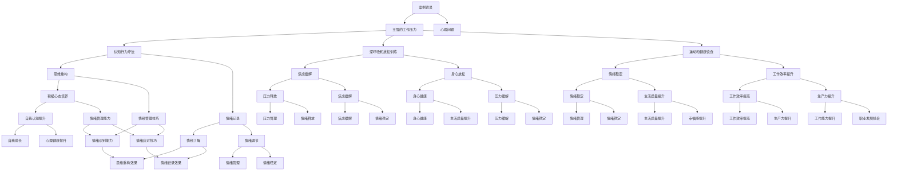

通过这个Mermaid流程图，我们可以清晰地看到王强在心理调适和情绪管理过程中的方法、效果以及这些方法对他的工作和生活产生的积极影响。

### 第7章 结论与展望

#### 7.1 虚无主义的挑战与应对

虚无主义作为一种哲学思潮，对个体和社会提出了深刻的挑战。它质疑了传统的道德和价值观，揭示了人类存在的荒诞和无意义。然而，面对虚无主义的挑战，个体和社会并非无路可寻。通过自我探索、积极行动、建立人际关系和参与社会活动，个体可以在虚无主义的阴影下找到自己的方向和意义。社会也需要在变动时代中重建道德和价值观体系，以应对虚无主义的冲击。

#### 7.2 变动时代的人生方向

变动时代为个体提供了前所未有的机遇和挑战。在这个快速变化的时代，明确的人生方向尤为重要。个体需要不断学习新知识、新技能，提升自己的竞争力。同时，个体还应该关注自己的内心需求，寻找和实现自我价值。在变动中找到人生方向，不仅有助于个体保持内心的平静和坚定，也有助于他们在社会中找到自己的位置。

#### 7.3 超越虚无主义的意义

超越虚无主义不仅对个体具有重要意义，也对社会具有深远的影响。通过超越虚无主义，个体可以找到生活的意义和价值，实现自我成长和自我实现。社会则可以在个体努力的基础上，重建道德和价值观体系，增强社会的凝聚力和稳定性。超越虚无主义，是人类社会在变动时代中走向更加繁荣和和谐的重要路径。

#### 7.4 虚无主义对未来的影响

虚无主义作为一种哲学思潮，在未来可能会继续对人类产生深远的影响。首先，虚无主义将促使个体和社会重新审视传统道德和价值观，寻找新的伦理基础和价值观体系。其次，虚无主义将推动人们对存在的意义和生命价值的深入探讨，从而推动人类文明的发展。最后，虚无主义将挑战传统的宗教和信仰体系，促使人们寻找更加科学和理性的信仰方式。

#### 7.5 变动时代的人生挑战与机遇

变动时代为个体提供了前所未有的挑战和机遇。挑战包括快速变化的环境、高度竞争的压力和不确定的未来。机遇则包括新技术带来的创新机会、全球化带来的市场机会以及多元文化带来的思维碰撞。在变动时代，个体需要具备快速适应和改变的能力，才能抓住机遇，迎接挑战。

#### 7.6 未来虚无主义研究的方向与挑战

未来的虚无主义研究将继续在哲学、心理学、社会学等多个领域展开。研究方向可能包括：

1. **虚无主义与现代科技的关系**：探讨虚无主义在人工智能、虚拟现实等新技术背景下的新特点和发展趋势。
2. **虚无主义与人类心理健康**：研究虚无主义对个体心理健康的影响，以及如何通过心理调适和情绪管理来应对虚无主义的挑战。
3. **虚无主义与伦理道德**：探讨虚无主义对传统道德和价值观的挑战，以及如何重建适应现代社会的伦理道德体系。
4. **虚无主义与社会进步**：研究虚无主义对社会结构和人际关系的影响，以及如何通过社会参与和集体认同来增强社会的凝聚力和稳定性。

未来的虚无主义研究将面临以下挑战：

1. **跨学科研究的整合**：需要整合哲学、心理学、社会学等多个学科的研究成果，形成系统的理论框架。
2. **实证研究的不足**：虚无主义的研究往往缺乏实证数据支持，需要开展更多的实证研究来验证理论。
3. **文化和地域差异**：虚无主义在不同的文化和地域背景下可能具有不同的表现形式，需要深入探讨文化差异对虚无主义的影响。

通过不断的研究和实践，我们可以更好地理解和应对虚无主义的挑战，为个体和社会的发展提供有益的指导。

### 附录

#### 附录A：推荐阅读

**A.1 相关书籍推荐**

1. 《虚无主义：一场哲学思考之旅》 - 马克斯·施特雷克
2. 《存在主义哲学导论》 - 马丁·海德格尔
3. 《人类简史：从动物到上帝》 - 尤瓦尔·赫拉利
4. 《生命的智慧》 - 索伦·克尔凯郭尔
5. 《失控》 - 凯文·凯利

**A.2 学术论文推荐**

1. "Nihilism and Emancipation: Aesthetics, Affirmation, and Ethics" - Jason Josephson
2. "The End of History and the Last Man" - Francis Fukuyama
3. "Nihilism and Existentialism" - David Grady
4. "The Paradox of Choice: Why More Is Less" - Barry Schwartz
5. "The Consequences of Modernity" - Anthony Giddens

**A.3 网络资源推荐**

1. [维基百科：虚无主义](https://en.wikipedia.org/wiki/Nihilism)
2. [哲学网：存在主义](https://www.philosophy.net/existentialism/)
3. [斯坦福大学哲学百科：虚无主义](https://plato.stanford.edu/entries/nihilism/)
4. [牛津大学哲学概论：存在主义](https://www.oup.com/gb/cw/philosophy/topics/existentialism/)
5. [YouTube上的哲学讲座](https://www.youtube.com/playlist?list=PLRjwqt1jBI-K3KjWz6uGqtsE-kTAbtHzC)

#### 附录B：术语解释

**B.1 虚无主义**

虚无主义是一种哲学思潮，主张现实世界缺乏客观意义，生命本身没有固有的内在价值。虚无主义者认为，人类所追求的目标和意义都是自我强加的虚构概念。

**B.2 存在主义**

存在主义是一种哲学流派，强调人类存在的本质先于其本质，即人不是一成不变的实体，而是一个在世界上不断塑造自己的过程。存在主义关注个体的自由意志、自我决定和责任。

**B.3 变动时代**

变动时代是指社会、经济、文化等多个方面都处于快速变化和转型的时期。这个时代的特征包括全球化、信息技术的发展、社会结构的变迁等。

**B.4 人生方向**

人生方向是指个体在人生旅途中追求的目标和意义。一个明确的人生方向可以帮助个体在变动时代中找到自己的位置，保持内心的平静和坚定。

