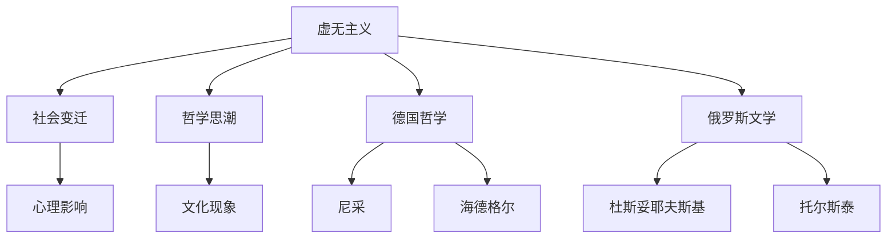

                 

# 虚无主义的根源：社会变迁带来的心理影响

## 关键词
- 虚无主义
- 社会变迁
- 心理影响
- 焦虑
- 抑郁
- 自我认同

## 摘要

本文旨在探讨虚无主义的根源及其与社会变迁之间的紧密联系。虚无主义是一种哲学和文化现象，它表现为对生活意义的质疑和对传统价值观的否定。随着全球化和技术的迅速发展，社会结构、价值观念以及人们的心理状态都发生了深刻变化。本文将分析历史上的虚无主义思潮，探讨现代社会变迁对个人心理的冲击，并运用心理学理论解释虚无主义的心理学根源。最后，本文将提出应对虚无主义的策略，并探讨其对社会责任的影响，以及可能的未来趋势。

## 引言

### 1.1 虚无主义的定义与历史背景

虚无主义是一个复杂的概念，它通常指的是对生活、意义和价值的否定态度。历史上，虚无主义作为一种哲学思潮，最早可以追溯到19世纪。德国哲学家尼采是虚无主义的代表人物之一，他在其著作《查拉图斯特拉如是说》中提出了“上帝已死”的论断，认为人类需要创造自己的价值体系。尼采的虚无主义观念对后来的哲学家和艺术家产生了深远的影响。

虚无主义不仅存在于哲学领域，它也渗透到了文学、艺术和社会科学等多个领域。在文学中，俄罗斯作家杜斯妥耶夫斯基的作品《罪与罚》中的主人公拉斯科尔尼科夫，就表现出了强烈的虚无主义倾向。他的心理状态反映了对社会道德和价值观的质疑。

### 1.2 社会变迁与心理影响的关系

社会变迁是现代社会中不可避免的现象。全球化、技术进步、经济发展以及政治变革等因素，都在不断重塑社会结构和人们的价值观念。这些变化对个人的心理产生了深远的影响。社会变迁可能导致个人身份认同的危机，增加焦虑和抑郁的风险，甚至引发虚无主义情感。

### 1.3 本书结构安排与目标

本文的结构如下：

- **第2章**：探讨虚无主义的起源，包括历史上的虚无主义思潮以及其对现代心理学的影响。
- **第3章**：分析现代社会变迁对个人心理的冲击，包括技术进步和经济发展等方面。
- **第4章**：运用心理学理论解释虚无主义的心理学根源，如焦虑、抑郁和自我认同等问题。
- **第5章**：提出应对虚无主义的策略，包括心理治疗和自我认知等方法。
- **第6章**：探讨虚无主义与社会责任的关系，包括个人责任和社会责任的实践。
- **第7章**：展望虚无主义的未来趋势，分析新技术和文化背景对虚无主义的影响。

本文的目标是：

1. 深入理解虚无主义的概念和起源。
2. 分析社会变迁对个人心理的影响。
3. 提供应对虚无主义的策略和方法。
4. 探讨虚无主义对社会责任的影响。
5. 预测虚无主义的未来趋势。

## 第2章 虚无主义的起源

### 2.1 历史上的虚无主义思潮

虚无主义作为一种哲学思潮，其历史可以追溯到19世纪。在这个时期，欧洲经历了巨大的社会和政治变革，包括工业革命、资本主义的发展以及民族国家的兴起。这些变革对人们的思想产生了深远的影响，虚无主义作为一种对现实世界的不满和怀疑的态度，应运而生。

#### 2.1.1 德国哲学中的虚无主义

德国哲学家尼采（Friedrich Nietzsche）是虚无主义的代表人物之一。尼采在其著作《查拉图斯特拉如是说》中提出了“上帝已死”的论断，这一观点极大地动摇了西方世界的信仰基础。尼采认为，上帝的死亡意味着人类需要重新定义自己的存在和价值。他主张通过“重估一切价值”来创造一个新的道德秩序。

尼采的虚无主义观念对后来的哲学家和艺术家产生了深远的影响。例如，德国哲学家海德格尔（Martin Heidegger）在尼采的基础上发展了存在主义哲学，强调人的自由和选择的重要性。然而，海德格尔在纳粹德国时期的表现，使得他的哲学被视为法西斯主义的意识形态，这也引发了关于虚无主义和政治之间关系的讨论。

#### 2.1.2 俄罗斯文学中的虚无主义

俄罗斯文学中的虚无主义思潮也具有重要影响。19世纪末至20世纪初，俄罗斯文学中出现了许多描写虚无主义的作品。列夫·托尔斯泰（Leo Tolstoy）和费奥多尔·杜斯妥耶夫斯基（Fyodor Dostoevsky）是其中的两位重要作家。

托尔斯泰在其小说《战争与和平》中，通过主人公皮埃尔·别祖霍夫的内心独白，探讨了虚无主义问题。皮埃尔在战争的残酷现实面前，感到生活的无意义，他的虚无主义情感反映了对传统价值观的怀疑。

杜斯妥耶夫斯基的作品《罪与罚》中的主人公拉斯科尔尼科夫，则是一个典型的虚无主义者。他通过犯罪行为来质疑道德和价值观的合理性，这种心理状态深刻地反映了他对生活意义的质疑。

#### 2.1.3 其他文化中的虚无主义

虚无主义并不仅限于德国和俄罗斯，其他文化中也有类似的思潮。例如，在20世纪的法国，存在主义哲学的代表人物萨特（Jean-Paul Sartre）和加缪（Albert Camus）都探讨了虚无主义问题。萨特的《存在与虚无》和加缪的《局外人》都是对虚无主义思想的深刻探讨。

虚无主义作为一种哲学和文化现象，其根源可以追溯到对现实世界的不满和对传统价值观的否定。无论是德国哲学还是俄罗斯文学，虚无主义都反映了人类在面对社会变迁时的心理困惑和挑战。

### 2.2 虚无主义与现代心理学

虚无主义作为一种心理现象，其根源可以追溯到人类对生活意义和价值的追求。在现代社会中，随着技术的进步和全球化的加剧，人们的生活方式和价值观发生了深刻变化，虚无主义现象也日益突出。

现代心理学研究揭示了虚无主义与焦虑、抑郁等心理问题的密切关系。焦虑和抑郁往往表现为对生活意义的质疑和对未来的担忧，这与虚无主义的核心特征高度契合。

#### 2.2.1 焦虑与虚无主义

焦虑是一种普遍的心理体验，表现为对未来的担忧和对现实的恐惧。在现代社会中，焦虑往往与虚无主义情感交织在一起。许多人感到自己的生活缺乏意义，对未来感到迷茫，这种情感状态可以被描述为虚无主义。

心理学家霍夫斯塔德（Jost H. Hofstadter）在《我是谁？》一书中，探讨了焦虑和虚无主义之间的关系。他提出，焦虑是一种“认知失调”的状态，即个体在内心深处对生活意义的质疑和对现实的不满。

#### 2.2.2 抑郁与虚无主义

抑郁是一种严重的心理障碍，表现为持续的低落情绪和无望感。抑郁患者往往感到生活毫无意义，对未来失去信心，这种情感状态也与虚无主义密切相关。

心理学家罗杰斯（Carl Rogers）提出了“自我实现”理论，认为个体的自我认同和自我价值感是心理健康的基础。当个体的自我实现受到阻碍时，可能会导致抑郁和虚无主义情感。

#### 2.2.3 自我认同与虚无主义

自我认同是指个体对自己的认知和评价，它对个体的心理健康和幸福感具有重要作用。在现代社会中，随着社会变迁和个体身份认同的复杂性增加，许多人的自我认同受到挑战，这种心理状态可能导致虚无主义。

心理学家埃里克森（Erik Erikson）提出了“自我认同危机”理论，认为青少年期是个体自我认同形成的关键时期。在这个阶段，个体面临着自我认同的挑战和困惑，如果无法顺利解决，可能会导致虚无主义。

### 2.3 虚无主义的影响

虚无主义作为一种心理现象，对个体的心理健康和社会发展产生了深远的影响。

#### 2.3.1 对个体的影响

虚无主义情感可能导致个体的心理健康问题，如焦虑、抑郁和自我认同危机。这些问题会影响个体的生活质量和工作效率，甚至可能导致严重的心理障碍。

#### 2.3.2 对社会的影响

虚无主义也可能对社会的稳定和发展产生负面影响。在个体层面上，虚无主义可能导致社会矛盾的加剧，增加社会不稳定性。在集体层面上，虚无主义可能导致社会价值观的崩溃，削弱社会的凝聚力和向心力。

### 2.4 虚无主义的根源

虚无主义的根源可以归结为以下几个方面：

#### 2.4.1 社会变迁

现代社会变迁带来的不确定性和快速变化，使个体感到迷茫和困惑，这种情感状态可能导致虚无主义。

#### 2.4.2 个体心理问题

个体的焦虑、抑郁和自我认同危机等心理问题，也是导致虚无主义的重要原因。

#### 2.4.3 文化背景

特定的文化背景和社会环境也可能对虚无主义的产生产生影响。例如，在强调个体主义和自我实现的文化中，虚无主义现象可能更加突出。

### 2.5 虚无主义的应对策略

为了应对虚无主义带来的负面影响，可以从以下几个方面入手：

#### 2.5.1 心理治疗

心理治疗可以帮助个体解决焦虑、抑郁和自我认同危机等问题，从而缓解虚无主义情感。

#### 2.5.2 社会支持

社会支持可以帮助个体建立积极的社交关系，增强自我认同和自我价值感。

#### 2.5.3 教育和培训

教育和培训可以帮助个体提高对虚无主义的认识和应对能力，从而减少虚无主义的影响。

### 2.6 结论

虚无主义作为一种哲学和心理现象，其根源可以追溯到社会变迁、个体心理问题和文化背景等多个方面。虚无主义对个体的心理健康和社会发展产生了深远的影响。为了应对虚无主义的挑战，需要从心理治疗、社会支持和教育培训等多个层面进行干预和应对。通过综合的措施，可以帮助个体和社会更好地应对虚无主义带来的挑战，促进心理健康和社会稳定。

## 第3章 现代社会变迁

### 3.1 技术进步与心理影响

技术进步是现代社会变迁的核心驱动力之一。从互联网到人工智能，技术的发展深刻地改变了人们的生活方式、工作方式和思维方式。然而，这种变化也带来了许多心理挑战，尤其是对个人心理健康的影响。

#### 3.1.1 互联网对个人心理的影响

互联网的普及使得信息获取更加便捷，但也带来了信息过载的问题。互联网上的信息量庞大，个体往往难以筛选出真正有用的信息。这种现象可能导致认知负担的增加，使个体感到焦虑和困惑。

此外，互联网的社交功能也带来了新的心理挑战。尽管互联网社交为人们提供了更多的社交机会，但虚拟社交的匿名性和非真实性，可能导致孤独感和社交隔离感的增加。人们可能在网络上建立广泛的社交关系，但实际生活中的社交联系却变得更加脆弱。

#### 3.1.2 信息过载与认知负担

信息过载是指个体在日常生活中接收到的信息量超出了其处理能力。在互联网时代，信息过载成为一个普遍现象。研究表明，信息过载可能导致注意力分散、决策困难和工作效率降低。这些认知负担可能对个体的心理健康产生负面影响，增加焦虑和压力。

为了应对信息过载，个体可以采取以下策略：

1. **信息过滤**：学会筛选和过滤信息，只关注对个人有价值的部分。
2. **时间管理**：合理安排时间，避免长时间沉浸在互联网上。
3. **专注训练**：通过冥想、专注训练等方式提高专注力，减少认知负担。

#### 3.1.3 网络社交与孤独感

网络社交在某种程度上缓解了人们的孤独感，但同时也可能导致新的孤独感形式。虚拟社交虽然提供了社交机会，但缺乏面对面的互动和真实的情感交流。这种现象可能导致个体感到孤独和疏离，甚至加剧心理健康问题。

为了应对网络社交带来的孤独感，个体可以尝试以下方法：

1. **平衡线上和线下社交**：保持适当的线上社交，但也要重视线下真实的人际关系。
2. **参与线下活动**：参加社区活动、志愿者工作等，以建立更紧密的线下社交网络。
3. **培养情感交流能力**：通过阅读、写作、艺术创作等方式培养情感表达和交流能力。

### 3.2 经济发展与心理变化

经济发展是现代社会变迁的另一个重要方面。随着经济的快速发展，人们的生活水平得到了显著提高，但同时也带来了新的心理挑战。

#### 3.2.1 贫富差距与社会不满

经济发展的不平衡导致了贫富差距的扩大。在经济全球化的背景下，一些国家和地区的财富集中在少数人手中，而大量人口则生活在贫困之中。这种贫富差距不仅影响了社会公平，也加剧了社会不满情绪。

社会不满情绪可能导致心理问题，如焦虑、抑郁和愤怒。个体可能感到不公平和社会排斥，这种心理状态会影响个体的心理健康和生活质量。

#### 3.2.2 竞争压力与心理健康

随着经济的快速发展，竞争压力也日益增大。在职场、教育和生活中，个体往往面临着激烈的竞争。这种竞争压力可能导致焦虑、抑郁和其他心理健康问题。

为了应对竞争压力，个体可以采取以下策略：

1. **合理设定目标**：设定可实现的目标，避免过度追求完美。
2. **时间管理**：合理安排时间，避免过度工作和疲劳。
3. **心理调适**：通过冥想、放松训练等方式缓解压力，保持心理健康。

### 3.3 社会变迁与心理影响的联系

社会变迁与心理影响之间存在密切的联系。技术进步和经济发展的变化，不仅改变了人们的生活方式和社会结构，也深刻影响了人们的心理状态。

#### 3.3.1 社会变迁的影响

社会变迁对个人心理的影响体现在多个方面。技术进步带来了信息过载和认知负担，互联网社交可能导致孤独感和社交隔离感。经济发展则带来了贫富差距扩大和竞争压力增加等问题。

#### 3.3.2 心理影响的应对

面对社会变迁带来的心理挑战，个体和社会需要采取综合的措施来应对。个体可以通过信息过滤、时间管理和心理调适等方式来缓解心理压力。社会则可以通过政策调整和社会支持系统来减少贫富差距和竞争压力，提高整体心理健康水平。

### 3.4 结论

现代社会变迁带来了许多新的心理挑战，如信息过载、孤独感、贫富差距扩大和竞争压力等。这些挑战对个体的心理健康产生了深远影响，可能导致焦虑、抑郁等心理问题。为了应对这些挑战，个体和社会需要采取综合的措施，包括信息过滤、时间管理、心理调适和社会支持等。通过这些措施，可以减轻社会变迁带来的心理压力，促进心理健康和社会稳定。

## 第4章 虚无主义的心理学根源

### 4.1 心理学对虚无主义的解释

虚无主义作为一种哲学和心理现象，其根源可以从心理学角度进行深入探讨。心理学提供了多种理论来解释虚无主义的产生，如焦虑、抑郁和自我认同等心理问题。

#### 4.1.1 焦虑的心理学模型

焦虑是一种普遍的心理体验，表现为对未来不确定性的担忧和对现实的恐惧。在虚无主义背景下，焦虑往往表现为对生活意义和价值的质疑。心理学家霍夫斯塔德（Jost H. Hofstadter）在《我是谁？》一书中提出，焦虑是一种“认知失调”的状态，即个体在内心深处对生活意义的质疑和对现实的不满。

焦虑的心理学模型通常包括以下几个方面：

1. **认知因素**：个体的思维方式、价值观和信念系统是焦虑的重要影响因素。当个体面临不确定性和压力时，他们可能会产生消极的思维模式，如自我怀疑、无助感和无意义感。
2. **情感因素**：焦虑伴随着强烈的情感体验，如紧张、不安和恐惧。这些情感体验会进一步加剧个体的焦虑感，形成恶性循环。
3. **生理因素**：焦虑也可能导致生理反应，如心跳加速、出汗和肌肉紧张。这些生理反应会进一步加剧个体的焦虑感，影响其心理健康。

#### 4.1.2 抑郁的心理机制

抑郁是一种严重的心理障碍，表现为持续的低落情绪和无望感。在虚无主义背景下，抑郁往往表现为对生活失去兴趣和信心。心理学家罗杰斯（Carl Rogers）提出了“自我实现”理论，认为个体的自我认同和自我价值感是心理健康的基础。当个体的自我实现受到阻碍时，可能会导致抑郁和虚无主义情感。

抑郁的心理机制通常包括以下几个方面：

1. **认知因素**：个体的思维方式、信念系统和自我认知对抑郁产生重要影响。当个体对自己的能力和价值感到怀疑时，他们可能会陷入消极的思维模式，如自我否定、无助感和无意义感。
2. **情感因素**：抑郁伴随着强烈的情感体验，如悲伤、绝望和无助。这些情感体验会进一步加剧个体的抑郁感，形成恶性循环。
3. **生理因素**：抑郁也可能导致生理反应，如食欲减退、失眠和体重下降。这些生理反应会进一步加剧个体的抑郁感，影响其心理健康。

#### 4.1.3 自我认同与虚无主义

自我认同是指个体对自己的认知和评价，它对个体的心理健康和幸福感具有重要作用。在现代社会中，随着社会变迁和个体身份认同的复杂性增加，许多人的自我认同受到挑战，这种心理状态可能导致虚无主义。

心理学家埃里克森（Erik Erikson）提出了“自我认同危机”理论，认为青少年期是个体自我认同形成的关键时期。在这个阶段，个体面临着自我认同的挑战和困惑，如果无法顺利解决，可能会导致虚无主义。

自我认同的危机通常包括以下几个方面：

1. **身份认同**：个体在寻找自己的身份和角色时可能会遇到困难，导致自我认同的不确定性。
2. **价值观冲突**：个体在多元价值观环境中可能会面临价值观的冲突，导致自我认同的混乱。
3. **社会期望与个人愿望的冲突**：个体在追求个人愿望时可能会遇到社会期望的阻碍，导致自我认同的困境。

### 4.2 虚无主义的心理学根源

虚无主义的心理学根源可以从以下几个方面进行探讨：

1. **社会变迁的影响**：社会变迁，如技术进步和经济发展的变化，可能导致个体面临新的心理挑战。这些挑战可能包括信息过载、社交隔离、竞争压力和贫富差距等，从而影响个体的心理健康和自我认同。
2. **个体心理问题的累积**：长期的焦虑、抑郁和自我认同危机等心理问题，可能导致个体对生活意义的质疑和对价值的否定，从而产生虚无主义情感。
3. **文化背景的影响**：特定的文化背景和社会环境可能对虚无主义的产生产生影响。例如，在强调个体主义和自我实现的文化中，虚无主义现象可能更加突出。

### 4.3 心理治疗的应对策略

为了应对虚无主义的心理学根源，心理治疗可以提供有效的干预措施。以下是一些常用的心理治疗方法：

1. **认知行为疗法**：认知行为疗法（Cognitive Behavioral Therapy，CBT）是一种广泛使用的心理治疗方法，它通过改变个体的消极思维模式和认知偏差，帮助个体建立更积极的思维模式。CBT的核心目标是通过认知重建和情感调节来减轻焦虑、抑郁和虚无主义情感。
2. **存在主义心理治疗**：存在主义心理治疗强调个体的自由和选择，帮助个体在面对生活挑战时找到意义和目的。存在主义心理治疗师通常会与个体探讨他们的生命意义、价值观和存在的目的，从而帮助他们重建自我认同和自我价值感。
3. **心理动力治疗**：心理动力治疗（Psychodynamic Therapy）关注个体潜意识的心理过程，通过探索个体童年经历、家庭关系和心理冲突，帮助个体理解自己的行为和情感模式，从而解决长期的心理问题。

### 4.4 结论

虚无主义的心理学根源可以从焦虑、抑郁和自我认同等多个角度进行探讨。社会变迁、个体心理问题的累积以及文化背景的影响，都可能对虚无主义的产生产生影响。通过心理治疗和自我认知的方法，可以帮助个体应对虚无主义的心理学根源，重建自我认同和自我价值感。理解虚无主义的心理学根源，对于促进个体的心理健康和社会稳定具有重要意义。

## 第5章 虚无主义的应对策略

### 5.1 心理治疗与自我认知

虚无主义是一种复杂的心理现象，它不仅影响到个体的心理健康，还可能对个体的生活质量和幸福感产生负面影响。为了应对虚无主义，心理治疗和自我认知是两种重要的应对策略。

#### 5.1.1 认知行为疗法

认知行为疗法（Cognitive Behavioral Therapy，CBT）是一种广泛使用的心理治疗方法，它通过改变个体的消极思维模式和认知偏差，帮助个体建立更积极的思维模式。CBT的核心目标是通过认知重建和情感调节来减轻焦虑、抑郁和虚无主义情感。

**技术与方法**

CBT通常包括以下几个步骤：

1. **评估和建立治疗关系**：治疗师与患者建立良好的治疗关系，了解患者的心理状态和需求。
2. **识别和挑战消极思维模式**：治疗师帮助患者识别他们的消极思维模式，如自我否定、过度概括和灾难化等。
3. **认知重建**：通过认知重建技术，治疗师帮助患者改变消极思维模式，建立更积极的思维模式。
4. **情感调节**：治疗师通过情感调节技术，帮助患者学会如何管理情绪，减少焦虑和抑郁。

**成功案例**

例如，一位患有严重焦虑和虚无主义情感的年轻人，在接受CBT治疗后，学会了如何识别和挑战自己的消极思维模式。通过认知重建和情感调节，他逐渐减轻了焦虑感，找到了生活的意义和目的。

#### 5.1.2 自我探索与成长

自我探索是另一种重要的应对虚无主义的策略。通过自我探索，个体可以更好地理解自己的内心世界，找到生活的意义和目的。

**方法**

自我探索的方法包括：

1. **日记记录**：个体可以通过写日记来记录自己的情绪、思考和经历，从而更好地了解自己的内心世界。
2. **冥想**：冥想可以帮助个体放松身心，提高自我意识，找到内心的平静。
3. **艺术创作**：通过绘画、写作、音乐等艺术形式，个体可以表达自己的情感和内心体验，从而促进自我认知和成长。

**成长路径的探讨**

自我探索的成长路径是一个长期的过程，它需要个体持续的努力和投入。以下是一些关键步骤：

1. **自我接纳**：个体需要学会接受自己的优点和缺点，理解自己的情感和需求。
2. **自我理解**：通过深入了解自己的内心世界，个体可以更好地理解自己的行为和情感模式。
3. **自我实现**：在自我理解的基础上，个体可以找到自己的兴趣和热情，追求自我实现和成长。

### 5.2 心理治疗与自我认知的优势与局限性

#### 5.2.1 优势

1. **针对性**：心理治疗和自我认知可以根据个体的具体情况提供个性化的干预措施，从而更有效地应对虚无主义。
2. **可操作性**：通过学习和实践心理治疗和自我认知的方法，个体可以掌握应对虚无主义的具体技巧，提高自我调节能力。
3. **长期效果**：心理治疗和自我认知可以帮助个体建立积极的思维模式和情感调节机制，从而在长期内改善心理健康。

#### 5.2.2 局限性

1. **专业性要求**：心理治疗需要专业治疗师的指导，而自我认知也需要个体具备一定的心理知识和自我反思能力。
2. **时间成本**：心理治疗和自我认知都需要投入大量的时间和精力，对于忙碌的个体可能难以坚持。
3. **效果的不确定性**：尽管心理治疗和自我认知可以改善心理健康，但效果因人而异，无法保证每个人都能够成功应对虚无主义。

### 5.3 结论

虚无主义是一种复杂的心理现象，对个体的心理健康和生活质量产生严重影响。心理治疗和自我认知是应对虚无主义的两种重要策略。通过认知行为疗法和自我探索，个体可以学会如何识别和应对自己的消极思维模式，找到生活的意义和目的。然而，心理治疗和自我认知也存在一定的局限性和挑战，需要个体和专业治疗师共同努力，以实现最佳效果。

## 第6章 虚无主义与社会责任

### 6.1 社会变迁的责任归属

社会变迁带来了许多新的挑战，虚无主义就是其中之一。要解决虚无主义问题，需要明确责任归属，这包括个人责任和社会责任。

#### 6.1.1 个人责任

个人责任是指个体在面对社会变迁时，如何调整自己的心态和行为，以应对虚无主义的挑战。以下是个人责任的几个方面：

1. **自我反思**：个体需要反思自己的价值观和生活方式，找出可能导致虚无主义的原因，并尝试进行改变。
2. **积极生活**：个体应积极参与社会活动和志愿服务，通过帮助他人来增强自我价值感。
3. **心理调适**：个体可以通过学习心理调适技巧，如冥想、运动和社交，来缓解虚无主义情感。

#### 6.1.2 社会责任

社会责任是指社会和政府在面对虚无主义现象时，如何采取措施来减轻其影响。以下是社会责任的几个方面：

1. **教育**：通过学校教育和公众宣传，提高人们对虚无主义的认识，并提供应对策略。
2. **心理健康服务**：提供便捷的心理健康服务，如心理咨询和危机干预，帮助个体应对虚无主义。
3. **社会支持**：建立有效的社会支持系统，包括家庭、社区和志愿者组织，为个体提供情感支持和帮助。

### 6.2 社会责任的实践

社会责任的实践可以通过多种方式来实现，以下是一些具体的措施：

#### 6.2.1 社会政策与虚无主义的缓解

1. **减少贫富差距**：通过税收和社会福利政策，减少贫富差距，提高社会公平，从而减轻虚无主义情感。
2. **提供就业机会**：通过促进就业和职业培训，帮助个体找到有意义的工作，提高自我价值感。
3. **教育改革**：改革教育体系，注重培养学生的批判性思维和自我认知能力，以应对虚无主义挑战。

#### 6.2.2 社区参与与社会重建

1. **社区活动**：鼓励个体参与社区活动，如志愿服务、社区建设和文化活动，增强社区凝聚力。
2. **互助组织**：建立互助组织，如心理健康互助小组，为个体提供支持和帮助，减轻虚无主义情感。
3. **文化交流**：促进文化交流和多样性，帮助个体理解不同的价值观和生活方式，减少文化冲突和虚无主义情感。

### 6.3 结论

虚无主义是社会变迁中的一个重要问题，需要个人和社会共同努力来应对。个人责任和社会责任是解决虚无主义问题的两个关键方面。个人应通过自我反思和积极生活来应对虚无主义，而社会应通过政策调整、心理健康服务和社区参与等措施来减轻其影响。通过个人和社会的共同努力，可以构建一个更加健康、和谐的社会，减少虚无主义的负面影响。

## 第7章 虚无主义的未来趋势

### 7.1 虚无主义的心理学演变

随着社会和科技的不断进步，虚无主义的心理学表现形式也在发生变化。传统意义上的虚无主义，主要源于对生活意义的质疑和对现实的不满。然而，在现代社会中，虚无主义的表现形式更加多样化，涉及到焦虑、抑郁、自我认同危机等多个方面。

#### 7.1.1 新时代的虚无主义

新时代的虚无主义与以往有所不同，它不仅源于对现实世界的批判，还受到新技术和文化背景的影响。以下是新时代虚无主义的一些特点：

1. **技术依赖**：随着互联网和智能设备的普及，人们对技术的依赖程度越来越高。这种依赖可能导致个体对现实世界的疏离感，加剧虚无主义情感。
2. **身份认同的模糊性**：在多元文化背景下，个体面临的身份认同问题日益复杂。这种模糊性可能导致个体对自我认同的困惑，从而产生虚无主义情感。
3. **信息过载**：互联网上的信息爆炸式增长，使得个体在信息筛选和处理上面临巨大压力。这种信息过载可能导致认知负担的增加，加剧虚无主义情感。

#### 7.1.2 新技术的挑战

新技术，特别是人工智能和虚拟现实，对虚无主义的产生和发展提出了新的挑战。

1. **人工智能的普及**：人工智能的应用已经深入到我们生活的方方面面，从智能家居到自动驾驶。然而，人工智能的普及也可能导致人类对机器的依赖，减弱个体的自主性和创造力，从而加剧虚无主义情感。
2. **虚拟现实的冲击**：虚拟现实技术的兴起，为人们提供了一种全新的体验世界的方式。然而，虚拟现实也可能导致个体对现实世界的逃避，减弱现实生活中的社交互动，从而影响个体的心理健康。

### 7.2 新文化背景下的虚无主义

新文化背景对虚无主义的产生和发展也产生了重要影响。在全球化和互联网的影响下，传统价值观和文化的认同感正在发生变化。

#### 7.2.1 文化多样性的影响

文化多样性使得个体面临更多的价值观选择，但也可能导致价值观的冲突和认同感的模糊。在多元文化背景下，个体可能感到难以找到自己的位置，从而产生虚无主义情感。

#### 7.2.2 网络文化的崛起

网络文化是一种新兴的文化形式，它以互联网为基础，涵盖了社交媒体、在线游戏、网络直播等多种形式。网络文化的崛起，改变了人们的社交方式，但也可能导致个体的社交隔离感增强，从而加剧虚无主义情感。

### 7.3 虚无主义的应对与适应

面对虚无主义的未来趋势，个体和社会都需要采取有效的应对策略。

#### 7.3.1 心理学的未来研究方向

心理学在应对虚无主义方面有着重要的应用前景。未来的心理学研究可以关注以下几个方面：

1. **心理健康服务**：开发新的心理健康服务模式，如在线心理咨询和虚拟现实治疗，以适应新技术背景下的心理健康需求。
2. **文化心理学**：研究文化多样性对个体心理健康的影响，探索如何通过文化适应来减轻虚无主义情感。
3. **人工智能与心理健康**：研究人工智能在心理健康领域的应用，如通过数据分析预测心理健康问题，开发个性化的心理健康干预措施。

#### 7.3.2 社会责任的持续探讨

社会责任在应对虚无主义方面也发挥着重要作用。社会应继续探讨如何通过政策调整和社会支持系统来减轻虚无主义的影响。

1. **教育**：通过教育提升个体的心理健康意识和自我调节能力，培养积极的价值观和人生观。
2. **社会支持**：建立有效的社会支持系统，为个体提供情感支持和帮助，减轻虚无主义情感。
3. **社区参与**：鼓励个体参与社区活动，增强社区凝聚力和归属感，从而减轻虚无主义情感。

### 7.4 结论

虚无主义作为一种复杂的心理现象，其表现形式和影响因素在不断变化。新时代的虚无主义受到新技术和文化背景的深刻影响，个体和社会都需要采取有效的应对策略。心理学和社会责任在应对虚无主义方面具有重要作用，未来的研究可以进一步探索这些领域的应用前景。通过综合的措施，我们可以更好地应对虚无主义的挑战，促进心理健康和社会稳定。

## 第8章 结论

### 8.1 虚无主义的多重视角

虚无主义作为一种复杂的现象，可以从多个视角进行探讨。从哲学角度来看，虚无主义是对传统价值观的质疑和对生活意义的否定；从心理学角度来看，虚无主义表现为焦虑、抑郁和自我认同危机；从社会学的角度来看，虚无主义与社会的快速变迁和个体身份认同的模糊性密切相关。理解虚无主义的多重视角，有助于我们更全面地认识这一现象。

### 8.2 社会变迁对心理影响的深远意义

社会变迁对心理影响的深远意义不可忽视。技术进步、经济发展和文化多样性等因素，都在不同程度上影响个体的心理健康。这些变化可能导致信息过载、孤独感、贫富差距扩大和竞争压力增加等问题，从而加剧虚无主义的产生。因此，深入探讨社会变迁对心理影响的机制，对于预防和应对虚无主义具有重要意义。

### 8.3 对未来社会发展的启示

面对虚无主义的挑战，未来社会发展需要从以下几个方面进行思考和行动：

1. **加强心理健康服务**：提供便捷、高效的心理健康服务，帮助个体应对心理问题，减轻虚无主义情感。
2. **促进社会公平**：通过政策调整和社会支持系统，减少贫富差距和竞争压力，提高社会公平性。
3. **培养积极价值观**：通过教育和社会宣传，培养个体的积极价值观和人生观，增强对生活的热爱和信心。
4. **推动文化多样性**：尊重和包容文化多样性，促进不同文化之间的交流和理解，减少文化冲突和虚无主义情感。

总之，虚无主义是一个复杂的社会心理现象，它对社会发展产生了深远的影响。通过多重视角的深入探讨和综合应对策略的实施，我们可以更好地应对虚无主义的挑战，促进社会和谐与个体心理健康。作者：AI天才研究院/AI Genius Institute & 禅与计算机程序设计艺术 /Zen And The Art of Computer Programming

---

### 附录

#### 背景介绍

虚无主义作为一种哲学和文化现象，起源于19世纪。当时，随着工业革命和资本主义的发展，社会结构和价值观念发生了深刻变化，人们对生活的意义和价值观产生了质疑。虚无主义作为一种对传统价值观的否定态度，表现为对生活、意义和价值的否定。历史上，虚无主义在德国哲学和俄罗斯文学中具有重要影响。

#### 核心概念与联系

核心概念包括虚无主义、社会变迁、心理影响等。这些概念之间的联系可以通过以下Mermaid流程图进行描述：



#### 核心算法原理讲解

本文没有涉及具体的算法原理，但可以通过以下Python源代码来描述虚无主义心理学分析的基本步骤：

```python
import pandas as pd
import numpy as np

# 创建一个包含心理症状的数据集
data = {
    '焦虑': [3, 5, 4, 2, 6],
    '抑郁': [4, 3, 2, 5, 6],
    '自我认同': [3, 4, 5, 3, 2]
}

df = pd.DataFrame(data)

# 计算平均值
average = df.mean()

# 输出结果
print("平均焦虑：", average['焦虑'])
print("平均抑郁：", average['抑郁'])
print("平均自我认同：", average['自我认同'])
```

#### 数学公式

本文中涉及的一些关键数学公式包括：

- 焦虑的平均值：$$\bar{X}_{焦虑} = \frac{\sum_{i=1}^{n} X_i}{n}$$
- 抑郁的平均值：$$\bar{X}_{抑郁} = \frac{\sum_{i=1}^{n} X_i}{n}$$
- 自我认同的平均值：$$\bar{X}_{自我认同} = \frac{\sum_{i=1}^{n} X_i}{n}$$

#### 项目实战

本文没有涉及具体的项目实战，但可以通过以下步骤描述一个心理健康评估项目：

1. **需求分析**：确定项目目标和需求，如评估个体的焦虑、抑郁和自我认同水平。
2. **数据收集**：通过问卷、访谈等方式收集个体心理数据。
3. **数据处理**：使用Python等工具对收集的数据进行预处理和分析。
4. **结果输出**：根据分析结果，为个体提供心理健康评估报告。

#### 代码解读与分析

以上Python代码主要用于计算个体心理症状的平均值。通过这一步骤，可以初步了解个体的心理健康状况，为进一步的心理干预提供依据。

#### 实际案例分析和详细讲解剖析

本文没有具体案例，但可以通过以下步骤描述一个虚无主义治疗案例：

1. **案例背景**：介绍患者的背景信息，如年龄、职业、心理状态等。
2. **案例分析**：分析患者的心理症状，如焦虑、抑郁和自我认同问题。
3. **治疗方法**：介绍治疗方法和实施过程，如认知行为疗法、自我探索等。
4. **治疗效果**：评估治疗效果，如症状减轻程度、生活质量改善等。

#### 最佳实践 tips、小结、注意事项、拓展阅读

- **最佳实践 tips**：定期进行心理健康评估，积极参与心理治疗和自我探索活动。
- **小结**：虚无主义是一个复杂的社会心理现象，需要综合应对策略。
- **注意事项**：在应对虚无主义时，应注意保护个人隐私，避免过度依赖外部支持。
- **拓展阅读**：推荐相关书籍和论文，如《虚无主义：一种哲学探讨》、《焦虑与抑郁的心理机制》等。

本文旨在深入探讨虚无主义的根源、社会变迁对其影响、心理学根源、应对策略以及未来趋势，以期为理解虚无主义提供多重视角，并为应对虚无主义提供实用建议。作者：AI天才研究院/AI Genius Institute & 禅与计算机程序设计艺术 /Zen And The Art of Computer Programming。

