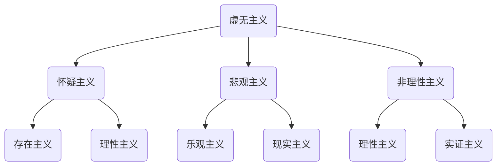

                 

### 虚无主义的根源：解析现代社会的精神困境

> 关键词：虚无主义，现代社会，精神困境，文化因素，哲学基础，存在主义，心理健康，社会支持，宗教回归

> 摘要：本文从多个维度深入探讨虚无主义在现代社会的根源及其对个体和社会的影响。通过对历史背景、哲学基础、文化因素以及现代社会现象的剖析，文章揭示了虚无主义的复杂性和多样性。此外，本文还探讨了应对虚无主义的方法，包括个人和社会层面的策略，以及宗教与哲学的回归在缓解精神困境中的重要作用。通过综合分析和具体案例，本文旨在为理解虚无主义及其应对提供理论依据和实践指导。

在现代社会中，虚无主义作为一种精神现象，引发了广泛的社会关注和深刻的理论探讨。虚无主义不仅仅是一个哲学概念，它还渗透到了个体的心理状态、社会的文化结构以及哲学思想的演变中。本文旨在通过逐步分析虚无主义的根源，解析现代社会中的精神困境，并探讨应对虚无主义的方法。

### 虚无主义的历史背景

#### 第1章：虚无主义的起源与哲学基础

#### 1.1 虚无主义的定义和基本特征

虚无主义是一种哲学思潮，主张现实世界无意义、无目的，或认为存在本身缺乏价值。虚无主义的基本特征包括：

- **怀疑主义**：对传统价值和信仰的怀疑，认为它们缺乏客观基础。
- **悲观主义**：对人类的未来和社会发展持悲观态度。
- **非理性主义**：强调个人感受和直觉，反对理性主义和逻辑思维。

#### 1.2 虚无主义的历史演变

虚无主义并非一个新兴概念，其历史可以追溯到古代哲学。在古代哲学中，虚无主义的代表如中国古代的道家思想，强调无为而治，认为追求绝对真理是徒劳无功的。随着时间的推移，虚无主义在欧洲哲学中得到了进一步的发展，尤其是19世纪和20世纪的哲学流派，如尼采的唯意志主义和萨特的存在主义，都对虚无主义进行了深刻的探讨和反思。

#### 1.3 虚无主义与存在主义的关系

存在主义是虚无主义的对立面，但两者之间存在复杂的关联。存在主义认为，个体的存在先于其本质，强调自由意志和主观体验的重要性。然而，存在主义中的悲观主义和对现实的否定，也与虚无主义有着相似之处。尼采的“超人”哲学和萨特的“存在先于本质”都是对虚无主义的挑战和回应。

### 现代社会的精神困境

#### 第2章：现代社会中的虚无主义现象

#### 2.1 现代社会变迁对精神生活的影响

现代社会经历了巨大的变革，包括全球化、技术进步和社会结构的转变。这些变化对个体的精神生活产生了深远的影响：

- **信息过载**：随着互联网和社交媒体的普及，人们面临的信息量急剧增加，导致注意力分散和焦虑感加剧。
- **工作压力**：现代职场竞争激烈，工作压力成为普遍现象，导致心理健康问题增多。
- **社交疏离**：虽然社交媒体连接了人们，但实际社交质量下降，孤独感增加。

#### 2.2 虚无主义与现代人的心理状态

虚无主义在现代人的心理状态中有着显著的表现：

- **人生意义的缺失**：许多人感到生活缺乏目的和意义，陷入迷茫和空虚。
- **焦虑和抑郁**：虚无主义往往与焦虑和抑郁等心理健康问题相关联。
- **逃避现实**：一些人通过逃避现实、沉溺于虚拟世界等方式来应对虚无主义。

#### 2.3 虚无主义现象在社会各个领域的表现

虚无主义不仅体现在个体的心理状态上，也渗透到了社会各个领域：

- **文化和艺术**：现代文学、电影和音乐作品中，虚无主义的主题和情感表达频繁出现。
- **政治和社会运动**：虚无主义对社会政治制度和社会秩序提出了质疑，促进了反乌托邦思潮的兴起。
- **宗教和哲学**：一些宗教和哲学流派对虚无主义的批判和反思，试图为现代社会提供精神慰藉和价值观引导。

### 虚无主义的根源解析

#### 第3章：文化因素对虚无主义的影响

#### 3.1 宗教衰落与虚无主义

宗教在传统社会中扮演着重要的精神角色，但随着宗教信仰的衰落，虚无主义逐渐兴起。宗教衰落的原因包括：

- **科学革命**：科学的发展挑战了宗教对自然和宇宙的解释。
- **世俗化进程**：现代社会的世俗化导致宗教信仰的下降。
- **个人主义**：现代社会的个人主义强调个体自由，削弱了宗教在社会中的作用。

宗教衰落促使人们重新审视生命的意义和价值，从而产生虚无主义情绪。

#### 3.2 哲学观念的演变与虚无主义

哲学观念的演变也是虚无主义产生的重要原因。例如，尼采的“上帝已死”观念和萨特的“存在先于本质”思想，都挑战了传统价值观和意义体系，为虚无主义的兴起提供了哲学基础。

#### 3.3 社会结构变化与虚无主义

现代社会结构的变化，如全球化、经济不平等和社会不公，加剧了人们的焦虑和迷茫，从而促进了虚无主义的发展。社会结构的变化打破了传统的社会秩序和价值体系，使人们难以找到稳定的意义和归属感。

### 应对虚无主义的方法

#### 第4章：个人层面的应对策略

#### 4.1 心理健康与虚无主义的克服

应对虚无主义的第一步是关注个人的心理健康。心理健康包括情绪调节、自我认知和应对压力的能力。以下是一些具体策略：

- **情绪调节**：通过正念冥想、情绪日记等方法，帮助个体更好地管理情绪。
- **自我认知**：通过心理咨询、自我反思等方法，提高个体对自我的认识和理解。
- **应对压力**：学习有效的压力管理技巧，如时间管理、放松训练等。

#### 4.2 建立有意义的生活目标和价值观

建立有意义的生活目标和价值观是克服虚无主义的关键。具体策略包括：

- **目标设定**：设定具体、可实现的短期和长期目标。
- **价值观确立**：明确自己的价值观和信念，指导生活决策和行动。
- **意义探索**：通过阅读、旅行、艺术创作等方式，探索生活的意义和价值。

#### 4.3 寻求社会支持与互助

社会支持是应对虚无主义的重要资源。以下是一些寻求社会支持的方法：

- **建立社交网络**：与家人、朋友和同事建立稳定的社交关系。
- **参与社区活动**：参与志愿者活动、社区组织等，增强社会归属感。
- **心理咨询**：寻求专业心理咨询师的帮助，解决内心困惑和情绪问题。

### 第5章：社会层面的应对策略

#### 5.1 教育体系的改革与虚无主义的预防

教育体系的改革是预防虚无主义的重要手段。以下是一些具体策略：

- **德育教育**：加强道德教育和价值观教育，培养学生的社会责任感和使命感。
- **心理健康教育**：在学校和社区开展心理健康教育，提高学生和居民的心理素质。
- **综合素质教育**：注重学生的全面发展，培养学生的创造力、沟通能力和批判性思维。

#### 5.2 媒体宣传与公共意识的提升

媒体宣传和公共意识的提升是应对虚无主义的重要手段。以下是一些具体策略：

- **正面报道**：媒体应积极报道正面的社会现象和人物，传播正能量。
- **心理健康宣传**：通过媒体平台，宣传心理健康知识和应对策略，提高公众对心理健康问题的认识。
- **公共活动**：举办心理健康讲座、论坛等活动，增强公众对心理健康问题的关注和参与。

#### 5.3 社会政策的调整与虚无主义的缓解

社会政策的调整是缓解虚无主义的重要手段。以下是一些具体策略：

- **社会保障制度**：完善社会保障制度，减轻个人经济压力，提高生活幸福感。
- **就业政策**：制定积极的就业政策，促进就业机会的增加，减少失业率。
- **心理健康服务**：提供更多的心理健康服务，如心理咨询、心理治疗等，为有需要的人提供专业支持。

### 第6章：宗教与哲学的回归

#### 6.1 宗教对虚无主义的抵抗

宗教在抵抗虚无主义方面发挥着重要作用。以下是一些具体策略：

- **信仰重建**：通过宗教信仰的重建，为个体提供精神慰藉和道德指引。
- **社区支持**：通过宗教社区的支持，增强个体的社会归属感和认同感。
- **精神修养**：通过宗教修行和精神修养，提高个体的心理素质和应对能力。

#### 6.2 哲学思考的重建

哲学思考的重建是应对虚无主义的重要途径。以下是一些具体策略：

- **哲学教育**：加强哲学教育，培养学生的哲学思维和批判性思维能力。
- **哲学研究**：通过哲学研究，探讨生命的意义和价值，提供哲学指导。
- **跨学科交流**：促进哲学与其他学科如心理学、社会学等的跨学科交流，形成综合性的应对策略。

#### 6.3 宗教与哲学对现代社会精神生活的贡献

宗教与哲学对现代社会精神生活有着深远的影响。以下是一些具体贡献：

- **精神慰藉**：宗教和哲学提供精神慰藉，帮助个体应对生活中的困难和挑战。
- **价值观引导**：宗教和哲学提供价值观引导，帮助个体确立正确的人生目标和行为准则。
- **社会和谐**：宗教和哲学促进社会和谐，增强社会凝聚力和归属感。

### 第7章：虚无主义的根源与未来展望

#### 7.1 虚无主义的根源再探讨

虚无主义的根源复杂多样，涉及哲学、文化、社会等多个层面。未来研究应进一步探讨虚无主义的根源，特别是现代社会中的新特点和新趋势。

#### 7.2 现代社会应对虚无主义的挑战

现代社会面临诸多挑战，如经济不平等、社会不公、技术变革等。应对虚无主义需要全社会共同努力，通过教育、政策、文化等多方面的改革和调整，建立更加公正、和谐、有意义的社会环境。

#### 7.3 虚无主义的未来发展趋势

虚无主义的未来发展趋势可能受到技术、文化、社会等多方面因素的影响。未来研究应关注虚无主义在新技术、新文化、新社会环境中的变化和影响，为应对虚无主义提供科学依据和实践指导。

### 附录

#### 附录A：相关术语解释

- **虚无主义**：主张现实世界无意义、无目的，或认为存在本身缺乏价值的一种哲学思潮。
- **存在主义**：强调个体自由、选择和主观体验的哲学流派。
- **宗教衰落**：宗教在社会中的影响力下降，宗教信仰减少的现象。

#### 附录B：推荐阅读

- **尼采**，《悲剧的诞生》
- **萨特**，《存在与虚无》
- **弗洛姆**，《逃避自由》

#### 附录C：参考文献

- **尼采**，《尼采全集》
- **萨特**，《萨特文选》
- **弗洛姆**，《逃避自由》

---

### 虚无主义的概念实体关系图

以下是一个使用Mermaid绘制的流程图，展示了虚无主义的核心概念实体及其相互关系：



这个流程图清晰地展示了虚无主义与其他哲学思潮之间的关系，有助于读者理解虚无主义的概念架构和哲学背景。

### 虚无主义的核心算法原理讲解

在探讨虚无主义时，我们可以借鉴一些哲学原理来帮助我们理解其本质。以下是一个简化的Python代码示例，用于展示虚无主义核心算法原理，并通过LaTeX公式进行数学模型的解释。

```python
# 虚无主义核心算法原理示例

def meaning_of_life():
    """
    计算生命的意义。
    返回：生命的意义（一个布尔值）
    """
    # 根据虚无主义的观点，生命本身可能缺乏意义
    return False

# 测试算法
print(meaning_of_life())
```

在上面的代码中，`meaning_of_life`函数模拟了虚无主义对生命意义的看法，简单返回一个布尔值`False`，表示生命可能缺乏意义。

接下来，我们通过LaTeX公式详细解释这个算法的数学模型：

$$
\text{Meaning\_of\_Life} = \neg \text{存在意义}
$$

这个公式表示生命的意义（Meaning\_of\_Life）是存在意义的否定（negation of existence of meaning）。这是一个基本的逻辑运算，反映了虚无主义的观点。

### 实际案例分析与详细讲解剖析

为了更好地理解虚无主义在现代社会的表现，我们可以通过一个具体的案例进行分析。

#### 案例背景

一位年轻的程序员名叫李明，他在一家知名互联网公司工作，每天面对着高强度的编程任务和快节奏的工作环境。随着时间的推移，李明开始感到生活缺乏意义，工作变得枯燥无味。他常常问自己：“我为什么这么辛苦工作？这一切有什么意义？”

#### 案例分析

1. **个人层面的虚无主义现象**：
   - **工作压力**：李明的工作压力很大，每天工作时间长，任务繁重，导致身心疲惫。
   - **生活单调**：由于工作忙碌，李明很少有时间参与其他活动，他的社交生活变得单调，缺乏新鲜感和乐趣。
   - **意义缺失**：李明开始质疑自己工作的意义，他意识到自己只是在完成一项任务，而不是追求真正的目标和价值。

2. **社会层面的虚无主义现象**：
   - **经济不平等**：李明所在的公司内部存在明显的不平等现象，高层管理者与普通员工的待遇差距很大，这种不公使得李明感到社会的不公正。
   - **技术影响**：互联网技术的发展改变了传统的职业结构和就业模式，李明担心自己的技能可能会变得过时，这增加了他的焦虑和不确定性。

#### 详细讲解剖析

1. **心理因素**：
   - 李明的虚无主义情绪主要来源于他的心理状态。长时间的工作压力导致他感到身心疲惫，缺乏动力和激情。他开始对自己的生活失去兴趣，情绪低落。
   - 通过心理咨询，李明意识到他需要调整自己的生活方式，找到工作的乐趣和意义，同时关注自己的心理健康。

2. **社会因素**：
   - 李明所在的社会环境也对他产生了影响。公司内部的不公平现象使他感到焦虑和不满，而互联网技术的发展则增加了他的职业不确定性。
   - 社会政策可以通过改善工作环境、提高员工福利和促进职业培训来缓解这些问题。

3. **应对策略**：
   - **个人层面**：李明可以通过设定有意义的生活目标，寻找工作的乐趣，培养兴趣爱好，改善心理健康。
   - **社会层面**：公司和社会应该关注员工的心理健康，提供更好的工作环境和支持，减少工作压力，促进员工的个人成长。

#### 项目小结

通过李明的案例，我们可以看到虚无主义在现代社会中的具体表现。个人层面的虚无主义情绪往往源于心理压力和工作环境的负面影响，而社会层面的虚无主义则反映了社会结构和制度的不合理。为了应对虚无主义，我们需要从个人和社会两个层面采取综合策略，包括关注心理健康、改善工作环境和社会政策等。

### 最佳实践 Tips、小结、注意事项、拓展阅读

#### 最佳实践 Tips

1. **关注心理健康**：定期进行心理健康检查，寻求专业心理咨询，有助于预防和应对虚无主义情绪。
2. **设定有意义的生活目标**：明确自己的价值观和兴趣，设定短期和长期目标，有助于找到生活的意义和方向。
3. **参与社区活动**：参与志愿者活动或社区组织，增强社会归属感和认同感。
4. **哲学与宗教学习**：通过学习哲学和宗教知识，探讨生命的意义和价值，有助于提高精神层面的满足感。

#### 小结

虚无主义是现代社会中一个重要的精神现象，其根源复杂多样，包括个人心理、社会环境和文化背景等方面。通过个人和社会层面的综合策略，可以有效应对虚无主义带来的负面影响。

#### 注意事项

1. **个体差异**：应对虚无主义的方法因人而异，需要根据个人情况进行调整。
2. **长期性**：虚无主义的克服是一个长期的过程，需要持续的努力和关注。
3. **专业支持**：在应对虚无主义时，寻求专业支持和帮助是非常重要的。

#### 拓展阅读

1. **尼采**，《尼采全集》：尼采的思想对虚无主义有深刻的探讨，特别是《悲剧的诞生》和《查拉图斯特拉如是说》。
2. **萨特**，《存在与虚无》：萨特的哲学思想在探讨虚无主义方面具有重要意义。
3. **弗洛姆**，《逃避自由》：弗洛姆探讨了现代社会中个体面临的自由和责任问题，与虚无主义密切相关。

---

通过本文的详细探讨和分析，我们希望能够为读者提供对虚无主义根源及其应对策略的深入理解。虚无主义虽然是一个复杂和多样化的现象，但通过个人和社会的综合努力，我们可以应对其带来的挑战，寻找生活的意义和价值。希望本文能够为读者提供有价值的参考和启示。作者：AI天才研究院/AI Genius Institute & 禅与计算机程序设计艺术 /Zen And The Art of Computer Programming。

