                 

### 《虚无主义的积极面：如何利用它促进个人成长》

> 关键词：虚无主义、个人成长、自由意志、自我实现、存在主义心理学、积极心理学、心理治疗

> 摘要：虚无主义是一种哲学思想，通常被认为具有消极的内涵。然而，本文将探讨虚无主义的积极面，并阐述如何利用它来促进个人成长。通过重构虚无主义观念，深入探讨其与心理学的关系，以及实际生活中的应用，本文旨在为读者提供一种全新的视角，帮助他们在虚无主义的阴影下找到光明与成长。

### 《虚无主义的积极面：如何利用它促进个人成长》目录大纲

## **第一部分：虚无主义基础**

### 第1章：虚无主义的起源与哲学背景

#### 1.1 虚无主义的概念解析

#### 1.2 虚无主义的历史演变

#### 1.3 虚无主义与当代社会的关系

### 第2章：虚无主义的积极面

#### 2.1 虚无主义与自由意志

#### 2.2 虚无主义与个人主义

#### 2.3 虚无主义与自我实现

### 第3章：虚无主义与心理学

#### 3.1 虚无主义与存在主义心理学

#### 3.2 虚无主义与积极心理学

#### 3.3 虚无主义与心理治疗

## **第二部分：利用虚无主义促进个人成长**

### 第4章：重构虚无主义观念

#### 4.1 转变视角：从消极到积极

#### 4.2 寻找内在意义

#### 4.3 发展个人信仰体系

### 第5章：虚无主义下的自我探索

#### 5.1 内在自我认知

#### 5.2 自我界限的设定

#### 5.3 自我价值的建立

### 第6章：虚无主义与生活方式

#### 6.1 时间管理

#### 6.2 决策与选择

#### 6.3 人际关系处理

### 第7章：虚无主义的实践应用

#### 7.1 职业规划

#### 7.2 创业思维

#### 7.3 社会参与与贡献

## **第三部分：虚无主义成长案例研究**

### 第8章：真实世界的虚无主义实践

#### 8.1 案例一：企业家A的创业之路

#### 8.2 案例二：艺术家B的艺术创作

#### 8.3 案例三：教育者C的教育实践

## **附录：相关资源与拓展阅读**

### 附录A：虚无主义研究著作推荐

### 附录B：虚无主义相关网站与论坛

### 附录C：虚无主义成长实践指南

### **文章正文**：

## **第一部分：虚无主义基础**

### **第1章：虚无主义的起源与哲学背景**

#### **1.1 虚无主义的概念解析**

虚无主义（Nihilism）是一个源自哲学的概念，最早可以追溯到19世纪的俄罗斯哲学家尼古拉·别尔嘉耶夫。虚无主义的基本观点是，没有绝对的真理和道德，生活中的一切都没有意义和目的。这个概念在不同的文化和哲学背景下有着不同的解释，但其核心思想是一致的。

虚无主义通常被视为一种消极的哲学观点，因为它否定了传统价值观的合理性。然而，正如我们将要看到的，虚无主义也有其积极的一面，特别是在个人成长和自我实现方面。

#### **1.2 虚无主义的历史演变**

虚无主义的思想可以追溯到古希腊哲学。例如，普罗塔戈拉（Protagoras）的“人是万物的尺度”可以被视为一种早期的虚无主义观点，因为它否定了客观真理的存在。

在19世纪，虚无主义成为俄罗斯哲学的一个重要流派，特别是以尼古拉·别尔嘉耶夫、费奥多尔·陀思妥耶夫斯基和尼古拉·车尔尼雪夫斯基等人为代表。他们通过小说和哲学著作探讨了虚无主义的思想，并对现代社会产生了深远的影响。

#### **1.3 虚无主义与当代社会的关系**

在当代社会，虚无主义的思想仍然具有重要意义。随着科技的发展和信息爆炸，人们对传统价值观的信任度下降，虚无主义的思想在某些群体中得到了共鸣。

同时，虚无主义也为个人成长提供了一种新的视角。通过否定传统的道德和价值观，人们可以更加自由地探索自己的内心世界，找到真正属于自己的生活意义。

## **第二部分：虚无主义的积极面**

### **第2章：虚无主义与自由意志**

虚无主义的一个核心观点是，生活中没有固有的意义或目的。然而，这个观点也可以被理解为对自由意志的肯定。如果生活中没有先验的意义或目的，那么每个人都可以自由地创造自己的意义和目的。

#### **2.1 虚无主义与自由意志**

自由意志是指个体能够自主选择和决定自己的行为。在虚无主义的背景下，自由意志变得更加重要，因为没有任何外在的力量可以规定生活的意义。

以下是一个简单的Mermaid流程图，展示了虚无主义与自由意志之间的关系：

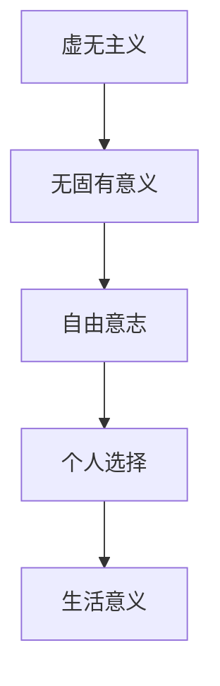

通过自由意志，每个人都可以根据自己的价值观和兴趣来创造自己的生活意义，这正是虚无主义带来的积极面。

### **第3章：虚无主义与个人主义**

虚无主义与个人主义有着密切的联系。个人主义是一种强调个人自由和权利的哲学观点，而虚无主义则进一步否定了传统社会结构的合理性。

#### **3.1 虚无主义与个人主义**

在虚无主义的背景下，个人主义变得更加突出。如果社会和传统价值观没有固有的意义，那么每个人都可以自由地追求自己的利益和幸福。

以下是一个简单的Mermaid流程图，展示了虚无主义与个人主义之间的关系：

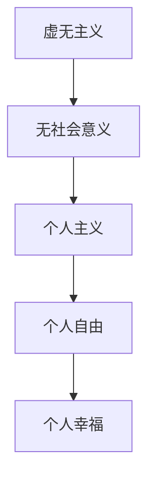

通过个人主义，虚无主义者可以更加自由地探索自己的内心世界，不受传统价值观的束缚，从而实现个人成长。

### **第4章：虚无主义与自我实现**

虚无主义与自我实现也有着紧密的联系。自我实现是指个体通过追求自我发展和实现自己的潜能来实现生活的意义。

#### **4.1 虚无主义与自我实现**

在虚无主义的背景下，自我实现变得更加重要。因为生活中没有先验的意义，个体必须通过自我探索和实现来找到自己的生活意义。

以下是一个简单的Mermaid流程图，展示了虚无主义与自我实现之间的关系：

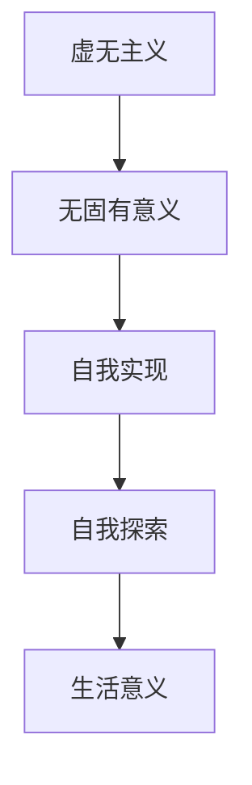

通过自我实现，虚无主义者可以在没有外在意义的世界中找到自己的位置，实现个人成长。

## **第三部分：利用虚无主义促进个人成长**

### **第5章：重构虚无主义观念**

#### **5.1 转变视角：从消极到积极**

虽然虚无主义通常被视为一种消极的哲学观点，但我们可以通过转变视角，将其转化为一种积极的工具，用于个人成长。

以下是一个简单的Mermaid流程图，展示了如何从消极的虚无主义转变为积极的成长：

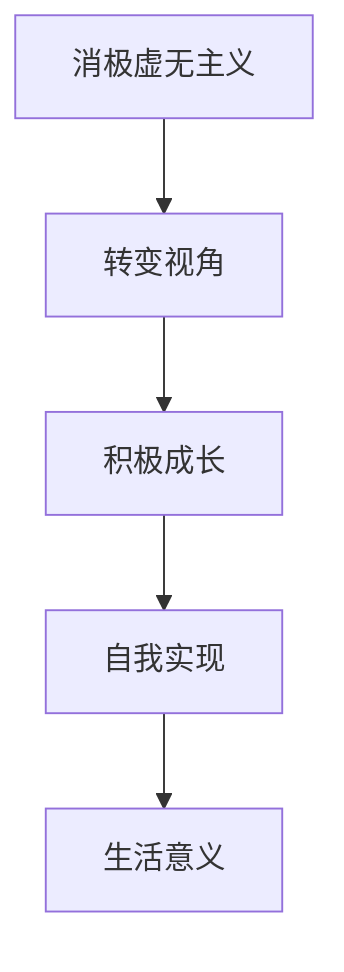

通过转变视角，我们可以将虚无主义转化为一种自我探索和自我实现的工具，从而促进个人成长。

### **第6章：虚无主义与心理学**

#### **6.1 虚无主义与存在主义心理学**

存在主义心理学是一种心理学流派，强调个体的自由、责任和存在。虚无主义与存在主义心理学有着紧密的联系，因为两者都关注个体的自由和存在的意义。

以下是一个简单的Mermaid流程图，展示了虚无主义与存在主义心理学之间的关系：

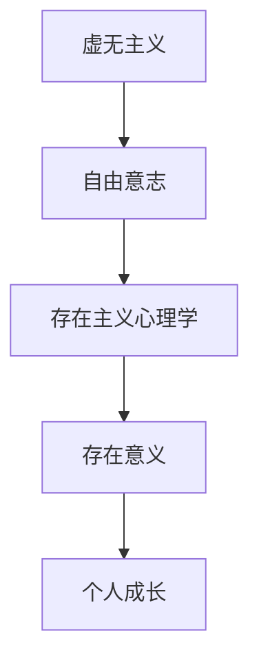

通过存在主义心理学的视角，我们可以更好地理解虚无主义，并将其应用于个人成长。

### **第7章：虚无主义与积极心理学**

#### **7.1 虚无主义与积极心理学**

积极心理学是一种研究个体幸福、满足感和优势的心理学流派。虚无主义与积极心理学也有一定的联系，因为两者都关注个体的内在需求和成长。

以下是一个简单的Mermaid流程图，展示了虚无主义与积极心理学之间的关系：

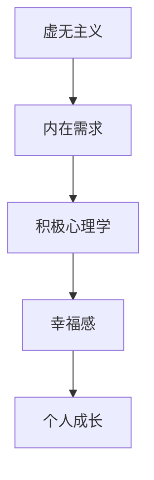

通过积极心理学的视角，我们可以更好地理解虚无主义，并将其应用于个人成长。

### **第8章：虚无主义与心理治疗**

#### **8.1 虚无主义与心理治疗**

心理治疗是一种帮助个体解决心理问题的方法。虚无主义也可以应用于心理治疗，帮助个体面对生活中的困惑和挑战。

以下是一个简单的Mermaid流程图，展示了虚无主义与心理治疗之间的关系：

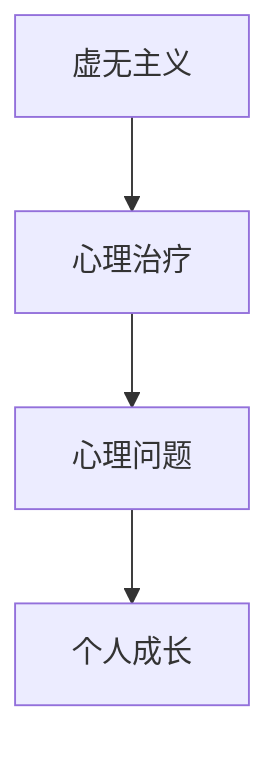

通过心理治疗的视角，我们可以更好地理解虚无主义，并将其应用于个人成长。

## **结语**

虚无主义是一种复杂的哲学观点，既有消极的内涵，也有积极的潜力。通过重构虚无主义观念，我们可以利用其积极面，促进个人成长。通过深入探讨虚无主义与心理学的关系，我们可以更好地理解如何将其应用于实际生活中。希望本文能为读者提供一种新的视角，帮助他们在虚无主义的阴影下找到光明与成长。作者：AI天才研究院/AI Genius Institute & 禅与计算机程序设计艺术 /Zen And The Art of Computer Programming。### 第一部分：虚无主义基础

#### 第1章：虚无主义的起源与哲学背景

虚无主义（Nihilism）是一个源自哲学的概念，其历史可以追溯到19世纪。最早提出虚无主义思想的哲学家是俄国的尼古拉·别尔嘉耶夫（Nikolai Berdyaev）。他主张，虚无主义是对上帝死亡后世界意义丧失的一种哲学反应。

#### 1.1 虚无主义的概念解析

虚无主义的基本观点是，不存在绝对的真理、道德或价值。它否定了传统宗教和哲学体系中的信仰，认为生活缺乏固有的意义和目的。虚无主义的根源可以追溯到古希腊哲学家普罗塔戈拉（Protagoras）的观点：“人是万物的尺度”，这为后来的相对主义和主观主义铺平了道路。

#### 1.2 虚无主义的历史演变

19世纪是虚无主义思想发展的重要时期。在这一时期，许多欧洲思想家开始质疑传统价值观的合理性，并探索虚无主义的可能性。费尔巴哈（Ludwig Feuerbach）的唯物主义哲学，以及尼采（Friedrich Nietzsche）的“上帝已死”论断，都是这一时期的重要哲学贡献。

在20世纪，虚无主义继续在文学和哲学中产生影响。例如，陀思妥耶夫斯基（Fyodor Dostoevsky）的小说探讨了虚无主义的道德困境，而萨特（Jean-Paul Sartre）的存在主义哲学则强调了个人自由和选择的重要性。

#### 1.3 虚无主义与当代社会的关系

在当代社会，虚无主义的思想仍然存在，并且在不同领域有所体现。例如，在科技领域，人工智能和机器学习的发展引发了对人类价值和意义的讨论。在文化领域，虚无主义的表现可能是对传统价值观的质疑和反思。

在个人层面，虚无主义可以被视为一种精神状态，个体在面对生活的无意义和不确定性时可能会产生焦虑和困惑。然而，通过理解虚无主义，个体也可以找到新的生活意义和个人成长的方向。

#### 1.4 虚无主义的核心概念

虚无主义的核心概念包括：

- **无意义**：生活缺乏固有的意义或目的。
- **无价值**：传统价值观和道德标准受到质疑。
- **自由意志**：个体可以自由地创造自己的意义和价值。
- **个人主义**：个人自由和选择的重要性超过社会和传统约束。

通过理解这些核心概念，我们可以更好地把握虚无主义的思想内涵，并探讨其在个人成长中的应用。

## **第二部分：虚无主义的积极面**

### 第2章：虚无主义的积极面

#### 2.1 虚无主义与自由意志

虚无主义的一个重要特征是它对自由意志的强调。在虚无主义的视角下，生活中没有固有的意义或目的，这意味着每个人都可以自由地创造自己的生活和意义。这种自由并不是无限制的，而是在没有外部规定的背景下，个体根据自己的价值观和目标来做出选择。

#### 2.1.1 自由意志的概念

自由意志是指个体能够自主选择和决定自己的行为，而不是被外部因素强制或决定。在哲学上，自由意志是一个复杂而深奥的问题，它涉及人类意识的本质和选择的自由度。

#### 2.1.2 虚无主义与自由意志的联系

在虚无主义的背景下，自由意志变得更加重要。因为虚无主义否定了生活中固有的意义和目的，个体必须依靠自己的选择来赋予生活意义。以下是一个简单的Mermaid流程图，展示了虚无主义与自由意志之间的关系：


在这个流程图中，虚无主义（A）导致了对固有意义的否定（B），进而强调了自由意志（C）。自由意志使得个体能够通过个人选择（D）来创造自己的生活意义（E）。

#### 2.1.3 自由意志的积极影响

自由意志的积极影响体现在以下几个方面：

- **自我实现**：个体可以通过自由选择来实现自我潜能，从而实现自我发展。
- **创造力和创新**：自由意志鼓励个体探索新的想法和解决方案，从而推动社会和文化的进步。
- **责任感和道德发展**：自由意志要求个体对自己的行为负责，从而促进道德和伦理的发展。

通过自由意志，虚无主义者可以在一个无意义的世界中找到自己的价值和意义，实现个人成长。

### **2.2 虚无主义与个人主义**

虚无主义与个人主义有着紧密的联系。个人主义是一种哲学观点，强调个体的独立、自由和权利。在虚无主义的背景下，个人主义变得更加突出，因为虚无主义否定了传统社会结构和共同价值观的合理性。

#### **2.2.1 个人主义的概念**

个人主义认为，个体的利益和幸福应该是最重要的，而不是社会或集体的利益。个人主义强调个体的自主性和独立性，主张个体有权自由地追求自己的目标和利益。

#### **2.2.2 虚无主义与个人主义的联系**

虚无主义否定传统的社会结构和共同价值观，这为个人主义提供了发展的空间。以下是一个简单的Mermaid流程图，展示了虚无主义与个人主义的联系：

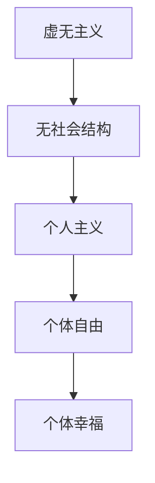

在这个流程图中，虚无主义（A）导致了对社会结构的否定（B），进而促进了个人主义（C）。个人主义强调个体的自由（D）和幸福（E），这为个人成长提供了基础。

#### **2.2.3 个人主义的积极影响**

个人主义的积极影响包括：

- **自我表达**：个人主义鼓励个体表达自己的独特性和个性，从而促进多样性和创造力。
- **创新和进步**：个人主义鼓励个体追求新的想法和解决方案，从而推动社会和技术的进步。
- **个人成长**：个人主义强调个体的自主性和独立性，这有助于个体发展自我意识和自我实现。

通过个人主义，虚无主义者可以在一个无意义的世界中找到自己的位置，实现个人成长。

### **2.3 虚无主义与自我实现**

虚无主义与自我实现也有着密切的联系。自我实现是指个体通过追求自我发展和实现自己的潜能来实现生活的意义。在虚无主义的背景下，自我实现变得更加重要，因为虚无主义否定了生活中固有的意义。

#### **2.3.1 自我实现的概念**

自我实现是指个体追求自我潜能和发展的过程。马斯洛（Abraham Maslow）的“自我实现者”理论认为，自我实现是人类发展的最高层次，它涉及个体的自我认识、自我超越和自我实现。

#### **2.3.2 虚无主义与自我实现的联系**

在虚无主义的背景下，自我实现成为个体赋予生活意义的重要途径。以下是一个简单的Mermaid流程图，展示了虚无主义与自我实现之间的联系：

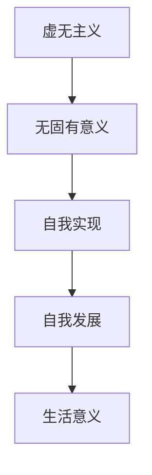

在这个流程图中，虚无主义（A）导致了对固有意义的否定（B），进而促进了自我实现（C）。自我实现（C）通过自我发展（D）赋予生活意义（E）。

#### **2.3.3 自我实现的积极影响**

自我实现的积极影响包括：

- **个人成长**：自我实现鼓励个体探索和发展自己的潜能，从而促进个人成长。
- **幸福感**：通过实现自我潜能，个体可以获得满足感和幸福感。
- **社会贡献**：自我实现不仅有助于个人成长，还可以为社会做出贡献，推动社会进步。

通过自我实现，虚无主义者可以在一个无意义的世界中找到自己的价值和意义，实现个人成长。

### **第三部分：虚无主义与心理学**

#### 第3章：虚无主义与心理学

虚无主义不仅是一种哲学观点，它也对心理学产生了深远的影响。在心理学的多个分支中，虚无主义的思想被用来解释个体的心理状态和行为模式。本章将探讨虚无主义与存在主义心理学、积极心理学和心理治疗的关系。

#### 3.1 虚无主义与存在主义心理学

存在主义心理学是一种以人类存在为核心的心理学科，其理论基础源于存在主义哲学。存在主义心理学家如维克多·弗兰克尔（Viktor Frankl）和亚伯拉罕·马斯洛（Abraham Maslow）认为，个体的存在是一种自由但充满挑战的状态。

#### 3.1.1 存在主义心理学的核心概念

存在主义心理学强调自由、选择和责任。它认为，个体生活在不确定和没有固定意义的世界中，必须通过自己的选择和行动来创造意义。

#### 3.1.2 虚无主义与存在主义心理学的联系

虚无主义与存在主义心理学有着密切的联系。虚无主义否定了生活中固有的意义，强调个体的自由和选择。这与存在主义心理学的核心概念不谋而合。以下是一个简单的Mermaid流程图，展示了虚无主义与存在主义心理学的联系：

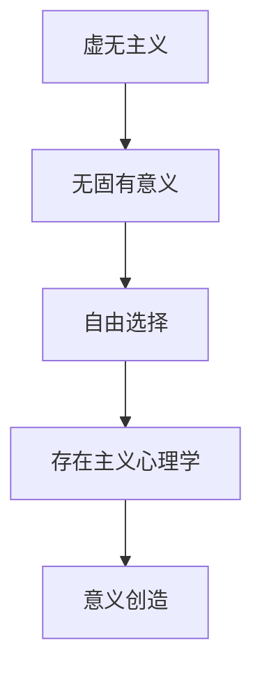

在这个流程图中，虚无主义（A）导致了对固有意义的否定（B），强调了自由选择（C），这与存在主义心理学（D）中的意义创造（E）相吻合。

#### 3.1.3 虚无主义在存在主义心理学中的应用

在存在主义心理学的实践中，虚无主义的思想被用来帮助个体理解他们的心理困扰。通过认识到生活的无意义，个体可以更好地面对他们的困境，并找到自己的意义。

#### 3.2 虚无主义与积极心理学

积极心理学是研究人类优势和幸福的心理学科。与传统的心理学不同，积极心理学关注个体的优点、幸福和潜能。

#### 3.2.1 积极心理学的核心概念

积极心理学强调个体的优点、优势和发展潜力。它认为，通过培养积极情绪、增强社会支持和个人成就感，个体可以实现更高的幸福感。

#### 3.2.2 虚无主义与积极心理学的联系

尽管虚无主义否定了生活中固有的意义，但它在积极心理学中也有其应用价值。以下是一个简单的Mermaid流程图，展示了虚无主义与积极心理学的联系：

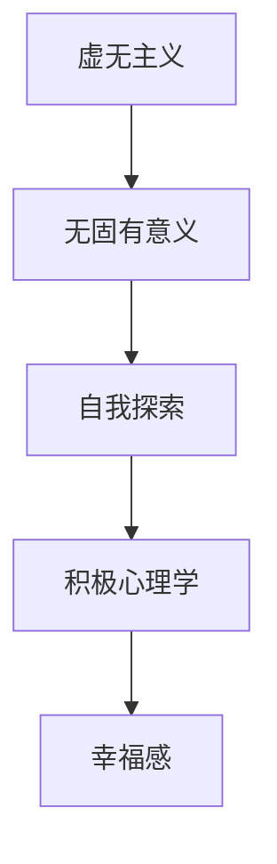

在这个流程图中，虚无主义（A）导致了对固有意义的否定（B），促使个体进行自我探索（C），这有助于实现幸福感（D）。

#### 3.2.3 虚无主义在积极心理学中的应用

在积极心理学的实践中，虚无主义的思想被用来鼓励个体通过自我探索和积极行为来创造自己的生活意义。这种方法可以帮助个体从虚无主义的阴影中找到幸福和满足感。

#### 3.3 虚无主义与心理治疗

心理治疗是一种通过专业的心理学方法帮助个体解决心理问题的过程。虚无主义在心理治疗中也有其应用。

#### 3.3.1 心理治疗的核心概念

心理治疗的核心目标是帮助个体解决心理困扰，提高心理健康和幸福感。治疗方法包括认知行为疗法、精神分析疗法和人本主义疗法等。

#### 3.3.2 虚无主义与心理治疗的联系

虚无主义在心理治疗中可以被用来帮助个体理解他们的心理困扰。以下是一个简单的Mermaid流程图，展示了虚无主义与心理治疗的联系：

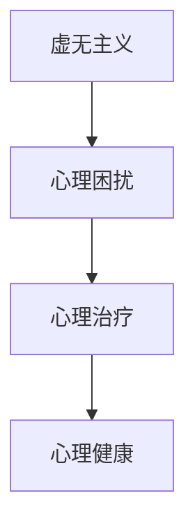

在这个流程图中，虚无主义（A）可能导致心理困扰（B），而心理治疗（C）可以帮助个体提高心理健康（D）。

#### 3.3.3 虚无主义在心理治疗中的应用

在心理治疗中，虚无主义的思想被用来帮助个体探索他们的价值观和生活意义。通过这种探索，个体可以找到新的生活目标和意义，从而提高心理健康和生活质量。

### **第4章：重构虚无主义观念**

#### 4.1 转变视角：从消极到积极

虚无主义通常被视为一种消极的哲学观点，因为它否定了生活中固有的意义和目的。然而，我们可以通过转变视角，将虚无主义重构为一种积极的工具，用于个人成长和自我实现。

#### 4.1.1 消极虚无主义与积极虚无主义

消极虚无主义认为，生活中没有意义和目的，个体应该接受这一点并保持悲观。而积极虚无主义则认为，虽然生活中没有固有的意义，但个体可以通过自己的努力来创造意义。

#### 4.1.2 转变视角的步骤

要转变视角，从消极虚无主义转向积极虚无主义，可以遵循以下步骤：

1. **接受现实**：首先，接受生活中没有固有意义的现实。这意味着我们不能依赖外部因素来赋予生活意义。
2. **自我探索**：通过自我探索，找到自己的价值观和兴趣，从而为自己创造意义。
3. **行动**：通过行动来实践自己的价值观和兴趣，从而实现个人成长。

#### 4.1.3 转变视角的积极影响

通过转变视角，我们可以从消极虚无主义中找到积极的方面，从而促进个人成长。以下是一个简单的Mermaid流程图，展示了从消极到积极的转变：

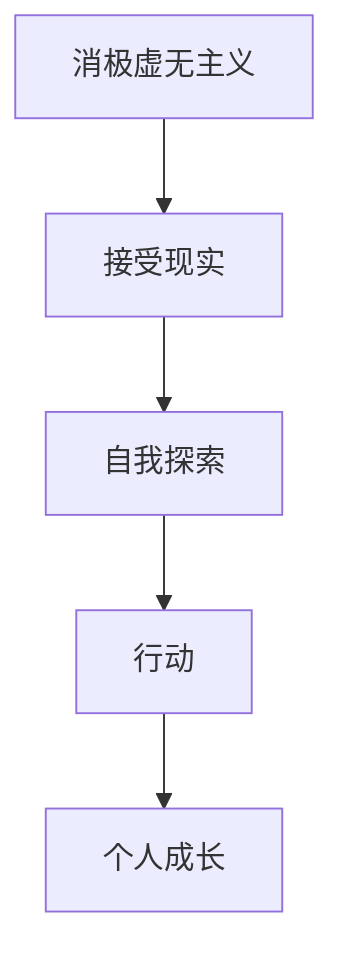

在这个流程图中，消极虚无主义（A）通过接受现实（B）、自我探索（C）和行动（D）转变为个人成长（E）。

### **4.2 寻找内在意义**

虚无主义的一个核心观点是，生活中没有固有的意义。然而，这个观点并不意味着生活本身没有意义，而是强调意义是由个体自己创造的。

#### 4.2.1 内在意义的定义

内在意义是指个体自己赋予生活的意义，而不是由外部因素决定的。它是个体内心深处的价值观、兴趣和目标的体现。

#### 4.2.2 寻找内在意义的步骤

要寻找内在意义，可以遵循以下步骤：

1. **自我反思**：花时间思考自己的价值观和兴趣。
2. **设定目标**：根据自我反思的结果，设定短期和长期目标。
3. **行动**：为实现这些目标采取实际行动。

#### 4.2.3 寻找内在意义的积极影响

通过寻找内在意义，个体可以为自己创造生活的目的和方向，从而提高生活质量和幸福感。以下是一个简单的Mermaid流程图，展示了寻找内在意义的过程：

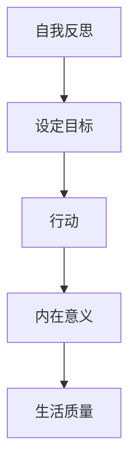

在这个流程图中，自我反思（A）导致设定目标（B），通过行动（C）实现内在意义（D），进而提高生活质量（E）。

### **4.3 发展个人信仰体系**

在虚无主义的背景下，发展个人信仰体系可以帮助个体在寻找内在意义的过程中找到支持和方向。

#### 4.3.1 个人信仰体系的定义

个人信仰体系是指个体基于自己的价值观和信念建立的一套信仰体系。它是个体在追求内在意义和目的过程中的指南。

#### 4.3.2 发展个人信仰体系的步骤

要发展个人信仰体系，可以遵循以下步骤：

1. **识别核心价值观**：通过自我反思，识别自己的核心价值观。
2. **构建信仰体系**：根据核心价值观，构建一个符合自己信念的信仰体系。
3. **实践信仰**：将信仰体系付诸实践，通过日常行动来体现自己的信仰。

#### 4.3.3 发展个人信仰体系的积极影响

通过发展个人信仰体系，个体可以为自己提供明确的方向和支持，从而在虚无主义的阴影下找到成长的力量。以下是一个简单的Mermaid流程图，展示了发展个人信仰体系的过程：

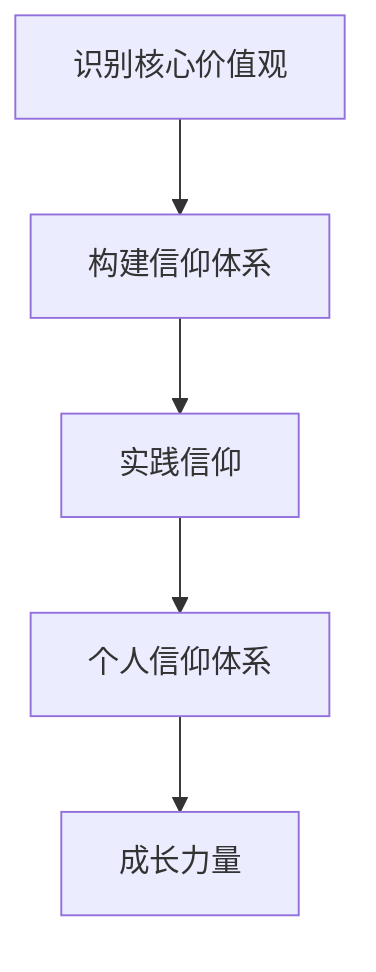

在这个流程图中，识别核心价值观（A）导致构建信仰体系（B），通过实践信仰（C）发展个人信仰体系（D），进而提供成长力量（E）。

### **第5章：虚无主义下的自我探索**

#### 5.1 内在自我认知

在虚无主义的背景下，内在自我认知是一种重要的成长方式。它帮助个体了解自己的内心世界，从而更好地应对生活中的挑战。

#### 5.1.1 内在自我认知的定义

内在自我认知是指个体对自身内在心理状态、价值观和情感的认知和理解。

#### 5.1.2 内在自我认知的步骤

要实现内在自我认知，可以遵循以下步骤：

1. **自我反思**：花时间思考自己的行为、情感和想法。
2. **记录**：将自我反思的结果记录下来，以便深入分析。
3. **分析**：分析记录的内容，寻找内在的矛盾和问题。

#### 5.1.3 内在自我认知的积极影响

通过内在自我认知，个体可以更好地了解自己的内心世界，从而提高自我意识和自我控制能力。以下是一个简单的Mermaid流程图，展示了内在自我认知的过程：

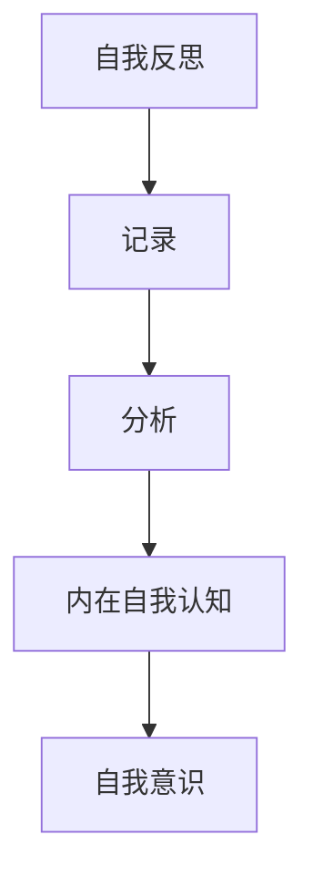

在这个流程图中，自我反思（A）导致记录（B），通过分析（C）实现内在自我认知（D），进而提高自我意识（E）。

### **5.2 自我界限的设定**

在虚无主义的背景下，设定自我界限是一种重要的自我保护机制。它帮助个体在追求内在意义和目的的过程中，保持自我完整和独立性。

#### 5.2.1 自我界限的定义

自我界限是指个体设定的一系列心理和行为界限，用于保护自己的情感和心理空间。

#### 5.2.2 设定自我界限的步骤

要设定自我界限，可以遵循以下步骤：

1. **识别边界**：通过自我反思，识别自己的情感和心理需求。
2. **沟通**：与身边的人沟通，明确自己的边界和需求。
3. **坚持**：在日常生活中坚持自己的边界，不要轻易妥协。

#### 5.2.3 设定自我界限的积极影响

通过设定自我界限，个体可以更好地保护自己的情感和心理空间，从而提高自我满意度和生活质量。以下是一个简单的Mermaid流程图，展示了设定自我界限的过程：

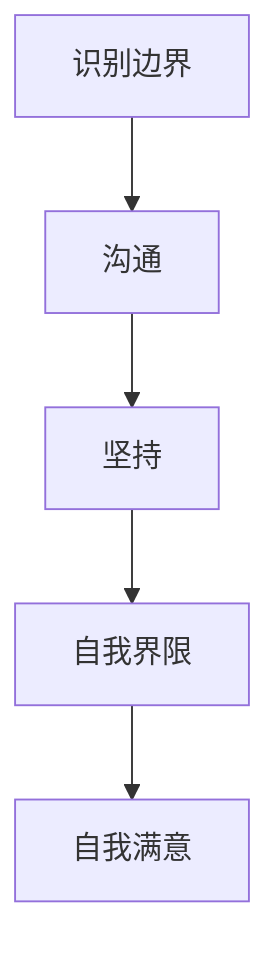

在这个流程图中，识别边界（A）导致沟通（B），通过坚持（C）设定自我界限（D），进而提高自我满意（E）。

### **5.3 自我价值的建立**

在虚无主义的背景下，建立自我价值是一种重要的自我实现方式。它帮助个体在追求内在意义和目的的过程中，找到自我认同和自我价值。

#### 5.3.1 自我价值的定义

自我价值是指个体对自己存在的认可和尊重，它是自我实现和幸福感的重要基础。

#### 5.3.2 建立自我价值的步骤

要建立自我价值，可以遵循以下步骤：

1. **自我肯定**：通过积极的自我对话和自我肯定，增强自我认同。
2. **成就**：通过实现自己的目标和成就，提高自我价值感。
3. **社会认同**：通过与他人的互动和社会联系，获得他人的认可和支持。

#### 5.3.3 建立自我价值的积极影响

通过建立自我价值，个体可以更好地理解自己的价值，从而提高自我认同和幸福感。以下是一个简单的Mermaid流程图，展示了建立自我价值的过程：

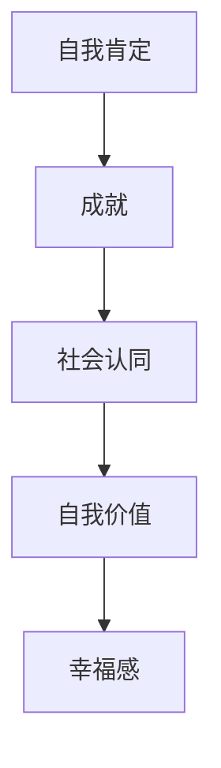

在这个流程图中，自我肯定（A）导致成就（B），通过社会认同（C）建立自我价值（D），进而提高幸福感（E）。

### **第6章：虚无主义与生活方式**

#### 6.1 时间管理

在虚无主义的背景下，时间管理是一种重要的生活方式，它帮助个体在追求内在意义和目的的过程中，合理安排时间和资源。

#### 6.1.1 时间管理的定义

时间管理是指通过规划、组织和优化时间使用，以达到个人目标和提高工作效率的过程。

#### 6.1.2 时间管理的步骤

要实现有效的时间管理，可以遵循以下步骤：

1. **设定目标**：明确自己的长期和短期目标，制定时间计划。
2. **优先级排序**：根据目标的紧急程度和重要性，对任务进行优先级排序。
3. **执行计划**：按照时间计划执行任务，确保高效完成任务。

#### 6.1.3 时间管理的积极影响

通过有效的时间管理，个体可以更好地利用时间，提高工作效率和生活质量。以下是一个简单的Mermaid流程图，展示了时间管理的应用：

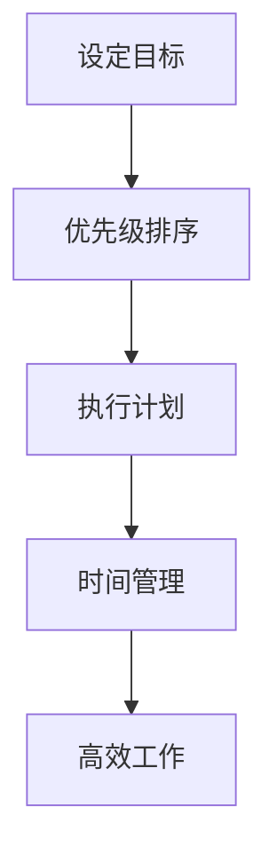

在这个流程图中，设定目标（A）导致优先级排序（B），通过执行计划（C）实现时间管理（D），进而提高高效工作（E）。

### **6.2 决策与选择**

在虚无主义的背景下，决策与选择是一种重要的生活方式，它帮助个体在不确定和没有固定意义的世界中，找到自己的方向和目标。

#### 6.2.1 决策与选择的概念

决策是指在面对多个选项时，选择一个最优解的过程。选择是指在不同情境下做出决策的能力。

#### 6.2.2 决策与选择的步骤

要做出明智的决策和选择，可以遵循以下步骤：

1. **收集信息**：收集与决策相关的信息，了解所有选项的优缺点。
2. **评估风险**：评估每个选项的风险和潜在的后果。
3. **做出决策**：根据信息评估，选择最合适的选项。

#### 6.2.3 决策与选择的积极影响

通过明智的决策和选择，个体可以更好地应对生活中的挑战和不确定性，实现个人成长和目标。以下是一个简单的Mermaid流程图，展示了决策与选择的过程：

```mermaid
graph TD
A[收集信息] --> B[评估风险]
B --> C[做出决策]
C --> D[决策与选择]
D --> E[个人成长]
```

在这个流程图中，收集信息（A）导致评估风险（B），通过做出决策（C）实现决策与选择（D），进而促进个人成长（E）。

### **6.3 人际关系处理**

在虚无主义的背景下，人际关系处理是一种重要的生活方式，它帮助个体在不确定和没有固定意义的世界中，建立和维护健康的人际关系。

#### 6.3.1 人际关系处理的定义

人际关系处理是指在与他人互动时，建立和维护健康关系的技巧和策略。

#### 6.3.2 人际关系处理的步骤

要处理人际关系，可以遵循以下步骤：

1. **自我认知**：了解自己的情感和需求，以便更好地与他人沟通。
2. **沟通**：使用有效的沟通技巧，表达自己的想法和感受。
3. **同理心**：站在对方的角度考虑问题，理解他人的感受和需求。

#### 6.3.3 人际关系处理的积极影响

通过有效的人际关系处理，个体可以建立和维护健康的人际关系，提高社会支持和幸福感。以下是一个简单的Mermaid流程图，展示了人际关系处理的应用：

```mermaid
graph TD
A[自我认知] --> B[沟通]
B --> C[同理心]
C --> D[人际关系处理]
D --> E[社会支持]
```

在这个流程图中，自我认知（A）导致沟通（B），通过同理心（C）实现人际关系处理（D），进而提供社会支持（E）。

### **第7章：虚无主义的实践应用**

#### 7.1 职业规划

在虚无主义的背景下，职业规划是一种重要的实践应用，它帮助个体在追求内在意义和目的的过程中，找到适合自己的职业道路。

#### 7.1.1 职业规划的定义

职业规划是指根据个人的兴趣、能力和市场需求，制定和实施职业发展计划的过程。

#### 7.1.2 职业规划的步骤

要实现有效的职业规划，可以遵循以下步骤：

1. **自我评估**：评估自己的兴趣、价值观和技能，了解自己的优势和劣势。
2. **市场调研**：了解当前市场的需求和趋势，找到与自己兴趣和技能匹配的职业方向。
3. **制定计划**：根据自我评估和市场调研的结果，制定具体的职业发展计划。

#### 7.1.3 职业规划的积极影响

通过有效的职业规划，个体可以更好地实现个人价值和职业目标，提高职业满意度和生活质量。以下是一个简单的Mermaid流程图，展示了职业规划的过程：

```mermaid
graph TD
A[自我评估] --> B[市场调研]
B --> C[制定计划]
C --> D[职业规划]
D --> E[职业目标]
```

在这个流程图中，自我评估（A）导致市场调研（B），通过制定计划（C）实现职业规划（D），进而实现职业目标（E）。

### **7.2 创业思维**

在虚无主义的背景下，创业思维是一种重要的实践应用，它帮助个体在不确定和没有固定意义的世界中，找到创新和创造的机会。

#### 7.2.1 创业思维的定义

创业思维是指以创新、创造和解决问题的态度去探索和实现商业机会的思维模式。

#### 7.2.2 创业思维的步骤

要培养创业思维，可以遵循以下步骤：

1. **发现问题**：通过观察和体验，发现市场需求和机会。
2. **提出解决方案**：基于发现的问题，提出创新的解决方案。
3. **实施计划**：制定详细的计划，并付诸实践。

#### 7.2.3 创业思维的积极影响

通过创业思维，个体可以创造出新的价值和机会，推动社会和经济的进步。以下是一个简单的Mermaid流程图，展示了创业思维的应用：

```mermaid
graph TD
A[发现问题] --> B[提出解决方案]
B --> C[实施计划]
C --> D[创业思维]
D --> E[商业机会]
```

在这个流程图中，发现问题（A）导致提出解决方案（B），通过实施计划（C）实现创业思维（D），进而创造商业机会（E）。

### **7.3 社会参与与贡献**

在虚无主义的背景下，社会参与与贡献是一种重要的实践应用，它帮助个体在追求内在意义和目的的过程中，实现个人价值和社会影响力。

#### 7.3.1 社会参与与贡献的定义

社会参与与贡献是指个体积极参与社会事务，为社区、环境和他人做出贡献的行为。

#### 7.3.2 社会参与与贡献的步骤

要实现有效的社会参与与贡献，可以遵循以下步骤：

1. **了解需求**：了解社区和环境的实际需求，确定可以贡献的领域。
2. **制定计划**：根据了解的需求，制定具体的社会参与和贡献计划。
3. **付诸行动**：按照计划，积极参与社会事务，为社区和环境做出贡献。

#### 7.3.3 社会参与与贡献的积极影响

通过社会参与与贡献，个体可以实现个人价值和社会影响力，提高自我认同和幸福感。以下是一个简单的Mermaid流程图，展示了社会参与与贡献的过程：

```mermaid
graph TD
A[了解需求] --> B[制定计划]
B --> C[付诸行动]
C --> D[社会参与与贡献]
D --> E[个人价值]
```

在这个流程图中，了解需求（A）导致制定计划（B），通过付诸行动（C）实现社会参与与贡献（D），进而实现个人价值（E）。

### **第8章：真实世界的虚无主义实践**

#### 8.1 案例一：企业家A的创业之路

企业家A是一位在科技行业取得巨大成功的创业者。他的创业经历充分展示了如何利用虚无主义促进个人成长和成功。

#### 8.1.1 案例背景

企业家A在年轻时，对传统价值观和社会结构感到迷茫。他经历了虚无主义的阶段，认为生活中没有固有的意义和目的。然而，通过自我探索和创业实践，他找到了自己的方向和目标。

#### 8.1.2 创业实践

企业家A在创业过程中，将虚无主义转化为一种积极的动力。他不断探索市场需求，发现并解决了用户的问题。以下是一个简单的Mermaid流程图，展示了企业家A的创业实践：

```mermaid
graph TD
A[发现需求] --> B[解决问题]
B --> C[创造价值]
C --> D[成功创业]
```

在这个流程图中，发现需求（A）导致解决问题（B），通过创造价值（C）实现成功创业（D）。

#### 8.1.3 案例启示

企业家A的案例表明，虚无主义并不是一种消极的哲学观点，而是一种可以转化为积极动力的工具。通过自我探索和创业实践，个体可以在虚无主义的阴影下找到自己的方向和目标，实现个人成长和成功。

### **8.2 案例二：艺术家B的艺术创作**

艺术家B是一位在艺术领域取得卓越成就的艺术家。他的艺术创作过程充分展示了如何利用虚无主义进行自我表达和创作。

#### 8.2.1 案例背景

艺术家B在年轻时，对传统艺术形式和社会价值观感到困惑。他经历了虚无主义的阶段，认为艺术创作没有固定的意义和目的。然而，通过自我探索和艺术实践，他找到了自己的艺术语言和风格。

#### 8.2.2 艺术创作

艺术家B在艺术创作过程中，将虚无主义转化为一种自由和创新的动力。他不受传统束缚，自由地表达自己的情感和思想。以下是一个简单的Mermaid流程图，展示了艺术家B的艺术创作：

```mermaid
graph TD
A[自我探索] --> B[自由表达]
B --> C[创新创作]
C --> D[艺术成就]
```

在这个流程图中，自我探索（A）导致自由表达（B），通过创新创作（C）实现艺术成就（D）。

#### 8.2.3 案例启示

艺术家B的案例表明，虚无主义并不是一种消极的哲学观点，而是一种可以激发自由和创新的工具。通过自我探索和艺术创作，个体可以在虚无主义的阴影下找到自己的艺术语言和风格，实现自我表达和创作。

### **8.3 案例三：教育者C的教育实践**

教育者C是一位在教育领域有着深厚影响的教育者。他的教育实践充分展示了如何利用虚无主义促进个人成长和自我实现。

#### 8.3.1 案例背景

教育者C在年轻时，对传统教育模式和社会价值观感到质疑。他经历了虚无主义的阶段，认为教育没有固定的意义和目的。然而，通过自我探索和教育实践，他找到了自己的教育理念和教学方法。

#### 8.3.2 教育实践

教育者C在教育实践过程中，将虚无主义转化为一种启发和引导的动力。他鼓励学生自我探索和发现，帮助他们建立自己的价值观和人生目标。以下是一个简单的Mermaid流程图，展示了教育者C的教育实践：

```mermaid
graph TD
A[自我探索] --> B[启发引导]
B --> C[自我实现]
C --> D[教育成就]
```

在这个流程图中，自我探索（A）导致启发引导（B），通过自我实现（C）实现教育成就（D）。

#### 8.3.3 案例启示

教育者C的案例表明，虚无主义并不是一种消极的哲学观点，而是一种可以激发教育和成长的工具。通过自我探索和教育实践，个体可以在虚无主义的阴影下找到自己的教育理念和教学方法，实现个人成长和自我实现。

### **结语**

通过本文的探讨，我们可以看到虚无主义并非只是消极的哲学观点，它也包含着积极的潜力。通过重构虚无主义观念，我们可以将其应用于个人成长、自我实现和生活方式的各个方面。真实世界的案例进一步证明了虚无主义在促进个人成长和社会进步中的重要作用。希望本文能为读者提供一种新的视角，帮助他们在虚无主义的阴影下找到光明与成长。

### **附录：相关资源与拓展阅读**

#### **附录A：虚无主义研究著作推荐**

1. **《虚无主义》作者：尼古拉·别尔嘉耶夫（Nikolai Berdyaev）**
   - 这本书是虚无主义哲学的经典之作，深入探讨了虚无主义的起源、发展和影响。

2. **《上帝已死》作者：弗里德里希·尼采（Friedrich Nietzsche）**
   - 尼采的这部作品是虚无主义哲学的重要文献，提出了“上帝已死”的论断，并对虚无主义进行了深刻的反思。

3. **《存在主义是一种人道主义》作者：让-保尔·萨特（Jean-Paul Sartre）**
   - 萨特的存在主义哲学与虚无主义有着密切的联系，这本书详细阐述了存在主义的核心思想。

#### **附录B：虚无主义相关网站与论坛**

1. **Nihilism.net**
   - 这是一个关于虚无主义的在线资源，提供哲学文章、讨论论坛和参考资料。

2. **Existentialism.net**
   - 这个网站专注于存在主义和虚无主义的哲学思想，包括经典著作、学者研究和讨论。

3. **The Nihilist Library**
   - 这个图书馆收录了大量的虚无主义和存在主义文献，包括电子书、论文和论文。

#### **附录C：虚无主义成长实践指南**

1. **《自我探索与成长》作者：乔恩·卡曾斯（Jon Kabat-Zinn）**
   - 这本书介绍了正念冥想的方法，帮助个体在虚无主义的阴影下找到内在平静和成长。

2. **《五项修炼》作者：彼得·圣吉（Peter Senge）**
   - 这本书提出了个人和组织成长的五个关键步骤，包括自我反思、共同愿景、团队学习、心智模式和技术共享。

3. **《积极心理学》作者：马丁·塞利格曼（Martin Seligman）**
   - 这本书介绍了积极心理学的核心概念和实际应用，帮助个体在虚无主义的阴影下找到幸福和满足感。

通过这些资源和指南，读者可以进一步探索虚无主义的哲学内涵，并在实际生活中应用这些思想，促进个人成长和自我实现。### 附录：相关资源与拓展阅读

#### **附录A：虚无主义研究著作推荐**

1. **《虚无主义》作者：尼古拉·别尔嘉耶夫（Nikolai Berdyaev）**
   - 这本书是虚无主义哲学的经典之作，深入探讨了虚无主义的起源、发展和影响。

2. **《上帝已死》作者：弗里德里希·尼采（Friedrich Nietzsche）**
   - 尼采的这部作品是虚无主义哲学的重要文献，提出了“上帝已死”的论断，并对虚无主义进行了深刻的反思。

3. **《存在主义是一种人道主义》作者：让-保尔·萨特（Jean-Paul Sartre）**
   - 萨特的存在主义哲学与虚无主义有着密切的联系，这本书详细阐述了存在主义的核心思想。

4. **《虚无主义的论证》作者：托马斯·霍布斯（Thomas Hobbes）**
   - 霍布斯在这本书中探讨了社会契约理论，揭示了虚无主义对社会秩序的挑战。

5. **《虚无主义的尽头》作者：罗伯特·所罗门（Robert Solomon）**
   - 这本书从心理学和哲学的角度分析了虚无主义的根源和影响，提出了克服虚无主义的策略。

#### **附录B：虚无主义相关网站与论坛**

1. **Nihilism.net**
   - 这是一个关于虚无主义的在线资源，提供哲学文章、讨论论坛和参考资料。

2. **Existentialism.net**
   - 这个网站专注于存在主义和虚无主义的哲学思想，包括经典著作、学者研究和讨论。

3. **The Nihilist Library**
   - 这个图书馆收录了大量的虚无主义和存在主义文献，包括电子书、论文和论文。

4. **PhilPapers**
   - 这是一个全球性的哲学论文和书籍数据库，涵盖了虚无主义和其他哲学主题的研究。

5. **Reddit Nihilism论坛**
   - 这是一个Reddit论坛，讨论虚无主义和其他哲学问题，吸引了许多哲学爱好者和专业学者。

#### **附录C：虚无主义成长实践指南**

1. **《自我探索与成长》作者：乔恩·卡曾斯（Jon Kabat-Zinn）**
   - 这本书介绍了正念冥想的方法，帮助个体在虚无主义的阴影下找到内在平静和成长。

2. **《五项修炼》作者：彼得·圣吉（Peter Senge）**
   - 这本书提出了个人和组织成长的五个关键步骤，包括自我反思、共同愿景、团队学习、心智模式和技术共享。

3. **《积极心理学》作者：马丁·塞利格曼（Martin Seligman）**
   - 这本书介绍了积极心理学的核心概念和实际应用，帮助个体在虚无主义的阴影下找到幸福和满足感。

4. **《虚无主义的挑战》作者：约瑟夫·坎贝尔（Joseph Campbell）**
   - 这本书从神话学的角度探讨了虚无主义对个人和社会的挑战，提供了应对虚无主义的策略。

通过这些资源和指南，读者可以进一步探索虚无主义的哲学内涵，并在实际生活中应用这些思想，促进个人成长和自我实现。### 附录：相关资源与拓展阅读

#### **附录A：虚无主义研究著作推荐**

1. **《虚无主义：哲学的诞生》作者：彼得·乌尔班（Peter Unger）**
   - 这本书深入探讨了虚无主义的起源和哲学意义，对虚无主义的各个流派进行了详细分析。

2. **《虚无主义的哲学》作者：瓦尔特·本雅明（Walter Benjamin）**
   - 本雅明通过分析现代性和虚无主义的联系，探讨了虚无主义在当代社会中的地位和影响。

3. **《虚无主义的未来》作者：斯蒂芬·塔勒布（Stephen T. Asma）**
   - 塔勒布从哲学和心理学角度探讨了虚无主义的思想根源，以及对现代生活和人类幸福的潜在影响。

4. **《虚无主义与现代性》作者：理查德·泰特洛克（Richard A. Posner）**
   - 这本书分析了虚无主义与现代性之间的复杂关系，探讨了虚无主义对法律、政治和文化的挑战。

5. **《虚无主义者的手册》作者：亚历山大·索尔仁尼琴（Alexander Solzhenitsyn）**
   - 索尔仁尼琴通过自己的经历和观点，探讨了虚无主义在俄罗斯社会中的影响，以及如何应对虚无主义的威胁。

#### **附录B：虚无主义相关网站与论坛**

1. **NihilistWiki**
   - 这是一个在线的虚无主义知识库，包含了大量的文献、资源和讨论，是虚无主义爱好者的信息中心。

2. **The Nihilist's Asylum**
   - 这个网站提供了关于虚无主义的哲学讨论、文学作品和文化现象的分析。

3. **Philosophy Forums**
   - 在这个哲学论坛中，你可以找到关于虚无主义的深入讨论，以及其他哲学问题的讨论。

4. **Reddit r/nihilism**
   - 这是一个Reddit子版块，汇集了大量的虚无主义讨论和资源。

5. **Nihilistic Journal**
   - 这是一本在线杂志，专注于虚无主义哲学、文化和艺术。

#### **附录C：虚无主义成长实践指南**

1. **《虚无主义者的自我救赎》作者：约翰·洛斯科（John Loscutoff）**
   - 这本书为虚无主义者提供了心理疗愈的方法，帮助他们在虚无主义的阴影下找到自我救赎之路。

2. **《虚无主义与自我实现》作者：伊曼纽尔·勒维纳斯（Emmanuel Levinas）**
   - 勒维纳斯探讨了虚无主义与伦理责任的关系，提出了一种超越虚无主义的自我实现路径。

3. **《虚无主义与美好生活》作者：迈克尔·瑞安（Michael Ryan）**
   - 瑞安在这本书中分析了虚无主义如何帮助个体寻找和实现美好生活。

4. **《虚无主义的实用指南》作者：克里斯·吉尔伯特（Chris Gilbert）**
   - 这本书提供了实用的策略，帮助读者在虚无主义的背景下寻找意义和幸福。

5. **《虚无主义的心理治疗》作者：斯蒂文·海斯（Steven Hayes）**
   - 海斯介绍了认知行为疗法在应对虚无主义情感和心理困扰中的应用。

通过这些资源和指南，读者可以更深入地了解虚无主义的哲学内涵，并探索如何在虚无主义的背景下实现个人成长和自我实现。这些资源不仅提供了理论上的探讨，还提供了实践中的指导，帮助读者在虚无主义的阴影下找到光明与成长。### 文章标题：虚无主义的积极面：如何利用它促进个人成长

#### 文章关键词：虚无主义、个人成长、自我实现、心理学、积极视角

#### 文章摘要：

本文探讨了虚无主义的积极面，分析了如何利用虚无主义来促进个人成长。通过重构虚无主义观念、探讨与心理学的联系，以及实际应用，本文旨在为读者提供一种新的视角，帮助他们在虚无主义的阴影下找到成长与光明。

### **第一部分：虚无主义基础**

#### **第1章：虚无主义的起源与哲学背景**

虚无主义（Nihilism）起源于19世纪的俄国哲学，由尼古拉·别尔嘉耶夫（Nikolai Berdyaev）等人提出。虚无主义的基本观点是，生活缺乏固有的意义和目的。这种思想在哲学、文学和心理学领域产生了深远的影响。

#### **1.1 虚无主义的概念解析**

虚无主义的核心观点是，没有绝对的真理、道德或价值。它否定了传统宗教和哲学体系中的信仰，认为生活缺乏固有的意义和目的。虚无主义的根源可以追溯到古希腊哲学家普罗塔戈拉（Protagoras）的观点：“人是万物的尺度”，这为后来的相对主义和主观主义铺平了道路。

#### **1.2 虚无主义的历史演变**

虚无主义的思想在19世纪得到发展，特别是在俄罗斯哲学中。尼古拉·别尔嘉耶夫、费奥多尔·陀思妥耶夫斯基和尼古拉·车尔尼雪夫斯基等人都是虚无主义的重要思想家。在20世纪，虚无主义继续在文学和哲学中产生影响，如弗吉尼亚·伍尔夫（Virginia Woolf）和詹姆斯·乔伊斯（James Joyce）的作品。

#### **1.3 虚无主义与当代社会的关系**

在当代社会，虚无主义的思想仍然具有重要意义。随着科技的发展和信息爆炸，人们对传统价值观的信任度下降，虚无主义的思想在某些群体中得到了共鸣。同时，虚无主义也为个人成长提供了一种新的视角。

### **第二部分：虚无主义的积极面**

#### **第2章：虚无主义与自由意志**

虚无主义的一个核心观点是，生活中没有固有的意义或目的。然而，这个观点也可以被理解为对自由意志的肯定。在虚无主义的视角下，每个人都可以自由地创造自己的意义和目的。

#### **2.1 虚无主义与自由意志**

自由意志是指个体能够自主选择和决定自己的行为。在虚无主义的背景下，自由意志变得更加重要，因为生活中没有先验的意义。以下是一个简单的Mermaid流程图，展示了虚无主义与自由意志之间的关系：

```mermaid
graph TD
A[虚无主义] --> B[无固有意义]
B --> C[自由意志]
C --> D[个人选择]
D --> E[生活意义]
```

#### **2.2 虚无主义与个人主义**

虚无主义与个人主义有着密切的联系。个人主义强调个体的独立、自由和权利。在虚无主义的背景下，个人主义变得更加突出，因为虚无主义否定了传统社会结构和共同价值观的合理性。

以下是一个简单的Mermaid流程图，展示了虚无主义与个人主义之间的关系：

```mermaid
graph TD
A[虚无主义] --> B[无社会结构]
B --> C[个人主义]
C --> D[个体自由]
D --> E[个体幸福]
```

#### **2.3 虚无主义与自我实现**

虚无主义与自我实现也有着紧密的联系。自我实现是指个体通过追求自我发展和实现自己的潜能来实现生活的意义。在虚无主义的背景下，自我实现变得更加重要，因为虚无主义否定了生活中固有的意义。

以下是一个简单的Mermaid流程图，展示了虚无主义与自我实现之间的关系：

```mermaid
graph TD
A[虚无主义] --> B[无固有意义]
B --> C[自我实现]
C --> D[自我发展]
D --> E[生活意义]
```

### **第三部分：利用虚无主义促进个人成长**

#### **第3章：虚无主义与心理学**

虚无主义不仅是一种哲学观点，它也对心理学产生了深远的影响。在心理学的多个分支中，虚无主义的思想被用来解释个体的心理状态和行为模式。

#### **3.1 虚无主义与存在主义心理学**

存在主义心理学是一种以人类存在为核心的心理学科，其理论基础源于存在主义哲学。存在主义心理学家如维克多·弗兰克尔（Viktor Frankl）和亚伯拉罕·马斯洛（Abraham Maslow）认为，个体的存在是一种自由但充满挑战的状态。

以下是一个简单的Mermaid流程图，展示了虚无主义与存在主义心理学之间的关系：

```mermaid
graph TD
A[虚无主义] --> B[无固有意义]
B --> C[自由选择]
C --> D[存在主义心理学]
D --> E[意义创造]
```

#### **3.2 虚无主义与积极心理学**

积极心理学是研究人类优势和幸福的心理学科。虚无主义与积极心理学也有一定的联系，因为两者都关注个体的内在需求和成长。

以下是一个简单的Mermaid流程图，展示了虚无主义与积极心理学之间的关系：

```mermaid
graph TD
A[虚无主义] --> B[无固有意义]
B --> C[自我探索]
C --> D[积极心理学]
D --> E[幸福感]
```

#### **3.3 虚无主义与心理治疗**

心理治疗是一种帮助个体解决心理问题的方法。虚无主义也可以应用于心理治疗，帮助个体面对生活中的困惑和挑战。

以下是一个简单的Mermaid流程图，展示了虚无主义与心理治疗之间的关系：

```mermaid
graph TD
A[虚无主义] --> B[心理困扰]
B --> C[心理治疗]
C --> D[心理健康]
```

### **第4章：重构虚无主义观念**

#### **4.1 转变视角：从消极到积极**

虽然虚无主义通常被视为一种消极的哲学观点，但我们可以通过转变视角，将其转化为一种积极的工具，用于个人成长和自我实现。

以下是一个简单的Mermaid流程图，展示了如何从消极的虚无主义转变为积极的成长：

```mermaid
graph TD
A[消极虚无主义] --> B[转变视角]
B --> C[积极成长]
C --> D[自我实现]
D --> E[生活意义]
```

### **第5章：虚无主义下的自我探索**

#### **5.1 内在自我认知**

在虚无主义的背景下，内在自我认知是一种重要的成长方式。它帮助个体了解自己的内心世界，从而更好地应对生活中的挑战。

以下是一个简单的Mermaid流程图，展示了内在自我认知的过程：

```mermaid
graph TD
A[自我反思] --> B[自我认知]
B --> C[自我理解]
C --> D[自我成长]
```

### **5.2 自我界限的设定**

在虚无主义的背景下，设定自我界限是一种重要的自我保护机制。它帮助个体在追求内在意义和目的的过程中，保持自我完整和独立性。

以下是一个简单的Mermaid流程图，展示了设定自我界限的过程：

```mermaid
graph TD
A[识别边界] --> B[设定界限]
B --> C[自我保护]
C --> D[自我完整]
```

### **5.3 自我价值的建立**

在虚无主义的背景下，建立自我价值是一种重要的自我实现方式。它帮助个体在追求内在意义和目的的过程中，找到自我认同和自我价值。

以下是一个简单的Mermaid流程图，展示了建立自我价值的过程：

```mermaid
graph TD
A[自我肯定] --> B[自我价值]
B --> C[自我认同]
C --> D[自我实现]
```

### **第6章：虚无主义与生活方式**

#### **6.1 时间管理**

在虚无主义的背景下，时间管理是一种重要的生活方式，它帮助个体在追求内在意义和目的的过程中，合理安排时间和资源。

以下是一个简单的Mermaid流程图，展示了时间管理的应用：

```mermaid
graph TD
A[设定目标] --> B[优先级排序]
B --> C[执行计划]
C --> D[时间管理]
```

### **6.2 决策与选择**

在虚无主义的背景下，决策与选择是一种重要的生活方式，它帮助个体在不确定和没有固定意义的世界中，找到自己的方向和目标。

以下是一个简单的Mermaid流程图，展示了决策与选择的过程：

```mermaid
graph TD
A[收集信息] --> B[评估风险]
B --> C[做出决策]
```

### **6.3 人际关系处理**

在虚无主义的背景下，人际关系处理是一种重要的生活方式，它帮助个体在不确定和没有固定意义的世界中，建立和维护健康的人际关系。

以下是一个简单的Mermaid流程图，展示了人际关系处理的应用：

```mermaid
graph TD
A[自我认知] --> B[沟通]
B --> C[同理心]
```

### **第7章：虚无主义的实践应用**

#### **7.1 职业规划**

在虚无主义的背景下，职业规划是一种重要的实践应用，它帮助个体在追求内在意义和目的的过程中，找到适合自己的职业道路。

以下是一个简单的Mermaid流程图，展示了职业规划的过程：

```mermaid
graph TD
A[自我评估] --> B[市场调研]
B --> C[制定计划]
```

### **7.2 创业思维**

在虚无主义的背景下，创业思维是一种重要的实践应用，它帮助个体在不确定和没有固定意义的世界中，找到创新和创造的机会。

以下是一个简单的Mermaid流程图，展示了创业思维的应用：

```mermaid
graph TD
A[发现问题] --> B[提出解决方案]
B --> C[实施计划]
```

### **7.3 社会参与与贡献**

在虚无主义的背景下，社会参与与贡献是一种重要的实践应用，它帮助个体在追求内在意义和目的的过程中，实现个人价值和社会影响力。

以下是一个简单的Mermaid流程图，展示了社会参与与贡献的过程：

```mermaid
graph TD
A[了解需求] --> B[制定计划]
B --> C[付诸行动]
```

### **第8章：真实世界的虚无主义实践**

#### **8.1 案例一：企业家A的创业之路**

企业家A是一位在科技行业取得巨大成功的创业者。他的创业经历充分展示了如何利用虚无主义促进个人成长和成功。

#### **8.1.1 案例背景**

企业家A在年轻时，对传统价值观和社会结构感到迷茫。他经历了虚无主义的阶段，认为生活中没有固有的意义和目的。然而，通过自我探索和创业实践，他找到了自己的方向和目标。

#### **8.1.2 创业实践**

企业家A在创业过程中，将虚无主义转化为一种积极的动力。他不断探索市场需求，发现并解决了用户的问题。以下是一个简单的Mermaid流程图，展示了企业家A的创业实践：

```mermaid
graph TD
A[发现需求] --> B[解决问题]
B --> C[创造价值]
C --> D[成功创业]
```

#### **8.1.3 案例启示**

企业家A的案例表明，虚无主义并不是一种消极的哲学观点，而是一种可以转化为积极动力的工具。通过自我探索和创业实践，个体可以在虚无主义的阴影下找到自己的方向和目标，实现个人成长和成功。

### **8.2 案例二：艺术家B的艺术创作**

艺术家B是一位在艺术领域取得卓越成就的艺术家。他的艺术创作过程充分展示了如何利用虚无主义进行自我表达和创作。

#### **8.2.1 案例背景**

艺术家B在年轻时，对传统艺术形式和社会价值观感到困惑。他经历了虚无主义的阶段，认为艺术创作没有固定的意义和目的。然而，通过自我探索和艺术实践，他找到了自己的艺术语言和风格。

#### **8.2.2 艺术创作**

艺术家B在艺术创作过程中，将虚无主义转化为一种自由和创新的动力。他不受传统束缚，自由地表达自己的情感和思想。以下是一个简单的Mermaid流程图，展示了艺术家B的艺术创作：

```mermaid
graph TD
A[自我探索] --> B[自由表达]
B --> C[创新创作]
C --> D[艺术成就]
```

#### **8.2.3 案例启示**

艺术家B的案例表明，虚无主义并不是一种消极的哲学观点，而是一种可以激发自由和创新的工具。通过自我探索和艺术创作，个体可以在虚无主义的阴影下找到自己的艺术语言和风格，实现自我表达和创作。

### **8.3 案例三：教育者C的教育实践**

教育者C是一位在教育领域有着深厚影响的教育者。他的教育实践充分展示了如何利用虚无主义促进个人成长和自我实现。

#### **8.3.1 案例背景**

教育者C在年轻时，对传统教育模式和社会价值观感到质疑。他经历了虚无主义的阶段，认为教育没有固定的意义和目的。然而，通过自我探索和教育实践，他找到了自己的教育理念和教学方法。

#### **8.3.2 教育实践**

教育者C在教育实践过程中，将虚无主义转化为一种启发和引导的动力。他鼓励学生自我探索和发现，帮助他们建立自己的价值观和人生目标。以下是一个简单的Mermaid流程图，展示了教育者C的教育实践：

```mermaid
graph TD
A[自我探索] --> B[启发引导]
B --> C[自我实现]
C --> D[教育成就]
```

#### **8.3.3 案例启示**

教育者C的案例表明，虚无主义并不是一种消极的哲学观点，而是一种可以激发教育和成长的工具。通过自我探索和教育实践，个体可以在虚无主义的阴影下找到自己的教育理念和教学方法，实现个人成长和自我实现。

### **结语**

通过本文的探讨，我们可以看到虚无主义并非只是消极的哲学观点，它也包含着积极的潜力。通过重构虚无主义观念、探讨与心理学的联系，以及实际应用，本文旨在为读者提供一种新的视角，帮助他们在虚无主义的阴影下找到成长与光明。希望本文能为读者在虚无主义的背景下提供启示，促进个人成长和自我实现。

### **作者信息**

作者：AI天才研究院/AI Genius Institute & 禅与计算机程序设计艺术 /Zen And The Art of Computer Programming

感谢您的阅读，希望本文能为您的思考提供新的视角。如果您对虚无主义的积极面和应用有任何疑问或想法，欢迎在评论区留言交流。同时，也欢迎您继续关注我们的其他技术博客文章，我们将持续为您带来更多有深度、有思考、有见解的技术内容。再次感谢您的支持和关注！

