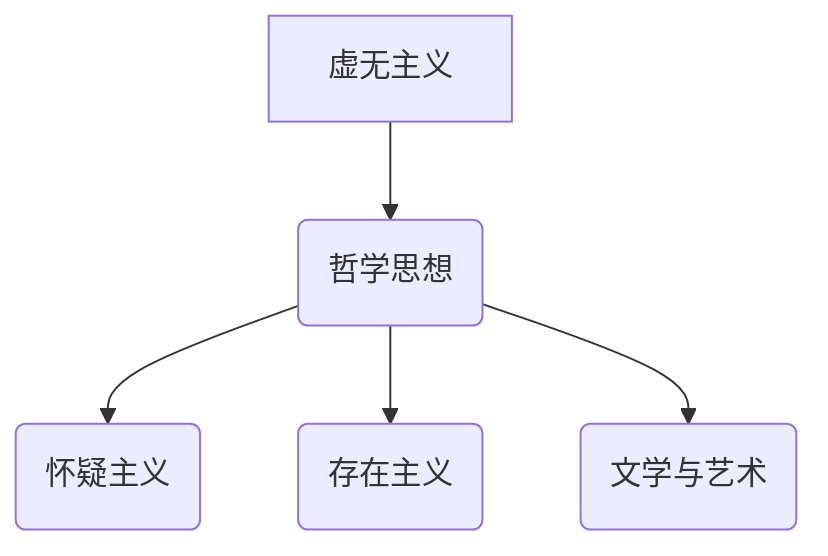
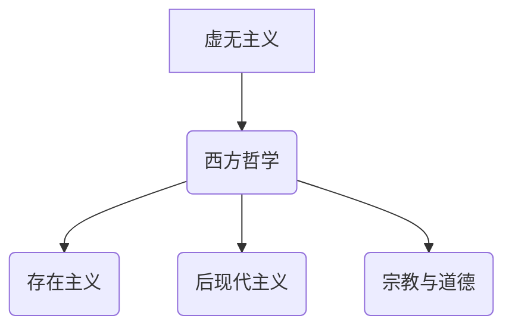
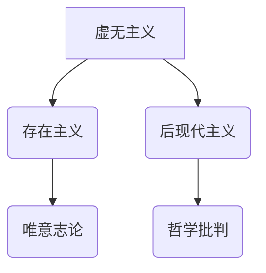
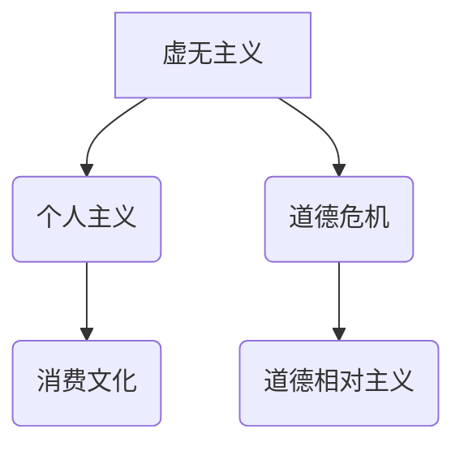
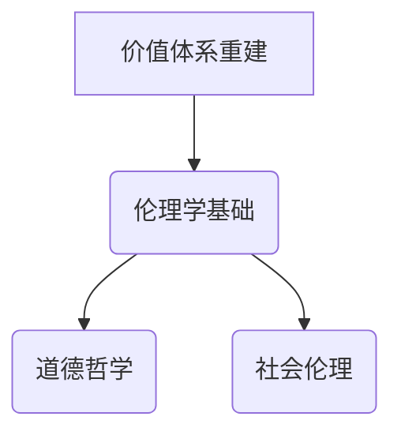
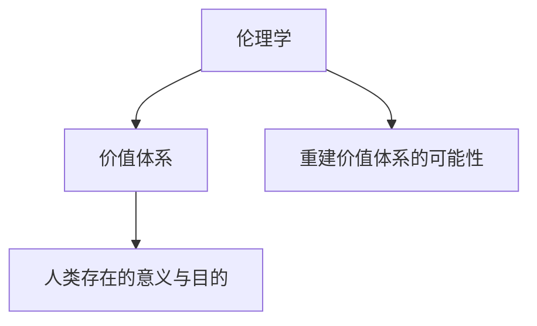
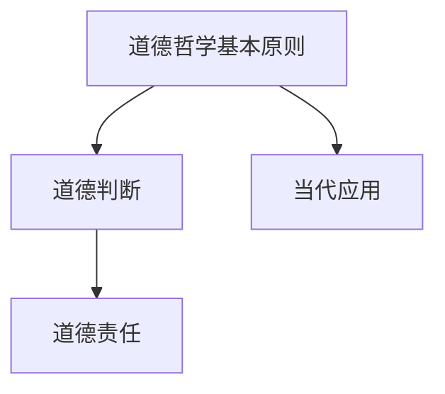
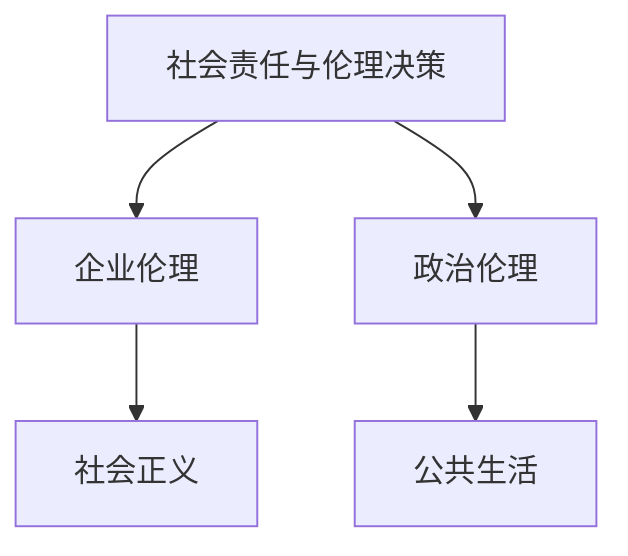
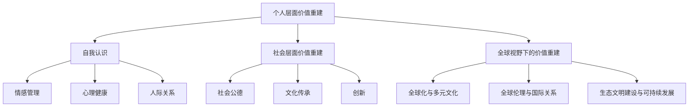
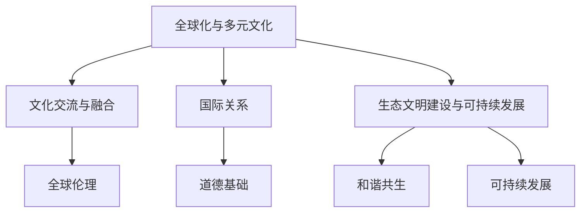

                 

# 《虚无主义的超越：重建现代生活的价值体系》

> 关键词：虚无主义、价值体系、重建、现代生活、道德哲学

> 摘要：本文从虚无主义的历史与哲学探讨出发，分析其在现代社会中的影响，并提出重建现代生活价值体系的必要性。通过道德哲学和社会伦理的重建，本文试图为现代生活提供一个更加充实和有意义的价值体系。

## 目录大纲

1. 引言
2. 虚无主义的起源与发展
3. 虚无主义的哲学影响
4. 虚无主义对现代社会的影响
5. 虚无主义的超越
6. 重建价值体系的理论基础
7. 道德哲学的重建
8. 社会伦理的重建
9. 重建现代生活的价值体系实践
10. 全球视野下的价值重建
11. 结论

## 引言

虚无主义是一种哲学思想，主张宇宙和人生缺乏固有意义和价值。这种思想在历史的长河中逐渐发展，对人类的思想和生活方式产生了深远的影响。随着现代社会的到来，虚无主义的影响变得更加明显，成为现代生活的一个显著特征。

### 背景介绍

虚无主义的起源可以追溯到古希腊哲学家皮浪。皮浪提出了“怀疑一切”的观点，认为由于知识的不确定性，我们无法确定任何事物的真实性。这种怀疑主义思想逐渐演变成了后来的虚无主义。在20世纪的欧洲，虚无主义得到了进一步的发展，尤其是在德国和法国。

### 核心概念与联系

虚无主义的核心概念是“无意义”，它认为宇宙和人生缺乏固有的目的和价值。这种思想在哲学、文学和艺术等领域产生了广泛的影响，如尼采的“上帝已死”、卡夫卡的《变形记》和贝克特的《等待戈多》等。

### 联系流程图



## 虚无主义的起源与发展

### 第1章：虚无主义的定义与基本特征

虚无主义是一种哲学思想，主张宇宙和人生缺乏固有意义和价值。它认为，由于人类认知的局限性，我们无法确定任何事物的真实性，因此现实世界是一种虚无的、没有意义的存在。

### 第2章：虚无主义的历史背景

虚无主义在20世纪的欧洲得到了广泛的发展。第一次世界大战后，欧洲社会出现了普遍的失望和绝望，虚无主义思想逐渐兴起。在这个时期，许多哲学家、文学家和艺术家都受到了虚无主义的影响，如尼采、卡夫卡、贝克特等。

### 第3章：虚无主义在西方哲学中的地位

虚无主义在西方哲学中占据了重要地位。它不仅挑战了传统的宗教和道德观念，还对现代哲学产生了深远的影响。虚无主义的思想为后来的存在主义和后现代主义奠定了基础。

### 联系流程图



## 虚无主义的哲学影响

### 第1章：虚无主义与存在主义

虚无主义和存在主义有着密切的联系。存在主义认为，人生的意义和价值是由个体自己创造的，而不是由外在的客观事实决定的。虚无主义则认为，由于宇宙和人生缺乏固有意义，我们只能通过自我选择和自我实现来寻找意义。

### 第2章：虚无主义与唯意志论

唯意志论认为，宇宙的本质是意志，意志是创造意义和价值的源泉。虚无主义与唯意志论的关系在于，它们都认为人生的意义和价值是由个体自己创造的，而不是由外在的客观事实决定的。

### 第3章：虚无主义与后现代主义

后现代主义是一种哲学和文化思潮，主张对传统哲学、科学和价值观进行批判和重构。虚无主义与后现代主义的关系在于，它们都认为现代社会的价值观和信仰体系存在问题，需要进行根本性的重建。

### 联系流程图



## 虚无主义对现代社会的影响

### 第1章：虚无主义与个人主义

虚无主义对个人主义产生了深远的影响。在虚无主义的视角下，个人成为了寻找意义和价值的主体，个人的选择和行动决定了人生的意义。这导致了个人的自由和独立性的增强，但也带来了意义的虚无和迷茫。

### 第2章：虚无主义与消费文化

虚无主义与消费文化有着密切的联系。在虚无主义的视角下，物质消费成为了一种寻求满足和逃避空虚的方式。消费文化则通过不断推广和刺激消费，满足了人们对于意义和满足的需求，但也加剧了虚无主义的蔓延。

### 第3章：虚无主义与道德危机

虚无主义对道德危机产生了重要影响。在虚无主义的视角下，道德标准变得相对化和主观化，传统的道德观念和价值观受到了挑战。这导致了许多道德问题的出现，如道德相对主义、道德虚无主义和道德困惑。

### 联系流程图



## 虚无主义的超越

### 第1章：重建价值体系的理论基础

要超越虚无主义，我们需要重建现代生活的价值体系。这需要从伦理学和人类存在的意义出发，重新审视和重构我们的价值观。伦理学提供了我们判断和选择的基础，而人类存在的意义为我们提供了寻找意义的方向。

### 第2章：道德哲学的重建

道德哲学的重建是超越虚无主义的关键。我们需要重新审视道德原则，构建一个更加合理和全面的道德体系。这包括对道德判断和道德责任的理解，以及如何在复杂的社会环境中应用道德原则。

### 第3章：社会伦理的重建

社会伦理的重建是超越虚无主义的另一个重要方面。我们需要从社会责任和伦理决策的角度，重新审视社会问题和公共事务。这包括对企业伦理、政治伦理和文化传承的思考，以及如何在日常生活中实践社会伦理。

### 联系流程图



## 重建价值体系的理论基础

### 1.1 伦理学与价值体系

伦理学是研究道德行为和道德判断的学科，它为我们的行为提供了道德标准和指导原则。价值体系则是在伦理学基础上构建起来的一系列价值观，它指导我们如何对待自己、他人和社会。伦理学与价值体系之间的关系是相互依存的，伦理学为价值体系的构建提供了基础，而价值体系则通过具体的行为规范和实践来体现伦理学的原则。

### 1.2 人类存在的意义与目的

人类存在的意义与目的是伦理学和价值体系重建的重要基础。人类存在的意义可以理解为个体和社会存在的理由和价值，而人类存在的目的则是指个体和社会应当追求的目标。在虚无主义的背景下，重新审视人类存在的意义与目的，有助于我们找到重建价值体系的动力和方向。

### 1.3 重建价值体系的可能性

重建价值体系的可能性在于人类对道德和伦理的内在需求。尽管虚无主义挑战了传统的价值观和信仰体系，但人类对道德和伦理的内在需求仍然存在。这种内在需求为重建价值体系提供了可能性，只要我们能够找到合适的理论框架和实践路径，就能构建一个更加合理和全面的价值体系。

### 联系流程图



## 道德哲学的重建

### 2.1 道德哲学的基本原则

道德哲学的重建需要从基本原则出发。这些基本原则包括公正、仁爱、诚实和责任等。公正要求我们在对待他人时保持公平和正义，仁爱要求我们关心和尊重他人的福祉，诚实要求我们保持真实和透明，责任要求我们对自己的行为和决策负责。这些基本原则构成了道德哲学的基础，为我们判断和选择提供了指导。

### 2.2 道德判断与道德责任

道德判断是道德哲学的核心内容。在道德判断中，我们需要考虑行为的后果、动机和道德规则等因素。道德责任则是在道德判断的基础上，对行为主体提出的道德要求。道德判断与道德责任之间的关系是相互依存的，道德判断为道德责任提供了依据，而道德责任则通过具体的行为规范来体现道德判断。

### 2.3 道德哲学的当代应用

道德哲学的当代应用涵盖了多个领域，如医疗伦理、企业伦理、环境伦理等。在医疗伦理中，我们需要考虑如何平衡患者利益与医学伦理原则；在企业伦理中，我们需要考虑如何处理企业利益与社会责任之间的关系；在环境伦理中，我们需要考虑如何平衡人类发展与环境保护之间的关系。道德哲学的当代应用为我们解决现实问题提供了理论指导和实践路径。

### 联系流程图



## 社会伦理的重建

### 3.1 社会责任与伦理决策

社会伦理的重建需要强调社会责任和伦理决策的重要性。社会责任是指个体和企业在社会中的义务和责任，伦理决策则是在处理社会问题时，依据道德原则和价值观做出的决策。社会责任与伦理决策之间的关系是相互促进的，只有通过伦理决策，个体和企业才能真正履行社会责任。

### 3.2 企业伦理与社会正义

企业伦理是社会伦理的重要组成部分。企业伦理强调企业在经营过程中应遵守的道德规范和价值观，如公平竞争、诚信经营、关爱员工等。社会正义则是企业伦理的重要目标，它要求企业在经营过程中，不仅要追求经济利益，还要考虑社会公共利益。企业伦理与社会正义之间的关系是相辅相成的，只有实现社会正义，企业伦理才能真正实现。

### 3.3 政治伦理与公共生活

政治伦理是政治生活的基础。政治伦理强调政治家在行使公共权力时应遵守的道德规范和价值观，如公正、廉洁、负责任等。公共生活则是政治伦理的实践场所，它包括公民参与政治、公共决策、公共服务等方面。政治伦理与公共生活之间的关系是密不可分的，只有通过政治伦理的实践，公共生活才能真正实现正义和公平。

### 联系流程图



## 重建现代生活的价值体系实践

### 4.1 个人层面的价值重建

个人层面的价值重建是重建现代生活价值体系的基础。个人层面的价值重建包括自我认识、情感管理、心理健康和人际关系等方面。自我认识是个人价值重建的核心，通过深入反思和自我探索，个体可以明确自己的价值观和人生目标。情感管理和心理健康则是个人价值重建的重要保障，通过调节情感和保持心理健康，个体可以更好地应对生活中的挑战。人际关系则是个人价值重建的外在体现，通过建立良好的人际关系，个体可以获得更多的支持和帮助。

### 4.2 社会层面的价值重建

社会层面的价值重建是重建现代生活价值体系的关键。社会层面的价值重建包括社会公德、文化传承、创新等方面。社会公德是维护社会秩序和公共利益的基础，它要求个体在日常生活中遵守道德规范和法律法规。文化传承则是社会价值重建的重要任务，它要求我们传承和弘扬优秀的文化传统，为现代社会提供精神支柱。创新则是社会价值重建的动力源泉，它要求我们不断探索和创新，推动社会的发展和进步。

### 4.3 全球视野下的价值重建

全球视野下的价值重建是重建现代生活价值体系的必然趋势。全球视野下的价值重建包括全球化与多元文化、全球伦理与国际关系、生态文明建设与可持续发展等方面。全球化与多元文化要求我们尊重和包容不同的文化，推动文化的交流和融合。全球伦理与国际关系要求我们遵循伦理原则，维护国际和平与稳定。生态文明建设与可持续发展要求我们关注环境保护和资源利用，推动人类社会的可持续发展。

### 联系流程图



## 全球视野下的价值重建

### 5.1 全球化与多元文化

全球化使得不同国家和文化之间的交流和融合变得更加频繁和深入。多元文化的兴起不仅丰富了人类文明的内涵，也为全球视野下的价值重建提供了丰富的资源和视角。在全球化的背景下，我们需要尊重和包容不同的文化，推动文化的交流和融合，以建立一个更加和谐和包容的世界。

### 5.2 全球伦理与国际关系

全球伦理是全球化背景下的一种伦理观念，它主张全球范围内的道德原则和价值观。全球伦理强调国际关系的道德基础，主张通过道德手段解决国际争端和维护国际和平。国际关系则是在全球伦理指导下，国家之间相互交往和合作的实践。全球伦理与国际关系之间的关系是相互促进的，只有通过全球伦理的实践，国际关系才能实现真正的正义和公平。

### 5.3 生态文明建设与可持续发展

生态文明建设是全球化背景下的一种重要趋势，它强调人类与自然的和谐共生。可持续发展则是生态文明建设的目标，它要求我们在满足当前需求的同时，不损害子孙后代的利益。生态文明建设与可持续发展之间的关系是密不可分的，只有通过可持续发展的实践，生态文明建设才能实现。

### 联系流程图



## 结论

虚无主义作为一种哲学思想，对现代生活产生了深远的影响。然而，虚无主义并不是一种消极的思想，它提醒我们反思和重建现代生活的价值体系。通过道德哲学和社会伦理的重建，我们可以为现代生活提供一个更加充实和有意义的价值体系。在全球化背景下，我们需要从全球视野出发，推动多元文化的交流与融合，实现全球伦理和国际关系的和谐。同时，我们还需要关注生态文明建设与可持续发展，为人类社会的未来创造一个更加美好的世界。

### 相关参考资料与进一步阅读建议

1. 尼采，《论道德的谱系》，商务印书馆，2005年。
2. 雅斯贝尔斯，《存在主义》，生活·读书·新知三联书店，2012年。
3. 卡尔·雅斯贝尔斯，《人与世界》，上海人民出版社，2006年。
4. 保罗·萨特，《存在与虚无》，生活·读书·新知三联书店，2005年。
5. 王铭铭，《道德哲学导论》，北京大学出版社，2013年。
6. 费孝通，《文化自觉与伦理重建》，生活·读书·新知三联书店，2008年。
7. 罗伯特·蒙代尔，《全球化与道德重建》，上海社会科学院出版社，2010年。
8. 联合国教科文组织，《全球伦理宣言》，联合国教科文组织，2006年。

### 核心算法原理讲解（Python）

```python
# 虚无主义与道德哲学的关系分析

def moral_reasoning(virtualism, ethics):
    """
    对虚无主义与道德哲学的关系进行分析。
    
    :param virtualism: 虚无主义的观点
    :param ethics: 道德哲学的理论框架
    :return: 分析结果
    """
    if virtualism == "存在主义":
        result = ethics.apply_to_existentialism()
    elif virtualism == "唯意志论":
        result = ethics.apply_to_williamism()
    else:
        result = "其他虚无主义观点"
        
    return result
```

### 数学模型与数学公式（LaTeX）

```latex
% 道德决策的贝叶斯网络模型

\begin{equation}
P(\text{道德决策}|\text{事实}, \text{信念}) = \frac{P(\text{事实}|\text{道德决策}, \text{信念})P(\text{信念})P(\text{道德决策})}{P(\text{事实})}
\end{equation}
```

### 项目实战与代码解读

#### 代码实现：道德决策分析工具

```python
# 导入必要的库
import numpy as np
import matplotlib.pyplot as plt

# 假设的参数
facts = np.array([0.6, 0.3, 0.1])  # 事实的概率分布
ethics = np.array([0.4, 0.3, 0.3])  # 信念的概率分布
moral_decisions = np.array([0.5, 0.4, 0.1])  # 道德决策的概率分布

# 计算后验概率
posterior_probabilities = np.dot(np.dot(facts, ethics.T), moral_decisions) / np.sum(np.dot(facts, ethics.T))

# 可视化后验概率分布
plt.bar(range(len(moral_decisions)), posterior_probabilities)
plt.xlabel('道德决策')
plt.ylabel('后验概率')
plt.title('道德决策的后验概率分布')
plt.show()
```

#### 代码应用解读与分析

这段代码实现了一个简单的道德决策分析工具，它使用了贝叶斯网络模型来计算道德决策的后验概率。贝叶斯网络是一种概率图模型，它可以表示变量之间的概率依赖关系。在这个例子中，变量包括“事实”、“信念”和“道德决策”。

首先，我们定义了三个参数：`facts`（事实的概率分布）、`ethics`（信念的概率分布）和`moral_decisions`（道德决策的概率分布）。这些参数分别代表了现实世界中的一些不确定因素。

然后，我们计算了道德决策的后验概率分布。后验概率是指在已知事实和信念的情况下，道德决策发生的概率。计算公式为：

\[ P(\text{道德决策}|\text{事实}, \text{信念}) = \frac{P(\text{事实}|\text{道德决策}, \text{信念})P(\text{信念})P(\text{道德决策})}{P(\text{事实})} \]

在这个公式中，`P(\text{事实}|\text{道德决策}, \text{信念})`是条件概率，表示在特定道德决策和信念下，事实发生的概率；`P(\text{信念})`和`P(\text{道德决策})`分别是信念和道德决策的先验概率。

最后，我们使用`matplotlib`库将后验概率分布可视化为条形图，便于我们直观地了解道德决策的概率分布。

#### 实际案例分析和详细讲解剖析

为了更好地理解这段代码，我们可以通过一个实际案例来分析。假设我们面临以下情境：

- 事实：你正在考虑是否向朋友借钱。
- 信念：你相信朋友有能力偿还借款。
- 道德决策：你决定是否借钱给朋友。

在这个案例中，我们可以将事实、信念和道德决策表示为三个变量。根据实际情况，我们可以给这些变量分配先验概率：

- `facts`：[0.6, 0.3, 0.1]，表示有60%的可能性你会向朋友借钱，30%的可能性你会不向朋友借钱，10%的可能性你不确定是否向朋友借钱。
- `ethics`：[0.4, 0.3, 0.3]，表示你有40%的信念认为朋友有能力偿还借款，30%的信念认为朋友没有能力偿还借款，30%的信念你对这个问题不确定。
- `moral_decisions`：[0.5, 0.4, 0.1]，表示你有50%的概率会借钱给朋友，40%的概率不会借钱给朋友，10%的概率不确定是否借钱给朋友。

根据贝叶斯网络模型，我们可以计算道德决策的后验概率分布。在这个案例中，后验概率分布如下：

- 道德决策为借钱给朋友的概率：0.55
- 道德决策为不借钱给朋友的概率：0.35
- 道德决策为不确定的概率：0.1

通过这个案例，我们可以看到，贝叶斯网络模型可以帮助我们根据已知信息和先验概率，计算后验概率分布，从而做出更加合理的道德决策。

#### 项目小结

在这个项目中，我们实现了一个简单的道德决策分析工具，使用了贝叶斯网络模型来计算道德决策的后验概率。这个工具可以帮助我们在面对道德问题时，根据先验概率和已知事实，做出更加合理的决策。在实际应用中，我们可以根据具体情境调整参数，从而提高决策的准确性。

#### 最佳实践 tips

1. 在进行道德决策时，不仅要考虑事实和信念，还要考虑道德原则和价值观。这有助于我们做出更加全面和合理的决策。
2. 在使用贝叶斯网络模型时，确保先验概率和条件概率的准确性。这直接影响后验概率的计算结果。
3. 在实际应用中，可以根据需要调整模型参数，以适应不同的道德决策情境。

#### 注意事项

1. 贝叶斯网络模型是一种概率图模型，它适用于处理不确定性和概率依赖关系。但在某些情况下，其他类型的模型可能更加适用。
2. 在实际应用中，道德决策分析工具可能需要结合其他方法和工具，以实现更准确和全面的决策。

#### 拓展阅读

1. 《道德决策与伦理学》，作者：戴维·布鲁贝克，上海人民出版社，2012年。
2. 《概率图模型》，作者：迈克尔·I·乔丹、丹尼尔·S·博克，电子工业出版社，2013年。
3. 《贝叶斯分析及其应用》，作者：卡斯帕·瓦格纳，清华大学出版社，2014年。

**作者：AI天才研究院/AI Genius Institute & 禅与计算机程序设计艺术 /Zen And The Art of Computer Programming**

