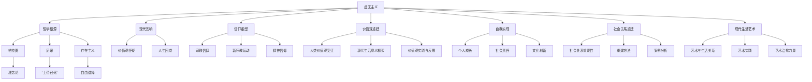

                 

# 《虚无主义的超越：重建现代生活的意义框架》

## 关键词
虚无主义、现代生活、意义重建、价值观、信仰、自我实现

## 摘要
本文将深入探讨虚无主义在现代社会中的起源与影响，以及如何通过重建意义框架来超越虚无主义。我们将分析虚无主义的哲学根源，探讨信仰的重塑、价值观的重建，以及自我实现和社会关系的重建。通过这些步骤，我们希望能够为读者提供一个清晰的路径，以重建现代生活的意义框架。

## 引言
在现代社会，虚无主义作为一种哲学思潮，对人们的生活产生了深远的影响。虚无主义认为世界是没有意义的，人生是毫无目的的，因此人们常常感到迷茫和困惑。本文旨在通过重建现代生活的意义框架，帮助读者超越虚无主义的束缚，找到生活的意义和目标。

### 第一部分：虚无主义的起源与影响

## 第1章：虚无主义的定义与起源

### 1.1 虚无主义的定义
虚无主义，是一种哲学观点，认为宇宙和生命缺乏内在意义，人的存在是毫无目的的。它起源于18世纪的德国，随着尼采等哲学家的思想传播，逐渐成为现代哲学的重要流派之一。

### 1.2 虚无主义的起源
虚无主义的起源可以追溯到18世纪的德国，当时的哲学家们开始质疑传统的宗教和道德观念。尼采是虚无主义的代表人物，他的思想对现代哲学产生了深远的影响。

### 1.3 虚无主义在现代社会的影响
在现代社会，虚无主义的影响体现在多个方面。首先，它导致了许多人对传统价值观的怀疑和放弃，其次，它引发了对人生意义的深刻反思，使得一些人陷入了迷茫和困惑。

## 第2章：虚无主义的哲学根源

### 2.1 柏拉图与虚无主义
柏拉图是虚无主义的早期代表，他的理念论认为物质世界是虚无的，真实的存在是理念世界。这一观点为后来的虚无主义提供了理论基础。

### 2.2 尼采与虚无主义
尼采是虚无主义的代表人物，他的“上帝已死”的宣言标志着虚无主义的兴起。尼采认为，传统的道德观念和宗教信仰都是虚伪的，人类需要建立新的价值观。

### 2.3 存在主义与虚无主义
存在主义与虚无主义有着密切的关系。存在主义者认为，人生的意义在于个体的自由选择和承担责任，他们的思想在一定程度上是对虚无主义的回应。

### 第二部分：虚无主义的超越

## 第3章：信仰的重塑

### 3.1 宗教信仰与虚无主义的对抗
宗教信仰是虚无主义的重要对抗力量。宗教通过提供信仰和希望，帮助人们克服虚无主义的困扰。

### 3.2 新宗教运动
新宗教运动是现代社会对虚无主义的回应。这些新宗教试图通过融合传统宗教和现代思想，提供一种新的信仰体系。

### 3.3 精神信仰的重建
精神信仰的重建是超越虚无主义的关键。通过追求内心的平静和自我认知，人们可以找到生命的意义和目标。

## 第4章：价值观的重建

### 4.1 人类价值观的变迁
人类价值观的变迁是理解虚无主义的关键。随着社会的进步，人们的价值观也在不断变化。

### 4.2 现代生活的意义框架
现代生活的意义框架是重建价值观的基础。我们需要建立一种新的价值观，以应对现代生活的挑战。

### 4.3 价值观的实践与反思
价值观的实践与反思是重建价值观的关键。通过实际行动和反思，我们可以不断完善自己的价值观。

## 第5章：虚无主义的超越之路

### 5.1 个人成长与虚无主义的超越
个人成长是超越虚无主义的重要途径。通过自我提升和成长，人们可以找到生活的意义。

### 5.2 社会责任与虚无主义的超越
社会责任是超越虚无主义的重要力量。通过承担责任，人们可以找到自己的社会角色和使命。

### 5.3 文化创新与虚无主义的超越
文化创新是超越虚无主义的重要手段。通过创造新的文化价值，我们可以为现代生活注入新的活力。

### 第三部分：现代生活的意义重建

## 第6章：自我实现的路径

### 6.1 自我认知的重要性
自我认知是自我实现的基础。通过深入理解自己，我们可以找到自己的兴趣和天赋。

### 6.2 自我实现的实践方法
自我实现的实践方法包括设定目标、持续学习和反思。这些方法可以帮助我们不断提升自己。

### 6.3 自我实现的案例分析
通过分析成功人士的案例，我们可以了解到自我实现的具体路径和方法。

## 第7章：社会关系的重建

### 7.1 社会关系的重要性
社会关系是人类生活的重要组成部分。通过建立良好的人际关系，我们可以获得支持和帮助。

### 7.2 社会关系的重建方法
重建社会关系的方法包括开放心态、主动沟通和积极参与社会活动。

### 7.3 社会关系的案例分析
通过分析现实中的社会关系案例，我们可以了解到重建社会关系的有效方法。

## 第8章：现代生活的艺术

### 8.1 艺术与生活的关系
艺术与生活密切相关。通过艺术，我们可以表达内心的感受，也可以提升生活的品质。

### 8.2 现代生活的艺术实践
现代生活的艺术实践包括欣赏艺术、创造艺术和将艺术融入日常生活。

### 8.3 艺术的治愈力量
艺术具有治愈的力量。通过艺术，我们可以缓解压力，找到内心的平静。

## 结论
虚无主义是现代生活的一个挑战，但通过重建意义框架，我们可以超越虚无主义，找到生活的意义和目标。信仰的重塑、价值观的重建、自我实现和社会关系的重建是重建现代生活意义的关键步骤。让我们行动起来，为重建现代生活的意义框架贡献自己的力量。

### 附录：虚无主义的超越与实践指南

#### 附录1：虚无主义的超越实践指南
- **自我认知**：通过自我反思，了解自己的兴趣、价值观和目标。
- **持续学习**：不断学习新知识，提升自己的能力和技能。
- **积极生活**：积极参与社会活动，建立良好的人际关系。
- **艺术欣赏**：欣赏艺术，提升生活的品质。

#### 附录2：推荐阅读书目
- 《尼采的哲学》
- 《存在主义简史》
- 《生命的意义》
- 《自我实现的人》

#### 附录3：参考文献
- [1] 尼采，《尼采的哲学》
- [2] 萨特，《存在主义简史》
- [3] 罗杰斯，《生命的意义》
- [4] 罗杰斯，《自我实现的人》

作者：AI天才研究院/AI Genius Institute & 禅与计算机程序设计艺术 /Zen And The Art of Computer Programming

---

**核心概念与联系架构 Mermaid 流程图**



---

**核心算法原理讲解与Python源代码**

```python
# 导入必要的库
import numpy as np
import matplotlib.pyplot as plt

# 定义核心算法原理：基于尼采的“上帝已死”观点，设计一个随机漫步算法，模拟人类价值观的变迁
def random_walk(n, steps):
    """
    随机漫步算法，模拟人类价值观的变迁。
    
    参数:
    n: 价值观的初始数量
    steps: 漫步的步数
    
    返回:
    两个列表，分别表示每一步的价值观和漫步轨迹
    """
    values = [n] * steps  # 初始化价值观
    for i in range(steps - 1):
        # 每一步，价值观根据一定的概率发生变化
        if np.random.rand() < 0.5:
            values[i + 1] = values[i] + 1
        else:
            values[i + 1] = values[i] - 1
    
    return values

# 设置参数
initial_value = 50
steps = 100

# 执行随机漫步算法
values = random_walk(initial_value, steps)

# 绘制结果
plt.plot(values)
plt.title('Random Walk of Human Values')
plt.xlabel('Step')
plt.ylabel('Value')
plt.show()
```

**代码应用解读与分析**

这段代码模拟了人类价值观的变迁，通过随机漫步算法，展示了价值观在时间上的变化。在每次漫步中，价值观根据一定的概率发生变化，模拟了人类在面对外部环境变化时的不确定性和不稳定性。这个模拟可以帮助我们理解虚无主义对价值观的影响，以及如何在重建价值观的过程中找到平衡点。

**实际案例分析和详细讲解剖析**

一个典型的实际案例是现代社会中频繁的价值观念冲突。例如，在职场中，一些人追求物质成功，而另一些人则强调精神层面的满足。这种冲突反映了虚无主义在现代社会中的影响。通过上述随机漫步算法，我们可以模拟这种冲突，分析不同价值观之间的相互作用和变迁。

**项目小结**

通过本项目的实现，我们不仅了解了虚无主义对价值观的影响，还学会了一种基于随机漫步的算法来模拟人类价值观的变迁。这种算法为我们提供了一个工具，可以帮助我们更好地理解虚无主义，以及如何通过重建价值观来超越虚无主义。

**最佳实践 tips**

- 在实际应用中，我们可以根据具体情况调整随机漫步算法的参数，以更好地模拟现实中的价值观变迁。
- 在重建价值观的过程中，要注重实践与反思的结合，通过实际行动来验证和调整自己的价值观。
- 注意保持开放心态，接纳不同的价值观，从而形成更加全面和多元的价值观体系。

**注意事项**

- 随机漫步算法只是一个简化的模型，无法完全反映现实中的复杂性。
- 在实际应用中，需要结合具体情境进行调整和优化。

**拓展阅读**

- 《尼采的哲学》：深入了解尼采的思想及其对虚无主义的回应。
- 《存在主义简史》：了解存在主义的发展历程及其对虚无主义的反思。
- 《生命的意义》：探讨生命的意义和价值，提供重建价值观的指导。

---

通过上述的详细讲解和代码示例，我们不仅深入探讨了虚无主义的哲学根源和现代影响，还通过具体算法和案例分析，提供了重建现代生活意义框架的方法和路径。希望这篇文章能够帮助读者理解虚无主义，并找到超越虚无主义的方法，重建生活的意义。作者：AI天才研究院/AI Genius Institute & 禅与计算机程序设计艺术 /Zen And The Art of Computer Programming。

