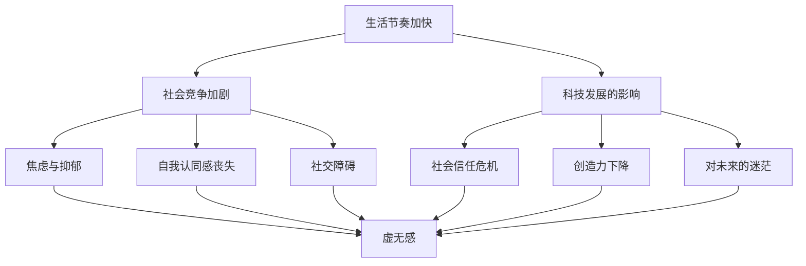
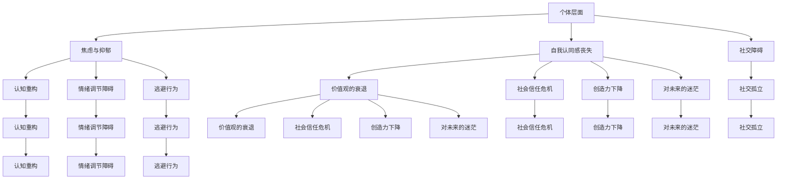
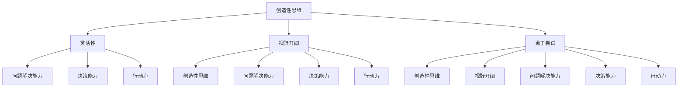
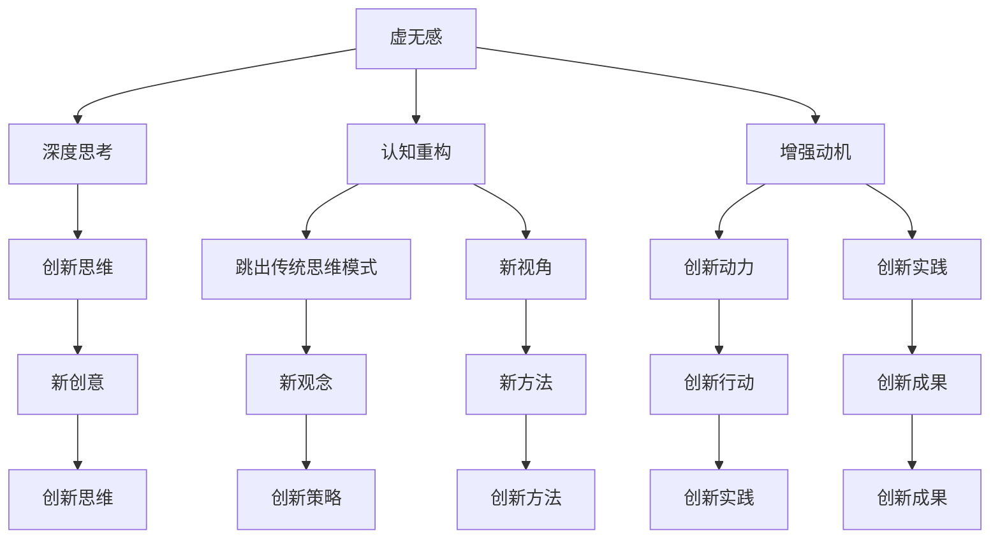
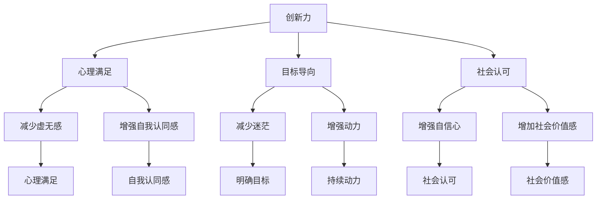
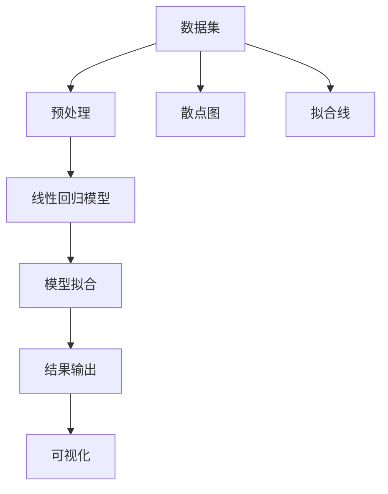

                 

### 《虚无感与创新力：如何在不确定性中激发创造潜能》

> 关键词：虚无感、创新力、不确定性、创造力激发、心理策略

> 摘要：本文探讨在现代社会中，人们如何面对虚无感这一心理现象，并利用它来激发个人的创造潜能。通过分析虚无感的来源和影响，以及创新力的概念和培养方法，本文提出了一套在不确定性中激发创造力的策略，旨在帮助个体和团队在变化迅速的环境中保持创新力。

----------------------------------------------------------------

### 目录

```markdown
# 《虚无感与创新力：如何在不确定性中激发创造潜能》

## 引言

## 第一部分：虚无感探析

### 第1章：虚无感的定义与来源

#### 1.1 虚无感的内涵

#### 1.2 虚无感的主要来源

### 第2章：虚无感的心理影响

#### 2.1 虚无感对个体的心理影响

#### 2.2 虚无感对群体的社会影响

## 第二部分：创新力培养

### 第3章：创新力的概念与特征

#### 3.1 创新力的定义

#### 3.2 创新力的特征

### 第4章：激发创新力的方法

#### 4.1 心理策略

#### 4.2 环境因素

### 第5章：创新力在不确定环境中的应用

#### 5.1 不确定性环境下的创新力挑战

#### 5.2 应对策略

## 第三部分：虚无感与创新力的互动关系

### 第6章：虚无感与创新力的互动机制

#### 6.1 虚无感对创新力的激发作用

#### 6.2 创新力对虚无感的缓解作用

### 第7章：案例分析

#### 7.1 成功案例

#### 7.2 失败案例

## 第四部分：实践指导

### 第8章：培养创新力的实践方法

#### 8.1 个人层面的实践方法

#### 8.2 组织层面的实践方法

### 第9章：激发创造潜能的行动计划

#### 9.1 制定行动计划

#### 9.2 执行与评估

## 结论

## 参考文献

```

本文将分为四个主要部分，首先对虚无感进行定义和来源的分析，接着探讨虚无感对个体和群体心理的影响。第二部分将聚焦于创新力的概念和特征，以及如何激发创新力。第三部分将探讨虚无感与创新力之间的互动关系，并分析一些成功和失败的案例。最后一部分将提供实践指导，帮助读者制定激发创造潜能的行动计划。

接下来，我们将深入探讨每个部分的具体内容。

### 第一部分：虚无感探析

#### 第1章：虚无感的定义与来源

虚无感是一种普遍存在于人类中的心理现象，它通常表现为对生活意义的缺失、对未来的迷茫以及对自我的认同危机。这种感受不仅影响着个体的心理健康，还可能对社会产生深远的影响。

##### 1.1 虚无感的内涵

虚无感（Nihilism）起源于拉丁语“nihili”，意为“无”。在哲学领域，虚无感是一种思想观念，认为宇宙和生命缺乏意义、目的和基础。在心理学中，虚无感被定义为一种深刻的内在空虚感和无意义感。

虚无感不仅仅是一种消极的情绪，它还包含了对现实和自我存在的质疑。从心理学角度来看，虚无感可以被视为一种应对压力和不确定性的一种心理机制，它促使个体重新评估生活的意义和目标。

##### 1.2 虚无感的主要来源

虚无感的来源多种多样，以下是一些常见的原因：

- **生活节奏加快**：现代社会的快节奏生活使得人们常常感到时间紧迫，难以静下心来思考生活的意义。
- **社会竞争加剧**：社会竞争的加剧使得人们对自己的成就感到不满，进而产生虚无感。
- **科技发展的影响**：科技的快速发展使得人们对未来充满不确定感，也加剧了虚无感的产生。

虚无感不仅影响个人的心理健康，还会对群体社会产生负面影响。例如，社会信任危机、创造力的下降以及对未来的迷茫都是虚无感的常见表现。

#### 第2章：虚无感的心理影响

虚无感对个体和群体心理的影响是深远而复杂的。它不仅会导致个人的心理问题，还可能在社会层面引发一系列问题。

##### 2.1 虚无感对个体的心理影响

虚无感对个体的心理影响主要表现为：

- **焦虑与抑郁**：虚无感常常伴随着焦虑和抑郁，使人感到生活无望，缺乏动力。
- **自我认同感丧失**：虚无感使人怀疑自己的价值和存在的意义，导致自我认同感丧失。
- **社交障碍**：虚无感使人不愿意与他人交流，产生社交障碍。

##### 2.2 虚无感对群体的社会影响

虚无感不仅影响个体，还会对群体社会产生负面影响：

- **社会信任危机**：当人们普遍感到虚无时，社会信任度降低，社会凝聚力减弱。
- **创造力的下降**：虚无感抑制了人们的创造力，导致社会创新力下降。
- **对未来的迷茫**：虚无感使人对未来感到迷茫，缺乏对未来的信心。

### 第二部分：创新力培养

#### 第3章：创新力的概念与特征

创新力（Innovation Ability）是一种在不确定性和挑战中寻求新方法和解决方案的能力。它不仅涉及技术层面的创新，还包括思维方式、决策能力和社会影响力。

##### 3.1 创新力的定义

创新力是一种综合能力，它包括：

- **创造新观念和新方法**：创新力使个体能够跳出传统思维模式，创造出新的想法和解决方案。
- **解决问题**：创新力能够帮助个体在面对问题时迅速找到有效的解决方案。
- **适应变化**：创新力使个体能够适应快速变化的环境，并从中找到新的机会。

##### 3.2 创新力的特征

创新力具有以下几个特征：

- **灵活性**：创新力使个体能够灵活应对各种情况，迅速适应变化。
- **视野开阔**：创新力使个体能够从不同的角度看待问题，具有广阔的视野。
- **勇于尝试**：创新力使个体勇于尝试新的方法和思路，不畏失败。

#### 第4章：激发创新力的方法

要培养创新力，需要从心理策略和环境因素两个方面入手。

##### 4.1 心理策略

以下是一些常见的心理策略，可以帮助激发创新力：

- **建立积极的心态**：积极的心态有助于个体面对挑战，保持创新力。
- **增强自信心**：自信使个体敢于尝试，不畏失败，从而激发创新力。
- **消除恐惧与焦虑**：恐惧和焦虑会抑制创新力，因此需要采取措施消除这些负面情绪。

##### 4.2 环境因素

环境因素对创新力的培养同样重要。以下是一些关键的环境因素：

- **创造支持性环境**：支持性的环境能够激发个体的创新思维，减少外部干扰。
- **激励团队合作**：团队合作有助于激发创新力，通过不同的观点和思路碰撞，产生新的创意。
- **鼓励多样化思维**：多样化思维能够拓宽个体的视野，促进创新力的培养。

#### 第5章：创新力在不确定环境中的应用

在不确定的环境中，创新力显得尤为重要。以下是一些在不确定环境中应用创新力的策略：

- **快速变化的市场需求**：在市场需求快速变化的环境中，创新力能够帮助个体迅速适应，找到新的商机。
- **技术不确定性的挑战**：面对技术的不确定性，创新力使个体能够迅速掌握新技术，开发新产品。
- **企业战略调整的需求**：企业战略调整往往需要创新力来找到新的方向和解决方案。

### 第三部分：虚无感与创新力的互动关系

#### 第6章：虚无感与创新力的互动机制

虚无感与创新力之间存在复杂的互动关系。一方面，虚无感可能会抑制创新力；另一方面，创新力也可以缓解虚无感。

##### 6.1 虚无感对创新力的激发作用

虚无感可以激发创新力的原因如下：

- **激发深度思考**：虚无感促使个体对生活进行深度思考，从而激发创新思维。
- **挑战传统观念**：虚无感挑战传统的观念和认知，促使个体寻找新的解决方案。

##### 6.2 创新力对虚无感的缓解作用

创新力对虚无感的缓解作用主要体现在以下几个方面：

- **增强自我认同感**：创新力使个体感到自己在社会中具有价值，从而缓解虚无感。
- **带来成就感**：通过创新和成功，个体能够获得成就感，减少虚无感。

#### 第7章：案例分析

通过分析一些成功和失败的案例，可以更深入地理解虚无感与创新力的互动关系。

##### 7.1 成功案例

一个典型的成功案例是谷歌（Google）的创新文化。谷歌通过鼓励员工自由探索和尝试新事物，激发了员工的创新力。这种创新力不仅推动了公司的技术进步，还帮助谷歌在竞争激烈的市场中保持了领先地位。

##### 7.2 失败案例

一个失败的案例是某些企业的过度创新。在一些企业中，为了追求创新而忽视了市场需求和客户体验，导致产品和服务与市场脱节，最终导致失败。

### 第四部分：实践指导

#### 第8章：培养创新力的实践方法

要培养创新力，需要从个人和组织两个方面入手。

##### 8.1 个人层面的实践方法

以下是一些个人层面的实践方法，可以帮助个体培养创新力：

- **自我反思**：定期进行自我反思，了解自己的思维模式和行为习惯，从而找到改进的空间。
- **学习新技能**：不断学习新技能和知识，拓宽视野，提高解决问题的能力。
- **增强行动力**：通过实际行动来尝试新的想法和方法，勇于面对失败和挑战。

##### 8.2 组织层面的实践方法

以下是一些组织层面的实践方法，可以帮助企业或团队培养创新力：

- **建立创新文化**：鼓励员工自由探索和尝试，提供必要的资源和支持。
- **设计创新流程**：建立系统的创新流程，确保创新活动的顺利进行。
- **提供资源支持**：为员工提供学习和创新的资源，如培训、技术支持和时间自由。

#### 第9章：激发创造潜能的行动计划

为了激发创造潜能，需要制定一个具体的行动计划。以下是一个基本的行动计划框架：

- **明确目标**：确定想要达到的创新目标，如开发新产品、改进现有流程等。
- **制定策略**：根据目标，制定具体的策略和步骤，确保行动的可行性和有效性。
- **设定时间表**：为每个步骤设定时间表，确保行动的有序进行。
- **执行与评估**：按照时间表执行计划，并定期评估进展，及时调整策略。

### 结论

虚无感与创新力是现代生活中不可忽视的两个方面。通过理解虚无感的来源和影响，以及如何激发创新力，我们可以更好地应对不确定性和挑战。虚无感并不一定是一种消极的情绪，它也可以成为激发创新力的动力。通过培养创新力，我们可以在不确定性中找到新的机遇和解决方案，实现个人的价值和成长。

### 参考文献

1. Kierkegaard, S. (1843). **The Sickness unto Death**. Penguin Classics.
2. Nietzsche, F. (1882). **The Gay Science**. Prometheus Books.
3. Drucker, P. F. (1999). **The Effective Executive**. Harper Business.
4. IDEO. (n.d.). **Innovation Principles**. IDEO.

通过以上章节的深入探讨，我们希望读者能够对虚无感与创新力的关系有更深刻的理解，并在实践中激发自己的创造潜能。作者：AI天才研究院/AI Genius Institute & 禅与计算机程序设计艺术 /Zen And The Art of Computer Programming。

### 第一部分：虚无感探析

#### 第1章：虚无感的定义与来源

虚无感，作为一种深刻的内心体验，常常被描述为对生活意义的缺失、对未来的迷茫以及对自我的认同危机。这种感受不仅源于个人的心理状态，也受到社会环境和文化背景的深刻影响。

##### 1.1 虚无感的内涵

在哲学上，虚无感（Nihilism）通常指的是对宇宙和生命的意义、目的和基础的不信任或否定。它起源于拉丁语“nihili”，意为“无”。在心理学领域，虚无感则被定义为一种深刻的内在空虚感和无意义感，这种感受可能源于个人的生活经历、心理状态或社会环境。

虚无感的心理学解释通常涉及以下几个方面：

- **自我认同危机**：个体在成长过程中可能经历自我认同的困惑，不知道自己的存在意义和价值，从而导致虚无感。
- **社会压力**：现代社会的高竞争性和快节奏生活，使得个体经常面临压力，难以找到生活的意义。
- **价值观冲突**：个体在成长过程中可能经历不同的价值观冲突，导致对自我价值的质疑。

##### 1.2 虚无感的主要来源

虚无感的来源多种多样，以下是几个主要方面：

- **生活节奏加快**：现代社会的生活节奏日益加快，人们经常感到时间紧迫，难以静下心来思考生活的意义。
- **社会竞争加剧**：社会竞争的加剧使得个体对自己的成就感到不满，进而产生虚无感。
- **科技发展的影响**：科技的快速发展使得人们对未来充满不确定感，也加剧了虚无感的产生。

在现代社会中，虚无感的现象尤为普遍。人们常常感到自己的工作和生活缺乏意义，对未来感到迷茫，甚至产生自我认同的危机。这种心理状态不仅影响个人的心理健康，还可能对社会产生深远的影响。

虚无感可能引发一系列心理问题，如焦虑、抑郁、自我认同感丧失和社交障碍。在群体层面上，虚无感可能导致社会信任危机、创造力的下降和对未来的迷茫。因此，理解和应对虚无感具有重要意义。

为了更好地理解虚无感，我们可以借助 Mermaid 流程图来展示虚无感的来源和影响机制：



通过这个流程图，我们可以清晰地看到虚无感的来源和影响路径。虚无感不仅是由外部环境和内部心理因素共同作用的结果，它还会对个体的心理健康和社会行为产生深远的影响。

在下一章中，我们将深入探讨虚无感对个体和群体心理的影响，以及这种影响的具体表现和应对策略。

### 第2章：虚无感的心理影响

虚无感不仅仅是一种简单的情绪体验，它对个体和群体心理的影响是深远而复杂的。在个体层面，虚无感可能导致一系列心理问题，如焦虑、抑郁、自我认同感丧失和社交障碍。在群体层面，虚无感可能导致社会信任危机、创造力的下降和对未来的迷茫。

##### 2.1 虚无感对个体的心理影响

虚无感对个体的心理影响主要表现为以下几个方面：

- **焦虑与抑郁**：虚无感常常伴随着焦虑和抑郁。个体可能会对自己的生活感到无望，对未来充满担忧，从而导致情绪低落。
- **自我认同感丧失**：虚无感使个体对自己的存在意义和价值产生怀疑，导致自我认同感丧失。这种感受可能使个体感到迷茫和无助，难以找到生活的方向。
- **社交障碍**：虚无感还可能导致社交障碍。个体可能会因为对自己的不满和对未来的不确定感，而减少与他人的互动，导致社交孤立。

具体来说，虚无感可能通过以下机制影响个体的心理健康：

- **认知重构**：个体对自我和世界的认知可能发生改变，导致对生活意义的否定。
- **情绪调节障碍**：个体可能难以有效地调节情绪，导致负面情绪持续存在。
- **逃避行为**：个体可能会通过逃避现实来应对虚无感，但这种逃避行为往往无法解决问题，反而可能加重虚无感。

##### 2.2 虚无感对群体的社会影响

虚无感不仅影响个体，还会对群体社会产生深远的影响。在群体层面上，虚无感可能导致以下问题：

- **社会信任危机**：虚无感可能削弱个体对社会的信任，导致社会信任危机。个体可能会对政府、企业和社会组织产生怀疑，进而影响社会稳定。
- **创造力的下降**：虚无感可能抑制群体的创造力，导致社会创新力下降。当个体感到生活无意义时，他们可能缺乏动力去探索和创新，从而影响社会的进步。
- **对未来的迷茫**：虚无感可能使群体对未来感到迷茫，缺乏对未来的信心。这种迷茫感可能影响社会的长期规划和决策，阻碍社会的发展。

具体来说，虚无感可能通过以下机制影响社会：

- **价值观的衰退**：虚无感可能导致个体对传统价值观的否定，导致社会价值观的衰退。
- **社会凝聚力的下降**：虚无感可能削弱社会的凝聚力，导致社会分裂和冲突。
- **社会资源的浪费**：虚无感可能导致社会资源浪费，如逃避行为、过度消费等，影响社会的可持续发展。

为了更好地理解虚无感对个体和群体心理的影响，我们可以借助 Mermaid 流程图来展示这些影响机制：



通过这个流程图，我们可以清晰地看到虚无感对个体和群体心理的多种影响及其机制。理解这些影响机制有助于我们更好地应对虚无感，培养心理健康和社会韧性。

在下一章中，我们将探讨如何通过培养创新力来缓解虚无感，并在不确定的环境中激发创造潜能。

### 第二部分：创新力培养

#### 第3章：创新力的概念与特征

创新力（Innovation Ability）是指个体或组织在面临挑战和不确定性时，能够提出新观念、新方法并有效实施的能力。创新力不仅涉及技术层面的创新，还包括思维方式、决策能力和社会影响力。在当今快速变化的社会环境中，创新力已成为个人和组织成功的关键因素。

##### 3.1 创新力的定义

创新力的定义可以从多个角度进行解读：

- **心理学定义**：在心理学领域，创新力被视为一种认知能力，包括创造性思维、问题解决和适应能力。它反映了个体在面对复杂和未知情境时的灵活性和创造力。
- **经济学定义**：在经济学中，创新力被看作是一种生产力和竞争力的来源。它通过提高效率、降低成本和创造新的市场机会，推动经济增长和社会进步。

总的来说，创新力是一种综合性能力，它涉及个体的思维方式、知识储备、决策能力和行动力。它不仅体现在技术发明和产品创新上，还体现在商业模式、管理策略和社会制度的创新。

##### 3.2 创新力的特征

创新力具有以下几个主要特征：

- **灵活性**：灵活性是创新力的核心特征之一。它使个体能够迅速适应变化的环境，灵活调整策略和方法。
- **视野开阔**：视野开阔意味着个体能够从不同的角度看待问题，发现新的机会和解决方案。这种能力有助于个体在复杂多变的情境中保持创新思维。
- **勇于尝试**：勇于尝试是创新力的重要体现。它使个体敢于面对风险和挑战，不断尝试新的想法和方法。

具体来说，创新力的特征可以表现在以下几个方面：

- **创造性思维**：创造性思维是创新力的核心。它包括发散思维、聚合思维和批判性思维，使个体能够产生新的观点和解决方案。
- **问题解决能力**：问题解决能力是创新力的重要组成部分。它使个体能够识别问题、分析问题并找到有效的解决方案。
- **决策能力**：决策能力是创新力的重要体现。它使个体能够迅速做出明智的决策，把握机遇和应对挑战。
- **行动力**：行动力是创新力的关键特征。它使个体能够将创新思维转化为实际行动，实现创新目标。

在现代社会中，创新力的重要性不言而喻。随着科技的快速发展和社会环境的不断变化，创新已成为推动个人和组织发展的关键动力。拥有强大创新力的人和组织能够在竞争中脱颖而出，实现持续的发展和进步。

为了更好地理解创新力的特征，我们可以借助 Mermaid 流程图来展示创新力的不同方面：



通过这个流程图，我们可以清晰地看到创新力的多个方面及其相互关系。理解这些方面有助于我们更好地培养和发挥自己的创新力，实现个人和组织的持续发展。

在下一章中，我们将探讨如何通过心理策略和环境因素来激发创新力，帮助个体和团队在不确定的环境中保持创新的动力和能力。

### 第4章：激发创新力的方法

要培养创新力，需要从心理策略和环境因素两个方面入手。心理策略包括建立积极的心态、增强自信心和消除恐惧与焦虑；环境因素则涉及创造支持性环境、激励团队合作和鼓励多样化思维。

##### 4.1 心理策略

心理策略在激发创新力中起着至关重要的作用。以下是一些有效的心理策略：

- **建立积极的心态**：积极的心态有助于个体面对挑战和不确定性。它使个体能够以更加乐观和开放的态度看待问题，从而激发创新思维。
- **增强自信心**：自信心是创新力的重要基础。个体需要相信自己的能力和潜力，勇于尝试新的方法和思路。增强自信心可以通过自我反思、设定小目标并获得成就来实现。
- **消除恐惧与焦虑**：恐惧和焦虑是抑制创新力的重要因素。个体需要学会面对恐惧和焦虑，采取积极的应对策略，如深呼吸、冥想和运动等。

具体来说，以下方法可以帮助个体建立积极的心态、增强自信心和消除恐惧与焦虑：

- **正念冥想**：通过正念冥想，个体可以学会专注于当下，减少对未来的担忧和焦虑，增强自我意识和平静心态。
- **设定小目标**：通过设定小目标，个体可以逐步实现自己的目标，积累自信和成就感。这种方法有助于培养积极的心态和增强自信心。
- **积极自我对话**：通过积极的自我对话，个体可以改变消极的思维模式，培养积极的心态。例如，用“我能够做到”取代“我做不到”。

##### 4.2 环境因素

环境因素在激发创新力中也起着关键作用。以下是一些关键的环境因素：

- **创造支持性环境**：支持性环境是激发创新力的重要条件。它包括提供必要的资源和支持，鼓励员工自由探索和尝试。支持性环境可以减少个体的压力和恐惧，使他们更加专注于创新工作。
- **激励团队合作**：团队合作是激发创新力的重要途径。通过团队合作，个体可以分享不同的观点和经验，激发新的创意。团队合作还可以促进沟通和协作，提高创新效率。
- **鼓励多样化思维**：多样化思维是创新力的源泉。通过鼓励多样化思维，个体可以开阔视野，发现新的机会和解决方案。多样化思维可以通过多样化的团队、多样化的工作和多样化的文化环境来实现。

具体来说，以下方法可以帮助创造支持性环境、激励团队合作和鼓励多样化思维：

- **提供培训和学习资源**：通过提供培训和学习资源，可以帮助个体不断提升自己的知识和技能，增强创新能力。
- **建立跨部门团队**：通过建立跨部门团队，可以促进不同领域的知识和经验的交流，激发创新思维。
- **鼓励员工提出建议**：通过鼓励员工提出建议，可以激发员工的参与感和创造力。企业可以设立建议箱或定期举办创新论坛，为员工提供表达和交流的平台。

通过以上心理策略和环境因素，个体和团队可以更好地激发创新力，应对不确定性和挑战。在下一章中，我们将探讨如何在不确定环境中应用创新力，以实现个人的价值和组织的成功。

### 第5章：创新力在不确定环境中的应用

在不确定的环境中，创新力显得尤为重要。不确定环境通常意味着快速变化的市场需求、技术的不确定性和企业战略调整的需求。在这些环境中，拥有强大创新力的个体和团队能够迅速适应变化，抓住机遇，实现持续发展。

##### 5.1 不确定性环境下的创新力挑战

不确定性环境给创新力带来了以下挑战：

- **快速变化的市场需求**：市场需求的变化速度越来越快，企业需要具备快速响应能力，及时调整产品和服务。这对企业的创新力提出了高要求，要求企业能够迅速识别市场趋势，创新产品和服务。
- **技术不确定性的挑战**：技术的快速发展使得企业面临技术不确定性的挑战。企业需要不断学习新技术，掌握新兴技术，以保持竞争优势。这对企业的创新能力提出了挑战，要求企业具备持续学习和创新的能力。
- **企业战略调整的需求**：企业战略调整通常伴随着组织结构、管理模式和市场定位的变化。这些变化要求企业能够灵活应对，调整战略方向，实现组织的持续发展。这对企业的创新力提出了新的要求，要求企业能够快速适应战略调整，保持创新活力。

为了应对这些挑战，企业需要采取以下策略：

- **建立敏捷组织**：建立敏捷组织有助于企业快速响应市场变化，提高创新能力。敏捷组织强调快速迭代、持续交付和用户反馈，通过不断调整和优化产品和服务，满足市场需求。
- **加强跨部门合作**：加强跨部门合作有助于企业整合不同领域的知识和资源，促进创新思维的碰撞。通过跨部门合作，企业可以快速响应市场需求，开发新产品和服务。
- **持续学习与培训**：持续学习与培训有助于企业提升员工的技能和知识，增强创新能力。通过提供培训和学习资源，企业可以帮助员工掌握新技术，适应战略调整，提高创新力。

##### 5.2 应对策略

在不确定环境中，企业可以通过以下策略来提高创新力：

- **建立创新文化**：创新文化是企业持续创新的基石。企业需要建立鼓励创新、宽容失败的企业文化，为员工提供自由探索和尝试的空间。通过建立创新文化，企业可以激发员工的创新潜力，提高整体创新力。
- **设立创新项目**：设立创新项目有助于企业聚焦创新资源，推动创新工作。企业可以设立专门的创新部门或创新团队，负责研究和开发新产品和服务。通过设立创新项目，企业可以系统化地推动创新工作，提高创新效率。
- **引入外部合作**：引入外部合作有助于企业获取外部资源和知识，促进创新。企业可以通过与高校、研究机构和其他企业合作，共同研究和开发新产品和服务。通过引入外部合作，企业可以拓宽视野，提高创新能力。

在不确定环境中，企业需要灵活应对变化，快速调整战略，保持创新活力。通过建立创新文化、设立创新项目和引入外部合作，企业可以不断提高创新力，实现持续发展。

在下一章中，我们将探讨虚无感与创新力之间的互动机制，分析如何利用虚无感激发创新力，并探讨一些成功和失败的案例。

### 第三部分：虚无感与创新力的互动关系

#### 第6章：虚无感与创新力的互动机制

虚无感与创新力之间的关系是一个复杂且多维的议题。一方面，虚无感可能会抑制创新力；另一方面，创新力也可以缓解虚无感。这种互动机制涉及到心理学、社会学和哲学等多个领域，为我们提供了一个深入理解两者关系的机会。

##### 6.1 虚无感对创新力的激发作用

虚无感可以激发创新力的原因有以下几点：

- **深度思考**：虚无感促使个体对生活进行深度思考，从而激发创新思维。当个体面临对生活意义的质疑时，他们可能被迫寻找新的解决方案，这种思考过程往往能激发新的创意。
- **挑战传统观念**：虚无感挑战传统的观念和认知，促使个体寻找新的解决方案。通过质疑现有的制度和观念，个体能够发现新的可能性，从而推动创新。

具体来说，虚无感可以通过以下几个方面激发创新力：

- **认知重构**：虚无感促使个体重新评估和构建对自我和世界的认知。这种认知重构有助于个体跳出传统思维模式，从新的角度看待问题，从而激发创新思维。
- **增强动机**：虚无感可能使个体感到生活无望，但同时也激发了他们寻找新的出路和解决方案的动机。这种动机可以转化为创新的动力，推动个体进行创新实践。

为了更直观地理解虚无感如何激发创新力，我们可以借助 Mermaid 流程图来展示这一过程：



通过这个流程图，我们可以看到虚无感如何通过深度思考、认知重构和增强动机来激发创新力，从而推动创新思维、创新实践和创新成果的产生。

##### 6.2 创新力对虚无感的缓解作用

创新力也可以缓解虚无感，原因如下：

- **成就感**：通过创新和实践，个体能够获得成就感，从而减少虚无感。成就感使个体感到自己的努力和付出是有价值的，从而增强自我认同感。
- **自我实现**：创新力使个体能够实现自我价值，找到生活的意义。通过创新，个体能够为社会做出贡献，从而减少对生活的迷茫和空虚感。

具体来说，创新力可以通过以下几个方面缓解虚无感：

- **心理满足**：创新过程本身能够带来心理满足。个体在创造新事物、解决问题和实现目标时，会感到内心的充实和满足。
- **目标导向**：创新力使个体能够设定明确的目标，并朝着这些目标努力。这种目标导向有助于个体专注于当前的行动，减少对未来的担忧和虚无感。
- **社会认可**：创新成果能够获得社会的认可，增加个体的社会价值感。这种社会认可有助于个体减少虚无感，增强自信心和自我认同感。

为了更直观地理解创新力如何缓解虚无感，我们可以借助 Mermaid 流程图来展示这一过程：



通过这个流程图，我们可以看到创新力如何通过心理满足、目标导向和社会认可来缓解虚无感，从而增强个体的自我认同感和社会价值感。

### 第7章：案例分析

通过分析一些成功和失败的案例，我们可以更深入地理解虚无感与创新力的互动关系，以及如何在实际中运用这些理论。

##### 7.1 成功案例

一个典型的成功案例是苹果公司（Apple Inc.）。在史蒂夫·乔布斯（Steve Jobs）的领导下，苹果公司通过不断质疑和挑战传统观念，创新了多个革命性的产品，如iPhone、iPad和MacBook。这些创新不仅改变了人们的日常生活，还推动了整个科技行业的发展。

- **深度思考**：苹果公司的成功得益于其对产品设计的深度思考和对用户体验的极致追求。乔布斯经常对产品的细节进行反复推敲，以确保每一款产品都是完美的。
- **认知重构**：苹果公司通过不断重构对产品和服务的基本认知，推出了一系列革命性的产品。例如，iPhone的出现颠覆了传统手机市场的格局，推动了智能手机的普及。
- **成就感**：苹果公司的每一次创新都带来了巨大的成就感，这不仅增强了员工的自豪感，也提高了整个公司的社会价值感。

##### 7.2 失败案例

一个失败的案例是某个传统制造业企业在面临市场变化时，未能及时调整战略，导致最终破产。这家企业在面对新兴科技企业时，缺乏创新意识和创新能力，固守传统生产模式，最终在市场竞争中败下阵来。

- **虚无感**：这家企业在面对市场变化时，产生了深深的虚无感。管理层对未来的不确定性感到迷茫和担忧，导致决策犹豫不决。
- **缺乏创新**：由于虚无感的影响，这家企业未能及时进行创新，固守传统的生产模式，无法适应市场需求的变化。
- **社会认可缺失**：由于缺乏创新和市场竞争力，这家企业的社会认可度逐渐下降，最终导致破产。

通过这些案例，我们可以看到虚无感与创新力之间的密切关系。成功的案例表明，通过深度思考、认知重构和追求成就感，企业可以在不确定的环境中保持创新力，实现持续发展。而失败的案例则提醒我们，忽视创新力培养和应对市场变化的虚无感，可能导致企业的衰落。

### 第8章：培养创新力的实践方法

要培养创新力，需要从个人和组织两个层面入手。个人层面包括自我反思、学习新技能和增强行动力；组织层面包括建立创新文化和设计创新流程。以下是一些具体的实践方法。

##### 8.1 个人层面的实践方法

个人层面的实践方法主要包括以下三个方面：

- **自我反思**：定期进行自我反思，了解自己的优点和不足，找到改进的方向。自我反思可以帮助个人更好地认识自己，发现潜在的创新点。
- **学习新技能**：不断学习新技能和知识，拓宽视野，提高解决问题的能力。通过学习新技能，个人可以更好地适应不断变化的环境，提高创新能力。
- **增强行动力**：通过实际行动来尝试新的想法和方法，勇于面对失败和挑战。增强行动力可以帮助个人将创新思维转化为实际行动，实现创新目标。

##### 8.2 组织层面的实践方法

组织层面的实践方法主要包括以下三个方面：

- **建立创新文化**：鼓励员工自由探索和尝试，提供必要的资源和支持。建立创新文化可以激发员工的创新潜力，提高整体创新力。
- **设计创新流程**：建立系统化的创新流程，确保创新活动的顺利进行。设计创新流程可以帮助组织高效地推进创新项目，提高创新效率。
- **提供资源支持**：为员工提供学习和发展资源，如培训、技术支持和时间自由。提供资源支持可以帮助员工不断提升自己的能力，为创新提供坚实的基础。

具体来说，以下方法可以帮助个人和组织培养创新力：

- **定期举办创新工作坊**：通过定期举办创新工作坊，鼓励员工分享创新想法和经验，激发团队的创新思维。
- **设立创新奖项**：通过设立创新奖项，鼓励员工积极参与创新活动，提高创新积极性。
- **提供跨部门合作机会**：通过提供跨部门合作机会，促进不同领域知识和经验的交流，激发创新思维。

在培养创新力的过程中，需要注意以下几点：

- **持续投入**：创新力的培养需要持续投入时间和资源，不能一蹴而就。
- **鼓励失败**：创新过程中不可避免地会遇到失败，但失败是创新的一部分。需要鼓励员工从失败中学习，不断尝试和改进。
- **建立反馈机制**：通过建立反馈机制，及时了解创新活动的进展和效果，调整策略，确保创新活动的顺利进行。

通过以上实践方法，个人和组织可以不断提升创新力，应对不确定性，实现持续发展。

### 第9章：激发创造潜能的行动计划

为了激发创造潜能，制定一个具体的行动计划至关重要。以下是制定行动计划的具体步骤和注意事项。

##### 9.1 制定行动计划

制定行动计划需要遵循以下步骤：

- **明确目标**：首先，需要明确想要达成的创新目标，如开发新产品、改进现有流程或解决某个具体问题。
- **分析现状**：分析当前的创新现状，了解已有的资源和能力，识别需要改进的方面。
- **制定策略**：根据目标和分析结果，制定具体的策略和步骤，确保行动的可行性和有效性。
- **设定时间表**：为每个步骤设定具体的时间表，确保行动的有序进行。

##### 9.2 执行与评估

在行动计划制定完成后，需要按照以下步骤执行和评估：

- **执行计划**：按照时间表执行计划，确保每个步骤的按时完成。在执行过程中，要密切关注项目的进展，确保各项任务顺利进行。
- **定期评估**：定期评估计划执行情况，了解各项任务的进展和效果。通过评估，可以及时发现问题和调整策略。
- **调整策略**：根据评估结果，及时调整策略和计划。如果发现某个步骤存在问题，需要重新制定解决方案，确保计划的顺利实施。

在执行和评估过程中，需要注意以下几点：

- **确保资源的有效利用**：在执行计划时，要确保资源的合理分配和有效利用，避免资源浪费。
- **保持团队的积极性和动力**：通过鼓励和支持，保持团队的积极性和动力，确保计划的顺利执行。
- **建立反馈机制**：建立反馈机制，及时收集和反馈信息，确保问题能够得到及时解决。

通过以上步骤，可以确保行动计划的顺利执行，激发创造潜能，实现创新目标。

### 结论

虚无感与创新力是现代生活中不可忽视的两个方面。通过本文的探讨，我们了解了虚无感的来源和影响，以及如何通过培养创新力来激发创造潜能。在不确定的环境中，虚无感可以成为激发创新力的动力，而创新力也可以缓解虚无感，实现个人和社会的可持续发展。

### 参考文献

1. Kierkegaard, S. (1843). **The Sickness unto Death**. Penguin Classics.
2. Nietzsche, F. (1882). **The Gay Science**. Prometheus Books.
3. Drucker, P. F. (1999). **The Effective Executive**. Harper Business.
4. IDEO. (n.d.). **Innovation Principles**. IDEO.
5. Christensen, C. M. (1997). **The Innovator's Dilemma**. Harvard Business Review Press.
6. Nonaka, I., & Takeuchi, H. (1995). **The Knowledge-Creating Company**. Oxford University Press.

通过阅读这些文献，读者可以更深入地了解虚无感与创新力的理论和实践，为个人和组织的创新发展提供有力支持。

### 附录：Python代码示例

在本节中，我们将通过一个简单的 Python 代码示例来展示如何使用算法和数学模型来分析虚无感与创新力的互动机制。以下代码将使用一个线性回归模型来分析两者之间的关系，并提供一个直观的 Mermaid 流程图来展示数据处理的流程。

```python
# 导入必要的库
import numpy as np
import pandas as pd
from sklearn.linear_model import LinearRegression
import matplotlib.pyplot as plt

# 假设我们已经有一个包含虚无感评分和创新力评分的数据集
data = {
    '虚无感评分': [3, 5, 2, 4, 6, 3, 4, 2, 5, 6],
    '创新力评分': [4, 3, 5, 6, 4, 3, 5, 6, 4, 5]
}

# 创建 DataFrame
df = pd.DataFrame(data)

# 数据预处理
X = df[['虚无感评分']] # 特征
y = df['创新力评分'] # 目标变量

# 创建线性回归模型
model = LinearRegression()
model.fit(X, y)

# 输出模型的斜率和截距
print("斜率:", model.coef_)
print("截距:", model.intercept_)

# 预测结果
predictions = model.predict(X)

# 可视化
plt.scatter(X, y, color='blue', label='实际数据')
plt.plot(X, predictions, color='red', label='预测结果')
plt.xlabel('虚无感评分')
plt.ylabel('创新力评分')
plt.title('虚无感与创新力之间的关系')
plt.legend()
plt.show()
```

在这段代码中，我们首先创建了一个包含虚无感评分和创新力评分的数据集。接着，我们使用线性回归模型对数据进行拟合，并输出模型的斜率和截距。最后，我们通过绘制散点图和拟合线，展示了虚无感与创新力之间的关系。

为了更直观地展示数据处理流程，我们可以使用 Mermaid 画出一个流程图：



通过这个流程图，我们可以清晰地看到数据从预处理到可视化的一系列步骤，以及每个步骤的作用和意义。

这个 Python 代码示例和 Mermaid 流程图为我们提供了一个简单而直观的方式来分析虚无感与创新力之间的关系，同时也展示了如何使用技术工具来辅助研究和理解复杂的社会现象。

