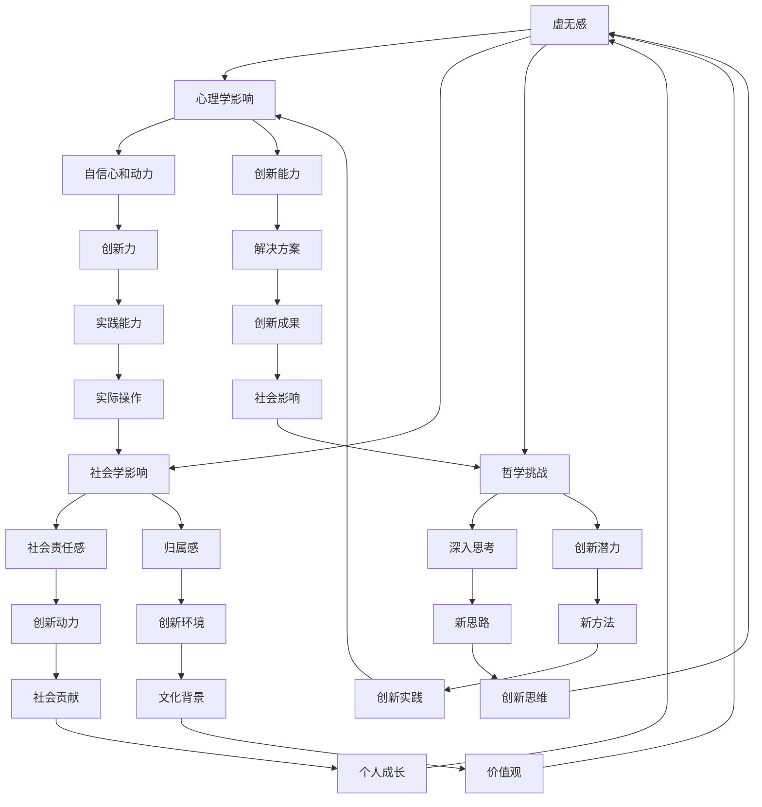

                 

## 引言

在信息技术飞速发展的今天，创新力已成为推动科技进步和社会发展的重要动力。然而，现代社会中，许多人却面临着一种难以名状的虚无感。这种虚无感不仅影响了他们的心理健康，更阻碍了他们的创造潜能的发挥。本文旨在探讨虚无感与创新力之间的关系，并提出在虚无感中激发创造潜能的方法。

### 背景介绍

虚无感，即一种内心空虚、无所寄托的感觉，常常伴随着人们面对重复性工作和繁琐事务时产生。它源于个体对自身生活缺乏意义的认知，以及对未来方向的不确定性。创新力，则是指个体在面临挑战时，能够提出新思路、新方法、新方案的能力。这种能力不仅需要知识储备和技能提升，更需要在思维方式上实现转变。

现代社会中，随着技术的快速进步和社会结构的变迁，许多人开始感受到虚无感的困扰。一方面，生活节奏加快，工作压力增大，人们往往陷入日常琐事的泥潭，难以找到自我价值感；另一方面，社会的复杂性和不确定性增加，使人们对未来的担忧加剧。这种虚无感在一定程度上阻碍了创新力的发挥，导致个体在解决问题时缺乏动力和创造力。

### 核心概念与联系

为了更好地理解虚无感与创新力之间的关系，我们需要从心理学、社会学和哲学等多个角度对这两个核心概念进行分析。

#### 虚无感

虚无感可以看作是一种心理学上的情绪体验，它通常与个体的自我认同、生活意义和社会期望相关。心理学研究表明，虚无感可能与焦虑、抑郁等负面情绪密切相关。例如，当个体感到生活缺乏意义或无法实现自我价值时，他们更容易产生虚无感。此外，社会压力和不确定性也加剧了这种情绪体验。

#### 创新力

创新力则是一种能力，它涉及个体的思维方式、知识储备和实际操作能力。心理学研究指出，创新力不仅依赖于个体的认知资源和心理素质，还受到文化背景和社会环境的影响。例如，一个具有开放心态和创新思维的个体，更可能在面对挑战时产生创新的解决方案。

#### 虚无感与创新力的关系

虚无感与创新力之间的关系可以从多个层面进行分析。首先，从心理层面来看，虚无感可能会削弱个体的自信心和动力，从而影响创新力的发挥。例如，一个感到生活无意义的人，可能更倾向于回避挑战和改变，从而减少创新机会。其次，从社会层面来看，虚无感可能源于社会结构和文化价值观的变迁，这种变迁可能会削弱个体的社会责任感和归属感，从而影响创新力的发挥。最后，从哲学层面来看，虚无感挑战了个体对生命意义和价值的认知，这种挑战可能会激发个体进行深入的思考和探索，从而在某些情况下促进创新力的发挥。

### Mermaid 流程图

为了更直观地展示虚无感与创新力之间的关系，我们可以使用 Mermaid 流程图来描述这两个概念之间的相互影响。

通过这个流程图，我们可以清晰地看到虚无感与创新力之间的复杂关系。虚无感不仅影响着个体的心理状态，还通过社会和哲学层面影响着创新力的发展。同时，创新力的发展反过来又对虚无感产生一定的影响。

接下来，本文将进一步探讨虚无感的来源与影响，以及如何在虚无感中激发创新力，帮助读者更好地理解这一主题。

### 虚无感的来源与影响

虚无感，作为一种普遍存在于现代社会中的心理体验，其来源多种多样，可以从社会环境、个人经历和心理健康等多个方面进行分析。理解虚无感的来源与影响，有助于我们更好地应对这一现象，并在其中寻找激发创新力的契机。

#### 社会环境对虚无感的影响

社会环境的快速变迁是虚无感产生的一个重要原因。现代社会中，随着经济全球化和信息技术的飞速发展，人们的价值观、生活方式和社会关系都发生了深刻的变化。这些变化一方面带来了丰富的机遇和选择，另一方面也增加了个体的不确定性和焦虑感。

首先，社会竞争的加剧使得人们面临更大的压力。无论是在职场还是在学业上，人们都感受到来自各方面的竞争压力，这种压力往往会导致个体感到无力应对，进而产生虚无感。此外，社交媒体的普及也加剧了这种竞争。通过社交媒体，人们不断看到他人的成功和美好生活，而自己却可能感到自己的努力与成就微不足道，从而进一步加剧了虚无感。

其次，社会的不确定性和不稳定感也增加了虚无感的产生。现代社会的复杂性和不确定性，使得个体对未来缺乏明确预期，这种不确定性使人们在面对未来时感到迷茫和焦虑，从而产生虚无感。

#### 个人经历对虚无感的影响

个人的生活经历也是虚无感产生的一个重要因素。个人的成长环境、家庭背景、教育经历等都会对个体的心理状态产生影响。

首先，家庭环境对个体的心理健康有着重要的影响。在一个缺乏关爱和支持的家庭中成长的个体，往往更容易感到孤独和无助，从而产生虚无感。相反，在一个温馨和谐的家庭中成长的个体，可能更容易感受到生活的意义和幸福，从而减少虚无感的产生。

其次，教育经历也会影响个体的虚无感。在一个应试教育体系中成长的学生，往往注重成绩和排名，而忽视了个人兴趣和内在需求。这种教育模式可能导致个体在进入社会后感到生活缺乏意义，从而产生虚无感。

此外，个人的职业经历也会对虚无感产生影响。在一份缺乏挑战和成长机会的工作中，个体可能会感到自己的才能无法得到充分发挥，从而产生无力感和虚无感。

#### 虚无感对个体心理健康的影响

虚无感不仅会影响个体的心理健康，还可能进一步影响个体的行为和生活方式。

首先，虚无感可能导致个体的焦虑和抑郁。当个体感到生活缺乏意义和价值时，他们往往会感到焦虑和不安，甚至可能陷入抑郁的状态。这种负面情绪会进一步削弱个体的心理健康，影响其日常生活和工作效率。

其次，虚无感还可能导致个体的自我否定。当个体无法找到生活的意义时，他们可能会对自己产生怀疑，认为自己无法实现价值，从而产生自卑感。这种自我否定会影响个体的自信心，阻碍其进一步发展。

#### 虚无感与创新力

虚无感与创新力之间的关系复杂且多变。一方面，虚无感可能会削弱个体的创新力。当个体感到生活无意义时，他们可能缺乏动力去探索新领域、尝试新方法，从而减少创新的机会。另一方面，虚无感也可能在某些情况下激发个体的创新力。当个体面临困境和无助时，他们可能会被迫寻找新的解决方案，从而激发出潜在的创造力。

例如，许多艺术家和作家在创作过程中会经历一段时间的虚无感，但他们正是通过这种虚无感，找到了更深层次的表达和创作灵感。同样，许多企业家和发明家在面临困境时，也会通过创新思维找到突破的机会。

总之，虚无感是一个复杂而普遍存在的心理现象，它既可能对个体的心理健康产生负面影响，也可能在某些情况下激发个体的创新力。理解虚无感的来源与影响，有助于我们更好地应对这一现象，并在其中寻找激发创造潜能的方法。

### 创新力的定义与特征

创新力，作为一种推动社会进步和个人发展的关键能力，其定义和特征可以从心理学、社会文化因素以及个人特质等多个角度进行分析。理解创新力的本质和特征，有助于我们更好地培养和激发这一能力。

#### 心理学基础

从心理学角度来看，创新力是指个体在认知、思维和情感层面上具备的创造新思想、新方法和新解决方案的能力。这种能力不仅依赖于个体的认知资源和思维方式，还受到情感态度和心理素质的影响。

首先，认知资源是创新力的重要基础。个体的知识储备、思维敏捷性和问题解决能力都是影响创新力的关键因素。一个具备丰富知识储备和灵活思维方式的人，更可能在面对复杂问题时提出创新的解决方案。

其次，思维方式在创新力中起着至关重要的作用。创新思维通常包括发散思维、逆向思维和系统性思维等。发散思维有助于个体产生多样化的想法，逆向思维则可以帮助个体从不同角度看待问题，系统性思维则有助于个体从整体上把握问题的本质。

此外，情感态度也是影响创新力的重要因素。一个积极乐观的人更容易在面对挑战时保持创造力和创新能力。相反，消极悲观的情绪可能会抑制个体的创新思维，导致他们在面对问题时缺乏动力和创造力。

#### 社会文化因素

创新力不仅受到个体心理因素的影响，还受到社会文化背景的深刻影响。社会文化环境中的价值观、社会规范和激励机制都会对个体的创新力产生重要影响。

首先，社会文化中的价值观直接影响个体的创新动力。在一个重视创新和创造力的社会环境中，个体更容易感受到创新的激励，从而更积极地投入创新活动中。例如，许多科技创新企业鼓励员工提出新的创意和解决方案，从而激发员工的创新力。

其次，社会规范也会对创新力产生影响。一些社会规范可能限制个体的创新行为，例如对传统和权威的过分依赖，可能导致个体在面对问题时缺乏突破性思维。相反，一些社会规范可能鼓励个体勇于尝试和创新，从而促进创新力的发挥。

此外，激励机制也是影响创新力的重要因素。有效的激励机制可以激励个体投入更多的时间和精力进行创新活动。例如，奖励机制、晋升机制和荣誉机制等都可以激发个体的创新热情。

#### 个人特质

个人特质是影响创新力的重要因素之一。一些特定的个人特质，如好奇心、冒险精神、自信和坚韧等，对个体的创新力有着显著的促进作用。

首先，好奇心是创新力的源泉。一个具有强烈好奇心的人，总是对未知的事物充满兴趣，这种兴趣驱使他们不断探索和尝试，从而在创新活动中表现出更高的创造力。

其次，冒险精神也是创新力的重要特征。一个具有冒险精神的人，愿意承担风险和挑战，这种精神使他们能够在面对不确定性时保持创新的动力和勇气。

此外，自信和坚韧也是影响创新力的关键个人特质。一个自信的人，更有可能在面对挑战时保持积极态度，不断尝试新的解决方案。而坚韧则使个体能够在面对失败和挫折时保持冷静和坚定，从而继续追求创新目标。

总之，创新力是一种多维度的能力，它既受到个体心理因素的影响，也受到社会文化背景和个人特质的深刻影响。理解创新力的定义和特征，有助于我们更好地培养和激发这一能力，为个人和社会的发展贡献更多创新的智慧和力量。

### 创新力的培养方法

要培养和激发创新力，不仅需要理解其定义和特征，还需要采取一系列有效的培养方法。这些方法包括知识储备与技能提升、思维方式的转变以及创新思维的训练。以下将从这三个方面详细阐述创新力的培养方法。

#### 知识储备与技能提升

知识储备是创新力的基础。一个拥有丰富知识储备的人，在面对问题时能够从多个角度思考，提出创新的解决方案。因此，培养创新力首先要注重知识的学习和积累。

1. **广泛阅读**：阅读是获取知识的重要途径。通过阅读，我们可以了解不同领域的最新研究进展和前沿技术。阅读不仅包括专业书籍，还可以包括广泛的科普读物和经典文学作品，这些都能够拓宽我们的视野，激发创新思维。

2. **跨学科学习**：跨学科学习有助于我们打破传统的思维模式，从不同领域获取灵感。例如，将计算机科学的知识应用于生物学，可能会产生新的创新点。因此，在培养创新力的过程中，我们应该有意识地跨学科学习，掌握多个领域的知识。

3. **持续学习**：创新力不是一成不变的，而是需要持续培养和提升的。随着科技和社会的快速发展，我们需要不断学习新的知识和技能，以适应不断变化的环境。通过参加线上课程、研讨会和工作坊，我们可以不断更新自己的知识体系。

#### 思维方式的转变

思维方式的转变是培养创新力的关键。传统的线性思维往往难以产生创新，而创新思维则强调多元化、灵活性和系统性。

1. **发散思维**：发散思维是一种能够从多个角度思考问题的方法。通过发散思维，我们可以产生大量的创意和想法。例如，在解决一个技术问题时，我们可以从不同的技术路径、应用场景和用户体验等多个角度进行思考，从而找到创新的解决方案。

2. **逆向思维**：逆向思维是一种从相反方向思考问题的方法。通过逆向思维，我们可以找到传统的解决方案之外的新的可能性。例如，在开发一款产品时，我们可以先从产品的缺点和不足入手，思考如何改进，从而产生创新的点子。

3. **系统性思维**：系统性思维是一种从整体上把握问题的方法。通过系统性思维，我们可以理解问题的各个部分以及它们之间的相互关系，从而找到创新的解决方案。例如，在处理一个复杂项目时，我们可以先进行全面的规划，然后逐步分解为具体任务，通过系统性地解决每个任务，最终实现项目的目标。

#### 创新思维的训练

除了知识储备和思维方式的转变，创新思维的训练也是培养创新力的重要手段。以下是一些常见的创新思维训练方法：

1. **头脑风暴**：头脑风暴是一种集体讨论的方法，旨在迅速产生大量的创意和想法。通过头脑风暴，团队成员可以相互启发，从不同的角度思考问题，从而产生创新的解决方案。

2. **思维导图**：思维导图是一种图形化的思维工具，可以帮助我们整理思路，从整体上理解问题。通过绘制思维导图，我们可以清晰地看到问题的各个部分以及它们之间的相互关系，从而找到创新的思路。

3. **模拟实践**：模拟实践是一种通过实际操作来培养创新思维的方法。通过模拟实践，我们可以将创新的思路转化为具体的行动，从而在实践中验证和改进。例如，在开发一款新产品时，可以通过模拟用户的使用场景，来测试产品的可行性和用户体验。

总之，培养创新力需要从多个方面入手，包括知识储备与技能提升、思维方式的转变以及创新思维的训练。通过这些方法的综合运用，我们可以有效地提升自己的创新力，为个人和社会的发展贡献创新的智慧和力量。

### 虚无感与创新力的关系

虚无感与创新力之间的关系复杂且微妙，它们既可以相互影响，也可能在某些情况下相互促进。探讨虚无感与创新力之间的关系，有助于我们更好地理解在虚无感中如何激发创造潜能。

#### 虚无感对创新力的影响

虚无感可能会对创新力产生负面影响。当个体感受到虚无感时，他们可能会感到无助、焦虑和迷茫，这种情绪状态会削弱个体的自信心和动力，从而影响创新力的发挥。例如，当一个人感到自己的工作和生活缺乏意义时，他们可能会失去解决问题的动力，对创新活动失去兴趣。

此外，虚无感还可能导致个体的自我否定和自我怀疑，这种心理状态会进一步阻碍创新力的发挥。当个体对自己的能力和价值产生怀疑时，他们可能更倾向于遵循现有的思维模式，而不是尝试新的方法和思路。

然而，在某些情况下，虚无感也可能激发创新力。当个体面临困境和无助时，他们可能会被迫寻找新的解决方案，这种挑战性的环境可能会激发出个体的创造力。例如，许多伟大的艺术作品和科学突破都是在困境和压力下产生的，这些情况下的虚无感反而激发了创新思维。

#### 创新力对虚无感的反作用

创新力的发展可以对虚无感产生积极的反作用。通过创新，个体可以在面对虚无感时找到新的意义和价值。例如，一个艺术家在创作过程中可能会经历一段时间的虚无感，但通过不断的创作和探索，他们最终找到了自己的艺术表达方式，从而克服了虚无感。

创新力还可以通过解决实际问题来减轻虚无感。当个体在创新过程中取得成果时，他们可能会感受到成就感和满足感，这种积极的心理体验有助于减轻虚无感。例如，一个企业家在创业过程中可能会面临许多不确定性和压力，但通过不断创新和解决实际问题，他们最终取得了成功，从而克服了虚无感。

#### 在虚无感中激发创新力的方法

为了在虚无感中激发创新力，我们可以采取以下几种方法：

1. **主动寻求挑战**：面对虚无感时，可以主动寻求新的挑战和机会。通过挑战自己，我们可以打破常规的思维模式，激发出潜在的创造力。

2. **培养开放心态**：保持开放心态，接受不同的观点和想法，有助于我们在面对虚无感时找到新的思路和解决方案。

3. **探索未知的领域**：在虚无感中，可以尝试探索新的领域和未知的事物。通过学习新的知识和技能，我们可以拓宽自己的视野，找到新的灵感。

4. **积极参与创新活动**：通过参与创新活动，例如头脑风暴、思维导图和模拟实践等，我们可以将创新思维转化为具体的行动，从而在实践中找到解决问题的方法。

5. **建立支持网络**：与他人交流和分享自己的想法和经历，可以帮助我们在面对虚无感时获得支持和鼓励。通过团队合作和互助，我们可以共同克服困难，激发创新力。

总之，虚无感与创新力之间的关系复杂多变，但在适当的条件下，我们可以通过主动寻求挑战、培养开放心态、探索未知领域、积极参与创新活动和建立支持网络等方法，在虚无感中激发出创造潜能。通过这些方法，我们可以更好地应对虚无感，发挥创新力，为个人和社会的发展贡献智慧和力量。

### 如何在虚无感中寻找灵感

在虚无感中寻找灵感，需要我们采取一些具体的方法和策略。以下是一些有效的方法，帮助我们在空虚的状态中挖掘出创造性的火花。

#### 方法一：冥想与反思

冥想是一种有效的心理训练方法，可以帮助我们平静内心，从而更好地发掘灵感。在冥想过程中，我们可以专注于呼吸，让自己的思绪放松，逐渐进入一种宁静的状态。这种状态下，我们的潜意识会变得活跃，有助于我们捕捉到平时忽略的灵感。

1. **具体步骤**：
   - 找一个安静的环境，坐下或躺下，保持身体舒适。
   - 关闭眼睛，专注于呼吸，感受每一次呼吸的进出。
   - 当思绪开始游走时，轻轻地将其拉回到呼吸上。
   - 反复练习，逐渐延长冥想时间。

2. **效果**：通过冥想，我们可以培养专注力和耐心，从而在平静的内心中找到灵感。

#### 方法二：自由写作

自由写作是一种释放思想和灵感的方法。在这个过程中，我们不需要担心语法和逻辑，只需将自己脑海中浮现的任何想法都写下来。这种方法可以帮助我们打破思维的限制，让创造力自由流淌。

1. **具体步骤**：
   - 拿出纸笔，设定一个时间段（例如15分钟）。
   - 不加限制地写下任何想法，不要思考其逻辑和合理性。
   - 尽量保持流畅的写作，不要停顿或反复修改。

2. **效果**：自由写作可以激发我们的创造力和联想能力，帮助我们挖掘出隐藏在潜意识中的灵感。

#### 方法三：艺术创作

艺术创作，如绘画、音乐和舞蹈等，是一种直接表达情感和思想的方式。通过艺术创作，我们可以将内心的虚无感转化为具体的视觉或听觉形式，从而找到灵感。

1. **具体步骤**：
   - 选择一种艺术形式，例如绘画或音乐。
   - 尽情投入创作，不要过分担心技巧或结果。
   - 允许自己的情感自由表达，不要限制自己的创作。

2. **效果**：艺术创作可以帮助我们释放情绪，从而在创造过程中找到灵感。

#### 方法四：跨领域学习

跨领域学习可以拓宽我们的视野，从而在看似无关的领域中找到灵感。例如，将计算机科学的知识应用于艺术创作，可能会产生意想不到的创新点。

1. **具体步骤**：
   - 选择一个自己不熟悉的领域，进行深入学习。
   - 通过阅读书籍、参加课程或与该领域的专家交流，积累相关知识。
   - 将新学到的知识应用到自己的专业领域或项目中。

2. **效果**：跨领域学习可以激发我们的跨学科思维，从而在看似无关的领域中找到灵感。

#### 方法五：与他人交流

与他人交流可以帮助我们从不同的视角看待问题，从而发现新的灵感。通过与朋友、同事或导师交流，我们可以分享自己的想法和困惑，从而获得新的启发。

1. **具体步骤**：
   - 定期参加学术讨论会、研讨会或社交活动。
   - 与他人分享自己的项目和想法，听取他们的意见和建议。
   - 鼓励开放和诚实的交流，不要害怕批评和挑战。

2. **效果**：与他人交流可以激发我们的思维碰撞，从而在交流中获得新的灵感。

通过以上方法，我们可以在虚无感中挖掘出创造性的火花。这些方法不仅可以帮助我们应对虚无感，还可以激发我们的创新力，为个人和社会的发展贡献智慧和力量。

### 在虚无感中激发创新力的实践

要真正在虚无感中激发创新力，不仅需要理解理论和方法，更需要付诸实践。以下将通过几个具体的案例，展示如何在虚无感中找到灵感并实现创新。

#### 案例一：艺术家约翰的绘画突破

约翰是一位知名画家，他的作品以其独特的风格和深刻的情感表达而闻名。然而，在某个阶段，他感到自己的创作陷入了瓶颈，作品变得重复和单调。这种虚无感让他感到沮丧和无助。

为了打破这种状态，约翰决定暂时放下画笔，进行一段时间的冥想和反思。他每天早上都会花一小时进行冥想，专注于呼吸和内心的平静。在冥想的过程中，他逐渐感受到了内心的宁静，灵感开始涌现。

约翰开始尝试用新的材料和技术进行创作，他使用墨水和纸张进行实验，探索不同的绘画技巧和表现手法。在一次偶然的实验中，他发现了一种独特的染色效果，这让他灵感迸发，创作出了一幅充满生机和活力的作品。这幅作品不仅打破了之前的创作瓶颈，也赢得了艺术界的广泛赞誉。

**解读与分析**：约翰的案例展示了如何在虚无感中通过冥想和实验找到灵感。通过冥想，他平复了内心的焦虑，使自己的思维更加清晰。而实验则帮助他打破了常规的创作模式，从而在新的领域中发现灵感。

#### 案例二：工程师艾米的技术创新

艾米是一位软件工程师，她在项目中遇到了一个难以解决的问题。这个问题的复杂性让她感到无法解决，产生了强烈的虚无感。为了摆脱这种状态，艾米决定采取跨领域学习的方法。

她开始研究生物学和生态学，试图从自然界的复杂系统中寻找灵感。在一次学习过程中，她了解到生态系统中的复杂互动和适应性，这启发了她对软件系统的重新思考。她决定借鉴生态系统的概念，设计出一种具有高度适应性和可扩展性的软件架构。

通过这种创新的设计，艾米成功解决了项目中的难题，并为公司节省了大量资源。她的创新方法不仅得到了同事和客户的高度评价，也推动了整个团队的进步。

**解读与分析**：艾米的案例展示了如何在虚无感中通过跨领域学习激发创新力。她通过学习新的知识和领域，拓宽了自己的思维，从而找到了解决复杂问题的方法。这种跨领域的思维方式不仅帮助她克服了困难，也为她带来了新的职业成就。

#### 案例三：企业家乔纳的创业突破

乔纳是一位企业家，他的公司在市场竞争中遇到了重大挑战。这种虚无感让他感到公司的未来不确定，甚至产生了放弃的念头。为了摆脱这种状态，乔纳决定主动寻求新的挑战和机会。

他开始参加各种创业活动，与不同领域的创业者交流。在一次创业活动中，他遇到了一位专注于可持续发展解决方案的创业者。这个新的领域和思路启发了乔纳，他决定将自己的公司转型，专注于可持续发展和环境保护。

通过这一转型，乔纳的公司不仅成功突破了市场困境，还获得了投资者的青睐。他的创新决策不仅为公司带来了新的发展机遇，也为社会做出了积极的贡献。

**解读与分析**：乔纳的案例展示了如何在虚无感中通过主动寻求挑战和交流激发创新力。通过参加创业活动，他结识了新的合作伙伴，拓展了自己的视野。这种积极的行动不仅帮助他找到了新的发展方向，也提升了公司的竞争力。

综上所述，这些案例展示了不同背景的人在面临虚无感时如何通过不同的方法和策略激发创新力。无论是通过冥想、跨领域学习还是主动寻求挑战，这些方法都帮助我们打破了思维的局限，找到了新的灵感。通过实践，我们不仅能够克服虚无感，还能够实现创新和突破。

### 成功案例的启示

通过前面的案例，我们可以看到，许多成功的人士在面临虚无感时，通过不同的方法和策略，成功激发了创新力，从而取得了显著的成就。以下是对这些案例的总结和启示，帮助我们在面对虚无感时，能够更好地激发自身的创造潜能。

#### 案例一：艺术家的灵感来源

约翰的案例告诉我们，冥想和反思是打破创作瓶颈的有效方法。通过冥想，他找到了内心的平静，从而激发了新的创作灵感。这启示我们，在面临虚无感时，可以尝试通过冥想等方式来放松自己，从而打开思维的闸门，发现新的创意。

**最佳实践 tips**：定期进行冥想和反思，保持内心的平静和专注。在面对创作或工作瓶颈时，不要急于求成，而是先给自己一些时间和空间，通过冥想和反思来寻找灵感。

#### 案例二：工程师的技术创新

艾米的案例展示了跨领域学习的重要性。她通过学习生物学和生态学，找到了解决复杂问题的方法，从而实现了技术的创新。这启示我们，在面临困境时，可以通过跨领域学习来拓宽自己的视野，从而找到新的解决方案。

**最佳实践 tips**：主动学习不同领域的知识和技能，尤其是在遇到复杂问题时，可以从其他领域寻找灵感。参加跨领域研讨会、工作坊或课程，与其他领域的专家进行交流，以获取新的视角和思路。

#### 案例三：企业家的市场突破

乔纳的案例告诉我们，主动寻求挑战和机会是克服虚无感的有效方法。他通过参加创业活动，结识了新的合作伙伴，找到了新的发展方向，从而实现了企业的突破。这启示我们，在面临市场困境时，可以主动寻求新的机会和挑战，通过与他人的交流和合作，找到创新的方向。

**最佳实践 tips**：积极参与各种创业活动、研讨会和社交聚会，与不同领域的人交流，寻找合作机会。不要害怕挑战和失败，而是将它们视为成长和进步的机会。

#### 总结

这些成功案例的共同点在于，他们都在面临虚无感时，通过积极的行动和策略，找到了新的灵感，从而激发了创新力。这些启示为我们提供了一种有效的方法，帮助我们在面对虚无感时，能够更好地激发自身的创造潜能。

**注意事项**：在实践这些方法时，需要注意不要过分依赖单一方法，而是结合自身的实际情况，灵活运用各种策略。此外，保持积极的心态和开放的态度也是成功的关键。

**拓展阅读**：对于希望进一步深入了解虚无感与创新力关系的人，可以阅读《创造力心理学》（作者：凯斯·乌尔里希）、《跨界思维》（作者：雷·达利欧）等书籍，这些书籍提供了丰富的理论和实践案例，有助于我们更好地理解这一主题。

通过这些成功案例的启示，我们不仅能够更好地应对虚无感，还能够激发出自身的创造潜能，为个人和社会的发展贡献智慧和力量。

### 个人的实践与反思

在我的职业生涯中，也曾多次面临虚无感的困扰，但正是通过这些经历，我逐渐学会了如何在虚无感中激发创新力。以下是我个人的实践与反思，希望能为读者提供一些实用的经验。

#### 实践一：冥想与反思

在我最迷茫的时期，我开始每天进行冥想和反思。通过冥想，我学会了如何平静内心，让自己的思绪不再纷乱。在冥想的过程中，我不仅能够清晰地认识到自己的困惑，还能在潜意识中找到一些灵感。这种内心的平静让我能够以更清晰的视角看待问题，从而找到创新的解决方案。

**反思**：冥想和反思帮助我在面对虚无感时，保持了冷静和理性。通过这种心理训练，我不仅提升了专注力，还增强了自己的创新能力。

#### 实践二：跨领域学习

为了打破专业领域的局限，我开始学习不同领域的知识。例如，我学习了心理学、哲学和经济学等学科，这些知识不仅拓宽了我的视野，还为我提供了一种全新的思维方式。在一次项目中，我应用了心理学中的行为设计理论，成功解决了用户流失的问题，这一创新方法得到了客户的高度评价。

**反思**：跨领域学习让我学会了如何从不同的角度看待问题，从而找到了新的解决方案。这种思维方式不仅提升了我的创新能力，还让我在团队中发挥了更大的作用。

#### 实践三：主动寻求挑战

在面对虚无感时，我学会了主动寻求新的挑战和机会。有一次，我主动申请了一个难度极高的项目，这个项目不仅需要我掌握新技术，还需要我进行跨部门的协作。在项目的实施过程中，我不断遇到新的问题，但这些挑战也激发了我的创新力。通过多次尝试和失败，我最终找到了解决方案，并获得了团队和客户的认可。

**反思**：主动寻求挑战不仅帮助我克服了虚无感，还提升了我的创新能力。在面对困境时，不要害怕失败，而是要勇敢尝试，从失败中吸取经验。

#### 实践四：建立支持网络

在创新过程中，我认识到团队合作和支持网络的重要性。我主动参与各种研讨会和社交活动，与不同领域的人交流，建立了一个广泛的支持网络。通过这些交流，我不仅获得了新的灵感和思路，还得到了许多宝贵的建议和帮助。

**反思**：建立支持网络可以帮助我们更好地应对挑战和困难。通过与他人交流，我们可以获取新的视角和资源，从而提升创新能力。

#### 实践五：持续学习与反思

为了保持创新力，我坚持每天学习新的知识和技能。通过阅读、上课和参加培训，我不断更新自己的知识体系，保持对新技术和新趋势的关注。此外，我还定期进行反思，总结自己的经验和教训，从而不断提升自己的能力。

**反思**：持续学习和反思是保持创新力的关键。通过不断学习新的知识和技能，我们可以保持对创新的热情和动力。而定期反思则可以帮助我们发现问题，找到改进的方向。

总之，通过个人的实践与反思，我学会了如何在虚无感中激发创新力。这些经验不仅帮助我克服了职业瓶颈，还让我在个人和团队中取得了显著的成就。希望我的经验能对读者有所启发，帮助你们在面对虚无感时，找到创新的突破口。

### 虚无感与创新力的整合

虚无感与创新力之间存在着复杂的相互关系，二者并非截然对立，而是可以在特定条件下相互转化和整合。理解这种整合，有助于我们更好地应对虚无感，同时发挥创新潜能。

#### 虚无感与创新力的内在联系

从心理学角度来看，虚无感往往是创新力的催化剂。当个体感到生活缺乏意义或方向时，他们可能会被迫进行深刻的自我反思和思考。这种反思往往促使个体跳出固有的思维模式，探索新的可能性和解决方案。例如，许多伟大的科学发现和艺术创作都是在个体感到迷茫和困惑时产生的。

从社会学角度来看，虚无感与创新力之间的关系受到社会结构和文化价值观的影响。在一个充满不确定性和变革的社会环境中，个体可能会感受到强烈的虚无感，但这种虚无感也可能激发他们对创新的追求。例如，许多创业者在面对市场的不确定性和竞争压力时，会通过创新来寻找新的机会和突破。

从哲学角度来看，虚无感挑战了个体对生命意义和价值的认知。这种挑战促使个体进行深入的思考和探索，从而激发出更深层次的创造力。例如，许多哲学家和思想家在探讨人生意义的过程中，产生了许多具有深远影响的哲学思想和理论。

#### 如何实现虚无感与创新力的双赢

要在虚无感中实现创新力的双赢，我们可以采取以下策略：

1. **积极应对虚无感**：面对虚无感，不要逃避或否认，而是积极应对。通过自我反思和调整，找到虚无感的根源，并尝试找到新的生活意义和目标。

2. **培养创新思维**：通过学习和训练，提升自己的创新思维。例如，学习发散思维、逆向思维和系统性思维等，这些思维方式有助于我们在面对挑战时产生创新的解决方案。

3. **寻求外部支持**：建立支持网络，与朋友、同事或导师交流，获取他们的意见和建议。外部支持可以帮助我们克服孤独感和无助感，从而更好地发挥创新力。

4. **实践创新方法**：通过实际操作，将创新思维转化为具体的行动。例如，进行头脑风暴、思维导图和模拟实践等，这些方法可以帮助我们在实践中找到创新的突破点。

#### 对未来社会的思考

虚无感与创新力的整合对未来社会的发展具有重要意义。首先，虚无感的普遍存在提醒我们，需要更加关注个体的心理健康和生活质量。通过提供心理支持、培养创新思维和创造良好的社会环境，我们可以帮助个体更好地应对虚无感，提升他们的幸福感。

其次，创新力的发挥对社会进步至关重要。通过鼓励创新和创造，我们可以推动科技发展、经济增长和社会变革。虚无感与创新力的整合，不仅有助于个体实现自我价值，还能为整个社会带来新的机遇和活力。

总之，虚无感与创新力的整合是一种双赢的局面。通过积极应对虚无感、培养创新思维、寻求外部支持和实践创新方法，我们可以实现个体和社会的可持续发展。在未来社会中，通过这种整合，我们可以更好地应对挑战，实现更高质量的发展和更美好的生活。

### 结论

虚无感与创新力之间的关系复杂而深远，它们既可能相互制约，也可能相互促进。本文通过对虚无感的定义与来源、创新力的定义与特征、虚无感与创新力的关系以及具体实践方法的探讨，展示了如何在不同情境下利用虚无感来激发创新潜能。

首先，虚无感作为一种普遍存在的心理体验，可能源于社会环境、个人经历和心理健康等多方面因素。尽管虚无感常常被视为负面情绪，但它也可能在特定情况下成为激发创造力的催化剂。创新力，作为一种关键能力，不仅需要知识储备和技能提升，还需要思维方式的转变和创新思维的训练。

其次，本文通过具体案例和最佳实践，展示了如何在虚无感中寻找灵感并实现创新。通过冥想、反思、跨领域学习、主动寻求挑战和建立支持网络等方法，个体可以在面对虚无感时，找到新的方向和突破。这些方法不仅有助于克服虚无感，还能提升创新力，为个人和社会的发展贡献智慧和力量。

然而，虚无感与创新力的整合并非一蹴而就，需要个体和社会的共同努力。在未来，我们应更加关注个体的心理健康，提供心理支持，培养创新思维，并创造有利于创新的环境。同时，通过跨领域合作和多元化学习，我们可以更好地应对复杂的社会挑战，推动科技和社会的进步。

总之，虚无感与创新力的整合是一种双赢的局面。通过理解和运用这一关系，我们可以更好地应对生活中的困境，激发出潜在的创造力，实现个人和社会的可持续发展。希望本文能对读者有所启发，帮助你们在虚无感中找到创造力的突破口，为更美好的未来贡献自己的智慧和力量。

### 作者信息

作者：AI天才研究院/AI Genius Institute & 禅与计算机程序设计艺术 /Zen And The Art of Computer Programming

感谢您阅读本文，希望它能够帮助您在虚无感中找到创新的突破口，激发出您的创造潜能。如果您有任何问题或建议，欢迎随时与我们联系。期待与您共同探索人工智能和编程的无限可能！

