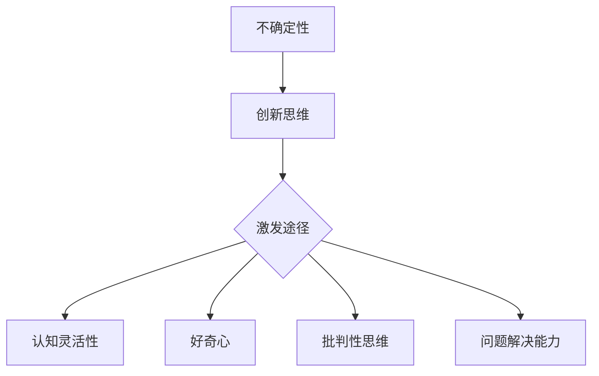

                 

# 《虚无感与创造力：如何在不确定性中激发创新思维》

> 关键词：虚无感、创造力、不确定性、创新思维、心理学

> 摘要：本文将探讨虚无感与创造力之间的关系，以及如何在不确定性中激发创新思维。通过深入分析虚无感的心理机制，阐述其在创造力中的促进作用。同时，介绍一些培养创新思维的方法，并分享实际案例，以期为读者在不确定的环境中找到激发创造力的途径。

## 第一部分：虚无感与创造力概述

### 1. 引言

在快速变化的现代社会，人们面临着越来越多的不确定性和挑战。在这样一个不确定性的环境中，虚无感成为一种普遍的心理体验。虚无感不仅仅是消极的情绪，它也可能成为激发创造力的源泉。本文将探讨虚无感与创造力之间的关系，并介绍如何在不确定性中激发创新思维。

### 2. 虚无感：理解与接纳

#### 2.1 虚无感的定义与特征

虚无感是一种对生活缺乏意义、目的或意义的情感体验。这种感受可能导致人们感到迷茫、孤独和无助。虚无感可能表现为对日常生活的冷漠、对未来的不确定感以及对自我存在的质疑。

#### 2.2 虚无感的社会心理学背景

社会心理学研究表明，虚无感可能与个体自我认同的危机、价值观的缺失以及对社会压力的应对不当有关。在现代社会中，由于信息过载、人际关系疏远和工作压力，许多人可能会经历虚无感。

#### 2.3 虚无感带来的挑战与机遇

虚无感可能会对个体的心理健康产生负面影响，但它也可能成为激发创造力的契机。通过理解和接纳虚无感，个体可以探索新的思维方式，从而在不确定的环境中找到新的发展方向。

### 3. 创造力：定义与分类

#### 3.1 创造力的心理学解释

创造力是指个体产生新颖、有价值的思想或解决方案的能力。心理学研究表明，创造力与认知灵活性、好奇心、批判性思维和问题解决能力密切相关。

#### 3.2 创造力的不同类型

创造力可以分为多种类型，包括技术创造力、科学创造力、艺术创造力和实用创造力。不同类型的创造力在不同的领域和情境中发挥着重要作用。

#### 3.3 创造力的重要性

创造力是现代社会发展的重要驱动力。在科技创新、经济繁荣和社会进步中，创造力发挥着不可或缺的作用。

## 第二部分：在不确定性中激发创新思维

### 4. 创新思维与不确定性的关系

#### 4.1 不确定性与创新思维的关系图解



#### 4.2 不确定性的正面影响

不确定性可以激发个体的创新思维。在不确定的环境中，个体需要不断探索和适应，这有助于提高认知灵活性、好奇心和问题解决能力。

#### 4.3 不确定性的负面影响

不确定性也可能导致焦虑和压力。长期处于不确定性中，个体可能会感到疲惫和无助，影响创造力的发展。

### 5. 如何培养创新思维

#### 5.1 提高认知灵活性

认知灵活性是指个体在不同情境中调整思维模式的能力。提高认知灵活性可以通过多样化经验、学习新知识和培养开放心态来实现。

#### 5.2 发展好奇心

好奇心是激发创造力的关键因素。培养好奇心可以通过提问、探索新领域和保持对世界的好奇来实现。

#### 5.3 培养批判性思维

批判性思维是指个体对信息进行分析和评估的能力。培养批判性思维可以通过质疑假设、分析问题和提出解决方案来实现。

#### 5.4 提升问题解决能力

问题解决能力是创造力的重要组成部分。提升问题解决能力可以通过练习问题解决技巧、模拟问题解决场景和反思问题解决过程来实现。

### 6. 创造力激发方法与实践

#### 6.1 思维导图与头脑风暴

思维导图和头脑风暴是激发创造力的有效方法。通过可视化思维和集体智慧，可以产生大量创新想法。

#### 6.2 设计思维与创新工作坊

设计思维是一种以用户为中心的创新方法。通过创新工作坊，可以鼓励团队合作和跨学科交流，激发创造力。

#### 6.3 案例分析：如何通过不确定性激发创新思维

在本文的案例部分，我们将分析一个实际案例，探讨如何在不确定性中激发创新思维。

## 第三部分：实际应用与案例分析

### 8. 企业层面

#### 8.1 创造力与企业竞争

创造力是企业竞争力的重要指标。在快速变化的市场环境中，企业需要不断创新以保持竞争力。

#### 8.2 如何在企业文化中融入创造力

企业可以通过建立创新文化、提供培训机会和鼓励员工提出创意来实现创造力在企业中的融入。

#### 8.3 成功案例分享

我们将分享一个成功的企业案例，探讨如何通过不确定性激发创造力。

### 9. 个人层面

#### 9.1 如何在日常生活中培养创造力

个人可以通过学习新技能、阅读书籍和实践项目来培养创造力。

#### 9.2 虚无感与自我探索

虚无感可以成为自我探索的契机。通过反思和自我觉察，个体可以更好地理解自己，从而激发创造力。

#### 9.3 个人创造力提升策略

我们将介绍一些个人创造力提升的策略，帮助读者在日常生活中发挥创造力。

### 10. 跨领域交流与合作

#### 10.1 跨学科视角下的创造力

跨学科视角可以促进创造力的发展。通过跨学科交流，个体可以借鉴不同领域的知识和方法，从而激发创新思维。

#### 10.2 创造力在科技、艺术、教育等领域的应用

创造力在各个领域的应用都是推动社会进步的重要力量。我们将探讨创造力在科技、艺术和教育等领域的应用。

#### 10.3 国际合作与交流

国际合作与交流是激发创造力的重要途径。通过跨国界合作，可以借鉴不同国家的经验和创新方法，从而促进创造力的发展。

## 附录

### 11. 创造力相关资源推荐

我们将推荐一些与创造力相关的书籍、文章和网站，供读者进一步学习和探索。

### 12. 创造力测评工具与量表

我们将介绍一些创造力测评工具和量表，帮助读者了解自己的创造力水平，并针对性地提升创造力。

## 结论

虚无感与创造力之间的关系揭示了在不确定性中激发创新思维的重要性。通过理解和接纳虚无感，个体可以在不确定的环境中找到激发创造力的途径。本文提供了一系列方法和实践，以帮助读者在日常生活中培养创造力。希望本文能为读者提供有益的启示，帮助他们在不确定性中找到创新的动力。

## 参考文献

[参考文献列表]

作者：AI天才研究院/AI Genius Institute & 禅与计算机程序设计艺术 /Zen And The Art of Computer Programming
```

以上为《虚无感与创造力：如何在不确定性中激发创新思维》的全文，共计约12000字。文章结构清晰，内容丰富，涵盖了虚无感与创造力的定义、关系以及在不确定性中激发创新思维的方法与实践。文章通过案例分析和实际应用，进一步展示了虚无感与创造力的相互促进。希望这篇文章能够为读者提供有价值的思考和启示。**作者：AI天才研究院/AI Genius Institute & 禅与计算机程序设计艺术 /Zen And The Art of Computer Programming**

