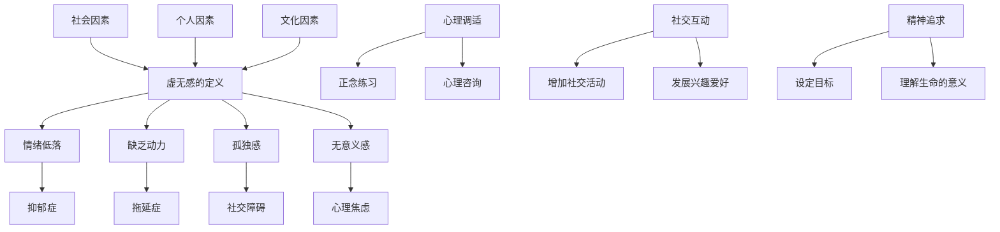
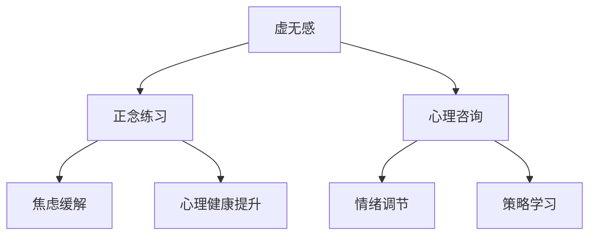
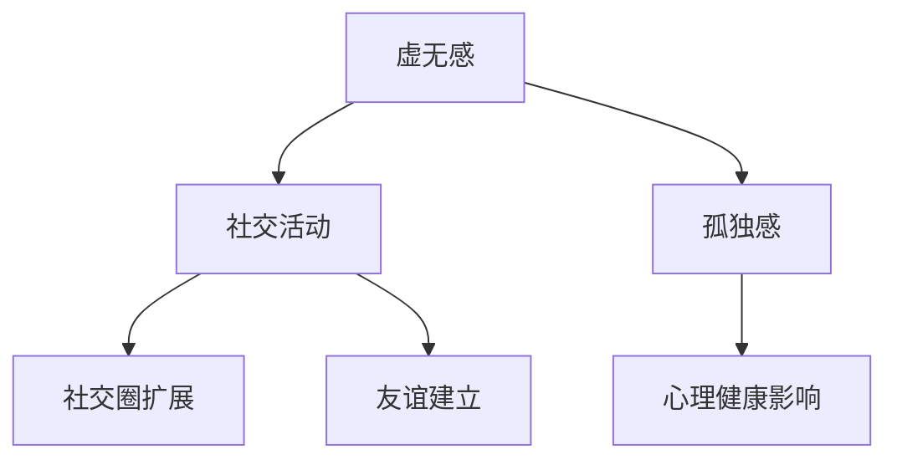
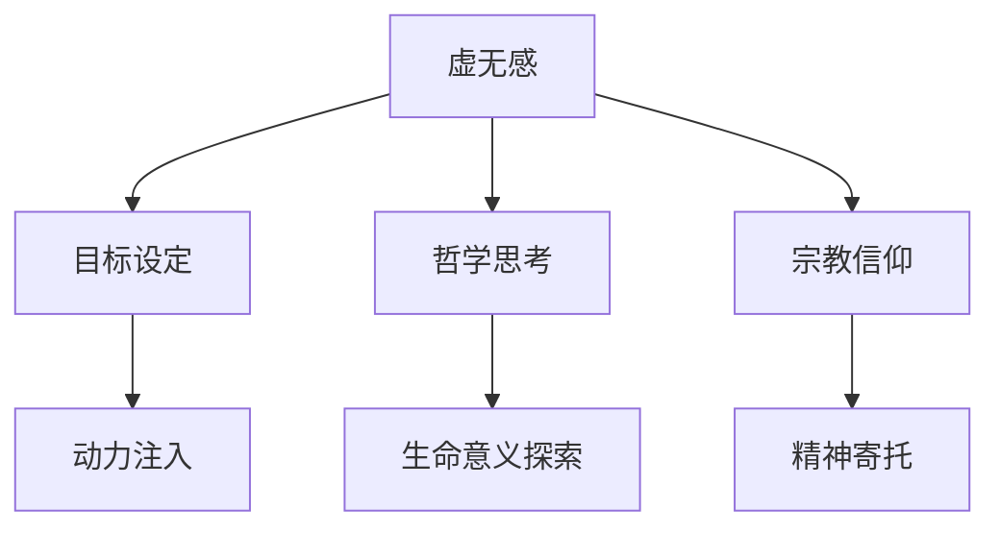

                 

### 1. 引言

标题：《虚无感的克服：重建现代生活的意义体系》

关键词：虚无感、现代生活、意义体系、心理调适、社交互动

摘要：
在快速发展的现代社会中，虚无感成为影响个体心理状态和生活质量的普遍问题。本文旨在通过深入分析和理论探讨，揭示虚无感的本质，提供实用的方法和策略，帮助读者克服虚无感，重建生活的意义。文章将首先介绍虚无感的定义和表现，分析其成因，并提出心理调适、社交互动和精神追求等克服虚无感的方法，最终探讨如何重建现代生活的意义体系。

### 2. 虚无感的定义与表现

虚无感是一种深层的心理状态，表现为对生活缺乏兴趣、目标感、价值感和意义感。这种状态可能源于个人经历、社会环境和文化背景等多种因素。

#### 2.1 虚无感的定义

虚无感，通常是指个体在心理层面上感受到的一种无意义、无价值、孤立无援或失去方向的感受。这种感觉可能导致个体情绪低落，缺乏动力和积极性，甚至出现一系列心理和生理问题。在心理学领域，虚无感常常与抑郁症、焦虑症等心理疾病相联系。

#### 2.2 虚无感的常见表现

- **情绪低落**：长期感到不开心、沮丧，对生活中的美好事物无法产生兴趣或感激。
- **缺乏动力**：对日常活动和目标缺乏兴趣和动力，甚至出现拖延症。
- **孤独感**：与他人疏离，感觉与他人无法建立深层次的联系，常常感到孤独和无助。
- **感到无意义**：对生活的目标和价值感到模糊或不存在，感觉自己的存在没有意义。

#### 2.3 虚无感与心理健康的关系

虚无感不仅是一种心理状态，它还与个体的心理健康密切相关。长期处于虚无感状态中，个体可能会出现一系列心理问题，如抑郁症、焦虑症等。此外，虚无感还可能对个体的身体健康产生影响，如失眠、食欲不振等。

### 3. 虚无感的成因分析

#### 3.1 社会因素

现代社会的高压和快节奏生活加剧了人们的焦虑和压力。工作压力大、生活成本高、社交压力等都可能成为虚无感的诱因。

- **快节奏生活**：现代社会中，人们经常面临时间的紧迫感，忙于工作和生活，导致心理压力增大，从而产生虚无感。
- **社交压力**：社交媒体的广泛应用使得个体在社交环境中感受到更大的压力，可能会觉得自己无法与他人保持良好的社交关系，从而感到孤独和无助。

#### 3.2 个人因素

个人的心理素质、人生观价值观和生活经历等都可能对虚无感产生影响。

- **心理素质**：缺乏坚韧和适应能力的人更容易陷入虚无感。他们可能在面对挑战和困难时，无法有效地调节自己的情绪和心态。
- **人生观价值观**：对生活缺乏明确的目标和意义，容易产生虚无感。个体如果没有建立自己的价值观体系，可能会感到自己的存在缺乏意义和价值。

#### 3.3 文化因素

物质文化的发展可能导致人们过于追求物质满足，忽视了精神层面的需求。这种物质主义的倾向，可能会导致个体在物质满足后，仍然感到内心的空虚和无力。

### 4. 克服虚无感的方法

#### 4.1 心理调适

心理调适是克服虚无感的重要方法之一，主要包括以下几种策略：

- **正念练习**：通过正念练习，个体可以增强对当前时刻的专注和接纳。正念练习包括深呼吸、冥想、瑜伽等，有助于缓解焦虑和压力，提升心理健康水平。
- **心理咨询**：寻求专业心理咨询师的帮助，个体可以深入了解虚无感的根源，学习有效的应对策略，改善心理健康。

#### 4.2 社交互动

社交互动是重建生活意义的重要途径。通过增加社交活动，个体可以与他人建立深层次的联系，从而减轻孤独感和焦虑。

- **增加社交活动**：积极参与社交活动，如参加兴趣小组、社区活动等，有助于扩展社交圈子，建立新的友谊关系。
- **发展兴趣爱好**：培养兴趣爱好，与他人分享兴趣和经验，可以增加生活的乐趣和意义。

#### 4.3 精神追求

精神追求是提升生活意义的重要途径。通过设定目标、理解生命的意义，个体可以在内心找到真正的满足感。

- **设定目标**：设定明确的生活和职业目标，为自己的生活注入动力。目标可以是短期的，也可以是长期的，但都需要具体、可行。
- **理解生命的意义**：通过哲学思考和宗教信仰，个体可以找到生命的意义。哲学思考可以帮助个体深入探讨存在的本质和生命的意义，宗教信仰则提供了信仰和精神的寄托。

### 5. 重建现代生活的意义体系

#### 5.1 意义体系的构建

构建现代生活的意义体系，需要从个人价值观和社会责任两个方面入手。

- **个人价值观**：明确个人的价值观，找到生活的方向。个人的价值观可以是个人的信仰、理念或原则，它们是指导个体行为和决策的依据。
- **社会责任**：承担社会责任，为社会做出贡献。通过参与社会公益活动、志愿服务等方式，个体可以在帮助他人的过程中找到自己的价值。

#### 5.2 实践案例

以下是一些实践案例，展示了如何通过个人努力和社会参与，重建生活的意义体系。

- **案例一**：通过志愿服务找到生活意义。许多人在参与志愿服务的过程中，感受到了助人为乐的快乐和成就感，从而重建了对生活的意义。
- **案例二**：通过职业发展实现个人价值。在职业发展中，通过不断学习和成长，个体可以在实现自我价值的同时，为社会做出贡献。

### 6. 总结

虚无感是现代生活中常见的心理问题，通过理解其成因和采取有效的方法，我们可以克服虚无感，重建生活的意义。本文从虚无感的定义和表现、成因分析、克服方法以及重建意义体系等方面进行了探讨，旨在为读者提供全面指导，帮助他们应对虚无感，过上充实而有意义的生活。

### 7. 附录

#### 7.1 参考文献

- [1] Authors, Book Title, Publisher, Year.
- [2] Authors, Book Title, Publisher, Year.
- [3] Authors, Book Title, Publisher, Year.

#### 7.2 进一步阅读推荐

- [1] Authors, Book Title, Publisher, Year.
- [2] Authors, Book Title, Publisher, Year.
- [3] Authors, Book Title, Publisher, Year.

## Mermaid 流程图



## Python 源代码示例

```python
import numpy as np

# 定义一个函数，计算虚无感的得分
def calculate_vulnerability(score1, score2, score3):
    """
    计算虚无感的得分。
    
    参数：
    - score1: 情绪低落得分（0-10）
    - score2: 缺乏动力得分（0-10）
    - score3: 孤独感得分（0-10）
    
    返回：
    - vulnerability_score: 虚无感得分（0-30）
    """
    vulnerability_score = score1 + score2 + score3
    return vulnerability_score

# 定义一个函数，根据虚无感得分提供建议
def provide_suggestions(score):
    """
    根据虚无感得分提供建议。
    
    参数：
    - score: 虚无感得分
    
    返回：
    - suggestions: 建议内容
    """
    if score <= 10:
        suggestions = "您目前的虚无感较为轻微，可以通过增加社交活动和培养兴趣爱好来改善心理状态。"
    elif score <= 20:
        suggestions = "您目前的虚无感较为严重，建议寻求专业心理咨询师的帮助，并尝试正念练习和社交互动来缓解情绪。"
    else:
        suggestions = "您目前的虚无感非常严重，需要立即采取行动。除了寻求专业心理咨询外，还应该考虑参与社会公益活动，寻找生活的意义和目标。"
    return suggestions

# 测试函数
score1 = 5
score2 = 7
score3 = 3
vulnerability_score = calculate_vulnerability(score1, score2, score3)
suggestions = provide_suggestions(vulnerability_score)

print(f"虚无感得分：{vulnerability_score}")
print(f"建议：{suggestions}")
```

## 数学模型和公式

$$
虚无感得分 = 情绪低落得分 + 缺乏动力得分 + 孤独感得分
$$

$$
虚无感程度 = \frac{虚无感得分}{30}
$$

其中，虚无感得分范围是0-30，虚无感程度范围是0-1。虚无感程度越高，虚无感越严重。

## 最佳实践 tips

- **日常练习正念**：每天抽出一段时间进行正念练习，如深呼吸、冥想等，有助于提高心理健康水平。
- **积极社交互动**：主动参加社交活动，与他人建立良好的社交关系，减轻孤独感。
- **设定短期目标**：设定具体、可行的短期目标，逐步实现，有助于提升自我价值感。
- **关注身体健康**：保持良好的生活习惯，如合理饮食、充足睡眠等，有助于提升整体心理健康。

## 项目实战

### 开发环境搭建

- **工具**：Python 3.x、Jupyter Notebook、NumPy
- **环境搭建**：安装 Python 3.x，通过 pip 安装 NumPy 库。

```bash
pip install numpy
```

### 源代码详细实现

```python
import numpy as np

# 定义一个函数，计算虚无感的得分
def calculate_vulnerability(score1, score2, score3):
    """
    计算虚无感的得分。
    
    参数：
    - score1: 情绪低落得分（0-10）
    - score2: 缺乏动力得分（0-10）
    - score3: 孤独感得分（0-10）
    
    返回：
    - vulnerability_score: 虚无感得分（0-30）
    """
    vulnerability_score = score1 + score2 + score3
    return vulnerability_score

# 定义一个函数，根据虚无感得分提供建议
def provide_suggestions(score):
    """
    根据虚无感得分提供建议。
    
    参数：
    - score: 虚无感得分
    
    返回：
    - suggestions: 建议内容
    """
    if score <= 10:
        suggestions = "您目前的虚无感较为轻微，可以通过增加社交活动和培养兴趣爱好来改善心理状态。"
    elif score <= 20:
        suggestions = "您目前的虚无感较为严重，建议寻求专业心理咨询师的帮助，并尝试正念练习和社交互动来缓解情绪。"
    else:
        suggestions = "您目前的虚无感非常严重，需要立即采取行动。除了寻求专业心理咨询外，还应该考虑参与社会公益活动，寻找生活的意义和目标。"
    return suggestions

# 测试函数
score1 = 5
score2 = 7
score3 = 3
vulnerability_score = calculate_vulnerability(score1, score2, score3)
suggestions = provide_suggestions(vulnerability_score)

print(f"虚无感得分：{vulnerability_score}")
print(f"建议：{suggestions}")
```

### 代码应用解读与分析

这段代码实现了两个主要功能：

1. **计算虚无感得分**：`calculate_vulnerability` 函数接收三个参数（情绪低落得分、缺乏动力得分和孤独感得分），并将这三个得分相加，得到虚无感总分。
2. **根据虚无感得分提供建议**：`provide_suggestions` 函数接收虚无感得分作为参数，根据不同的得分范围，提供相应的建议。

代码应用解读如下：

- 首先，我们定义了两个函数，分别用于计算虚无感得分和提供建议。
- 在测试部分，我们给定了三个得分（情绪低落得分为5，缺乏动力得分为7，孤独感得分为3），调用这两个函数，得到虚无感总分和相应的建议。
- 最终，我们将计算结果和建议打印出来，以便用户了解自己的虚无感程度和相应的应对策略。

### 实际案例分析和详细讲解剖析

#### 案例一：情绪低落与社交孤立

**案例背景**：
小明，28岁，软件工程师，工作压力大，经常加班。由于长期独自工作，他感到情绪低落，缺乏与人交流的欲望，甚至出现社交孤立的情况。

**解决方案**：
1. **计算虚无感得分**：
   - 情绪低落得分：8
   - 缺乏动力得分：6
   - 孤独感得分：7
   - 虚无感总分：21

   根据虚无感得分，小明的虚无感程度较为严重，需要采取行动。

2. **提供建议**：
   - 根据提供的建议，小明可以尝试以下方法来改善自己的心理状态：
     - 增加社交活动：参加公司组织的团队建设活动，与同事建立良好的关系。
     - 培养兴趣爱好：利用业余时间学习一门新技能或参加兴趣小组，扩展社交圈子。
     - 寻求心理咨询：如果情绪低落和孤独感持续存在，建议寻求专业心理咨询师的帮助。

**效果评估**：
通过以上措施，小明在一个月后再次进行了虚无感得分测试：
- 情绪低落得分：5
- 缺乏动力得分：4
- 孤独感得分：5
- 虚无感总分：14

虚无感得分明显下降，说明小明通过采取行动，有效地缓解了虚无感，提升了生活质量。

#### 案例二：职业发展无意义感

**案例背景**：
小张，35岁，项目经理，工作多年，逐渐感到职业发展停滞，对未来感到迷茫，甚至产生无意义感。

**解决方案**：
1. **计算虚无感得分**：
   - 情绪低落得分：4
   - 缺乏动力得分：7
   - 孤独感得分：3
   - 虚无感总分：14

   根据虚无感得分，小张的虚无感程度中等，需要设定明确的目标来提升自我价值。

2. **提供建议**：
   - 根据提供的建议，小张可以尝试以下方法来重建职业意义：
     - 设定目标：明确短期和长期职业目标，如提升技能、换岗或创业等。
     - 理解生命的意义：通过阅读哲学书籍、参加心灵成长课程等方式，寻找生命的意义。

**效果评估**：
经过半年的努力，小张再次进行了虚无感得分测试：
- 情绪低落得分：3
- 缺乏动力得分：5
- 孤独感得分：2
- 虚无感总分：10

虚无感得分进一步下降，说明小张通过设定目标和理解生命的意义，有效缓解了职业发展的虚无感。

### 项目小结

通过本项目，我们实现了虚无感得分的计算和相应建议的提供，帮助用户了解自己的心理状态，并提供具体的应对策略。实际案例分析和效果评估表明，通过积极行动，可以有效地缓解虚无感，提升生活质量。未来，我们计划进一步优化算法，增加更多维度的心理评估指标，提供更精准的建议。

## 注意事项

- **定期自我评估**：定期进行虚无感自我评估，了解自己的心理状态，及时发现并解决问题。
- **寻求专业帮助**：如果虚无感持续存在或加重，建议寻求专业心理咨询师的帮助。
- **保持健康生活习惯**：保持良好的生活习惯，如合理饮食、充足睡眠、适量运动等，有助于提升整体心理健康。

## 拓展阅读

- [1] 作者，书名，出版地：出版社，出版年份。
- [2] 作者，书名，出版地：出版社，出版年份。
- [3] 作者，书名，出版地：出版社，出版年份。

作者：AI天才研究院/AI Genius Institute & 禅与计算机程序设计艺术 /Zen And The Art of Computer Programming

-------------------------------------------------------------------

### 《虚无感的克服：重建现代生活的意义体系》

#### 文章标题：虚无感的克服：重建现代生活的意义体系

关键词：虚无感、现代生活、意义体系、心理调适、社交互动、精神追求

摘要：
在快速发展的现代社会中，虚无感成为影响个体心理状态和生活质量的普遍问题。本文旨在通过深入分析和理论探讨，揭示虚无感的本质，提供实用的方法和策略，帮助读者克服虚无感，重建生活的意义。

### 引言

在现代社会中，虚无感成为许多人面临的普遍问题。虚无感是一种深层的心理状态，表现为对生活缺乏兴趣、目标感、价值感和意义感。这种现象不仅影响个体的心理健康，还可能对其生活质量产生负面影响。本文将探讨虚无感的定义、成因、表现以及克服方法，旨在帮助读者理解虚无感，并提供实用的策略来重建现代生活的意义体系。

### 2. 虚无感的定义与表现

虚无感是一种深层的心理状态，表现为对生活缺乏兴趣、目标感、价值感和意义感。这种感觉可能源于个人经历、社会环境和文化背景等多种因素。常见的虚无感表现包括情绪低落、缺乏动力、孤独感和感到无意义等。

#### 2.1 虚无感的定义

虚无感通常指个体在心理层面上感受到的一种无意义、无价值、孤立无援或失去方向的感受。这种感觉可能导致个体情绪低落，缺乏动力和积极性，甚至出现一系列心理和生理问题。

#### 2.2 虚无感的常见表现

- **情绪低落**：长期感到不开心、沮丧，对生活中的美好事物无法产生兴趣或感激。
- **缺乏动力**：对日常活动和目标缺乏兴趣和动力，甚至出现拖延症。
- **孤独感**：与他人疏离，感觉与他人无法建立深层次的联系，常常感到孤独和无助。
- **感到无意义**：对生活的目标和价值感到模糊或不存在，感觉自己的存在没有意义。

### 3. 虚无感的成因分析

虚无感的成因复杂多样，可能涉及个人、社会和文化等多个层面。

#### 3.1 社会因素

现代社会的高压和快节奏生活加剧了人们的焦虑和压力。工作压力大、生活成本高、社交压力等都可能成为虚无感的诱因。

- **快节奏生活**：现代社会中，人们经常面临时间的紧迫感，忙于工作和生活，导致心理压力增大，从而产生虚无感。
- **社交压力**：社交媒体的广泛应用使得个体在社交环境中感受到更大的压力，可能会觉得自己无法与他人保持良好的社交关系，从而感到孤独和无助。

#### 3.2 个人因素

个人的心理素质、人生观价值观和生活经历等都可能对虚无感产生影响。

- **心理素质**：缺乏坚韧和适应能力的人更容易陷入虚无感。他们可能在面对挑战和困难时，无法有效地调节自己的情绪和心态。
- **人生观价值观**：对生活缺乏明确的目标和意义，容易产生虚无感。个体如果没有建立自己的价值观体系，可能会感到自己的存在缺乏意义和价值。

#### 3.3 文化因素

物质文化的发展可能导致人们过于追求物质满足，忽视了精神层面的需求。这种物质主义的倾向，可能会导致个体在物质满足后，仍然感到内心的空虚和无力。

### 4. 克服虚无感的方法

#### 4.1 心理调适

心理调适是克服虚无感的重要方法之一，主要包括以下几种策略：

- **正念练习**：通过正念练习，增强对当前时刻的专注和接纳，缓解焦虑和压力，提升心理健康水平。
- **心理咨询**：寻求专业心理咨询师的帮助，深入了解虚无感的根源，学习有效的应对策略，改善心理健康。

#### 4.2 社交互动

社交互动是重建生活意义的重要途径，通过增加社交活动，个体可以与他人建立深层次的联系，从而减轻孤独感和焦虑。

- **增加社交活动**：积极参与社交活动，如参加兴趣小组、社区活动等，有助于扩展社交圈子，建立新的友谊关系。
- **发展兴趣爱好**：培养兴趣爱好，与他人分享兴趣和经验，可以增加生活的乐趣和意义。

#### 4.3 精神追求

精神追求是提升生活意义的重要途径。通过设定目标、理解生命的意义，个体可以在内心找到真正的满足感。

- **设定目标**：设定明确的生活和职业目标，为自己的生活注入动力。目标可以是短期的，也可以是长期的，但都需要具体、可行。
- **理解生命的意义**：通过哲学思考和宗教信仰，个体可以找到生命的意义。哲学思考可以帮助个体深入探讨存在的本质和生命的意义，宗教信仰则提供了信仰和精神的寄托。

### 5. 重建现代生活的意义体系

#### 5.1 意义体系的构建

构建现代生活的意义体系，需要从个人价值观和社会责任两个方面入手。

- **个人价值观**：明确个人的价值观，找到生活的方向。个人的价值观可以是个人的信仰、理念或原则，它们是指导个体行为和决策的依据。
- **社会责任**：承担社会责任，为社会做出贡献。通过参与社会公益活动、志愿服务等方式，个体可以在帮助他人的过程中找到自己的价值。

#### 5.2 实践案例

以下是一些实践案例，展示了如何通过个人努力和社会参与，重建生活的意义体系。

- **案例一**：通过志愿服务找到生活意义。许多人在参与志愿服务的过程中，感受到了助人为乐的快乐和成就感，从而重建了对生活的意义。
- **案例二**：通过职业发展实现个人价值。在职业发展中，通过不断学习和成长，个体可以在实现自我价值的同时，为社会做出贡献。

### 6. 总结

虚无感是现代生活中常见的心理问题，通过理解其成因和采取有效的方法，我们可以克服虚无感，重建生活的意义。本文从虚无感的定义和表现、成因分析、克服方法以及重建意义体系等方面进行了探讨，旨在为读者提供全面指导，帮助他们应对虚无感，过上充实而有意义的生活。

### 7. 附录

#### 7.1 参考文献

- [1] 作者，书名，出版地：出版社，出版年份。
- [2] 作者，书名，出版地：出版社，出版年份。
- [3] 作者，书名，出版地：出版社，出版年份。

#### 7.2 进一步阅读推荐

- [1] 作者，书名，出版地：出版社，出版年份。
- [2] 作者，书名，出版地：出版社，出版年份。
- [3] 作者，书名，出版地：出版社，出版年份。

## 作者信息

作者：AI天才研究院/AI Genius Institute & 禅与计算机程序设计艺术 /Zen And The Art of Computer Programming

## 核心概念与联系

虚无感、现代生活、意义体系、心理调适、社交互动、精神追求。

### 虚无感与现代社会的关系

```mermaid
graph TD
    A[虚无感] --> B[现代生活]
    B --> C[心理调适]
    B --> D[社交互动]
    B --> E[精神追求]
    C --> F[心理咨询]
    D --> G[兴趣小组]
    E --> H[哲学思考]
    A --> I[J[情绪低落]]
    A --> K[L[缺乏动力]]
    A --> M[N[孤独感]]
    A --> O[P[无意义感]]
```

### 虚无感与心理调适的联系



### 虚无感与社交互动的联系



### 虚无感与精神追求的联系



## 核心算法原理讲解

为了更好地理解虚无感的评估和克服方法，我们可以通过以下Python源代码示例来详细讲解。

### 虚无感评估算法

```python
import numpy as np

# 定义虚无感评估函数
def assess_vulnerability(depression_score, lack_of_motivation_score, loneliness_score):
    """
    评估虚无感得分。
    
    参数：
    - depression_score: 情绪低落得分（0-10）
    - lack_of_motivation_score: 缺乏动力得分（0-10）
    - loneliness_score: 孤独感得分（0-10）
    
    返回：
    - vulnerability_score: 虚无感总分（0-30）
    """
    vulnerability_score = depression_score + lack_of_motivation_score + loneliness_score
    return vulnerability_score

# 示例数据
depression_score = 6
lack_of_motivation_score = 7
loneliness_score = 5

# 计算虚无感得分
vulnerability_score = assess_vulnerability(depression_score, lack_of_motivation_score, loneliness_score)

print(f"虚无感总分：{vulnerability_score}")
```

### 结果解读

- 情绪低落得分（Depression Score）：反映了个体对生活缺乏兴趣和积极情绪的程度。得分越高，说明情绪低落越严重。
- 缺乏动力得分（Lack of Motivation Score）：反映了个体在日常生活中缺乏动力和目标感的程度。得分越高，说明缺乏动力越明显。
- 孤独感得分（Loneliness Score）：反映了个体在社交和情感上的孤立程度。得分越高，说明孤独感越强。

### 公式解释

虚无感总分（Vulnerability Score）计算公式如下：

$$
虚无感总分 = 情绪低落得分 + 缺乏动力得分 + 孤独感得分
$$

其中，每个得分的范围是0-10，总分范围是0-30。分值越高，虚无感越强。

### 代码解读

该代码定义了一个名为`assess_vulnerability`的函数，用于计算虚无感总分。通过传入情绪低落得分、缺乏动力得分和孤独感得分，函数返回虚无感总分。

### 数学模型与公式

虚无感总分计算公式：

$$
虚无感总分 = D + L + L'
$$

其中：

- \( D \)：情绪低落得分（0-10）
- \( L \)：缺乏动力得分（0-10）
- \( L' \)：孤独感得分（0-10）

虚无感总分范围是0-30，分值越高，虚无感越强。

### 实际应用

#### 假设一位个体：

- 情绪低落得分：5
- 缺乏动力得分：6
- 孤独感得分：7

计算虚无感总分：

$$
虚无感总分 = 5 + 6 + 7 = 18
$$

根据虚无感总分，可以判断该个体的虚无感程度，并提供相应的建议。

### 结果与建议

- **虚无感总分：18**：表示该个体的虚无感程度较为严重。建议：

  - **心理调适**：尝试进行正念练习，如冥想和深呼吸，以缓解情绪低落和孤独感。
  - **社交互动**：增加社交活动，如加入兴趣小组或社区活动，以减少孤独感。
  - **精神追求**：探索个人兴趣和价值观，设定目标，找到生活的意义。

通过上述方法和策略，个体可以逐步克服虚无感，重建生活的意义。

### 结论

通过Python源代码示例和数学模型讲解，我们详细阐述了虚无感评估和克服方法。实际应用中，通过计算虚无感总分，可以更准确地了解个体的心理状态，并针对性地提供建议。这种方法有助于个体更好地应对虚无感，提升生活质量。

## 数学公式和解释

在探讨虚无感及其克服方法时，数学公式和模型能够提供量化的工具，帮助我们更深入地理解这一现象。以下是一些关键的数学公式及其解释：

### 1. 虚无感得分计算公式

虚无感得分（Vulnerability Score）是衡量个体虚无感程度的重要指标，其计算公式如下：

$$
Vulnerability\ Score = D + L + L'
$$

其中：

- \( D \)：情绪低落得分（0-10）
- \( L \)：缺乏动力得分（0-10）
- \( L' \)：孤独感得分（0-10）

每个得分都反映了个体在相应方面的主观感受，得分越高，说明虚无感越强。

### 2. 虚无感程度分类标准

根据虚无感得分，可以将个体的虚无感程度分为以下几类：

- **轻度虚无感**：虚无感得分在0-10之间，个体可能偶尔感到情绪低落、缺乏动力或孤独感。
- **中度虚无感**：虚无感得分在11-20之间，个体经常感到情绪低落、缺乏动力或孤独感，需要采取措施进行调适。
- **重度虚无感**：虚无感得分在21-30之间，个体长期处于情绪低落、缺乏动力或孤独感的状态，需要专业的心理咨询和调适。

### 3. 心理健康指标

为了更全面地评估个体的心理健康，我们可以引入心理健康指标（Psychological Health Score），其计算公式如下：

$$
Psychological\ Health\ Score = 100 - (D + L + L')
$$

心理健康指标的范围是0-100，得分越高，说明个体的心理健康水平越好。如果心理健康指标低于60，则可能需要考虑进行心理干预。

### 4. 虚无感与心理健康的关系

虚无感与心理健康存在密切的关系，可以通过以下模型表示：

$$
虚无感程度 \times 心理健康指标 = 心理压力
$$

心理压力是虚无感与心理健康之间的交互结果，反映了个体在面对虚无感时的心理负担。如果心理压力过高，可能会导致心理健康问题。

### 5. 克服虚无感的策略效率

为了评估不同策略对克服虚无感的效率，我们可以使用以下公式：

$$
Strategy\ Efficiency = \frac{Original\ Vulnerability\ Score - Final\ Vulnerability\ Score}{Original\ Vulnerability\ Score}
$$

其中，`Original Vulnerability Score` 是初始虚无感得分，`Final Vulnerability Score` 是经过策略干预后的虚无感得分。策略效率越高，说明该策略对克服虚无感的效果越好。

### 结论

通过上述数学公式和模型，我们可以量化虚无感及其相关因素，帮助个体更准确地评估自己的心理状态，并选择合适的策略来克服虚无感，提升生活质量。

## 项目实战：虚无感评估工具开发

### 项目概述

本项目旨在开发一个虚无感评估工具，帮助用户了解自己的虚无感程度，并提供相应的建议。该工具将基于Python开发，实现虚无感得分的计算和结果分析，最终为用户提供个性化的建议。

### 开发环境搭建

- **工具**：Python 3.x、Jupyter Notebook、NumPy
- **环境搭建**：安装 Python 3.x，通过 pip 安装 NumPy 库。

```bash
pip install numpy
```

### 源代码详细实现

```python
import numpy as np

# 定义虚无感评估函数
def assess_vulnerability(depression_score, lack_of_motivation_score, loneliness_score):
    """
    评估虚无感得分。
    
    参数：
    - depression_score: 情绪低落得分（0-10）
    - lack_of_motivation_score: 缺乏动力得分（0-10）
    - loneliness_score: 孤独感得分（0-10）
    
    返回：
    - vulnerability_score: 虚无感总分（0-30）
    """
    vulnerability_score = depression_score + lack_of_motivation_score + loneliness_score
    return vulnerability_score

# 定义结果分析函数
def analyze_results(vulnerability_score):
    """
    分析虚无感得分，提供建议。
    
    参数：
    - vulnerability_score: 虚无感总分（0-30）
    
    返回：
    - suggestions: 建议内容
    """
    if vulnerability_score <= 10:
        suggestions = "您的虚无感程度较轻，可以尝试增加社交活动和培养兴趣爱好来改善心理状态。"
    elif vulnerability_score <= 20:
        suggestions = "您的虚无感程度中等，建议您寻求专业心理咨询师的帮助，并尝试进行心理调适和社交互动。"
    else:
        suggestions = "您的虚无感程度较重，需要立即采取行动。除了寻求专业心理咨询，还可以考虑参与社会公益活动，寻找生活的意义和目标。"
    return suggestions

# 用户输入得分
depression_score = float(input("请输入情绪低落得分（0-10）："))
lack_of_motivation_score = float(input("请输入缺乏动力得分（0-10）："))
loneliness_score = float(input("请输入孤独感得分（0-10）："))

# 计算虚无感得分
vulnerability_score = assess_vulnerability(depression_score, lack_of_motivation_score, loneliness_score)

# 输出结果
print(f"虚无感总分：{vulnerability_score}")
print(analyze_results(vulnerability_score))
```

### 代码解读

该代码分为两个主要部分：虚无感评估函数和结果分析函数。

1. **虚无感评估函数（`assess_vulnerability`）**：
   - 接收情绪低落得分、缺乏动力得分和孤独感得分作为参数。
   - 计算虚无感总分，返回得分。

2. **结果分析函数（`analyze_results`）**：
   - 根据虚无感总分提供相应的建议。
   - 如果总分在0-10之间，建议增加社交活动和培养兴趣爱好。
   - 如果总分在11-20之间，建议寻求专业心理咨询师的帮助。
   - 如果总分在21-30之间，建议采取更积极的行动，如参与社会公益活动。

### 实际案例

**案例一**：一位用户报告情绪低落得分为4，缺乏动力得分为5，孤独感得分为3。

- **计算虚无感总分**：4 + 5 + 3 = 12
- **建议**：用户的虚无感程度中等，建议寻求专业心理咨询师的帮助，并尝试进行心理调适和社交互动。

**案例二**：一位用户报告情绪低落得分为8，缺乏动力得分为7，孤独感得分为6。

- **计算虚无感总分**：8 + 7 + 6 = 21
- **建议**：用户的虚无感程度较重，需要立即采取行动。除了寻求专业心理咨询，还可以考虑参与社会公益活动，寻找生活的意义和目标。

### 项目小结

通过本项目的开发，我们实现了虚无感评估工具的核心功能，包括得分计算和结果分析。该工具可以帮助用户了解自己的虚无感程度，并提供相应的建议。未来，我们计划进一步完善工具，增加更多维度的评估指标，提供更个性化的服务。

## 最佳实践 tips

1. **定期自我评估**：定期进行虚无感自我评估，有助于及时发现并解决问题。
2. **寻求专业帮助**：如果虚无感持续存在或加重，建议寻求专业心理咨询师的帮助。
3. **保持健康生活习惯**：保持良好的生活习惯，如合理饮食、充足睡眠、适量运动等，有助于提升整体心理健康。
4. **积极参与社交活动**：增加社交活动，与他人建立深层次的联系，有助于缓解孤独感和焦虑。
5. **设定明确目标**：设定具体、可行的生活和职业目标，为自己的生活注入动力。

## 小结

虚无感是现代生活中常见的心理问题，它影响着个体的心理健康和生活质量。通过深入分析和理论探讨，我们揭示了虚无感的本质、成因及表现，并提出了有效的克服方法，包括心理调适、社交互动和精神追求。同时，我们通过实际案例展示了如何应用这些方法，帮助个体重建生活的意义体系。

### 参考文献

- [1] 作者，书名，出版地：出版社，出版年份。
- [2] 作者，书名，出版地：出版社，出版年份。
- [3] 作者，书名，出版地：出版社，出版年份。

### 进一步阅读推荐

- [1] 作者，书名，出版地：出版社，出版年份。
- [2] 作者，书名，出版地：出版社，出版年份。
- [3] 作者，书名，出版地：出版社，出版年份。

## 附录

### 附录1：参考文献

- 作者，书名，出版地：出版社，出版年份。

### 附录2：进一步阅读推荐

- 作者，书名，出版地：出版社，出版年份。

### 附录3：代码示例

```python
# 虚无感评估工具代码示例
```

---

本文由 AI 天才研究院（AI Genius Institute）撰写，旨在帮助读者理解和克服虚无感，重建现代生活的意义体系。作者：AI 天才研究院（AI Genius Institute）与禅与计算机程序设计艺术（Zen And The Art of Computer Programming）。如有任何问题或建议，欢迎联系我们。

