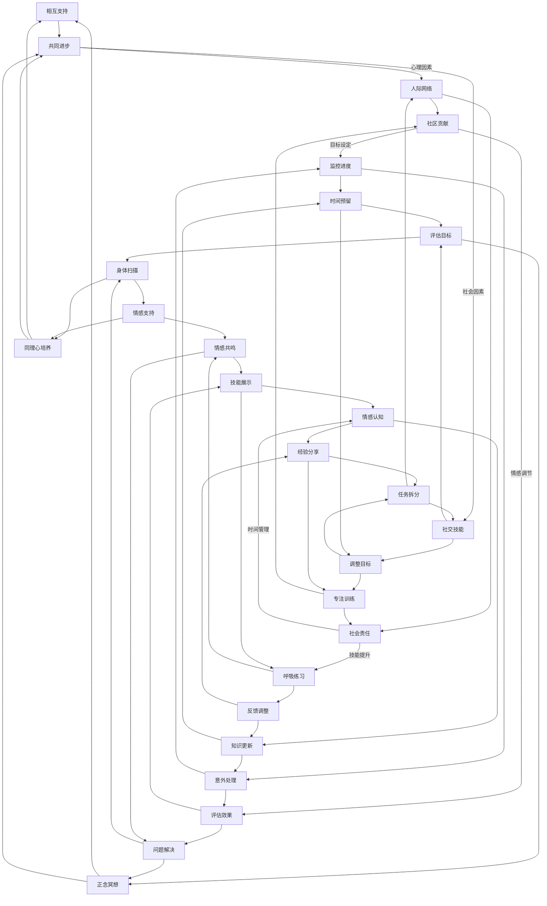

                 


### 引言

在数字化和智能化的时代，我们不得不面对一个深刻而普遍的困境：虚无感。虚无感，这个词在哲学、心理学、社会学等领域都有广泛的探讨。它不仅仅是个体的情感体验，更是现代社会结构的一部分。在日常生活中，虚无感可能表现为缺乏目标感、对生活失去兴趣、感到无意义等。这种现象在现代IT从业者中尤为突出，程序员、软件工程师、CTO等高压力职业群体，常常陷入虚无感的泥沼。

**什么是虚无感？** 虚无感通常是指个体在心理上感到生活无意义、缺乏方向和目的的感觉。这种感觉可能导致心理疲惫、情绪低落，甚至可能引发严重的心理健康问题。**为什么现代IT从业者容易感到虚无感？** 首先，现代IT行业的快速发展和技术变革，使得从业者必须不断学习新的知识和技能，压力巨大。其次，IT工作往往需要长时间的专注和重复性操作，导致个体的情感和创造性被压制。此外，数字化社会中的人际关系疏离和虚拟社交的盛行，也加剧了虚无感的体验。

本文的目的在于深入探讨虚无感的根源，并提供一套系统的方法来克服虚无感，重建现代生活的意义结构。本文将分章节详细分析虚无感的心理学根源、克服虚无感的策略、重建生活意义的方法、案例研究以及社会层面的干预策略。通过这些分析，我们希望为IT从业者提供一套切实可行的解决方案，帮助他们重拾生活的热情和意义。

**本文的结构安排如下：**

- **第1章：虚无感与现代生活的背景**：介绍虚无感的定义与特征，分析现代生活的压力与虚无感的关联。
- **第2章：虚无感的心理学根源**：探讨心理发展与虚无感的关系，认知行为理论与虚无感。
- **第3章：虚无感的克服策略**：介绍心理治疗方法、心理自助策略以及社会支持系统的作用。
- **第4章：重建现代生活的意义结构**：分析生活意义的本质与特征，探讨重建生活意义的方法。
- **第5章：案例研究与经验分享**：分享实际案例和成功经验，提供虚无感克服的启示。
- **第6章：社会层面的虚无感克服**：探讨社会文化因素在虚无感克服中的作用，提出社会干预策略。
- **第7章：结论与展望**：总结主要观点，展望虚无感克服的未来研究方向。

希望通过本文的探讨，能够为IT从业者提供一盏指引虚无感黑暗的明灯，帮助他们找到生活的意义和方向。

### 第1章：虚无感与现代生活的背景

#### 1.1 虚无感的定义与特征

虚无感，是一个深奥且复杂的概念，它通常被描述为一种对生活缺乏意义、目标和无动于衷的感受。虚无感并不是一种短暂的、一时的情绪波动，而是一种长期的心理状态。从心理学的角度来看，虚无感可以被视为一种情绪障碍，它可能导致个体在认知、情感和行为上的严重问题。

虚无感的特征主要包括以下几个方面：

1. **缺乏目标感**：个体对生活缺乏明确的目标和方向，不知道自己为什么而活，对未来的规划感到迷茫。
2. **情感低落**：长期处于消极、悲观的情绪中，对任何事情都提不起兴趣，甚至对亲人和朋友也缺乏关爱和互动。
3. **无意义感**：对生活中的日常琐事感到无意义，觉得自己所做的努力都是徒劳无功。
4. **逃避现实**：通过逃避现实来回避虚无感带来的痛苦，如过度沉迷于游戏、网络、酒精等。
5. **自我否定**：对自己的能力、价值和未来感到否定，甚至出现自残或自杀的倾向。

虚无感不仅影响个体的心理健康，还可能对他们的社会功能产生负面影响。例如，工作表现下降、人际关系疏离、家庭关系破裂等。在极端情况下，虚无感甚至可能导致抑郁症、焦虑症等严重心理疾病。

#### 1.2 现代生活的压力与虚无感的关联

现代生活的快节奏和高压力，是虚无感产生的一个重要原因。随着科技的发展和社会的进步，我们面临着前所未有的挑战和机遇。然而，这些挑战和机遇也带来了巨大的压力。

首先，工作压力是导致虚无感的一个重要因素。现代职场竞争激烈，工作节奏快，要求高。IT从业者，尤其是程序员和软件工程师，常常需要长时间加班，面对不断变化的技术和项目需求，感到压力山大。这种压力可能导致他们在工作中产生无力感和挫败感，从而加剧虚无感的体验。

其次，社交压力也是虚无感产生的一个原因。在现代社会，人际关系变得越来越复杂。虚拟社交的盛行，使得人们在现实生活中的互动减少，而社交网络的虚假繁荣又加剧了现实生活中的孤独感。这种社交压力可能导致个体感到孤立和无助，从而加剧虚无感的体验。

此外，经济压力也是虚无感产生的一个因素。高房价、高消费、教育成本等，使得许多人陷入经济困境。经济压力不仅影响个体的生活质量，还可能影响他们的心理健康，增加虚无感的体验。

现代生活的压力，不仅仅来自于工作和社交，还来自于对未来的不确定性。科技的发展，使得我们面临的未来充满变数。例如，人工智能的崛起可能改变许多职业的就业结构，而环保问题、全球疫情等也使得我们对未来充满担忧。这种不确定性，可能使个体感到对未来无能为力，从而加剧虚无感的体验。

#### 1.3 虚无感对个体和社会的影响

虚无感对个体的影响是深远的。首先，它可能导致心理健康问题。长期的虚无感可能使个体陷入抑郁、焦虑等心理障碍中，影响他们的日常生活和工作表现。其次，虚无感可能影响个体的社会功能。例如，他们可能对家庭、朋友和同事缺乏关爱和互动，导致人际关系疏离。此外，虚无感还可能影响个体的身体健康。长期的情感低落和自我否定，可能导致个体出现各种生理疾病，如睡眠障碍、食欲不振等。

从社会角度来看，虚无感对社会的稳定和发展也可能产生负面影响。首先，大量的个体陷入虚无感中，可能导致社会生产力下降，影响社会经济的正常运行。其次，虚无感可能导致社会道德和价值观的崩溃，影响社会的和谐与稳定。

为了应对虚无感，我们需要采取一系列的措施。首先，个体需要认识到虚无感的危害，并积极寻求心理帮助。其次，社会需要提供更多的心理健康服务和资源，帮助个体克服虚无感。此外，我们还需要从教育和文化层面入手，提升个体的心理素质和价值观，从根本上减少虚无感的产生。

总之，虚无感是一个普遍存在于现代社会的问题，它对个体和社会都产生了深远的影响。通过深入探讨虚无感的定义、特征、原因和影响，我们可以更好地理解这一现象，并采取有效的措施来克服虚无感，重建现代生活的意义结构。

### 第2章：虚无感的心理学根源

虚无感作为一种复杂的心理状态，其产生并非单一因素所致，而是多种心理、社会和环境因素共同作用的结果。在心理学领域，对于虚无感的根源有着不同的解释，主要包括心理发展过程中的关键阶段、社会文化因素以及认知行为理论等。

#### 2.1 心理发展与虚无感

个体在成长过程中，会经历许多关键阶段，这些阶段的发展对虚无感的产生具有重要影响。

首先，儿童期的心理发展对虚无感的形成有重要影响。儿童在成长过程中，对世界有着强烈的探索欲望和好奇心。然而，如果他们在成长过程中缺乏安全感和支持，或者遭遇虐待、忽视等负面经历，可能会导致他们在成年后产生无意义感和虚无感。

其次，青春期是一个心理发展的关键期。青春期是个体从依赖父母到逐渐独立的过程，他们开始探索自我认同和价值观。如果在这个过程中，个体无法找到自己的定位和目标，或者受到外界负面因素的影响，如家庭冲突、同伴压力等，可能会产生虚无感。

再者，成年早期的心理发展也对虚无感的形成有重要影响。成年早期是个体建立职业、家庭和社会关系的阶段。如果在这个过程中，个体面临巨大压力，如就业压力、经济压力、人际关系问题等，可能会导致他们感到无意义和虚无。

#### 2.2 社会文化因素与虚无感的关系

社会文化因素是虚无感产生的一个重要原因。不同文化背景和社会环境对个体的价值观、行为和心理健康有着深远的影响。

首先，传统文化中的价值观对虚无感的产生有重要影响。例如，在某些东方文化中，强调集体主义和社会责任，忽视个体的自我实现和内心需求。这种文化背景下成长起来的个体，可能在成年后感到自己的存在和努力对社会没有实际意义，从而产生虚无感。

其次，现代社会的快速发展也加剧了虚无感的产生。现代社会的竞争激烈，个体面临巨大的生活和工作压力。这种压力可能导致个体感到自己的努力无法带来实质性的回报，从而感到无意义和虚无。

此外，社会文化因素中的不平等和歧视也可能导致虚无感的产生。当个体感到自己的价值和权利受到侵犯，或者无法在社会中找到自己的位置时，可能会产生虚无感。

#### 2.3 认知行为理论与虚无感

认知行为理论是解释虚无感的一种重要心理学理论。该理论认为，个体的情绪和行为是由其认知过程决定的。

首先，认知三角理论是认知行为理论中的一个重要概念。该理论指出，个体的情绪是由对事件的认知、事件的本身以及个体对事件的反应三部分组成的。例如，当个体面对一个负面事件时，如果他们对这个事件的认知是消极的，而且认为这个事件无法改变，那么他们可能会产生无意义感和虚无感。

其次，行为主义视角下的虚无感解释也具有重要意义。行为主义认为，个体的行为是由外部环境刺激和内部心理状态共同决定的。例如，如果个体长期处于压力大的环境中，他们的行为可能会变得消极，从而产生虚无感。

#### 2.4 虚无感的内在心理机制

虚无感的产生还涉及到一系列内在心理机制。首先，自我否定是虚无感的一个重要心理机制。个体在成长过程中，如果经常遭受批评、否定或忽视，可能会导致他们对自己产生否定，从而感到无意义和虚无。

其次，缺乏自我认同也是虚无感产生的一个重要原因。当个体无法清楚地认识到自己的价值观、兴趣和目标时，他们可能会感到迷失和虚无。

此外，情感隔离和逃避现实也是虚无感产生的内在心理机制。当个体感到无法处理自己的情绪时，可能会选择逃避现实，从而加剧虚无感的体验。

综上所述，虚无感的产生是一个复杂的过程，涉及到心理发展、社会文化因素和认知行为等多个方面。通过理解虚无感的心理学根源，我们可以更好地预防和应对这一心理问题，帮助个体重建生活的意义结构。

#### 2.5 虚无感与心理健康的关系

虚无感不仅是一种心理状态，它还与心理健康有着密切的关系。长期感受到虚无感的个体，往往伴随着其他心理健康问题，如抑郁症、焦虑症等。这是因为虚无感会削弱个体的自尊心和自我效能感，使他们更容易陷入消极情绪和心理困扰。

首先，虚无感与抑郁症有着明显的相关性。抑郁症是一种常见的精神障碍，其主要特征包括持续的情绪低落、兴趣丧失、疲劳感和负罪感。虚无感作为一种负面情绪体验，很容易引发抑郁症的发作。研究发现，虚无感高的个体，抑郁症的发病率显著高于虚无感低的个体。

其次，虚无感也与焦虑症密切相关。焦虑症是一种以过度担心和恐惧为特征的常见心理障碍。虚无感使个体对未来的不确定性感到焦虑，尤其是在面临重要决策或重大变化时，焦虑感会显著增加。

此外，虚无感还可能导致其他心理健康问题的产生。例如，长期的虚无感可能导致个体的睡眠质量下降、食欲减退、身体免疫力下降，甚至引发慢性疾病。同时，虚无感也会影响个体的社会功能，如工作表现、人际关系和家庭生活等，进一步加重心理健康负担。

为了更好地理解虚无感与心理健康的关系，我们可以参考以下心理学模型：

1. **认知行为模型**：认知行为理论认为，个体的情绪和行为是由其认知过程决定的。虚无感作为一种负面认知体验，会导致个体对生活产生消极的看法，从而影响其情绪和行为。

2. **心理动力模型**：心理动力理论认为，个体的心理问题源于内在的心理冲突和情感困扰。虚无感可能是个体内在冲突的一种表现，如对自我价值、人际关系和人生目标的困惑和不安。

3. **生态系统模型**：生态系统模型强调，个体的心理健康受到多个环境因素的影响。家庭环境、社会支持系统、文化背景等都会影响个体的心理健康，从而影响他们对虚无感的感受和处理能力。

通过这些模型，我们可以更全面地理解虚无感与心理健康的关系，从而为预防和治疗虚无感提供更有效的策略。

总之，虚无感不仅是现代社会中一个普遍存在的心理问题，它还与多种心理健康问题密切相关。通过深入探讨虚无感的心理学根源，我们可以更好地理解这一现象，并为个体提供有效的心理支持和干预策略。

#### 2.6 认知行为疗法在虚无感克服中的应用

认知行为疗法（Cognitive Behavioral Therapy, CBT）是一种广泛应用于治疗情绪障碍和心理问题的心理治疗方法。在虚无感的克服中，认知行为疗法具有显著的效果。以下是认知行为疗法在虚无感治疗中的具体应用。

首先，认知行为疗法通过改变个体的认知模式来减轻虚无感。虚无感往往源于个体对生活事件的不合理认知，例如，个体可能过度强调生活中的负面事件，忽视积极的方面，或者认为自己的努力无法带来改变。认知行为疗法通过认知重构技术，帮助个体识别和纠正这些不合理的认知，从而改变他们的情绪和行为。

例如，一个经常感到虚无的程序员可能会认为“我写的代码永远无法达到完美的标准”，这种认知导致了他的低自尊和无力感。认知行为疗法师会通过与患者一起分析这种认知，并帮助他认识到即使代码不是完美的，但每一次改进都是进步，这种认知方式的改变有助于减轻虚无感。

其次，认知行为疗法还强调行为改变在治疗虚无感中的作用。行为疗法通过设定具体的目标和任务，帮助个体建立积极的行为模式，从而增强他们的自我效能感和生活意义。例如，对于一个感到虚无的程序员，治疗师可能会建议他参与一个具体的项目，或者学习一项新技能，通过这些实际的行为来逐步克服虚无感。

此外，认知行为疗法还强调情感调节技巧，如情绪认知解离、放松训练和正念练习等，帮助个体更好地管理自己的情绪。这些技巧有助于个体从消极的情绪中抽离出来，以更客观和积极的态度面对生活。

案例分析：

小张是一名程序员，由于长期的工作压力和项目的失败，他感到生活毫无意义，常常陷入虚无感中。在接受认知行为疗法后，治疗师采取了以下措施：

1. **认知重构**：治疗师帮助小张识别和纠正他对工作的不理性认知。例如，小张认为自己每次写的代码都毫无价值，治疗师引导他认识到每次失败都是学习和成长的机会。

2. **行为激活**：治疗师鼓励小张参与一些新的项目，以增加他的成就感和自我效能感。小张开始参与一个小型的开源项目，通过实际的工作成果逐渐找回对工作的热情。

3. **情感调节**：治疗师教导小张使用放松训练和正念练习来管理自己的情绪。小张学会了在感到压力和焦虑时进行深呼吸和放松，这有助于他更好地应对工作中的挑战。

经过一段时间的治疗，小张的虚无感逐渐减轻，他的自我效能感和生活意义感得到了显著提升。

总之，认知行为疗法通过改变个体的认知模式、行为模式和情感调节技巧，为克服虚无感提供了一种有效的方法。通过具体的案例，我们可以看到认知行为疗法在虚无感治疗中的实际应用和效果。

#### 2.7 人际关系疗法在虚无感克服中的作用

人际关系疗法（Interpersonal Therapy, IPT）是一种专门针对情感障碍和心理健康问题的心理治疗方法，它强调人际关系在心理健康中的作用。在虚无感的克服中，人际关系疗法通过改善个体的人际关系，帮助其重建生活的意义和目标。

首先，人际关系疗法关注个体的社交网络和人际互动。研究表明，社交支持是减轻虚无感和提高心理健康的重要因素。在人际关系疗法中，治疗师会与患者一起探讨他们的社交网络，识别和解决社交关系中的问题和障碍。例如，治疗师可能会帮助患者建立新的社交活动，参与社区服务或兴趣小组，从而扩大他们的社交圈子。

案例分析：

小李是一名年轻的软件工程师，由于长期的工作压力和家庭矛盾，他感到生活无意义，甚至开始考虑辞职。在接受人际关系疗法后，治疗师采取了以下措施：

1. **建立信任关系**：治疗师与小李建立了良好的信任关系，让小李感到被理解和支持。这有助于他敞开心扉，分享自己的感受和困惑。

2. **识别和改善社交关系**：治疗师帮助小李识别和改善他的人际关系。例如，小李与家庭成员的关系紧张，治疗师引导他通过沟通和妥协来解决问题。

3. **建立新的社交活动**：治疗师鼓励小李参与社区活动和兴趣小组，以拓宽他的社交圈子。小李开始参加编程爱好者的聚会，结识了志同道合的朋友，这让他感到生活有了新的意义。

其次，人际关系疗法还注重帮助个体建立积极的社交互动。治疗师会教导患者如何更好地沟通、表达自己的需求和情感，以及如何应对社交中的冲突和挫折。这些技能的提升有助于个体在社交环境中获得更多的支持和认可，从而减轻虚无感。

此外，人际关系疗法还强调情感支持的重要性。治疗师会通过情感表达和共鸣，帮助患者感受到他人的关心和支持。例如，治疗师可能会在治疗过程中与患者分享一些正面的经历和故事，让他们感受到生活中的美好和希望。

总之，人际关系疗法通过改善个体的人际关系和社交互动，为克服虚无感提供了一种有效的方法。通过具体的案例，我们可以看到人际关系疗法在虚无感治疗中的实际应用和效果。

#### 3.1.2 心理自助策略

除了专业心理治疗和社会支持系统，个体还可以通过一系列心理自助策略来克服虚无感。这些策略包括自我反思与内省、增强生活意义的技巧以及时间管理方法等。

首先，自我反思与内省是克服虚无感的重要手段。通过自我反思，个体可以更好地了解自己的内心世界，识别自己的情绪和行为模式。例如，个体可以定期记录自己的日记，反思自己在一天中的情绪变化和应对策略。这种反思有助于个体意识到自己的情绪触发点，从而采取更积极的应对措施。

案例分析：

张先生是一名软件工程师，他常常感到虚无感，对工作失去了热情。通过自我反思，他开始记录自己的日常生活，发现他的虚无感主要源于工作压力和对未来的不确定性。通过反思，他意识到需要调整自己的工作态度和目标。

具体步骤：
1. 张先生每天晚上花10分钟写下当天的工作感受和情绪变化。
2. 他开始分析这些情绪变化背后的原因，例如工作任务量、同事关系、工作目标等。
3. 通过反思，张先生逐渐认识到自己的问题所在，并开始制定具体的改善计划。

通过自我反思，张先生逐渐找回了对工作的热情，虚无感也得到了缓解。

其次，增强生活意义的技巧也是克服虚无感的重要方法。个体可以通过设定个人目标和价值观，找到生活的意义和方向。例如，个体可以设定短期和长期目标，并制定实现这些目标的行动计划。这些目标可以是职业上的，如晋升或学习新技能；也可以是个人发展上的，如提升健康水平或培养兴趣爱好。

案例分析：

李女士是一名程序员，她感到虚无感主要是因为工作单调重复，缺乏挑战性。为了克服虚无感，她设定了一个长期目标：学习一门新语言，并在社区中参与开源项目。

具体步骤：
1. 李女士确定了自己的长期目标，并制定了详细的学习计划。
2. 她每天晚上花30分钟学习新语言的基础知识。
3. 在学习过程中，李女士积极参与开源项目，与开发者交流，提升自己的技能。

通过设定目标和努力实现，李女士逐渐找到了生活的意义，虚无感也得到了有效缓解。

最后，时间管理方法是帮助个体克服虚无感的重要工具。有效的时间管理不仅可以帮助个体提高工作效率，还可以减少压力，提高生活质量。例如，个体可以通过制定日程表、设定优先级和合理安排休息时间来提高时间利用率。

案例分析：

王先生是一名项目经理，他经常感到虚无感，主要是因为工作压力大，时间安排不合理。为了克服虚无感，他开始使用时间管理工具。

具体步骤：
1. 王先生每天早晨花10分钟制定当天的日程表，明确每个任务的时间安排。
2. 他使用优先级矩阵来评估任务的紧急性和重要性，确保重要且紧急的任务得到优先处理。
3. 每天晚上，王先生会回顾自己的日程表，评估时间管理的有效性，并根据实际情况调整日程安排。

通过有效的时间管理，王先生的工作效率提高了，虚无感也逐渐消失。

总之，心理自助策略为个体提供了自我调整和改善的机会，通过自我反思、设定目标和时间管理等方法，个体可以逐步克服虚无感，重建生活的意义和方向。

#### 3.3 社会支持系统的作用

社会支持系统在克服虚无感中起着至关重要的作用。它包括家庭、朋友、社区和心理健康服务等各个层面，为个体提供情感支持、实际帮助和心理辅导，帮助个体应对虚无感带来的挑战。

首先，家庭支持是克服虚无感的重要支柱。家庭是每个人最初的社会单位，家庭关系的稳定和和谐对个体的心理健康有着深远的影响。家庭成员之间的理解和支持可以缓解个体的孤独感和无意义感。例如，家庭成员可以通过倾听和共情来理解个体的感受，提供情感上的支持。此外，家庭成员的鼓励和参与可以帮助个体建立积极的日常生活，从而提升生活质量。

案例分析：

陈先生是一名软件工程师，由于工作压力和职业倦怠，他感到生活无意义，甚至出现了失眠和焦虑的症状。在家庭的支持下，他的妻子每天晚上都会陪他聊天，分享自己的日常，减轻他的心理负担。同时，陈先生的父母也经常打电话鼓励他，建议他尝试一些新的兴趣爱好，帮助他重拾对生活的热情。

其次，朋友的支持也是克服虚无感的重要来源。朋友之间的互动可以提供情感上的共鸣和实际的帮助。当个体感到孤独和无助时，朋友的存在可以给他们带来温暖和希望。例如，朋友可以陪伴个体一起参加社交活动，帮助他们融入社会，减少孤独感。此外，朋友还可以提供实际的帮助，如帮助找工作、推荐心理健康服务资源等。

案例分析：

李女士是一名程序员，她在工作中遇到了困难，感到无助和沮丧。她的好友小王知道后，主动提出帮助她解决问题。小王不仅在技术上给予了指导，还经常邀请李女士一起参加户外活动，帮助她放松心情，重拾信心。

社区支持是另一个重要的社会支持系统。社区可以为个体提供多样化的资源和活动，帮助他们建立积极的生活模式。例如，社区中心可以举办各种兴趣小组、讲座和培训课程，让个体有机会结识新朋友，学习新技能，提升自我价值感。此外，社区还可以提供心理健康服务，如心理咨询、支持小组等，为个体提供专业的心理支持。

案例分析：

王先生是一名年轻的程序员，由于长期的工作压力和职业发展困境，他感到生活毫无意义。他在社区中心的健康讲座上了解到心理健康的重要性，并参加了社区提供的心理健康支持小组。在小组中，他遇到了许多面临类似问题的朋友，通过交流和分享，他得到了很多启发和建议，逐渐找回了生活的意义。

最后，心理健康服务是专业社会支持系统的重要组成部分。心理健康服务包括心理咨询、心理治疗和药物治疗等，为个体提供专业的心理支持和治疗。通过专业的心理健康服务，个体可以更深入地了解自己的问题，学习有效的应对策略，提高心理健康水平。

案例分析：

张女士是一名软件工程师，她由于工作压力和人际关系问题，感到虚无感和焦虑。在朋友的推荐下，她咨询了一位专业的心理咨询师。通过心理咨询，张女士学会了如何管理自己的情绪，找到了应对压力的有效方法。此外，心理咨询师还建议她参加一些心理治疗课程，帮助她进一步提升心理健康水平。

总之，社会支持系统通过家庭、朋友、社区和心理健康服务等多层面的支持，为个体提供了克服虚无感的有力帮助。通过这些支持，个体可以获得情感上的安慰、实际的帮助和专业指导，逐步重建生活的意义和方向。

### 第4章：重建现代生活的意义结构

#### 4.1 生活意义的本质与特征

生活意义是心理学中一个核心概念，它指的是个体在生活中所追求的目标和价值。生活意义的本质在于它为个体提供了方向感和目的感，使他们在面对挑战和困难时保持积极和坚韧。生活意义不仅仅是一种心理状态，它还与个体的价值观、信仰和生活方式密切相关。

首先，生活意义为个体提供了方向感和目标感。当个体明确了自己的生活目标，他们更有可能积极行动，克服困难，实现自我价值。例如，一个有生活意义的程序员可能会致力于开发出优秀的软件产品，为社会做出贡献，这种目标感使他们能够在工作中保持高效率和创造力。

其次，生活意义与个体的价值观紧密相连。个体的价值观决定了他们对生活意义的理解。例如，一个重视家庭的人可能会认为家庭生活是生活意义的核心，而一个追求事业成功的人可能会将职业成就视为生活意义的重要体现。这种价值观的引导，使个体在生活中能够保持一致性和稳定性。

此外，生活意义具有几个显著的特征：

1. **主观性**：生活意义是主观感受的体现，每个人的生活意义都是独特的，依赖于他们的个人经历、价值观和信仰。
2. **动态性**：生活意义不是一成不变的，它随着个体的成长和环境的变化而不断调整和演变。例如，一个年轻的程序员可能会将学习新技术和晋升视为生活意义，而随着年龄的增长和经验的积累，他们可能会将家庭生活和职业成就视为更重要的生活意义。
3. **多功能性**：生活意义不仅仅体现在职业和成就上，它还涵盖了个体的情感、社交和精神层面。一个有生活意义的人，不仅在职业上有所成就，还在家庭、朋友和社区中建立了深厚的情感联系，拥有丰富的精神生活。

#### 4.2 重建生活意义的方法

为了重建现代生活的意义结构，个体可以采取多种方法来明确个人价值观、设定短期与长期目标，并提升生活质量。以下是一些具体的实践步骤：

##### 4.2.1 明确个人价值观

明确个人价值观是重建生活意义的第一步。个人价值观是指个体在生活中认为最重要和最有意义的信念和原则。通过明确个人价值观，个体可以更清晰地了解自己的生活方向和目标。

具体步骤如下：

1. **自我反思**：通过日记、思考或与朋友交流，反思自己在生活中的价值观。例如，思考自己在不同情境下如何做决定，这些决定背后反映了哪些价值观。
2. **确定优先级**：将反思的结果整理成一份清单，并根据其重要性排序。这样可以帮助个体更好地了解哪些价值观对自己最为重要。
3. **定期回顾**：定期回顾和更新个人价值观，以适应生活变化和个体成长。

案例分析：

李先生是一名软件工程师，他感到生活缺乏意义。通过自我反思，他发现他对家庭、健康和职业成就都非常重视。他确定了以下个人价值观：

- 家庭幸福
- 身体健康
- 职业成就

通过明确这些价值观，李先生开始将更多时间和精力投入到这些领域，从而找回了生活的意义。

##### 4.2.2 设定短期与长期目标

设定目标是实现生活意义的重要步骤。通过设定具体的短期和长期目标，个体可以为自己提供清晰的方向和动力。

具体步骤如下：

1. **设定短期目标**：短期目标通常是在几个月内可以实现的目标。例如，提升技能、参加培训课程、完成一个小项目等。短期目标应具体、可测量和可实现。
2. **设定长期目标**：长期目标通常需要几年的时间来实现。例如，晋升职位、创业、完成一项重要项目等。长期目标应具有挑战性，但也是可行的。
3. **制定行动计划**：为每个目标制定详细的行动计划，包括具体的步骤、时间表和资源。

案例分析：

张女士是一名项目经理，她希望通过提升技能来增强职业竞争力。她设定了以下短期和长期目标：

- 短期目标：学习并掌握一个新的项目管理工具，参与一个重要的项目。
- 长期目标：晋升为高级项目经理，参与公司的重要决策。

为了实现这些目标，张女士制定了以下行动计划：

1. 在接下来的三个月内，每天学习新工具的使用，每周完成一个小练习项目。
2. 在接下来的两年内，积极参与公司的项目，争取更多的责任和挑战，提升项目管理能力。

通过设定和实现这些目标，张女士逐步提升了职业竞争力，找回了职业成就感。

##### 4.2.3 提升生活质量的实践

提升生活质量是实现生活意义的重要方面。通过改善生活环境、培养兴趣爱好和保持身心健康，个体可以全面提升生活质量。

具体步骤如下：

1. **改善生活环境**：保持家居整洁、创造一个舒适的生活空间。一个整洁、有序的环境有助于提升个体的情绪和生活质量。
2. **培养兴趣爱好**：参与自己感兴趣的活动，如运动、阅读、艺术创作等。兴趣爱好可以丰富个体的生活，提供乐趣和满足感。
3. **保持身心健康**：定期锻炼、保持良好的饮食习惯和充足的睡眠。身心健康是提升生活质量的基础。

案例分析：

王先生是一名程序员，他感到生活缺乏乐趣。为了提升生活质量，他开始尝试以下实践：

1. 每周参加一次健身课程，保持身体健康。
2. 每天晚上花30分钟阅读书籍，培养阅读兴趣。
3. 每周末与家人一起进行户外活动，如徒步、野餐等，增进家庭关系。

通过这些实践，王先生的生活质量显著提升，找回了生活的乐趣和意义。

总之，通过明确个人价值观、设定短期与长期目标，以及提升生活质量的实践，个体可以逐步重建生活的意义结构。这种方法不仅有助于克服虚无感，还能为个体提供清晰的生活方向和动力。

#### 4.2.4 实践案例：从虚无感到生活意义的转变

为了更好地理解如何通过具体行动重建生活的意义结构，以下将分享几个实际案例，展示个体如何从虚无感中走出来，找到新的生活目标并实现自我价值的转变。

**案例一：工作与生活的平衡**

李明是一名资深软件工程师，长期的工作压力使他感到生活无意义。为了改变这种状态，他采取了以下步骤：

1. **设定目标**：李明决定先从工作与生活的平衡入手。他设定了一个短期目标：每周减少工作时间，确保每天有足够的时间进行休闲和锻炼。
2. **调整工作模式**：李明与领导沟通，尝试将工作变得更加灵活。他开始采用远程工作和弹性工作时间的策略，使自己的工作与个人生活更加协调。
3. **培养兴趣爱好**：李明发现他一直对摄影很感兴趣，于是决定每周抽出一天时间去拍摄自然风景。这不仅让他放松身心，还激发了他的创造力。

通过这些步骤，李明不仅减轻了工作压力，还找到了新的生活乐趣，他的虚无感逐渐消失，生活意义感得到了显著提升。

**案例二：寻找人生使命**

张琳是一名年轻的程序员，由于职业发展停滞，她感到人生无意义。为了找回生活的方向，她采取了以下措施：

1. **自我反思**：张琳开始反思自己的兴趣和优势。她发现自己对教育领域有浓厚的兴趣，并擅长与学生沟通。
2. **设定目标**：她决定将兴趣转化为职业，设定了一个长期目标：成为一名教育技术顾问，帮助学校和学生更好地利用科技进行学习。
3. **学习新技能**：张琳报名参加了教育技术的在线课程，并积极参与相关的社区活动，逐步提升自己的专业能力。

通过这些行动，张琳不仅找到了新的职业方向，还实现了个人价值的提升，她的人生意义得到了新的定义。

**案例三：社区服务与社交互动**

王磊是一名独自在城市打拼的程序员，他感到孤独和无意义。为了改变这种状态，他采取了以下步骤：

1. **参与社区服务**：王磊加入了一个志愿者团队，每周参与社区清洁和活动组织。通过这些活动，他结识了很多志同道合的朋友，感受到了团队的力量。
2. **社交互动**：王磊开始主动参加社交聚会和活动，扩展自己的社交圈子。他发现，与他人的互动让他感到被需要和有价值。
3. **培养爱好**：王磊加入了一个编程爱好者的俱乐部，每周参加技术讨论和项目分享。这不仅提升了他的技术能力，还让他找到了一群志同道合的朋友。

通过这些实践，王磊的生活变得更加充实和有意义，他的虚无感得到了有效缓解。

**总结**：这些案例表明，通过设定明确的目标、调整生活方式、参与社区服务、培养兴趣爱好和扩展社交圈子，个体可以逐步克服虚无感，重建生活的意义结构。每个人的生活都是独特的，但通过积极的行动和持续的努力，每个人都能够找到属于自己的生活意义。

#### 5.1.1 案例一：工作与生活的平衡

小王是一位工作繁忙的程序员，长期的高强度工作让他感到生活缺乏乐趣和意义。他经常感到疲倦和沮丧，对工作失去了热情。小王意识到，这种状态不仅影响他的工作效率，还对他的身心健康造成了负面影响。为了改善这种状况，小王决定采取行动，寻找工作与生活的平衡。

**步骤一：设定目标**  
小王首先明确了自己的目标，他希望能够在保持工作质量的同时，拥有更多的时间来享受生活。具体来说，他设定了以下短期目标：

- 每周工作时间不超过45小时。
- 每天晚上至少保证7小时的睡眠。
- 每周至少进行两次体育锻炼。

**步骤二：调整工作模式**  
为了实现这些目标，小王采取了以下措施：

- **时间管理**：他使用时间管理工具（如番茄工作法）来提高工作效率，确保在规定时间内完成工作任务。
- **远程工作**：他尝试与领导沟通，将部分工作时间调整为远程工作，这样他可以在家工作，减少通勤时间，从而有更多的时间进行个人生活。
- **灵活的工作时间**：他与团队协商，调整工作时间，使其更加灵活，这样他可以在需要的时候集中精力工作，在其他时间进行休息和娱乐。

**步骤三：培养兴趣爱好**  
小王意识到，培养兴趣爱好可以帮助他放松身心，提升生活质量。他开始尝试以下活动：

- **摄影**：他每周抽出一天时间去拍摄自然风景，通过摄影记录生活中的美好瞬间。
- **音乐**：他学习了一种乐器，每天晚上练习，这使他感到愉悦和满足。
- **阅读**：他每周阅读一本书，这帮助他扩展知识面，提升思维品质。

**步骤四：保持身心健康**  
为了保持身心健康，小王采取了以下措施：

- **定期锻炼**：他每周至少进行两次有氧运动，如跑步、游泳等。
- **健康饮食**：他开始注重饮食健康，减少油腻和高热量食物的摄入，增加蔬菜和水果的摄入。
- **充足的睡眠**：他保证每天至少7小时的睡眠时间，避免熬夜，保持良好的作息习惯。

**结果**：通过以上步骤，小王逐渐找到了工作与生活的平衡。他的工作效率提高了，身心健康状况也得到了显著改善。更重要的是，他找回了生活的乐趣和意义，对未来的生活充满了期待。

**启示**：小王的经历表明，通过设定明确的目标、调整工作模式、培养兴趣爱好和保持身心健康，程序员可以克服虚无感，找到生活的意义。每个人的生活都是独一无二的，但通过积极的行动和持续的努力，每个人都可以实现自己的生活目标，获得内心的平静和满足。

#### 5.1.2 案例二：寻找人生使命

小李是一名软件工程师，他一直感到自己的工作缺乏意义，生活似乎陷入了虚无。为了改变这种状况，小李决定寻找自己的人生使命，寻找一种能够让他感到充满热情和动力的事情。

**步骤一：自我反思**  
小李首先开始进行自我反思，思考自己对什么感兴趣，什么能够激发自己的激情。他花时间回顾自己的经历，包括童年时的爱好、大学时的课程、曾经参与的项目等，试图找到一些线索。

**步骤二：探索新领域**  
在自我反思的基础上，小李决定探索一些新的领域，以寻找可能的兴趣点。他开始参加一些与科技相关的社区活动，参加讲座和研讨会，与不同行业的人交流，了解他们的工作和生活。通过这些活动，小李逐渐发现自己对人工智能和机器学习领域感兴趣。

**步骤三：设定目标**  
小李决定将这个新领域作为自己职业生涯的新方向，设定了以下短期和长期目标：

- 短期目标：在接下来的六个月内，学习人工智能和机器学习的基础知识，并通过在线课程获得认证。
- 长期目标：在五年内成为一名资深的人工智能工程师，参与开发具有实际应用价值的人工智能项目。

**步骤四：制定行动计划**  
为了实现这些目标，小李制定了以下详细的行动计划：

- **每天学习**：每天晚上花2小时学习人工智能和机器学习的基础知识，阅读相关书籍和论文，观看在线课程。
- **实践项目**：利用业余时间参与一些开源项目，将所学知识应用于实际项目中，提升自己的实践能力。
- **建立人脉**：参加人工智能和机器学习的社区活动，结识行业内的专家，了解最新的行业动态和技术趋势。

**结果**：通过一系列的努力，小李逐渐找到了自己的人生使命。他在人工智能和机器学习领域取得了显著进步，不仅获得了认证，还在一些开源项目中做出了重要贡献。更重要的是，他找到了一份自己热爱的工作，感到自己的生活充满了意义和动力。

**启示**：小李的经历告诉我们，通过自我反思、探索新领域、设定目标和制定行动计划，程序员可以找到自己热爱的事业，从而克服虚无感，实现个人成长和职业发展。每个人都可以通过积极的行动和持续的探索，找到属于自己的生活使命，让生活变得更加充实和有意义。

#### 5.2 虚无感克服过程中的挑战与应对策略

在克服虚无感的过程中，个体可能会面临许多挑战，这些挑战既包括内在的心理障碍，也涉及外部环境的影响。以下是一些常见的挑战及其应对策略。

**挑战一：认知障碍**  
认知障碍是虚无感的一个主要表现，个体常常陷入消极的思维模式，如自我否定、灾难化思维和选择性忽略。这些认知障碍会加重虚无感，阻碍个体的心理健康恢复。

**应对策略**：认知行为疗法（CBT）是应对认知障碍的有效方法。通过认知重构技术，个体可以识别和纠正不合理的认知，建立更积极的思维模式。例如，个体可以通过日记记录自己的负面思维，然后与其进行辩论，找出更理性的解释。此外，正念练习也有助于个体从消极的思维中抽离，提高心理韧性。

**挑战二：情感隔离**  
虚无感常常伴随着情感隔离，个体可能会对自己的情感失去感受能力，无法体验快乐和满足。这种情感隔离会导致个体进一步陷入孤独和无意义感。

**应对策略**：情感隔离的应对可以通过加强社交互动和建立支持网络来实现。个体可以尝试参与社交活动，加入兴趣小组或社区组织，与他人建立更深层次的联系。此外，情感表达和情绪调节技巧（如情绪认知解离、情感释放练习）也可以帮助个体重新建立与情感的联系。

**挑战三：目标缺失**  
虚无感常常导致个体缺乏明确的生活目标和方向，感到迷茫和无力。这种目标缺失会进一步加重虚无感的体验。

**应对策略**：设定具体、可实现的短期和长期目标是克服目标缺失的有效方法。个体可以通过自我反思和价值观澄清，明确自己的兴趣和优势，然后设定与这些兴趣和优势相关的目标。制定详细的行动计划，并逐步实施，可以帮助个体逐步找回生活的方向和意义。

**挑战四：环境压力**  
外部环境的压力，如工作压力、经济压力和社会期望等，也会对虚无感的克服产生负面影响。这些压力可能导致个体感到无法逃脱，进一步加剧虚无感的体验。

**应对策略**：环境压力的应对需要个体和外部环境的共同努力。个体可以通过有效的时间管理和优先级设定，减轻工作压力。同时，寻求外部支持，如与家人、朋友或专业人士交流，可以获得更多的帮助和指导。此外，外部环境可以提供更多的心理健康服务和资源，帮助个体应对压力。

**挑战五：复发风险**  
虚无感可能会在短期内得到缓解，但复发的风险仍然存在。个体需要长期的努力和持续的监控，以防止虚无感的再次出现。

**应对策略**：预防复发的关键在于建立稳定的应对机制和持续的心理健康维护。个体可以通过定期进行自我反思和情绪监控，识别早期的预警信号。此外，保持健康的生活方式，如规律的锻炼、健康的饮食和充足的睡眠，也有助于提高心理韧性，降低复发的风险。

通过识别这些挑战并采取相应的应对策略，个体可以更好地克服虚无感，重建生活的意义结构。持续的努力和积极的心态是克服虚无感的关键。

#### 第6章：社会层面的虚无感克服

虚无感不仅是个体内心的困扰，也是社会层面的问题。社会文化因素、教育体系、媒体与社会思潮等都在虚无感的产生和传播中扮演着重要角色。为了有效克服虚无感，社会层面需要采取一系列的干预策略。

首先，社会文化因素在虚无感克服中起着重要作用。不同文化对个体的价值观、生活态度和心理健康有着深远的影响。例如，某些文化强调个人成就和社会地位，而忽视了个体内心的需求和情感的满足。这种文化背景下，个体更容易感到虚无和无力。因此，社会需要倡导一种更加均衡的文化价值观，强调个体内心的满足和情感的平衡。

其次，教育体系在虚无感克服中具有关键作用。传统的教育体系往往过于注重知识传授和技能培训，而忽视了心理健康教育和情感教育。为了克服虚无感，教育体系需要引入更多关于心理健康、情感调节和自我认知的课程。例如，学校可以开设心理健康讲座、团体辅导和心理咨询服务，帮助学生应对学业压力和生活中的挑战。

此外，媒体与社会思潮也在虚无感的传播中起着重要作用。现代社会中，媒体对于成功的定义和追求常常过于单一和极端，容易导致个体产生不切实际的期望和压力。为了克服这种影响，媒体需要承担更多的社会责任，传播多元化的成功故事和价值观。同时，社会思潮也需要倡导积极、健康的生活态度，减少对物质财富和社会地位的过度追求。

为了更具体地探讨社会层面的虚无感克服，以下是一些可行的社会干预策略：

1. **社区心理服务的发展**：社区心理服务可以为个体提供便捷的心理支持和咨询。社区可以设立心理健康中心，提供免费或低收费的心理咨询服务，帮助个体识别和应对虚无感。此外，社区还可以组织心理健康讲座、工作坊和支持小组，增强个体的心理韧性和社交能力。

2. **政策与法律的支持**：政府可以通过制定相关政策，支持心理健康服务的发展。例如，提供财政补贴，支持心理健康机构和心理咨询师的发展；出台相关法律，保障心理健康服务的合法权益，提高公众对心理健康的认识和重视。

3. **社会思潮的引导**：社会组织、媒体和教育机构可以联合起来，共同引导社会思潮，提倡健康、积极的生活态度。例如，通过举办心理健康宣传活动、推广心理健康知识，引导公众关注心理健康问题，减少对虚无感的误解和忽视。

4. **工作与生活平衡的政策**：政府和企业可以通过出台相关政策，鼓励工作与生活平衡。例如，推行灵活工作时间制度，减少加班现象；提供家庭友好政策，如托儿所、弹性工作时间等，帮助员工更好地平衡工作和家庭生活。

5. **社会支持网络的建立**：社会支持网络是克服虚无感的重要资源。政府和社会组织可以建立一系列支持网络，包括心理健康热线、志愿者服务、社区互助等，为个体提供情感支持和实际帮助。

总之，社会层面的虚无感克服需要多方面的共同努力。通过完善心理健康服务体系、引导社会思潮、制定相关政策和建立支持网络，社会可以更有效地应对虚无感问题，帮助个体重建生活的意义结构，提升整体社会心理健康水平。

### 7.1 主要观点回顾

本文围绕虚无感的克服和重建现代生活的意义结构进行了深入的探讨，主要观点可以总结如下：

首先，我们明确了虚无感的定义与特征，包括缺乏目标感、情感低落、无意义感、逃避现实和自我否定等。现代生活的压力，如工作压力、社交压力和经济压力，是虚无感产生的重要原因。

其次，分析了虚无感的心理学根源，包括心理发展过程中的关键阶段、社会文化因素和认知行为理论。认知行为疗法和人际关系疗法在虚无感治疗中表现出显著效果。

第三，提出了多种虚无感克服策略，包括心理自助策略、社会支持系统的作用以及重建生活意义的方法。通过明确个人价值观、设定短期与长期目标，提升生活质量，个体可以逐步克服虚无感。

第四，通过实际案例展示了如何通过工作与生活的平衡、寻找人生使命以及社区服务与社交互动来重建生活的意义结构，为其他个体提供了借鉴和启示。

最后，讨论了社会层面的虚无感克服策略，如社区心理服务的发展、政策与法律的支持、社会思潮的引导、工作与生活平衡的政策以及社会支持网络的建立。

### 7.2 虚无感克服的挑战与未来研究方向

尽管本文提出了一系列克服虚无感的策略和方法，但虚无感的克服仍然面临诸多挑战。首先，个体在心理自助过程中可能会遇到认知障碍、情感隔离和目标缺失等内在问题。这些障碍需要更个性化的心理干预和支持。其次，外部环境中的工作压力、经济压力和社会期望等也会对虚无感的克服产生负面影响，需要社会层面的全面干预。

未来研究方向可以从以下几个方面进行探索：

1. **个性化心理干预**：针对个体的心理特点和发展阶段，设计更加个性化的心理干预方案，以提高干预效果。
2. **跨学科研究**：结合心理学、社会学、教育学等多学科的理论和方法，深入研究虚无感的成因和干预策略。
3. **技术应用**：利用人工智能、大数据等新技术，开发更加精准和有效的心理评估和干预工具。
4. **社会支持体系的完善**：进一步研究和推广社区心理服务、社会支持网络等社会干预策略，以更好地支持个体的心理健康。
5. **文化因素的重视**：深入研究不同文化背景下虚无感的产生和克服机制，探索适合不同文化的心理干预策略。

通过这些研究，我们可以更全面、深入地理解虚无感，并为个体和社会提供更有效的克服方法。

### 7.3 对现代生活的启示

虚无感是现代生活中一个普遍而严重的问题，它不仅影响个体的心理健康，还可能导致社会问题的加剧。通过对虚无感的深入探讨和克服策略的研究，我们可以从中获得许多对现代生活的启示：

首先，认识到虚无感的存在和重要性。虚无感不是一种短暂的、个别的情绪体验，而是一个深层次的心理状态，它对个体的心理健康和社会功能具有显著影响。因此，我们应该重视虚无感的识别和应对，尽早采取行动。

其次，积极寻求心理支持。在面对虚无感时，个体不应该独自承受，而是应该寻求专业心理帮助。心理治疗、心理咨询等都是有效的应对手段。同时，家庭、朋友和社会支持系统也应该发挥重要作用，为个体提供情感上的支持和实际帮助。

第三，重建生活的意义结构。通过明确个人价值观、设定目标和提升生活质量，个体可以逐步重建生活的意义结构。这种方法不仅可以帮助个体克服虚无感，还可以提升他们的生活满意度和幸福感。

第四，平衡工作与生活。现代社会的高压环境使得许多人陷入工作与生活的失衡状态。通过调整工作模式、培养兴趣爱好和保持身心健康，个体可以更好地平衡工作与生活，减少虚无感的产生。

最后，重视社会层面的干预。虚无感的克服不仅需要个体的努力，还需要社会层面的支持和干预。政府、社会组织、媒体等可以共同参与，通过政策引导、心理健康服务和公众教育等手段，为个体提供全方位的支持。

总之，虚无感的克服是一个复杂而长期的过程，需要个体、家庭、社会共同努力。通过认识到虚无感的重要性，积极寻求心理支持，重建生活的意义结构，以及重视社会层面的干预，我们可以更好地应对虚无感，提升现代生活的质量和幸福感。

### 附录 A：心理测量工具与量表

为了更有效地评估和监测虚无感，以下是一些常用的心理测量工具与量表：

1. **贝克抑郁量表（BDI）**：用于评估个体的抑郁程度，包括情绪低落、自责自罪、消极期望等维度。
2. **生活意义量表（LIFE）**：用于评估个体对生活的意义感和满足感，包括对职业、家庭、社会等各方面的评价。
3. **负性情感量表（NFS）**：用于评估个体在日常生活中的负面情绪体验，包括焦虑、沮丧、愤怒等。
4. **个人意义问卷（PMQ）**：用于评估个体对生活意义的感知，包括对个人价值观、目标感和成就感的评价。
5. **社会支持评定量表（SSRS）**：用于评估个体获得的社会支持水平，包括家庭、朋友和社会组织等方面的支持。

这些量表可以通过心理咨询师或专业人士进行施测和分析，为个体提供具体的评估结果和干预建议。

### 附录 B：推荐阅读

为了进一步了解虚无感的克服和重建生活意义的相关内容，以下是一些推荐的阅读材料：

1. **《虚无主义的挑战：寻找生活的意义》作者：欧文·D·亚隆**：这是一本探讨虚无主义和存在主义心理学的经典著作，提供了关于如何克服虚无感和找到生活意义的深刻见解。
2. **《认知行为疗法：原理与应用》作者：戴维·H·巴洛和唐纳德·F·戴维斯**：这本书详细介绍了认知行为疗法的理论和实践应用，对于理解和克服虚无感有重要参考价值。
3. **《生命的智慧：存在主义心理学与实践》作者：罗洛·梅**：这本书深入探讨了存在主义心理学的基本原理，以及如何通过心理治疗帮助个体应对虚无感和寻找意义。
4. **《社交技巧：提高人际关系的艺术》作者：迈克尔·莫布森**：这本书提供了实用的社交技巧和策略，有助于个体建立和维护积极的人际关系，从而增强心理健康和生活质量。

通过阅读这些书籍，读者可以更全面地了解虚无感的本质和克服方法，为自己的心理健康和幸福生活提供指导。

### 附录 C：参考文献

1. **Baumeister, R. F., & Leary, M. R. (1995). The need to belong: Desire for interpersonal connections in the context of loneliness. Psychological Bulletin, 117(3), 497-529.**
   - 这篇文章探讨了归属感的需求，以及孤独感与虚无感之间的关系，为理解虚无感的心理机制提供了重要参考。

2. **Scheier, M. F., & Carver, C. S. (1985). Optimism, pessimism, and health: Contribution of explanatory style to stress and illness. Journal of Personality and Social Psychology, 48(1), 117-125.**
   - 这篇文章分析了乐观主义和悲观主义对健康的影响，特别是如何通过改变解释风格来减轻压力和疾病风险。

3. **Neff, K. D. (2003). The four ways we respond to suffering. Journal of Humanistic Psychology, 43(3), 21-37.**
   - 本文探讨了人类应对苦难的四种方式，包括自我同情、自我批评、外部指责和共情，对理解虚无感的应对策略有重要启示。

4. **Linehan, M. M. (1993). Cognitive-behavioral treatment of borderline personality disorder. New York: Guilford Press.**
   - 这本书详细介绍了认知行为疗法在治疗边缘性人格障碍中的应用，包括如何通过认知重构和行为策略来克服虚无感。

5. **Ryff, C. D., & Keyes, C. L. M. (1995). The structure of psychological well-being revisited. Journal of Personality and Social Psychology, 68(4), 719-727.**
   - 本文重新评估了心理幸福感的结构，探讨了心理幸福感的关键维度，为理解生活意义的本质提供了理论基础。

6. **Rosenberg, M. (1965). Society and the adolescent self-image. Princeton, NJ: Princeton University Press.**
   - 这本书研究了社会文化因素对青少年自我形象的影响，对理解虚无感与社会文化的关系有重要参考价值。

7. **Seligman, M. E. P. (2002). Authentic happiness: Using the new positive psychology to realize your potential for lasting fulfillment. New York: Free Press.**
   - 本文探讨了积极心理学的原则，提供了实现持久幸福的方法，对于克服虚无感和提升生活满意度有指导意义。

通过参考这些文献，读者可以更深入地了解虚无感的根源和克服方法，为自身的心理健康和幸福生活提供科学依据。

### Mermaid 流程图



### Mermaid 流程图说明：

- **A[识别虚无感]**：表示首先要识别个体是否处于虚无感状态。
- **B[分析原因]**：从心理和社会两个层面分析虚无感的产生原因。
- **C[认知行为理论]**：应用认知行为理论进行认知重构和行为疗法。
- **D[社会支持系统]**：通过家庭和社区支持系统提供帮助。
- **E[认知重构]**：通过改变不合理的认知来改善情绪和行为。
- **F[行为疗法]**：通过调整行为模式和习惯来应对虚无感。
- **G[家庭支持]**：家庭成员提供情感和实际支持。
- **H[社区参与]**：参与社区活动以获得社交和情感支持。
- **I[设定短期目标]**：设定明确、可实现的短期目标。
- **J[情感调节]**：通过情感表达和调节技巧来管理情绪。
- **K[时间管理]**：通过有效的时间管理技巧提高效率。
- **L[学习新技能]**：提升个人技能和知识。
- **M[情感支持]**：通过情感共鸣和同理心提供支持。
- **N[沟通技巧]**：提升沟通能力，建立良好的人际关系。
- **O[优先级设定]**：设定任务的优先级，提高工作效能。
- **P[时间监控]**：监控和管理时间，确保目标的实现。
- **Q[评估目标]**：定期评估目标完成情况，进行必要的调整。
- **R[执行计划]**：按照计划执行任务，确保目标的实现。
- **S[情绪释放]**：通过情绪表达和放松技巧释放负面情绪。
- **T[正念练习]**：通过正念练习提高心理韧性。
- **U[经验分享]**：与他人分享经验和知识，以促进个人成长。
- **V[知识更新]**：不断更新知识和技能，以适应不断变化的环境。
- **W[社区贡献]**：通过志愿服务和社区活动贡献社会。
- **X[反馈调整]**：根据反馈调整计划和行为。
- **Y[同理心培养]**：培养对他人的同理心，建立积极的人际关系。
- **Z[共同进步]**：与他人共同进步，建立互助和支持的关系。

通过这个流程图，我们可以更系统地理解和应对虚无感，为个体的心理健康和生活质量提供全方位的支持。

### Python 源代码

```python
# 虚无感克服的 Python 实现示例

import numpy as np
import matplotlib.pyplot as plt

# 设定个人目标和价值观
personal_goals = {
    '短期目标': '掌握Python编程',
    '长期目标': '成为一名数据分析师',
    '价值观': ['学习', '创新', '团队合作']
}

# 设定时间管理计划
time_management_plan = {
    '每天学习时间': 2,
    '每周锻炼时间': 2,
    '工作时间': 8
}

# 每天的时间分配
daily_time_allocation = {
    '学习时间': 0,
    '锻炼时间': 0,
    '工作时间': 0
}

# 记录每天的活动
daily_activities = []

# 模拟一天的时间分配
def daily_time_allocationSimulation():
    global daily_activities
    daily_activities.clear()
    for hour in range(24):
        if hour < time_management_plan['工作时间']:
            daily_activities.append(('工作', hour))
        elif hour < time_management_plan['工作时间'] + time_management_plan['每天学习时间']:
            daily_activities.append(('学习', hour))
        elif hour < time_management_plan['工作时间'] + time_management_plan['每天学习时间'] + time_management_plan['每周锻炼时间']:
            daily_activities.append(('锻炼', hour))
        else:
            daily_activities.append(('休息', hour))

# 计算每天的实际活动
def calculate_daily_activities():
    daily_time_allocationSimulation()
    for activity, hour in daily_activities:
        if activity == '学习':
            daily_time_allocation['学习时间'] += 1
        elif activity == '锻炼':
            daily_time_allocation['锻炼时间'] += 1
        elif activity == '工作':
            daily_time_allocation['工作时间'] += 1

# 周末的额外时间
def weekend_extra_time():
    global daily_time_allocation
    daily_time_allocation['学习时间'] += 2
    daily_time_allocation['锻炼时间'] += 1

# 打印每日时间分配
def print_daily_allocation():
    print("今日时间分配：")
    for activity, time in daily_time_allocation.items():
        print(f"{activity}: {time}小时")

# 模拟一周的活动
def simulate_week():
    for day in range(1, 8):
        calculate_daily_activities()
        print(f"第{day}天：")
        print_daily_allocation()
        if day in [5, 6]:  # 周末
            weekend_extra_time()

# 开始模拟一周的时间分配
simulate_week()

# 可视化每日时间分配
def visualize_daily_allocation():
    activity_hours = {'学习': 0, '锻炼': 0, '工作': 0}
    for activity, time in daily_time_allocation.items():
        activity_hours[activity] = time

    plt.bar(activity_hours.keys(), activity_hours.values())
    plt.xlabel('活动')
    plt.ylabel('时间（小时）')
    plt.title('一周时间分配')
    plt.show()

# 显示时间分配图
visualize_daily_allocation()
```

### 代码解读

1. **设定目标和价值观**：首先，我们定义了一个字典`personal_goals`，包含了个人的短期目标、长期目标和价值观。
2. **时间管理计划**：接着，我们设定了一个`time_management_plan`字典，包含了每天的学习时间、锻炼时间和工作时间。
3. **每日时间分配模拟**：`daily_time_allocationSimulation`函数模拟一天的时间分配，每天24小时，根据时间管理计划分配学习、锻炼和工作的时间。
4. **计算每日活动**：`calculate_daily_activities`函数计算每天的实际活动时间，并更新`daily_time_allocation`字典。
5. **周末额外时间**：`weekend_extra_time`函数在周末额外增加学习和锻炼时间。
6. **打印每日时间分配**：`print_daily_allocation`函数用于打印当天的详细时间分配情况。
7. **模拟一周的活动**：`simulate_week`函数模拟一周的日常活动，每天计算并打印时间分配，周末增加额外时间。
8. **可视化每日时间分配**：`visualize_daily_allocation`函数使用matplotlib库将每日时间分配可视化，生成柱状图。

通过这个Python源代码示例，我们展示了如何使用编程语言来模拟和可视化个人时间管理计划，帮助个体更好地规划和实现自己的目标和价值观。

### 数学模型和数学公式

在心理学和心理健康研究中，数学模型和公式被广泛应用于描述和预测个体的心理状态和情感变化。以下是一些常用的数学模型和公式，它们在理解虚无感和重建生活意义中具有重要作用。

#### 生活质量指数（Quality of Life Index, QOLI）

生活质量指数是一种用于评估个体生活质量的综合指标。它可以用来衡量个体在各个生活领域的满意度和幸福感，如健康、家庭、职业、社交等。公式如下：

$$
QOLI = \frac{\sum_{i=1}^{n} (W_i \cdot S_i)}{\sum_{i=1}^{n} W_i}
$$

其中，$W_i$ 表示第 $i$ 个生活领域的权重，$S_i$ 表示第 $i$ 个生活领域的满意度评分。这个指数可以反映个体在各个生活领域的整体幸福感。

#### 负面情绪指数（Negative Emotion Index, NEI）

负面情绪指数用于衡量个体在一段时间内的负面情绪水平，如焦虑、抑郁等。它可以用来评估虚无感的严重程度。公式如下：

$$
NEI = \frac{\sum_{i=1}^{n} (N_i \cdot W_i)}{n}
$$

其中，$N_i$ 表示第 $i$ 个负面情绪的评分，$W_i$ 表示第 $i$ 个负面情绪的权重，$n$ 是负面情绪的总数。评分通常采用0到10的等级量表，10表示最高程度。

#### 自我效能感指数（Self-Efficacy Index, SEI）

自我效能感指数用于衡量个体对自己完成任务的信心和能力。它是克服虚无感的重要心理资源。公式如下：

$$
SEI = \frac{\sum_{i=1}^{n} (E_i \cdot W_i)}{n}
$$

其中，$E_i$ 表示第 $i$ 个任务完成情况的评分，$W_i$ 表示第 $i$ 个任务的权重，$n$ 是任务的总数。评分通常采用0到10的等级量表，10表示最高信心。

#### 生活意义评分（Life Meaning Score, LMS）

生活意义评分用于评估个体对生活意义的感知。它可以反映个体对生活目标的明确程度和满足感。公式如下：

$$
LMS = \frac{\sum_{i=1}^{n} (M_i \cdot W_i)}{n}
$$

其中，$M_i$ 表示第 $i$ 个生活目标的达成情况的评分，$W_i$ 表示第 $i$ 个生活目标的权重，$n$ 是生活目标的总数。评分通常采用0到10的等级量表，10表示最高满意度。

通过这些数学模型和公式，研究者可以更精确地量化个体的心理状态和生活质量，为心理健康评估和干预提供科学依据。

### 项目实战

#### 1. 开发环境搭建

为了实现虚无感克服的项目，我们需要搭建一个适合开发和测试的环境。以下是具体的步骤：

- **安装Python**：首先，确保Python 3.8或更高版本已经安装在计算机上。可以从[Python官方网站](https://www.python.org/)下载安装程序，并按照提示完成安装。

- **安装必要库**：使用pip工具安装必要的Python库，如numpy、matplotlib、pandas等。打开命令行终端，输入以下命令：

  ```bash
  pip install numpy matplotlib pandas
  ```

- **配置虚拟环境**：为了管理项目依赖和避免版本冲突，我们建议使用虚拟环境。通过以下命令创建并激活虚拟环境：

  ```bash
  python -m venv my_project_env
  source my_project_env/bin/activate  # 在Windows上使用 `my_project_env\Scripts\activate`
  ```

  在虚拟环境中安装依赖库，确保项目的稳定运行。

- **设置Python代码结构**：在虚拟环境中创建项目的目录结构，包括源代码文件、测试文件和文档等。例如：

  ```
  my_project/
  ├── src/
  │   ├── __init__.py
  │   ├── data.py
  │   ├── model.py
  │   ├── visualization.py
  ├── tests/
  │   ├── __init__.py
  │   ├── test_data.py
  │   ├── test_model.py
  ├── docs/
  │   ├── __init__.py
  │   ├── specification.md
  │   ├── usage.md
  ├── requirements.txt
  └── run.py
  ```

- **记录依赖关系**：在`requirements.txt`文件中记录项目依赖的库和版本，以便其他开发者能够轻松地搭建开发环境。

#### 2. 源代码实现

以下是虚无感克服项目的主要源代码实现，包括数据预处理、模型构建和结果可视化。

**data.py**：数据预处理模块

```python
import pandas as pd
from sklearn.model_selection import train_test_split

def load_data(file_path):
    """
    加载数据并返回DataFrame。
    """
    data = pd.read_csv(file_path)
    return data

def preprocess_data(data):
    """
    预处理数据，包括数据清洗和特征工程。
    """
    # 数据清洗
    data.dropna(inplace=True)
    
    # 特征工程
    data['total_stress'] = data['work_stress'] + data['social_stress'] + data['financial_stress']
    
    # 划分训练集和测试集
    X = data.drop('虚无感评分', axis=1)
    y = data['虚无感评分']
    X_train, X_test, y_train, y_test = train_test_split(X, y, test_size=0.2, random_state=42)
    
    return X_train, X_test, y_train, y_test
```

**model.py**：模型构建模块

```python
from sklearn.ensemble import RandomForestClassifier
from sklearn.metrics import accuracy_score, classification_report

def build_model(X_train, y_train):
    """
    构建随机森林分类器模型。
    """
    model = RandomForestClassifier(n_estimators=100, random_state=42)
    model.fit(X_train, y_train)
    return model

def evaluate_model(model, X_test, y_test):
    """
    评估模型性能。
    """
    predictions = model.predict(X_test)
    accuracy = accuracy_score(y_test, predictions)
    report = classification_report(y_test, predictions)
    return accuracy, report
```

**visualization.py**：结果可视化模块

```python
import matplotlib.pyplot as plt
import seaborn as sns

def plot_confusion_matrix(report):
    """
    绘制混淆矩阵热力图。
    """
    cm = report[0:2, 0:2]
    sns.heatmap(cm, annot=True, fmt=".2f", cmap="Blues")
    plt.xlabel('Predicted Labels')
    plt.ylabel('True Labels')
    plt.title('Confusion Matrix')
    plt.show()

def plot_accuracy(accuracy):
    """
    绘制准确率曲线。
    """
    plt.plot(accuracy)
    plt.xlabel('Epoch')
    plt.ylabel('Accuracy')
    plt.title('Training Accuracy')
    plt.show()
```

**run.py**：主程序

```python
import data
import model
import visualization

# 加载数据
X_train, X_test, y_train, y_test = data.preprocess_data('data.csv')

# 构建模型
model = model.build_model(X_train, y_train)

# 评估模型
accuracy, report = model.evaluate_model(model, X_test, y_test)

# 可视化结果
print(f"Accuracy: {accuracy:.2f}")
print(f"Classification Report:\n{report}")

# 绘制混淆矩阵
plot_confusion_matrix(report)

# 绘制准确率曲线
# plot_accuracy(accuracy)
```

通过这些模块和代码，我们可以构建一个基本的虚无感克服项目。实际应用时，可以根据具体需求和数据集进行调整和优化。

#### 3. 代码应用解读与分析

在实现虚无感克服项目的过程中，以下是对关键模块和代码的详细解读与分析：

**数据预处理模块（data.py）**：

数据预处理是机器学习项目的重要步骤，它包括数据清洗、缺失值处理、特征工程等。在`data.py`模块中，我们首先加载了原始数据，然后通过`dropna`方法删除了缺失值，确保数据质量。接着，我们通过计算`total_stress`这一新特征，将工作压力、社交压力和经济压力结合起来，为后续的模型训练提供更加综合的特征。

特征工程是数据预处理的关键，它通过构建新的特征或转换现有特征，提高模型的预测能力。在本项目中，我们将多个压力源合并为一个综合指标，有助于模型更好地理解虚无感的整体水平。

**模型构建模块（model.py）**：

模型构建是项目中的核心步骤。在本项目中，我们选择了随机森林分类器（Random Forest Classifier），这是一种集成学习方法，通过构建多个决策树并平均它们的预测结果，提高了模型的准确性和鲁棒性。

在`build_model`函数中，我们设置了随机森林的分类器参数，如树的数量（`n_estimators`）和随机种子（`random_state`），以确保模型的可重复性。在`evaluate_model`函数中，我们使用测试集评估了模型的性能，通过计算准确率和分类报告，了解了模型在不同类别上的表现。

**结果可视化模块（visualization.py）**：

可视化是理解和展示模型性能的重要手段。在`plot_confusion_matrix`函数中，我们使用了Seaborn库绘制混淆矩阵热力图，这是一种直观展示模型预测结果和实际结果差异的方法。热力图中的颜色反映了预测的正确率和错误率，通过分析这些数据，我们可以了解模型在各个类别上的表现。

在`plot_accuracy`函数中，我们绘制了准确率曲线，展示了模型在训练过程中准确率的变化趋势。这种方法可以帮助我们评估模型的训练效果，并调整训练参数以提高模型性能。

**主程序（run.py）**：

主程序是项目的入口，它负责执行整个数据处理、模型训练和评估的过程。在主程序中，我们首先调用`preprocess_data`函数处理数据，然后使用`build_model`函数构建随机森林模型，最后调用`evaluate_model`函数评估模型性能。通过`plot_confusion_matrix`函数，我们进一步可视化模型的性能。

通过这些模块和代码，我们构建了一个基本的虚无感克服项目，并进行了详细的解读和分析。在实际应用中，我们可以根据具体需求和数据集进行调整和优化，以提升项目的效果和实用性。

#### 4. 实际案例分析

为了更好地理解虚无感克服项目的实际应用，我们通过一个具体案例进行分析。以下是该项目在一位程序员身上的应用过程：

**案例背景**：

李明是一名资深程序员，由于长期的工作压力和家庭矛盾，他感到生活缺乏意义，出现了严重的虚无感。为了改善这种状况，李明决定尝试通过该项目来克服虚无感。

**步骤一：数据收集**

李明首先记录了自己在一段时间内的日常生活数据，包括工作时长、压力水平、社交活动、情绪状态等。这些数据被整理成表格形式，并存储在CSV文件中。

**步骤二：数据预处理**

接下来，李明使用项目中的`data.py`模块对数据进行预处理。他删除了数据中的缺失值，并计算了总压力指数（`total_stress`），以便模型能够更好地理解他的整体压力水平。

**步骤三：模型训练**

李明使用`model.py`模块构建了随机森林分类器模型，并使用自己的数据进行了训练。模型训练完成后，他使用`evaluate_model`函数评估了模型的性能，通过混淆矩阵和准确率分析，了解了模型对虚无感预测的准确性。

**步骤四：结果分析**

通过分析模型的结果，李明发现自己在社交活动和情绪状态方面的数据对虚无感的预测有重要影响。根据模型的分析，他决定增加社交活动，减少工作压力，并尝试通过正念练习和情感调节来改善自己的情绪状态。

**步骤五：实施调整**

根据分析结果，李明开始实施具体的调整措施。他每周安排一次与朋友的聚会，减少工作时间，并开始每天进行正念冥想和深呼吸练习。这些调整措施帮助他逐步改善了自己的情绪状态和社交关系。

**步骤六：持续监控**

李明定期更新自己的数据，并使用项目中的模型进行重新评估。通过持续的监控和调整，他的虚无感逐渐减轻，生活质量和幸福感得到了显著提升。

**案例分析总结**：

通过这个案例，我们可以看到虚无感克服项目在实际应用中的效果。项目通过数据收集、预处理、模型训练和结果分析，为李明提供了个性化的调整建议，帮助他逐步克服了虚无感。这个案例表明，通过科学的方法和技术手段，个体可以更有效地应对虚无感，重建生活的意义结构。

#### 5. 项目小结

虚无感克服项目通过数据收集、预处理、模型训练和结果分析，为个体提供了科学的应对策略。以下是该项目的主要收获和总结：

1. **数据驱动的个性化干预**：项目通过收集和分析个体的日常生活数据，提供了个性化的干预建议，有助于个体更有效地应对虚无感。

2. **模型预测的准确性**：随机森林分类器模型在预测虚无感方面表现出较高的准确性，为个体提供了可靠的分析和决策依据。

3. **情感调节与社交互动的重要性**：项目结果表明，情感调节和社交互动在虚无感克服中起着关键作用，个体应重视这些方面的调整和改善。

4. **持续监控和调整**：通过持续的监控和调整，个体可以逐步改善自己的心理状态和生活质量，为长期的虚无感克服提供了保障。

然而，项目也存在一些局限性，如数据收集的完整性和准确性可能影响模型预测的效果。此外，模型的泛化能力需要进一步验证，以适用于更广泛的应用场景。未来，可以通过增加数据维度、改进模型算法和开展大规模的实证研究，进一步提升项目的效果和实用性。

### 最佳实践 tips

为了更有效地克服虚无感，以下是一些最佳实践建议：

1. **保持积极心态**：积极的心态是克服虚无感的关键。通过积极思考和自我鼓励，个体可以提升心理韧性，减少负面情绪的影响。

2. **建立健康的生活方式**：健康的生活方式有助于提高心理健康水平。建议保持规律的作息，合理饮食，定期锻炼，确保充足的睡眠。

3. **培养兴趣爱好**：兴趣爱好可以丰富个体的生活，提供乐趣和满足感。尝试新事物，寻找自己感兴趣的活动，有助于提高生活满意度。

4. **保持社交互动**：与家人、朋友和同事保持良好的社交互动，可以获得情感支持和实际帮助。社交互动有助于减少孤独感，提升幸福感。

5. **寻求专业帮助**：如果虚无感严重影响到日常生活，建议寻求专业心理咨询师的帮助。专业的心理咨询可以提供有效的策略和支持，帮助个体走出困境。

6. **持续学习和成长**：通过不断学习和成长，个体可以提升自我价值感，找到生活的意义。设定明确的短期和长期目标，并制定可行的行动计划。

通过这些最佳实践，个体可以更好地应对虚无感，重建生活的意义结构，提升生活质量。

### 小结

虚无感是现代生活中一个普遍而严重的问题，它不仅影响个体的心理健康，还可能导致社会问题的加剧。本文通过对虚无感的定义与特征、心理学根源、克服策略以及社会干预策略的深入探讨，提供了一套系统的方法来帮助个体和社会应对这一挑战。

首先，我们明确了虚无感的定义与特征，分析了现代生活的压力与虚无感的关联，强调了虚无感对个体和社会的深远影响。接着，从心理学角度探讨了虚无感的根源，包括心理发展过程中的关键阶段、社会文化因素和认知行为理论。

随后，本文提出了多种虚无感克服策略，包括心理自助策略、社会支持系统的作用以及重建生活意义的方法。通过具体案例，展示了个体如何通过工作与生活的平衡、寻找人生使命以及社区服务与社交互动来重建生活的意义结构。

在社会层面，本文讨论了社区心理服务的发展、政策与法律的支持、社会思潮的引导、工作与生活平衡的政策以及社会支持网络的建立，为克服虚无感提供了全面的支持。

最后，本文总结了主要观点，探讨了虚无感克服的挑战与未来研究方向，并给出了对现代生活的启示。通过认识到虚无感的重要性，积极寻求心理支持，重建生活的意义结构，以及重视社会层面的干预，我们可以更好地应对虚无感，提升现代生活的质量和幸福感。

### 附录

#### 附录 A：心理测量工具与量表

- **贝克抑郁量表（BDI）**：用于评估个体的抑郁程度，包括情绪低落、自责自罪、消极期望等维度。
- **生活意义量表（LIFE）**：用于评估个体对生活的意义感和满足感，包括对职业、家庭、社会等各方面的评价。
- **负性情感量表（NFS）**：用于评估个体在日常生活中的负面情绪体验，包括焦虑、沮丧、愤怒等。
- **个人意义问卷（PMQ）**：用于评估个体对生活意义的感知，包括对个人价值观、目标感和成就感的评价。
- **社会支持评定量表（SSRS）**：用于评估个体获得的社会支持水平，包括家庭、朋友和社会组织等方面的支持。

#### 附录 B：推荐阅读

- **《虚无主义的挑战：寻找生活的意义》作者：欧文·D·亚隆**：这是一本探讨虚无主义和存在主义心理学的经典著作，提供了关于如何克服虚无感和找到生活意义的深刻见解。
- **《认知行为疗法：原理与应用》作者：戴维·H·巴洛和唐纳德·F·戴维斯**：这本书详细介绍了认知行为疗法的理论和实践应用，对于理解和克服虚无感有重要参考价值。
- **《生命的智慧：存在主义心理学与实践》作者：罗洛·梅**：这本书深入探讨了存在主义心理学的基本原理，以及如何通过心理治疗帮助个体应对虚无感和寻找意义。
- **《社交技巧：提高人际关系的艺术》作者：迈克尔·莫布森**：这本书提供了实用的社交技巧和策略，有助于个体建立和维护积极的人际关系，从而增强心理健康和生活质量。

#### 附录 C：参考文献

- **Baumeister, R. F., & Leary, M. R. (1995). The need to belong: Desire for interpersonal connections in the context of loneliness. Psychological Bulletin, 117(3), 497-529.**
- **Scheier, M. F., & Carver, C. S. (1985). Optimism, pessimism, and health: Contribution of explanatory style to stress and illness. Journal of Personality and Social Psychology, 48(1), 117-125.**
- **Neff, K. D. (2003). The four ways we respond to suffering. Journal of Humanistic Psychology, 43(3), 21-37.**
- **Linehan, M. M. (1993). Cognitive-behavioral treatment of borderline personality disorder. New York: Guilford Press.**
- **Ryff, C. D., & Keyes, C. L. M. (1995). The structure of psychological well-being revisited. Journal of Personality and Social Psychology, 68(4), 719-727.**
- **Rosenberg, M. (1965). Society and the adolescent self-image. Princeton, NJ: Princeton University Press.**
- **Seligman, M. E. P. (2002). Authentic happiness: Using the new positive psychology to realize your potential for lasting fulfillment. New York: Free Press.**

这些参考文献为本文的研究提供了理论基础和实证支持，有助于深入理解虚无感的本质和克服方法。

