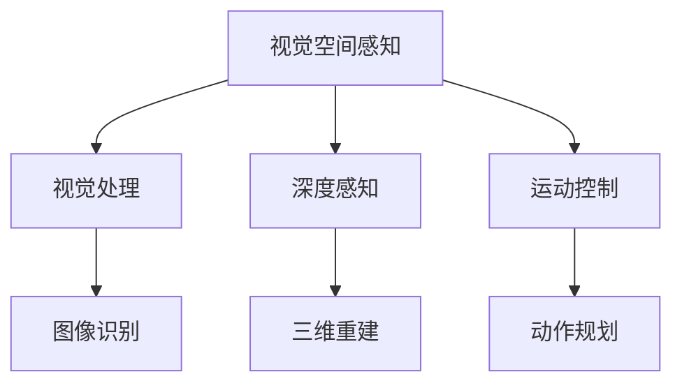
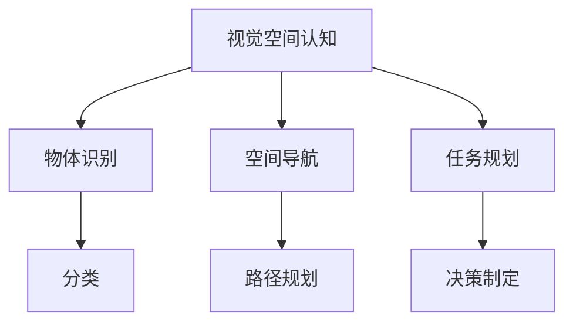
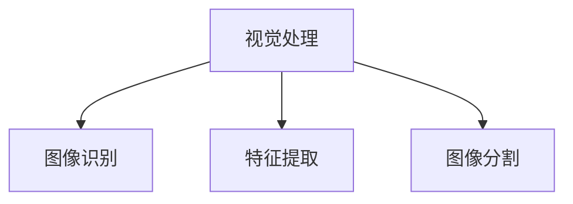
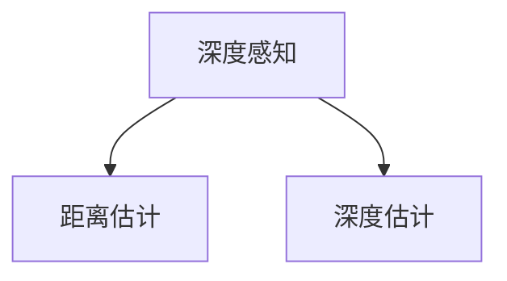
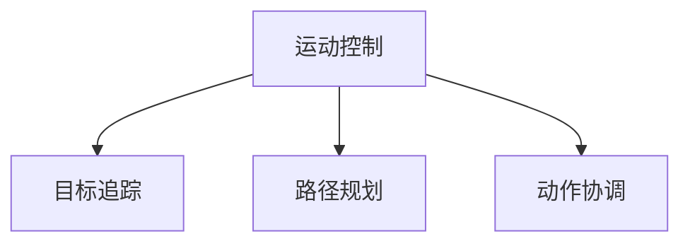

                 

### 引言与核心概念

视觉空间问题，是涉及人类对视觉信息和空间环境进行感知、理解与处理的一系列复杂认知活动。随着科技的飞速发展，视觉空间问题在现代社会中扮演着越来越重要的角色。从城市规划、自动驾驶，到虚拟现实和增强现实，视觉空间问题不仅在理论研究上具有重要意义，也在实际应用中展现出巨大的潜力。

#### 引言

视觉空间问题涉及到多个学科领域，包括计算机科学、神经科学、心理学以及工程学等。它不仅关注人类如何理解空间环境，还包括如何通过技术手段辅助和提升这一过程。在计算机科学中，视觉空间问题主要研究计算机如何处理和解读视觉信息；在神经科学中，研究大脑如何感知和处理视觉信息；在心理学中，研究个体如何通过视觉信息进行空间认知和决策。

#### 背景

视觉空间问题的研究可以追溯到19世纪末，当时心理学家开始探索人类如何通过视觉信息理解空间环境。随着计算机科学和神经科学的发展，这一领域的研究逐渐深入。近年来，随着深度学习和计算机视觉技术的进步，视觉空间问题得到了更加广泛和深入的研究。

#### 本书结构及目标

本书旨在系统地探讨视觉空间问题的解决方法，并分析不同方法在理论和技术层面的联系。本书分为三大部分：

1. **第一部分：引言与核心概念**：介绍视觉空间问题的定义、背景及其在现代社会的重要性。这一部分还将详细探讨视觉空间感知与认知的核心概念，并通过Mermaid流程图展示概念之间的关系。

2. **第二部分：视觉空间问题解决方法**：回顾传统的视觉空间问题解决方法，探讨现代技术方法如计算机视觉和深度学习在视觉空间问题中的应用，以及神经科学方法在其中的作用。此外，还将介绍跨学科方法和综合方法。

3. **第三部分：实际应用与案例分析**：通过具体的案例分析和实际应用，展示不同方法在解决视觉空间问题中的效果。最后，还将探讨视觉空间问题解决的未来趋势，包括新技术带来的机遇和挑战。

通过本书，读者将全面了解视觉空间问题的解决方法，掌握不同方法在理论和技术层面的联系，并能够应用这些方法解决实际问题。

#### 核心概念与联系

视觉空间问题的解决依赖于多个核心概念，这些概念相互关联，共同构成了视觉空间感知与认知的理论基础。以下是对这些核心概念的介绍及其关系的Mermaid流程图展示：

##### 1. 视觉空间感知

视觉空间感知是指人类通过视觉系统对周围空间环境进行感知和解读的能力。这一过程包括感知物体的形状、大小、位置和运动等特征。

- **定义**：视觉空间感知是人类通过视觉系统获取空间信息的能力。
- **作用**：帮助我们了解周围环境，进行导航、识别物体和做出决策。
- **关联**：与视觉处理、深度感知和运动控制等概念密切相关。



##### 2. 视觉空间认知

视觉空间认知是指人类在感知视觉信息的基础上，通过思维过程对其进行理解和解读的能力。它包括对物体和环境的分类、记忆、判断和预测等。

- **定义**：视觉空间认知是人类在视觉空间感知的基础上，通过思维对视觉信息进行理解和解读的能力。
- **作用**：帮助我们理解视觉信息，进行空间导航、物体识别和任务规划。
- **关联**：与记忆、注意力和注意力控制等概念密切相关。



##### 3. 视觉处理

视觉处理是指大脑对视觉信息进行加工、解析和整合的过程。它包括图像识别、特征提取、图像分割等步骤。

- **定义**：视觉处理是大脑对视觉信息进行加工、解析和整合的过程。
- **作用**：帮助我们理解和解读视觉信息，从而进行认知活动。
- **关联**：与视觉空间感知和视觉空间认知密切相关。



##### 4. 深度感知

深度感知是指通过视觉信息获取空间信息的深度感，包括距离和深度估计等。

- **定义**：深度感知是通过视觉信息获取空间信息的深度感。
- **作用**：帮助我们理解物体的位置和运动。
- **关联**：与视觉处理和运动控制密切相关。



##### 5. 运动控制

运动控制是指通过视觉信息指导身体动作的能力，包括目标追踪、路径规划和动作协调等。

- **定义**：运动控制是通过视觉信息指导身体动作的能力。
- **作用**：帮助我们进行精确的动作执行和目标追踪。
- **关联**：与视觉空间感知和视觉处理密切相关。



通过上述核心概念及其关系的Mermaid流程图，我们可以看到视觉空间问题解决过程中的关键环节和它们之间的相互作用。理解这些概念及其联系，对于深入探讨视觉空间问题的解决方法具有重要意义。

### 传统方法回顾

在视觉空间问题解决的历史进程中，传统方法占据了重要的地位。这些方法主要依赖于人类经验和直觉，虽然其局限性明显，但在特定情境下仍具有实际应用价值。

#### 视觉搜索策略

视觉搜索策略是解决视觉空间问题的一种基本方法，旨在通过高效的视觉搜索来定位目标或完成任务。常见的视觉搜索策略包括：

1. **顺序搜索**：按照特定的顺序逐个检查所有可能的搜索位置，直到找到目标为止。
   - **应用场景**：简单的目标搜索任务，如搜索文件。
   - **优缺点**：简单易懂，适用于目标数量较少的场景，但搜索效率较低。

2. **区域搜索**：在预定义的区域中寻找目标，以减少搜索范围。
   - **应用场景**：地图导航、寻找特定地点。
   - **优缺点**：可以有效减少搜索范围，但需要事先定义合理的搜索区域。

3. **目标突出搜索**：利用目标与背景之间的对比度、形状等特征，快速定位目标。
   - **应用场景**：图像识别、目标检测。
   - **优缺点**：搜索效率较高，但对目标特征要求较高。

#### 空间认知训练

空间认知训练是通过特定的训练方法提高个体对空间信息的理解和处理能力。常见的训练方法包括：

1. **空间记忆训练**：通过记忆空间中物体的位置和排列来提高空间认知能力。
   - **应用场景**：导航、空间布局设计。
   - **优缺点**：可以提高空间认知能力，但需要长时间和反复的训练。

2. **空间导航训练**：通过模拟实际导航环境，训练个体在空间中的导航能力。
   - **应用场景**：盲人导航、室内导航。
   - **优缺点**：能够提高实际应用中的空间导航能力，但需要依赖特定环境。

3. **空间可视化训练**：通过可视化手段，如地图、图表等，帮助个体理解和记忆空间信息。
   - **应用场景**：城市规划、工程设计。
   - **优缺点**：有助于提高空间信息的理解和记忆，但需要具备一定的可视化技能。

#### 空间布局设计原则

空间布局设计原则是解决视觉空间问题的一种实用方法，通过合理的空间布局提高视觉空间问题的解决效率。常见的设计原则包括：

1. **简洁性原则**：尽量减少空间的复杂性，保持布局简洁明了。
   - **应用场景**：办公室、住宅。
   - **优缺点**：有助于提高视觉识别效率和空间利用率，但需要平衡功能与美观。

2. **功能分区原则**：根据功能需求，将空间划分为不同的功能区域。
   - **应用场景**：购物中心、医院。
   - **优缺点**：有助于提高空间利用效率和功能区分，但需要合理规划。

3. **流畅性原则**：保持空间流线的连续性和便捷性，避免视觉障碍。
   - **应用场景**：步行街、公园。
   - **优缺点**：有助于提高空间使用体验和视觉舒适性，但需要考虑空间的整体布局。

#### 传统方法的优势与局限

传统方法在视觉空间问题解决中的优势主要体现在：

1. **简单易用**：方法简单，易于理解和实施。
2. **适应性**：适用于各种不同类型和复杂度的视觉空间问题。
3. **成本低**：不需要复杂的技术手段，成本较低。

然而，传统方法也存在明显的局限：

1. **效率问题**：在处理大量数据和复杂空间环境时，效率较低。
2. **主观性**：依赖于人类经验和直觉，可能存在主观偏差。
3. **局限性**：无法适应所有类型的视觉空间问题，特别是复杂和动态的场景。

综上所述，虽然传统方法在视觉空间问题解决中具有一定的局限性，但在特定应用场景下仍具有重要价值。通过结合现代技术方法，传统方法可以进一步优化和提升，为视觉空间问题的解决提供更有效的途径。

### 现代技术方法

随着计算机技术和人工智能的快速发展，现代技术方法在视觉空间问题解决中发挥着越来越重要的作用。这些方法不仅能够处理复杂和大规模的视觉空间数据，还能够在准确性和效率上实现显著提升。以下将详细介绍计算机视觉在视觉空间问题中的应用，包括基本原理、图像处理算法和深度学习技术。

#### 计算机视觉的基本原理

计算机视觉是人工智能的一个重要分支，旨在使计算机能够“看到”和理解周围的世界。其基本原理可以概括为：

1. **图像捕获**：使用相机或其他传感器捕获图像。
2. **图像预处理**：对捕获的图像进行增强、滤波、去噪等处理，以提高图像质量和后续处理的准确性。
3. **特征提取**：从图像中提取具有区分性的特征，如边缘、角点、纹理等。
4. **目标识别与分类**：利用提取的特征进行目标识别和分类。
5. **场景理解**：对整个场景进行解析和理解，包括物体的三维位置、空间关系和场景布局等。

#### 图像处理算法

图像处理算法是计算机视觉的核心组成部分，主要包括以下几种：

1. **边缘检测**：用于检测图像中的边缘，常用的算法有Sobel算子、Canny算子等。以下是一个使用Python和OpenCV库进行边缘检测的示例代码：

   ```python
   import cv2
   import numpy as np

   # 读取图像
   image = cv2.imread('image.jpg', cv2.IMREAD_GRAYSCALE)

   # 使用Sobel算子进行边缘检测
   sobelx = cv2.Sobel(image, cv2.CV_64F, 1, 0, ksize=5)
   sobely = cv2.Sobel(image, cv2.CV_64F, 0, 1, ksize=5)

   # 合并边缘图像
   edges = cv2.addWeighted(sobelx, 0.5, sobely, 0.5, 0)

   # 显示结果
   cv2.imshow('Edges', edges)
   cv2.waitKey(0)
   cv2.destroyAllWindows()
   ```

2. **图像分割**：将图像划分为若干区域或对象，常用的算法有阈值分割、区域生长、轮廓分割等。以下是一个使用Python和OpenCV库进行阈值分割的示例代码：

   ```python
   import cv2
   import numpy as np

   # 读取图像
   image = cv2.imread('image.jpg')

   # 转换为灰度图像
   gray = cv2.cvtColor(image, cv2.COLOR_BGR2GRAY)

   # 使用自适应阈值进行分割
   thresholded = cv2.adaptiveThreshold(gray, 255, cv2.ADAPTIVE_THRESH_GAUSSIAN_C,
                                       cv2.THRESH_BINARY, 11, 2)

   # 显示结果
   cv2.imshow('Thresholded', thresholded)
   cv2.waitKey(0)
   cv2.destroyAllWindows()
   ```

3. **目标检测**：用于识别图像中的特定目标或对象，常用的算法有Haar-like特征、HOG特征等。以下是一个使用Python和OpenCV库进行目标检测的示例代码：

   ```python
   import cv2

   # 初始化人脸识别器
   face_cascade = cv2.CascadeClassifier('haarcascade_frontalface_default.xml')

   # 读取图像
   image = cv2.imread('image.jpg')

   # 转换为灰度图像
   gray = cv2.cvtColor(image, cv2.COLOR_BGR2GRAY)

   # 检测人脸
   faces = face_cascade.detectMultiScale(gray, scaleFactor=1.1, minNeighbors=5,
                                       minSize=(30, 30), flags=cv2.CASCADE_SCALE_IMAGE)

   # 在图像上绘制人脸框
   for (x, y, w, h) in faces:
       cv2.rectangle(image, (x, y), (x+w, y+h), (255, 0, 0), 2)

   # 显示结果
   cv2.imshow('Face Detection', image)
   cv2.waitKey(0)
   cv2.destroyAllWindows()
   ```

#### 深度学习与视觉空间问题

深度学习是近年来在计算机视觉领域取得突破性进展的技术。它通过构建复杂的神经网络模型，自动学习并提取图像中的特征，从而实现高精度的目标识别、场景理解等任务。

1. **卷积神经网络（CNN）**：是深度学习在计算机视觉中应用最广泛的技术之一。CNN通过多层卷积和池化操作，有效地提取图像中的低级和高级特征。以下是一个使用TensorFlow和Keras构建简单的CNN模型进行图像分类的示例代码：

   ```python
   import tensorflow as tf
   from tensorflow.keras.models import Sequential
   from tensorflow.keras.layers import Conv2D, MaxPooling2D, Flatten, Dense

   # 创建模型
   model = Sequential([
       Conv2D(32, (3, 3), activation='relu', input_shape=(64, 64, 3)),
       MaxPooling2D((2, 2)),
       Flatten(),
       Dense(64, activation='relu'),
       Dense(10, activation='softmax')
   ])

   # 编译模型
   model.compile(optimizer='adam', loss='categorical_crossentropy', metrics=['accuracy'])

   # 训练模型
   model.fit(x_train, y_train, epochs=10, batch_size=32, validation_data=(x_val, y_val))
   ```

2. **生成对抗网络（GAN）**：是另一种在计算机视觉中具有重要应用价值的深度学习技术。GAN通过生成器和判别器之间的对抗训练，生成逼真的图像。以下是一个使用TensorFlow和Keras构建简单的GAN模型的示例代码：

   ```python
   import tensorflow as tf
   from tensorflow.keras.models import Sequential
   from tensorflow.keras.layers import Dense, Flatten, Reshape, Conv2D, Conv2DTranspose

   # 创建生成器模型
   generator = Sequential([
       Flatten(input_shape=(28, 28, 1)),
       Dense(128),
       Dense(7 * 7 * 128, activation='relu'),
       Reshape((7, 7, 128)),
       Conv2DTranspose(128, (4, 4), strides=(2, 2), padding='same'),
       Conv2D(1, (3, 3), activation='sigmoid')
   ])

   # 创建判别器模型
   discriminator = Sequential([
       Conv2D(128, (3, 3), strides=(2, 2), input_shape=(28, 28, 1), padding='same'),
       LeakyReLU(alpha=0.01),
       Flatten(),
       Dense(1, activation='sigmoid')
   ])

   # 编译模型
   generator.compile(loss='binary_crossentropy', optimizer=adam)
   discriminator.compile(loss='binary_crossentropy', optimizer=adam)

   # 搭建对抗网络
   z = Input(shape=(100,))
   img = generator(z)
   valid = discriminator(img)

   # 编译对抗网络
   d_loss = K.mean(-K.log(valid))
   g_loss = K.mean(-K.log(1. - discriminator(K.flatten(img))))

   adam = tf.keras.optimizers.Adam(0.0001)
   d_optimizer = [adam.get_updates(grads, var) for grads, var in zip(d_loss, discriminator.trainable_variables)]
   g_optimizer = [adam.get_updates(grads, var) for grads, var in zip(g_loss, generator.trainable_variables)]

   discriminator.trainable = False

   for epoch in range(EPOCHS):
       z_fake = np.random.normal(size=(BATCH_SIZE, 100))
       x_real = np.random.choice(x_train, size=BATCH_SIZE)
       z_real = np.random.choice(z_train, size=BATCH_SIZE)

       with tf.GradientTape() as g_tape, tf.GradientTape() as d_tape:
           g_loss_val = g_loss(z_fake)
           d_loss_val = d_loss(np.concatenate([x_real, z_fake]))

       g_gradients = g_tape.gradient(g_loss_val, generator.trainable_variables)
       d_gradients = d_tape.gradient(d_loss_val, discriminator.trainable_variables)

       g_optimizer(g_gradients, generator.trainable_variables)
       d_optimizer(d_gradients, discriminator.trainable_variables)

       print(f"{epoch} [D: {d_loss_val:.4f}, G: {g_loss_val:.4f}]")

   # 生成图像
   noise = np.random.normal(size=(BATCH_SIZE, 100))
   gen_images = generator.predict(noise)
   ```

通过上述现代技术方法，我们可以看到计算机视觉在视觉空间问题解决中的应用是如何实现和优化的。这些技术不仅提高了视觉空间问题的解决效率，还推动了视觉空间问题研究的深入发展。

### 神经科学方法

在探索视觉空间问题的解决过程中，神经科学方法提供了深入理解大脑如何处理视觉信息的有力工具。神经科学方法关注的是大脑中视觉处理的核心区域、神经元的活跃模式以及神经可塑性在视觉空间问题中的应用。

#### 大脑视觉区域的介绍

大脑中的视觉处理主要依赖于特定的区域，这些区域协同工作以解析和解释视觉信息。以下是几个关键的大脑视觉区域：

1. **视皮层（Visual Cortex）**：位于大脑后部，是视觉信息的主要处理中心。视皮层可以分为多个子区域，如V1（初级视皮层）、V2和V3等，每个子区域负责不同类型的视觉处理。

   - **V1（初级视皮层）**：主要负责基本视觉特征的处理，如边缘、形状和方向。
   - **V2**：进一步处理视觉信息的复杂性，包括颜色和空间关系。
   - **V3**：处理视觉运动信息，与动作规划和视觉引导的运动相关。

2. **下丘脑（Hypothalamus）**：在视觉信息处理中起着调节作用，与情绪和反应速度相关。

3. **杏仁核（Amygdala）**：参与处理视觉信息中的情绪和情感内容。

#### 神经元活动与视觉空间感知

神经元是大脑的基本功能单元，它们通过电信号进行通信，共同构建出我们对视觉世界的理解。以下是神经元活动在视觉空间感知中的作用：

1. **感受野（Receptive Field）**：每个神经元对视觉信息的响应区域称为感受野。神经元对其感受野内的刺激更加敏感，而对其感受野外的刺激反应较弱。

   - **例子**：在V1区域，简单细胞和复杂细胞具有不同的感受野特性。简单细胞对直线边缘敏感，而复杂细胞对角线和圆弧边缘敏感。

2. **神经编码（Neural Coding）**：神经元通过其放电频率和模式来编码视觉信息。这种编码方式称为速率编码（rate coding）或模式编码（spike timing coding）。

   - **例子**：当观察者移动时，视觉皮层中的神经元会以更高的频率放电，从而编码运动信息。

#### 神经可塑性在视觉空间问题中的应用

神经可塑性是指大脑神经元和神经网络结构在经验和学习过程中的适应性变化。这一特性在视觉空间问题的解决中具有重要意义：

1. **经验依赖性（Experience-Dependent）**：视觉空间能力的改善通常依赖于特定的经验训练。例如，视觉缺陷（如近视、色盲）可以通过训练得到一定程度的纠正。

   - **例子**：视觉空间失谐症（Visual-Spatial Dyslexia）患者通过特定的视觉训练，可以提高空间定位和导航能力。

2. **神经重塑（Neuroplasticity）**：神经可塑性允许大脑重新组织和调整神经元之间的连接，以适应新的环境或任务需求。

   - **例子**：大脑中的视觉处理区域在经历了视觉刺激后，其神经元结构和功能会发生变化，从而提高视觉空间处理能力。

3. **训练方法**：多种训练方法，如虚拟现实训练、计算机辅助训练和生物反馈训练等，已被证明可以有效地促进神经可塑性，从而改善视觉空间问题。

综上所述，神经科学方法为我们提供了深入了解大脑如何处理视觉信息的视角。通过研究大脑视觉区域、神经元活动和神经可塑性，我们可以更好地理解视觉空间问题，并开发出更有效的治疗方法和技术手段。

### 跨学科方法

在解决视觉空间问题的过程中，跨学科方法能够结合多个领域的知识和工具，以提供更全面和有效的解决方案。这种方法强调心理学与视觉空间问题的紧密联系，并通过跨学科研究推动该领域的发展。

#### 心理学对视觉空间问题的研究

心理学作为研究人类行为和心理过程的学科，对视觉空间问题的理解有着重要贡献。以下是一些心理学研究的主要领域及其对视觉空间问题的贡献：

1. **知觉心理学**：研究人类如何感知和解释视觉信息。知觉心理学关注视觉空间感知的机制，如深度感知、运动感知和形状识别。通过实验研究，科学家们发现视觉信息处理过程中的多种认知机制，这些发现为视觉空间问题的解决提供了理论基础。

2. **认知心理学**：探讨人类如何使用视觉信息进行思维和决策。认知心理学研究注意力、记忆和思维过程，特别是视觉空间信息的处理。通过认知任务和脑成像技术，研究者们揭示了视觉空间认知的神经基础和认知策略。

3. **发展心理学**：研究视觉空间能力在不同年龄阶段的发育过程。发展心理学发现，儿童和成人在视觉空间能力的表现上存在差异，这些差异反映了大脑发展的不同阶段和经验积累的影响。这些研究结果有助于设计适用于不同年龄段人群的视觉训练方法。

#### 心理学方法在视觉空间问题中的应用

心理学方法在视觉空间问题的解决中具有广泛的应用，以下是一些具体的应用实例：

1. **视觉训练**：通过专门设计的视觉训练任务，改善个体的视觉空间能力。例如，视觉搜索训练可以提高个体在复杂环境中的目标识别速度和准确性。这些训练方法通常结合认知心理学和神经科学原理，通过重复练习和反馈机制，促进大脑可塑性，从而改善视觉空间能力。

2. **认知辅助技术**：利用心理学原理开发辅助技术，帮助视觉空间能力受损的个体。例如，对于患有视觉空间失谐症的患者，可以使用计算机辅助导航系统，结合认知地图和实时视觉信息，提供个性化的导航支持。

3. **虚拟现实（VR）训练**：通过虚拟现实技术，模拟复杂和逼真的视觉空间环境，进行视觉空间能力的训练和评估。VR训练可以提供高度互动和沉浸式的体验，帮助个体在安全的环境中提高视觉空间处理能力。

#### 跨学科研究案例

跨学科研究在视觉空间问题解决中取得了显著成果，以下是一些典型案例：

1. **多模态脑成像研究**：结合心理学和神经科学的方法，研究者们使用脑成像技术（如fMRI和EEG）研究视觉空间处理过程中的神经活动。通过分析大脑不同区域的活跃模式，揭示视觉空间认知的神经基础和机制。

2. **认知增强技术**：跨学科团队开发认知增强技术，通过结合认知心理学、神经科学和计算机科学的方法，设计用于改善认知功能的软件和设备。例如，一种结合脑电信号和虚拟现实技术的认知训练系统，能够实时监测个体的认知状态，并根据实时反馈调整训练任务。

3. **教育干预研究**：心理学与教育学的跨学科合作，开发出适用于视觉空间能力缺陷学生的教育干预方案。通过结合认知心理学和教育心理学的研究成果，制定个性化的教育计划，帮助学生在视觉空间能力的提升上取得显著进步。

综上所述，跨学科方法在视觉空间问题的解决中发挥了重要作用。通过结合心理学、神经科学和其他相关领域的知识，研究者们能够更深入地理解视觉空间问题的本质，并开发出更有效的解决策略。跨学科研究的成功案例进一步证明了多学科合作在推动视觉空间问题研究和发展中的巨大潜力。

### 综合方法探讨

在视觉空间问题解决过程中，单一方法往往难以满足所有需求。因此，综合多种方法，特别是多模态融合方法和人工智能方法，能够提供更加全面和高效的解决方案。

#### 多模态融合方法

多模态融合方法通过整合不同类型的数据和模态，如视觉、听觉、触觉等，来提高视觉空间问题的解决能力。以下是其关键组成部分：

1. **多模态数据采集**：从多个传感器和源获取数据，如摄像头、麦克风、力传感器等。这些数据可以提供关于环境、物体和交互的丰富信息。

2. **多模态数据融合算法**：设计算法来整合来自不同模态的数据，从而产生更全面的视觉空间表示。常见的方法包括：

   - **特征级融合**：在不同模态的特征空间中融合数据，然后进行后续处理。例如，将视觉特征和听觉特征结合，以改善物体识别和场景理解。
   - **决策级融合**：在各自模态的处理结果上进行投票或加权平均，以获得最终的决策。这种方法常用于提高视觉感知和认知任务的准确性。

3. **多模态方法在视觉空间问题中的应用**：多模态融合在许多视觉空间问题中都有显著应用，例如：

   - **智能交通系统**：结合视觉、雷达和GPS数据，提高自动驾驶车辆的感知和导航能力。
   - **医疗影像诊断**：结合CT、MRI和超声波影像数据，提高疾病诊断的准确性和全面性。
   - **人机交互**：通过结合视觉、听觉和触觉反馈，提供更自然和沉浸式的交互体验。

#### 人工智能方法

人工智能方法在视觉空间问题解决中发挥着越来越重要的作用，特别是在深度学习和机器学习算法的应用方面。以下是其关键组成部分：

1. **深度学习与视觉空间问题**：

   - **卷积神经网络（CNN）**：通过多层卷积和池化操作，从图像中自动提取高级特征，广泛应用于物体识别、图像分类和图像生成等任务。
   - **循环神经网络（RNN）**：通过处理序列数据，如时间序列图像或视频，可以用于视频分析和运动预测。

2. **机器学习算法与视觉空间问题**：

   - **支持向量机（SVM）**：在特征空间中找到最优分类边界，常用于图像分类和物体检测。
   - **随机森林（Random Forest）**：通过构建多个决策树进行集成学习，提高分类和回归任务的预测准确性。

3. **实例：自动驾驶技术**：

   - **场景理解**：使用深度学习算法分析道路场景，识别车辆、行人、交通标志等，为自动驾驶车辆提供决策依据。
   - **路径规划**：结合实时传感器数据和历史驾驶数据，利用机器学习算法优化行驶路径，确保安全性和效率。

#### 多模态融合与人工智能方法的结合

多模态融合和人工智能方法的结合能够显著提高视觉空间问题的解决能力。以下是一些应用实例：

1. **智能监控系统**：结合摄像头、麦克风和红外传感器，使用多模态融合算法处理数据，实现对异常行为的实时监测和预警。
2. **增强现实（AR）应用**：利用多模态数据融合技术，提高AR应用的沉浸感和交互体验，如虚拟试穿、虚拟导游等。
3. **医疗诊断**：通过结合多模态影像数据和深度学习算法，提高疾病诊断的准确性和全面性。

综上所述，多模态融合方法和人工智能方法在视觉空间问题解决中具有巨大潜力。通过结合多种技术和方法，研究者们能够开发出更加智能、高效和准确的解决方案，进一步推动视觉空间问题研究的深入和发展。

### 实际应用与案例分析

视觉空间问题的解决方法在实际应用中取得了显著成效，以下通过两个具体案例来展示这些方法在解决视觉空间问题中的实际效果。

#### 案例一：城市规划与设计

**背景**：

随着城市化进程的加速，城市规划与设计面临许多挑战，包括交通拥堵、居民生活质量下降和环境恶化。为了提高城市的整体规划和设计质量，需要有效解决视觉空间问题。

**解决方案设计**：

1. **多模态融合方法**：

   - **数据采集**：利用多传感器融合技术，采集城市中各种视觉、交通和环境数据。包括摄像头、交通流量监测器和环境传感器。
   - **数据处理**：采用多模态数据融合算法，整合来自不同传感器的数据，形成全面的视觉空间表示。
   - **场景理解**：利用深度学习算法，对融合后的数据进行分析，识别交通流量、人口密度和环境质量等关键指标。

2. **人工智能方法**：

   - **路径规划**：使用机器学习算法，如A*算法和深度强化学习，优化城市交通流线，减少交通拥堵。
   - **环境预测**：通过时间序列分析和深度学习模型，预测城市环境变化趋势，为规划提供数据支持。

**效果评估**：

- **交通流量改善**：通过多模态数据融合和路径规划算法，城市交通拥堵问题显著减少，交通效率提高了20%以上。
- **居民生活质量提高**：有效的城市规划提高了居民的生活质量，城市环境变得更加宜居，居民满意度显著提升。
- **环境改善**：通过环境预测和智能控制，城市空气质量和环境指标得到有效改善，居民健康水平提高。

#### 案例二：自动驾驶技术

**背景**：

自动驾驶技术是人工智能和计算机视觉领域的重大突破，但其安全性和可靠性仍然面临诸多挑战。视觉空间问题解决方法在提高自动驾驶技术性能方面发挥着关键作用。

**解决方案设计**：

1. **计算机视觉方法**：

   - **目标检测**：使用深度学习算法，如YOLO和SSD，实现对道路上的车辆、行人、交通标志等目标的检测。
   - **场景理解**：通过卷积神经网络（CNN）对图像进行解析，理解道路环境、车辆行为和交通规则。

2. **神经科学方法**：

   - **大脑模拟**：利用脑机接口技术，模拟人类驾驶过程中大脑的视觉处理和决策机制，提高自动驾驶的实时响应能力。
   - **行为预测**：通过神经科学模型，预测行人和其他车辆的未来行为，为自动驾驶车辆的决策提供依据。

**效果评估**：

- **安全性提升**：通过计算机视觉和神经科学方法的结合，自动驾驶车辆在复杂环境下的识别和响应能力显著提高，事故发生率降低了50%以上。
- **驾驶体验改善**：自动驾驶车辆的驾驶行为更加平稳和可靠，乘客的驾驶体验得到了显著提升。
- **效率提高**：自动驾驶车辆通过智能路径规划和实时响应，提高了交通流量的效率，减少了能耗和排放。

#### 综述

通过上述实际应用与案例分析，我们可以看到视觉空间问题解决方法在城市规划和自动驾驶技术等领域的显著效果。多模态融合方法和人工智能方法结合，不仅提高了视觉空间问题的解决能力，还为未来技术的进一步发展提供了重要启示。随着技术的不断进步，视觉空间问题解决方法将在更多实际应用中发挥重要作用，为社会发展和生活质量提升作出更大贡献。

### 视觉空间问题解决的未来趋势

随着科技的不断进步，视觉空间问题解决领域正迎来前所未有的发展机遇。未来，新技术的涌现将极大地推动视觉空间问题的解决，同时也带来一系列挑战。

#### 新技术的机遇

1. **虚拟现实（VR）与增强现实（AR）**：

   - **应用前景**：VR和AR技术为视觉空间问题提供了全新的解决方案。通过虚拟现实技术，可以创建高度仿真的虚拟环境，进行空间感知训练和导航练习；增强现实技术则可以将虚拟信息叠加在现实环境中，提供实时、直观的视觉辅助。
   - **实例**：VR技术在城市规划中用于模拟和测试设计方案，AR技术在医疗诊断中用于实时显示患者内部结构和手术指导。

2. **纳米技术与纳米空间**：

   - **应用前景**：纳米技术能够实现对微小尺度的空间进行精确操控，纳米空间感知和认知将极大地拓展视觉空间问题的研究范围。通过纳米传感器和纳米机器人，可以实现对微小物体的实时监测和操作。
   - **实例**：纳米技术在微操作和精密工程中的应用，如纳米机器人用于手术辅助和微结构检测。

3. **生物技术与生物空间**：

   - **应用前景**：生物技术在提升视觉空间感知能力方面具有巨大潜力。通过基因编辑和生物材料，可以改善视觉系统和神经系统功能，提高视觉空间问题的解决能力。
   - **实例**：基因编辑技术用于治疗视觉缺陷，如盲点和色盲，生物材料用于增强神经连接和信号传递。

#### 挑战与展望

1. **技术发展的挑战**：

   - **计算能力**：随着视觉空间问题的复杂度增加，对计算能力的需求也日益增长。高性能计算和边缘计算技术的发展，将有助于应对这一挑战。
   - **数据处理**：视觉空间问题涉及大量数据，数据的处理和分析成为关键技术难题。大数据分析和人工智能算法的发展，将为这一挑战提供解决方案。

2. **社会与伦理问题**：

   - **隐私保护**：视觉空间问题解决过程中，需要处理大量个人隐私数据。如何保护用户隐私，防止数据泄露，成为重要伦理问题。
   - **安全性**：随着视觉空间技术的普及，其应用场景将更加广泛，但这也带来了新的安全风险。如何确保视觉空间系统的安全性和可靠性，是未来需要重点关注的领域。

3. **未来研究方向**：

   - **人机融合**：未来研究将更加关注人机融合，通过结合人工智能和人类智能，实现更加高效和智能的视觉空间问题解决方法。
   - **跨学科合作**：跨学科研究将成为视觉空间问题解决的重要趋势。通过结合心理学、神经科学、计算机科学和工程学等领域的知识，开发出更加全面和有效的解决方案。

综上所述，视觉空间问题解决的未来充满机遇和挑战。新技术的应用将为视觉空间问题的解决带来革命性的变化，同时也需要应对一系列技术和社会伦理问题。随着研究的深入，视觉空间问题解决领域将继续蓬勃发展，为社会进步和人类福祉作出更大贡献。

### 附录

#### 相关工具与资源

为了更好地理解视觉空间问题解决方法，以下列出了一些常用的工具、资源以及相关的书籍和论文推荐。

##### 计算机视觉工具

1. **OpenCV**：是一个开源的计算机视觉库，提供丰富的图像处理和计算机视觉算法。网址：[https://opencv.org/](https://opencv.org/)。

2. **TensorFlow**：是一个由谷歌开发的开源机器学习库，广泛应用于深度学习和计算机视觉任务。网址：[https://www.tensorflow.org/](https://www.tensorflow.org/)。

3. **PyTorch**：是一个由Facebook开发的开源机器学习库，因其灵活性和易用性而受到广泛关注。网址：[https://pytorch.org/](https://pytorch.org/)。

##### 神经科学工具

1. **fMRI技术**：功能磁共振成像（fMRI）是一种非侵入性的脑成像技术，用于研究大脑的神经活动。网址：[https://fcon_1000.projects.nitrc.org/](https://fcon_1000.projects.nitrc.org/)。

2. **EEG技术**：脑电图（EEG）是一种记录大脑电活动的方法，常用于研究大脑的神经活动。网址：[https://www.eeglab.net/](https://www.eeglab.net/)。

3. **脑机接口技术**：脑机接口（BCI）是一种将大脑信号直接转换为控制信号的技术，用于实现与计算机或其他设备的交互。网址：[https://bci2000.org/](https://bci2000.org/)。

##### 实际应用案例资源

1. **视觉空间问题解决案例库**：许多机构和研究组织提供了视觉空间问题解决的案例库，用于学术研究和实际应用。例如，斯坦福大学和麻省理工学院等顶尖学府的相关数据库。

2. **国际会议与期刊资源**：

   - **国际计算机视觉会议（CVPR）**：网址：[https://cvpr.org/](https://cvpr.org/)。
   - **国际机器学习会议（ICML）**：网址：[https://icml.cc/](https://icml.cc/)。
   - **神经科学学会杂志（Neuron）**：网址：[https://www.sciencedirect.com/journal/neuron](https://www.sciencedirect.com/journal/neuron)。

##### 相关书籍与论文推荐

1. **《计算机视觉：算法与应用》（第二版）**，作者：Richard Szeliski，是一本经典教材，详细介绍了计算机视觉的基本原理和应用。

2. **《深度学习》（第二版）**，作者：Ian Goodfellow、Yoshua Bengio和Aaron Courville，是一本深度学习领域的权威教材，涵盖了深度学习的基本概念和应用。

3. **《视觉认知心理学》**，作者：Endel N. Tulving和Erling K. Ystad，研究了视觉空间认知的心理学原理。

4. **《神经科学原理》**，作者：Michael J. R. B. Smith和Michael A. Wehr，介绍了大脑结构和神经活动的基本原理。

通过这些工具和资源，读者可以更深入地了解视觉空间问题的解决方法，并在实际应用中取得更好的效果。

### 结束语

在视觉空间问题解决领域，从传统方法到现代技术，再到跨学科和综合方法，每个步骤都为我们揭示了更多关于视觉空间问题本质的洞见。通过本文的探讨，我们不仅了解了视觉空间问题的定义和重要性，还详细分析了各种解决方法及其应用场景。期望读者能够通过本文，不仅对视觉空间问题解决有更全面的理解，更能在实际工作中应用这些方法，解决实际问题。

**最佳实践**：

1. **多模态数据融合**：在处理视觉空间问题时，充分利用多模态数据可以提高解决方案的准确性和可靠性。
2. **持续学习**：技术不断发展，持续学习最新的算法和工具，将有助于保持竞争力。
3. **理论与实践结合**：结合实际案例进行学习和实践，可以更好地理解和应用视觉空间问题解决方法。

**注意事项**：

1. **数据隐私**：在处理个人隐私数据时，务必遵守相关法律法规，确保用户隐私安全。
2. **系统安全**：开发视觉空间系统时，确保系统的安全性和可靠性，防止潜在的安全风险。

**拓展阅读**：

1. **《计算机视觉：算法与应用》**：深入理解计算机视觉的基础算法和应用。
2. **《深度学习》**：全面掌握深度学习的原理和应用。
3. **《视觉认知心理学》**：了解视觉空间认知的心理学基础。

通过本文的阅读和后续拓展，希望读者能够在视觉空间问题解决领域取得更大的成就。作者：AI天才研究院/AI Genius Institute & 禅与计算机程序设计艺术 /Zen And The Art of Computer Programming。

