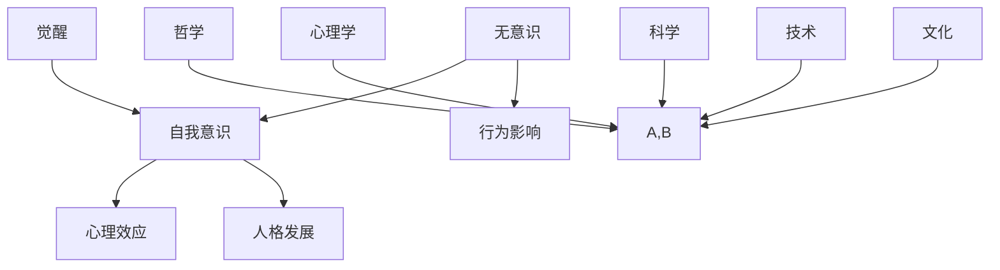

                 

### 《觉醒的过程：从无意识到自我意识的旅程》

> 关键词：无意识，自我意识，觉醒，哲学，心理学，科学

> 摘要：本文通过深入探讨无意识和自我意识的本质及其关系，揭示觉醒的过程。从哲学、心理学和科学的视角出发，分析了自我觉醒的标志、障碍和方法，以及自我意识的成长和觉醒对心理健康的影响。最后，探讨了个人觉醒的实践、集体觉醒的可能性，以及觉醒的未来展望。

---

### 第一部分：引言

#### 第1章：觉醒的哲学背景

**1.1 意识的本质**

意识，作为人类思维的核心，一直是哲学、心理学和科学研究的焦点。从无意识到自我意识，人类经历了漫长的觉醒过程。无意识，可以看作是意识的基础，它包含了人类行为和思维中的潜藏部分。自我意识，则是个体对自己存在的认知和感知，它标志着人类从被动到主动的质变。

无意识与自我意识的定义：

- **无意识**：指个体无法直接感知的心理活动，包括潜意识、习惯性行为、情感反应等。
- **自我意识**：指个体对自己存在的认知和感知，包括自我认知、自我评价、自我决策等。

无意识理论的发展：

- **弗洛伊德**：将无意识视为人类心理活动的核心，提出了潜意识理论。
- **荣格**：扩展了无意识的概念，提出了集体无意识理论。
- **皮亚杰**：从认知发展的角度，探讨了无意识与自我意识的关系。

**1.2 自我意识的起源**

自我意识的起源，可以从进化和心理学的角度来探讨。

- **进化角度**：自我意识可能是为了提高个体在环境中的适应能力而演化出来的。它有助于个体更好地理解自己和环境，做出更有效的决策。

- **心理学角度**：自我意识的发展与儿童的认知发展密切相关。在婴儿期，个体主要通过反射行为来适应环境。随着认知能力的发展，个体逐渐形成自我意识。

心理学研究对自我意识的解释：

- **自我决定论**：强调个体自我意识的重要性，认为自我意识是个体行为和决策的核心。
- **社会认知论**：认为自我意识是个体通过社会互动和自我反思而形成的。

#### 第2章：无意识与自我意识的关系

**2.1 无意识的力量**

无意识在行为中的影响：

- **习惯性行为**：无意识习惯可以节省认知资源，提高行为效率。
- **情感反应**：无意识情感反应可以影响个体的情绪和行为。

无意识的定义：

- **无意识**：指个体无法直接感知的心理活动，包括潜意识、习惯性行为、情感反应等。

无意识对行为的影响：

- **行为预测**：无意识行为可以预测个体的未来行为。
- **行为修正**：无意识行为可以修正个体的错误行为。

**2.2 自我意识的作用**

自我意识的概念：

- **自我意识**：指个体对自己存在的认知和感知，包括自我认知、自我评价、自我决策等。

自我意识的功能：

- **自我认知**：个体了解自己的优点、缺点、兴趣、需求等。
- **自我评价**：个体对自己的行为、决策进行评价。
- **自我决策**：个体根据自己的认知和评价做出决策。

---

### 第二部分：觉醒的过程

#### 第3章：从无意识到觉醒

**3.1 自我觉醒的标志**

自我觉醒的定义：

- **自我觉醒**：指个体从无意识到自我意识的转变过程。

自我觉醒的常见表现：

- **自我认知的提升**：个体开始更深入地了解自己，包括自己的优点、缺点、价值观等。
- **自我反思的能力**：个体能够对自己的行为和决策进行反思，从中学到经验教训。
- **自我控制的能力**：个体能够更好地控制自己的情绪和行为，做出更理性的决策。

**3.2 自我觉醒的障碍**

内在的恐惧：

- **恐惧死亡**：无意识中的恐惧，使个体害怕面对死亡。
- **恐惧失败**：无意识中的恐惧，使个体害怕失败和挑战。

外在的阻碍：

- **社会压力**：社会的期望和压力，使个体难以自我觉醒。
- **文化束缚**：文化中的传统和习俗，使个体难以突破无意识的束缚。

**3.3 自我觉醒的方法**

冥想：

- **冥想**：通过冥想，个体可以减少无意识的影响，提高自我意识。

深度沟通：

- **深度沟通**：通过与他人深入的交流和反思，个体可以更好地理解自己，实现自我觉醒。

---

### 第三部分：自我意识的成长

#### 第4章：自我意识的成长

**4.1 自我认知的提升**

自我认知的步骤：

1. **自我观察**：通过自我观察，个体可以了解自己的行为、思维和情感。
2. **自我反思**：通过自我反思，个体可以分析自己的行为和思维，找出其中的问题和不足。
3. **自我修正**：通过自我修正，个体可以改变自己的行为和思维，提高自我认知。

自我认知的误区：

1. **过度自我批评**：过度自我批评可能导致自我否定和自我怀疑。
2. **自我逃避**：自我逃避可能导致个体回避问题，难以提高自我认知。

**4.2 自我意识的发展**

自我意识的层次：

1. **初级自我意识**：个体能够基本了解自己的优点和缺点。
2. **中级自我意识**：个体能够深入理解自己的内心世界，包括情感、动机和价值观。
3. **高级自我意识**：个体能够超越自我，理解他人，实现自我与他人的一体化。

自我意识与人格发展：

1. **自我意识与性格**：自我意识影响个体的性格形成，如外向、内向、敏感等。
2. **自我意识与人际关系**：自我意识影响个体的人际关系，如沟通、合作、冲突等。

---

### 第四部分：觉醒与心理健康

#### 第5章：觉醒与心理健康

**5.1 自我觉醒对心理健康的影响**

自我觉醒的心理效应：

1. **情绪稳定**：自我觉醒有助于个体更好地管理情绪，减少焦虑和抑郁。
2. **心理韧性**：自我觉醒有助于个体增强心理韧性，应对生活中的挑战和压力。

自我觉醒与心理疾病的关系：

1. **预防心理疾病**：自我觉醒有助于个体预防心理疾病，如焦虑症、抑郁症等。
2. **治疗心理疾病**：自我觉醒有助于个体治疗心理疾病，如认知行为疗法。

**5.2 心理健康的觉醒策略**

心理调适的方法：

1. **正念冥想**：通过正念冥想，个体可以减少无意识的影响，提高自我意识。
2. **心理辅导**：通过心理辅导，个体可以了解自己的心理问题，找到合适的解决方法。

心理健康的维护：

1. **健康生活方式**：保持健康的生活方式，如规律作息、合理饮食、适量运动等。
2. **积极心态**：保持积极的心态，对待生活中的挑战和困难。

---

### 第五部分：觉醒的实践

#### 第6章：个人觉醒的实践

**6.1 个人觉醒的步骤**

确定觉醒的目标：

- **目标明确**：明确自己的觉醒目标，如提升自我认知、改善人际关系等。

制定觉醒计划：

- **计划详细**：制定详细的觉醒计划，包括具体的行动步骤和时间安排。

**6.2 个人觉醒的案例**

成功的觉醒故事：

- **案例1**：一位职场人士通过自我觉醒，提升了工作效率，改善了人际关系，实现了职业发展和个人成长。

失败的觉醒教训：

- **案例2**：一位青年在追求觉醒的过程中，由于方法不当，导致心理压力增大，最终放弃觉醒。

---

### 第六部分：集体觉醒的可能性

#### 第7章：集体觉醒的可能性

**7.1 集体觉醒的概念**

集体觉醒的定义：

- **集体觉醒**：指整个社会或群体从无意识到自我意识的过程。

集体觉醒的重要性：

- **社会和谐**：集体觉醒有助于促进社会和谐，减少冲突和矛盾。
- **可持续发展**：集体觉醒有助于推动社会的可持续发展，实现人与自然的和谐共生。

**7.2 集体觉醒的路径**

教育体系的觉醒：

- **教育改革**：通过教育改革，培养个体的自我意识和自我觉醒能力。
- **课程设置**：在课程设置中，增加自我意识、心理学、哲学等课程。

社会文化的觉醒：

- **文化传播**：通过文化传播，推广自我意识和自我觉醒的理念。
- **公共活动**：组织各种公共活动，促进社会成员之间的交流和反思。

---

### 第七部分：觉醒的未来

#### 第8章：觉醒的未来

**8.1 科学与哲学的融合**

当代科学对觉醒的研究：

- **神经科学**：通过神经科学的研究，了解觉醒的神经机制。
- **心理学**：通过心理学的研究，探索觉醒的心理过程。

哲学对觉醒的探索：

- **存在主义**：存在主义哲学强调个体的自我意识和自我选择。
- **东方哲学**：东方哲学强调内在的自我觉醒，如禅宗的修行。

**8.2 未来觉醒的展望**

技术对觉醒的影响：

- **人工智能**：人工智能的发展，有助于个体更好地理解自己，实现自我觉醒。
- **虚拟现实**：虚拟现实技术的发展，为个体提供了探索自我意识的新途径。

未来觉醒的可能性：

- **自我超越**：未来觉醒，将有助于个体超越自我，实现更高的自我意识和自我价值。
- **全球觉醒**：未来觉醒，将有助于全球社会的和谐发展和可持续发展。

---

### 结论

#### 第9章：觉醒的意义

**9.1 自我觉醒对个人成长的影响**

自我觉醒与个人成长的关系：

- **自我觉醒**：有助于个体更好地了解自己，实现个人成长。
- **个人成长**：是自我觉醒的基础和动力。

自我觉醒的长期影响：

- **自我认知的提升**：长期的自我觉醒，有助于个体不断提升自我认知，实现自我完善。
- **心理健康的维护**：长期的自我觉醒，有助于个体保持心理健康，应对生活中的挑战。

**9.2 自我觉醒对社会的影响**

集体觉醒对社会发展的意义：

- **社会和谐**：集体觉醒有助于促进社会和谐，减少冲突和矛盾。
- **可持续发展**：集体觉醒有助于推动社会的可持续发展，实现人与自然的和谐共生。

自我觉醒与全球问题：

- **环境保护**：自我觉醒有助于个体认识到环境保护的重要性，积极参与环境保护行动。
- **社会公正**：自我觉醒有助于个体认识到社会公正的重要性，推动社会的公正发展。

---

#### 第10章：我们的觉醒之旅

**10.1 自我觉醒的旅程**

自我觉醒的旅程概述：

- **旅程起点**：从无意识到自我意识的觉醒。
- **旅程过程**：通过自我认知、自我反思、自我修正等步骤，不断提升自我意识。
- **旅程终点**：实现自我超越，达到更高的自我意识和自我价值。

自我觉醒的旅程中的挑战与收获：

- **挑战**：面对内在的恐惧和外在的阻碍，需要勇气和毅力。
- **收获**：通过自我觉醒，个体可以获得自我认知的提升、心理健康的维护，以及个人成长和发展的动力。

**10.2 呼唤觉醒**

个人觉醒的号召：

- **呼吁自我认知**：鼓励每个人认识到自我觉醒的重要性，主动提升自我认知。
- **鼓励自我反思**：鼓励每个人在面对挑战时，勇于自我反思，从中学到经验教训。

集体觉醒的号召：

- **推动社会变革**：呼吁社会变革，培养个体的自我意识和自我觉醒能力。
- **实现全球和谐**：呼吁全球社会共同觉醒，推动社会的和谐发展和可持续发展。

---

### 核心概念与联系架构 Mermaid 流程图



### 核心算法原理讲解 Python 源代码示例

```python
import numpy as np

# 模拟无意识到自我意识的觉醒过程
class AwakeningProcess:
    def __init__(self, initial_awareness):
        self.awareness = initial_awareness
    
    def evolve_awareness(self, growth_factor):
        # 意识觉醒过程
        self.awareness += growth_factor * (1 - self.awareness)
        return self.awareness

# 初始觉醒水平
initial_awareness = 0.5

# 实例化觉醒过程
awakening_process = AwakeningProcess(initial_awareness)

# 模拟觉醒过程
growth_factor = 0.1
for i in range(10):
    awareness_level = awakening_process.evolve_awareness(growth_factor)
    print(f"Step {i+1}: Awareness Level = {awareness_level:.2f}")

# 意识觉醒的数学模型
def awareness_model(initial_awareness, growth_factor, steps):
    awareness_levels = [initial_awareness]
    for _ in range(steps):
        awareness_levels.append(awareness_levels[-1] + growth_factor * (1 - awareness_levels[-1]))
    return awareness_levels

# 模拟觉醒过程，输出觉醒水平
awareness_levels = awareness_model(initial_awareness, growth_factor, 10)
for i, level in enumerate(awareness_levels):
    print(f"Step {i+1}: Awareness Level = {level:.2f}")
```

---

**作者：AI天才研究院/AI Genius Institute & 禅与计算机程序设计艺术 /Zen And The Art of Computer Programming**

